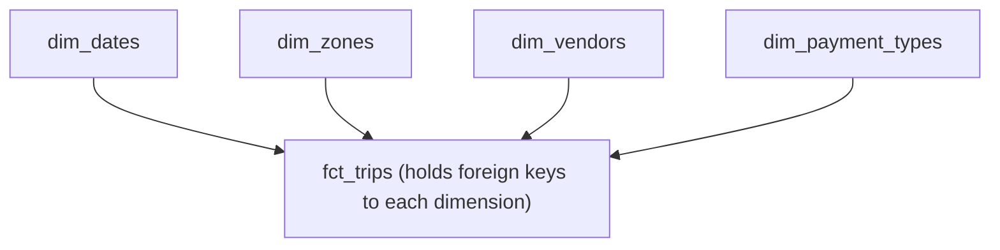

# 02 — Medium Guide: Warehousing, Analytics Engineering, Data Modeling

**Topics covered:** BigQuery; dbt and analytics engineering; data platforms (Bruin)

**Time:** 3–4 weeks at 8–10 hrs/week
**Goal:** Stop thinking like a script writer. Start thinking like a data modeler. By the end you can design a multi-source warehouse with proper layering, testing, and documentation.

## What You'll Be Able to Do After This Tier

- Design partitioned, clustered BigQuery tables that cost cents instead of dollars to query
- Write production-quality dbt projects with staging/marts layering
- Apply dimensional modeling (star schema, slowly changing dimensions) correctly
- Add data tests that catch real bugs before they hit dashboards
- Generate documentation that non-engineers can actually use
- Understand where the industry is heading (consolidated platforms like Bruin)

This tier is where DE thinking diverges sharply from "I write scripts." Beginners write pipelines. Mid-level engineers design *data products*.

---

## Week 1 — Data Warehousing with BigQuery

### What a Data Warehouse Actually Is

A warehouse is built differently from a transactional database:

| Feature | Postgres / MySQL (OLTP) | BigQuery / Snowflake (OLAP) |
|---|---|---|
| Storage | Row-oriented | Column-oriented |
| Optimized for | Many small writes, point lookups | Few large reads, aggregations |
| Compute | Tightly coupled to storage | Separated from storage |
| Scaling | Vertical (bigger box) | Horizontal (more workers) |
| Indexes | Critical | Almost nonexistent |
| Joins | Cheap on indexed columns | More expensive — design data to avoid |

Why columnar matters: when you do `SELECT SUM(revenue) FROM sales`, a row store reads every byte of every row even though you only need one column. A column store reads only the `revenue` column. On a 1TB table with 100 columns, that's roughly a 100x speedup.

Why separated compute matters: you scale up compute for an hour to run a heavy query, then scale back down. You pay for queries, not idle servers. This is the financial model that makes warehouses 10x cheaper than they used to be.

### What to Learn

1. **Loading data into BigQuery**
   - From a GCS file (most common in production)
   - From a streaming source (Pub/Sub → BigQuery)
   - External tables (query GCS files directly without loading)

2. **Partitioning**
   - Splits a table into chunks based on a column (almost always a date)
   - Queries with a `WHERE` filter on the partition column scan only matching partitions
   - On a daily-partitioned table with 365 days of data, a `WHERE date = '2024-06-15'` reads 1/365th of the data
   - You **must** filter on the partition column. If you don't, BigQuery scans everything.

3. **Clustering**
   - Within each partition, BigQuery sorts data by your clustering columns
   - Filters on clustering columns prune scanned bytes further
   - You can cluster on up to 4 columns; pick the ones you filter on most often
   - Clustering is free; partitioning has limits (4000 partitions per table)

4. **Query cost optimization**
   - BigQuery charges per byte scanned (~$5/TB)
   - Use the "estimated bytes" indicator in the query editor before running
   - Avoid `SELECT *` — name the columns you need
   - Don't use `LIMIT` as cost control — it doesn't reduce bytes scanned for most queries
   - Materialized views and table snapshots for expensive recurring queries

5. **Window functions**
   These are the SQL skill that separates mid-level from junior. Master them now.
   ```sql
   SELECT
     trip_id,
     pickup_datetime,
     fare_amount,
     -- ranking within each day
     ROW_NUMBER() OVER (PARTITION BY DATE(pickup_datetime) ORDER BY fare_amount DESC) as fare_rank_today,
     -- running total
     SUM(fare_amount) OVER (PARTITION BY DATE(pickup_datetime) ORDER BY pickup_datetime) as cumulative_revenue,
     -- 7-day rolling average
     AVG(fare_amount) OVER (
       ORDER BY pickup_datetime
       RANGE BETWEEN INTERVAL 7 DAY PRECEDING AND CURRENT ROW
     ) as rolling_7d_avg
   FROM trips
   ```
   Learn `ROW_NUMBER`, `RANK`, `DENSE_RANK`, `LAG`, `LEAD`, `SUM/AVG/COUNT OVER`, and `FIRST_VALUE/LAST_VALUE`. These appear in every senior SQL interview.

6. **BigQuery ML (optional)**
   - Train a linear regression with `CREATE MODEL ... AS SELECT ...`
   - Useful to know exists; you'll rarely use it deeply

### Exercises

1. Load the NYC taxi data for a full year into BigQuery without partitioning. Run a query for one day. Note the bytes scanned.
2. Recreate the same table partitioned by `pickup_date`. Run the same query. Compare bytes scanned. The factor of improvement is your reward for learning partitioning.
3. Add clustering on `vendor_id, payment_type`. Run a query filtering on these. Compare again.
4. Write a query using `ROW_NUMBER()` to find the most expensive trip in each day.
5. Write a query using `LAG()` to find trips where fare increased by >50% compared to the prior trip from the same pickup location.

### Common Pitfalls

- **The `WHERE` on a partitioned table must use the partition column.** `WHERE pickup_datetime > '2024-01-01'` works. `WHERE EXTRACT(YEAR FROM pickup_datetime) = 2024` does *not* prune partitions because of the function wrapping.
- **Cost surprise from cross-region queries.** Keep your data and queries in the same region.
- **`COUNT(DISTINCT col)` is approximate by default in BigQuery for large tables.** Use `APPROX_COUNT_DISTINCT` explicitly or `COUNT(DISTINCT col)` when you need exactness.

---

## Week 2–3 — Analytics Engineering with dbt

### Why dbt Exists and Why It Won

Before dbt (~2018), the "T" in ETL was a mess:

- Transformations lived in Airflow Python operators, stored procedures, or Tableau dashboards
- No version control, no tests, no documentation
- Changes broke things silently
- New analysts couldn't reproduce numbers from six months ago

dbt's insight: **transformations should be SQL files in a git repo, with tests and docs, compiled and run against your warehouse**. That single idea created an entire job category — "analytics engineer."

### The dbt Mental Model

You write `model.sql` files. dbt:

1. Reads your `.sql` files and the YAML config around them
2. Builds a DAG of dependencies (model A `ref()`s model B → B runs before A)
3. Compiles your Jinja-templated SQL into pure SQL
4. Executes against your warehouse in the right order
5. Runs your tests
6. Generates docs

You never write `CREATE TABLE` or `INSERT INTO` yourself. dbt does that based on the materialization you declared.

### Project Structure (Industry Standard)

```
analytics/
├── dbt_project.yml
├── profiles.yml              # connection config (often outside repo)
├── models/
│   ├── staging/              # one model per source table — light cleaning
│   │   ├── stg_taxi__trips.sql
│   │   ├── stg_taxi__zones.sql
│   │   └── _staging.yml      # sources, tests, docs
│   ├── intermediate/         # joins and complex logic
│   │   └── int_trips_with_zones.sql
│   └── marts/                # business-facing tables
│       ├── core/
│       │   ├── fct_trips.sql
│       │   └── dim_zones.sql
│       └── finance/
│           └── fct_daily_revenue.sql
├── tests/                    # custom data tests
├── macros/                   # reusable SQL snippets
├── snapshots/                # slowly changing dimension tracking
├── seeds/                    # static CSVs you want as tables
└── analyses/                 # ad-hoc SQL — not built by dbt
```

This layering is the convention. Stick to it.

### The Four Materializations

| Materialization | What dbt does | When to use |
|---|---|---|
| `view` | `CREATE VIEW` | Cheap, always fresh, slow for heavy queries. Default for staging. |
| `table` | `CREATE TABLE ... AS SELECT ...` (full rebuild every run) | Marts. When the table isn't huge. |
| `incremental` | Insert/merge only new rows since last run | Huge fact tables. Saves cost and time. |
| `ephemeral` | Inlined as a CTE in downstream models | Intermediate logic you don't want materialized. |

Incremental models are the trickiest. The pattern:

```sql
{{ config(
    materialized='incremental',
    unique_key='trip_id',
    incremental_strategy='merge'
) }}

SELECT *
FROM {{ source('taxi', 'raw_trips') }}

WHERE pickup_datetime > (SELECT max(pickup_datetime) FROM {{ this }})

```

On first run: full load. On subsequent runs: only new rows. The `` block is the key — it executes the filter only when the table already exists.

### The Five Built-in Tests

```yaml
# models/staging/_staging.yml
version: 2

sources:
  - name: taxi
    database: my_project
    schema: raw
    tables:
      - name: raw_trips

models:
  - name: stg_taxi__trips
    columns:
      - name: trip_id
        tests:
          - unique
          - not_null
      - name: vendor_id
        tests:
          - accepted_values:
              values: [1, 2]
      - name: pickup_zone_id
        tests:
          - relationships:
              to: ref('stg_taxi__zones')
              field: zone_id
```

`unique`, `not_null`, `accepted_values`, `relationships`. You can also write `dbt_utils.expression_is_true` for custom logic. Every model should have at least one test. Models without tests are debt.

### Sources, Refs, and the DAG

- `{{ source('taxi', 'raw_trips') }}` — points at a raw table dbt didn't build
- `{{ ref('stg_taxi__trips') }}` — points at another dbt model
- dbt parses these and builds the DAG

The discipline: **never hardcode a table name in a model**. Always use `source()` or `ref()`. This is what makes the DAG navigable and the lineage trustworthy.

### Macros — Reusable SQL

```sql
{# macros/cents_to_dollars.sql #}

    cast({{ column }} as numeric) / 100

```

Used in a model:
```sql
SELECT
  trip_id,
  {{ cents_to_dollars('fare_cents') }} as fare_dollars
FROM {{ source('taxi', 'raw_trips') }}
```

Use macros for logic you'd otherwise repeat across models. Don't go macro-crazy — overly clever macros are a code smell.

### dbt Packages

The dbt community has built reusable packages. The two you'll use constantly:

- **`dbt_utils`** — generic helpers (`surrogate_key`, `pivot`, `union_relations`)
- **`dbt_expectations`** — Great-Expectations-style tests

Install via `packages.yml`:
```yaml
packages:
  - package: dbt-labs/dbt_utils
    version: 1.1.1
  - package: calogica/dbt_expectations
    version: 0.10.4
```

Then `dbt deps` to download.

### Elementary — dbt-Native Observability (Add It Now)

You'll cover heavier observability tools (Monte Carlo, Bigeye) in Tier 4. For a dbt project, install **Elementary** as the OSS entry point — it's a dbt package that emits test results, freshness, and anomaly signals as tables in your warehouse, then ships a free UI you can self-host.

```yaml
# packages.yml
packages:
  - package: elementary-data/elementary
    version: 0.18.1
```

After `dbt deps` + `dbt run --select elementary`, every subsequent `dbt test` writes results to an `elementary` schema. You then run the Elementary CLI to generate the report. This is the cheapest possible "data observability" story you can put on your resume and have actually used.

### dbt Fusion — Know It Exists

**dbt Fusion** is a ground-up rewrite of the dbt engine in Rust, developed by dbt Labs. Public beta launched May 2025; as of 2026 it is in private preview for selected accounts. Key differences from the current Python engine: column-level lineage resolved at compile time (not inferred post-run), native Iceberg table support, 10–50× faster compilation on large projects, and a language server that enables real-time IDE validation.

What you should do right now: nothing. The SQL you write, the model structure, the `ref()` and `source()` patterns — none of that changes. Fusion is a drop-in engine replacement, not a new API. But you should know it exists for two reasons: (1) interviewers at companies on the private preview will expect you to have heard of it, and (2) the Iceberg-native support signals dbt's direction — first-class lakehouse integration rather than treating Iceberg as "an external table you query."

The practical flag: if a job posting mentions "dbt with Iceberg" in the same breath, Fusion is what makes that a first-class experience rather than a workaround.

### dbt Mesh and the Semantic Layer

Two newer dbt concepts that 2026 interviews ask about:

1. **dbt Mesh** — multi-project dbt. Instead of one monolithic project, large orgs split into a `platform` project + domain projects (`finance`, `marketing`, `growth`). Models are exposed across project boundaries with `cross_project_ref`. The pattern matters at F100 scale; you don't need to implement it, but know it exists.

2. **The Semantic Layer.** Define metrics once (`revenue = SUM(orders.amount)`), query them from anywhere (BI tool, notebook, an LLM agent). dbt's Semantic Layer ships this; **Cube** is the mature standalone equivalent. The big 2025 development was the **Open Semantic Interchange (OSI)** standard — Snowflake, dbt Labs, and Salesforce agreed on a shared metric definition format so the same metrics work across tools.

   This is the layer that's becoming the *AI interface*. When an LLM agent answers a business question, you want it pulling from semantic definitions, not generating raw SQL against your warehouse. Text-to-SQL accuracy is improving but still loses badly to "text-to-metric" against a well-modeled semantic layer. Cube already supports MCP (Model Context Protocol) for agent integration.

```yaml
# Example dbt metric definition
metrics:
  - name: monthly_revenue
    label: Monthly Revenue
    model: ref('fct_orders')
    calculation_method: sum
    expression: amount
    timestamp: order_date
    time_grains: [day, week, month]
    dimensions:
      - segment
      - country
```

### Data Contracts — ODCS Is the Standard

A **data contract** is a producer-side agreement about the shape, semantics, freshness, and ownership of a dataset. The term is now well established, backed by the open `datacontract.com` spec; F100 platforms increasingly require contracts at upstream boundaries.

**The standards race is over. ODCS won.** The **Open Data Contract Standard v3.1** (December 2025) — now governed under the Linux Foundation's **Bitol project** — is the format the industry has converged on. The Data Contract CLI defaults to it. Collibra and OpenMetadata have both committed to native ODCS support. If you're writing a data contract today, write it in ODCS YAML.

A minimal ODCS contract covers four blocks:

```yaml
# ODCS v3.1 — minimal example
apiVersion: v3.1.0
kind: DataContract
id: orders.raw_orders
name: Raw Orders
owner:
  team: data-platform
  contact: data-platform@example.com

schema:
  - name: order_id
    type: string
    required: true
    unique: true
    description: Globally unique order identifier
  - name: customer_id
    type: string
    required: true
  - name: status
    type: string
    enum: [pending, paid, shipped, delivered, cancelled]
  - name: created_at
    type: timestamp
    required: true

quality:
  - rule: row_count_not_zero
    type: not_null
    column: order_id
  - rule: status_valid
    type: accepted_values
    column: status
    values: [pending, paid, shipped, delivered, cancelled]

sla:
  freshness: 1h
  completeness: 99.5%
  availability: 99.9%
```

Two layers work together — ODCS and dbt contracts serve different purposes:

- **ODCS** is the *org-level interface spec* — the document a producing team publishes that says "here's what I guarantee to all consumers." It lives in a catalog (Collibra, OpenMetadata) and is version-controlled. Consumers know what to expect before they build a dependency.
- **dbt model contracts** are *build-time enforcement* — declare `contract: enforced: true` in a model's YAML and dbt refuses to build if the actual output doesn't match the declared schema. It's the technical guard at deploy time.

The right pattern: define the ODCS contract as the human-readable org-level promise, and back it with a dbt enforced contract that makes violating it impossible to ship accidentally. The deeper idea: contracts move data quality *upstream*. Instead of a downstream consumer discovering bad data and emailing the producer, the producer is contractually unable to ship a breaking change. This is the same shift API contracts caused in microservices around 2015.

### Reverse ETL (Brief)

Worth knowing the term: **reverse ETL** is loading warehouse data *back into* operational tools — Salesforce, HubSpot, Marketo, support tickets. The market is growing ~35% per year. Two important 2025 developments changed the vendor landscape:

**Hightouch** has repositioned as a composable CDP with native identity resolution — it's no longer just "send a SQL query result to Salesforce." It now handles identity stitching across devices and data sources, audience activation across 200+ destinations, and real-time event triggers. For any company doing personalization at scale, Hightouch is the infrastructure layer under their marketing stack.

**Census was acquired by Fivetran in May 2025**, folding the second-largest reverse-ETL tool into the same vendor that owns dbt Labs and SQLMesh. This makes Fivetran's platform the end-to-end story: ingest (Fivetran connectors) → transform (dbt/SQLMesh) → activate (Census reverse ETL). Watch for this consolidation continuing.

DEs are rarely the primary owners of reverse ETL (marketing/ops teams usually are), but every modern stack has a reverse-ETL leg, and F100 DEs are increasingly pulled into designing the data contracts that feed it. Mention it in interviews, know the landscape.

### Exercises

1. Set up a dbt project against either DuckDB (local) or BigQuery.
2. Build at least 3 staging models, 1 intermediate, and 2 marts.
3. Add at least 10 tests across your models. Deliberately break one test to confirm it catches the issue.
4. Generate docs with `dbt docs generate && dbt docs serve`. Browse the lineage graph.
5. Convert one of your marts to `incremental`. Test that re-running doesn't reprocess existing data.
6. Write a custom macro and use it in two models.

---

## Week 3 — Dimensional Modeling (The Theory dbt Sits On Top Of)

dbt is the tool. Dimensional modeling is the *theory* of how to organize data in a warehouse. Most teams fail not because dbt is hard but because their models are shaped wrong.

### The Star Schema

At the center: a **fact table** of events (one row per event).
Around it: **dimension tables** describing the *entities* involved in events.

For NYC taxi:



`fct_trips` has columns like `trip_id, date_key, pickup_zone_id, dropoff_zone_id, vendor_id, fare, distance, duration`. The dimensions explain what those keys mean.

**Why star schemas dominate:** They're simple, performant on column stores, and analysts can self-serve queries without joining 17 tables.

### Fact Tables — Three Flavors

- **Transaction facts** — one row per event (a trip, a sale, a click). Most common.
- **Periodic snapshot facts** — one row per entity per period (account balance per day per account).
- **Accumulating snapshot facts** — one row per long-running process, columns update as it progresses (an order: placed → shipped → delivered).

### Dimensions — Three Flavors for Change Handling (Slowly Changing Dimensions)

When a customer changes address, what do you do?

- **SCD Type 1 — overwrite.** Past records now show the new address. Simple. Loses history.
- **SCD Type 2 — version.** Insert a new row, mark the old one with an end date. Preserves history. The right answer 80% of the time. dbt has built-in `snapshots` for this.
- **SCD Type 3 — column.** Keep a `previous_address` column. Rarely used.

The right answer is almost always Type 2. The cost is more complex joins (you need a `valid_from <= event_time < valid_to` predicate) but the benefit is point-in-time correctness — you can re-run analytics from 2022 and get 2022's answers.

### dbt Snapshots — SCD Type 2 in Practice

```sql
{# snapshots/customers_snapshot.sql #}

{{
    config(
      target_schema='snapshots',
      unique_key='customer_id',
      strategy='check',
      check_cols=['name', 'address', 'segment']
    )
}}
SELECT * FROM {{ source('crm', 'customers') }}

```

Run `dbt snapshot` regularly. dbt watches the columns you specified; when one changes, it closes the old row and inserts a new one with new validity dates. SCD2 with zero hand-rolled SQL.

---

## Week 4 — Data Platforms (Bruin) + The dbt Alternative

### Why This Topic Matters

So far you've been piecing together dlt + Kestra + dbt + GCS + BigQuery. That's the unbundled stack — flexible but lots of moving parts. The industry is also moving toward consolidated platforms that bundle these capabilities.

Bruin is one such platform. You don't need to master Bruin. You need to recognize the *pattern* — bundled ingestion + transformation + quality checks + orchestration. Other examples: Mage, Prefect (with its UI), Dagster (with its Software-Defined Assets), and managed offerings like Fivetran + dbt Cloud.

### SQLMesh — The Credible dbt Alternative

In 2025–2026 a real challenger to dbt emerged: **SQLMesh** (from Tobiko Data). It was contributed to the Linux Foundation in March 2026, which removed the "single-vendor risk" objection. You'll get asked about it.

What SQLMesh does differently from dbt:

| Feature | dbt | SQLMesh |
| --- | --- | --- |
| Model dependency parsing | Jinja `ref()` macros | Native SQL parsing (no Jinja required) |
| Dev environments | One target per developer | **Virtual environments** — true blue/green at the table level via metadata aliasing |
| Incremental safety | You write the `is_incremental()` block | Engine derives intervals, detects missing/duplicate runs |
| Schema change detection | Manual rebuild flags | Auto-categorizes (breaking vs non-breaking) and updates downstream lineage |
| TCO at scale | Higher (full rebuilds, retries) | Databricks benchmark: ~1/9th the cost |
| Ecosystem / hiring pool | Massive | Growing, much smaller |

**What you should actually do:**

1. Learn dbt first. It's the default, the hiring pool is 50x bigger, and the patterns transfer.
2. Spend a weekend porting a small dbt project to SQLMesh. The virtual environments will click. Note the parts you preferred.
3. In interviews, mention SQLMesh as awareness, not as a religious conviction.

### Vendor Reality Check — The 2025 Consolidation

In 2025, **Fivetran acquired both Tobiko Data (SQLMesh) and dbt Labs**, plus Census (reverse ETL). One vendor now owns the dominant transformation layer in *both* OSS camps, plus the leading reverse-ETL tool. They also dominate commercial ingestion. Career implications:

- The "modern data stack" is increasingly one big bill from one big vendor
- OSS dbt and OSS SQLMesh both stay free, but feature investment skews to the commercial cloud product
- F100s are increasingly hedging — keeping the OSS engine self-hosted and avoiding Fivetran Cloud for governance reasons
- The Linux Foundation move for SQLMesh in March 2026 was specifically designed to mitigate this risk

Two patterns competing for your career bets:

1. **Best-of-breed unbundled:** dlt + Airflow/Kestra/Dagster + dbt-or-SQLMesh + Monte Carlo + DataHub. Maximum flexibility, lots of glue code.
2. **Consolidated platforms:** Bruin, Mage, Dagster (in its newer asset-centric form). Less glue, less flexibility.

Fortune 100 companies are almost entirely in camp 1, often with heavy customization. Smaller and faster-moving teams are increasingly in camp 2. Both are reasonable choices; the platforms work converges over time.

### What to Learn

1. **Bruin's asset model** — every transformation and ingestion is an "asset" with declared dependencies
2. **Quality checks as first-class citizens** — built into the asset definition, not bolted on
3. **Deploy to BigQuery** — same destination, different framing from your dbt project

### What to Actually Take Away

Two big patterns are competing in the industry right now:

1. **Best-of-breed unbundled:** dlt + Airflow/Kestra/Dagster + dbt + Monte Carlo. Maximum flexibility, lots of glue code.
2. **Consolidated platforms:** Bruin, Mage, Dagster (in its newer asset-centric form). Less glue, less flexibility.

Fortune 100 companies are almost entirely in camp 1, often with heavy customization. Smaller and faster-moving teams are increasingly in camp 2. Both are reasonable choices; the platforms work converges over time.

---

## The Medium-Tier Project

### Spec

Build a multi-source analytics project:

1. **Two data sources** — pick a domain. Examples:
   - E-commerce: orders + customers + product catalog
   - Logistics: shipments + carrier rates + tracking events
   - Finance: transactions + accounts + exchange rates
   - Pick something with business questions you'd actually want answered.

2. **Ingestion to BigQuery** — using dlt or another tool, land raw data in a `raw` schema.

3. **dbt project** with:
   - Sources defined for the raw tables
   - Staging models (one per raw table)
   - At least one intermediate model
   - Marts in proper star schema: at least 1 fact table and 2 dimension tables
   - Slowly changing dimension Type 2 on at least one dimension (use a snapshot)
   - At least 15 tests across models
   - Custom macros where it makes sense
   - Generated docs

4. **Partitioning and clustering** applied to the fact table.

5. **Orchestration** — Kestra (or Airflow if you want a head start on Tier 3) running the whole thing on a schedule.

6. **A `README.md`** that includes:
   - Architecture diagram (use Mermaid or draw.io)
   - Why you chose this data model (which tables are facts, which are dims, why)
   - A list of 5 business questions your marts answer, with the SQL queries
   - A cost estimate for running this monthly

### Acceptance Criteria

- Lineage graph from dbt docs shows clear staging → intermediate → marts flow
- A new analyst could open your `README` and write a sensible query within 30 minutes
- Tests catch at least one realistic data issue (try injecting bad data and confirming a test fails)
- Total cost <$5/month at the volume you've chosen

### What This Project Proves

- You can design a warehouse schema from scratch
- You understand dimensional modeling deeply enough to defend your choices
- You write SQL that survives a code review
- You think about cost, documentation, and testing — the things that separate seniors from juniors

This project is genuinely portfolio-worthy. Treat the `README` like a tech blog post — it's the thing recruiters will actually read.

---

## You can now

- Design BigQuery tables with partitioning and clustering, and predict which `WHERE` clauses actually prune bytes scanned versus silently scanning the whole table.
- Write window-function SQL — `ROW_NUMBER`, `LAG`, running totals, time-aware rolling ranges — fluently enough to pass a senior SQL screen.
- Structure a dbt project with staging/intermediate/marts layering, choose the right materialization per model, and enforce quality with built-in and package tests.
- Model a warehouse dimensionally: build a star schema, pick the correct fact-table grain, and implement SCD Type 2 with dbt snapshots.
- Explain where the field is heading — SQLMesh vs dbt, ODCS data contracts, and why a semantic layer is becoming the AI agent's interface to the warehouse.

---

## Confidence Checks Before Tier 3

Don't move on until:

1. You can explain partitioning vs clustering and when each helps.
2. You can write a SQL query using at least 3 different window functions.
3. You can sketch a star schema for any business problem in under 10 minutes.
4. You know when to use SCD Type 1 vs Type 2 and have implemented Type 2 with dbt snapshots.
5. You can explain the difference between `view`, `table`, and `incremental` materializations and when to use each.
6. You can read a dbt lineage graph and trace why a downstream model is broken.
7. You've thought about cost — you know roughly what your project's monthly BigQuery bill would be at 10x volume.
8. You can describe what SQLMesh's "virtual environments" do and why someone would prefer them over dbt's target switching.
9. You can define a data contract in plain English and explain what changes when a producer ships an enforced contract.
10. You can explain why a semantic layer is becoming the AI agent's preferred interface to your warehouse.

When they all feel solid, move on to the advanced tier — where you stop being a beginner and start specializing.
