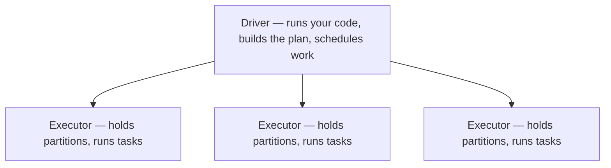
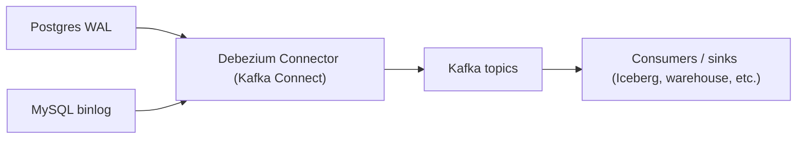
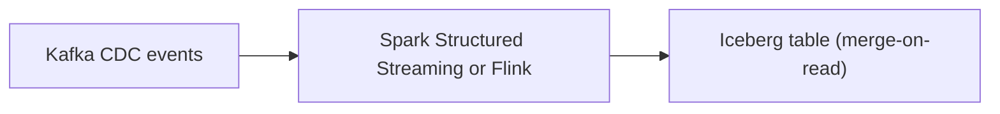

# 03 — Advanced Guide: Distributed Processing, Streaming, and the Capstone

**Topics covered:** Apache Spark; Kafka; capstone project

**Time:** 4–6 weeks at 8–10 hrs/week
**Goal:** Handle data that doesn't fit on one machine, and data that doesn't wait for batch windows. Then prove it all with a portfolio-grade capstone.

## What You'll Be Able to Do After This Tier

- Reason about Spark execution: where the shuffles happen, why a job is slow, how to fix it
- Write PySpark and Spark SQL fluently
- Set up and operate a Kafka cluster, design topic structures, manage consumer groups
- Use Avro + Schema Registry for safe schema evolution
- Understand exactly-once semantics — what they mean, when they matter, how to achieve them
- Design a lakehouse with proper table formats (Iceberg/Delta) for ACID on object storage
- Build an end-to-end pipeline that combines batch + streaming + warehouse + dashboard

This tier is where DE specializes. Most senior DEs are stronger in *either* batch (Spark-heavy) or streaming (Kafka/Flink-heavy). Cover both at competence level; pick one to go deep on for your career.

---

## Week 1–2 — Apache Spark

### Why Spark Exists

When your data fits in a single machine's RAM, pandas is fine. When it doesn't, you have three options:

1. **Buy a bigger machine.** Works up to a point. Becomes uneconomical fast.
2. **Use the warehouse directly.** Often the right answer — BigQuery and Snowflake can chew through TBs.
3. **Distributed processing engine.** Spark is the dominant choice when (a) you have huge data, (b) it lives in object storage, and (c) you want flexibility beyond SQL.

Spark splits data into partitions and processes them in parallel across a cluster of executors. The catch: every time data needs to move between machines (a "shuffle"), you pay a serious cost. Most Spark performance work is about minimizing shuffles.

### When NOT to Use Spark — The 2026 Senior Signal

A senior DE in 2026 is judged less on Spark depth and more on *architectural judgment* — knowing when single-node beats distributed. The cluster tax is real: JVM startup, executor coordination, S3 listing overhead, retries on transient failures. For anything below ~100GB, you frequently lose to a single fat box running DuckDB or Polars.

The Decathlon case study and the widely-shared "650GB Delta Lake on S3 with Polars" benchmark both showed multi-hour Spark jobs replaced by sub-30-minute single-node runs at a fraction of the cost. DuckDB 1.4 benchmarks regularly land 100x over Spark on modest hardware for the same query.

Alternative engines worth knowing by name:

- **Apache DataFusion** — Rust-based query engine, embeddable, very fast. Used inside InfluxDB, Comet (Spark accelerator), and increasingly as a "Spark replacement for sub-TB workloads."
- **Daft** — Python-native distributed DataFrame, Rust core. Competitive with Spark on 650GB benchmarks; better for multimodal data (images, embeddings).
- **Ray Data** — Python-first distributed compute, strongest for ML preprocessing pipelines that flow into training.

The interview answer that signals seniority: **"I'd reach for DuckDB or Polars first. I'd only bring in Spark when the data genuinely doesn't fit on a single fat node, when I need fine-grained Spark UDFs in Scala/Java, or when the team's tooling and lineage already assume a Spark cluster."** Candidates who only know Spark look as dated as candidates who only know DuckDB look inexperienced. Hold both.

### The Mental Model



- **Driver:** runs your code, builds the execution plan, schedules work
- **Executors:** JVM processes that hold partitions of data and run tasks
- **Partitions:** the chunks of data Spark splits work into
- **Tasks:** one unit of work, one partition

Your code describes *what* you want; Spark builds an execution plan (a DAG of stages) and runs it lazily.

### Lazy Evaluation — The Single Most Important Concept

```python
df = spark.read.parquet("s3://bucket/data/")
df_filtered = df.filter(df.amount > 100)
df_agg = df_filtered.groupBy("category").sum("amount")
# Nothing has happened yet.

df_agg.show()
# NOW Spark actually executes — and it's smart enough to push the filter
# down to the parquet read, so it doesn't read rows it'll throw away.
```

The execution doesn't happen until an *action* is called (`show`, `collect`, `write`, `count`). Everything before that is *transformations* — just adding nodes to the execution DAG.

This is why a `df.count()` halfway through your script can wreck performance — you're triggering execution prematurely.

### Transformations: Narrow vs Wide

- **Narrow:** Each output partition depends on one input partition. No data movement between machines. Cheap. (`filter`, `select`, `map`)
- **Wide:** Output partitions depend on multiple input partitions. Data shuffles across the network. Expensive. (`groupBy`, `join`, `distinct`, `repartition`)

The shuffles are where your job spends 90% of its time. Two strategies to reduce them:

1. **Filter early.** Push filters as close to the data source as possible.
2. **Choose join strategy wisely.** Broadcast joins for small tables.

### DataFrames API (PySpark)

```python
from pyspark.sql import SparkSession
from pyspark.sql import functions as F

spark = (SparkSession.builder
    .appName("taxi_analysis")
    .config("spark.sql.adaptive.enabled", "true")  # AQE — enable it
    .getOrCreate())

# Read
trips = spark.read.parquet("s3://lake/raw/trips/")
zones = spark.read.parquet("s3://lake/raw/zones/")

# Transform
result = (trips
    .filter(F.col("pickup_datetime") >= "2024-01-01")
    .join(F.broadcast(zones), trips.pickup_zone_id == zones.zone_id)  # broadcast the small one
    .groupBy("borough")
    .agg(
        F.count("*").alias("trip_count"),
        F.sum("fare_amount").alias("total_revenue"),
        F.avg("trip_distance").alias("avg_distance"),
    )
    .orderBy(F.col("total_revenue").desc()))

# Write
result.write.mode("overwrite").parquet("s3://lake/marts/borough_revenue/")
```

Things to internalize from this snippet:

- `F.broadcast(zones)` — explicitly broadcast a small table so it goes to every executor instead of triggering a shuffle
- `mode("overwrite")` — the write disposition (also: `append`, `ignore`, `errorifexists`)
- AQE (Adaptive Query Execution) — let Spark adjust the plan at runtime; enable it always

### Spark SQL — Often the Cleanest Option

```python
trips.createOrReplaceTempView("trips")
zones.createOrReplaceTempView("zones")

result = spark.sql("""
    SELECT borough, COUNT(*) as trips, SUM(fare_amount) as revenue
    FROM trips t
    JOIN zones z ON t.pickup_zone_id = z.zone_id
    WHERE t.pickup_datetime >= '2024-01-01'
    GROUP BY borough
    ORDER BY revenue DESC
""")
```

Same result as the DataFrame version. Spark SQL is usually more readable for complex joins and aggregations. Use whichever feels right per query; mixing both is normal.

### Joins — Where Jobs Die

Three main join strategies Spark can use:

1. **Broadcast Hash Join** — small table sent to every executor. Fast. Default for tables under `spark.sql.autoBroadcastJoinThreshold` (10MB by default).
2. **Shuffle Hash Join** — both tables shuffled by join key. Expensive but works.
3. **Sort Merge Join** — both sides sorted, then merged. Default for large joins. Best when both tables are large and roughly sorted on the join key.

**Performance tips:**

- Broadcast tables under ~100MB explicitly with `F.broadcast(df)`
- Watch for **skew** — if one key has 90% of the rows, one executor does all the work. Use salting or AQE skew join handling.
- Avoid `cross join` unless you really need it (Spark will refuse by default).

### Partitioning Output Files

```python
df.write.partitionBy("year", "month").parquet("s3://lake/trips/")
```

Writes one folder per year/month combination. Downstream readers filtering on year/month read only matching folders — massive speedup. Don't over-partition (more than a few hundred partition values is usually a problem).

### Exercises

1. Set up Spark locally (`pip install pyspark` is the easiest path; for realism, use Spark in Docker).
2. Read NYC taxi data in Parquet, run an aggregation by borough.
3. Use the Spark UI (default port 4040) to look at the DAG and the shuffle. Locate where time is spent.
4. Do the same join with and without `broadcast()`. Time both. Note the difference.
5. Deliberately create a skewed dataset (one key with 80% of rows). Run a groupBy. See it choke. Enable AQE skew handling, see it recover.
6. Write your output Parquet partitioned by date. Read it back filtering on date and confirm only one partition is read.

---

## Week 2–3 — Kafka and Streaming

### The Streaming Mental Model

Batch: "Run this job once a day on yesterday's data."
Streaming: "Process every event as it happens, forever, with low latency."

These are fundamentally different paradigms. Streaming forces you to think about:

- **Time:** Event time vs processing time
- **Ordering:** Events arriving out of order
- **State:** What you remember between events
- **Late arrivals:** Events that show up hours after they happened
- **Watermarks:** "I'm willing to wait this long for late events"
- **Windowing:** Tumbling, sliding, session

If batch feels comfortable, streaming will feel uncomfortable for a while. That's normal.

### What Kafka Is

Kafka is an **append-only distributed log**. Producers write events to a *topic*; consumers read from the topic. Multiple consumer groups can read the same topic independently and at their own pace.

Key concepts:

- **Topic:** A named stream of events (e.g., `user_signups`, `order_placed`).
- **Partition:** A topic is split into partitions for parallelism. Each partition is an ordered log; order is *only* guaranteed within a partition.
- **Producer:** Writes events. Chooses a key; same key always goes to the same partition.
- **Consumer:** Reads events. Tracks its position via *offsets*.
- **Consumer Group:** Multiple consumers cooperating — Kafka divides partitions among them. If you have 6 partitions and 3 consumers, each gets 2 partitions.
- **Broker:** A Kafka server. A cluster has multiple brokers for replication and throughput.
- **Replication:** Each partition has replicas on multiple brokers. Leaders handle reads/writes; followers stay in sync.
- **KRaft:** Kafka's built-in Raft-based metadata layer. **Kafka 4.0 (Mar 2025) removed ZooKeeper entirely** — KRaft is mandatory, not optional. If a tutorial's `docker-compose.yml` has a ZooKeeper container, it's pre-4.0; treat ZooKeeper as legacy context for older clusters you might inherit.

### Why Partitions Define Everything

Throughput, ordering, parallelism — all controlled by partitioning:

- More partitions = more parallel consumers = higher throughput
- Ordering is only guaranteed within a partition, not across
- If you need per-customer ordering, partition by `customer_id` (same customer always to the same partition)
- You can add partitions but not remove them, so design ahead

### Producing and Consuming in Python

```python
# Producer
from kafka import KafkaProducer
import json

producer = KafkaProducer(
    bootstrap_servers='localhost:9092',
    value_serializer=lambda v: json.dumps(v).encode('utf-8'),
    key_serializer=lambda k: k.encode('utf-8'),
)

producer.send('order_events', key='customer_42', value={'order_id': 'O123', 'amount': 99.95})
producer.flush()

# Consumer
from kafka import KafkaConsumer

consumer = KafkaConsumer(
    'order_events',
    bootstrap_servers='localhost:9092',
    group_id='order_processor',
    auto_offset_reset='earliest',
    value_deserializer=lambda v: json.loads(v.decode('utf-8')),
)

for message in consumer:
    print(f"{message.key}: {message.value}")
```

That's a complete pub/sub system in 20 lines. Type it, run it, see events flow.

### Schema Management with Avro

JSON is fine for toy projects. In production, you need schemas — and schemas evolve. Avro + Schema Registry handles this.

**Schema Registry:** A separate service that stores Avro schemas. Producers register their schema; consumers fetch by ID. When a producer changes the schema, the registry enforces compatibility rules.

**Compatibility modes:**

- **Backward:** New schema can read old data. (Removed a field, added an optional one.) Most common.
- **Forward:** Old schema can read new data. (Added a required field with a default.)
- **Full:** Both.
- **None:** Anything goes — almost always wrong.

This is one of those topics that seems abstract until you've debugged a downstream consumer breaking because the producer added a field three weeks ago. The compatibility rules save you from that.

### Stream Processing: Kafka Streams, ksqlDB, and Flink

Three ways to do stream processing in the Kafka ecosystem. We focus on the first two here; **Flink is the 2026 industry standard** and you need it for any serious streaming role.

1. **Kafka Streams** — a Java library. You write a topology of transformations on streams. Tightly coupled to Kafka, JVM-only. Used heavily where it already exists; rarely a new-system default.
2. **ksqlDB** — SQL on streams, runs inside Confluent's stack. Easier on-ramp if you know SQL.
3. **Apache Flink** — *the* dominant stateful stream processor. Confluent itself pivoted strategy around Flink (Confluent Cloud for Flink launched 2024, expanded heavily in 2025). Flink runs on any cluster (Kubernetes, YARN, standalone), supports event-time + late events + exactly-once at scale, and has first-class SQL.

#### ksqlDB Example

```sql
CREATE STREAM order_events (
    order_id VARCHAR,
    customer_id VARCHAR,
    amount DOUBLE
) WITH (KAFKA_TOPIC='order_events', VALUE_FORMAT='AVRO');

CREATE TABLE customer_totals AS
SELECT customer_id, SUM(amount) as total
FROM order_events
WINDOW TUMBLING (SIZE 1 HOUR)
GROUP BY customer_id;
```

The output `customer_totals` is itself a Kafka topic that downstream consumers can subscribe to. It's streams all the way down.

#### Flink SQL Example

Same use case, Flink SQL — looks similar by design (ANSI-flavored), but Flink handles state, watermarks, and recovery that ksqlDB can't at scale:

```sql
CREATE TABLE order_events (
    order_id STRING,
    customer_id STRING,
    amount DOUBLE,
    event_time TIMESTAMP(3),
    WATERMARK FOR event_time AS event_time - INTERVAL '5' SECOND
) WITH (
    'connector' = 'kafka',
    'topic' = 'order_events',
    'properties.bootstrap.servers' = 'kafka:9092',
    'format' = 'avro-confluent',
    'avro-confluent.url' = 'http://schema-registry:8081'
);

CREATE TABLE customer_totals (
    customer_id STRING,
    window_start TIMESTAMP(3),
    total DOUBLE
) WITH ('connector' = 'kafka', 'topic' = 'customer_totals', 'format' = 'json');

INSERT INTO customer_totals
SELECT
    customer_id,
    TUMBLE_START(event_time, INTERVAL '1' HOUR) AS window_start,
    SUM(amount) AS total
FROM order_events
GROUP BY customer_id, TUMBLE(event_time, INTERVAL '1' HOUR);
```

The `WATERMARK FOR event_time` declaration is the key difference from ksqlDB — you're telling Flink "events can arrive up to 5 seconds late; close the window after that." Flink also gives you proper state backends (RocksDB), savepoints for stateful upgrades, and the **DataStream / Table / SQL** APIs at three levels of abstraction.

#### The Streaming Engine Field

Worth knowing exists, not necessarily mastering:

- **Apache Flink** — the default 2026 choice. Industry standard.
- **RisingWave** — Postgres-wire-compatible streaming database. Apache 2.0 licensed. Outperformed Flink on 22 of 27 Nexmark benchmarks (2025). 1000+ organizations in production as of 2026. Has an exactly-once native Iceberg sink — you write streaming SQL, RisingWave lands results directly to Iceberg without a separate Kafka Connect pipeline. Cloud V2 launched 2026. Best when you want "Postgres + real-time materialized views" — it fills the gap between Flink's process model and Postgres's serve model without forcing you to operate both separately.
- **Materialize** — strong consistency guarantees, real-time materialized views. BSL licensing has slowed adoption.
- **Spark Structured Streaming** — fine if you already live in Spark; not the streaming-first default anymore.
- **Bytewax** — Python-native stream processor. Niche but real for Python-only shops.

And the broker layer:

- **Apache Kafka** — still default
- **Redpanda** — Kafka-wire-compatible, single binary, no JVM, no ZooKeeper. Simpler ops, gaining share at companies that want Kafka semantics without Kafka operational complexity.
- **WarpStream** — Kafka-compatible, S3-native (no local disks, no broker replication). Acquired by Confluent in 2024.

### Exactly-Once Semantics

Three delivery guarantees:

- **At-most-once:** Messages may be lost. Almost never what you want.
- **At-least-once:** Messages may be delivered twice. Common default. Forces consumers to be idempotent.
- **Exactly-once:** Each message processed exactly once. Hard to achieve. Kafka supports it for Kafka-to-Kafka transactions; for external systems (writing to a database), you handle idempotency yourself.

In practice: most pipelines are at-least-once with idempotent consumers. Make your consumers idempotent by writing with deduplication keys or using upserts. Don't fall for the marketing — exactly-once across heterogeneous systems is a hard problem.

### Watermarks and Windowing (Conceptual)

When you process events that arrive out of order, you need a way to say "I'm willing to wait X minutes for late events, then I'll close this window." That's a **watermark**.

Window types:

- **Tumbling:** Fixed-size, non-overlapping. "Every 1 hour."
- **Sliding:** Fixed-size, overlapping. "Every 1 hour, sliding every 15 minutes."
- **Session:** Variable-size based on activity gaps. "Group events that are within 30 minutes of each other."

We cover these at a conceptual level here. If you want depth, the "Streaming 101" and "Streaming 102" essays are the foundational reading on this topic.

### Kafka Exercises

1. Set up Kafka in Docker using a `docker-compose.yml`. Bring up a broker + Schema Registry + ksqlDB.
2. Write a producer that emits synthetic order events.
3. Write a consumer that aggregates them in a tumbling 1-minute window.
4. Define an Avro schema. Register it. Evolve it (add an optional field). Confirm Schema Registry accepts the change.
5. Use ksqlDB to compute a running aggregate.
6. Kill a consumer mid-processing. Restart it. Confirm it resumes from the right offset.

---

## CDC and Event-Driven Pipelines

Change Data Capture is a taught skill, not a name-drop. Interviewers at F100s with Postgres, MySQL, or Oracle in their stack — which is nearly all of them — will ask about it directly. This section gives you enough depth to answer credibly and build it yourself.

### What CDC Is

**Change Data Capture** is the practice of capturing every row-level change in a source database (INSERT, UPDATE, DELETE) as a stream of events, in real time, without modifying the application that writes to the database.

Two flavors exist, and you need to know why one wins:

**Query-based CDC** — a job runs on a schedule and issues `SELECT * FROM orders WHERE updated_at > :last_run`. Simple to implement; no special database privileges. But: it requires a reliable `updated_at` column (many tables don't have one), it misses hard deletes entirely, and it's always polling — you have a latency floor equal to your polling interval, and you're adding read load to your operational database.

**Log-based CDC** — reads the database's replication log directly: the **binlog** in MySQL, the **WAL** (Write Ahead Log) in Postgres. Every committed transaction is already in the log; you're reading it, not re-querying the database. Benefits: captures all changes including hard deletes, sub-second latency, zero additional load on the application. This is why log-based CDC wins in production. The gotcha: you need replication permissions, and the log has retention constraints (more on that below).

### Debezium Architecture

**Debezium** is the dominant open-source CDC framework. It runs as a Kafka Connect plugin — a connector that reads the source database's replication log and publishes change events to Kafka topics.



Each source table gets its own Kafka topic, typically named `<prefix>.<schema>.<table>`. A change event looks like:

```json
{
  "op": "u",
  "before": { "order_id": "O123", "status": "pending" },
  "after":  { "order_id": "O123", "status": "shipped" },
  "source": { "lsn": 23456, "ts_ms": 1717612345678, "table": "orders" }
}
```

`op` is `c` (create), `u` (update), `d` (delete), or `r` (read — initial snapshot). The `before`/`after` pair gives you exactly what changed. The `source.lsn` (Postgres Log Sequence Number) is your deduplication key.

**Schema evolution via Schema Registry.** When a column is added to the source table, Debezium emits a schema change event. Combined with Confluent Schema Registry in compatibility mode, downstream consumers can evolve gracefully rather than breaking. The Schema Registry enforces that new schemas are backward-compatible with the last registered schema — so adding a nullable column is fine, removing a required column is rejected.

### The Outbox Pattern

The outbox pattern solves the dual-write problem: your application needs to both update the database AND publish a Kafka event. If you do these as two separate operations, one can succeed and the other fail — you get inconsistency.

**Wrong approach (dual-write):**

```python
db.execute("UPDATE orders SET status='shipped'")
kafka_producer.send("order_events", payload)  # if this fails, state and events diverge
```

**Right approach (outbox):**

```python
# One transaction — atomically write state + the outbox record
with db.transaction():
    db.execute("UPDATE orders SET status='shipped'")
    db.execute("INSERT INTO outbox (event_type, payload) VALUES ('OrderShipped', ...)")
# Debezium reads the outbox table and publishes to Kafka — no application code involved
```

The outbox table is a normal database table. Debezium watches it like any other. You get exactly-once event publishing because the application transaction either fully commits or fully rolls back — there's no state where the database is updated but the event wasn't queued. Debezium's `outbox.EventRouter` SMT (Single Message Transform) handles routing from the outbox table to the right downstream Kafka topic automatically.

### CDC → Iceberg Landing Pattern

The canonical landing pattern for CDC in a lakehouse uses Iceberg's merge-on-read (MOR) upserts:



Each micro-batch reads CDC events and runs a MERGE:

```sql
MERGE INTO iceberg_catalog.orders t
USING cdc_batch s
  ON t.order_id = s.order_id
WHEN MATCHED AND s.op = 'd' THEN DELETE
WHEN MATCHED AND s.op = 'u' THEN UPDATE SET *
WHEN NOT MATCHED AND s.op IN ('c', 'r') THEN INSERT *
```

Iceberg's equality delete files make this cheap: the engine writes a small delete file for each deleted/updated row rather than rewriting the whole data file on every micro-batch. Compaction (run nightly or weekly) collapses the delete files into clean data files for query efficiency.

### Operational Gotchas

These are the gaps between "I read about CDC" and "I've run CDC in production":

**Snapshot phase vs streaming phase.** When you first point Debezium at a large table, it does an initial consistent snapshot — reads the entire table while holding a snapshot isolation level, emits `r` (read) events for every existing row. On a 500M-row table, this can take hours. Plan for it: your downstream must handle replay of the snapshot and seamlessly transition to streaming mode afterward. The `snapshot.mode` config controls this behavior.

**WAL retention and replication slot disk pressure.** Debezium uses a Postgres **replication slot** to track its position in the WAL. If Debezium goes down (or falls behind), Postgres holds the WAL from that position forward — indefinitely, to make sure Debezium can catch up. On a busy database, this can fill the disk in hours. Always monitor `pg_replication_slots` lag and set `max_slot_wal_keep_size` in your Postgres config. This is the #1 operational incident type for new CDC deployments.

**Tombstones.** When Debezium emits a delete event, it publishes two messages: the actual delete event, then a "tombstone" — a message with a null value keyed on the deleted row's primary key. The tombstone tells Kafka log-compacted topics that this key is deleted and its older messages can be evicted. Your consumers must handle null-value messages, or they will crash on tombstones. Most Kafka consumer libraries handle this with a null check; verify yours does.

**Heartbeat events.** On low-traffic tables, the WAL position can appear stuck — Debezium hasn't seen a change, so it hasn't committed a new offset, so the replication slot appears behind. Configure `heartbeat.interval.ms` to have Debezium emit periodic heartbeat events that advance the WAL position even when the source table is quiet.

### Alternatives to Debezium

- **Estuary Flow** — streaming-first CDC platform, exactly-once guarantees, no separate Kafka cluster required. Cloud-managed or self-hosted. Stronger for teams that want CDC without operating Kafka Connect.
- **Striim** — commercial, enterprise-grade, strong Oracle CDC support (critical for finance/healthcare F100s still on Oracle). Bidirectional CDC.
- **RisingWave** — has native CDC source connectors (Postgres, MySQL) that feed directly into streaming SQL, bypassing Kafka entirely. Covers the "CDC straight into real-time aggregations" use case with less infrastructure.

### What Interviewers Ask

- "How would you capture changes from a Postgres database into your data lake in near-real time?" — Lead with Debezium + Kafka + Iceberg MERGE. Mention the WAL retention gotcha proactively.
- "What's the outbox pattern and why does it matter?" — Dual-write inconsistency, transactional atomicity, Debezium as the publisher.
- "How do you handle deletes in a CDC-based lakehouse?" — Iceberg equality deletes via MERGE, tombstones in Kafka, snapshot expiration for GDPR.

### Exercise

Stand up Debezium + Postgres + Kafka in Docker Compose (Debezium's official `docker-compose.yml` is a good starting point), connect to a sample database, run an UPDATE on a row, capture the change event in a consumer, and write a mini Spark job that lands it into a local Iceberg table via MERGE. Seeing the `before`/`after` envelope and the LSN once is worth more than reading about it ten times.

```yaml
# docker-compose.yml skeleton
services:
  postgres:
    image: debezium/postgres:16
    environment:
      POSTGRES_PASSWORD: postgres
      POSTGRES_DB: inventory
  zookeeper:
    image: debezium/zookeeper:2.7
  kafka:
    image: debezium/kafka:2.7
    depends_on: [zookeeper]
  connect:
    image: debezium/connect:2.7
    depends_on: [kafka, postgres]
    environment:
      BOOTSTRAP_SERVERS: kafka:9092
      GROUP_ID: debezium
      CONFIG_STORAGE_TOPIC: debezium_config
      OFFSET_STORAGE_TOPIC: debezium_offsets
      STATUS_STORAGE_TOPIC: debezium_status
```

Register the connector, run `UPDATE inventory.orders SET status = 'shipped' WHERE id = 1`, watch the event arrive in the `inventory.public.orders` topic. That moment is when CDC stops being theory.

---

## Week 3–4 — Lakehouse Architecture (Bonus)

So far we've mostly treated lakes (GCS) and warehouses (BigQuery) as separate things. The frontier of the industry is the **lakehouse** — combining the cheap storage of a lake with the ACID guarantees and query performance of a warehouse, using **open table formats**.

### Why You Need to Know This

In 2026, every Fortune 100 data platform team is having the "Iceberg vs Delta" conversation. If you can speak to it credibly in an interview, you're already in a different category from candidates who only know the fundamentals.

### The Three Open Table Formats

1. **Apache Iceberg** — Netflix-originated. Strong on schema evolution, snapshots, time travel. The fastest-growing of the three. Supported natively by Snowflake, BigQuery, Databricks, Trino, Spark.
2. **Delta Lake** — Databricks-originated. Strongest in the Databricks ecosystem. Now open source.
3. **Apache Hudi** — Uber-originated. Strongest on streaming upsert workloads. Niche but real.

All three solve the same problem: ACID transactions, schema evolution, time travel, and metadata management on top of object storage (S3/GCS/ADLS).

### How a Lakehouse Table Is Built

A lakehouse table is **Parquet files + a metadata layer**. The metadata layer tracks:

- Which files are part of the table right now
- The schema at this point in time
- Snapshots (so you can time travel)
- Statistics for query planning

When you `INSERT`, the engine writes new Parquet files and updates the metadata. When you read, it consults the metadata to know which files to actually scan.

### What to Read

- The Iceberg [spec overview](https://iceberg.apache.org/spec/) (skim — get the gist)
- Tabular's blog (the Iceberg founders) — pick any 2–3 posts
- Databricks' Delta Lake docs — same concepts, different vocabulary

You don't need to implement a lakehouse yet — you'll do that in the projects file. You need to be able to *discuss* it.

### The Catalog Wars — 2026's Real Battleground

The Iceberg-vs-Delta format war is over. Interoperability layers (Delta UniForm, Apache XTable) mean engines can read each other's tables. The folder layout stopped being the interesting question.

The new battleground is **catalogs** — the service that tracks "which tables exist, which schemas they have, who can read them, which snapshot is current." If you walk into a 2026 F100 system design round saying "we'll use Iceberg" without naming a catalog, you've just shown you stopped reading in 2024.

The four catalogs to know:

1. **Iceberg REST Catalog** — the open *protocol* spec. Any catalog can implement it; engines speak it as a lingua franca. **This is the standard you must know by name.**

2. **Apache Polaris** — Snowflake-donated reference implementation of the REST catalog; **graduated to a top-level Apache project in Feb 2026** (1.4 added production hardening: STS session tags, S3 KMS, CockroachDB backend). Vendor-neutral, OSS, deployable on your own cluster; Snowflake's Horizon Catalog runs on it, Dremio's Open Catalog is managed Polaris. The "safe default" recommendation in 2026.

3. **Unity Catalog (OSS)** — Databricks open-sourced their catalog in 2024. Supports both Iceberg and Delta tables. Tighter UX in the Databricks ecosystem; viable as a standalone too.

4. **Nessie** — Dremio-originated. The differentiator: **git-style branching** of your data — create a branch, mutate tables, merge or discard. Powerful for testing transformations against a snapshot of production without copying it.

Others worth a sentence:

- **AWS Glue Data Catalog** — the historical default in AWS shops. Still very common. Supports Iceberg/Delta via plugins.
- **Hive Metastore** — what catalogs are slowly replacing. Treat as legacy.
- **Tabular** — the Iceberg founders' catalog product; **acquired by Databricks in 2024** for ~$1B. Folded into Unity Catalog.

The senior takeaway: **format is mostly settled (Iceberg has the momentum), catalog is the design decision**. Pick a catalog that speaks REST so you can swap engines later.

### DuckLake — The Newest Entrant (Watch List)

**DuckLake** shipped v1.0 in April 2026. The idea: skip the JSON/Avro metadata files of Iceberg entirely and put the table metadata directly in a SQL database (Postgres, DuckDB itself, anything). Parquet still in object storage, but the catalog *is* the metadata store — no separate manifest layer. Simpler, transactional by construction (Postgres handles concurrency), and noticeably faster on small/medium tables.

Status check (mid-2026): **early production, no longer just a watch-list item.** v1.0 is stable, it's a top-10 DuckDB extension by downloads, and client support landed for Spark, Trino, DataFusion, and Pandas. Viable for *new* small/medium projects; still young for migrating a large existing lakehouse. Knowing its design tradeoff (SQL-database metadata vs manifest files) is a strong 2026 interview signal.

**MotherDuck — DuckDB as a cloud warehouse.** DuckLake and MotherDuck are complementary. MotherDuck is the serverless cloud runtime for DuckDB: same SQL dialect, same extensions, same file formats — but the database is hosted, shareable, and always-on. 10,000+ paying teams by Q1 2026. The practical implication: the old guidance "DuckDB is local-only, graduate to Snowflake for production" no longer holds cleanly. You can now run DuckDB locally for development, attach to a MotherDuck warehouse for production queries, and share results with a team — without changing a line of SQL. For small-to-medium data teams, this removes a whole tier of infrastructure complexity. **MotherDuck Flights** (June 2026) extends the platform with an agentic ingestion layer — more on this in the Agentic Data Engineering phase at the end of this guide.

### AI / DE Convergence — pgvector, LanceDB, and the Semantic Layer as AI Interface

The fastest-growing surface area in DE 2026 is the boundary with AI systems. You don't need to become an MLE, but you need to know the data-infrastructure side of this conversation.

**Vector stores you should know by name:**

- **pgvector** — Postgres extension. The default for <10M vectors. Zero new infrastructure if you're already on Postgres. Every F100 evaluation starts here and usually ends here.
- **LanceDB** — embedded, file-based vector store (Parquet + Lance format). Great for edge, notebooks, and small-app deployments.
- **Pinecone / Weaviate / Qdrant / Milvus** — standalone vector DBs. Reach for these only when pgvector hits a real ceiling (which is later than most people think).

**The DE-as-AI-infrastructure narrative.** When an LLM agent answers a business question over your warehouse, you want it pulling structured metric definitions from a **semantic layer**, not generating raw SQL against your bronze tables. Text-to-SQL accuracy has improved a lot but still loses to "text-to-metric" against a well-modeled semantic layer (dbt's, Cube's, Looker's). Cube supports MCP (Model Context Protocol) for native agent integration; dbt's semantic layer has its own JSON-RPC interface.

The 30-second elevator pitch you should be ready to give: *"DEs are the ones building the structured, governed, observable substrate that AI systems read from. The semantic layer is becoming the AI interface to the warehouse; vector stores extend that to unstructured corpora."*

---

## The Capstone Project

This is the big one. Industry-grade. A piece you'll be talking about in interviews two years from now.

### Spec (Minimum)

1. **A real data source** — pick something with genuine volume. APIs that work:
   - GitHub Events API (live firehose of activity)
   - Reddit API (high-volume comments and posts)
   - A public Kafka stream (Wikipedia edits, financial data)
   - Synthesized but realistic data (generate it with `faker` at scale)

2. **Both batch and streaming components**
   - Streaming: Kafka producer + consumer pipeline that handles live ingestion
   - Batch: Spark job that processes historical data weekly

3. **Lakehouse storage** — Iceberg or Delta tables, not raw Parquet. Use it for at least one fact table.

4. **A modern stack:**
   - Ingestion: dlt + Kafka (and at least *evaluate* one Airbyte connector, even if you don't use it — make a deliberate choice)
   - Storage: GCS (lake) + BigQuery or Snowflake (warehouse) + Iceberg tables (lakehouse) registered in a **REST-spec catalog** (Polaris or Unity Catalog OSS)
   - Processing: Spark for the heavy batch step; **DuckDB or Polars for at least one batch step under 100GB** — you want both on the resume; **Flink** for streaming (Kafka Streams or ksqlDB acceptable, but Flink is the credibility tool)
   - Transformation: dbt with proper layering (bonus: port one mart to SQLMesh as a comparison exercise and write up the trade-offs)
   - Orchestration: Airflow (yes, switch to Airflow for this — it's what F100 uses)
   - Observability: structured logs + at least one metric per pipeline + alerts on failure + **OpenLineage** events emitted from dbt/Airflow/Spark; at minimum, **Elementary** wired into the dbt project
   - Governance: at least one **data contract** YAML on the most critical upstream source
   - IaC: Terraform for all cloud resources

5. **A visualization layer** — at least one dashboard (Metabase, Looker Studio, Superset). The dashboard isn't the point, but you need it to demonstrate the pipeline produces something useful.

6. **A `README` that's a tech blog post.** Architecture diagram. Decisions and trade-offs. What you'd do differently. Cost analysis. Lessons learned.

### Acceptance Criteria

- The whole stack comes up with `make up` or equivalent (one command)
- A reviewer can ingest live data within 5 minutes of starting
- Failure of any single component is detected and recovered from gracefully
- The streaming side handles at least 1000 events/second (load test it and document the result)
- The batch side processes at least 100GB without falling over (or you simulate it and explain)
- The `README` would survive being read by a senior engineer who's deciding whether to interview you

### Why This Capstone Matters

It's substantial enough that talking about it for 30 minutes in an interview is natural. It demonstrates batch + streaming + modeling + orchestration + IaC + observability. There's no realistic data engineering job at a Fortune 100 that touches *none* of these. By the time you finish it, you have an answer to every variant of "tell me about a project you're proud of."

---

## You can now

- Reason about Spark execution — driver, executors, partitions, shuffles — locate why a job is slow, and fix it with broadcast joins, early filtering, or AQE skew handling.
- Decide when a single-node engine (DuckDB, Polars) beats a Spark cluster, and articulate that threshold in an interview.
- Stand up Kafka, design partitioning for throughput and ordering, manage consumer groups, and evolve schemas safely with Avro + Schema Registry.
- Build a log-based CDC pipeline with Debezium — including the outbox pattern and the WAL-retention gotcha — and land changes into an Iceberg table via MERGE.
- Compare table formats (Iceberg/Delta/Hudi) and, more importantly, catalogs (REST spec, Polaris, Unity, Nessie), and explain why the catalog is the sharper 2026 decision.

---

## Confidence Checks Before Moving On

1. You can sketch the Spark execution model (driver, executors, partitions, tasks, shuffles) on a whiteboard.
2. You can explain when you'd broadcast a join vs use the default sort-merge.
3. You can describe what a Kafka consumer group does and what happens when one consumer dies.
4. You can explain why exactly-once semantics across heterogeneous systems is hard.
5. You understand the difference between event time, processing time, and watermarks.
6. You can describe what an Iceberg snapshot is and why it enables time travel.
7. Your capstone runs, end-to-end, with one command.
8. You can explain when DuckDB or Polars beat Spark, and conversely when Spark is still the right tool.
9. You can name three streaming engines beyond Kafka Streams, and the one-line trade-off for each (Flink, RisingWave, Materialize / Bytewax / Spark Structured Streaming).
10. You can explain the difference between a *table format* (Iceberg, Delta) and a *catalog* (Polaris, Unity, Nessie, REST spec), and why the catalog is the more interesting 2026 decision.
11. You can explain what OpenLineage emits and why a team would standardize on it across dbt + Airflow + Spark.
12. You can describe the role of pgvector / LanceDB in a 2026 data platform and why a DE would care.

When these are all solid, you're past the core track. Move on to the specialization phase in the next section.
