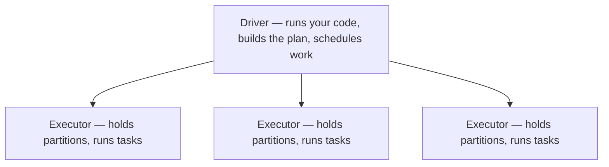

# 03 — Advanced Guide: Distributed Processing, Streaming, and the Capstone — Part 1 of 3: Apache Spark

**Topics covered:** Apache Spark; Kafka; capstone project

**Time:** 4–6 weeks at 8–10 hrs/week
**Goal:** Handle data that doesn't fit on one machine, and data that doesn't wait for batch windows. Then prove it all with a portfolio-grade capstone.

## What You'll Be Able to Do After This Tier

- Reason about Spark execution: where the shuffles happen, why a job is slow, how to fix it
- Write PySpark and Spark SQL fluently
- Set up and operate a Kafka cluster, design topic structures, manage consumer groups
- Use Avro + Schema Registry for safe schema evolution
- Understand exactly-once semantics — what they mean, when they matter, how to achieve them
- Design a lakehouse with proper table formats (Iceberg/Delta) for ACID on object storage
- Build an end-to-end pipeline that combines batch + streaming + warehouse + dashboard

This tier is where DE specializes. Most senior DEs are stronger in *either* batch (Spark-heavy) or streaming (Kafka/Flink-heavy). Cover both at competence level; pick one to go deep on for your career.

---

## Week 1–2 — Apache Spark

### Why Spark Exists

When your data fits in a single machine's RAM, pandas is fine. When it doesn't, you have three options:

1. **Buy a bigger machine.** Works up to a point. Becomes uneconomical fast.
2. **Use the warehouse directly.** Often the right answer — BigQuery and Snowflake can chew through TBs.
3. **Distributed processing engine.** Spark is the dominant choice when (a) you have huge data, (b) it lives in object storage, and (c) you want flexibility beyond SQL.

Spark splits data into partitions and processes them in parallel across a cluster of executors. The catch: every time data needs to move between machines (a "shuffle"), you pay a serious cost. Most Spark performance work is about minimizing shuffles.

### When NOT to Use Spark — The 2026 Senior Signal

A senior DE in 2026 is judged less on Spark depth and more on *architectural judgment* — knowing when single-node beats distributed. The cluster tax is real: JVM startup, executor coordination, S3 listing overhead, retries on transient failures. For anything below ~100GB, you frequently lose to a single fat box running DuckDB or Polars.

The Decathlon case study and the widely-shared "650GB Delta Lake on S3 with Polars" benchmark both showed multi-hour Spark jobs replaced by sub-30-minute single-node runs at a fraction of the cost. DuckDB 1.4 benchmarks regularly land 100x over Spark on modest hardware for the same query.

Alternative engines worth knowing by name:

- **Apache DataFusion** — Rust-based query engine, embeddable, very fast. Used inside InfluxDB, Comet (Spark accelerator), and increasingly as a "Spark replacement for sub-TB workloads."
- **Daft** — Python-native distributed DataFrame, Rust core. Competitive with Spark on 650GB benchmarks; better for multimodal data (images, embeddings).
- **Ray Data** — Python-first distributed compute, strongest for ML preprocessing pipelines that flow into training.

The interview answer that signals seniority: **"I'd reach for DuckDB or Polars first. I'd only bring in Spark when the data genuinely doesn't fit on a single fat node, when I need fine-grained Spark UDFs in Scala/Java, or when the team's tooling and lineage already assume a Spark cluster."** Candidates who only know Spark look as dated as candidates who only know DuckDB look inexperienced. Hold both.

### The Mental Model



- **Driver:** runs your code, builds the execution plan, schedules work
- **Executors:** JVM processes that hold partitions of data and run tasks
- **Partitions:** the chunks of data Spark splits work into
- **Tasks:** one unit of work, one partition

Your code describes *what* you want; Spark builds an execution plan (a DAG of stages) and runs it lazily.

### Lazy Evaluation — The Single Most Important Concept

```python
df = spark.read.parquet("s3://bucket/data/")
df_filtered = df.filter(df.amount > 100)
df_agg = df_filtered.groupBy("category").sum("amount")
# Nothing has happened yet.

df_agg.show()
# NOW Spark actually executes — and it's smart enough to push the filter
# down to the parquet read, so it doesn't read rows it'll throw away.
```

The execution doesn't happen until an *action* is called (`show`, `collect`, `write`, `count`). Everything before that is *transformations* — just adding nodes to the execution DAG.

This is why a `df.count()` halfway through your script can wreck performance — you're triggering execution prematurely.

### Transformations: Narrow vs Wide

- **Narrow:** Each output partition depends on one input partition. No data movement between machines. Cheap. (`filter`, `select`, `map`)
- **Wide:** Output partitions depend on multiple input partitions. Data shuffles across the network. Expensive. (`groupBy`, `join`, `distinct`, `repartition`)

The shuffles are where your job spends 90% of its time. Two strategies to reduce them:

1. **Filter early.** Push filters as close to the data source as possible.
2. **Choose join strategy wisely.** Broadcast joins for small tables.

### DataFrames API (PySpark)

```python
from pyspark.sql import SparkSession
from pyspark.sql import functions as F

spark = (SparkSession.builder
    .appName("taxi_analysis")
    .config("spark.sql.adaptive.enabled", "true")  # AQE — enable it
    .getOrCreate())

# Read
trips = spark.read.parquet("s3://lake/raw/trips/")
zones = spark.read.parquet("s3://lake/raw/zones/")

# Transform
result = (trips
    .filter(F.col("pickup_datetime") >= "2024-01-01")
    .join(F.broadcast(zones), trips.pickup_zone_id == zones.zone_id)  # broadcast the small one
    .groupBy("borough")
    .agg(
        F.count("*").alias("trip_count"),
        F.sum("fare_amount").alias("total_revenue"),
        F.avg("trip_distance").alias("avg_distance"),
    )
    .orderBy(F.col("total_revenue").desc()))

# Write
result.write.mode("overwrite").parquet("s3://lake/marts/borough_revenue/")
```

Things to internalize from this snippet:

- `F.broadcast(zones)` — explicitly broadcast a small table so it goes to every executor instead of triggering a shuffle
- `mode("overwrite")` — the write disposition (also: `append`, `ignore`, `errorifexists`)
- AQE (Adaptive Query Execution) — let Spark adjust the plan at runtime; enable it always

### Spark SQL — Often the Cleanest Option

```python
trips.createOrReplaceTempView("trips")
zones.createOrReplaceTempView("zones")

result = spark.sql("""
    SELECT borough, COUNT(*) as trips, SUM(fare_amount) as revenue
    FROM trips t
    JOIN zones z ON t.pickup_zone_id = z.zone_id
    WHERE t.pickup_datetime >= '2024-01-01'
    GROUP BY borough
    ORDER BY revenue DESC
""")
```

Same result as the DataFrame version. Spark SQL is usually more readable for complex joins and aggregations. Use whichever feels right per query; mixing both is normal.

### Joins — Where Jobs Die

Three main join strategies Spark can use:

1. **Broadcast Hash Join** — small table sent to every executor. Fast. Default for tables under `spark.sql.autoBroadcastJoinThreshold` (10MB by default).
2. **Shuffle Hash Join** — both tables shuffled by join key. Expensive but works.
3. **Sort Merge Join** — both sides sorted, then merged. Default for large joins. Best when both tables are large and roughly sorted on the join key.

**Performance tips:**

- Broadcast tables under ~100MB explicitly with `F.broadcast(df)`
- Watch for **skew** — if one key has 90% of the rows, one executor does all the work. Use salting or AQE skew join handling.
- Avoid `cross join` unless you really need it (Spark will refuse by default).

### Partitioning Output Files

```python
df.write.partitionBy("year", "month").parquet("s3://lake/trips/")
```

Writes one folder per year/month combination. Downstream readers filtering on year/month read only matching folders — massive speedup. Don't over-partition (more than a few hundred partition values is usually a problem).

### Exercises

1. Set up Spark locally (`pip install pyspark` is the easiest path; for realism, use Spark in Docker).
2. Read NYC taxi data in Parquet, run an aggregation by borough.
3. Use the Spark UI (default port 4040) to look at the DAG and the shuffle. Locate where time is spent.
4. Do the same join with and without `broadcast()`. Time both. Note the difference.
5. Deliberately create a skewed dataset (one key with 80% of rows). Run a groupBy. See it choke. Enable AQE skew handling, see it recover.
6. Write your output Parquet partitioned by date. Read it back filtering on date and confirm only one partition is read.

---

## You can now

- Reason about Spark execution — driver, executors, partitions, shuffles — and pinpoint why a job is slow.
- Fix a slow Spark job with broadcast joins, early filtering, or AQE skew handling.
- Decide when a single-node engine (DuckDB, Polars) beats a Spark cluster, and defend that threshold in an interview.
- Write PySpark and Spark SQL fluently, and partition output files so downstream reads only scan what they need.

This is part 1 of the Advanced Guide lesson (Distributed Processing, Streaming, and the Capstone). Next: Kafka, streaming, and CDC pipelines in [Part 2](03b-advanced-guide.md).
