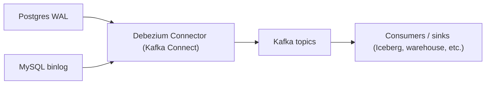
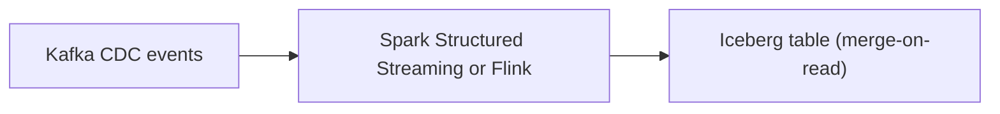

# 03 — Advanced Guide: Distributed Processing, Streaming, and the Capstone — Part 2 of 3: Kafka, Streaming, and CDC

This is part 2 of the Advanced Guide lesson (Distributed Processing, Streaming, and the Capstone). [Part 1](03-advanced-guide.md) covered Apache Spark; here we cover Kafka, stream processing, and Change Data Capture (CDC) pipelines.

## Week 2–3 — Kafka and Streaming

### The Streaming Mental Model

Batch: "Run this job once a day on yesterday's data."
Streaming: "Process every event as it happens, forever, with low latency."

These are fundamentally different paradigms. Streaming forces you to think about:

- **Time:** Event time vs processing time
- **Ordering:** Events arriving out of order
- **State:** What you remember between events
- **Late arrivals:** Events that show up hours after they happened
- **Watermarks:** "I'm willing to wait this long for late events"
- **Windowing:** Tumbling, sliding, session

If batch feels comfortable, streaming will feel uncomfortable for a while. That's normal.

### What Kafka Is

Kafka is an **append-only distributed log**. Producers write events to a *topic*; consumers read from the topic. Multiple consumer groups can read the same topic independently and at their own pace.

Key concepts:

- **Topic:** A named stream of events (e.g., `user_signups`, `order_placed`).
- **Partition:** A topic is split into partitions for parallelism. Each partition is an ordered log; order is *only* guaranteed within a partition.
- **Producer:** Writes events. Chooses a key; same key always goes to the same partition.
- **Consumer:** Reads events. Tracks its position via *offsets*.
- **Consumer Group:** Multiple consumers cooperating — Kafka divides partitions among them. If you have 6 partitions and 3 consumers, each gets 2 partitions.
- **Broker:** A Kafka server. A cluster has multiple brokers for replication and throughput.
- **Replication:** Each partition has replicas on multiple brokers. Leaders handle reads/writes; followers stay in sync.
- **KRaft:** Kafka's built-in Raft-based metadata layer. **Kafka 4.0 (Mar 2025) removed ZooKeeper entirely** — KRaft is mandatory, not optional. If a tutorial's `docker-compose.yml` has a ZooKeeper container, it's pre-4.0; treat ZooKeeper as legacy context for older clusters you might inherit.

### Why Partitions Define Everything

Throughput, ordering, parallelism — all controlled by partitioning:

- More partitions = more parallel consumers = higher throughput
- Ordering is only guaranteed within a partition, not across
- If you need per-customer ordering, partition by `customer_id` (same customer always to the same partition)
- You can add partitions but not remove them, so design ahead

### Producing and Consuming in Python

```python
# Producer
from kafka import KafkaProducer
import json

producer = KafkaProducer(
    bootstrap_servers='localhost:9092',
    value_serializer=lambda v: json.dumps(v).encode('utf-8'),
    key_serializer=lambda k: k.encode('utf-8'),
)

producer.send('order_events', key='customer_42', value={'order_id': 'O123', 'amount': 99.95})
producer.flush()

# Consumer
from kafka import KafkaConsumer

consumer = KafkaConsumer(
    'order_events',
    bootstrap_servers='localhost:9092',
    group_id='order_processor',
    auto_offset_reset='earliest',
    value_deserializer=lambda v: json.loads(v.decode('utf-8')),
)

for message in consumer:
    print(f"{message.key}: {message.value}")
```

That's a complete pub/sub system in 20 lines. Type it, run it, see events flow.

### Schema Management with Avro

JSON is fine for toy projects. In production, you need schemas — and schemas evolve. Avro + Schema Registry handles this.

**Schema Registry:** A separate service that stores Avro schemas. Producers register their schema; consumers fetch by ID. When a producer changes the schema, the registry enforces compatibility rules.

**Compatibility modes:**

- **Backward:** New schema can read old data. (Removed a field, added an optional one.) Most common.
- **Forward:** Old schema can read new data. (Added a required field with a default.)
- **Full:** Both.
- **None:** Anything goes — almost always wrong.

This is one of those topics that seems abstract until you've debugged a downstream consumer breaking because the producer added a field three weeks ago. The compatibility rules save you from that.

### Stream Processing: Kafka Streams, ksqlDB, and Flink

Three ways to do stream processing in the Kafka ecosystem. We focus on the first two here; **Flink is the 2026 industry standard** and you need it for any serious streaming role.

1. **Kafka Streams** — a Java library. You write a topology of transformations on streams. Tightly coupled to Kafka, JVM-only. Used heavily where it already exists; rarely a new-system default.
2. **ksqlDB** — SQL on streams, runs inside Confluent's stack. Easier on-ramp if you know SQL.
3. **Apache Flink** — *the* dominant stateful stream processor. Confluent itself pivoted strategy around Flink (Confluent Cloud for Flink launched 2024, expanded heavily in 2025). Flink runs on any cluster (Kubernetes, YARN, standalone), supports event-time + late events + exactly-once at scale, and has first-class SQL.

#### ksqlDB Example

```sql
CREATE STREAM order_events (
    order_id VARCHAR,
    customer_id VARCHAR,
    amount DOUBLE
) WITH (KAFKA_TOPIC='order_events', VALUE_FORMAT='AVRO');

CREATE TABLE customer_totals AS
SELECT customer_id, SUM(amount) as total
FROM order_events
WINDOW TUMBLING (SIZE 1 HOUR)
GROUP BY customer_id;
```

The output `customer_totals` is itself a Kafka topic that downstream consumers can subscribe to. It's streams all the way down.

#### Flink SQL Example

Same use case, Flink SQL — looks similar by design (ANSI-flavored), but Flink handles state, watermarks, and recovery that ksqlDB can't at scale:

```sql
CREATE TABLE order_events (
    order_id STRING,
    customer_id STRING,
    amount DOUBLE,
    event_time TIMESTAMP(3),
    WATERMARK FOR event_time AS event_time - INTERVAL '5' SECOND
) WITH (
    'connector' = 'kafka',
    'topic' = 'order_events',
    'properties.bootstrap.servers' = 'kafka:9092',
    'format' = 'avro-confluent',
    'avro-confluent.url' = 'http://schema-registry:8081'
);

CREATE TABLE customer_totals (
    customer_id STRING,
    window_start TIMESTAMP(3),
    total DOUBLE
) WITH ('connector' = 'kafka', 'topic' = 'customer_totals', 'format' = 'json');

INSERT INTO customer_totals
SELECT
    customer_id,
    TUMBLE_START(event_time, INTERVAL '1' HOUR) AS window_start,
    SUM(amount) AS total
FROM order_events
GROUP BY customer_id, TUMBLE(event_time, INTERVAL '1' HOUR);
```

The `WATERMARK FOR event_time` declaration is the key difference from ksqlDB — you're telling Flink "events can arrive up to 5 seconds late; close the window after that." Flink also gives you proper state backends (RocksDB), savepoints for stateful upgrades, and the **DataStream / Table / SQL** APIs at three levels of abstraction.

#### The Streaming Engine Field

Worth knowing exists, not necessarily mastering:

- **Apache Flink** — the default 2026 choice. Industry standard.
- **RisingWave** — Postgres-wire-compatible streaming database. Apache 2.0 licensed. Outperformed Flink on 22 of 27 Nexmark benchmarks (2025). 1000+ organizations in production as of 2026. Has an exactly-once native Iceberg sink — you write streaming SQL, RisingWave lands results directly to Iceberg without a separate Kafka Connect pipeline. Cloud V2 launched 2026. Best when you want "Postgres + real-time materialized views" — it fills the gap between Flink's process model and Postgres's serve model without forcing you to operate both separately.
- **Materialize** — strong consistency guarantees, real-time materialized views. BSL licensing has slowed adoption.
- **Spark Structured Streaming** — fine if you already live in Spark; not the streaming-first default anymore.
- **Bytewax** — Python-native stream processor. Niche but real for Python-only shops.

And the broker layer:

- **Apache Kafka** — still default
- **Redpanda** — Kafka-wire-compatible, single binary, no JVM, no ZooKeeper. Simpler ops, gaining share at companies that want Kafka semantics without Kafka operational complexity.
- **WarpStream** — Kafka-compatible, S3-native (no local disks, no broker replication). Acquired by Confluent in 2024.

### Exactly-Once Semantics

Three delivery guarantees:

- **At-most-once:** Messages may be lost. Almost never what you want.
- **At-least-once:** Messages may be delivered twice. Common default. Forces consumers to be idempotent.
- **Exactly-once:** Each message processed exactly once. Hard to achieve. Kafka supports it for Kafka-to-Kafka transactions; for external systems (writing to a database), you handle idempotency yourself.

In practice: most pipelines are at-least-once with idempotent consumers. Make your consumers idempotent by writing with deduplication keys or using upserts. Don't fall for the marketing — exactly-once across heterogeneous systems is a hard problem.

### Watermarks and Windowing (Conceptual)

When you process events that arrive out of order, you need a way to say "I'm willing to wait X minutes for late events, then I'll close this window." That's a **watermark**.

Window types:

- **Tumbling:** Fixed-size, non-overlapping. "Every 1 hour."
- **Sliding:** Fixed-size, overlapping. "Every 1 hour, sliding every 15 minutes."
- **Session:** Variable-size based on activity gaps. "Group events that are within 30 minutes of each other."

We cover these at a conceptual level here. If you want depth, the "Streaming 101" and "Streaming 102" essays are the foundational reading on this topic.

### Kafka Exercises

1. Set up Kafka in Docker using a `docker-compose.yml`. Bring up a broker + Schema Registry + ksqlDB.
2. Write a producer that emits synthetic order events.
3. Write a consumer that aggregates them in a tumbling 1-minute window.
4. Define an Avro schema. Register it. Evolve it (add an optional field). Confirm Schema Registry accepts the change.
5. Use ksqlDB to compute a running aggregate.
6. Kill a consumer mid-processing. Restart it. Confirm it resumes from the right offset.

---

## CDC and Event-Driven Pipelines

Change Data Capture is a taught skill, not a name-drop. Interviewers at F100s with Postgres, MySQL, or Oracle in their stack — which is nearly all of them — will ask about it directly. This section gives you enough depth to answer credibly and build it yourself.

### What CDC Is

**Change Data Capture** is the practice of capturing every row-level change in a source database (INSERT, UPDATE, DELETE) as a stream of events, in real time, without modifying the application that writes to the database.

Two flavors exist, and you need to know why one wins:

**Query-based CDC** — a job runs on a schedule and issues `SELECT * FROM orders WHERE updated_at > :last_run`. Simple to implement; no special database privileges. But: it requires a reliable `updated_at` column (many tables don't have one), it misses hard deletes entirely, and it's always polling — you have a latency floor equal to your polling interval, and you're adding read load to your operational database.

**Log-based CDC** — reads the database's replication log directly: the **binlog** in MySQL, the **WAL** (Write Ahead Log) in Postgres. Every committed transaction is already in the log; you're reading it, not re-querying the database. Benefits: captures all changes including hard deletes, sub-second latency, zero additional load on the application. This is why log-based CDC wins in production. The gotcha: you need replication permissions, and the log has retention constraints (more on that below).

### Debezium Architecture

**Debezium** is the dominant open-source CDC framework. It runs as a Kafka Connect plugin — a connector that reads the source database's replication log and publishes change events to Kafka topics.



Each source table gets its own Kafka topic, typically named `<prefix>.<schema>.<table>`. A change event looks like:

```json
{
  "op": "u",
  "before": { "order_id": "O123", "status": "pending" },
  "after":  { "order_id": "O123", "status": "shipped" },
  "source": { "lsn": 23456, "ts_ms": 1717612345678, "table": "orders" }
}
```

`op` is `c` (create), `u` (update), `d` (delete), or `r` (read — initial snapshot). The `before`/`after` pair gives you exactly what changed. The `source.lsn` (Postgres Log Sequence Number) is your deduplication key.

**Schema evolution via Schema Registry.** When a column is added to the source table, Debezium emits a schema change event. Combined with Confluent Schema Registry in compatibility mode, downstream consumers can evolve gracefully rather than breaking. The Schema Registry enforces that new schemas are backward-compatible with the last registered schema — so adding a nullable column is fine, removing a required column is rejected.

### The Outbox Pattern

The outbox pattern solves the dual-write problem: your application needs to both update the database AND publish a Kafka event. If you do these as two separate operations, one can succeed and the other fail — you get inconsistency.

**Wrong approach (dual-write):**

```python
db.execute("UPDATE orders SET status='shipped'")
kafka_producer.send("order_events", payload)  # if this fails, state and events diverge
```

**Right approach (outbox):**

```python
# One transaction — atomically write state + the outbox record
with db.transaction():
    db.execute("UPDATE orders SET status='shipped'")
    db.execute("INSERT INTO outbox (event_type, payload) VALUES ('OrderShipped', ...)")
# Debezium reads the outbox table and publishes to Kafka — no application code involved
```

The outbox table is a normal database table. Debezium watches it like any other. You get exactly-once event publishing because the application transaction either fully commits or fully rolls back — there's no state where the database is updated but the event wasn't queued. Debezium's `outbox.EventRouter` SMT (Single Message Transform) handles routing from the outbox table to the right downstream Kafka topic automatically.

### CDC → Iceberg Landing Pattern

The canonical landing pattern for CDC in a lakehouse uses Iceberg's merge-on-read (MOR) upserts:



Each micro-batch reads CDC events and runs a MERGE:

```sql
MERGE INTO iceberg_catalog.orders t
USING cdc_batch s
  ON t.order_id = s.order_id
WHEN MATCHED AND s.op = 'd' THEN DELETE
WHEN MATCHED AND s.op = 'u' THEN UPDATE SET *
WHEN NOT MATCHED AND s.op IN ('c', 'r') THEN INSERT *
```

Iceberg's equality delete files make this cheap: the engine writes a small delete file for each deleted/updated row rather than rewriting the whole data file on every micro-batch. Compaction (run nightly or weekly) collapses the delete files into clean data files for query efficiency.

### Operational Gotchas

These are the gaps between "I read about CDC" and "I've run CDC in production":

**Snapshot phase vs streaming phase.** When you first point Debezium at a large table, it does an initial consistent snapshot — reads the entire table while holding a snapshot isolation level, emits `r` (read) events for every existing row. On a 500M-row table, this can take hours. Plan for it: your downstream must handle replay of the snapshot and seamlessly transition to streaming mode afterward. The `snapshot.mode` config controls this behavior.

**WAL retention and replication slot disk pressure.** Debezium uses a Postgres **replication slot** to track its position in the WAL. If Debezium goes down (or falls behind), Postgres holds the WAL from that position forward — indefinitely, to make sure Debezium can catch up. On a busy database, this can fill the disk in hours. Always monitor `pg_replication_slots` lag and set `max_slot_wal_keep_size` in your Postgres config. This is the #1 operational incident type for new CDC deployments.

**Tombstones.** When Debezium emits a delete event, it publishes two messages: the actual delete event, then a "tombstone" — a message with a null value keyed on the deleted row's primary key. The tombstone tells Kafka log-compacted topics that this key is deleted and its older messages can be evicted. Your consumers must handle null-value messages, or they will crash on tombstones. Most Kafka consumer libraries handle this with a null check; verify yours does.

**Heartbeat events.** On low-traffic tables, the WAL position can appear stuck — Debezium hasn't seen a change, so it hasn't committed a new offset, so the replication slot appears behind. Configure `heartbeat.interval.ms` to have Debezium emit periodic heartbeat events that advance the WAL position even when the source table is quiet.

### Alternatives to Debezium

- **Estuary Flow** — streaming-first CDC platform, exactly-once guarantees, no separate Kafka cluster required. Cloud-managed or self-hosted. Stronger for teams that want CDC without operating Kafka Connect.
- **Striim** — commercial, enterprise-grade, strong Oracle CDC support (critical for finance/healthcare F100s still on Oracle). Bidirectional CDC.
- **RisingWave** — has native CDC source connectors (Postgres, MySQL) that feed directly into streaming SQL, bypassing Kafka entirely. Covers the "CDC straight into real-time aggregations" use case with less infrastructure.

### What Interviewers Ask

- "How would you capture changes from a Postgres database into your data lake in near-real time?" — Lead with Debezium + Kafka + Iceberg MERGE. Mention the WAL retention gotcha proactively.
- "What's the outbox pattern and why does it matter?" — Dual-write inconsistency, transactional atomicity, Debezium as the publisher.
- "How do you handle deletes in a CDC-based lakehouse?" — Iceberg equality deletes via MERGE, tombstones in Kafka, snapshot expiration for GDPR.

### Exercise

Stand up Debezium + Postgres + Kafka in Docker Compose (Debezium's official `docker-compose.yml` is a good starting point), connect to a sample database, run an UPDATE on a row, capture the change event in a consumer, and write a mini Spark job that lands it into a local Iceberg table via MERGE. Seeing the `before`/`after` envelope and the LSN once is worth more than reading about it ten times.

```yaml
# docker-compose.yml skeleton
services:
  postgres:
    image: debezium/postgres:16
    environment:
      POSTGRES_PASSWORD: postgres
      POSTGRES_DB: inventory
  zookeeper:
    image: debezium/zookeeper:2.7
  kafka:
    image: debezium/kafka:2.7
    depends_on: [zookeeper]
  connect:
    image: debezium/connect:2.7
    depends_on: [kafka, postgres]
    environment:
      BOOTSTRAP_SERVERS: kafka:9092
      GROUP_ID: debezium
      CONFIG_STORAGE_TOPIC: debezium_config
      OFFSET_STORAGE_TOPIC: debezium_offsets
      STATUS_STORAGE_TOPIC: debezium_status
```

Register the connector, run `UPDATE inventory.orders SET status = 'shipped' WHERE id = 1`, watch the event arrive in the `inventory.public.orders` topic. That moment is when CDC stops being theory.

---

## You can now

- Stand up Kafka, design partitioning for throughput and ordering, manage consumer groups, and evolve schemas safely with Avro + Schema Registry.
- Explain the trade-offs between at-most-once, at-least-once, and exactly-once delivery, and design idempotent consumers accordingly.
- Choose between Kafka Streams, ksqlDB, and Flink for a given streaming problem, and name the streaming engines and brokers worth knowing beyond Kafka.
- Build a log-based CDC pipeline with Debezium — including the outbox pattern and the WAL-retention gotcha — and land changes into an Iceberg table via MERGE.

This is part 2 of the Advanced Guide lesson (Distributed Processing, Streaming, and the Capstone). Next: lakehouse architecture and the capstone project in [Part 3](03c-advanced-guide.md).
