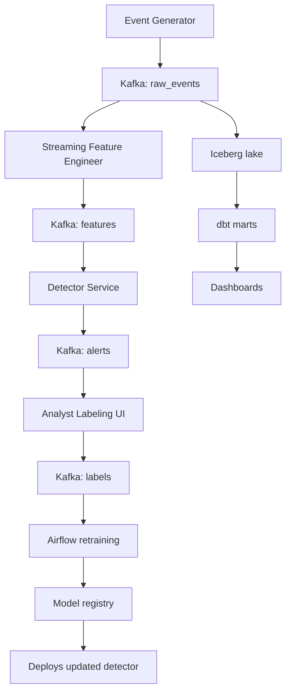
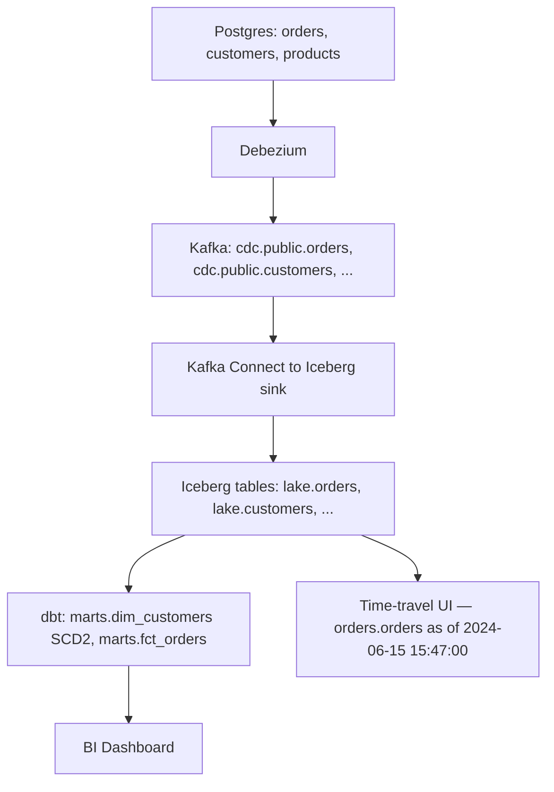

# 05 — Fortune 100 Portfolio Projects

Seven projects engineered to demonstrate the technical depth, architectural judgment, and production thinking that Fortune 100 data engineering teams hire for.

## Why "Seven" Doesn't Mean "Build Seven"

You build **two or three** of these — deeply. Not seven shallowly. A portfolio of seven half-finished projects is worse than one polished project, because half-finished projects telegraph "I quit when things get hard." The wrong signal entirely.

The right strategy:

1. Pick **one project from a list of three "must do"** (below) — these are universally valued
2. Pick **one project from the remaining four** that aligns with your career direction
3. Optionally pick a third that lets you demonstrate adjacent breadth

## The Three "Must Do" Projects (Pick One)

Each one alone is enough to anchor a senior DE interview at any F100. All of them combine the core competencies (batch + streaming + warehouse + orchestration + observability) with a genuinely interesting technical problem.

1. **Project 1: Real-Time Anomaly Detection with Feedback Loop**
2. **Project 2: CDC Lakehouse with Time Travel**
3. **Project 4: The Cost Crime Scene (Warehouse Cost Audit & Refactor)**

The other four are excellent but more specialized. Pick based on the role direction you're targeting.

---

## Project 1 — Real-Time Anomaly Detection with Feedback Loop

### The Business Framing

Pick a domain with a stream of events where anomalies matter: financial transactions (fraud), logistics events (lost packages, wrong-warehouse routings), web traffic (DDoS, bot activity), IoT sensors (equipment failure). The pipeline doesn't just *detect* anomalies — it sustains a closed loop where analysts review flagged events, label them, and the labels feed back to improve detection.

Most "fraud detection" projects stop at "send to a queue when something looks weird." That's the easy half. The interesting half is the operational loop: how do you keep the detector calibrated, how do you measure false positive rate over time, how do you handle concept drift?

### Tech Stack

- **Ingestion:** Synthetic event generator → Kafka (you build the generator with `faker` plus a configurable "fraud injection" rate)
- **Streaming:** Kafka Streams or Flink for windowed feature computation; a real-time scoring service for the actual detection
- **Storage:**
  - Hot path (last 7 days): Kafka topics + an OLAP store (ClickHouse or Apache Druid)
  - Warm path: Iceberg tables in object storage
  - Cold path: Parquet in object storage with lifecycle to cheap tier
- **Labeling UI:** A small web app (Streamlit or NextJS) where analysts review flagged events and click "fraud / not fraud"
- **Feedback:** Labels written back to Kafka → consumed by a retraining pipeline → updated detector deployed via a model registry (MLflow)
- **Orchestration:** Airflow for the retraining pipeline; Kafka itself for streaming
- **Observability:** Prometheus + Grafana for system metrics; a custom data quality layer for detection quality metrics (precision, recall, F1 over time)

### Architecture Sketch



### The Interesting Technical Decisions

1. **Feature engineering: real-time vs batch.** Some features (transaction amount) are point-in-time. Others (transactions in last 24 hours for this user) require state. Kafka Streams' state stores or Flink's keyed state are the right home — but you have to design the state schema carefully because schemas evolve and state is hard to migrate.

2. **The cold start problem.** When you deploy a new detector, where do labels come from? You need a synthetic labeling phase (analysts review unflagged events too) and rules-based detection as a baseline.

3. **Concept drift.** Fraud patterns change. Your precision metric will drift down over time even if the detector is "the same." You need monitoring that distinguishes detector degradation from environment change.

4. **Exactly-once vs at-least-once.** Be honest in your README about which guarantee you're providing and why. False alerts from at-least-once delivery are fine; missed fraud events from at-most-once delivery are not.

### Acceptance Criteria

- 1000+ events/second sustained throughput, documented with load test results
- End-to-end latency (event → alert) under 5 seconds at the 95th percentile
- A working labeling UI with at least 50 labeled events stored
- A retraining pipeline that runs nightly and deploys a versioned model
- Dashboards tracking: events/sec, alerts/sec, precision over time, recall over time, latency distribution
- A README that includes the trade-offs you made and what you'd build next

### Stretch Goals

- A/B test two detectors in parallel, route a small % of traffic to the new one, compare metrics
- Add an "explain this alert" feature using SHAP or similar
- Implement model rollback when precision degrades sharply

### Interview Talking Points

- "Walk me through how you'd design a fraud detection system." — You have a 30-minute answer.
- "How do you handle concept drift?" — You've actually dealt with it.
- "How would you operationalize an ML model in a streaming pipeline?" — You've done exactly this.

### Realistic Time Estimate

**8–12 weeks** at 10 hrs/week. This is a substantial project. Don't underestimate the labeling UI — it's the part most engineers want to skip and it's the part that demonstrates production thinking.

---

## Project 2 — CDC Lakehouse with Time Travel

### The Business Framing

Every Fortune 100 company has a problem: their operational databases (Postgres, MySQL, Oracle) hold the truth about the business, but they're terrible for analytics. The standard solution is **Change Data Capture (CDC)** — stream every database change to a data lake in near-real-time, and use that lake for analytics, audit, and ML.

The twist that makes this project F100-grade: you support **time travel**. Any analyst can query "what did the orders table look like at 3:47 PM last Tuesday?" This is huge in regulated industries (every finance, healthcare, and insurance F100) and increasingly common everywhere because of GDPR/CCPA-driven audit requirements.

### Tech Stack

- **Source:** Postgres or MySQL with a sample app generating ongoing changes (use a synthetic e-commerce or banking app)
- **CDC:** Debezium → Kafka (canonical pattern in production)
- **Streaming:** Kafka Connect → Iceberg sink, or a custom Spark Structured Streaming job writing to Iceberg
- **Storage:** Iceberg tables on S3/GCS, partitioned by day
- **Query layer:** Trino or Spark SQL for ad-hoc; dbt for modeled marts
- **Orchestration:** Airflow for the dbt runs; Kafka Connect for the CDC stream
- **Visualization:** A small UI that lets you pick a table and a point in time and see the state

### Architecture Sketch



### The Interesting Technical Decisions

1. **Initial snapshot + ongoing CDC.** Debezium's snapshot+streaming mode is conceptually simple but operationally tricky. What if the snapshot takes 6 hours on a large table? How do you ensure no events are missed during the cutover? Document your approach.

2. **Idempotency.** Every CDC event has a position (Postgres LSN, MySQL binlog position). Use it as a deduplication key — your Iceberg sink must be idempotent on this key.

3. **Schema evolution.** Source schemas change (someone runs `ALTER TABLE`). Your sink needs to handle column adds without breaking. Iceberg's schema evolution is the right primitive; document how Debezium's schema change events flow through.

4. **The "deletes" problem.** A row in a CDC stream can be `INSERT`, `UPDATE`, or `DELETE`. Iceberg's MERGE statement is your friend. Be explicit in your README about how soft deletes vs hard deletes are handled.

5. **Compaction.** Many small files from streaming writes kill query performance. You need a compaction job that periodically rewrites partitions into larger files. Document the trade-off (compaction costs compute but query cost drops dramatically).

### Acceptance Criteria

- A live source database with at least 3 tables and ongoing change traffic
- Sub-1-minute lag from source change to lake table
- Time travel works: you can query any table at any point in the last 30 days
- A schema change on the source propagates without breaking the lake
- Compaction runs nightly and is documented
- Soft-deletion (deleted rows still queryable in history) clearly separated from hard-deletion

### Stretch Goals

- Implement bi-temporal modeling — track both *valid time* (when the fact was true in reality) and *transaction time* (when it was recorded). This is gold in regulated industries.
- Add a data audit feature: "show me every change to customer 42's record in the last 90 days."
- Build a "data Wayback Machine" UI — graphical time selector for any table.

### Interview Talking Points

- "Tell me about a CDC pipeline you've built." — Specific, detailed answer.
- "How do you handle schema evolution in a data lake?" — You have a concrete answer with trade-offs.
- "How would you implement an audit trail for sensitive data?" — Already done.
- "What's the difference between Iceberg, Delta, and Hudi?" — You can credibly compare them.

### Realistic Time Estimate

**6–10 weeks** at 10 hrs/week.

---

## Project 3 — Multi-Tenant SaaS Analytics Platform

### The Business Framing

You're building the data platform for a SaaS company with thousands of customer tenants. Each tenant gets their own dashboards, their own data isolation, and their own ability to query their data. The platform serves embedded analytics inside the SaaS product (not analyst-facing BI).

This is the actual problem at every B2B SaaS F100: Salesforce, ServiceNow, Workday, HubSpot, Atlassian. Solving it convincingly is rare in a portfolio and instantly differentiating.

### Tech Stack

- **Source data:** Generate per-tenant event streams (user activity in a fake SaaS app)
- **Ingestion:** Single Kafka topic per event type, tenant ID as a partition key
- **Storage:** Iceberg tables with tenant ID as a partition column
- **Compute:** Trino or Snowflake for queries, with row-level security policies enforcing tenant isolation
- **Embedded analytics:** Cube.js or Apache Superset embedded mode, with tenant JWT for auth
- **API:** A small FastAPI service that authenticates tenants and proxies queries
- **Orchestration:** Airflow

### The Interesting Technical Decisions

1. **Isolation strategy.** Three options, each with trade-offs:
   - **Separate database per tenant:** Strongest isolation. Doesn't scale to thousands of tenants.
   - **Separate schema per tenant:** Better. Still hits limits.
   - **Shared schema, tenant_id column:** Scales infinitely. Hardest to make secure.
   You'll likely use the third. Be explicit about how you mitigate the security risk (row-level security, parameterized queries, never trust client-provided tenant IDs).

2. **The "noisy neighbor" problem.** One large tenant runs an expensive query and slows queries for everyone else. Mitigations: query quotas, resource groups, per-tenant rate limits, per-tenant compute pools for premium tiers.

3. **Pre-aggregation vs on-demand.** For common dashboards, pre-aggregate per tenant. For ad-hoc queries, compute on demand. Where's the boundary? You'll need a strategy.

4. **Cost attribution.** When tenant A runs 80% of queries, can you bill them 80% of the warehouse cost? Build per-tenant cost tracking. This is the operational metric SaaS leaders care about most.

5. **Onboarding/offboarding tenants.** Adding a new tenant should be a 1-minute operation, not a deploy. Removing a tenant should permanently delete their data (GDPR). Both should be automated.

### Acceptance Criteria

- 50+ simulated tenants with varying activity levels
- Row-level security enforced at the query layer, validated by an automated test (tenant A's query for tenant B's data returns nothing)
- An embedded analytics demo: log in as a tenant, see only their data, run an ad-hoc query
- Per-tenant cost dashboard showing query count, bytes scanned, and inferred $cost
- Adding a new tenant is a single API call
- Deleting a tenant is GDPR-compliant (data physically removed, verified)

### Stretch Goals

- Implement a self-service custom metric builder for tenants
- Add a query cost preview ("this query will scan ~5GB, ~$0.02") before execution
- Multi-region: tenants in EU stay in EU, US in US, query layer routes correctly

### Interview Talking Points

- This is the project to mention at Salesforce, ServiceNow, Workday, HubSpot, Atlassian, Datadog, Stripe, and dozens of other SaaS F100s. They face this exact problem every day.
- "How do you handle multi-tenancy in a data platform?" — You can talk for an hour.

### Realistic Time Estimate

**8–12 weeks** at 10 hrs/week.

---

## Project 4 — The Cost Crime Scene

### The Business Framing

The most senior thing a data engineer does isn't building new pipelines. It's keeping the existing ones from bankrupting the company. This project frames you as a "data archaeologist" — you've inherited a poorly-designed warehouse from your predecessor, and your job is to make it 60% cheaper without breaking anything.

You build both halves yourself: first the deliberately-bad warehouse, then the audit, then the refactor. Document everything as if it were a real consulting engagement.

### Why This Project Wins Interviews

Most candidates talk about projects they built. Almost no one talks about projects they fixed. The latter signals seniority. F100 hiring managers are *desperate* for engineers who think about cost — most companies are panicking about their Snowflake or Databricks bill.

### Tech Stack

- A warehouse (Snowflake free trial, BigQuery free tier, or Databricks)
- dbt for the transformation layer (poorly written, then refactored)
- A workload generator that runs realistic queries on a schedule

### The "Crime Scene" — What You Build First

A warehouse with deliberate but realistic anti-patterns:

1. **A fact table with no partitioning or clustering** — full scans on every query
2. **`SELECT *` everywhere** — even in dashboards that only need 3 columns
3. **CTEs that get materialized N times** — non-incremental tables rebuilt fully every hour
4. **A "kitchen sink" mart** — a 200-column denormalized table that's joined into for everything
5. **Unused materialized views** — set up by someone who left two years ago, still refreshing nightly
6. **Cross-region queries** — data in us-east, queries running in us-west
7. **Dashboards hitting raw tables** — no staging layer, no marts, every dashboard re-runs cleansing logic
8. **`SELECT DISTINCT` to "fix" duplicates** — when the real problem is a broken join
9. **A nightly job that overwrites a 500GB table** that only had 1MB of new data
10. **Materialized aggregations no one reads** — top-of-funnel funnel metrics from a deprecated product

Generate enough query volume that the costs are real. Document the baseline: total monthly cost, top 10 most expensive queries, byte scan distribution.

### The Refactor

For each anti-pattern, write a section in your report:

1. **The pattern:** What's wrong
2. **The cost:** Quantify it (bytes scanned, $ spent)
3. **The fix:** Specific change (partition this, materialize that as incremental, kill the unused MV)
4. **The risk:** What could break
5. **The validation:** How you proved the fix worked

Re-run your workload after the fix. Document new baseline. Target: 60% cost reduction. The exact number matters less than the process.

### The Final Artifact

A 20–30 page report (delivered as a markdown document with charts):

- Executive summary (one page)
- Audit methodology
- Findings (the 10 anti-patterns, each with before/after)
- Refactor strategy
- Implementation plan with risk mitigation
- Final cost analysis with a 12-month forecast

This document is your portfolio piece. Worth more than most resumes.

### Acceptance Criteria

- The "crime scene" is realistic — a senior reviewer would believe it could be a real company's warehouse
- The audit identifies at least 8 distinct anti-patterns
- The refactor achieves at least 50% cost reduction (60% target)
- No regression in query correctness (you have validation tests)
- The report is publishable on a blog without changes

### Stretch Goals

- Build a "warehouse cost CI" — automated checks in pull requests that flag expensive query patterns before they ship
- Add a per-team cost dashboard with budget alerts
- Write a follow-up blog post: "The 10 most expensive SQL mistakes I see in interviews"

### Interview Talking Points

- "Tell me about a time you reduced cost." — You have a 40-minute answer.
- "How do you think about FinOps for data?" — Specific, opinionated answer.
- "What's the most expensive query pattern you've seen?" — You have a top-10 list.

### Realistic Time Estimate

**6–8 weeks** at 10 hrs/week. Less time than the others because there's no streaming infrastructure to build, but high research density.

---

## Project 5 — Point-in-Time-Correct ML Feature Store

### The Business Framing

The single biggest hidden bug in production ML systems is **training-serving skew**: the features you used in training don't match what's actually available at inference time. The most insidious version is **time leakage** — your training features accidentally contain information from the future, so your model looks brilliant in eval and fails in production.

The fix is a **point-in-time-correct feature store**. For any historical timestamp T, you can compute the exact feature values that *would have been available at T*. Sounds simple. Is brutally hard.

This project bridges DE and ML and is increasingly its own role (Feature Store Engineer, ML Platform Engineer).

### Tech Stack

- **Online store:** Redis or DynamoDB — sub-10ms lookup for inference
- **Offline store:** Iceberg or Delta tables — full historical training data
- **Feature transformation:** Spark for batch features, Kafka/Flink for streaming features
- **Feature registry:** Feast (open source), Hopsworks, or build a custom registry — see vendor note below
- **Serving:** A FastAPI service that reads from the online store
- **Training pipeline:** Generates point-in-time-correct training datasets from the offline store

**Vendor landscape note (2025–2026):** The feature store market consolidated significantly. **Tecton was acquired by Databricks in August 2025** and is now folding into the Databricks platform — if you're already on Databricks, Tecton's capabilities are becoming native. **Feast** (open source) remains viable but is effectively a ~0.3 FTE maintenance project — functional, but don't expect significant new features; budget for ongoing maintenance if you adopt it. **Hopsworks** is the independent middle ground: fully open-source core, active development, runs on Kubernetes, supports both batch and streaming features, and isn't tied to a single cloud vendor's roadmap. For a greenfield feature store in 2026 that isn't on Databricks, Hopsworks is the safest independent bet.

### The Hard Problem: Point-in-Time Correctness

If you have:

- A training event at time T1
- A feature `purchase_count_last_30_days` that updates every minute
- And you naively join the latest feature value...

You'll get a value that includes data from after T1. Your model trains on the future. It looks great in eval. It fails in production.

The fix: every feature update must be timestamped, and your training data generator must use a **temporal as-of join** that finds the most recent feature value *before* T1.

```sql
-- Conceptually: get features as of training event time
SELECT
  e.event_id,
  e.user_id,
  e.event_time,
  e.label,
  f.purchase_count_30d
FROM training_events e
ASOF JOIN feature_purchase_count f
  ON e.user_id = f.user_id
  AND f.feature_time <= e.event_time
```

ASOF joins are a real SQL feature in DuckDB, ClickHouse, kdb+. Most warehouses require manual implementation with `ROW_NUMBER()` window functions. Show you understand the pattern and have implemented it.

### Acceptance Criteria

- At least 5 features defined in a feature registry
- Online store: <10ms p99 latency on feature lookup
- Offline store: a function that generates a point-in-time-correct training set for any timestamp range
- A test that verifies no temporal leakage (impossible to get a feature value with `feature_time > event_time`)
- Online/offline parity test (the same feature value computed both ways matches)
- A model trained with leaky features vs leak-free features — show the difference in production-like eval

### Stretch Goals

- Streaming feature pipeline (Kafka → Flink → online store) for features that need fresh updates
- Feature monitoring: alert when a feature's value distribution drifts in production vs training
- Feature versioning — change a feature's logic, train a new model, keep the old feature live until cutover

### Interview Talking Points

- This project is *gold* at any F100 with serious ML: Meta, Google, Amazon, Apple, Microsoft, Uber, Airbnb, plus any company with a quant or risk team (every bank, insurance company).
- "Tell me about a time you debugged a hard ML data issue." — Point-in-time bugs are the canonical example.

### Realistic Time Estimate

**10–14 weeks** at 10 hrs/week. The hardest of the seven. Worth it.

---

## Project 6 — Data Observability Platform (Mini Monte Carlo)

### The Business Framing

dbt tests catch known issues. Monte Carlo and Datafold catch unknown ones. The category is called "data observability" and it's where data quality is heading — from explicit assertions to anomaly detection on metrics about your data.

You build a self-hosted observability platform: it watches your other pipelines, detects freshness issues / schema changes / volume anomalies / distribution shifts, fires alerts, and provides a lineage-aware root-cause analysis UI.

### Tech Stack

- A small Postgres database for storing observability metadata (tables tracked, expectations, incident history)
- A scheduler (Airflow) for periodic checks
- An anomaly detector (a few statistical methods — rolling mean ± k·stddev, MAD, Prophet for seasonality)
- A lineage graph (parsed from OpenLineage events emitted by your other pipelines)
- A web UI (Streamlit, NextJS, or FastAPI + minimal frontend)
- Slack/email integration for alerts

### The Capabilities You Build

1. **Freshness checks.** "Table X should be updated at least every 6 hours." Detect when it's stale.
2. **Volume anomalies.** Daily row counts shouldn't deviate >3 stddev from rolling mean. Alert when they do.
3. **Schema change detection.** Diff schemas day-over-day. Alert on breaking changes (column removed, type changed).
4. **Distribution shifts.** Numeric column means/stddevs, categorical column value distributions. Alert on drift.
5. **Lineage-aware blast radius.** When upstream table X breaks, show which downstream marts/dashboards are affected.
6. **Root-cause analysis.** When mart Y has bad data, walk the lineage backwards, run quick diagnostic queries at each node, identify the likely upstream cause.

### Acceptance Criteria

- Track at least 20 tables across multiple data systems
- Run checks on a schedule, with results stored historically
- A dashboard showing system-wide data health
- A detected incident with a useful alert (not just "row count is low" but "row count is 87% lower than expected based on the last 30 days; this table feeds 3 downstream marts and 7 dashboards")
- Lineage visualization that's actually navigable
- An end-to-end demo: break a source intentionally, get an alert within 5 minutes, click through to the root cause

### Stretch Goals

- Auto-generated runbooks per incident type
- Integration with the orchestrator: pause downstream tasks when their upstreams are flagged
- Predictive freshness — alert *before* the SLA is breached based on processing trends

### Interview Talking Points

- "How would you design a data observability system?" — You built one.
- "What's the difference between data quality and data observability?" — Real, opinionated answer.

### Realistic Time Estimate

**6–10 weeks** at 10 hrs/week.

---

## Project 7 — Federated Data Mesh with Data Contracts

### The Business Framing

The trend in F100 data architecture is **data mesh** — instead of a central data team managing one giant warehouse, individual domain teams own their data products and publish them with explicit **contracts**. The central team becomes a platform team, not a bottleneck.

You can't build a "real" data mesh as a single person, but you can simulate one convincingly. Build three "domain teams" — each with its own dbt project, repo, and CI — publishing data products that other domains consume via contracts.

### Tech Stack

- **Three repos** — `team-orders`, `team-customers`, `team-finance`. Each one is its own dbt project with its own CI.
- **A "platform" repo** — `data-platform` with shared infrastructure (Terraform, monitoring config, contract validators)
- **Storage** — Iceberg tables, namespaced per domain
- **Contracts** — dbt's `contract` feature plus a custom validator that checks contracts on every PR
- **Lineage** — OpenLineage events flowing into a central catalog (DataHub open source, or your own)
- **Discovery** — a catalog UI where teams can browse other teams' data products

### The Interesting Technical Decisions

1. **What's a data product?** Define it concretely: a named, versioned, documented, contract-enforced table or set of tables. Quality SLAs. Owner. Update frequency. Documented schema and semantics.

2. **Contracts as code.**
   ```yaml
   # team-orders/contracts/dim_orders.yaml
   data_product: orders.dim_orders
   owner: team-orders@example.com
   sla:
     freshness: 1 hour
     completeness: 99.5%
   schema:
     - name: order_id
       type: string
       required: true
       unique: true
     - name: customer_id
       type: string
       required: true
       relationship: customers.dim_customers.customer_id
     - name: order_status
       type: string
       allowed_values: [pending, paid, shipped, delivered, cancelled]
   ```
   A PR to `team-orders` that breaks this contract gets rejected by CI.

3. **Cross-team consumption.** Team-finance reads `orders.dim_orders` and `customers.dim_customers`. Their dbt project declares these as sources. If a producing team breaks their contract, the consuming team's CI catches it.

4. **Discovery.** A catalog UI that shows all data products across all teams, their owners, freshness, lineage, sample queries.

5. **Governance without bureaucracy.** Document how you'd handle: deprecating a data product, evolving a contract (versioning), security/access reviews.

### Acceptance Criteria

- Three working domain repos, each with its own dbt project and CI
- At least 5 data products published across the domains
- At least 2 cross-domain dependencies (one domain consuming another's product)
- A contract validator that catches breaking changes in CI
- A central catalog UI showing all data products with lineage
- A simulated incident: break a contract, watch CI block the PR, fix it, see CI pass

### Stretch Goals

- Implement contract evolution: a producer can release a v2 of a contract, consumers migrate at their pace
- Add data product quality scoring (freshness × completeness × test pass rate × consumer adoption)
- Build "consumer SLOs" — what guarantees does the producer promise the consumer

### Interview Talking Points

- "What do you think about data mesh?" — You built one. You have opinions.
- "How do you handle dependencies between data teams?" — Concrete answer with code.
- "How would you approach data governance at scale?" — Real-world answer.

### Realistic Time Estimate

**8–12 weeks** at 10 hrs/week.

---

## How to Present These Projects

### The Repo Structure

For each project:

```
project-name/
├── README.md                 # The most important file
├── ARCHITECTURE.md           # Detailed architecture
├── DECISIONS.md              # Trade-offs you made and why
├── docker-compose.yml        # One-command local startup
├── Makefile                  # `make up`, `make test`, `make seed`
├── terraform/                # Cloud infrastructure
├── airflow/                  # DAGs
├── dbt/                      # Models
├── streaming/                # Kafka/Flink jobs
├── dashboards/               # Notebooks or BI config
└── tests/                    # End-to-end tests
```

### The README

The README is the most-read part of your project. Treat it as a tech blog post.

**Sections (in order):**

1. **One-paragraph summary.** What the project does and why it's interesting.
2. **Architecture diagram.** Mermaid is fine.
3. **Tech stack.** With one sentence on *why* each choice.
4. **Quickstart.** 5 commands to get running.
5. **Key design decisions.** 3–5 things you thought hard about, with trade-offs.
6. **Operational notes.** How it's monitored, how it handles failure, cost.
7. **What I'd build next.** Shows you have an extension roadmap.
8. **What didn't work.** Shows honesty and self-awareness. Optional but powerful.

Length: 1500–3000 words. Long enough to be substantial, short enough to read in one sitting.

### Where to Host

- Public GitHub repo (the obvious one)
- A blog post — Medium, your own site, dev.to. Cross-link with the repo. The blog post is what gets shared on LinkedIn.
- A short demo video (3–5 minutes, screen recording, narrated). Drop it in the README.

### How to Talk About It in Interviews

A formula that works:

1. **One sentence framing.** "I built a real-time anomaly detection system with a feedback loop because most fraud detection projects skip the operational reality of keeping the detector calibrated."
2. **The interesting decision.** Pick the *one* technical decision that was non-obvious and explain it for 3 minutes. Trade-offs, alternatives considered, why you picked what you picked.
3. **What you'd do differently.** Self-awareness is high-signal.

If the interviewer wants to go deeper, you have hours of material. If they don't, you've shown your best work in 5 minutes.

---

## A Realistic Timeline to F100-Ready

Assuming you finish the core track plus the specialization phase (≈4 months at 10 hrs/week):

- **Month 5–8:** Project #1 — pick one of the "must do" three. Deep work. Treat it like a real job.
- **Month 9–11:** Project #2 — second one, in a different specialization to show breadth.
- **Month 12:** Polish, blog posts, LinkedIn presence. Apply.

Total: 12 months of focused part-time work from a serious start, with 2 portfolio projects deep enough to anchor any F100 interview.

If you only have time for one project, pick **Project 1, 2, or 4**. Any of those alone is enough to interview confidently.

---

## A Note on Talking About These Projects

These are *learning projects*. They're not "I built this for my employer." Be honest about that in interviews — F100 hiring managers respect candidates who built something serious in their own time more than they respect candidates who exaggerate work experience.

The right framing: "I built this on my own to deeply learn X. Here's what I'd do differently with a team and a year of runway."

That's a senior signal.

---

## You can now

- Choose which portfolio projects to build for a target F100 role, and justify two or three deep over seven shallow.
- Scope an F100-grade project end to end — real-time anomaly detection, CDC lakehouse, cost audit, feature store, observability platform, or data mesh — with acceptance criteria a senior reviewer would respect.
- Design the architecture for each, naming the *interesting* technical decision (identity resolution, point-in-time correctness, exactly-once trade-offs) rather than just the tool list.
- Write a project README that reads like a tech blog post — architecture diagram, decisions-and-trade-offs, cost analysis, and what you'd build next.
- Present any of these as a senior interview narrative: one-sentence framing, the one non-obvious decision explained, and what you'd do differently.
