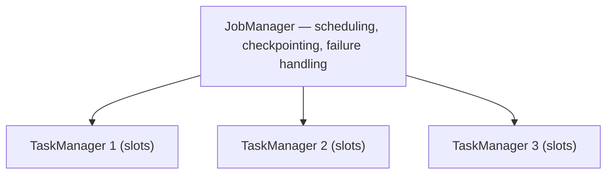
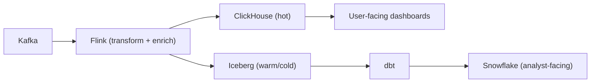
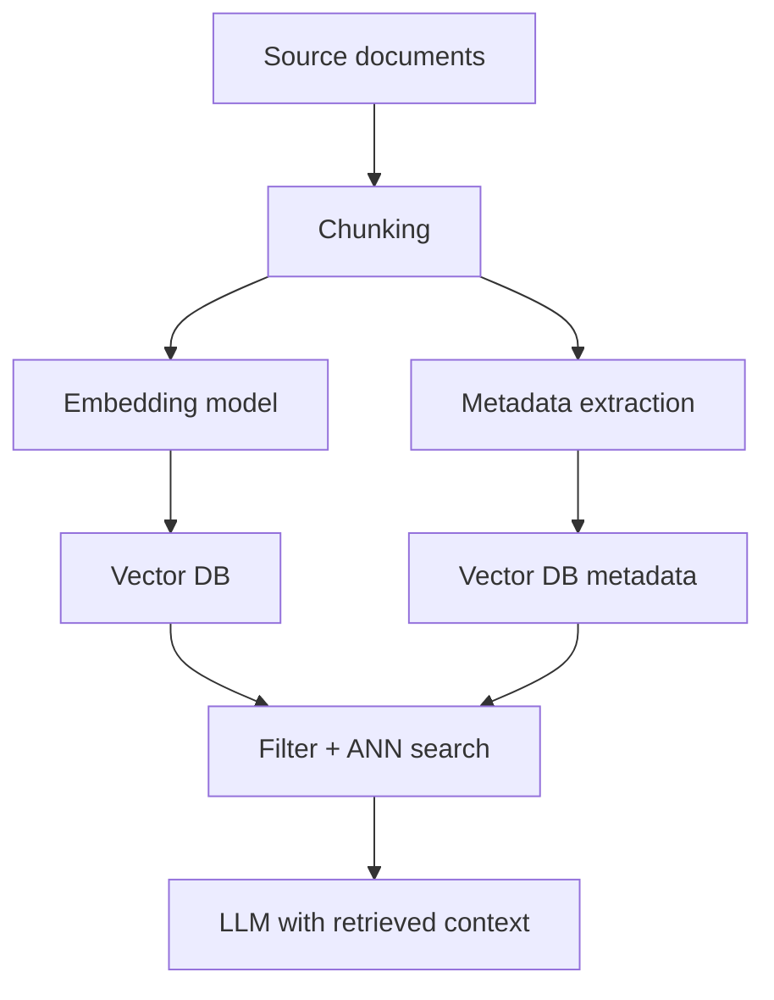
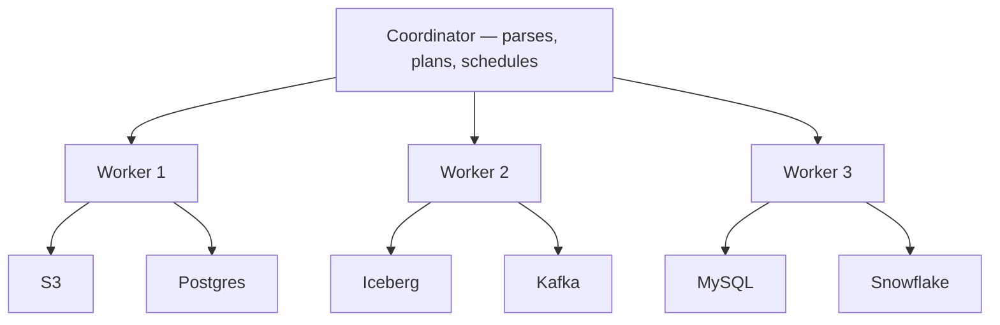

# 06 — Advanced Topics: Everything Else Worth Knowing

The earlier sections cover the core curriculum, the F100 specialization tools, and the portfolio projects. This section covers the remaining body of knowledge that distinguishes a strong senior data engineer from a competent mid-level one — distributed systems theory, deep SQL, storage internals, alternative architectures, and the operational concerns that don't show up until you've shipped real systems.

Treat this as a **post-graduate curriculum**. You don't sit down and march through it. You consult it as you build the projects, as you encounter new problems at work, and as you prepare for interviews.

**How to use this section:** It's organized in 17 phases. Phase 1–4 are foundational theory — work through them sequentially. Phase 5 onward are specialized topics — read in any order based on the role you're targeting and the problems you're solving.

---

## Phase 1 — Distributed Systems Foundations

Most DE problems are distributed systems problems wearing different clothes. Without this foundation, you'll keep re-learning the same lessons by hitting the same walls.

### What to Learn

#### CAP and PACELC

**CAP theorem:** In the presence of a network **P**artition, a system must choose between **C**onsistency and **A**vailability. You can't have all three.

CAP is famous and slightly misleading. The better mental model is **PACELC**: in the presence of a Partition (P), choose Availability (A) or Consistency (C); Else (E), choose Latency (L) or Consistency (C). Real systems make this second trade-off constantly — even when there's no partition, faster reads usually mean weaker consistency.

**Examples to internalize:**
- Postgres (single-node): CA (no partitions to worry about)
- Cassandra: AP/EL — prioritizes availability and low latency, eventual consistency
- Spanner: CP/EC — strong consistency everywhere, accepts higher latency
- DynamoDB: tunable — you pick per request

#### Consistency Models

From strongest to weakest:

- **Linearizability** — every operation appears to happen instantaneously at some point between its call and return. The gold standard.
- **Sequential consistency** — operations from each client appear in order, but across clients the global order can be reordered.
- **Causal consistency** — operations that are causally related appear in the right order; unrelated ones can be in any order.
- **Read-your-writes** — you can always read what you just wrote.
- **Eventual consistency** — eventually, replicas agree. No guarantees about *when*.

For DE: most warehouses are eventually consistent for replicated reads but linearizable within a single write transaction. Most lakehouse formats provide *serializable* isolation (slightly weaker than linearizable but still strong).

#### Replication Strategies

- **Single-leader (primary-replica):** Postgres replication, most relational systems. Writes go to leader; reads can go anywhere with eventual lag.
- **Multi-leader:** rare and complex; needed for geo-distributed writes. Conflict resolution is the hard part.
- **Leaderless:** Cassandra, DynamoDB. Writes go to multiple nodes; quorum-based reads. R + W > N for strong reads.

#### Partitioning (Sharding) Strategies

- **Range partitioning** — partition by a key range. Good for ordered scans, bad for hotspots (e.g., "all today's events" land on one shard).
- **Hash partitioning** — hash the key, mod by shard count. Even distribution, terrible for range scans.
- **Composite** — hash on a high-cardinality field, range within (e.g., DynamoDB partition key + sort key).
- **Geo-partitioning** — by user region. Required for data residency compliance.

Every distributed database is a remix of these choices. Kafka uses hash partitioning on the message key. BigQuery uses range partitioning on a date/integer column. Snowflake uses micro-partitions automatically (range-like, but managed). The vocabulary is the same.

#### Consensus (Conceptually)

You don't need to implement Raft. You need to know:

- **Why consensus matters:** Multiple nodes agreeing on a single value (e.g., "who's the leader?", "what's the next log entry?") in the presence of failures.
- **Raft is the easier-to-understand modern consensus algorithm.** Watch the [Raft visualization](https://raft.github.io/).
- **Where you see it in DE:** Kafka's controller election (KRaft mode, post-ZooKeeper), etcd, every modern distributed database's metadata layer.

### The Reading

Three resources, in order of priority:

1. **Designing Data-Intensive Applications** by Martin Kleppmann. Chapters 5–9 are the distributed systems heart. If you only read one thing in this entire file, it's these chapters.
2. **The Dynamo paper** (Amazon, 2007) — foundational for eventually-consistent stores.
3. **The Spanner paper** (Google, 2012) — TrueTime and globally consistent transactions.

### Exercises

1. Sketch the architecture of three DE systems you've used (Postgres, Kafka, BigQuery, Snowflake — pick any). For each, identify: leader topology, replication strategy, consistency model, partitioning strategy.
2. Write a 500-word explanation of why exactly-once semantics across heterogeneous systems is hard, citing CAP and the two-phase commit cost.
3. Pick one paper from the [Papers We Love DE list](https://github.com/papers-we-love/papers-we-love) and write a one-page summary.

---

## Phase 2 — SQL Mastery Beyond the Basics

The medium-tier guide covered window functions and CTEs. This phase pushes deeper into the SQL that shows up in F100 interviews and real platform work.

### Window Functions — The Hard Patterns

```sql
-- Running totals partitioned and ordered, with frame specification
SELECT
  user_id,
  event_time,
  amount,
  SUM(amount) OVER (
    PARTITION BY user_id
    ORDER BY event_time
    ROWS BETWEEN UNBOUNDED PRECEDING AND CURRENT ROW
  ) AS running_total,

  -- 7-day rolling window — RANGE is time-aware
  SUM(amount) OVER (
    PARTITION BY user_id
    ORDER BY event_time
    RANGE BETWEEN INTERVAL '7 days' PRECEDING AND CURRENT ROW
  ) AS amount_last_7d,

  -- Find session boundaries: a new session starts after 30 min of inactivity
  CASE
    WHEN event_time - LAG(event_time) OVER (PARTITION BY user_id ORDER BY event_time) > INTERVAL '30 minutes'
    THEN 1 ELSE 0
  END AS session_start,

  -- Then cumulatively sum the boundaries to get a session ID
  SUM(CASE
    WHEN event_time - LAG(event_time) OVER (PARTITION BY user_id ORDER BY event_time) > INTERVAL '30 minutes'
    THEN 1 ELSE 0
  END) OVER (PARTITION BY user_id ORDER BY event_time) AS session_id

FROM events;
```

Sessionization is the canonical "you can do this in SQL?" interview question. Internalize the pattern.

### Recursive CTEs

For hierarchies and graph traversal:

```sql
-- Find the full reporting chain for every employee
WITH RECURSIVE org_chain AS (
  -- Base case: top-level employees (no manager)
  SELECT employee_id, manager_id, name, 0 AS depth, ARRAY[name] AS chain
  FROM employees
  WHERE manager_id IS NULL

  UNION ALL

  -- Recursive case: employees whose manager we've already found
  SELECT e.employee_id, e.manager_id, e.name, oc.depth + 1, oc.chain || e.name
  FROM employees e
  JOIN org_chain oc ON e.manager_id = oc.employee_id
)
SELECT * FROM org_chain;
```

Used for: org hierarchies, category trees, dependency resolution, graph shortest paths.

### MERGE and UPSERT Patterns

The single most useful statement for incremental data loads:

```sql
MERGE INTO target t
USING source s
  ON t.id = s.id
WHEN MATCHED AND t.updated_at < s.updated_at THEN
  UPDATE SET name = s.name, updated_at = s.updated_at
WHEN NOT MATCHED THEN
  INSERT (id, name, updated_at) VALUES (s.id, s.name, s.updated_at)
WHEN MATCHED AND s.is_deleted THEN
  DELETE;
```

This is what dbt's `incremental` materialization compiles to. Every CDC sink uses it. Postgres calls it `INSERT ... ON CONFLICT DO UPDATE`. BigQuery, Snowflake, Spark SQL, and Iceberg all support `MERGE`.

### Query Plans

Every database has an `EXPLAIN` command. Reading query plans is one of the highest-leverage skills a DE has. Three plan elements to focus on:

1. **Scan types:** sequential scan (reads everything), index scan (uses an index), partition pruning (only some partitions), broadcast vs shuffle.
2. **Join types:** hash join, nested loop join, merge join, broadcast hash join. The optimizer picks one; you can sometimes hint.
3. **Rows estimated vs actual:** When these differ by 10x+, the optimizer made bad decisions. Update statistics or rewrite the query.

```sql
EXPLAIN (ANALYZE, BUFFERS) SELECT ...;  -- Postgres: shows actual execution
EXPLAIN FORMAT=JSON SELECT ...;          -- BigQuery
EXPLAIN ANALYZE SELECT ...;              -- Snowflake (returns query profile)
```

Spend a day reading plans for queries you've written. It changes how you write SQL forever.

### JSON in Modern SQL

Most warehouses now have first-class JSON support:

```sql
-- Postgres / BigQuery / Snowflake all support similar syntax
SELECT
  raw->>'event_type' AS event_type,           -- extract text
  (raw->'properties'->>'amount')::numeric,    -- extract and cast
  JSON_ARRAY_LENGTH(raw->'items') AS item_count,
  raw @> '{"status": "completed"}' AS is_complete  -- contains check
FROM raw_events;
```

You'll often land raw JSON in a `VARIANT`/`JSON` column and use SQL to extract structured columns. Especially common for webhook ingestion.

### Set Operations Beyond UNION

```sql
-- Rows in A but not B
SELECT * FROM events_today
EXCEPT
SELECT * FROM events_yesterday;

-- Rows in both
SELECT * FROM events_today
INTERSECT
SELECT * FROM events_yesterday;
```

`EXCEPT` is the easiest way to do data comparison ("what changed between these two tables?"). Use it for migration validation.

### Exercises

1. Write a sessionization query on any event stream.
2. Use a recursive CTE to compute the depth of every node in a hierarchy.
3. Write a `MERGE` that handles inserts, updates, and soft deletes.
4. Pick a slow query you've written and read its query plan. Identify one inefficiency.
5. Use `EXCEPT` to find rows that differ between two versions of a table.

---

## Phase 3 — File Formats and Storage Internals

DEs talk about Parquet constantly without knowing what's inside one. This matters because most of your job's performance comes down to file layout decisions.

### Parquet Internals

A Parquet file is structured as:

```
File
└── Row Groups (typically 128MB–512MB each)
    └── Column Chunks (one per column, per row group)
        └── Pages (typically 1MB each)
            └── Data Pages + Dictionary Pages + Index Pages
```

Key properties:

- **Column-oriented within a row group.** Reading 3 of 100 columns reads ~3% of bytes.
- **Statistics per row group:** min/max/null count for each column. Used for predicate pushdown — readers skip row groups where the filter can't match.
- **Dictionary encoding:** repeated values stored once; the column stores indexes. Massive wins for low-cardinality columns.
- **Run-length and bit-packing encoding** on top of dictionary.
- **Compression** (Snappy by default; ZSTD increasingly common) applied per page.

#### What This Means in Practice

1. **Row group size matters.** Too small → tons of metadata overhead. Too large → can't parallelize reads across them. 128MB is a reasonable default.
2. **Sort within row groups.** If readers filter on column X, sorting by X within each row group makes min/max statistics tight — readers skip most row groups.
3. **Column count matters.** 1000-column Parquet files are slower than 100-column files due to metadata.
4. **Dictionary encoding only works for low-cardinality columns.** Random UUIDs as column values produce no compression.

### ORC vs Parquet

ORC was developed by Hortonworks for Hive. Similar concept, different details:

- ORC has more aggressive lightweight indexing within row groups
- ORC supports ACID better via the Hive Streaming API
- Parquet has broader ecosystem support (every modern engine reads it)

In 2026, Parquet has won outside the Hadoop ecosystem. Iceberg, Delta, Hudi all use Parquet.

### Apache Arrow — The In-Memory Standard

Arrow is the columnar in-memory format. Parquet is the on-disk format. They're complementary.

The killer property of Arrow: **zero-copy data exchange between processes/languages**. A Python process and a Java process can share an Arrow buffer with no serialization cost. This is why the modern stack (Polars, DataFusion, DuckDB, Snowflake's Snowpark) is converging on Arrow.

Implications:

- A Spark → Pandas conversion that used to serialize each row now copies a single Arrow buffer
- A DuckDB query result can be passed to a NumPy ML model with zero serialization
- Cross-language data pipelines no longer pay serialization tax

### Compression Trade-offs

| Codec | Compression Ratio | CPU Cost | When to Use |
|---|---|---|---|
| Snappy | Low | Very low | Default for most warehouses. Fast read/write. |
| ZSTD | High | Medium | Cold storage, archives, anywhere bytes matter |
| GZIP | High | High | Legacy systems only |
| LZ4 | Low | Very low | Streaming/real-time |

For lakehouse tables: Snappy for hot data, ZSTD for cold partitions. Iceberg/Delta let you specify per-table.

### File Size Optimization

The "small files problem" is the single most common lakehouse pathology. Symptoms: 100K tiny files per partition, queries that spend 90% of their time listing files.

Fix: **compaction**. A scheduled job that rewrites a partition into fewer, larger files. Target file size: 128MB–1GB for analytics workloads.

```sql
-- Iceberg
CALL system.rewrite_data_files(table => 'db.orders', target_file_size_bytes => 536870912);

-- Delta
OPTIMIZE my_table;
```

### Exercises

1. Take a CSV file, write it as Parquet with different row group sizes (10MB, 128MB, 1GB), and compare query times.
2. Write the same data sorted vs. unsorted by a filter column. Time a filtered query against both.
3. Run a workload that produces small files. Then run a compaction job. Compare query times.
4. Use `pyarrow` to inspect a Parquet file's metadata directly. Look at the row group statistics.

---

## Phase 4 — The Lakehouse Deep Dive

Earlier files introduced Iceberg/Delta/Hudi. This phase goes deeper — the comparison that comes up in every senior interview.

### The Three Formats

| Feature | Iceberg | Delta Lake | Hudi |
|---|---|---|---|
| Origin | Netflix | Databricks | Uber |
| Strongest at | Schema evolution, snapshot isolation, multi-engine | Databricks ecosystem, performance | Streaming upserts |
| Native engines | Spark, Trino, Snowflake, BigQuery, DuckDB | Spark, Databricks (native), recent open additions | Spark, Flink |
| Catalog | Pluggable: Glue, Nessie, Polaris, REST | Mostly Hive metastore or Unity Catalog | Hive metastore, plus its own |
| Time travel | Yes (snapshots) | Yes (versions) | Yes (commits) |
| Schema evolution | Best in class | Good | Good |
| Partition evolution | Yes (unique to Iceberg) | No | Limited |
| Hidden partitioning | Yes (unique) | No | No |

### Iceberg-Specific Features Worth Knowing

**Hidden Partitioning.** In Hive-style tables, your `WHERE` clause must match the partition column literally. In Iceberg, you partition by a transform of a column (e.g., `days(event_time)`), and the optimizer applies the transform automatically. You write `WHERE event_time > '2024-01-01'` and Iceberg figures out which partitions to scan.

**Partition Evolution.** You can change a partition scheme without rewriting data. Old data stays in old partitions; new data uses the new scheme; queries handle both transparently. Game-changer for tables that grow into new partitioning needs.

**Snapshot Isolation.** Every write produces a new snapshot. Readers see a consistent snapshot regardless of concurrent writes. Time travel is just querying an older snapshot.

**Equality vs Position Deletes.**
- *Position deletes*: "delete row N in file X." Cheap to apply, requires reading the deletion file plus the data file.
- *Equality deletes*: "delete all rows where id = 42." More flexible, slightly more expensive to apply.

Modern Iceberg uses both depending on the operation. Streaming upserts often use equality deletes; batch deletes often use position deletes.

### Catalog Options

The catalog tracks "what tables exist and where their metadata is."

- **Glue Data Catalog** (AWS): default on AWS. Mature, but vendor-locked.
- **Hive Metastore**: the legacy choice. Still everywhere in Hadoop-era deployments.
- **Nessie**: git-like semantics for table metadata. Branches, tags, time travel via branches. Very interesting.
- **REST Catalog**: the modern open standard. Iceberg's REST catalog spec is now the canonical way.
- **Polaris** (Snowflake's open-source): REST-based, Snowflake-friendly.
- **Unity Catalog** (Databricks): Databricks' centerpiece. Strong governance features.

The trend: REST catalog implementations are converging. Multiple vendors (Snowflake, Databricks, AWS, Tabular/Databricks acquired) provide them. The lock-in is decreasing.

### Compaction and Maintenance

Lakehouse tables need ongoing maintenance:

1. **Compaction:** Rewrite small files into larger ones. Weekly is typical.
2. **Snapshot expiration:** Drop old snapshots beyond your retention window. Keep storage costs in check.
3. **Orphan file cleanup:** Failed writes can leave files no snapshot references. Periodic cleanup.
4. **Statistics refresh:** Update min/max stats after compaction.

```sql
-- Iceberg
CALL system.rewrite_data_files(table => 'orders.fct_orders');
CALL system.expire_snapshots(table => 'orders.fct_orders', older_than => TIMESTAMP '2024-01-01');
CALL system.remove_orphan_files(table => 'orders.fct_orders');
```

### Exercises

1. Create the same dataset as an Iceberg table and a Delta table. Run the same queries. Compare.
2. Implement partition evolution: change the partitioning of an Iceberg table, write new data, query across the old and new schemes.
3. Set up a Nessie catalog and use its branch feature: create a branch, write to it, merge it back.
4. Write a scheduled compaction job and run it on a table that has lots of small files. Measure before/after query times.

---

## Phase 5 — Stream Processing for Real (Flink)

Kafka is messaging. Flink is processing. The earlier guides covered Kafka and Kafka Streams; serious stream processing usually means Flink.

### Why Flink Over Kafka Streams

- **Stateful processing at scale:** Flink manages TB-scale state with checkpointing
- **True event-time processing:** First-class watermarks, late data handling, windowing
- **Exactly-once via two-phase commit sinks:** the strongest semantic across heterogeneous systems
- **More expressive APIs:** DataStream, Table API, SQL, CEP

### Flink Architecture



- **JobManager:** coordinator — schedules tasks, manages checkpoints, handles failures
- **TaskManager:** workers — each has slots that run task instances
- **Slot:** a unit of resource isolation within a TaskManager

### Stateful Stream Processing

The thing Flink does that Kafka Streams struggles with at scale:

```python
from pyflink.datastream import StreamExecutionEnvironment
from pyflink.datastream.functions import KeyedProcessFunction

class FraudDetector(KeyedProcessFunction):
    def open(self, runtime_context):
        # State per key (per user_id)
        descriptor = ValueStateDescriptor("last_txn", Types.PICKLED_BYTE_ARRAY())
        self.state = runtime_context.get_state(descriptor)

    def process_element(self, value, ctx):
        last = self.state.value()
        if last and value.amount > 10 * last.amount:
            yield Alert(value.user_id, "10x spike")
        self.state.update(value)
```

The state lives on the TaskManager, checkpointed periodically to durable storage (S3). On failure, Flink restores from the last checkpoint — exactly-once guaranteed.

### Watermarks Deeply

Watermarks are Flink's answer to "when do I know I've seen all events for a window?"

```python
.assign_timestamps_and_watermarks(
    WatermarkStrategy.for_bounded_out_of_orderness(Duration.of_seconds(5))
        .with_timestamp_assigner(SimpleTimestampAssigner())
)
```

This says: "events can be up to 5 seconds late. Once the watermark advances past time T, no more events for windows ending at T will be accepted."

Late events: Flink can handle them via `allowed_lateness` (window stays open longer) or side outputs (lateness reported as a separate stream).

### Savepoints — The Operations Feature That Makes Flink Production-Ready

A **savepoint** is a manually triggered, durable snapshot of a Flink job's state. You can stop a job, upgrade Flink, change the job DAG, and resume from a savepoint — *without losing state*.

This is what makes Flink jobs maintainable in production. Kafka Streams has nothing equivalent.

### Flink SQL

```sql
CREATE TABLE orders (
  order_id STRING,
  user_id STRING,
  amount DECIMAL(10,2),
  event_time TIMESTAMP(3),
  WATERMARK FOR event_time AS event_time - INTERVAL '5' SECOND
) WITH (
  'connector' = 'kafka',
  'topic' = 'orders',
  'format' = 'avro',
  'value.fields-include' = 'EXCEPT_KEY'
);

CREATE TABLE alerts WITH ('connector' = 'kafka', 'topic' = 'alerts', 'format' = 'json') AS
SELECT
  user_id,
  TUMBLE_START(event_time, INTERVAL '1' MINUTE) AS window_start,
  SUM(amount) AS total
FROM orders
GROUP BY TUMBLE(event_time, INTERVAL '1' MINUTE), user_id
HAVING SUM(amount) > 10000;
```

A streaming SQL job that's exactly-once, restartable, savepointable. This is the "modern" way to do stream processing in 2026 — write SQL, let Flink handle the rest.

### CEP — Complex Event Processing

Flink's CEP library detects patterns across event streams:

```python
pattern = Pattern.begin("first").where(lambda e: e.type == "login_fail") \
    .next("second").where(lambda e: e.type == "login_fail") \
    .next("third").where(lambda e: e.type == "login_fail") \
    .within(Duration.of_minutes(5))
```

"Three failed logins within 5 minutes." Used for fraud, security, IoT alerting. Not in every DE's toolkit, but worth knowing exists.

### Exercises

1. Set up a Flink cluster locally (the official Docker Compose works).
2. Write a Flink job that reads from Kafka, computes a 1-minute tumbling window aggregate, writes to another Kafka topic.
3. Implement a stateful job that detects "user X had >5 transactions in last 10 minutes."
4. Trigger a savepoint, kill the job, restart from the savepoint, verify no data lost.
5. Write the same job in Flink SQL. Compare expressiveness.

---

## Phase 6 — Real-Time OLAP (ClickHouse, Druid, Pinot)

Warehouses are for "queries over historical data, latency in seconds." Real-time OLAP is for "queries over recent + historical data, latency in milliseconds." Different category.

### When You Need Real-Time OLAP

- User-facing analytics with strict latency budgets (sub-second)
- High concurrency (thousands of concurrent queries)
- Continuously ingesting streams while serving queries
- Aggregate-heavy workloads (counts, sums, percentiles)

### The Three Major Options

**ClickHouse** — the most flexible. SQL-native, column store, very fast. Originally Yandex; now an independent company. Used at Cloudflare, Uber, ContentSquare, GitHub.

**Apache Druid** — purpose-built for time-series + dimensional aggregates. Best at "slice and dice high-cardinality data with sub-second latency." Used at Netflix, Airbnb, Twitter.

**Apache Pinot** — LinkedIn-originated. Similar use cases to Druid; slightly different architecture. Strong in real-time user-facing dashboards.

### What They All Share

- Columnar storage with aggressive compression
- Pre-aggregation/materialization options
- Inverted indexes for high-cardinality fields
- Tiered storage (hot data on local SSD, warm on object storage)
- Native streaming ingestion (Kafka connectors)

### When to Use Each

| Use Case | Best Choice |
|---|---|
| Embedded analytics in a SaaS product | Pinot or ClickHouse |
| Internal "explore the data" tools with broad SQL needs | ClickHouse |
| Time-series + dimensional cube queries | Druid |
| Replacing a slow warehouse for hot path queries | ClickHouse |
| High-cardinality customer-facing dashboards | Pinot |

### The Architecture Pattern

In 2026, the leading-edge stack often looks like:



Real-time path serves hot dashboards. Batch path serves analytical workloads. Two stores, same source-of-truth events.

### Exercises

1. Install ClickHouse locally. Load the NYC taxi dataset (or any large dataset). Run aggregations and benchmark vs Postgres on the same data.
2. Set up a Kafka → ClickHouse ingest. Stream events, query them within seconds of arrival.
3. Read the Druid docs on segments and time chunks. Sketch how it routes queries.

---

## Phase 7 — The Arrow-Native Stack

A quieter revolution is reshaping the data stack: tools that are Arrow-native, single-node, and absurdly fast.

### The Players

- **Polars** — Rust-based pandas replacement. 10–100× faster on typical workloads. Lazy evaluation.
- **DuckDB** — embedded analytical database. Single file, no server. Queries Parquet/CSV/JSON natively.
- **DataFusion** — Rust query engine. Building block for other tools.
- **Pandas 2.0+** — now Arrow-backed.

### Why This Stack Is a Big Deal

Old assumption: big data needs distributed compute (Spark, Snowflake). New reality:

- A 64GB laptop can chew through 100GB datasets if the engine is good
- DuckDB can outperform Spark on workloads up to single-node memory size
- Many "big data" problems are actually medium data with bad tooling

For DE, this means:

1. Local dev environments are dramatically better — your laptop runs the same engines as production
2. Dev/prod parity is easier — DuckDB locally, BigQuery in prod, with identical SQL
3. Many small pipelines can ditch Spark entirely
4. ML pipelines benefit massively — Polars' lazy execution and Arrow zero-copy

### Polars Example

```python
import polars as pl

df = (
    pl.scan_parquet("s3://bucket/events/*.parquet")  # lazy — doesn't load yet
    .filter(pl.col("event_time") > "2024-01-01")
    .group_by("user_id")
    .agg(
        pl.col("amount").sum().alias("total"),
        pl.col("event_id").count().alias("event_count"),
    )
    .filter(pl.col("total") > 1000)
    .sort("total", descending=True)
    .head(100)
    .collect()  # NOW it executes — pushes filters down, prunes columns
)
```

The lazy execution + predicate pushdown into Parquet means you might read 5% of a 100GB dataset. On a laptop. In seconds.

### DuckDB in Production

DuckDB is increasingly used in production for:

- **dbt local development** (dbt-duckdb) — run your dbt project against DuckDB locally, against BigQuery in prod, same SQL
- **Embedded analytics in apps** — Hex, Mode, Evidence.dev all use DuckDB
- **Serverless batch jobs** — Lambda function that pulls Parquet from S3 and aggregates with DuckDB
- **Ad-hoc data exploration** — `duckdb` in the terminal, query S3 files directly

### Exercises

1. Reimplement a pandas pipeline in Polars. Benchmark.
2. Use DuckDB to query a Parquet file in S3 directly without any setup. From your terminal.
3. Set up a dbt project that runs against DuckDB locally and BigQuery in CI/CD. Same models, both targets.

---

## Phase 8 — Modeling Beyond Kimball

The medium-tier guide covered Kimball (star schemas, SCD2). That's the dominant model. There are two other patterns worth knowing.

### Data Vault 2.0

Created by Dan Linstedt; dominant at large enterprises with high audit requirements (banks, insurance, healthcare).

**Three table types:**

- **Hubs:** business keys + metadata. One row per unique business entity.
- **Links:** relationships between hubs. One row per unique relationship.
- **Satellites:** descriptive attributes. Versioned over time (SCD2-like by default).

```
hub_customer (customer_id_hash, customer_business_key, load_date, source)
hub_product  (product_id_hash, product_business_key, load_date, source)
link_order   (order_id_hash, customer_id_hash, product_id_hash, load_date, source)
sat_customer (customer_id_hash, load_date, name, email, address, ...)
sat_product  (product_id_hash, load_date, name, price, category, ...)
```

**Why this pattern exists:**

- Extreme auditability — every change is timestamped and sourced
- Schema-agnostic — adding new source systems doesn't require restructuring
- Parallel loading — hubs/links/satellites can be loaded independently
- Insert-only — no updates means simpler concurrency

**Why not everyone uses it:**

- Many more tables; complex queries
- Analysts hate it (10 joins for a simple report)
- You build "information marts" on top of the vault for analytics

When you'll encounter it: any F100 in finance, insurance, healthcare, or government. If you interview at one, knowing the vocabulary is high-leverage.

### One Big Table (OBT)

The opposite extreme: denormalize aggressively into wide tables.

```sql
-- One row per order with all related data pre-joined
SELECT
  order_id,
  order_date,
  -- Customer attributes
  customer_id, customer_name, customer_segment, customer_country,
  -- Product attributes
  product_id, product_name, product_category, product_price,
  -- Order specifics
  quantity, total_amount, payment_method,
  -- Derived
  is_first_order, days_since_last_order, lifetime_value
FROM ...
```

**Why OBT is gaining traction:**

- Modern columnar stores read only the columns you need — wide tables are cheap to scan partially
- No joins at query time — fastest possible reads
- Analysts can self-serve without learning joins
- dbt's "marts" layer often *is* OBT-style

**Trade-offs:**

- Updates are expensive (one customer change → update millions of order rows)
- Storage cost higher (redundancy)
- Doesn't preserve history of dimensional changes by default

The pragmatic answer: **use both**. SCD2 dimensions for historical accuracy, plus OBT marts for fast analytics. The dimensional layer is the source of truth; OBT is the query interface.

### Activity Schema

A newer pattern from the Narrator team. The whole company gets modeled as one giant event log:

```
activity_stream:
  customer_id | activity_name | timestamp | revenue_impact | feature_json
```

Everything (signed up, viewed page, made purchase, churned) is one row in one table with self-describing JSON. Queries use specific patterns to extract analytics.

Niche but interesting — read the Narrator blog if curious. You won't see it at most F100s.

### What This Means for You

In an interview, "how do you model X" usually expects a Kimball answer. But knowing Data Vault exists separates you from candidates who only know one pattern. Volunteer the trade-off: "Star schema for analyst-facing marts; we'd consider Vault if our regulatory audit requirements were heavier."

---

## Phase 9 — Semantic Layer

The medium-tier guide ended with dbt marts. The frontier above that is the **semantic layer** — a centralized layer where business metrics are defined once and consumed by every downstream tool.

### The Problem It Solves

Every company has this conversation:

- Dashboard A: monthly revenue = $1.2M
- Dashboard B: monthly revenue = $1.4M
- Both are "right" — they're computed differently (one counts cancellations differently, the other counts taxes differently)
- CFO loses faith in all dashboards

A semantic layer is one place where "monthly revenue" is defined precisely, with one set of join logic and one set of filters. Every consumer asks the semantic layer; no one writes their own SQL for it.

### The Players

- **LookML (Looker)** — the original. Powerful, opinionated, expensive.
- **dbt Semantic Layer (MetricFlow)** — open-source, integrates with dbt. The emerging standard.
- **Cube.js** — open-source, headless. Used heavily for embedded analytics.
- **Malloy** — Google's research project. Interesting language design.
- **AtScale, Kyligence** — enterprise OLAP cube tools, semantic-layer-adjacent.

### What a Semantic Model Looks Like (MetricFlow)

```yaml
semantic_models:
  - name: orders
    model: ref('fct_orders')
    entities:
      - name: order
        type: primary
        expr: order_id
      - name: customer
        type: foreign
        expr: customer_id
    dimensions:
      - name: order_date
        type: time
        type_params: {time_granularity: day}
      - name: status
        type: categorical
    measures:
      - name: order_count
        agg: count
        expr: order_id
      - name: revenue
        agg: sum
        expr: total_amount

metrics:
  - name: monthly_revenue
    type: simple
    type_params:
      measure: revenue
    filter: status = 'completed'

  - name: revenue_growth
    type: derived
    type_params:
      expr: revenue - revenue_prev_month
```

Now any BI tool (Tableau, Mode, Hex, Looker) queries the semantic layer, asks for `monthly_revenue`, and gets the same number. Always.

### Why This Matters for Your Career

A few years ago, "knows dbt" was a differentiator. In 2026, it's a baseline expectation. The new differentiator is "can design semantic models for an organization." Get ahead of this.

### Exercises

1. Take your medium-tier project. Define 3 semantic models and 5 metrics in dbt's MetricFlow.
2. Query the semantic layer from at least two tools (e.g., dbt CLI and a Python notebook).
3. Compare to writing the same metrics directly in SQL in each tool. Note where definitions drifted.

---

## Phase 10 — Vector Databases and the LLM Era

Data engineering increasingly intersects with LLM/RAG systems. DEs are now responsible for embedding pipelines, vector storage, hybrid search infrastructure.

### What a Vector Database Is

A database optimized for **approximate nearest neighbor (ANN)** search over high-dimensional vectors. Used for:

- Semantic search (find documents similar to a query)
- RAG (retrieval-augmented generation) for LLM applications
- Recommendation systems
- Image/audio similarity

### The Algorithms (At a Conceptual Level)

- **HNSW (Hierarchical Navigable Small World):** graph-based, very fast, more memory. Most common.
- **IVF (Inverted File):** partition vectors into clusters, search the nearest clusters. Cheaper, slightly worse recall.
- **Product Quantization:** compress vectors lossy-ly to save memory.

You don't need to implement these. You need to know:

- HNSW is the typical choice for high-recall use cases
- IVF + PQ is the typical choice when scale matters more than recall
- The recall/speed/memory triangle is fundamental

### The Players

- **Pinecone** — managed, fully hosted. Easy to start, expensive at scale.
- **Weaviate** — open-source, hybrid search (vector + keyword) built in.
- **Qdrant** — open-source, Rust-based, fast.
- **Milvus** — open-source, mature, scalable.
- **pgvector** — Postgres extension. The "good enough for most use cases" option.
- **OpenSearch with k-NN plugin** — if you already have OpenSearch.
- **LanceDB** — embedded, like DuckDB for vectors.

### The Pipeline a DE Owns



The DE part: chunking strategy, embedding pipeline (batched, idempotent, incremental on new documents), reindexing on model upgrades, metadata schema for filtering, monitoring retrieval quality.

### Hybrid Search

Pure vector search is bad at exact matches (product codes, names). Pure keyword search is bad at semantics. Hybrid search combines them:

$$\text{final\_score} = \alpha \cdot \text{vector\_similarity} + (1-\alpha) \cdot \text{keyword\_score}$$

Weaviate, OpenSearch, Elasticsearch (with v8+), Vespa all support hybrid natively. Your job: pick α based on the use case.

### Validating LLM-Generated SQL

~45% of organizations now run text-to-SQL in some form in production (mid-2026 surveys). 76% of those teams cite *guardrails* as the top constraint — not model accuracy, not latency, but "how do we prevent the agent from running a query that scans the full fact table or joins on the wrong key?"

This is now a DE problem, not an ML problem. You are the one who owns the query execution environment and the data contracts around it.

**Text-to-metric beats text-to-SQL.** The highest-leverage guardrail is architectural: route LLM queries through a semantic layer instead of directly against raw tables. When an agent asks "what was revenue last month?", it should hit the semantic layer (dbt MetricFlow, Cube MCP) and get back a pre-validated metric query — not generate arbitrary SQL against `fct_orders`. Text-to-metric accuracy is dramatically higher than text-to-SQL because the search space is constrained to defined metrics and dimensions. Cube's MCP server and dbt's semantic layer JSON-RPC interface both support this pattern today.

**Execution-based validation patterns.** When you do allow agents to generate SQL, validate before running:

- `EXPLAIN`-based linting: run `EXPLAIN` on the generated query before execution. Check for full-table scans on large tables (flag if estimated rows > threshold), missing partition filters, and cross-join warnings. DoorDash's "zero-data query validation" approach — running the query against an empty or sampled replica to catch structural errors without scanning production data — is the reference implementation for this pattern.
- Statistical metadata checks: before executing, query the information schema to verify referenced table and column names exist, types are compatible with the operations being performed, and join columns have overlapping value ranges (a join on two columns with zero overlap will produce zero rows silently).
- Join-path enforcement: maintain a registry of valid join paths between tables (a graph of `table → foreign_key → table`). Validate that every join in the generated SQL follows a declared path. Undeclared joins — especially many-to-many ones — are the most common source of fan-out bugs in agent-generated SQL.

**Access controls as the floor.** No validation layer is a substitute for proper database permissions:

- Agent service accounts get read-only grants only — never write, DDL, or superuser
- Row caps enforced at the connection or warehouse level (`LIMIT 10000` as a hard ceiling on agent queries, not just a hint)
- Query cost budgets per session (Snowflake resource monitors, BigQuery per-project quotas)
- Sensitive columns excluded from agent-accessible schemas — PII columns in a separate schema with no agent grant

**pgvector ceiling is higher than people think.** One concrete data point worth citing in interviews: pgvectorscale (Timescale's extension on top of pgvector) benchmarked at 471 QPS at 99% recall — approximately 11× Qdrant on the same workload. The practical implication: exhaust pgvector + pgvectorscale before reaching for a standalone vector database. Most production RAG systems at F100 scale never need to.

### Vector DB and LLM-Era Exercises

1. Set up pgvector locally. Embed a corpus (Wikipedia abstracts, your notes, anything). Implement semantic search.
2. Compare results between pure vector search and hybrid search on the same corpus.
3. Build an embedding pipeline that processes new documents incrementally, with idempotency.
4. Read the [Pinecone learning hub](https://www.pinecone.io/learn/) — best free vector DB educational content.
5. Write an `EXPLAIN`-based validator: given a SQL string, run EXPLAIN, parse the output, and flag queries that would scan more than 100M rows.

---

## Phase 11 — Federated Query (Trino)

Trino (formerly PrestoSQL) is the dominant **federated query engine** — query data across multiple systems with one SQL.

### When You Need It

- Your data lives in S3 (Parquet), Postgres (transactional), and Snowflake (warehouse), and analysts need to join across them
- You want a unified SQL interface over a lakehouse (Iceberg/Delta)
- You want to give analysts BI without ETLing everything into a warehouse

### Architecture



Connectors are the magic — Trino has ~50 of them. Each translates SQL operations into the source's native language.

### Why Trino Matters

- Open source, no vendor lock-in
- Outperforms most query engines on TB-scale joins
- The query engine inside Athena, Starburst, and many F100 internal "data lake query" stacks
- Iceberg's reference query engine

### Exercises

1. Run Trino in Docker. Configure connectors to Postgres and a local Iceberg catalog.
2. Write a query that joins a Postgres table with an Iceberg table.
3. Read the [Trino book](https://trino.io/trino-the-definitive-guide.html) (free PDF).

---

## Phase 12 — Kubernetes for Data Engineering

Increasingly, F100 data platforms run on Kubernetes. Knowing K8s is rapidly moving from "nice to have" to "expected."

### What You Need to Know

#### The Mental Model

- **Pod** — smallest unit, one or more containers sharing a network namespace
- **Deployment** — declarative spec for N replicas of a pod
- **Service** — stable network endpoint for a set of pods
- **ConfigMap / Secret** — config injected into pods
- **PersistentVolume** — durable storage attached to pods
- **Namespace** — logical isolation within a cluster

#### Data Tools on K8s

- **Spark on K8s** — Spark's K8s scheduler, plus the Spark Operator. The replacement for YARN/EMR.
- **Airflow KubernetesExecutor** — each task runs in a fresh pod. Better isolation than CeleryExecutor.
- **Strimzi** — Kafka on K8s, operator-managed. Used heavily.
- **Argo Workflows** — alternative to Airflow, K8s-native.
- **Spark Operator** — declarative Spark applications.
- **Flink Operator** — same for Flink.

#### What "K8s for DE" Actually Means

The pattern: you describe everything declaratively, K8s and operators do the rest. You don't `ssh` into worker nodes to debug Spark — you `kubectl logs` a pod.

### What to Build

Take any pipeline you have and run it on a local K8s cluster (kind or minikube). The exercise:

1. Containerize your dbt project
2. Deploy Airflow on K8s with KubernetesExecutor
3. Run dbt jobs as Kubernetes pods
4. Monitor with Prometheus

You don't need to become a K8s expert. You need to be able to read a deployment manifest, debug a pod, and understand the basic resource model.

### Resources

- *Kubernetes Up and Running* (Kelsey Hightower et al.) — the standard reference
- [The Kubernetes Bootcamp](https://kubernetes.io/docs/tutorials/kubernetes-basics/) — official, free
- For DE specifically: the Astronomer / Apache Airflow docs on KubernetesExecutor

---

## Phase 13 — Specialized Stores

Most DE problems are tabular. Some aren't. Knowing when to reach for a specialized store is a senior-level skill.

### Time-Series Databases

When your data is dominated by `(timestamp, entity_id, value)` records at high write rates (IoT, monitoring, financial ticks):

- **InfluxDB** — popular, Go-based. Has its own query language (Flux).
- **TimescaleDB** — Postgres extension. SQL-native. Easy migration from Postgres.
- **QuestDB** — newer, very fast on time-series benchmarks.
- **VictoriaMetrics** — Prometheus-compatible, scales horizontally.

When *not* to use them: low write rate, complex relational queries. A regular warehouse with date partitioning handles most "time-series" use cases.

### Graph Databases

When your queries are graph-shaped — "find all 2nd-degree connections", "shortest path", "cycles in dependencies":

- **Neo4j** — the dominant one. Cypher query language.
- **Amazon Neptune** — managed, supports both Gremlin and SPARQL.
- **TigerGraph** — claims best performance at scale.
- **Apache AGE** — Postgres extension, Cypher support.

For most DE problems, a relational store with recursive CTEs handles graph queries well enough. Reach for a graph DB when your queries are >70% graph traversals.

### Document Stores (For Completeness)

You'll encounter MongoDB, DynamoDB, Couchbase. As a DE you mostly read *from* them via CDC into your warehouse. You rarely use them as primary stores in DE pipelines.

### Search Engines

Elasticsearch / OpenSearch — full-text search, log analytics, observability. The "Kibana stack" you've probably touched. Increasingly used for vector + keyword hybrid search.

### Exercises

1. Load a time-series dataset (any IoT sensor data, finance ticks) into TimescaleDB. Run queries that exploit hypertables.
2. Model a social network in Neo4j. Write Cypher queries for 2nd-degree connections, shortest path, community detection.

---

## Phase 14 — Backup, Disaster Recovery, and Business Continuity

When systems fail (and they will), you're the one being woken up at 3 AM. This phase is about reducing that probability and minimizing impact.

### RPO and RTO

Every system needs to answer two questions:

- **RPO (Recovery Point Objective):** How much data can you afford to lose? "5 minutes" means continuous replication. "24 hours" means daily backups are fine.
- **RTO (Recovery Time Objective):** How fast must you be back online? "5 minutes" means hot standby. "4 hours" means cold backup + restoration.

Different data has different RPO/RTO requirements. The CRM database might be RPO=1min, RTO=10min. The "fun analytics" data lake might be RPO=24h, RTO=24h.

### Backup Strategies

- **Snapshot-based** — Iceberg snapshots, Snowflake Time Travel, RDS snapshots
- **Continuous replication** — to a read replica or cross-region
- **External backup** — periodic dump to a separate cloud account / region

The rule: **backups that haven't been tested are not backups.** Schedule quarterly DR drills.

### Multi-Region Architectures

Three patterns:

1. **Active-passive** — primary region serves, secondary on standby. Failover takes minutes. Simple.
2. **Active-active** — both regions serve. No failover time. Hard — write conflicts.
3. **Read-replica only** — writes to primary, reads can go to replicas in other regions. Reduces read latency, doesn't help RPO.

### What Can Go Wrong (And What Doesn't Get Talked About)

- A single AZ outage (small)
- A region outage (rare but happens — `us-east-1` outages every 1–2 years on average)
- A control-plane bug (you can't issue API calls anywhere)
- A bad deploy by *the cloud provider* (yes, this happens)
- Account-level lockout (someone leaks creds, AWS suspends your account)

### Exercises

1. For one of your projects, write a runbook: what would you do if BigQuery in us-central1 had a 4-hour outage right now?
2. Set up cross-region replication for a critical bucket. Verify recovery time.
3. Practice restoring from an Iceberg snapshot to a point in time.

---

## Phase 15 — Compliance and Privacy

In F100 data work, "the data engineer who knows compliance" is the data engineer who gets promoted.

### The Frameworks

- **GDPR** (EU) — right to access, right to deletion ("right to be forgotten"), data residency, breach notification within 72 hours. Applies to anyone with EU customers.
- **CCPA/CPRA** (California) — similar shape, narrower scope. Applies to companies serving Californians.
- **HIPAA** (US healthcare) — PHI protection, audit logging, BAA agreements.
- **SOC 2** — security audit framework. Type 2 audits cover operations over time (typically 6–12 months). Required by most enterprise customers.
- **PCI-DSS** — payment card data. Strict tokenization requirements.

You don't need to be a lawyer. You need to know:

1. Which frameworks apply to your company
2. What technical controls each requires
3. How to design data platforms that bake the controls in from day one

### PII Handling Patterns

- **Tagging at the column level** — every PII column tagged in your catalog. Most modern catalogs support this.
- **Tokenization** — replace real PII with tokens; keep the mapping in a separate, heavily restricted service.
- **Format-preserving encryption** — encrypt values such that the encrypted form is the same type (SSN stays SSN-shaped). Useful for keeping schemas unchanged.
- **Differential privacy** — for aggregate analytics on sensitive data, add calibrated noise. Used at Apple and the US Census.
- **Synthetic data** — generate realistic-but-fake data for dev environments.

### The Right to Be Forgotten — Operationally

GDPR Article 17 requires deleting all data about a user on request. In a normal warehouse this is straightforward (DELETE). In a lakehouse this is harder:

- Hudi MOR tables handle deletes natively
- Iceberg supports equality deletes — write a delete file, compaction physically removes later
- Delta supports DELETE — `DELETE FROM ... WHERE user_id = X`

But: snapshots and time travel mean data persists in old versions. You may need to expire snapshots faster on tables containing PII to comply.

### What to Build for Your Portfolio

Add a "compliance" section to one of your existing projects:

- A column-level data classification (mark which columns are PII)
- A delete-user pipeline that propagates a deletion request to all downstream tables
- An audit log of every access to PII columns
- A snapshot expiration policy that respects retention rules

Mention this in your README. It's a senior signal.

---

## Phase 16 — Architectural Patterns

A grab bag of patterns that come up in senior interviews and real architecture work.

### The Outbox Pattern

**Problem:** Your application writes to a database AND publishes a Kafka event. If one succeeds and the other fails, you have inconsistency.

**Solution:** Write both the data change *and* the event to the same database, in the same transaction. A separate process (or CDC) reads the outbox table and publishes events.

```
app commits transaction:
  INSERT INTO orders ...
  INSERT INTO outbox (event_type, payload) VALUES (...)

separate process polls outbox, publishes to Kafka, marks rows as sent
```

This is the standard pattern for transactional event publishing. Debezium reads the outbox table directly.

### Event Sourcing and CQRS

**Event sourcing:** Store the *log of changes* as the source of truth, not the current state. Current state is a fold/aggregation of the events.

**CQRS (Command Query Responsibility Segregation):** Separate the write model (commands) from the read model (queries). Writes go to the event log; reads come from materialized projections.

For DE: any system with an event log is event-sourcing-shaped. Kafka + Iceberg gives you this naturally. Multiple read projections (warehouse, real-time OLAP, search index) is CQRS.

### Reverse ETL

The pattern that flipped the data flow: take warehouse data and push it back into operational tools.

- Lead scores → Salesforce
- User segments → Marketing automation
- Feature flags → Production app

Tools: Hightouch, Census, Polytomic, Grouparoo. dbt is increasingly adding native support.

This is now a real category of DE work. Senior DEs at SaaS companies often own a reverse-ETL platform.

### Lambda vs Kappa Architecture

**Lambda:** Two separate paths — batch (slow, accurate, historical) + speed (fast, approximate, recent). Merge for queries. Operationally complex (two codebases).

**Kappa:** One path — streaming all the way. Reprocess history by replaying the stream. Simpler. Requires the streaming substrate (usually Kafka) to retain history long enough.

Most modern architectures are Kappa-ish, using lakehouse formats so the "batch" view is just a view of the streaming-written table.

### Data as a Product

The mindset shift: data isn't a side effect of operations; it's a deliverable with consumers, SLAs, documentation, versioning.

Implications:

- Every dataset has an owner
- Every dataset has a documented schema and freshness SLA
- Breaking changes follow deprecation policies
- Consumers can self-discover and subscribe

This is the mindset behind data mesh (the federated data mesh portfolio project). Worth knowing even if you don't build a mesh — F100 hiring managers are increasingly looking for this thinking.

---

## Phase 17 — The Bookshelf

A reading list to develop senior-level taste, in priority order.

### Tier 1 — Read These

1. **Designing Data-Intensive Applications** — Martin Kleppmann. The bible. Twice.
2. **Fundamentals of Data Engineering** — Joe Reis & Matt Housley. The closest thing to an industry-consensus DE textbook.
3. **The Data Warehouse Toolkit** — Kimball. The dimensional modeling foundation. Skim parts; the core chapters are essential.

### Tier 2 — Strongly Recommended

4. **Data Pipelines Pocket Reference** — James Densmore. Concise, practical.
5. **Building Event-Driven Microservices** — Adam Bellemare. Best book on Kafka in practice.
6. **Streaming Systems** — Tyler Akidau, Slava Chernyak, Reuven Lax. The book on streaming. From the people who built it.
7. **Database Internals** — Alex Petrov. Deep on storage engines.

### Tier 3 — When You're Ready

8. **The Data Engineer's Guide to Apache Spark and Delta Lake** — Bill Chambers, Matei Zaharia. By Spark's creator.
9. **Practical Data Privacy** — Katharine Jarmul. Compliance + technical implementation.
10. **97 Things Every Data Engineer Should Know** — collection of essays. Skim.

### Papers Worth Reading

- The Dynamo paper (Amazon)
- The Spanner paper (Google)
- The Kafka paper (LinkedIn)
- The Iceberg paper / overview essays (Netflix)
- Tyler Akidau's "Streaming 101" and "Streaming 102" essays (free, online)
- The Datadog "Architecture" blog series (free, online, immensely educational)

### Newsletters / Blogs Worth Following

- Benn Stancil (Mode/Substack) — strategy and meta
- The Pragmatic Engineer (Gergely Orosz) — engineering culture
- Seattle Data Guy (newsletter) — practical DE
- The dlt blog — concrete patterns
- The DataDev blog (Joe Reis)
- The Tabular blog (Iceberg)
- The Databricks engineering blog

### Conferences (Watch Talks Online)

- **Data + AI Summit** (Databricks) — free recordings, dozens of senior-engineer talks per year
- **Snowflake Summit** — same for Snowflake's world
- **Current** (Confluent) — Kafka and streaming
- **DataEngBytes** — community talks
- **Coalesce** (dbt Labs) — analytics engineering

---

## Phase 18 — Agentic Data Engineering (The 2026 Shift)

> **Date-stamped claims in this section.** This area is moving faster than any other in data engineering. Everything below reflects the state as of June 2026. Treat specific product claims as directionally correct; verify current capability before acting on them.

The most significant structural shift in data engineering since the cloud transition is underway: agents are building, debugging, and maintaining pipelines. The DE role is not disappearing — it is shifting from writing pipelines to specifying and reviewing them.

### What Is Actually in Production

**Databricks Genie Code** (launched March 2026) and **Snowflake Cortex Code** (launched April 2026) are the two clearest production signals. Both are agent systems that operate on your data platform: they can generate pipeline code from a natural-language spec, diagnose a failing job by reading logs and lineage, propose fixes, and (with approval) apply them. These are not demos. F100 companies are running them in pilot programs against real pipelines.

**dlt** reports that approximately 91% of new dlt pipelines are now agent-built as of mid-2026. The pattern: an agent scaffolds the pipeline (source connection, schema inference, incremental logic, destination config), a human reviews and approves, the pipeline ships. The agent writes the first draft; the engineer owns the output.

**MCP (Model Context Protocol)** is shipping in data tools as the integration layer. Cube and Qlik have MCP servers in production. The MCP ecosystem crossed 1,000 registered servers by mid-2026. MCP lets an LLM agent call into your semantic layer, run queries, inspect metadata, and read lineage — without you writing custom tool integrations for each agent. **MotherDuck Flights** (June 2026) uses this model: describe what you want to ingest in natural language, the agent resolves schema and data source, lands data in DuckDB.

### What to Actually Learn vs Watch

**Learn now:**

1. **Prompt-driven pipeline scaffolding review.** When an agent generates a dlt pipeline or a Spark job, you need to be able to review it the same way you review a junior engineer's PR. That means: does the incremental logic handle late arrivals? Is the deduplication key correct? Are secrets handled correctly? Is the schema evolution strategy safe? The agent writes fast; you catch the bugs.

2. **Agent-output code review patterns.** Agent-generated SQL has characteristic failure modes: it often produces technically correct but semantically wrong joins (especially fan-out joins that multiply row counts), misidentifies grain, and gets incremental filter predicates subtly wrong. Build a checklist for reviewing agent SQL the same way you have a checklist for reviewing human SQL.

3. **Guardrails on agent-run SQL.** When an agent can execute SQL against your warehouse autonomously, the blast radius of a mistake is large. Standard guardrails:
   - Read-only grants for agent service accounts (never write access by default)
   - Row caps on agent queries (`LIMIT 10000` enforced at the connection level)
   - Query cost budget per agent session
   - Dry-run / EXPLAIN before execution
   - Human approval gate before any DDL (CREATE, DROP, ALTER)

4. **Spec-writing as a core skill.** The DE's primary output is shifting from code to specifications: clear, unambiguous descriptions of what a pipeline should do, what the schema should be, what the quality constraints are, and what the failure behavior should be. A vague spec produces a plausible-looking but wrong pipeline. A precise spec produces a reviewable first draft. This is the new "write clean SQL" — the fundamental craft.

**Watch but don't learn yet:**

- Autonomous pipeline maintenance (agents that detect failures, diagnose root cause, and open PRs with fixes — shipping in Genie Code and Cortex Code but still early for unattended production use)
- Agent-to-agent orchestration (multiple specialized agents coordinating on a complex pipeline build — research-grade in mid-2026)
- Fully autonomous data contract generation from schema inference

### The Role Shift — What This Means for Your Career

The candidate who in 2024 differentiated by knowing Airflow and dbt now differentiates by understanding *when to trust agent output and when not to*. The F100 interviews that ask "write me a Spark job" are becoming "review this agent-generated Spark job and tell me what's wrong with it."

The skills that become more valuable: systems thinking (understanding what a correct pipeline looks like end-to-end), data contract and spec writing, cost and security review of generated code, and knowing the failure modes of LLM code generation deeply enough to catch them quickly.

The skills that become less valuable: remembering API syntax, boilerplate pipeline scaffolding, writing the same incremental dlt resource for the 50th time.

The honest summary: data engineering is not being automated away. The hard parts — designing the right data model, specifying correct incremental logic, owning quality and cost, responding to incidents — all require judgment that agents don't have. The easy parts — scaffolding, boilerplate, format conversion — are largely gone. Senior DEs who adapt become more productive. Junior DEs who only knew the easy parts have a harder path.

---

## You can now

- Reason from distributed-systems first principles — CAP/PACELC, consistency models, replication and partitioning strategies — and slot any new datastore into that mental model in minutes.
- Write the SQL that separates senior from mid: sessionization, recursive CTEs, MERGE/upsert, and reading a query plan to find the expensive step.
- Explain storage internals (Parquet row groups, statistics, encodings; Arrow zero-copy) well enough to make file-layout and compression choices that change query cost.
- Compare lakehouse formats and catalogs, operate Flink for stateful exactly-once streaming, and pick a real-time OLAP store (ClickHouse/Druid/Pinot) when latency demands it.
- Put guardrails around agent-generated SQL and route LLM queries through a semantic layer — the DE-owned surface of the 2026 AI/DE convergence.

---

## A Closing Note

You'll never finish this curriculum. New tools appear monthly; old ones become obsolete. The point isn't to know everything; the point is to internalize the **underlying patterns** so deeply that any new tool slots into your existing mental model in a day.

The patterns that recur:

- Storage and compute separation, repeatedly reinvented
- Lazy evaluation and predicate pushdown, in every modern engine
- Eventually-consistent replication with strong-consistency islands
- Idempotency as the primary defense against distributed failures
- Schema evolution as a first-class operational concern
- Cost as a function of bytes scanned, shuffles, and compute time

Master these patterns and the rest is vocabulary.

---

## What to Do Next

You've now seen the full landscape. The honest path forward:

1. **Finish the core track.** The beginner, medium, and advanced tiers.
2. **Pick a specialization** from the next-steps phase and go deep on it. Don't sprinkle attention.
3. **Build two portfolio projects** from the Fortune 100 projects. Slowly. Deeply.
4. **Use these advanced topics as a reference** when problems push you into new territory.
5. **Read DDIA at least twice.** I'm serious.

The compound interest on solid fundamentals over 18 months is genuinely transformative. Most candidates skip the fundamentals and end up mid-level forever. Don't be most candidates.
