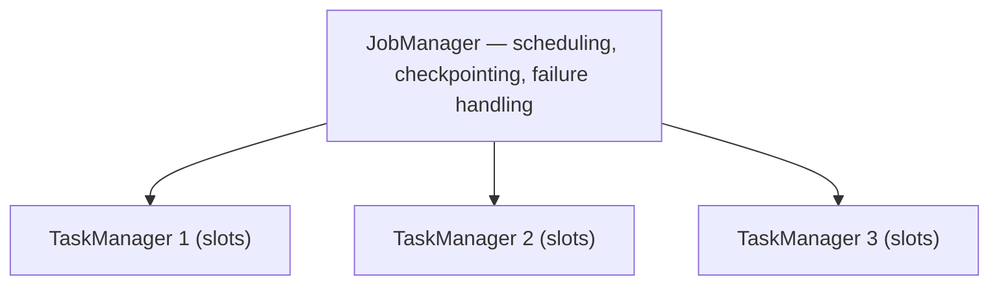
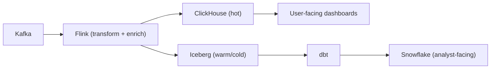
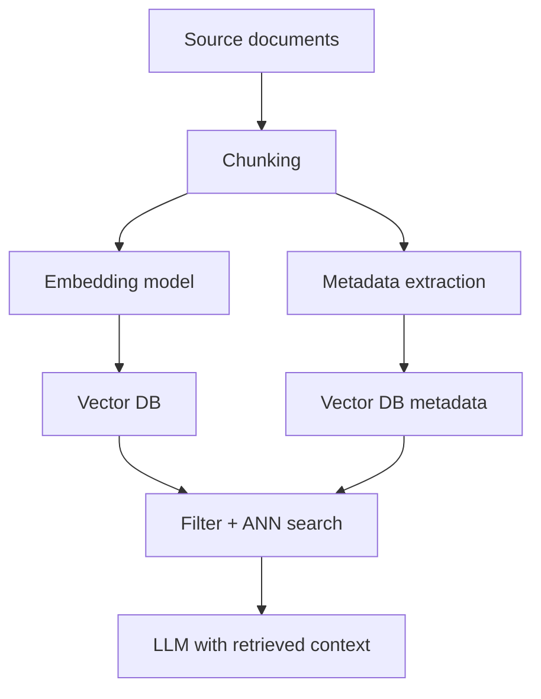

# 06 — Advanced Topics: Everything Else Worth Knowing — Part 2 of 5: Streaming and Modern Engines

This is part 2 of the Advanced Topics reference (18 phases across 5 parts). [Part 1](06-advanced-topics.md) covered Phases 1–4 (distributed systems, SQL, storage, lakehouse); here we cover Phases 5–10: real stream processing, real-time OLAP, the Arrow-native stack, modeling beyond Kimball, the semantic layer, and vector databases.

---

## Phase 5 — Stream Processing for Real (Flink)

Kafka is messaging. Flink is processing. The earlier guides covered Kafka and Kafka Streams; serious stream processing usually means Flink.

### Why Flink Over Kafka Streams

- **Stateful processing at scale:** Flink manages TB-scale state with checkpointing
- **True event-time processing:** First-class watermarks, late data handling, windowing
- **Exactly-once via two-phase commit sinks:** the strongest semantic across heterogeneous systems
- **More expressive APIs:** DataStream, Table API, SQL, CEP

### Flink Architecture



- **JobManager:** coordinator — schedules tasks, manages checkpoints, handles failures
- **TaskManager:** workers — each has slots that run task instances
- **Slot:** a unit of resource isolation within a TaskManager

### Stateful Stream Processing

The thing Flink does that Kafka Streams struggles with at scale:

```python
from pyflink.datastream import StreamExecutionEnvironment
from pyflink.datastream.functions import KeyedProcessFunction

class FraudDetector(KeyedProcessFunction):
    def open(self, runtime_context):
        # State per key (per user_id)
        descriptor = ValueStateDescriptor("last_txn", Types.PICKLED_BYTE_ARRAY())
        self.state = runtime_context.get_state(descriptor)

    def process_element(self, value, ctx):
        last = self.state.value()
        if last and value.amount > 10 * last.amount:
            yield Alert(value.user_id, "10x spike")
        self.state.update(value)
```

The state lives on the TaskManager, checkpointed periodically to durable storage (S3). On failure, Flink restores from the last checkpoint — exactly-once guaranteed.

### Watermarks Deeply

Watermarks are Flink's answer to "when do I know I've seen all events for a window?"

```python
.assign_timestamps_and_watermarks(
    WatermarkStrategy.for_bounded_out_of_orderness(Duration.of_seconds(5))
        .with_timestamp_assigner(SimpleTimestampAssigner())
)
```

This says: "events can be up to 5 seconds late. Once the watermark advances past time T, no more events for windows ending at T will be accepted."

Late events: Flink can handle them via `allowed_lateness` (window stays open longer) or side outputs (lateness reported as a separate stream).

### Savepoints — The Operations Feature That Makes Flink Production-Ready

A **savepoint** is a manually triggered, durable snapshot of a Flink job's state. You can stop a job, upgrade Flink, change the job DAG, and resume from a savepoint — *without losing state*.

This is what makes Flink jobs maintainable in production. Kafka Streams has nothing equivalent.

### Flink SQL

```sql
CREATE TABLE orders (
  order_id STRING,
  user_id STRING,
  amount DECIMAL(10,2),
  event_time TIMESTAMP(3),
  WATERMARK FOR event_time AS event_time - INTERVAL '5' SECOND
) WITH (
  'connector' = 'kafka',
  'topic' = 'orders',
  'format' = 'avro',
  'value.fields-include' = 'EXCEPT_KEY'
);

CREATE TABLE alerts WITH ('connector' = 'kafka', 'topic' = 'alerts', 'format' = 'json') AS
SELECT
  user_id,
  TUMBLE_START(event_time, INTERVAL '1' MINUTE) AS window_start,
  SUM(amount) AS total
FROM orders
GROUP BY TUMBLE(event_time, INTERVAL '1' MINUTE), user_id
HAVING SUM(amount) > 10000;
```

A streaming SQL job that's exactly-once, restartable, savepointable. This is the "modern" way to do stream processing in 2026 — write SQL, let Flink handle the rest.

### CEP — Complex Event Processing

Flink's CEP library detects patterns across event streams:

```python
pattern = Pattern.begin("first").where(lambda e: e.type == "login_fail") \
    .next("second").where(lambda e: e.type == "login_fail") \
    .next("third").where(lambda e: e.type == "login_fail") \
    .within(Duration.of_minutes(5))
```

"Three failed logins within 5 minutes." Used for fraud, security, IoT alerting. Not in every DE's toolkit, but worth knowing exists.

### Exercises

1. Set up a Flink cluster locally (the official Docker Compose works).
2. Write a Flink job that reads from Kafka, computes a 1-minute tumbling window aggregate, writes to another Kafka topic.
3. Implement a stateful job that detects "user X had >5 transactions in last 10 minutes."
4. Trigger a savepoint, kill the job, restart from the savepoint, verify no data lost.
5. Write the same job in Flink SQL. Compare expressiveness.

---

## Phase 6 — Real-Time OLAP (ClickHouse, Druid, Pinot)

Warehouses are for "queries over historical data, latency in seconds." Real-time OLAP is for "queries over recent + historical data, latency in milliseconds." Different category.

### When You Need Real-Time OLAP

- User-facing analytics with strict latency budgets (sub-second)
- High concurrency (thousands of concurrent queries)
- Continuously ingesting streams while serving queries
- Aggregate-heavy workloads (counts, sums, percentiles)

### The Three Major Options

**ClickHouse** — the most flexible. SQL-native, column store, very fast. Originally Yandex; now an independent company. Used at Cloudflare, Uber, ContentSquare, GitHub.

**Apache Druid** — purpose-built for time-series + dimensional aggregates. Best at "slice and dice high-cardinality data with sub-second latency." Used at Netflix, Airbnb, Twitter.

**Apache Pinot** — LinkedIn-originated. Similar use cases to Druid; slightly different architecture. Strong in real-time user-facing dashboards.

### What They All Share

- Columnar storage with aggressive compression
- Pre-aggregation/materialization options
- Inverted indexes for high-cardinality fields
- Tiered storage (hot data on local SSD, warm on object storage)
- Native streaming ingestion (Kafka connectors)

### When to Use Each

| Use Case | Best Choice |
|---|---|
| Embedded analytics in a SaaS product | Pinot or ClickHouse |
| Internal "explore the data" tools with broad SQL needs | ClickHouse |
| Time-series + dimensional cube queries | Druid |
| Replacing a slow warehouse for hot path queries | ClickHouse |
| High-cardinality customer-facing dashboards | Pinot |

### The Architecture Pattern

In 2026, the leading-edge stack often looks like:



Real-time path serves hot dashboards. Batch path serves analytical workloads. Two stores, same source-of-truth events.

### Exercises

1. Install ClickHouse locally. Load the NYC taxi dataset (or any large dataset). Run aggregations and benchmark vs Postgres on the same data.
2. Set up a Kafka → ClickHouse ingest. Stream events, query them within seconds of arrival.
3. Read the Druid docs on segments and time chunks. Sketch how it routes queries.

---

## Phase 7 — The Arrow-Native Stack

A quieter revolution is reshaping the data stack: tools that are Arrow-native, single-node, and absurdly fast.

### The Players

- **Polars** — Rust-based pandas replacement. 10–100× faster on typical workloads. Lazy evaluation.
- **DuckDB** — embedded analytical database. Single file, no server. Queries Parquet/CSV/JSON natively.
- **DataFusion** — Rust query engine. Building block for other tools.
- **Pandas 2.0+** — now Arrow-backed.

### Why This Stack Is a Big Deal

Old assumption: big data needs distributed compute (Spark, Snowflake). New reality:

- A 64GB laptop can chew through 100GB datasets if the engine is good
- DuckDB can outperform Spark on workloads up to single-node memory size
- Many "big data" problems are actually medium data with bad tooling

For DE, this means:

1. Local dev environments are dramatically better — your laptop runs the same engines as production
2. Dev/prod parity is easier — DuckDB locally, BigQuery in prod, with identical SQL
3. Many small pipelines can ditch Spark entirely
4. ML pipelines benefit massively — Polars' lazy execution and Arrow zero-copy

### Polars Example

```python
import polars as pl

df = (
    pl.scan_parquet("s3://bucket/events/*.parquet")  # lazy — doesn't load yet
    .filter(pl.col("event_time") > "2024-01-01")
    .group_by("user_id")
    .agg(
        pl.col("amount").sum().alias("total"),
        pl.col("event_id").count().alias("event_count"),
    )
    .filter(pl.col("total") > 1000)
    .sort("total", descending=True)
    .head(100)
    .collect()  # NOW it executes — pushes filters down, prunes columns
)
```

The lazy execution + predicate pushdown into Parquet means you might read 5% of a 100GB dataset. On a laptop. In seconds.

### DuckDB in Production

DuckDB is increasingly used in production for:

- **dbt local development** (dbt-duckdb) — run your dbt project against DuckDB locally, against BigQuery in prod, same SQL
- **Embedded analytics in apps** — Hex, Mode, Evidence.dev all use DuckDB
- **Serverless batch jobs** — Lambda function that pulls Parquet from S3 and aggregates with DuckDB
- **Ad-hoc data exploration** — `duckdb` in the terminal, query S3 files directly

### Exercises

1. Reimplement a pandas pipeline in Polars. Benchmark.
2. Use DuckDB to query a Parquet file in S3 directly without any setup. From your terminal.
3. Set up a dbt project that runs against DuckDB locally and BigQuery in CI/CD. Same models, both targets.

---

## Phase 8 — Modeling Beyond Kimball

The medium-tier guide covered Kimball (star schemas, SCD2). That's the dominant model. There are two other patterns worth knowing.

### Data Vault 2.0

Created by Dan Linstedt; dominant at large enterprises with high audit requirements (banks, insurance, healthcare).

**Three table types:**

- **Hubs:** business keys + metadata. One row per unique business entity.
- **Links:** relationships between hubs. One row per unique relationship.
- **Satellites:** descriptive attributes. Versioned over time (SCD2-like by default).

```
hub_customer (customer_id_hash, customer_business_key, load_date, source)
hub_product  (product_id_hash, product_business_key, load_date, source)
link_order   (order_id_hash, customer_id_hash, product_id_hash, load_date, source)
sat_customer (customer_id_hash, load_date, name, email, address, ...)
sat_product  (product_id_hash, load_date, name, price, category, ...)
```

**Why this pattern exists:**

- Extreme auditability — every change is timestamped and sourced
- Schema-agnostic — adding new source systems doesn't require restructuring
- Parallel loading — hubs/links/satellites can be loaded independently
- Insert-only — no updates means simpler concurrency

**Why not everyone uses it:**

- Many more tables; complex queries
- Analysts hate it (10 joins for a simple report)
- You build "information marts" on top of the vault for analytics

When you'll encounter it: any F100 in finance, insurance, healthcare, or government. If you interview at one, knowing the vocabulary is high-leverage.

### One Big Table (OBT)

The opposite extreme: denormalize aggressively into wide tables.

```sql
-- One row per order with all related data pre-joined
SELECT
  order_id,
  order_date,
  -- Customer attributes
  customer_id, customer_name, customer_segment, customer_country,
  -- Product attributes
  product_id, product_name, product_category, product_price,
  -- Order specifics
  quantity, total_amount, payment_method,
  -- Derived
  is_first_order, days_since_last_order, lifetime_value
FROM ...
```

**Why OBT is gaining traction:**

- Modern columnar stores read only the columns you need — wide tables are cheap to scan partially
- No joins at query time — fastest possible reads
- Analysts can self-serve without learning joins
- dbt's "marts" layer often *is* OBT-style

**Trade-offs:**

- Updates are expensive (one customer change → update millions of order rows)
- Storage cost higher (redundancy)
- Doesn't preserve history of dimensional changes by default

The pragmatic answer: **use both**. SCD2 dimensions for historical accuracy, plus OBT marts for fast analytics. The dimensional layer is the source of truth; OBT is the query interface.

### Activity Schema

A newer pattern from the Narrator team. The whole company gets modeled as one giant event log:

```
activity_stream:
  customer_id | activity_name | timestamp | revenue_impact | feature_json
```

Everything (signed up, viewed page, made purchase, churned) is one row in one table with self-describing JSON. Queries use specific patterns to extract analytics.

Niche but interesting — read the Narrator blog if curious. You won't see it at most F100s.

### What This Means for You

In an interview, "how do you model X" usually expects a Kimball answer. But knowing Data Vault exists separates you from candidates who only know one pattern. Volunteer the trade-off: "Star schema for analyst-facing marts; we'd consider Vault if our regulatory audit requirements were heavier."

---

## Phase 9 — Semantic Layer

The medium-tier guide ended with dbt marts. The frontier above that is the **semantic layer** — a centralized layer where business metrics are defined once and consumed by every downstream tool.

### The Problem It Solves

Every company has this conversation:

- Dashboard A: monthly revenue = $1.2M
- Dashboard B: monthly revenue = $1.4M
- Both are "right" — they're computed differently (one counts cancellations differently, the other counts taxes differently)
- CFO loses faith in all dashboards

A semantic layer is one place where "monthly revenue" is defined precisely, with one set of join logic and one set of filters. Every consumer asks the semantic layer; no one writes their own SQL for it.

### The Players

- **LookML (Looker)** — the original. Powerful, opinionated, expensive.
- **dbt Semantic Layer (MetricFlow)** — open-source, integrates with dbt. The emerging standard.
- **Cube.js** — open-source, headless. Used heavily for embedded analytics.
- **Malloy** — Google's research project. Interesting language design.
- **AtScale, Kyligence** — enterprise OLAP cube tools, semantic-layer-adjacent.

### What a Semantic Model Looks Like (MetricFlow)

```yaml
semantic_models:
  - name: orders
    model: ref('fct_orders')
    entities:
      - name: order
        type: primary
        expr: order_id
      - name: customer
        type: foreign
        expr: customer_id
    dimensions:
      - name: order_date
        type: time
        type_params: {time_granularity: day}
      - name: status
        type: categorical
    measures:
      - name: order_count
        agg: count
        expr: order_id
      - name: revenue
        agg: sum
        expr: total_amount

metrics:
  - name: monthly_revenue
    type: simple
    type_params:
      measure: revenue
    filter: status = 'completed'

  - name: revenue_growth
    type: derived
    type_params:
      expr: revenue - revenue_prev_month
```

Now any BI tool (Tableau, Mode, Hex, Looker) queries the semantic layer, asks for `monthly_revenue`, and gets the same number. Always.

### Why This Matters for Your Career

A few years ago, "knows dbt" was a differentiator. In 2026, it's a baseline expectation. The new differentiator is "can design semantic models for an organization." Get ahead of this.

### Exercises

1. Take your medium-tier project. Define 3 semantic models and 5 metrics in dbt's MetricFlow.
2. Query the semantic layer from at least two tools (e.g., dbt CLI and a Python notebook).
3. Compare to writing the same metrics directly in SQL in each tool. Note where definitions drifted.

---

## Phase 10 — Vector Databases and the LLM Era

Data engineering increasingly intersects with LLM/RAG systems. DEs are now responsible for embedding pipelines, vector storage, hybrid search infrastructure.

### What a Vector Database Is

A database optimized for **approximate nearest neighbor (ANN)** search over high-dimensional vectors. Used for:

- Semantic search (find documents similar to a query)
- RAG (retrieval-augmented generation) for LLM applications
- Recommendation systems
- Image/audio similarity

### The Algorithms (At a Conceptual Level)

- **HNSW (Hierarchical Navigable Small World):** graph-based, very fast, more memory. Most common.
- **IVF (Inverted File):** partition vectors into clusters, search the nearest clusters. Cheaper, slightly worse recall.
- **Product Quantization:** compress vectors lossy-ly to save memory.

You don't need to implement these. You need to know:

- HNSW is the typical choice for high-recall use cases
- IVF + PQ is the typical choice when scale matters more than recall
- The recall/speed/memory triangle is fundamental

### The Players

- **Pinecone** — managed, fully hosted. Easy to start, expensive at scale.
- **Weaviate** — open-source, hybrid search (vector + keyword) built in.
- **Qdrant** — open-source, Rust-based, fast.
- **Milvus** — open-source, mature, scalable.
- **pgvector** — Postgres extension. The "good enough for most use cases" option.
- **OpenSearch with k-NN plugin** — if you already have OpenSearch.
- **LanceDB** — embedded, like DuckDB for vectors.

### The Pipeline a DE Owns



The DE part: chunking strategy, embedding pipeline (batched, idempotent, incremental on new documents), reindexing on model upgrades, metadata schema for filtering, monitoring retrieval quality.

### Hybrid Search

Pure vector search is bad at exact matches (product codes, names). Pure keyword search is bad at semantics. Hybrid search combines them:

$$\text{final\_score} = \alpha \cdot \text{vector\_similarity} + (1-\alpha) \cdot \text{keyword\_score}$$

Weaviate, OpenSearch, Elasticsearch (with v8+), Vespa all support hybrid natively. Your job: pick α based on the use case.

### Validating LLM-Generated SQL

~45% of organizations now run text-to-SQL in some form in production (mid-2026 surveys). 76% of those teams cite *guardrails* as the top constraint — not model accuracy, not latency, but "how do we prevent the agent from running a query that scans the full fact table or joins on the wrong key?"

This is now a DE problem, not an ML problem. You are the one who owns the query execution environment and the data contracts around it.

**Text-to-metric beats text-to-SQL.** The highest-leverage guardrail is architectural: route LLM queries through a semantic layer instead of directly against raw tables. When an agent asks "what was revenue last month?", it should hit the semantic layer (dbt MetricFlow, Cube MCP) and get back a pre-validated metric query — not generate arbitrary SQL against `fct_orders`. Text-to-metric accuracy is dramatically higher than text-to-SQL because the search space is constrained to defined metrics and dimensions. Cube's MCP server and dbt's semantic layer JSON-RPC interface both support this pattern today.

**Execution-based validation patterns.** When you do allow agents to generate SQL, validate before running:

- `EXPLAIN`-based linting: run `EXPLAIN` on the generated query before execution. Check for full-table scans on large tables (flag if estimated rows > threshold), missing partition filters, and cross-join warnings. DoorDash's "zero-data query validation" approach — running the query against an empty or sampled replica to catch structural errors without scanning production data — is the reference implementation for this pattern.
- Statistical metadata checks: before executing, query the information schema to verify referenced table and column names exist, types are compatible with the operations being performed, and join columns have overlapping value ranges (a join on two columns with zero overlap will produce zero rows silently).
- Join-path enforcement: maintain a registry of valid join paths between tables (a graph of `table → foreign_key → table`). Validate that every join in the generated SQL follows a declared path. Undeclared joins — especially many-to-many ones — are the most common source of fan-out bugs in agent-generated SQL.

**Access controls as the floor.** No validation layer is a substitute for proper database permissions:

- Agent service accounts get read-only grants only — never write, DDL, or superuser
- Row caps enforced at the connection or warehouse level (`LIMIT 10000` as a hard ceiling on agent queries, not just a hint)
- Query cost budgets per session (Snowflake resource monitors, BigQuery per-project quotas)
- Sensitive columns excluded from agent-accessible schemas — PII columns in a separate schema with no agent grant

**pgvector ceiling is higher than people think.** One concrete data point worth citing in interviews: pgvectorscale (Timescale's extension on top of pgvector) benchmarked at 471 QPS at 99% recall — approximately 11× Qdrant on the same workload. The practical implication: exhaust pgvector + pgvectorscale before reaching for a standalone vector database. Most production RAG systems at F100 scale never need to.

### Vector DB and LLM-Era Exercises

1. Set up pgvector locally. Embed a corpus (Wikipedia abstracts, your notes, anything). Implement semantic search.
2. Compare results between pure vector search and hybrid search on the same corpus.
3. Build an embedding pipeline that processes new documents incrementally, with idempotency.
4. Read the [Pinecone learning hub](https://www.pinecone.io/learn/) — best free vector DB educational content.
5. Write an `EXPLAIN`-based validator: given a SQL string, run EXPLAIN, parse the output, and flag queries that would scan more than 100M rows.

---

## You can now

- Operate Flink for stateful, exactly-once stream processing — state, watermarks, savepoints, and Flink SQL — and explain why it beats Kafka Streams at scale.
- Pick a real-time OLAP store (ClickHouse, Druid, or Pinot) for a latency-sensitive use case, and sketch the streaming + batch architecture around it.
- Reach for the Arrow-native stack (Polars, DuckDB, DataFusion) before defaulting to Spark, and explain why.
- Compare Kimball, Data Vault, OBT, and Activity Schema modeling, and design a semantic layer (MetricFlow, Cube) that keeps metric definitions consistent.
- Explain vector database fundamentals (HNSW, IVF, hybrid search) and the guardrails a DE puts around LLM-generated SQL.

This is part 2 of the Advanced Topics reference. Next: federated query, Kubernetes, and specialized stores (Phases 11–13) in [Part 3](06c-advanced-topics.md).
