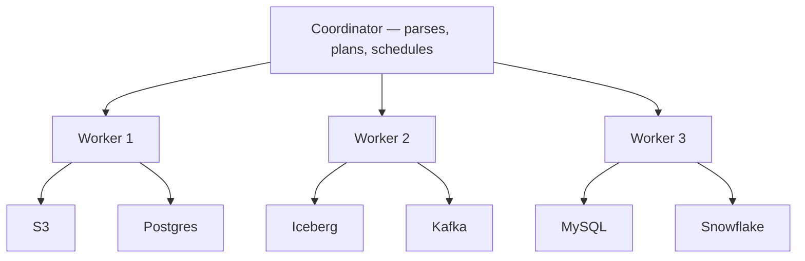

# 06 — Advanced Topics: Everything Else Worth Knowing — Part 3 of 5: Federated Query, Kubernetes, and Specialized Stores

This is part 3 of the Advanced Topics reference (18 phases across 5 parts). [Part 2](06b-advanced-topics.md) covered streaming and modern engines (Phases 5–10); here we cover Phases 11–13: federated query with Trino, running data infrastructure on Kubernetes, and specialized stores beyond the relational default.

---

## Phase 11 — Federated Query (Trino)

Trino (formerly PrestoSQL) is the dominant **federated query engine** — query data across multiple systems with one SQL.

### When You Need It

- Your data lives in S3 (Parquet), Postgres (transactional), and Snowflake (warehouse), and analysts need to join across them
- You want a unified SQL interface over a lakehouse (Iceberg/Delta)
- You want to give analysts BI without ETLing everything into a warehouse

### Architecture

Connectors are the magic — Trino has ~50 of them. Each translates SQL operations into the source's native language.

### Why Trino Matters

- Open source, no vendor lock-in
- Outperforms most query engines on TB-scale joins
- The query engine inside Athena, Starburst, and many F100 internal "data lake query" stacks
- Iceberg's reference query engine

### Exercises

1. Run Trino in Docker. Configure connectors to Postgres and a local Iceberg catalog.
2. Write a query that joins a Postgres table with an Iceberg table.
3. Read the [Trino book](https://trino.io/trino-the-definitive-guide.html) (free PDF).

---

## Phase 12 — Kubernetes for Data Engineering

Increasingly, F100 data platforms run on Kubernetes. Knowing K8s is rapidly moving from "nice to have" to "expected."

### What You Need to Know

#### The Mental Model

- **Pod** — smallest unit, one or more containers sharing a network namespace
- **Deployment** — declarative spec for N replicas of a pod
- **Service** — stable network endpoint for a set of pods
- **ConfigMap / Secret** — config injected into pods
- **PersistentVolume** — durable storage attached to pods
- **Namespace** — logical isolation within a cluster

#### Data Tools on K8s

- **Spark on K8s** — Spark's K8s scheduler, plus the Spark Operator. The replacement for YARN/EMR.
- **Airflow KubernetesExecutor** — each task runs in a fresh pod. Better isolation than CeleryExecutor.
- **Strimzi** — Kafka on K8s, operator-managed. Used heavily.
- **Argo Workflows** — alternative to Airflow, K8s-native.
- **Spark Operator** — declarative Spark applications.
- **Flink Operator** — same for Flink.

#### What "K8s for DE" Actually Means

The pattern: you describe everything declaratively, K8s and operators do the rest. You don't `ssh` into worker nodes to debug Spark — you `kubectl logs` a pod.

### What to Build

Take any pipeline you have and run it on a local K8s cluster (kind or minikube). The exercise:

1. Containerize your dbt project
2. Deploy Airflow on K8s with KubernetesExecutor
3. Run dbt jobs as Kubernetes pods
4. Monitor with Prometheus

You don't need to become a K8s expert. You need to be able to read a deployment manifest, debug a pod, and understand the basic resource model.

### Resources

- *Kubernetes Up and Running* (Kelsey Hightower et al.) — the standard reference
- [The Kubernetes Bootcamp](https://kubernetes.io/docs/tutorials/kubernetes-basics/) — official, free
- For DE specifically: the Astronomer / Apache Airflow docs on KubernetesExecutor

---

## Phase 13 — Specialized Stores

Most DE problems are tabular. Some aren't. Knowing when to reach for a specialized store is a senior-level skill.

### Time-Series Databases

When your data is dominated by `(timestamp, entity_id, value)` records at high write rates (IoT, monitoring, financial ticks):

- **InfluxDB** — popular, Go-based. Has its own query language (Flux).
- **TimescaleDB** — Postgres extension. SQL-native. Easy migration from Postgres.
- **QuestDB** — newer, very fast on time-series benchmarks.
- **VictoriaMetrics** — Prometheus-compatible, scales horizontally.

When *not* to use them: low write rate, complex relational queries. A regular warehouse with date partitioning handles most "time-series" use cases.

### Graph Databases

When your queries are graph-shaped — "find all 2nd-degree connections", "shortest path", "cycles in dependencies":

- **Neo4j** — the dominant one. Cypher query language.
- **Amazon Neptune** — managed, supports both Gremlin and SPARQL.
- **TigerGraph** — claims best performance at scale.
- **Apache AGE** — Postgres extension, Cypher support.

For most DE problems, a relational store with recursive CTEs handles graph queries well enough. Reach for a graph DB when your queries are >70% graph traversals.

### Document Stores (For Completeness)

You'll encounter MongoDB, DynamoDB, Couchbase. As a DE you mostly read *from* them via CDC into your warehouse. You rarely use them as primary stores in DE pipelines.

### Search Engines

Elasticsearch / OpenSearch — full-text search, log analytics, observability. The "Kibana stack" you've probably touched. Increasingly used for vector + keyword hybrid search.

### Exercises

1. Load a time-series dataset (any IoT sensor data, finance ticks) into TimescaleDB. Run queries that exploit hypertables.
2. Model a social network in Neo4j. Write Cypher queries for 2nd-degree connections, shortest path, community detection.

---

## You can now

- Use Trino to run a single SQL query across S3, Postgres, Iceberg, and a warehouse without ETLing everything into one place first.
- Read a Kubernetes deployment manifest, debug a pod, and explain how Spark/Airflow/Kafka/Flink operators fit the K8s resource model.
- Choose a specialized store (time-series, graph, document, search) when the workload stops being tabular, and articulate the threshold for reaching for one.

This is part 3 of the Advanced Topics reference. Next: disaster recovery, compliance, and architectural patterns (Phases 14–16) in [Part 4](06d-advanced-topics.md).
