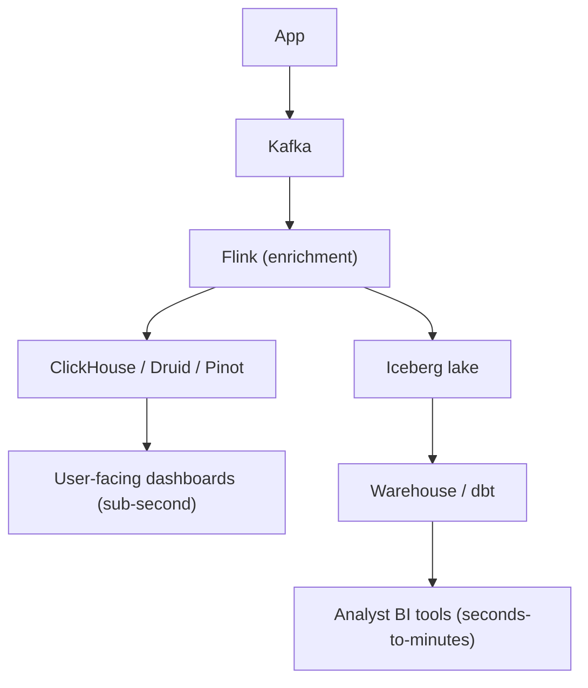
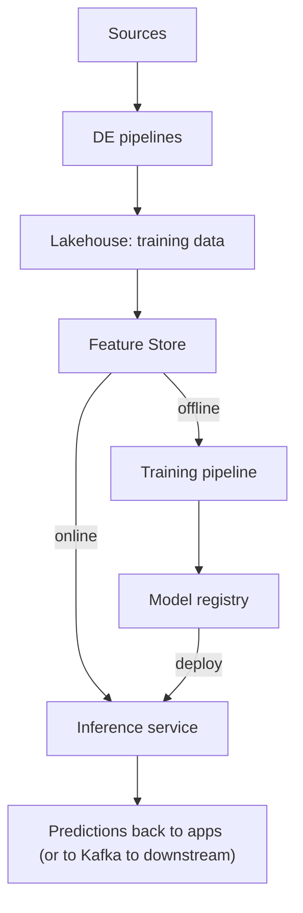
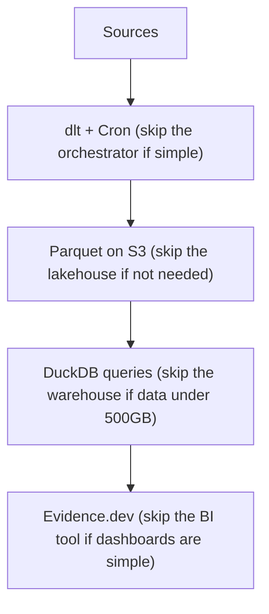

# 07 — The Data Architect Track

The earlier sections take you from "I want to learn data engineering" to "I can lead the technical implementation of a serious data platform." This section takes you the next step: from senior implementer to architect.

This is a different jump than the previous ones. Going from junior DE to senior DE is mostly about technical depth. Going from senior DE to architect is mostly about judgment, communication, and scope. The skills that got you to senior plateau here. You need new ones.

**Who this is for:** Senior engineers (3–7 years in DE) who want to step up to staff/principal/architect roles. Or strong engineers who want to understand what architects actually do so they can either become one, work effectively with one, or skip the title and just operate at that altitude as a senior IC.

**A note on titles:** "Data Architect," "Principal Data Engineer," "Staff Data Engineer," "Data Platform Lead" — the title varies wildly across F100 companies. They roughly mean the same thing: the person responsible for the platform's architectural integrity. We'll use "architect" throughout; substitute your company's title.

---

## Phase 1 — What a Data Architect Actually Does

The honest version, not the job-description version.

### The Core Output: Decisions, Not Code

A senior DE's daily output is mostly code, configuration, and pipelines. An architect's daily output is mostly:

- **Decisions** (recorded in writing — ADRs, design docs)
- **Diagrams** (architecture diagrams that hold up to scrutiny)
- **Written documents** (RFCs, strategy memos, migration plans)
- **Meetings where decisions get made** (and the prep for those meetings)
- **Reviews** (code reviews, design reviews, vendor evaluations)
- **Occasional prototypes** (proof-of-concepts that de-risk a decision)

If you become an architect and your hands stop touching code entirely, you've gone too far. Most senior architects keep ~20% of their week in code — usually on high-leverage prototypes or critical reviews where the technical detail matters. If you go to 0%, you become an ivory-tower architect, and your decisions stop being grounded in reality. This is the single most common architect failure mode.

### The Three Time Horizons

Architects think across three horizons simultaneously:

- **0–3 months:** What's shipping. Mostly observation; the team is executing.
- **3–18 months:** The roadmap. Where most architect attention goes. Designing what comes next.
- **18–60 months:** The strategy. Platform evolution, build-vs-buy bets, technology curve management.

Senior DEs operate mostly at 0–3 months. Staff DEs add the 3–18 horizon. Principal/architect adds the 18–60. The promotion to architect is fundamentally about extending your time horizon without losing connection to the present.

### What You Stop Doing

Things you'll do less or not at all once you're an architect:

- Writing pipelines end-to-end
- Owning specific production systems alone
- Being the person paged at 3 AM (usually — though good architects still take some on-call to stay grounded)
- Closing tickets quickly
- Having the satisfaction of a fully-shipped feature each sprint

If those losses sound bad to you, the architect track might not be for you. It's a career path optimized for people who get more energy from designing systems than from building them. Both are valuable; only you know which one you are.

### What You Start Doing

Things you'll do constantly:

- Writing — far more than you expect. Most senior architects spend 30–50% of their time writing.
- Drawing diagrams. Many diagrams. The first draft of any architecture lives in a diagram.
- Reviewing other people's designs and code at depth
- Sitting in rooms with VPs explaining why the platform costs what it costs
- Negotiating with vendors
- Saying "no" to projects that would damage the platform's long-term integrity
- Saying "yes" to projects that look bad short-term but pay off long-term

### The Architect's North Star

Every good architect is optimizing for one core thing: **the long-term technical health of the platform.** Not the velocity of the next sprint. Not the comfort of the team. The platform's ability to keep meeting business needs five years from now.

This is in constant tension with short-term pressure, which is why the role is hard.

---

## Phase 2 — The Architect Mindset

Specific shifts in how you think.

### Trade-offs Are Always Real

Junior engineers tend to think there's a "right answer" to most technical questions. There usually isn't. There's a *least-bad answer for this specific context*. The architect's job is to surface the trade-offs explicitly:

> "Snowflake gives us a faster path to value but locks us into a vendor and roughly doubles our 3-year platform cost. Self-managed Trino + Iceberg costs less but requires hiring two senior engineers and adds 9 months to time-to-value. Both are reasonable choices; the right one depends on whether we believe we can hire."

The senior-junior gap shows up most clearly in this kind of statement. Juniors say "Snowflake is better." Seniors say "Snowflake is better for us." Architects show the work.

### Reversibility Drives Process

Jeff Bezos's famous frame: **Type 1 decisions are irreversible. Type 2 decisions can be undone.** Type 1 decisions justify heavy process. Type 2 decisions should be made fast and learned from.

For data architects:

- **Type 1 (heavy process):** picking a primary cloud vendor; picking a warehouse; building vs buying the data catalog; the data residency strategy.
- **Type 2 (light process):** picking dbt vs SQLMesh; picking Airflow vs Dagster; picking Kafka vs Pulsar (mostly).

The trap: treating Type 2 decisions like Type 1 ("we must pick the perfect orchestrator!") wastes months. Treating Type 1 like Type 2 ("let's just go with Snowflake and see what happens") burns careers.

### Optionality Has Value

Choices that preserve future optionality are worth a small upfront cost. Examples:

- Using Iceberg means you can change query engines without rewriting storage
- Using dbt means transformations are portable across warehouses
- Standardizing on Arrow as the in-memory format means tools can be swapped
- Building against open protocols (REST catalog, OpenLineage, OpenTelemetry) means you're not vendor-locked

The opposite — proprietary formats and vendor-specific abstractions — feels efficient short-term but constrains future architects. Architects who don't preserve optionality leave landmines.

### Boring Technology Is Often Right

Dan McKinley's classic essay "Choose Boring Technology" applies tenfold to architecture. Each new technology you adopt comes with a tax: training, hiring, integration, debugging, monitoring, the cognitive cost of one more thing in the stack.

Strong architects defend the boring choices: Postgres, S3, Airflow, dbt, Kafka. They reach for new tech only when the boring choice genuinely can't solve the problem. They're skeptical when an engineer proposes adopting the new hotness "because it's better."

This isn't conservatism. It's resource discipline. Every team has limited capacity to operate complex systems; spend it on the parts of your stack where novelty creates real leverage.

### The Reversibility/Cost Matrix

A useful 2x2 for any architectural decision:

|                | Low cost | High cost |
|----------------|----------|-----------|
| **Reversible** | Just decide. Try it. | Prototype first, decide carefully. |
| **Irreversible** | Decide carefully. | Spend months. ADR. Multiple reviews. |

Junior engineers tend to spend the same amount of energy on every decision. Architects calibrate.

---

## Phase 3 — Architecture Decision Records (ADRs)

The single most important artifact an architect produces.

### What an ADR Is

A short written document recording a single architectural decision, why it was made, what alternatives were considered, and what the consequences are. Lives in version control alongside the code. Numbered sequentially.

### Why ADRs Matter

Without ADRs, every architectural decision gets re-litigated every six months. The original context (why we chose X) is lost. New team members don't know why the system looks the way it does. Architects spend their lives in meetings explaining ancient decisions.

With ADRs:

- Decisions have provenance (you can answer "why did we do this?")
- New team members get oriented faster
- The pattern of decisions reveals the team's principles
- You build institutional memory that survives turnover

### Standard ADR Structure

```markdown
# ADR-0042: Adopt Apache Iceberg as Our Open Table Format

**Status:** Accepted
**Date:** 2026-04-15
**Decision-makers:** A. Architect, B. Lead, C. CTO
**Consulted:** Data team leads, Security, FinOps

## Context

We currently store ~80TB of analytical data as raw Parquet in S3, queried
by Athena and EMR Spark. We're hitting limitations: no ACID guarantees,
painful schema evolution, no time travel, no efficient row-level deletes
(needed for GDPR).

We need an open table format. Three candidates: Iceberg, Delta Lake, Hudi.

## Decision

We will adopt Apache Iceberg as our standard open table format for
analytical data, with the AWS Glue catalog as the metastore.

## Alternatives Considered

### Delta Lake
- Pros: mature, strong Databricks integration, OPTIMIZE/VACUUM are battle-tested
- Cons: historically Databricks-favored. The recent open-sourcing has improved
  multi-engine support but Iceberg currently has broader native engine support
  for our use case (Athena, Spark, Snowflake-future)

### Hudi
- Pros: best-in-class streaming upserts
- Cons: more operational complexity; our workload is 90% batch
- Note: revisit if streaming becomes dominant in our workload mix

## Consequences

### Positive
- ACID transactions on lake data
- Time travel and snapshot isolation (helpful for GDPR deletion audit)
- Schema and partition evolution without rewrites
- Single format usable across Athena, Spark, and (eventually) Snowflake

### Negative
- One-time migration cost: ~3 engineer-months estimated
- Team needs Iceberg training (~2 weeks ramp per engineer)
- Glue catalog is a SPOF; we accept this for now but should consider a
  managed REST catalog in 2027

## Implementation Plan
1. Pilot on the marketing event tables (Q2)
2. Migrate the fact tables (Q3)
3. Migrate dimensions (Q4)
4. Decommission the raw Parquet path (Q1 2027)
```

### Tips for Writing Useful ADRs

1. **Write them when the decision is fresh.** Six months later, you can't remember why.
2. **Be honest about the "negative" consequences.** ADRs that only list positives are propaganda, not decisions.
3. **Keep them short.** 1–3 pages. If you need more, write a separate design doc and link.
4. **Number them and never delete.** Mark superseded ADRs as such; don't rewrite history.
5. **Make them the entry point.** Anyone joining the team should be told "read ADRs 1–10 first."

### What Goes in an ADR vs a Design Doc

| ADR | Design Doc |
|-----|------------|
| Records a decision | Proposes a design |
| 1–3 pages | 5–30 pages |
| Past tense ("we decided") | Future tense ("we will build") |
| Permanent | Often archived after build |
| Written by/with the decision-maker | Often written by the implementer |

Most architectural work produces a design doc *first*, then an ADR records the final decision. Both have their place.

---

## Phase 4 — Reference Architectures

The mental library of platform patterns an architect carries around.

### The "Modern Data Stack" Reference Architecture (Circa 2026)

```
Sources                Ingestion           Storage              Transform          Serve
──────                 ─────────           ───────              ─────────          ─────
[App DBs]   ──CDC──►   [Debezium]   ──►   [Kafka]   ──┐
[SaaS]      ──API──►   [Fivetran]   ──┐                ├──►  [Lakehouse:
[Files]     ──FTP──►   [dlt]        ──┤                │     Iceberg/Delta
[Events]    ──SDK──►   [Snowpipe]   ──┘                │     on S3]
                                                       │           │
                                                       │           ▼
                                                       │     [dbt Core]
                                                       │           │
                                                       │           ▼
                                                       │     [Warehouse:
                                                       └────►Snowflake/BigQuery]
                                                                   │
                                              ┌────────────────────┼────────────────────┐
                                              ▼                    ▼                    ▼
                                       [BI tools]          [Reverse ETL]        [Real-time OLAP]
                                       Looker/Tableau      Hightouch/Census     ClickHouse/Druid
                                                                   │                    │
                                                                   ▼                    ▼
                                                          [Operational tools]   [Embedded analytics]
                                                          Salesforce/Marketo     SaaS app dashboards
```

Underlying the entire stack:
- **Orchestration:** Airflow / Dagster
- **Catalog:** Unity / Glue / DataHub
- **Observability:** Monte Carlo / Datafold / custom
- **Quality:** dbt tests + Great Expectations
- **Lineage:** OpenLineage everywhere
- **Security:** column-level masking, RLS, tokenization
- **Cost management:** per-team budgets, query attribution

Every F100 has some variant of this. The differences are in which tool fills which slot.

### Reference: Real-Time Analytics Stack



The lambda-vs-kappa debate plays out in the choice of how to back this. In 2026 the trend is "Iceberg as the source of truth, with materializations into ClickHouse for the hot path."

### Reference: ML Platform Architecture



The DE/ML platform overlap is where roles like "ML Platform Engineer" or "Feature Platform Engineer" live. If your background is part-ML, this is where you have an asymmetric advantage.

### Reference: Data Mesh Architecture

```
Team A          Team B          Team C          Team D
─────           ─────           ─────           ─────
Sources          Sources         Sources         Sources
  │                │               │               │
  ▼                ▼               ▼               ▼
Pipelines       Pipelines       Pipelines       Pipelines
  │                │               │               │
  ▼                ▼               ▼               ▼
Data           Data            Data            Data
Products       Products        Products        Products
  │                │               │               │
  └────────────────┴───────────────┴───────────────┘
                          │
                          ▼
              ┌─────────────────────────┐
              │  Central Platform Team  │
              │  - Catalog              │
              │  - Quality framework    │
              │  - Compute & storage    │
              │  - Governance           │
              │  - Self-serve tools     │
              └─────────────────────────┘
```

The architect's role in a mesh: build the platform, define the standards, enforce the contracts, *don't* build pipelines.

### Reference: The Cost-Conscious Architecture

When the brief is "do more with less":



The architect knows when to scale down, not just when to scale up. A startup or a small F100 team often benefits more from this stack than from a "modern data stack" recreation. Good architects recommend this when appropriate even though it makes them look less ambitious.

---

## Phase 5 — Architecture Frameworks (Survey)

Formal frameworks exist for enterprise architecture. They're divisive — some architects love them, others find them bureaucratic. Worth knowing what they are.

### TOGAF (The Open Group Architecture Framework)

The most widely-known enterprise architecture framework. Covers:

- **Architecture Development Method (ADM)** — a cyclical process for evolving architecture
- **Four architecture domains** — Business, Data, Application, Technology
- **Enterprise Continuum** — how to organize architectural assets

**Worth knowing:** the ADM phases (Vision, Business Architecture, Information Systems, Technology, Opportunities, Migration Planning, Implementation, Change Management), the BDAT domains, the concept of a "reference model."

**Don't bother with:** memorizing TOGAF for its own sake. TOGAF certification is useful if you're at a TOGAF-shop F100 (especially in financial services, government, or pharma). Otherwise, it's mostly checkbox material.

### DAMA-DMBOK (Data Management Body of Knowledge)

The data-management-focused framework. Defines 11 knowledge areas:

1. Data Governance
2. Data Architecture
3. Data Modeling & Design
4. Data Storage & Operations
5. Data Security
6. Data Integration & Interoperability
7. Document & Content Management
8. Reference & Master Data
9. Data Warehousing & Business Intelligence
10. Metadata
11. Data Quality

**Worth knowing:** the framework gives you vocabulary for talking about data management as a discipline. Especially useful when talking to governance, compliance, and audit teams.

**Don't bother with:** treating DMBOK as a how-to. It's a catalog of concerns, not a playbook.

### Zachman Framework

A 6x6 matrix classifying every artifact of an enterprise architecture by *what/how/where/who/when/why* across six levels of abstraction. Older (1987). Mostly dead in modern practice but you'll see it cited in F100 architecture documents.

**Worth knowing:** that it exists. The 6x6 structure can be a useful checklist when you're documenting a new system. Don't structure your career around it.

### The C4 Model

The most useful diagramming framework. By Simon Brown. Four levels of architectural diagrams:

1. **System Context** — your system as a black box, with users and external systems around it
2. **Container** — major deployable units (applications, databases, services)
3. **Component** — the parts within a container
4. **Code** — class diagrams (rarely needed)

Most architectural diagrams should be at the Context or Container level. The discipline of C4 — explicit boundaries, consistent notation, named relationships — produces dramatically better diagrams than free-form whiteboarding.

Get [Structurizr](https://structurizr.com/) or use C4 PlantUML/Mermaid to produce these. The investment pays off forever.

---

## Phase 6 — Build vs Buy

The decision an architect makes more than any other.

### The Frame

Every capability you need can be:

1. **Built** in-house from scratch
2. **Bought** as a managed/SaaS service
3. **Adopted** as open-source software you operate yourself
4. **Hybrid** — buy the core, build the integrations

The decision is rarely obvious. The default assumption ("we can build it cheaper") is almost always wrong; the opposite assumption ("just buy the SaaS") is almost always wrong too.

### The Total Cost of Ownership Calculation

What junior engineers see:

> "Self-hosted Airflow: $0/month. Astronomer Cloud: $2000/month. Save $24K/year."

What architects see:

> Self-hosted Airflow:
> - Engineer time to deploy: 4 weeks * $200/hr loaded = $32K
> - Ongoing operations: 0.3 FTE * $300K loaded = $90K/year
> - Outage costs (estimated): $40K/year (downtime, debugging)
> - Upgrade cycles every 6 months: $20K/year
> - **True annual cost: ~$150K**
>
> Astronomer:
> - License: $24K/year
> - Light operations: 0.05 FTE = $15K
> - **True annual cost: ~$40K**

Self-hosted "free" software almost always has hidden cost roughly equal to a small engineer-fraction. Buying the SaaS frees that engineer for higher-leverage work.

### The Build-vs-Buy Decision Framework

Score each option on these dimensions, weighted by your context:

| Dimension | Weight Notes |
|-----------|--------------|
| Total cost of ownership (3-year) | Always include hidden costs |
| Time to value | How long until usable in production |
| Strategic fit | Does this capability differentiate your business? |
| Vendor risk | What happens if the vendor disappears or doubles prices? |
| Talent availability | Can you hire people who know this tool? |
| Operational burden | Engineer-hours per month to keep it running |
| Switching cost | If we change our mind in 3 years, what does it cost? |
| Compliance & data residency | Especially in regulated industries |
| Integration with existing stack | Cost of glue code |
| Roadmap alignment | Is the vendor building what we need next? |

### When to Build

Build when:

- The capability is **core differentiation** for your business (e.g., a search company building its own search infrastructure)
- No off-the-shelf solution fits within tolerable customization
- You have the team and time
- The capability is small and you can build it well

### When to Buy

Buy when:

- The capability is **commodity** (orchestration, observability, BI tools)
- Vendor's roadmap matches yours
- The capability is mature and well-understood
- Your team's time is better spent on differentiated work

### When to Adopt Open Source

The middle path. Best when:

- You need ownership (audit, compliance, customization)
- Cloud lock-in is a real concern
- You have the operational skill to run it
- The OSS project is well-maintained (look at commit cadence, contributor diversity, governance)

The OSS choice is *not* free. Operating Kafka or Airflow yourself is a multi-person commitment. The savings vs SaaS only materialize at scale.

### The Hidden Trap: Vendor Lock-In

Buy decisions accumulate lock-in over time. Five years in:

- You've trained 30 engineers on Vendor X's specific quirks
- You've built 200 integrations against Vendor X's APIs
- You've negotiated complex pricing tied to Vendor X
- Switching means an 18-month migration

The buy decision wasn't wrong at the time. But you didn't preserve optionality. Architects mitigate by:

- Preferring vendors with open formats (Iceberg, Parquet, SQL)
- Building abstraction layers when the cost is small (a thin client over the vendor's API)
- Periodically running the "what would migration look like?" exercise
- Tracking vendor health (financials, leadership, support quality)

---

## Phase 7 — Migration Strategy

Most architect work, at established companies, is migration work. You're rarely starting greenfield. Mastery of migration patterns is therefore a core architect skill.

### Why Migrations Fail

1. **Big bang cutovers.** Migrating everything at once. The blast radius is the entire platform; the rollback is impossible.
2. **No measurable success criteria.** Migration "completes" when someone declares victory. Six months later, half the old system is still running.
3. **Underestimating the long tail.** Migrating the easy 80% is 20% of the work. The hard 20% (legacy pipelines, undocumented dependencies, niche use cases) is 80% of the work.
4. **Not committing to deprecation.** Two systems run in parallel forever. You now have *more* complexity, not less.

### The Strangler Fig Pattern

Named for the strangler fig vine that gradually replaces the tree it grows on. The canonical migration pattern:

1. New system stands up alongside the old
2. New use cases go to the new system
3. Old use cases migrate piece by piece
4. At some point, the old system has nothing left to do; you turn it off

This works because the blast radius at each step is small. If the new system has a problem, you stop migrating and fix it before continuing.

### Parallel Run Migrations

For warehouse migrations specifically:

1. Build the new warehouse alongside the old
2. Run both pipelines in parallel — same sources, both destinations
3. Compare outputs daily; track divergence
4. When divergence is consistently <0.1%, switch BI tools to read from new
5. Keep old running for 1–2 quarters as fallback
6. Decommission old; reclaim costs

The validation step (#3) is what most teams skip and what makes migrations succeed. Without it, you don't know whether the new warehouse is "correct" until users complain.

### The Migration ADR

Every serious migration deserves its own ADR + design doc combo. The design doc should include:

- **Scope:** what's in, what's out, what's deferred
- **Phasing:** the sequence of migrations
- **Validation:** how you'll know each phase succeeded
- **Rollback:** how to abort if something goes wrong
- **Decommission criteria:** what conditions allow you to turn off the old system
- **Cost model:** during overlap and steady-state
- **Timeline:** with explicit milestones

### The "We're Going to Be Done Soon" Trap

Migrations always run long. Always. Plan for 1.5–2x your initial estimate. Resist the urge to add scope ("while we're migrating, let's also...") — that's how a 6-month migration becomes 18.

Hard discipline: anything that would extend the timeline but isn't critical to migration *waits until after migration*. Even good ideas. Especially good ideas.

---

## Phase 8 — Capacity Planning and Cost Modeling

Architects own cost. Not "in a vague way." Literally — when the CFO asks why the data platform costs $4M/year, the architect has to answer.

### The Cost Model Skeleton

Build a spreadsheet (or Python notebook, or BI dashboard) that models:

```
For each layer of the stack:
  - Current monthly cost
  - Volume drivers (TB stored, queries/day, events/second, users)
  - Cost per unit
  - Projection at 1.5x, 2x, 5x growth
  - Sensitivity: what if a driver doubles?
```

Example for a warehouse:

| Driver | Current | 2x Growth | 5x Growth |
|--------|---------|-----------|-----------|
| Storage (TB) | 200 | 400 | 1000 |
| Compute hours/month | 1500 | 3000 | 7500 |
| Storage cost ($30/TB/mo) | $6K | $12K | $30K |
| Compute cost ($4/hr) | $6K | $12K | $30K |
| **Total monthly** | **$12K** | **$24K** | **$60K** |
| **Annual** | **$144K** | **$288K** | **$720K** |

When leadership asks "what happens if we onboard 3x more customers," you have an answer in 5 minutes instead of three weeks.

### The FinOps Discipline

FinOps = Cloud Financial Operations. The growing discipline of treating cloud cost as a first-class engineering concern. Worth a deep read of the [FinOps Foundation framework](https://www.finops.org/).

Key practices:

1. **Tagging everything.** Every resource tagged by team, project, environment, cost center.
2. **Showback / chargeback.** Each team sees what they cost. Showback (info only) is the starting point; chargeback (actual billing) creates the strongest incentives.
3. **Budgets and alerts.** Per-team monthly budgets with alerts at 50%, 80%, 100%.
4. **Right-sizing reviews.** Quarterly review of cluster sizes, instance types, warehouse sizes.
5. **Commitment management.** Reserved instances, Snowflake credits, BigQuery slots — negotiate annually.

### The Hidden Costs

What architects watch for that surprises everyone else:

- **Data egress.** Cross-region or cross-cloud data transfer is shockingly expensive. A single misconfigured replication can cost $10K/month.
- **NAT Gateway** on AWS. Lambda functions hitting S3 through NAT instead of VPC endpoints. Adds up fast.
- **Cross-region queries** on Snowflake. Pricing varies. Architects standardize regions.
- **Idle clusters.** EMR clusters left running. Dataproc clusters not auto-shutting down. The classic Monday-morning surprise.
- **Long-tail storage.** "Why do we have 30TB of log files from 2019?"

A simple weekly cost report flagging top movers prevents most of these.

### The 30% Rule

Most established data platforms can have 20–30% of their cost cut without affecting outcomes. The warehouse cost-audit portfolio project was practice for this. As an architect, you'll do this every 12–18 months.

The right way: a one-month focused engagement, find the 30%, present a plan, execute. Don't try to nibble at it continuously — make it a project, ship the result, move on.

---

## Phase 9 — Data Strategy

The art of translating business strategy into data platform strategy.

### What "Data Strategy" Actually Means

Not a buzzword. A specific document/process that answers:

- What business outcomes are we trying to enable in the next 1–3 years?
- What data capabilities does that require?
- What's the current state, and what's the gap?
- What investments close the gap?
- What's the sequencing?
- What does success look like, measurably?

### The Diagnostic Phase

Before recommending strategy, architects do a diagnosis:

1. **Stakeholder interviews.** 30-min conversations with 10–20 people across the business — execs, product, sales, analysts, scientists, ICs.
2. **System inventory.** What pipelines exist? What dashboards are watched? Where does data live?
3. **Usage analysis.** Which datasets get queried most? Which dashboards have actual users? What's used vs what's just running?
4. **Cost analysis.** Where's the money going? What's the unit economics?
5. **Incident review.** What broke in the last year and why?

The diagnosis output is usually a 10–20-page document that nobody asked for but everybody desperately needs. It changes the conversation from "we should buy Snowflake" to "the reason our growth team can't self-serve is that the marketing-attribution pipeline has 87 untested transformations on top of a poorly-modeled raw layer."

### Strategy Outputs

A data strategy document typically includes:

1. **Executive summary** (1 page — the only thing most execs read)
2. **Current state** (a few pages — diagnosis findings)
3. **Future state vision** (the target architecture)
4. **Roadmap** (12–24 months, quarterly milestones)
5. **Investment plan** (people + tooling cost)
6. **Risk register** (what could go wrong)
7. **Success metrics** (how we'll know)

Read examples online. The "Modern Data Stack" archetypal strategy doc has been written 1000 times; you can find good public examples on Medium, the dbt blog, and various consulting-firm white papers.

### The Hard Part: Saying No

A strategy document is also a list of things you're *not* doing. Architects who can't say no produce strategies with 47 priorities, which is the same as 0.

The discipline: pick 3–5 themes for the year. Everything else is parked. When new requests come in, they either fit a theme (resourced) or they don't (deferred). This frustrates people in the short term and saves the platform in the long term.

---

## Phase 10 — Stakeholder Management

The skill set most absent from technical training.

### The Stakeholder Map

Every architect's job involves at least these groups:

- **Executive sponsors** (VP of Data, CTO, sometimes CEO) — care about outcomes, cost, risk
- **Peer engineering leaders** (eng managers, other architects) — care about coordination, dependencies
- **Direct technical teams** (DEs, analysts, data scientists) — care about being unblocked
- **Business stakeholders** (product, marketing, finance) — care about getting answers
- **Compliance / security / legal** — care about risk
- **Vendors** — care about your contract size
- **External (auditors, regulators, sometimes customers)** — care about your governance posture

Different groups want different things from you. Failing to adapt your communication to each is the most common architect failure mode after going-too-deep-on-code.

### Communicating Up

When talking to executives:

- **Lead with the conclusion.** They have 90 seconds.
- **Use their vocabulary.** "Revenue impact," "compliance risk," "competitive advantage" — not "Iceberg" or "DAG."
- **Quantify trade-offs.** "Option A: $500K, 6 months, low risk. Option B: $200K, 3 months, moderate vendor risk."
- **Be honest about uncertainty.** "We don't know" is fine if followed by "and here's how we'll find out."
- **Never surprise them.** If a problem is coming, they hear about it from you first.

The art of the executive summary deserves its own study. Read the Amazon "narrative" memo culture writing if you can find examples.

### Communicating Down

When talking to engineers on your team:

- **Be specific.** Architects who give vague guidance produce confused implementations.
- **Explain the why.** Engineers who understand the why make better local decisions than engineers following orders.
- **Be available for technical depth.** Don't disappear into meetings. Office hours, code reviews, design reviews.
- **Defend them up.** When leadership pushes for the unrealistic, your job is partly to absorb that.

### Communicating Across

Peer engineering leaders:

- **Make commitments and keep them.** Reliability is the currency.
- **Surface dependencies early.** "I'll need X from your team by Q3" said in Q1 is fine; in Q2 is bad.
- **Don't undermine.** Disagree privately, support publicly.

Business stakeholders:

- **Translate.** Their requirements arrive in business language; your team needs them in technical language. You're the translator.
- **Set expectations on timelines.** Most business stakeholders think pipelines take an hour. Educate gently.
- **Be the data ambassador.** When their dashboard breaks, you're the face of the platform.

### The Hardest Skill: Pushback

Sometimes a stakeholder is wrong. They want something that would damage the platform, or is technically infeasible, or is the wrong solution to a real problem.

The architect's job is to disagree productively. Patterns that work:

- "Help me understand the underlying problem you're trying to solve" (often reveals a different solution)
- "Here's what I'd recommend instead, and why" (always have an alternative)
- "If we do that, here's what we'll have to give up" (make the trade-off visible)
- "Let's run a small pilot before committing" (de-risk irreversible decisions)

What doesn't work: just saying no. Or just doing it anyway and resenting it.

---

## Phase 11 — Documentation

A separate skill from writing code or writing strategy. Architects produce a lot of it.

### The Documentation Hierarchy

| Type | Audience | Frequency | Length |
|------|----------|-----------|--------|
| One-pager | Execs | Monthly | 1 page |
| ADR | Team + future architects | Per decision | 1–3 pages |
| Design doc | Engineers implementing | Per project | 5–30 pages |
| Strategy doc | Leadership | Yearly | 10–30 pages |
| Runbook | On-call engineers | Per system | 2–10 pages |
| Architecture overview | Everyone | Quarterly refresh | 5–15 pages |
| RFC | Engineers debating | Per proposal | 3–15 pages |

### What Makes Architectural Documents Good

1. **Lead with the conclusion.** Most readers stop after the first paragraph.
2. **State the decision and its rationale clearly.** Not "we considered many options" — *which* options, *why* this one.
3. **Be explicit about trade-offs.** The negative consequences. The things you're giving up.
4. **Date everything.** Future-you needs to know whether this doc reflects current reality.
5. **Diagrams that match the words.** Don't say "the pipeline goes A to B" if your diagram shows A to C.
6. **Specific over abstract.** "The customer master pipeline" not "the integration layer."
7. **Maintained, not abandoned.** Mark deprecated docs as such; don't let stale documents quietly mislead.

### Diagramming Tools Worth Using

- **Mermaid** — text-based, version-controlled, renders in GitHub. The default for diagrams in markdown docs.
- **Excalidraw** — quick sketches that look hand-drawn. Great for whiteboarding.
- **Lucidchart / draw.io** — for complex diagrams with detailed shapes.
- **Structurizr** — C4 model-native, code-generated diagrams.
- **PlantUML / D2** — text-based, for engineers who want diagram-as-code.

Avoid: anything that requires a paid license you'll lose access to when you change jobs. Avoid: tools that produce screenshots no one else can edit.

### Writing Practice

Most engineers under-invest in writing. The fix is simple: write more, frequently, in low-stakes contexts. A weekly Slack post recapping platform changes. A monthly blog post. A quarterly retrospective. The practice compounds.

Books worth reading: *On Writing Well* (Zinsser), *The Elements of Style* (Strunk & White), and for engineers specifically *Engineers Survival Guide* (Merih Taze) — short, blunt, practical.

---

## Phase 12 — Organizational Design

Architecture and organizational structure are joined at the hip. Architects who don't pay attention to org design produce architectures that fight the organization.

### Conway's Law

> "Any organization that designs a system will produce a design whose structure is a copy of the organization's communication structure."

If your organization has three siloed teams (engineering, analytics, data science) and one platform team, you'll get four data systems with painful integration points. If your teams are organized by domain (commerce, marketing, finance), you'll get domain-aligned data products.

The architect's leverage: shape the organization to produce the architecture you want, not just react to the organization you have. This is "the inverse Conway maneuver."

### Team Topologies (Skelton & Pais)

A useful framework. Four team types:

1. **Stream-aligned teams** — own a value stream end-to-end (domain teams)
2. **Platform teams** — provide self-serve internal platforms (data platform team)
3. **Enabling teams** — short-lived, spread expertise (e.g., dbt rollout team)
4. **Complicated subsystem teams** — own deeply specialized components (e.g., the ML feature store team)

For data:

- A central **data platform team** (warehouse, lake, orchestration, observability)
- **Stream-aligned data teams** within business domains (commerce data team, marketing data team)
- **Enabling teams** for major capability rollouts (a 6-month "embedded analytics enablement team")
- **Complicated subsystem teams** for highly specialized work (real-time ML serving)

The architect's job is to advise on which capability sits where. Putting too much in the central team creates a bottleneck. Decentralizing too much produces inconsistency. The right balance is contextual.

### The Centralization vs Federation Spectrum

```
Fully Centralized                                     Fully Federated
─────────────────                                     ───────────────
One team owns                                         Every domain team
all data work                                         owns their data
        │                                                       │
        ▼                                                       ▼
Pros: consistency,                                   Pros: speed, autonomy,
quality, lower cost                                  domain expertise
        │                                                       │
        ▼                                                       ▼
Cons: bottleneck,                                    Cons: inconsistency,
slow, distant from                                   duplication, governance
domain context                                       overhead
```

Most healthy orgs land somewhere in the middle. Central platform team for infrastructure, federated domain teams for transformation and modeling, central governance for standards. The exact split depends on the company's size and stage.

### The Path Through Org Maturity

A common evolution:

1. **Stage 1: Solo DE** — one engineer doing everything, embedded in product engineering
2. **Stage 2: Small data team** — 2–5 engineers, central team, owns everything
3. **Stage 3: Platform + analytics split** — platform team for infra, analytics engineers within domains
4. **Stage 4: Full data org** — platform team, governance team, ML platform team, domain data teams, central analytics team

Architects who try to apply Stage 4 patterns to Stage 2 companies produce overengineering. Architects who try to apply Stage 2 patterns to Stage 4 companies produce chaos. Recognize the stage; design for it.

---

## Phase 13 — Vendor Selection and Contracts

A skill no one tells you about until you're doing it.

### The Vendor Selection Process

When evaluating a major data tool (warehouse, observability platform, catalog):

1. **Requirements doc.** Write what you need *before* talking to vendors. Otherwise their salespeople tell you what you need.
2. **Long list → short list.** Often 8–10 vendors initially. Cut to 3 based on basic fit.
3. **Demos with structured scoring.** Don't let demos be unstructured. Score each vendor on the same dimensions.
4. **Proof of concept.** Run a real workload through the top 2 vendors. 2–4 weeks each. Don't skip this — vendor demos lie.
5. **Reference calls.** Talk to 3 current customers — *not* the ones the vendor recommends. Find them yourself via LinkedIn or community.
6. **Contract negotiation.** Real procurement work. Discount of 20–50% is normal at F100 scale.

### Reading Vendor Contracts

You don't need to be a lawyer, but you should know to look for:

- **Term length and renewal.** Auto-renew clauses can be expensive. Multi-year discounts can be a trap.
- **Price escalation.** Year-over-year increases capped at what?
- **Termination.** Can you exit cleanly? Data export rights?
- **Data ownership.** Is your data yours? In what format on exit?
- **SLAs.** What's promised? What's the penalty if missed?
- **Liability caps.** If they leak your data, what do you get?
- **Most-favored-customer clauses.** Rare but valuable.

Legal and procurement own the legal review, but you should be educated enough to raise concerns when something looks off.

### Negotiating Position

Architects often have more leverage than they realize:

- **Multi-year commitments unlock discounts.** Negotiate them aggressively.
- **Volume tiers.** Get the next tier's price even if you're not quite there.
- **Reference customer status.** Worth real discount; you'll be on their website.
- **Competing offers.** Even bluffs work. Often the threat is enough.
- **End-of-quarter timing.** Salespeople have quotas.
- **Bundling.** "Storage + compute + support all together."

### The Hidden Vendor Hazard: Lock-In Accumulating

Watch for:

- Vendor-specific SQL extensions (you can't run elsewhere)
- Proprietary file formats
- Custom UI tools that bake business logic outside version control
- Engineering teams who only know this vendor

The architect's defense: explicit periodic exercise of "what would migration look like?" Even if you never migrate, knowing it's possible disciplines your buy decisions.

---

## Phase 14 — The Architect's Toolkit

What architects actually use day-to-day.

### Tools for Thinking

- **A second monitor with a notes app open** — most architecting happens by writing
- **Obsidian or Notion** — for personal knowledge management; track decisions across years
- **A spreadsheet** — for cost modeling, comparison matrices, capacity planning
- **A diagramming tool** — Mermaid, Excalidraw, or whatever clicks

### Tools for Communicating

- **Google Docs / Notion** — collaborative writing
- **A presentation tool** — for executive comms (Slides, Keynote, whatever)
- **A whiteboard** — physical or virtual (Miro, FigJam, Excalidraw multiplayer)
- **Slack / Teams** — proficient async writing matters more than you'd think

### Tools for Staying Current

- **Newsletters** (a curated few — not 30)
- **One or two podcasts** during commute or exercise (the Data Engineering Show, Software Engineering Daily, etc.)
- **Conference talks** on 1.5x speed
- **A small reading habit** — 20 pages of a real book a day adds up

### Tools for Staying Technical

- **A laptop dev environment** that actually works (Docker, the major SDKs, a working dbt project)
- **A personal lab** — a side project where you keep your hands in code
- **Code review activity** — commit to reviewing 5+ PRs per week even when you're not coding much yourself

The architects who stop touching tools entirely become out-of-touch architects within 2 years. The half-life of technical credibility is short.

---

## Phase 15 — The Path from Senior DE to Architect

Concrete career advice.

### What Promotion Committees Look For

The shift from senior IC to staff/principal/architect at F100s typically requires evidence of:

1. **Cross-team impact.** Your work affected multiple teams, not just yours.
2. **Long-horizon thinking.** Evidence you can plan beyond the current quarter.
3. **Strategic decisions.** Architectural choices that paid off (or that you made well even if outcomes were mixed).
4. **Mentorship.** People grew because of you.
5. **Written artifacts.** Design docs, ADRs, strategy memos that are referenced after you wrote them.
6. **Executive presence.** You can be put in front of a VP without supervision.

Note: depth of technical skill is required but not sufficient. Many strong senior engineers plateau here because they've optimized for individual technical depth without building the rest of the surface area.

### The Skills Gap Audit

For most senior engineers, the gaps from senior to architect are:

- **Writing** (more, longer, more polished, for more audiences)
- **Communication with non-technical stakeholders**
- **Strategic thinking** (3+ year horizons)
- **Comfort with ambiguity** (problems without one right answer)
- **Comfort with politics** (which is just "people having different goals")
- **Negotiation** (with vendors, peers, your own leadership)
- **Patience** (architecture moves slowly compared to coding)

Hard to learn in a course. Best learned by doing — taking on architecture-flavored work even before the title arrives.

### How to Get the Work Before the Title

A pattern that works:

1. **Volunteer to write the design doc** for a project, even if you're not leading it
2. **Propose ADRs** for decisions your team is making informally
3. **Run a cross-team initiative** — even small ones (introducing dbt, setting up observability standards)
4. **Present at internal forums** — architecture reviews, all-hands, brown bags
5. **Mentor visibly** — formal mentorship programs, code reviews with detailed feedback
6. **Build a written body of work** — internal blog posts, RFCs, public blog posts

By the time the promotion conversation happens, you've already been doing the work. The title catches up to the reality.

### The Honest Career Math

The promotion to staff/principal/architect at most F100s is *not* a guarantee, even for strong engineers. Some companies have hard pyramid structures (only one staff slot per 4 seniors). Some have inflated titles (everyone is principal-something).

Your options if your current company doesn't have a path:

1. **Switch companies.** The fastest path. Title gets reset based on negotiation, not history.
2. **Switch teams within company.** Sometimes the bottleneck is your team, not you.
3. **Build a public body of work.** Conference talks, blog posts, open-source contributions. Makes #1 easier.
4. **Specialize hard.** Becoming "the X expert" sometimes opens a different door (staff engineer in a specialty).

### The Salary Reality

Approximate F100 ranges in 2026 for data architecture / staff DE / principal DE roles (USD, total comp, US-based):

- **Senior DE:** $250K–$400K
- **Staff DE:** $400K–$600K
- **Principal DE / Architect:** $500K–$800K
- **Distinguished / Director-IC:** $800K+

For remote / international, scale by local market — but the gap between mid-senior and architect is often a 1.5–2.5x multiplier wherever you are.

The implication: the architect track is financially meaningful. It's also intellectually meaningful (the work is more interesting to many people). It's also harder (the skills are broader). Choose with intention.

---

## Phase 16 — Common Failure Modes

What to watch for in yourself.

### The Ivory Tower Architect

Stops touching code, becomes increasingly disconnected from reality, makes decisions that look elegant on paper and fail in practice. Engineers stop bringing real problems because the architect doesn't understand them anymore.

**Fix:** keep 15–25% of your week in code or close-to-code work. Sit in on incident reviews. Pair-program occasionally. Review PRs in depth.

### The Architecture Astronaut

Designs over-elaborate systems for problems that don't yet exist. Loves abstractions for their own sake. Produces architectures that the team can't operate.

**Fix:** apply the YAGNI principle ruthlessly. Build for the problem you have, not the problem you might have. Add complexity only when forced by reality.

### The Tool Magpie

Adopts every new technology. The stack accumulates faster than the team can absorb. Each new tool brings hidden operational cost.

**Fix:** the "boring technology" mindset. Default to keeping the stack stable. Introduce new technology only when an existing tool clearly can't solve the problem, after proof.

### The Decision Bottleneck

Every decision routes through the architect. The team can't move without approval. The architect becomes the rate-limiter for the entire platform.

**Fix:** delegate aggressively. Push decisions to the lowest level that has enough context. Reserve architect involvement for genuinely architectural decisions (those that cross team boundaries, affect long-term shape, or are high-stakes irreversible).

### The Yes-Architect

Agrees to everything. The roadmap grows infinitely. Nothing gets the focus it needs. Cost balloons.

**Fix:** practice saying no. Have a simple framework for evaluating new asks. Be willing to disappoint stakeholders in service of the platform's coherence.

### The Detail-Distant Architect

Operates at such high altitude that they can't actually evaluate proposals. Approves bad designs because they couldn't tell. Loses technical credibility.

**Fix:** depth in some specific area, even as you broaden. Maintain at least one technical specialty where you stay sharp.

### The Politics-Avoidant Architect

Refuses to engage with organizational dynamics. Treats politics as beneath them. Ends up with no influence over the things they need to influence.

**Fix:** accept that "politics" is just "people with different goals working out trade-offs." Engage with it. Build relationships. The architect who can't get budget from finance and headcount from HR is not effective regardless of technical skill.

### The Strategy-Avoidant Architect

Stays in deep technical work. Avoids strategic conversations because they feel too vague. Misses the chance to shape the platform's direction.

**Fix:** force yourself into strategic forums. Write strategy memos even when no one asked. Get comfortable with ambiguity.

---

## Phase 17 — Interview Preparation for Architect Roles

How architect interviews differ from engineer interviews.

### What's Tested

A typical F100 architect loop:

1. **Initial screen** — career story, scope of recent work
2. **System design round** — design a system for a non-trivial problem
3. **Architecture deep dive** — present a system you've architected. Defend it.
4. **Behavioral / leadership** — multiple rounds. Conflict, influence, decision-making.
5. **Executive interview** — VP/director. Strategic thinking, communication style.
6. **Reference checks** — at this level, references actually matter.

Note what's missing or de-emphasized compared to engineer interviews: coding (often no LeetCode), single-tool depth tests. Note what's added: storytelling, defending past decisions, executive presence.

### The Architecture Deep Dive

The most distinctive round. You present a system you've architected (45–60 minutes). The interviewers probe:

- Why did you make decision X instead of Y?
- What would you do differently if you started over?
- What did you not anticipate?
- How did you handle this constraint?
- How did you communicate this to stakeholders?
- How did the team execute?
- What was the outcome?

Preparation: pick 2–3 systems you can talk about. For each, prepare:

- Context (business problem, scale, team)
- Architecture (a clean diagram)
- Key decisions (3–5 with explicit trade-offs)
- What went well
- What didn't
- What you'd do differently
- Outcomes (measurable)

The Fortune 100 portfolio projects are great training ground for this. Even though they're not "real production systems," you can talk about the decisions you made in them at depth.

### The System Design Round

Similar to senior DE system design but with more emphasis on:

- Multi-year evolution (not just initial design)
- Team and org structure (not just technical)
- Cost projection
- Migration path from a hypothetical existing state
- Failure modes and recovery

Pattern that works:

1. Clarify requirements aggressively (5–10 minutes; ask about scale, constraints, team, timeline)
2. Sketch high-level architecture (Context-level C4)
3. Drill into 2–3 components in detail
4. Discuss trade-offs explicitly
5. Cover failure modes, cost, evolution
6. Discuss organizational/team implications

### Behavioral / Leadership Rounds

The questions are familiar but the bar is higher. "Tell me about a time you had to influence without authority" expects a 5-minute answer with named stakeholders, real conflict, specific tactics, and measurable outcomes.

Preparation: STAR method (Situation, Task, Action, Result) but for 6–8 stories you can rotate through. Tag each story by which themes it covers (influence, conflict, technical decision, mentoring, failure, etc.). Practice them out loud.

### Common Architect Interview Failure Modes

- **Too technical.** Treating the architect interview like a senior engineer interview. Going deep on Kafka internals when you should be talking about org dynamics.
- **Too vague.** Speaking in abstractions. "We use cloud-native patterns to enable agile delivery." Useless.
- **Defensive about past mistakes.** Strong candidates own mistakes specifically and articulate the lesson. Weak candidates deflect.
- **No measurable outcomes.** Strong candidates know the numbers. Cost reductions, latency improvements, team velocity. Weak candidates describe the work without quantifying impact.
- **Couldn't communicate with the VP.** The exec round is often the one that decides. Tone, brevity, business framing matter more than technical accuracy.

---

## A Closing Thought

The architect track is *not* "senior DE plus more years." It's a different role with different skills. Some excellent senior engineers don't want to do this work — and that's a legitimate choice. The IC ladder at most F100s now goes very high (distinguished engineer roles paying $700K+) without requiring you to become an architect.

But if the work in this section sounds interesting — the strategic thinking, the writing, the decisions, the cross-team scope — there's a real path. The hardest part isn't the technical learning (you've already done most of that). It's developing the surface area: writing, communicating, deciding under ambiguity, navigating organizations.

That surface area takes years to build. Start now. Take on the architecture-shaped work before the title arrives. Write design docs even when no one asked. Volunteer for cross-team initiatives. Present at brown bags. Mentor visibly.

In five years, the architect track is yours if you want it.

---

## The Reading List for Architects Specifically

Beyond the bookshelf in the advanced topics, these are architect-flavored:

1. **The Pragmatic Programmer** (Hunt & Thomas, 20th anniversary ed.) — foundational craft
2. **A Philosophy of Software Design** (Ousterhout) — short, dense, transformative
3. **Software Architecture: The Hard Parts** (Ford, Richards, Sadalage, Dehghani) — distributed systems architecture trade-offs
4. **Fundamentals of Software Architecture** (Richards, Ford) — broader framing
5. **Team Topologies** (Skelton, Pais) — organizational design
6. **Accelerate** (Forsgren, Humble, Kim) — research-based engineering effectiveness
7. **The Manager's Path** (Fournier) — even if you stay IC; helps you understand your manager peers
8. **Working Backwards** (Bryar, Carr) — Amazon's process; deeply influential
9. **High Output Management** (Grove) — the classic; framing of leverage
10. **Staff Engineer** (Larson) — the most direct guide to the IC track at senior+ levels

The single most valuable: *Staff Engineer* by Will Larson, plus Larson's [StaffEng.com](https://staffeng.com/) interviews. If you read nothing else from this list, read those.

---

## Where the Curriculum Ends

This is where the architect track ends. The curriculum is complete:

- Overview through Advanced: the DE foundations and core curriculum
- Next Steps: post-core specialization
- Fortune 100 Projects: portfolio projects for F100 roles
- Advanced Topics: the deep technical body of knowledge
- The Architect Track: the long game

If you work through this seriously over 2–4 years, you'll have a credible path to senior DE at any F100 (after the core track and portfolio projects), and to staff/principal/architect (after the advanced topics and architect track plus several years of practiced application).

The compound interest on this work is enormous. Most engineers never build this surface area. The ones who do become indispensable.

Now stop reading curricula. Go build the beginner project.

---

## You can now

- Describe what a data architect actually produces — decisions, ADRs, diagrams, strategy memos — and calibrate decision energy to a choice's reversibility and cost.
- Write an ADR and a design doc a future team can trust, and carry a mental library of reference architectures (modern stack, real-time, ML platform, mesh, cost-conscious).
- Run a build-vs-buy analysis on true total cost of ownership, and plan a phased migration (strangler fig, parallel-run) that avoids the big-bang failure mode.
- Model platform cost and capacity, translate business strategy into a data strategy, and communicate up, down, and across to the right stakeholders.
- Recognize the architect failure modes (ivory tower, astronaut, magpie, bottleneck) in yourself, and prepare for the distinct shape of an architect interview loop.

## Try it

Pick a real architectural decision you or a project you've built is facing — a warehouse choice, an orchestrator, build-vs-buy on a catalog. Write a one-to-three-page ADR in the standard structure: context, decision, alternatives considered (with honest pros and cons for each), consequences (including the negatives you're accepting), and an implementation plan. Then place the decision on the reversibility/cost matrix and check whether the energy you spent matches where it lands. If you can hand the ADR to someone unfamiliar and have them understand *why* the decision was made, you've produced the core artifact of the role.
