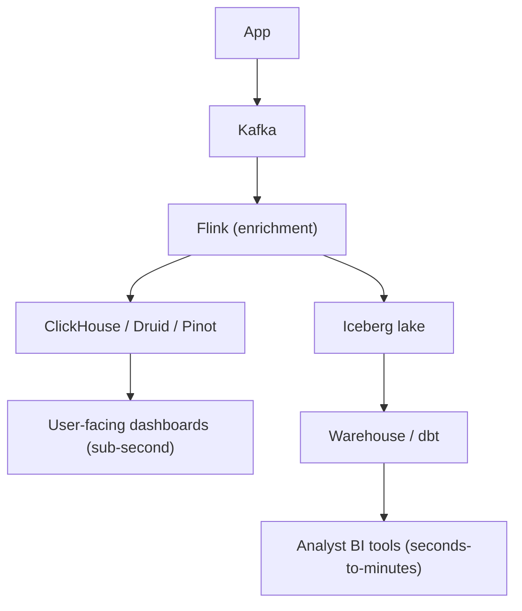
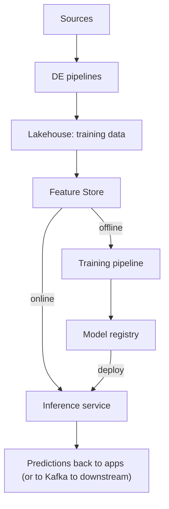
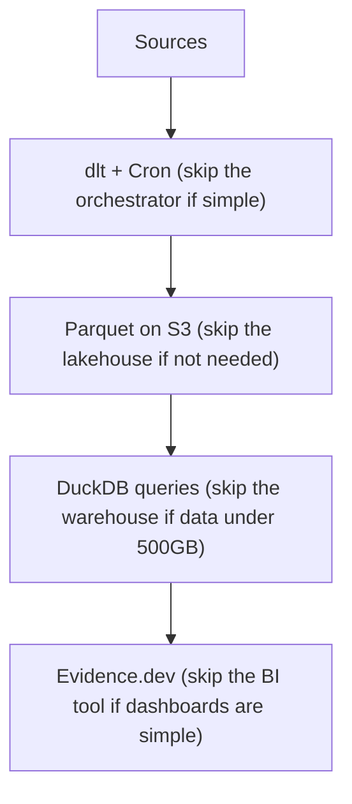

# 07 — The Data Architect Track — Part 1 of 4: Role, Mindset, and Foundational Frameworks

The earlier sections take you from "I want to learn data engineering" to "I can lead the technical implementation of a serious data platform." This section takes you the next step: from senior implementer to architect.

This is a different jump than the previous ones. Going from junior DE to senior DE is mostly about technical depth. Going from senior DE to architect is mostly about judgment, communication, and scope. The skills that got you to senior plateau here. You need new ones.

**Who this is for:** Senior engineers (3–7 years in DE) who want to step up to staff/principal/architect roles. Or strong engineers who want to understand what architects actually do so they can either become one, work effectively with one, or skip the title and just operate at that altitude as a senior IC.

**A note on titles:** "Data Architect," "Principal Data Engineer," "Staff Data Engineer," "Data Platform Lead" — the title varies wildly across F100 companies. They roughly mean the same thing: the person responsible for the platform's architectural integrity. We'll use "architect" throughout; substitute your company's title.

---

## Phase 1 — What a Data Architect Actually Does

The honest version, not the job-description version.

### The Core Output: Decisions, Not Code

A senior DE's daily output is mostly code, configuration, and pipelines. An architect's daily output is mostly:

- **Decisions** (recorded in writing — ADRs, design docs)
- **Diagrams** (architecture diagrams that hold up to scrutiny)
- **Written documents** (RFCs, strategy memos, migration plans)
- **Meetings where decisions get made** (and the prep for those meetings)
- **Reviews** (code reviews, design reviews, vendor evaluations)
- **Occasional prototypes** (proof-of-concepts that de-risk a decision)

If you become an architect and your hands stop touching code entirely, you've gone too far. Most senior architects keep ~20% of their week in code — usually on high-leverage prototypes or critical reviews where the technical detail matters. If you go to 0%, you become an ivory-tower architect, and your decisions stop being grounded in reality. This is the single most common architect failure mode.

### The Three Time Horizons

Architects think across three horizons simultaneously:

- **0–3 months:** What's shipping. Mostly observation; the team is executing.
- **3–18 months:** The roadmap. Where most architect attention goes. Designing what comes next.
- **18–60 months:** The strategy. Platform evolution, build-vs-buy bets, technology curve management.

Senior DEs operate mostly at 0–3 months. Staff DEs add the 3–18 horizon. Principal/architect adds the 18–60. The promotion to architect is fundamentally about extending your time horizon without losing connection to the present.

### What You Stop Doing

Things you'll do less or not at all once you're an architect:

- Writing pipelines end-to-end
- Owning specific production systems alone
- Being the person paged at 3 AM (usually — though good architects still take some on-call to stay grounded)
- Closing tickets quickly
- Having the satisfaction of a fully-shipped feature each sprint

If those losses sound bad to you, the architect track might not be for you. It's a career path optimized for people who get more energy from designing systems than from building them. Both are valuable; only you know which one you are.

### What You Start Doing

Things you'll do constantly:

- Writing — far more than you expect. Most senior architects spend 30–50% of their time writing.
- Drawing diagrams. Many diagrams. The first draft of any architecture lives in a diagram.
- Reviewing other people's designs and code at depth
- Sitting in rooms with VPs explaining why the platform costs what it costs
- Negotiating with vendors
- Saying "no" to projects that would damage the platform's long-term integrity
- Saying "yes" to projects that look bad short-term but pay off long-term

### The Architect's North Star

Every good architect is optimizing for one core thing: **the long-term technical health of the platform.** Not the velocity of the next sprint. Not the comfort of the team. The platform's ability to keep meeting business needs five years from now.

This is in constant tension with short-term pressure, which is why the role is hard.

---

## Phase 2 — The Architect Mindset

Specific shifts in how you think.

### Trade-offs Are Always Real

Junior engineers tend to think there's a "right answer" to most technical questions. There usually isn't. There's a *least-bad answer for this specific context*. The architect's job is to surface the trade-offs explicitly:

> "Snowflake gives us a faster path to value but locks us into a vendor and roughly doubles our 3-year platform cost. Self-managed Trino + Iceberg costs less but requires hiring two senior engineers and adds 9 months to time-to-value. Both are reasonable choices; the right one depends on whether we believe we can hire."

The senior-junior gap shows up most clearly in this kind of statement. Juniors say "Snowflake is better." Seniors say "Snowflake is better for us." Architects show the work.

### Reversibility Drives Process

Jeff Bezos's famous frame: **Type 1 decisions are irreversible. Type 2 decisions can be undone.** Type 1 decisions justify heavy process. Type 2 decisions should be made fast and learned from.

For data architects:

- **Type 1 (heavy process):** picking a primary cloud vendor; picking a warehouse; building vs buying the data catalog; the data residency strategy.
- **Type 2 (light process):** picking dbt vs SQLMesh; picking Airflow vs Dagster; picking Kafka vs Pulsar (mostly).

The trap: treating Type 2 decisions like Type 1 ("we must pick the perfect orchestrator!") wastes months. Treating Type 1 like Type 2 ("let's just go with Snowflake and see what happens") burns careers.

### Optionality Has Value

Choices that preserve future optionality are worth a small upfront cost. Examples:

- Using Iceberg means you can change query engines without rewriting storage
- Using dbt means transformations are portable across warehouses
- Standardizing on Arrow as the in-memory format means tools can be swapped
- Building against open protocols (REST catalog, OpenLineage, OpenTelemetry) means you're not vendor-locked

The opposite — proprietary formats and vendor-specific abstractions — feels efficient short-term but constrains future architects. Architects who don't preserve optionality leave landmines.

### Boring Technology Is Often Right

Dan McKinley's classic essay "Choose Boring Technology" applies tenfold to architecture. Each new technology you adopt comes with a tax: training, hiring, integration, debugging, monitoring, the cognitive cost of one more thing in the stack.

Strong architects defend the boring choices: Postgres, S3, Airflow, dbt, Kafka. They reach for new tech only when the boring choice genuinely can't solve the problem. They're skeptical when an engineer proposes adopting the new hotness "because it's better."

This isn't conservatism. It's resource discipline. Every team has limited capacity to operate complex systems; spend it on the parts of your stack where novelty creates real leverage.

### The Reversibility/Cost Matrix

A useful 2x2 for any architectural decision:

|                | Low cost | High cost |
|----------------|----------|-----------|
| **Reversible** | Just decide. Try it. | Prototype first, decide carefully. |
| **Irreversible** | Decide carefully. | Spend months. ADR. Multiple reviews. |

Junior engineers tend to spend the same amount of energy on every decision. Architects calibrate.

---

## Phase 3 — Architecture Decision Records (ADRs)

The single most important artifact an architect produces.

### What an ADR Is

A short written document recording a single architectural decision, why it was made, what alternatives were considered, and what the consequences are. Lives in version control alongside the code. Numbered sequentially.

### Why ADRs Matter

Without ADRs, every architectural decision gets re-litigated every six months. The original context (why we chose X) is lost. New team members don't know why the system looks the way it does. Architects spend their lives in meetings explaining ancient decisions.

With ADRs:

- Decisions have provenance (you can answer "why did we do this?")
- New team members get oriented faster
- The pattern of decisions reveals the team's principles
- You build institutional memory that survives turnover

### Standard ADR Structure

```markdown
# ADR-0042: Adopt Apache Iceberg as Our Open Table Format

**Status:** Accepted
**Date:** 2026-04-15
**Decision-makers:** A. Architect, B. Lead, C. CTO
**Consulted:** Data team leads, Security, FinOps

## Context

We currently store ~80TB of analytical data as raw Parquet in S3, queried
by Athena and EMR Spark. We're hitting limitations: no ACID guarantees,
painful schema evolution, no time travel, no efficient row-level deletes
(needed for GDPR).

We need an open table format. Three candidates: Iceberg, Delta Lake, Hudi.

## Decision

We will adopt Apache Iceberg as our standard open table format for
analytical data, with the AWS Glue catalog as the metastore.

## Alternatives Considered

### Delta Lake
- Pros: mature, strong Databricks integration, OPTIMIZE/VACUUM are battle-tested
- Cons: historically Databricks-favored. The recent open-sourcing has improved
  multi-engine support but Iceberg currently has broader native engine support
  for our use case (Athena, Spark, Snowflake-future)

### Hudi
- Pros: best-in-class streaming upserts
- Cons: more operational complexity; our workload is 90% batch
- Note: revisit if streaming becomes dominant in our workload mix

## Consequences

### Positive
- ACID transactions on lake data
- Time travel and snapshot isolation (helpful for GDPR deletion audit)
- Schema and partition evolution without rewrites
- Single format usable across Athena, Spark, and (eventually) Snowflake

### Negative
- One-time migration cost: ~3 engineer-months estimated
- Team needs Iceberg training (~2 weeks ramp per engineer)
- Glue catalog is a SPOF; we accept this for now but should consider a
  managed REST catalog in 2027

## Implementation Plan
1. Pilot on the marketing event tables (Q2)
2. Migrate the fact tables (Q3)
3. Migrate dimensions (Q4)
4. Decommission the raw Parquet path (Q1 2027)
```

### Tips for Writing Useful ADRs

1. **Write them when the decision is fresh.** Six months later, you can't remember why.
2. **Be honest about the "negative" consequences.** ADRs that only list positives are propaganda, not decisions.
3. **Keep them short.** 1–3 pages. If you need more, write a separate design doc and link.
4. **Number them and never delete.** Mark superseded ADRs as such; don't rewrite history.
5. **Make them the entry point.** Anyone joining the team should be told "read ADRs 1–10 first."

### What Goes in an ADR vs a Design Doc

| ADR | Design Doc |
|-----|------------|
| Records a decision | Proposes a design |
| 1–3 pages | 5–30 pages |
| Past tense ("we decided") | Future tense ("we will build") |
| Permanent | Often archived after build |
| Written by/with the decision-maker | Often written by the implementer |

Most architectural work produces a design doc *first*, then an ADR records the final decision. Both have their place.

---

## Phase 4 — Reference Architectures

The mental library of platform patterns an architect carries around.

### The "Modern Data Stack" Reference Architecture (Circa 2026)

```
Sources                Ingestion           Storage              Transform          Serve
──────                 ─────────           ───────              ─────────          ─────
[App DBs]   ──CDC──►   [Debezium]   ──►   [Kafka]   ──┐
[SaaS]      ──API──►   [Fivetran]   ──┐                ├──►  [Lakehouse:
[Files]     ──FTP──►   [dlt]        ──┤                │     Iceberg/Delta
[Events]    ──SDK──►   [Snowpipe]   ──┘                │     on S3]
                                                       │           │
                                                       │           ▼
                                                       │     [dbt Core]
                                                       │           │
                                                       │           ▼
                                                       │     [Warehouse:
                                                       └────►Snowflake/BigQuery]
                                                                   │
                                              ┌────────────────────┼────────────────────┐
                                              ▼                    ▼                    ▼
                                       [BI tools]          [Reverse ETL]        [Real-time OLAP]
                                       Looker/Tableau      Hightouch/Census     ClickHouse/Druid
                                                                   │                    │
                                                                   ▼                    ▼
                                                          [Operational tools]   [Embedded analytics]
                                                          Salesforce/Marketo     SaaS app dashboards
```

Underlying the entire stack:
- **Orchestration:** Airflow / Dagster
- **Catalog:** Unity / Glue / DataHub
- **Observability:** Monte Carlo / Datafold / custom
- **Quality:** dbt tests + Great Expectations
- **Lineage:** OpenLineage everywhere
- **Security:** column-level masking, RLS, tokenization
- **Cost management:** per-team budgets, query attribution

Every F100 has some variant of this. The differences are in which tool fills which slot.

### Reference: Real-Time Analytics Stack



The lambda-vs-kappa debate plays out in the choice of how to back this. In 2026 the trend is "Iceberg as the source of truth, with materializations into ClickHouse for the hot path."

### Reference: ML Platform Architecture



The DE/ML platform overlap is where roles like "ML Platform Engineer" or "Feature Platform Engineer" live. If your background is part-ML, this is where you have an asymmetric advantage.

### Reference: Data Mesh Architecture

```
Team A          Team B          Team C          Team D
─────           ─────           ─────           ─────
Sources          Sources         Sources         Sources
  │                │               │               │
  ▼                ▼               ▼               ▼
Pipelines       Pipelines       Pipelines       Pipelines
  │                │               │               │
  ▼                ▼               ▼               ▼
Data           Data            Data            Data
Products       Products        Products        Products
  │                │               │               │
  └────────────────┴───────────────┴───────────────┘
                          │
                          ▼
              ┌─────────────────────────┐
              │  Central Platform Team  │
              │  - Catalog              │
              │  - Quality framework    │
              │  - Compute & storage    │
              │  - Governance           │
              │  - Self-serve tools     │
              └─────────────────────────┘
```

The architect's role in a mesh: build the platform, define the standards, enforce the contracts, *don't* build pipelines.

### Reference: The Cost-Conscious Architecture

When the brief is "do more with less":



The architect knows when to scale down, not just when to scale up. A startup or a small F100 team often benefits more from this stack than from a "modern data stack" recreation. Good architects recommend this when appropriate even though it makes them look less ambitious.

---

## Phase 5 — Architecture Frameworks (Survey)

Formal frameworks exist for enterprise architecture. They're divisive — some architects love them, others find them bureaucratic. Worth knowing what they are.

### TOGAF (The Open Group Architecture Framework)

The most widely-known enterprise architecture framework. Covers:

- **Architecture Development Method (ADM)** — a cyclical process for evolving architecture
- **Four architecture domains** — Business, Data, Application, Technology
- **Enterprise Continuum** — how to organize architectural assets

**Worth knowing:** the ADM phases (Vision, Business Architecture, Information Systems, Technology, Opportunities, Migration Planning, Implementation, Change Management), the BDAT domains, the concept of a "reference model."

**Don't bother with:** memorizing TOGAF for its own sake. TOGAF certification is useful if you're at a TOGAF-shop F100 (especially in financial services, government, or pharma). Otherwise, it's mostly checkbox material.

### DAMA-DMBOK (Data Management Body of Knowledge)

The data-management-focused framework. Defines 11 knowledge areas:

1. Data Governance
2. Data Architecture
3. Data Modeling & Design
4. Data Storage & Operations
5. Data Security
6. Data Integration & Interoperability
7. Document & Content Management
8. Reference & Master Data
9. Data Warehousing & Business Intelligence
10. Metadata
11. Data Quality

**Worth knowing:** the framework gives you vocabulary for talking about data management as a discipline. Especially useful when talking to governance, compliance, and audit teams.

**Don't bother with:** treating DMBOK as a how-to. It's a catalog of concerns, not a playbook.

### Zachman Framework

A 6x6 matrix classifying every artifact of an enterprise architecture by *what/how/where/who/when/why* across six levels of abstraction. Older (1987). Mostly dead in modern practice but you'll see it cited in F100 architecture documents.

**Worth knowing:** that it exists. The 6x6 structure can be a useful checklist when you're documenting a new system. Don't structure your career around it.

### The C4 Model

The most useful diagramming framework. By Simon Brown. Four levels of architectural diagrams:

1. **System Context** — your system as a black box, with users and external systems around it
2. **Container** — major deployable units (applications, databases, services)
3. **Component** — the parts within a container
4. **Code** — class diagrams (rarely needed)

Most architectural diagrams should be at the Context or Container level. The discipline of C4 — explicit boundaries, consistent notation, named relationships — produces dramatically better diagrams than free-form whiteboarding.

Get [Structurizr](https://structurizr.com/) or use C4 PlantUML/Mermaid to produce these. The investment pays off forever.


---

## You can now

- Describe what a data architect actually produces day to day — decisions, ADRs, diagrams, meetings, occasional prototypes — and explain why hands-off-code entirely is a failure mode, not a promotion.
- Reason across the three architect time horizons (0–3, 3–18, 18–60 months) instead of defaulting to this-sprint thinking.
- Apply the reversibility/cost matrix to calibrate how much process a decision deserves, and tell Type 1 (irreversible) decisions apart from Type 2 (reversible) ones.
- Write a standard-structure ADR (context, decision, alternatives, consequences, implementation plan) and know when a design doc should precede it.
- Recall at least three reference architectures (modern data stack, real-time analytics, ML platform, data mesh, cost-conscious) and pick the right skeleton for a given brief.

## Try it

Take a technical choice your team is currently debating (warehouse, orchestrator, table format, build-vs-buy on some component). Write a one-page ADR for it using the structure in Phase 3: Context, Decision, Alternatives Considered (with honest pros/cons), Consequences (including the negatives), and an Implementation Plan. Then place the decision on the reversibility/cost matrix from Phase 2 and check whether your team is spending proportionate energy on it — too much process on a Type 2 decision, or too little on a Type 1 one, is itself a useful finding.
