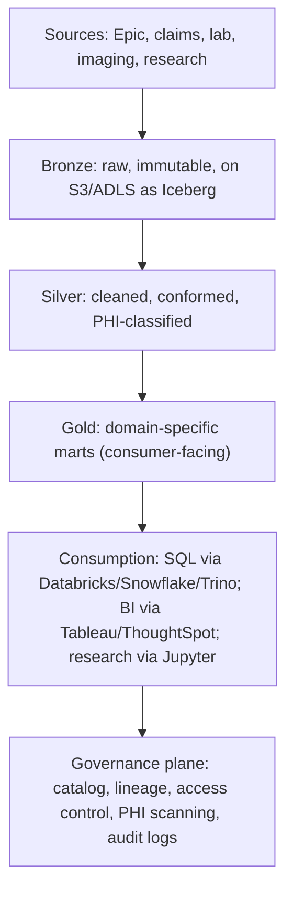
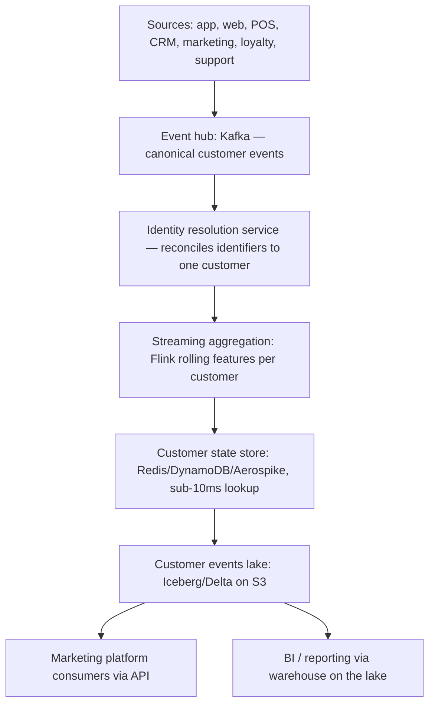
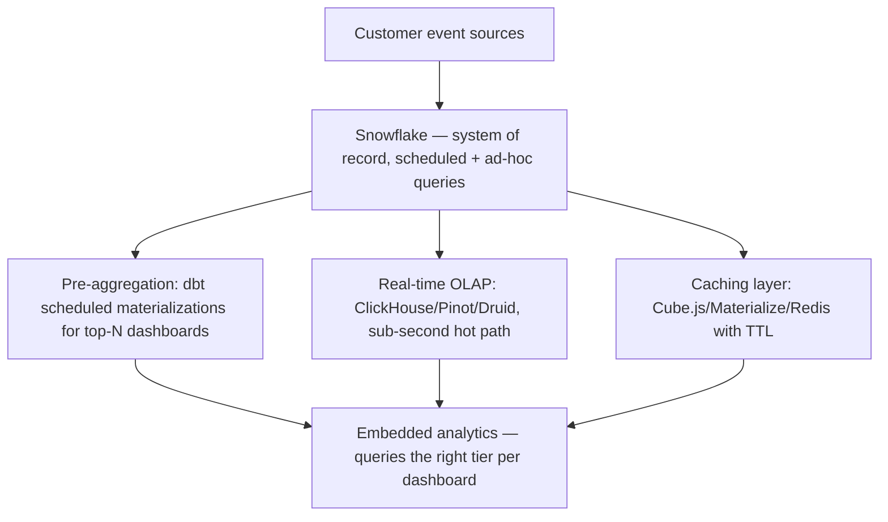
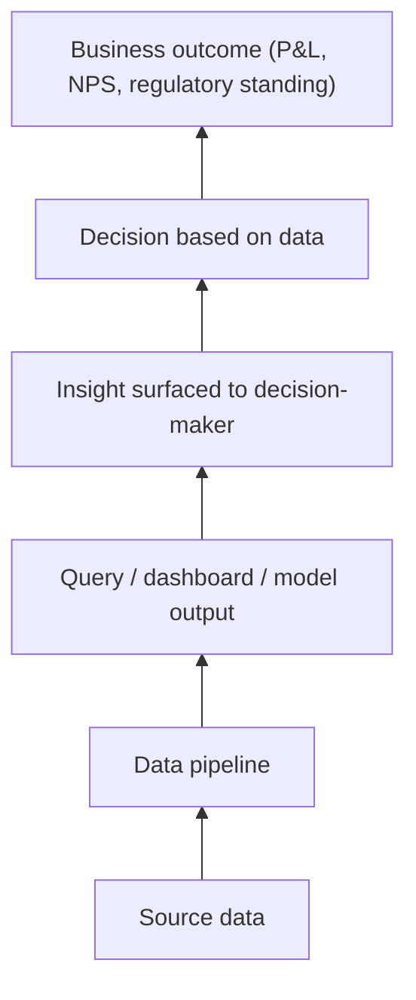

# 08 — Use Cases and Mental Models: How Data Engineers and Data Architects Actually Think

The earlier sections teach the *tools*. This one teaches the *thinking*. Eight complex, realistic scenarios — each shown as a senior data engineer / staff IC architect would approach it, then again as a senior data solutions architect (or consulting / vendor SA) would approach it. You'll see two minds working the same problem.

By the end, when you read a job description that says "thinks systematically about data problems," you know exactly what that means and can do it on demand.

## How to Use This Section

Read each scenario actively:

1. **Read the problem statement** and pause 5 minutes. Think how you would approach it.
2. **Read the IC architect's approach.** Note the questions, the decomposition, the deliberate refusals.
3. **Read the SA approach.** Note the differences — discovery, multi-vendor honesty, customer politics.
4. **Compare to your initial take.** Add what the seniors thought of that you missed.

Each scenario uses the same structure:

- **The situation.** Real-feeling context.
- **What you're not told.** Unspoken questions.
- **IC architect's approach.** A staff/principal data engineer reasoning.
- **SA approach.** Customer-facing solutions architect reasoning.
- **Where they diverge.**
- **The proposed architecture.**
- **What they'd worry about in month 3.**
- **The interview-ready summary.**

---

## Scenario 1 — The Bank Whose Quarter-End Close Takes Five Days

### The Situation

A US regional bank's finance team takes 5 business days to close the quarter. Competitors do it in 2. The CFO has been told by an analyst that the bank is "running on a 1990s data stack" and feels exposed. The CTO calls in a senior data engineer or vendor SA:

> "We have Oracle on-prem. We have a legacy DataStage / Informatica setup running 2000+ jobs nightly. We have Tableau. We have a 30-person data team. We've tried to migrate to the cloud twice and both times it stalled. The CFO wants the close cycle cut in half this year. What do we do?"

You have 60 minutes.

### What You're Not Told

- **Why does close take 5 days?** Could be: data isn't ready, reconciliation is manual, the warehouse schema doesn't match how finance thinks, the close team's process itself is the bottleneck, regulatory adjustments slow the last day.
- **What did the prior migrations actually look like?** Two stalled migrations is a culture / political signal. Was it scope, sponsorship, vendor selection, or capability?
- **What's the close calendar?** Day 1: accruals. Day 2: reconciliation. Day 3: adjustments. Day 4: management review. Day 5: regulatory reporting. Different bottlenecks at each day.
- **Who's the actual user?** Controllers, FP&A, regulatory reporting team. Each has different needs.
- **What's the regulatory landscape?** SR 11-7 model risk for any model used in financial statements. SOX for the close process itself. CCAR / DFAST adjacency.
- **What's the team's skill?** A 30-person team trained on Informatica may not know dbt, Spark, Snowflake. Reskilling is part of the timeline.
- **What's the on-prem footprint?** Hardware refresh cycles. Existing licensing deals (Oracle, IBM).
- **Where do upstream systems live?** Core banking on a mainframe? GL on Oracle EBS? Each has its own integration story.

### IC Architect's Approach

A staff data architect at the bank reframes the conversation:

**The CFO asked for "cut close cycle in half" — what's actually causing the 5 days?** The architect's first move is not technical; it's diagnostic. Often the close cycle is gated by:

- **Day 1–2 wasted waiting for source data.** Mainframe batch finishes at 4am Day 2. Until then, downstream can't start. The fix is replication, not transformation speed.
- **Day 3 wasted on reconciliation.** Two systems disagree on the same number; finance hunts the difference manually. The fix is data quality at the source.
- **Day 4 wasted on management review iterations.** Numbers change every revision; the leadership team meets daily. The fix is self-service tooling for the controllers so they can answer questions without an engineer.
- **Day 5 wasted on the regulatory reporting team.** They build their numbers from scratch every quarter because they don't trust the warehouse. The fix is governance and lineage, not new tools.

A naive answer is "migrate to Snowflake and use dbt." A senior answer is "identify which day is the bottleneck and fix that specifically."

**The architect proposes a diagnostic week first:**

> "Before we recommend tools, give me a week with the finance team to map exactly where the 5 days go. Then I'll come back with a specific intervention. If we replace the data stack without solving the actual bottleneck, we'll spend $40M and still take 5 days."

The CFO usually agrees if the architect can credibly say "we'll have an answer next Friday."

**Likely findings (typical at regional banks):**

1. Day 1 is consumed by mainframe batch latency. The DB2 z/OS unload takes 6 hours.
2. Day 2 is consumed by reconciliation between GL and sub-ledger. Different code lists in each.
3. Day 3 is consumed by manual journal entries that should be automated.
4. Day 4 is consumed by management review iteration. Each change triggers re-runs of dependent reports.
5. Day 5 is regulatory: numbers must match GL exactly; reconciliation by hand.

**The architecture intervention (phased, not big-bang):**

```
Phase 1 (months 1–4): Source acceleration.
  - Add CDC from mainframe DB2 to a landing zone (Db2 Replication / Qlik / IBM CDC / Oracle GoldenGate).
  - Land in S3 (or ADLS / GCS); query via lakehouse engine (Iceberg + Trino, or Snowflake external tables).
  - Eliminates Day-1 latency.

Phase 2 (months 4–8): Reconciliation as code.
  - Build a unified semantic layer (dbt + a metrics layer) over GL and sub-ledger.
  - Automated reconciliation tests run continuously; differences surface as alerts, not Day-3 surprises.
  - Eliminates most of Day 2.

Phase 3 (months 8–14): Self-service controllers.
  - Build a finance-specific BI surface (Hex, ThoughtSpot, embedded analytics).
  - Pre-computed metrics that the controllers can slice without engineer help.
  - Eliminates Day-4 iteration delay.

Phase 4 (months 14–18): Regulatory reporting integration.
  - Lineage tooling so regulatory reporting team can trust warehouse numbers.
  - Audit trail per metric, per period, per change.
  - Eliminates Day-5 hand-reconciliation.

Throughout: keep Informatica running. It's the source of truth. Migration to dbt-on-Snowflake (or Iceberg-on-Trino) happens job by job, validated against the legacy output, retired only after parallel-run proves equivalence.
```

**The architect's deliberate refusals:**

- "We will not migrate everything in one cutover. Big-bang migrations at banks have a 90% failure rate."
- "We will not retire the mainframe. It's not a goal of this engagement."
- "We will not commit to halving the close cycle in 12 months. We'll commit to a Day-2 close in 18–24 months if Phase 1–3 land. The reason prior migrations stalled is they over-promised."
- "We will not lift-and-shift Informatica jobs to a new tool. We will redesign them, one domain at a time."

**Why the IC architect can say this:** They live with the consequences. An external SA promising 12 months wins the deal and leaves the customer with a broken expectation. The internal architect, accountable, calibrates.

### SA Approach (Cloud Vendor or Snowflake / Databricks)

A Snowflake or Databricks Senior SA with financial services specialty walks in:

**Discovery, with industry-specific framing:**

- "Which day of close is the painful one? Day 1, 3, 5?"
- "Walk me through your reconciliation between GL and sub-ledger. How long does that take?"
- "What's your CCAR / DFAST submission timeline? Does that pull into your close?"
- "What happened on your prior migrations? Was it sponsorship, scope, or capability?"
- "What's your stance on hybrid (Oracle stays, lakehouse for analytics) vs. full cloud?"

The SA collects:

- Specific bottleneck day (avoids the "migrate everything" trap)
- Existing reconciliation pain (their tool's headline use case)
- Regulatory pressure (creates urgency the customer didn't articulate)
- Migration history (signals what to do differently)
- Architecture philosophy (hybrid or all-in)

**The SA's typical structure for the response:**

> "Three observations before architecture. First, halving the close cycle is feasible but only if we attack the specific bottleneck day, not migrate the platform. Second, prior migrations stalled because they tried to replace everything; we've seen this 30 times. Third, the right path for you starts with a 'connect, don't migrate' move — Snowflake external tables on your existing data lake, or Iceberg tables that Snowflake reads. You don't have to lift and shift Oracle to get value. Then we extend from there."

**The SA's likely architecture recommendation:**

If Snowflake:

- Snowflake reading Iceberg tables on S3, fed by CDC from mainframe / Oracle
- dbt Core or dbt Cloud for transformations, replacing Informatica gradually
- Snowflake's Dynamic Tables for streaming-style transformations as a stepping stone
- Snowflake Time Travel for audit / reconciliation evidence
- Cortex (Snowflake's LLM service) for self-service Q&A *only if* the customer is ready (most banks aren't, yet)

If Databricks:

- Delta Lake on the existing data lake, fed by CDC
- Databricks SQL for analyst-facing queries
- dbt against Databricks
- Unity Catalog for governance
- Lineage end-to-end

**The SA explicitly compares paths:**

> "I can sell you Snowflake. But honestly, for your Oracle-heavy stack, Databricks may fit slightly more naturally because of the Spark heritage and Delta Lake integration with your existing big-data tooling. For your finance-team-driven workload, Snowflake's SQL-first experience tends to win adoption faster. Both are valid; the right answer depends on your team's skill profile. Let me ask: are your 30 people more SQL-leaning or Python/Spark-leaning?"

That honesty wins trust. The SA who only sells one product is detectable in 90 seconds.

**The SA pulls in:**

- A financial services industry SA
- A migration architect from the vendor's professional services arm
- A partner SI (Deloitte, Accenture, Slalom) for the people-side of migration
- Reference customers in similar size/sector

**The SA's distinctive value:** Migration playbooks. They've seen what works. The playbook for a regional bank migrating off DataStage typically:

1. Stand up the new platform parallel to old (3 months)
2. Pick one finance domain (e.g., loan loss reserves) as the pilot (3 months)
3. Parallel-run for 2 close cycles
4. Cut over that domain
5. Repeat for next domain
6. Decommission only after >80% of domains migrated

### Where the Two Diverge

| Concern | IC Architect | SA |
|---|---|---|
| Question of "should we migrate" | Will recommend "no" if the answer is no | Has incentive to recommend yes (deal); good SAs resist when honest |
| Vendor neutrality | Cares deeply (lock-in costs them) | Will recommend their own product; honest about fit |
| Day-100 ops | They own it | They hand off to Customer Success post-deal |
| Migration playbook | Built from scratch for their context | Brought from 30 prior engagements |

Both should converge on a phased plan with a specific bottleneck-day focus. The SA brings playbook leverage; the IC brings customization to internal politics.

### The Proposed Architecture

As above — phased, source-acceleration first, semantic layer second, self-service third, regulatory integration fourth. Both vendors and IC architects often converge here.

### What They'd Worry About in Month 3

- **The CFO has lost patience.** "When does the close get faster?" Need an early-win metric in Phase 1 — e.g., the loan-loss-reserves calculation now finishes Day 1 instead of Day 2.
- **The Informatica team feels threatened.** Reskilling plan from day 1. Promotion paths for engineers who migrate jobs successfully. Otherwise quiet quitting.
- **Reconciliation discovers actual data quality issues.** The bank has been masking them. Suddenly you're explaining to the controller why GL is $3M off from sub-ledger every month.
- **Regulatory examiners ask about the migration.** Document everything. SR 11-7-style documentation for the new analytical pipelines.
- **The mainframe team blocks CDC.** Operational risk concerns, throughput concerns. Get the mainframe team in the room from day 1 or the project stalls.

### Interview-Ready Summary

> "Don't migrate. Diagnose. Find the bottleneck day — usually Day 1 (source latency), Day 3 (reconciliation), or Day 4 (self-service iteration). Attack that day first with a phased intervention: CDC from mainframe / Oracle for Day-1 acceleration, semantic layer for Day-2 reconciliation, self-service BI for Day-4. Keep Informatica running until each domain is parallel-run validated. Commit to a Day-2 close in 18–24 months, not 12. The reason prior migrations stalled is they over-promised and tried to migrate everything. The right move is phased, with early wins and ruthless scope discipline."

---

## Scenario 2 — The Marketplace Whose Recommendation Engine Eats All the Compute

### The Situation

An online marketplace ($1.2B GMV) runs nightly batch jobs on Spark on EMR. The data engineering bill has grown 6x in 18 months — from $30K/month to $180K/month. Most of the growth is in the "recommendations training" pipeline. The CTO wants the bill to plateau or shrink, not because the company can't afford it, but because the growth rate is unsustainable.

The Director of Engineering says: "We've doubled the data and doubled the models. The bill 6x'd. Something's wrong. Can you find it?"

### What You're Not Told

- **What does "recommendations training" mean here?** Could be one feature pipeline running 200 model retrains, or 200 separate pipelines each retraining one model.
- **What's the cluster utilization?** A cluster running at 30% utilization for 8 hours costs the same as 100% for 8 hours.
- **What's the failure / retry rate?** Jobs that fail and retry burn compute twice.
- **What's the actual data volume per job vs. the cluster size?** Spark clusters are often over-provisioned because someone copied a template.
- **What's the storage cost?** Often the secret cost grower.
- **Are jobs writing intermediate data they don't need to?** Shuffles and intermediate writes can cost more than the final output.
- **Is there job-level cost attribution?** Most teams don't tag, so they can't see.
- **Who decides cluster sizes?** Usually whoever copy-pasted the template last.

### IC Architect's Approach

A staff data engineer hired to investigate doesn't start by reading code. They start by reading the bill.

**Step 1: Cost attribution.** Pull the AWS cost explorer with EMR tags. If tags don't exist, tag the clusters by job name. Build a per-job-per-day cost view. Within a week, you know which 5 jobs are eating 80% of the budget.

**Step 2: For each top-5 job, profile.** What's the cluster size? What's the actual runtime? What's the Spark UI showing?

Typical findings at marketplaces:

1. **The "user features" job runs on 200 r5.4xlarge nodes for 6 hours.** Spark UI shows skewed joins. One key (user_id 0, the "anonymous" user) has 40% of the rows. The job spends 5 of 6 hours on that one key. The fix is salt the skewed key — 30 minutes of work, eliminates 80% of the job's cost.
2. **The "session aggregation" job re-reads the entire 18-month event log every night.** It's an incremental pipeline that forgot how to be incremental. Fix is partitioned writes + only-read-new-partitions. Saves 70%.
3. **The model training job is running on GPUs but spending most of its time on data loading.** GPU utilization 15%. Move data loading to CPU pre-stage; GPUs run only for training. Saves 60%.
4. **Three different jobs compute "items viewed in last 7 days per user."** Each was built independently. Consolidate into a feature store; each job reads the precomputed feature. Saves 40%.
5. **The orchestrator retries failed jobs 3 times. The 80%-failing job is therefore costing 4x.** Find why it fails; fix the underlying issue. Often a flaky downstream API or a memory limit.

**Step 3: Pricing structure.** EMR on-demand is the most expensive option. The architect typically recommends:

- Spot instances for the worker nodes (60–70% savings; jobs handle preemption via checkpointing)
- Reserved or Savings Plan for the master nodes
- EMR Serverless for jobs with bursty patterns

**Step 4: Storage cost.** Often missed. The architect checks:

- Are intermediate files being lifecycled? S3 storage at hot tier for files no one reads is shockingly expensive.
- Are old job artifacts retained forever? Add a 30-day lifecycle to job logs.
- Are old EMR cluster logs being deleted? They accumulate.

**Step 5: The "kill it" candidates.** Some jobs run nightly because they ran nightly last year. Nobody owns them. Nobody checks the output. The architect proposes:

> "Job X has been running for 3 years. Last week I changed its output to NULL. Nobody noticed. I'm proposing we turn it off. If something breaks, we'll know by next Tuesday."

About 5–10% of nightly jobs at any marketplace can be killed this way. Real money.

**The architect's deliverable:**

- A per-job cost table (before / after)
- A prioritized fix list
- A "kill list" of jobs to retire
- An estimate: typical first-pass reduction is 40–50%

### SA Approach (Databricks, Snowflake, EMR Specialist, or FinOps Vendor)

An SA in this conversation, especially from Databricks or a FinOps tool, thinks:

**This is a Databricks Photon / Snowflake / FinOps-Vantage / Cloudability conversation.** The customer is on EMR; the SA's job is honest comparison.

**Discovery:**

- "What workload mix? Streaming, batch, ad-hoc?"
- "How elastic is your demand? Is your evening batch window the same every night?"
- "What's your team's Python vs. SQL split? Notebook-heavy or job-heavy?"
- "Are you using Iceberg/Delta yet, or raw Parquet?"

**The SA's honest framing:**

> "Several things will help here. Some you can do without changing platforms — better tagging, spot, kill the dead jobs, fix the skew. That alone is probably 30%. Beyond that, if you want to consider platform options, Databricks' Photon engine often gives another 30–50% on Spark workloads through query optimization and the C++ vectorized engine. But that's a migration project, not a quick win. Start with the free wins; then evaluate."

The SA explicitly *separates* the cheap wins (any vendor) from the platform wins (their vendor). They tell the customer to do the cheap wins first. This is what a good SA does: deliver value before selling.

**If Databricks pitches:**

- Photon engine for compiled SQL
- Job clusters with auto-scaling (replacing fixed EMR pools)
- Delta Lake with OPTIMIZE for file compaction
- Unity Catalog for governance + lineage (often the hidden value)

**If a FinOps tool pitches:**

- Per-cluster, per-job cost attribution out of the box
- Recommendations engine (Spot, right-sizing, scheduled scaling)
- Anomaly detection on cost (alert when a job's cost spikes)

**The SA's value-add:**

- They've seen which optimizations work for which workload shapes
- They have a benchmark library: "marketplaces of your size typically run X TB/day; you're at Y; here's why you're 3x over baseline"
- They can connect to similar customers

### Where the Two Diverge

The IC engineer can change the code. The SA usually can't. The SA's leverage is in framing, sizing, and reference patterns. Both arrive at the same first-pass diagnosis: skewed joins, dead jobs, non-incremental incremental jobs, retry loops, storage waste. The vendor SA adds the "and here's a platform that would help further."

### The Proposed Architecture (After Diagnosis)

```
Before:
  EMR on-demand × 12 always-on clusters
  Dead jobs running nightly
  No tagging, no cost attribution
  Skewed shuffles, full-rewrite "incremental" jobs
  Storage at hot tier indefinitely

After (Phase 1, weeks 1–8):
  Tag all jobs by team/feature/owner
  Per-job cost dashboard
  Kill 15% of jobs (proven unused)
  Move 80% of compute to spot
  Fix skew on top-5 jobs
  Make incremental jobs actually incremental
  Lifecycle policies on storage

After (Phase 2, months 3–6):
  Migrate to EMR Serverless or Databricks for the bursty workloads
  Feature consolidation: shared feature store for repeated computations
  Iceberg or Delta tables for ACID + better optimization
  Anomaly detection on cost via FinOps tool

Result: bill 40–50% lower at same data volume.
```

### What They'd Worry About in Month 3

- **The savings start to erode.** New jobs get added. Without ongoing discipline, the bill creeps back. Need recurring cost reviews.
- **The kill-the-dead-jobs strategy hits a job someone secretly relied on.** Have a 2-week "deprecation window" with logs of failed lookups before deleting.
- **Spot interruptions on critical jobs.** Move critical jobs to mixed-instance fleets, not pure spot.
- **The "I want a bigger cluster" requests.** Engineers will instinctively scale up to fix bugs. Add a review process; require a profile screenshot before approving cluster growth.

### Interview-Ready Summary

> "Don't migrate platforms first. Diagnose first. Most marketplaces' Spark bills are eaten by 5 jobs out of 200. Top causes: skewed joins, non-incremental 'incremental' jobs, redundant feature computations, low GPU utilization on data-loading-bound jobs, dead jobs nobody owns, all-on-demand pricing. First-pass fix is 40–50% reduction without any platform change. Tag everything, attribute cost per-job-per-day, kill the dead jobs, fix the skew, make incremental actually incremental, move 80% to spot, lifecycle storage. *Then* consider platform changes if needed. The senior move is to fix the cheap stuff first."

---

## Scenario 3 — The Healthcare System Whose Data Lake Has Become a Data Swamp

### The Situation

A large US healthcare system (academic medical center plus 12 hospitals) has a Hadoop/HDFS data lake built in 2017. Today it has:

- 30+ PB of data
- 6000 tables across 200 schemas
- Documentation that's 4 years stale
- A dozen Python scripts that run nightly, owned by people who left
- 100+ Tableau dashboards, 60% of which haven't been opened in 90 days
- A research team that increasingly bypasses the lake and goes direct to EHR exports
- A compliance team that can't answer "where is patient data X stored"

The CDO says: "We need to know what's there, what's used, what's PHI, what's safe to delete. We have $5M and a year. What do we do?"

### What You're Not Told

- **What's the data quality posture?** A swamp implies bad quality; what's specifically bad?
- **What's the regulatory exposure?** HIPAA breach notification within 60 days. Data over-retention is also a compliance issue.
- **What's the research community's relationship to the lake?** If they bypass it, the lake is failing its core users.
- **What's the budget actually for?** Tooling? Headcount? Consultants? Cleanup labor?
- **What's the migration trajectory?** Hadoop on-prem in 2017 → cloud lakehouse by 2027 is increasingly the path. Is that planned?
- **What's the upstream story?** EHR (Epic likely), claims systems, lab systems, imaging, research data. Each has its own integration.
- **Who owns each schema today?** Often unclear; that's part of the swamp.
- **What's the legal hold posture?** Some data must be retained for active litigation.

### IC Architect's Approach

A staff data architect at the health system takes a triage approach.

**Cataloging precedes cleanup.** You cannot delete what you don't understand. Step 1 is always: build (or buy) a data catalog and populate it.

**The architect proposes a 3-phase plan:**

```
Phase 1 (months 1–3): Inventory.
  - Deploy a catalog (DataHub, Atlan, Alation, or Unity Catalog if migrating to Databricks)
  - Automated profiling: row counts, schemas, last-modified, last-read, owner inference from creator
  - PHI/PII detection: scan column names + sample data for indicators
  - Build a "data product registry": every table either has an owner or is marked orphan
  - Lineage discovery: where did this table come from?

Phase 2 (months 3–9): Triage.
  - Orphan tables that haven't been read in 1 year → archive to cheap storage, kill access
  - Orphan tables that haven't been read in 2 years → delete (after legal hold check)
  - Active tables → assign an owner (a team, not a person)
  - PHI tables → confirm encryption, access control, masking; document for HIPAA audit
  - Build the "blessed" table list: the tables consumers should use, with SLAs

Phase 3 (months 9–12): Architecture.
  - Move blessed tables to lakehouse format (Iceberg, Delta)
  - Connect Databricks or Snowflake on top
  - Sunset the orphan-table area completely
  - Set up ongoing governance: every new table needs an owner, every PHI table flagged
```

**The architecture target:**



**The architect's specific moves:**

1. **Don't migrate everything.** 30 PB at $25/TB-month is $9M/year in cloud storage alone. Tier aggressively. Hot ~10%, warm ~20%, cold/archive the rest.
2. **Embrace lakehouse format.** Iceberg or Delta gives ACID + time travel + schema evolution. Critical for regulated data.
3. **Catalog from day 1.** Without it, you'll repeat the swamp pattern in 5 years.
4. **Owner-or-orphan.** Every table is either owned or scheduled for deletion. No middle ground.
5. **Research community is a stakeholder, not an afterthought.** They're bypassing the lake because the lake doesn't serve them. Solve that with researcher-friendly tooling (Jupyter on Databricks with PHI-aware access controls).
6. **Don't migrate platforms and clean up simultaneously.** Pick one. Recommend: clean up on current platform first, then migrate.

**The architect's deliberate refusals:**

- "We will not migrate before we catalog. Migrating a swamp produces a more expensive swamp."
- "We will not delete anything without owner sign-off or 2-year inactivity proof."
- "We will not commit to 'lake transformation' in 12 months. We commit to: catalog complete by month 3, 50% reduction in orphan tables by month 6, lakehouse migration plan by month 9, first domain migrated by month 12."

### SA Approach (Databricks / Snowflake / Unity Catalog / Healthcare-Specialized)

A Databricks Senior SA with healthcare specialization, or a Snowflake SA, or an Atlan / Collibra SA, walks in with playbooks specific to healthcare data swamp.

**Discovery, healthcare-specific:**

- "What's your EHR? Epic? Cerner?"
- "Do you have a research enclave (NIH-style) or is everything in one environment?"
- "What's your BAA posture with cloud vendors?"
- "What's your HITRUST or SOC 2 certification status?"
- "What's the AMC (academic medical center) research workflow today?"
- "Has the OCR ever investigated you? Any open complaints?"

**The SA's value-add:** They've seen 20+ academic medical centers migrate off Hadoop. They have a playbook:

1. Start with the OMOP common data model. Healthcare data is more standardizable than the customer thinks.
2. Federated identity for researchers (mostly via Shibboleth at AMCs)
3. Tumor registry, clinical trial data, biospecimen data — each has unique handling
4. Epic's Clarity database is the typical source of truth; integrate carefully

**The SA likely brings in:**

- A Healthcare and Life Sciences industry SA
- A research data SA (if AMC)
- A privacy SA for the HIPAA / Common Rule conversations
- Reference customers (Mayo, Cleveland Clinic, Mt. Sinai, University of Pittsburgh, etc., have publicly described migrations)

**The SA's recommended architecture (Databricks-specific):**

- Unity Catalog as the central governance layer
- Delta Lake everywhere
- Mosaic AI for any model deployment
- Lakehouse Federation to query Epic Clarity without copying
- Photon for query performance
- Delta Sharing for sharing with external researchers (NIH, pharma collaborators)

**The SA's specific warnings:**

- "Research data has unique consent constraints. You'll need column-level access control tied to consent records."
- "Imaging data is huge. Plan for DICOM-specific tooling; don't try to put it in a normal lakehouse."
- "Your IRB will require detailed audit. Bake that in from day 1."
- "Don't make the OMOP CDM your only model. Some workflows need raw Epic structures. Plan dual access."

### Where the Two Diverge

Both arrive at similar architecture. The SA brings the cross-customer playbook and the vendor's specific accelerators. The IC architect brings the internal political knowledge — who blocks what, which research lab will revolt, which IT VP must be on the steering committee.

### The Proposed Architecture

As above. Bronze/silver/gold on Iceberg or Delta, governance via catalog, research-friendly access via Databricks notebooks with row-level security tied to consent.

### What They'd Worry About in Month 3

- **The OCR audit during the cleanup.** If the catalog reveals undisclosed PHI, you may have a 60-day breach notification clock.
- **The "we secretly use this" tables.** Tables that haven't been read in 2 years according to logs, but are actually used in a critical workflow nobody documented. The deprecation window catches most; some escape.
- **The research community's resistance.** Researchers used to "give me an Epic extract" workflow won't love the new governance overhead. Carrot: better tools, faster access. Stick: compliance.
- **The cost of the catalog itself.** A 6000-table profile costs real money to maintain. Build the ROI story.
- **The first migration domain.** Picking the wrong first domain (too complex, too political) stalls the program. Pick a contained, valuable, willing-customer domain (clinical trial recruitment, often).

### Interview-Ready Summary

> "Catalog before cleanup. Cleanup before migration. The progression at academic medical centers is: deploy a catalog and profile everything (3 months), triage owner-or-orphan, archive the cold data, classify PHI rigorously (6 months), migrate the blessed-tables to lakehouse format (12+ months). Don't migrate the swamp. The healthcare specifics: OMOP CDM is your common data model target; Epic Clarity is your source of truth; research enclave needs separate governance; consent-aware access control is mandatory; the IRB will want detailed audit. $5M and 1 year covers the catalog + triage + plan, not the full migration. The senior move is to push the CDO on realistic scope."

---

## Scenario 4 — The Retailer Building a Real-Time Customer 360

### The Situation

A national retailer (200 physical stores, $4B revenue, fast-growing e-commerce) wants a real-time customer 360 — a single view of every customer combining browse behavior, app behavior, in-store purchases, returns, loyalty, marketing engagement, customer support interactions. Marketing wants to use this for personalization. The CRM team wants it for service. Analytics wants it for reporting. Each team wants their own thing.

The VP of Data says: "Everyone keeps building their own customer view. We have four. They all disagree. We need one. Real-time, governed, owned by us, consumed by everyone."

### What You're Not Told

- **What "real-time" means.** Sub-second for personalization? Sub-minute for service? Hours for reporting? Each "team" probably means something different.
- **Sources actually integrated.** App, web, in-store POS, CRM, marketing platform, loyalty, returns. How clean is each?
- **Identity resolution maturity.** The hardest problem in customer 360. Do they have unified IDs across channels, or fragmented?
- **Privacy posture.** CCPA, GDPR (if international), the right-to-be-forgotten workflow.
- **The four existing customer views.** Who built them, who consumes them, what data each has. Killing them creates politics.
- **The team and budget.**
- **Marketing's specific use case.** "Personalization" can mean batch email targeting (daily fine), website recommendations (seconds), in-app push (seconds).

### IC Architect's Approach

A staff data architect at the retailer thinks:

**Customer 360 is two problems, not one.**

1. **Identity resolution.** Stitching multiple identifiers (email, phone, loyalty number, cookie, device ID, anonymous session) into one customer entity. This is the hardest, most often-underestimated problem.
2. **Real-time event aggregation.** Streaming events from sources into a single ordered timeline per customer, with derived features (last purchase, lifetime value, channel preferences).

The architect splits the architecture:



**Critical decisions:**

1. **Single source of customer identity.** Build (or buy: Amperity, mParticle, Segment Unify) an identity resolution layer. Without this, every consumer team rebuilds it badly.
2. **Canonical customer event schema.** Standardize what an "event" means across sources. Centralize the schema registry (Confluent Schema Registry, glue schema registry).
3. **Two-tier store.** Online (sub-10ms feature serving for personalization) + offline (full event log for analytics and ML).
4. **Consumer access via APIs, not direct DB.** Each consumer team queries an API; we control schemas, versioning, deprecation.
5. **Per-customer privacy controls.** Right-to-be-forgotten propagates to all tiers. Consent flags govern which events are usable.

**Building vs buying decisions:**

- **Identity resolution:** consider buying (Amperity, mParticle, LiveRamp). Building takes 12 months and never quite gets there.
- **CDP layer (the consumer-facing API):** build, because it's coupled to your specific consumers.
- **Stream processing:** build with Flink or Kafka Streams; managed services like Confluent or AWS MSK + Kinesis Data Analytics are reasonable.
- **Online store:** typically buy (DynamoDB, Aerospike, managed Redis).

**The architect's specific moves:**

- Define the canonical customer event schema first. Get all source teams to commit.
- Identity resolution proof-of-concept on a sample first, before integrating everything.
- Deprecate the four existing customer views deliberately — give each consumer team a migration deadline.
- Kill the politics: the central data team owns the customer entity. Marketing, CRM, analytics consume; they don't build.

**The architect's deliberate refusals:**

- "We will not let teams continue building their own customer views in parallel. The point is one entity."
- "We will not commit to all-sub-second-everywhere. Marketing personalization needs sub-second; reporting can be minutes-late."
- "We will not lift-and-shift the four existing views. We will replace them with one consolidated entity."

### SA Approach (CDP Vendor or Cloud Vendor)

An SA from a Customer Data Platform vendor (Segment/Twilio, Amperity, mParticle, ActionIQ, Tealium) or a cloud vendor (Snowflake with its Native Apps, AWS with its CDP partner ecosystem) thinks:

**This is the canonical CDP conversation.** The vendor SA's playbook starts with:

> "Customer 360 isn't a project; it's a function. Companies that succeed treat it as the platform that everyone consumes. Most fail because each consuming team builds in parallel. Let me show you the patterns we've seen work."

**Discovery:**

- "Walk me through your top 3 use cases for customer 360. Be specific — 'personalization' isn't enough."
- "What's your current identity resolution accuracy? Do you measure it?"
- "What's your retention policy on customer events? What's the right-to-be-forgotten workflow?"
- "Who owns the 'customer entity' definition today? Marketing, IT, data?"
- "Are you Salesforce-heavy? Adobe-heavy? Both? Neither?"

The Salesforce / Adobe question matters a lot — those vendors have their own CDPs (Data Cloud / Real-Time CDP) and the customer's stack alignment shapes the recommendation.

**The SA's typical structure:**

> "Three options here:
> 1. Build everything yourself on cloud primitives — Kafka, Flink, DynamoDB, your warehouse. Most flexible. 12–18 months. Real ops burden.
> 2. Buy a CDP (Segment, Amperity, mParticle) — fastest. Less flexibility. Recurring license cost in the seven figures at your scale.
> 3. Hybrid — buy the identity resolution (the hardest part), build the rest. Often the right answer for retailers of your size.
> Let me walk through each with your top use cases as the test."

**The SA explicitly anchors to use cases:**

- "If 80% of your value is real-time website personalization, option 3 is most efficient."
- "If 80% is batch marketing audience building, option 2 might be the cheapest path."
- "If you have a sophisticated data team and a 3-year horizon, option 1 keeps lock-in low."

**Vendor SAs from CDP companies typically warn:**

- "Don't underestimate identity resolution. It's the moat. Build vs buy here is the highest-stakes decision."
- "Plan for the consent layer from day one. Retrofitting is brutal."
- "Don't let marketing build the customer entity. They'll build it for the channel they're optimizing this quarter."

**The SA brings:**

- Customer reference visits (peer retailers)
- Pre-built use case patterns (email targeting, on-site recs, abandoned cart, customer service surface)
- Identity resolution accuracy benchmarks
- A maturity model framework ("CDP maturity stage 1, 2, 3 — where are you?")

### Where the Two Diverge

The IC architect knows the internal politics (which existing-view team will fight hardest). The SA knows what worked at peer retailers (and which CDP vendors have which strengths). Both end up with the same architecture skeleton; the SA brings the playbook leverage.

### The Proposed Architecture

As above. Kafka event hub, identity resolution layer (likely buy), Flink-based aggregation, two-tier store (online + offline), API consumption.

### What They'd Worry About in Month 3

- **The four existing teams claiming their view is the "real" customer 360.** Politics. Need executive sponsor.
- **Identity resolution accuracy below expectations.** Often 60–70% out of the box; getting to 90% takes work. Marketing will be impatient.
- **GDPR/CCPA right-to-be-forgotten testing.** The first regulator request comes; can you actually delete a customer across all 7 stores, online events lake, online store, marketing platform, etc.? Test now, not when it happens.
- **Schema evolution conflicts.** A source team changes their event schema. Downstream breaks. Schema registry + contracts must be enforced.
- **Cost overrun on the streaming layer.** Flink + Kafka costs are real. Tune partitioning, retention, processing windows.

### Interview-Ready Summary

> "Customer 360 is two problems: identity resolution and event aggregation. Identity resolution is the hardest; consider buying it. Architecturally: Kafka for the event hub, Flink for streaming aggregation, two-tier store (online sub-10ms + offline lake), API-mediated consumption. Build a canonical event schema and enforce it via schema registry. Kill parallel customer views deliberately with deprecation deadlines. The hard parts are politics (one team owns the entity), identity resolution accuracy, and right-to-be-forgotten workflow. 'Real-time' means different things to different consumers; design tiers. Build the consent layer day-one."

---

## Scenario 5 — The Pharma Company Whose Clinical Trial Data Is Locked in Excel

### The Situation

A mid-size pharma company ($8B revenue, multiple Phase 3 trials in progress) has a data engineering problem unusual outside life sciences: most of their clinical trial data lives in Excel files and EDC (Electronic Data Capture) system extracts. They have ~80 active trials, ~5000 sites worldwide, ~300K patients enrolled across all trials. Regulatory submissions require integrating data across sources to a specific format (CDISC SDTM and ADaM). Today this takes 6–9 months per trial after database lock.

The Head of Data Sciences says: "Submission timelines are killing us. We need a platform that compresses this 6–9 month integration phase. The FDA review clock doesn't start until submission. Every month is hundreds of millions of dollars in revenue we lose to delay."

### What You're Not Told

- **What "platform" actually means.** EDC vendor switch? Data warehouse? Statistical computing environment?
- **Vendor landscape.** Medidata Rave (Veeva, Oracle Clinical) for EDC. SAS for statistics. CDISC tooling.
- **What's the team's skill profile?** Pharma data teams are SAS-heavy, often R-friendly, rarely Python-fluent.
- **What's the GxP environment?** GxP-validated systems require formal validation (21 CFR Part 11). Building anything new requires the validation cycle.
- **What's the trial mix?** Phase 1 vs 2 vs 3 have different data volumes and integration requirements.
- **What's the team's experience with cloud?** Pharma is historically slow to cloud; some are catching up fast.
- **What's the M&A picture?** Pharma data integration often complicated by acquired-company systems.
- **What's the integration with the CRO (Contract Research Organization)?** Most large trials use CROs; data flows are complex.

### IC Architect's Approach

A senior data architect at the pharma thinks:

**This isn't a "build a warehouse" problem. It's a "build a clinical data platform" problem.** The constraints are unique:

- GxP validation required for any system touching trial data
- CDISC standards mandatory for submission (SDTM for tabulation, ADaM for analysis)
- 21 CFR Part 11 for electronic records and signatures
- Audit trail must be tamper-evident
- Data lineage must be traceable to source for any submission

A regular lakehouse doesn't satisfy these out of the box. The architecture must.

**The architecture target:**

```
[Sources: EDC (Medidata Rave), labs (LabCorp, Quest), imaging,
 wearables, electronic patient-reported outcomes, CRO files]
       │
       ▼
[Standardized clinical data lake: GxP-validated, immutable,
 audit-trailed (typically built on AWS GovCloud or Azure
 with HITRUST + GxP attestation)]
       │
       ▼
[CDISC standardization pipeline:
   SDTM mapping: source → standardized tabulation
   ADaM derivation: tabulation → analysis-ready datasets]
       │
       ▼
[Statistical computing environment: SAS, R, Python — used by
 biostatisticians to produce TLFs (tables, listings, figures)]
       │
       ▼
[Submission package builder: CDISC-compliant define.xml,
 datasets, code review evidence, generates eCTD-ready output]
       │
       ▼
[Regulatory submission to FDA / EMA]
```

**The architect's key moves:**

1. **Don't try to replace SAS.** Biostatisticians, regulators, and reviewers all use SAS. SAS programs in the submission are the audit trail. Replace SAS at your peril.
2. **The platform's job is to get data SAS-ready faster.** Less time spent in data manipulation in SAS = faster submission.
3. **Automated CDISC mapping where possible.** Tools like Pinnacle 21, Formedix, or in-house mapping libraries automate large chunks of SDTM mapping. Each trial's specifics need human verification.
4. **Cloud lakehouse with GxP overlay.** AWS / Azure with appropriate validation and partner offerings (Veeva, Saama, ZS Associates' tooling).
5. **Per-trial isolated workspace.** Each trial's data isolated. Cross-trial views (for safety signal detection) are separate workflows.
6. **Validation by design.** Every transformation has a validation record. Every code change has change control. The architect builds this into CI/CD from day 1.

**Identity / data quality specifics:**

- Subject ID reconciliation across sources (lab vendor's ID ≠ EDC's ID)
- Visit window alignment (lab drawn Day +3 vs the scheduled Day 0 visit)
- Adverse event coding to MedDRA terms
- Concomitant medication coding to WHO Drug Dictionary

**The architect's deliberate refusals:**

- "We will not abandon SAS for the biostatisticians' work. We will surround it."
- "We will not commit to 'no validation cycle.' GxP is non-negotiable. We will compress the validation cycle by building validatable patterns."
- "We will not centralize all trials into one workspace. Per-trial isolation is required."
- "We will not commit to halving the 6–9 month integration in 12 months. We will commit to compressing it to 3–4 months over 18 months by Phase-3 of the platform build."

### SA Approach (Pharma-Specialized: Veeva, Saama, AWS HCLS, GCP Life Sciences)

A vendor SA in the pharma space — Veeva CDMS / Vault, AWS HCLS, GCP Life Sciences, Databricks Lakehouse for HLS, Saama, ZS Associates — knows this landscape deeply.

**Discovery:**

- "How many active trials and what phases?"
- "EDC vendor? Single or multiple per trial?"
- "How tight is your relationship with your CROs? Are they on the same systems?"
- "What's your CDISC maturity? Have you standardized your mapping?"
- "What's your validation overhead? How long does a new system take to validate?"
- "How is your biostatistics team organized — central or by therapeutic area?"

**The SA's typical framing:**

> "You're describing the canonical clinical data platform problem. The cost of the 6–9 month integration is huge, but it's not eliminable; CDISC compliance has irreducible work. What's been done in your bracket is: cloud lakehouse with GxP validation, automated SDTM mapping for 70–80% of variables, biostatistics still in SAS but on data prepared by the platform. The typical timeline to value: 12 months to first submission using the platform, 24 months to standard operating procedure across trials."

**The SA brings:**

- Validation accelerators (pre-validated cloud configurations; reduces customer's validation labor)
- CDISC mapping libraries
- Reference pharma customers (Pfizer, Roche, Novartis, AstraZeneca have all publicly described variations)
- The compliance and audit story (the customer's regulators are happier with vendor-attested foundations)

**SA-specific cautions:**

- "Don't try to replace SAS in the analytical layer. Trust me. Your biostatisticians and regulators will reject anything else."
- "Plan for the EDC migration separately. EDC is its own multi-year project; this platform sits above it."
- "Wearables / e-PRO data integration is its own beast. Don't tackle it in v1."
- "Your CRO relationships will dictate some platform choices. Some CROs are flexible; some force their own systems."

### Where the Two Diverge

In pharma specifically, the vendor SAs have outsized leverage because the validation overhead favors pre-validated solutions. The IC architect might prefer building; the regulatory environment often forces buying. A good IC architect acknowledges this honestly.

### The Proposed Architecture

As above. Cloud lakehouse with GxP overlay, automated CDISC mapping, SAS preserved in analytics, validation-by-design CI/CD.

### What They'd Worry About in Month 3

- **The validation cycle for the platform itself.** Standing up a GxP-validated cloud lakehouse takes 6–9 months. The customer's QA team will be the bottleneck.
- **The first trial migration's edge cases.** Every trial has quirks. Plan for the first 2 trials to overrun.
- **Biostatistics resistance.** They'll suspect the platform is trying to replace them. Communicate carefully; their workflows preserved.
- **CRO data quality.** CROs deliver data of varying quality. The platform makes the variation visible, which creates uncomfortable conversations.
- **Inspection readiness.** FDA / EMA inspectors will eventually ask about the platform. The audit trail must answer them.

### Interview-Ready Summary

> "Clinical data platforms have unique constraints: GxP validation, CDISC standards, 21 CFR Part 11 audit. The architecture: cloud lakehouse with GxP overlay, automated SDTM mapping for 70–80% of variables, ADaM derivation pipeline, SAS preserved for biostatistics (don't fight that battle), submission package builder. The win isn't eliminating the 6–9 month integration; it's compressing to 3–4 months by automating the rote mapping work. Per-trial isolation. Validation by design with pre-validated cloud foundations. Buy the validated cloud config from a HLS-specialized vendor; build the trial-specific pipelines internally. Realistic timeline: 12 months to first submission using the platform; 24 months to SOP."

---

## Scenario 6 — The SaaS Company Whose Embedded Analytics Are Crushing Their Warehouse

### The Situation

A B2B SaaS company ($300M ARR, 8K customers) ships embedded analytics inside their product. Customers can build dashboards over their own data. The current architecture: every customer's data lands in a shared Snowflake account, queries from the embedded analytics layer hit Snowflake directly. The Snowflake bill is $1.4M/month and growing 20% MoM. Performance is degrading; some customers get 30-second dashboard loads. The CTO says: "Customers are complaining about speed and our Snowflake bill is unsustainable. What do we do?"

### What You're Not Told

- **Per-tenant query patterns.** A few power-user tenants might be 80% of the cost.
- **Concurrency model.** Are queries cached? Are queries shared across users in a tenant?
- **Data volume per tenant.** A few large customers might be 90% of the data.
- **The SLA promised.** Sub-second is impossible at the budget; 5–10 seconds is reasonable.
- **The query shape.** Wide aggregations vs. point lookups behave very differently.
- **The materialization strategy.** Are common queries pre-aggregated, or computed on demand?
- **The pricing tier.** Is dashboard performance tied to a customer's paid tier?
- **The plan.** Is there an existing roadmap?

### IC Architect's Approach

A staff data engineer reframes:

**This is a multi-tenant analytics problem, not a Snowflake problem.** Snowflake is doing exactly what you asked it to: running queries you sent it. The cost is the design's fault, not Snowflake's.

**The diagnosis:**

1. **Per-tenant cost attribution.** Build it. Within a week, you know which 50 customers are 80% of the cost.
2. **Query pattern analysis.** Top 100 queries by frequency. Which are repeated? Which scan the most? Which are slow?
3. **Workload classification.** Three buckets:
   - **Hot:** repeated, performance-critical (live dashboards) — needs caching or pre-aggregation
   - **Warm:** occasional, but predictable (scheduled reports) — needs incremental materialization
   - **Cold:** ad-hoc exploration — Snowflake handles natively; rare and tolerable

**The architecture intervention:**



**Key decisions:**

1. **Don't try to make Snowflake do everything.** Snowflake is great at flexibility; not great at sub-second cost-effective.
2. **Hot path on real-time OLAP.** ClickHouse or Pinot is 10–100x cheaper per query for aggregations.
3. **Pre-aggregate aggressively.** The top 20 dashboard queries probably aggregate the same way for 80% of users; compute once, serve many.
4. **Per-tenant resource limits.** Cap each tenant's compute budget; the heaviest tenants don't degrade the rest.
5. **Tier the customer experience.** Premium tier gets the real-time OLAP path; standard tier gets Snowflake-backed with longer cache TTLs.

**The architect's specific moves:**

- Build tenant-level cost dashboards. Surface to product team. Some tenants are losing money for the company; either upcharge or limit.
- Audit dashboard usage. Many dashboards are built and never opened; killing them saves cost with zero customer impact.
- Pre-compute the top 100 cross-tenant patterns nightly.
- Add a real-time OLAP layer (ClickHouse Cloud, Tinybird, ClickPipes) for the hot path.

**The architect's deliberate refusals:**

- "We will not 'optimize Snowflake' as the answer. We will architect a multi-tier stack."
- "We will not promise sub-second on the standard tier forever. We will offer it on premium with documented infrastructure investment."
- "We will not cap heavy customers without product team alignment. Their pricing tier must reflect their resource consumption."

### SA Approach (ClickHouse / Pinot / Materialize / Tinybird / Snowflake Account Team)

An SA from ClickHouse Cloud, Tinybird, Materialize, Apache Pinot vendors (StarTree), or the Snowflake account team themselves walks in.

If from a real-time OLAP vendor:

**Discovery:**

- "Walk me through the top 5 dashboards by query volume. Are they aggregations? Point lookups?"
- "What's the latency you actually need? P95 sub-second? Sub-5-seconds?"
- "How fresh does the data need to be? Real-time, minutely, hourly?"
- "Are queries parameterized per tenant or are tenants sharing query templates?"

**The SA's framing:**

> "Snowflake is great for ad-hoc and complex analytics. It's not the right tool for high-concurrency low-latency dashboards. The pattern at most SaaS-with-embedded-analytics companies is: keep Snowflake as the warehouse; add a hot-path real-time OLAP store. ClickHouse/Pinot/Druid are the three options. Each has trade-offs. Let me walk through where each fits."

**If from Snowflake's account team:**

> "Yes, there are workloads where ClickHouse / Pinot will outperform us. Honest answer. But within Snowflake, you haven't used: Search Optimization Service, materialized views, dynamic tables, Hybrid Tables for low-latency point lookups, Snowflake's caching. Let me show you what those buy you before you commit to a new platform. We may compress your bill 40% without changing platforms."

The Snowflake account team's honest play here is to defend the account by showing the customer hasn't fully exploited Snowflake's features. If they win, the customer stays. If they lose, the customer adds a tier.

### Where the Two Diverge

The IC architect, embedded, has the political weight to push the product team on tiering decisions (charging more for higher-performance customers). The vendor SA can suggest it but can't force it. Both arrive at the same architectural conclusion: multi-tier; don't ask Snowflake to do hot-path concurrent low-latency dashboards.

### The Proposed Architecture

As above. Snowflake as warehouse + scheduled materialization, real-time OLAP for hot-path, caching for repeated queries, per-tenant resource governance, tiered customer experience.

### What They'd Worry About in Month 3

- **Data consistency between Snowflake and ClickHouse.** Eventual; sometimes a customer notices "the dashboard shows different numbers than the warehouse." Plan for it.
- **Operational overhead of two systems.** More moving parts; need clear ownership.
- **The first big migration of a hot dashboard.** Pick wisely; success here sells the rest internally.
- **Pricing tier conversations with marketing.** They won't love being told the new tier exists specifically because of cost. Sequence the comms.
- **Snowflake cost dropping vs growing.** It should drop; if it doesn't, the migration failed.

### Interview-Ready Summary

> "Multi-tenant embedded analytics on a single warehouse is a known anti-pattern at scale. Snowflake is great at flexibility; expensive for high-concurrency sub-second aggregations. The fix: classify workload by hot/warm/cold; keep Snowflake for warm/cold; add a real-time OLAP store (ClickHouse, Pinot, Druid) for hot; aggressively pre-aggregate the top dashboards via dbt; cache repeated queries; per-tenant resource governance; tier customer experience to pricing. Per-tenant cost attribution first — a few customers are often 80% of cost. Real-time OLAP gives 10–100x cost-per-query advantage for aggregation-heavy workloads. The Snowflake bill should drop 40–60% with this architecture."

---

## Scenario 7 — The Logistics Company Whose Real-Time Data Falls Behind

### The Situation

A national logistics company (~300K packages per day) has built a real-time tracking pipeline. Events flow from drivers' devices → Kafka → Flink → a Cassandra database for serving + an Iceberg lake for analytics. At 9am every day, the live tracking starts falling behind real-time, sometimes by 30+ minutes. By 7pm it catches up. Customers see stale tracking data during peak. Engineering has spent 3 months trying to fix it and made it worse.

The VP of Engineering says: "Either we fix this or we kill real-time and go back to 15-minute polling. What do we do?"

### What You're Not Told

- **What "falls behind" means.** Kafka lag? Cassandra write throughput? Flink checkpoint timing?
- **What changed 3 months ago when they started trying to fix it?**
- **What's the partition strategy in Kafka?** Number of partitions, key choice.
- **What's the Flink topology?** Stateless transforms or stateful aggregations?
- **What's Cassandra's write throughput vs. peak event rate?**
- **What's the read pattern?** Customers checking tracking? Internal teams? Both?
- **What's the event spike shape?** Sudden 9am spike or gradual ramp?

### IC Architect's Approach

A staff data engineer treats this as a classic streaming-system performance puzzle. The answer is usually in one of three places:

1. **Skewed partitioning.** A few Kafka partitions are doing all the work.
2. **State growth in Flink.** Stateful operators accumulating state faster than they can process.
3. **Downstream backpressure.** Cassandra (or some sink) can't accept writes fast enough; Flink slows down.

**The diagnostic walk:**

```
1. Check Kafka consumer lag by partition.
   If a few partitions are lagging massively → skewed key distribution.
   Common: partitioning on "depot_id" when one depot handles 30% of packages.

2. Check Flink backpressure metrics in the UI.
   If a specific operator is backpressured → that's the bottleneck.

3. Check Cassandra write throughput vs. event rate.
   If Cassandra is the bottleneck → either scale it or reduce write rate.

4. Check Flink checkpoint duration.
   If checkpoints are slow → state size is too large; consider RocksDB tuning
   or operator re-partitioning.

5. Check Flink slot utilization.
   If some TaskManagers are idle → parallelism doesn't match partition count.
```

**Likely diagnosis at a logistics company:** The 9am spike is the morning sort wave. Drivers all start scanning at 7am local time; with US time zones, the wave moves across the country starting 9am Eastern. The pipeline is designed for steady-state, not for a 5x spike at the same time every day.

**The fix:**

1. **Repartition by event_id or random distribution for stateless operations** to flatten partition skew.
2. **Pre-scale Flink before the morning wave.** Time-of-day-aware autoscaling.
3. **Decouple Cassandra writes from Flink.** Buffer the writes through an intermediate queue if Cassandra is the bottleneck.
4. **Move from Cassandra to a faster-write store for the tracking surface.** ScyllaDB or DynamoDB On-Demand may handle the spike better at similar cost.
5. **Tune RocksDB state backend.** Bloom filters, block cache, write buffer size.
6. **Consider a write batch optimization layer.** Bundle small per-package updates into larger Cassandra writes.

**Why the team made it worse in 3 months:** Without proper diagnosis, they probably tried "throw more parallelism at it." That can make skew worse (more idle workers waiting on one hot worker). The senior move is to instrument and identify the actual bottleneck before adding capacity.

### SA Approach (Confluent / AWS MSK / Flink Vendor / Cassandra Vendor)

A Confluent or AWS MSK SA, or a Cassandra / ScyllaDB / DataStax SA, walks in:

**Discovery:**

- "Walk me through your Kafka topology. Partition counts, key choice, consumer group config."
- "What's your Flink job's parallelism? How does it match Kafka partition count?"
- "What's your state size? How long does a checkpoint take?"
- "What's your Cassandra cluster size? Read/write ratio? P99 write latency?"
- "What did you change 3 months ago?"

**The SA's framing:**

> "Streaming-pipeline-falls-behind-during-spike is a classic shape. The diagnosis is almost always partition skew, state growth, or downstream backpressure. Let's profile each. If you give me 2 hours with your engineers and access to Kafka + Flink metrics, I can usually pinpoint it within an afternoon."

The SA's value is pattern recognition. They've debugged this 50 times.

**The SA's possible upsell:**

If from Confluent: "Confluent's Tableflow / Stream Lineage will give you the visibility you're missing. Let me show you what catches this earlier next time."

If from ScyllaDB: "Cassandra at this write throughput is a known struggle. Scylla's C++ implementation often handles this without the back-pressure pattern."

Honest SAs don't lead with the upsell; they diagnose first, then suggest where their product helps.

### Where the Two Diverge

The IC engineer reads the metrics directly. The SA brings cross-customer patterns. Both should converge on partition skew + insufficient pre-scaling as the likely diagnosis at a logistics company.

### The Proposed Architecture (After Diagnosis and Fix)

```
[Driver devices] ──► [Kafka, 200 partitions, keyed by random event_id]
                            │
                            ▼
                    [Flink, parallelism 200, auto-scales at 7am]
                            │
                            ▼
                    [Batched write layer to Cassandra/Scylla]
                            │
                            ▼
                    [Cassandra (or Scylla) for tracking surface]

Pre-9am-spike autoscaling rule, batched writes to reduce Cassandra contention,
random-partitioning where statefulness doesn't require keyed partition.
```

### What They'd Worry About in Month 3

- **The next spike that doesn't fit the pattern.** A storm, a sale, an unusual day. Add anomaly detection on lag.
- **The cost of pre-scaling.** Idle TaskManagers during off-peak waste money. Tune the scaling schedule carefully.
- **State checkpoint storage growth.** Over time, state can balloon. Implement TTLs on stateful operators.
- **The "we already fixed it" trap.** Symptoms gone doesn't mean root cause addressed. Add lag-by-partition monitoring as a regression detector.

### Interview-Ready Summary

> "Falls-behind-during-spike is one of three causes: partition skew, Flink state growth, downstream backpressure. Diagnose by reading metrics, not by adding capacity. At a logistics company the likely culprit is partition skew (a few depots dominate) combined with insufficient pre-scaling for the morning wave. Fixes: re-partition by random where statefulness allows, time-of-day-aware Flink autoscaling, batched Cassandra writes or move to Scylla/DynamoDB On-Demand, tune RocksDB state. The 3-months-tried-to-fix-it-made-it-worse pattern means they added parallelism without addressing skew. Senior move is instrument first."

---

## Scenario 8 — The Bank Migrating From Teradata to a Cloud Lakehouse

### The Situation

A large bank ($500B assets) has a Teradata appliance running 15 years of analytics. The contract renewal is in 18 months; renewal cost is $80M for 3 years. The bank wants to evaluate cloud alternatives. They have 5000+ tables, 25 ETL tools converging on Teradata, 8 BI tools consuming, ~1500 analysts using SQL daily. They want a recommendation: Snowflake? Databricks? BigQuery? Stay with Teradata? And a migration plan if moving.

The CIO says: "I need this decision in 90 days. The renewal clock matters."

### What You're Not Told

- **Actual usage profile.** SQL-heavy or programmatic? Workload mix?
- **The team's skill profile.** Teradata DBA-heavy or modern data engineering?
- **Regulatory landscape.** Fed examiner attitudes toward cloud for bank data.
- **The internal politics.** Who pushed Teradata in 2010? Are they still around?
- **The previous cloud experiments.** Most banks have tried one or two.
- **The "lift and shift" appetite.** Quick migration vs. modernize-while-migrating.
- **The procurement leverage.** Teradata negotiates aggressively when threatened with cloud migration.
- **What's already in cloud?** Most banks have data lakes already; the question is the analytical layer.

### IC Architect's Approach

A staff data architect at the bank approaches this as a **decision support exercise**, not an architecture exercise. The deliverable is a recommendation memo, not a design doc.

**Phase 1 (weeks 1–4): Diagnostic.**

Workload profiling on Teradata:

- Top 100 queries by frequency
- Top 100 queries by cost (CPU, IO, time)
- Query type distribution (point lookups, aggregations, joins, etc.)
- Concurrency patterns
- Data volume by table
- Update frequency by table
- Dependency graph between tables

This profile is the foundation of the migration analysis. Without it, vendor recommendations are guesses.

**Phase 2 (weeks 4–8): Vendor evaluation.**

Run benchmarks on the top 10 representative queries against:

- Snowflake (with a free trial; load a representative subset)
- Databricks SQL Photon
- BigQuery
- Maybe: ClickHouse Cloud, Trino on Iceberg

Don't trust vendor TCO claims. Run *your* queries on *your* data.

**Phase 3 (weeks 8–12): Recommendation memo.**

The memo answers:

- Which target platform for what proportion of workload
- Total cost of ownership (3 years, including license, infrastructure, migration labor, ongoing ops)
- Migration timeline and approach
- Risk register
- Decision criteria for "go" vs. "renew Teradata"

**The architect's view on the major options:**

- **Snowflake:** likely the strongest fit for SQL-heavy bank workload. Mature, BI-tool-friendly, separation of compute/storage, time travel for audit. Bank-friendly compliance certifications. *Likely choice for most banks.*
- **Databricks:** stronger if there's a major ML / Python ambition alongside. Stronger lakehouse story with Delta. Heavier learning curve for the SQL-only team.
- **BigQuery:** strong technically, but most US banks aren't on GCP, which makes it a harder sell.
- **Stay with Teradata:** if the workload is unusually concentrated, Teradata's renewed pricing might be competitive. They'll fight hard for the renewal.

**The architect's recommendation framework:**

- If 80% SQL analytical workload, modest ML, AWS or Azure shop → Snowflake
- If significant ML / engineering ambition, lakehouse strategy → Databricks
- If already heavily on GCP → BigQuery
- If exceptionally concentrated, predictable workload at scale → Teradata renewal may pencil
- Hybrid (lakehouse + warehouse) → Iceberg + Snowflake or Iceberg + Databricks; both vendors now read Iceberg natively

**Migration strategy (typical):**

```
Phase 1 (months 1–6): Stand up parallel.
  - New platform with full security/compliance posture
  - CI/CD for migrations
  - Identity, network, governance integrations
  - One pilot domain migrated; parallel-run against Teradata

Phase 2 (months 6–18): Domain-by-domain migration.
  - 8–12 domains
  - Per-domain validation: query results match Teradata within tolerance
  - BI tools repointed only after validation
  - Teradata stays on for the long tail

Phase 3 (months 18–30): Tail and decommission.
  - Long-tail migrations (rarely-used tables, obscure queries)
  - Decommission Teradata domains as they migrate
  - Final decommission: month 24–36

Phase 4 (months 30+): Optimization and modernization.
  - Modernize migrated workloads (was Teradata-shaped; now optimized for new platform)
  - Sunset legacy ETL tools
```

**The architect's deliberate refusals:**

- "We will not commit to 'full migration in 18 months.' Bank Teradata migrations average 30–48 months end-to-end. We'll commit to 'majority migrated and Teradata footprint reducing' within 24 months."
- "We will not lift-and-shift everything. Some tables don't need cloud migration; some are dead and should be killed in place."
- "We will not eliminate Teradata before parallel-run on every domain. Validation evidence is the gate."

### SA Approach (Snowflake / Databricks / Teradata Retention Team)

The vendor sales motion here is *intense*. Three SAs likely in the conversation:

- Snowflake SA pushing their FSI capabilities
- Databricks SA pushing the lakehouse + AI story
- Teradata's retention team pushing renewal with new cloud-friendly pricing

The **strong customer-side strategy** is to make all three compete openly. The CIO can use the competition to extract better pricing.

**Each SA's playbook:**

**Snowflake SA:**

- "Largest US banks are on us. JP Morgan, Capital One, US Bank publicly. Let me connect you."
- Reference architectures specific to bank workloads
- Migration accelerator partnerships (Mphasis, LTI, Accenture, Snowflake's PS team)
- Pricing structure: capacity commitments + Snowpark for ML extension
- Honest weakness: GPU-heavy workloads aren't our strength; if your future is heavily ML, evaluate Databricks too

**Databricks SA:**

- "AI is your future, not just analytics. Don't lock yourself into a SQL-only platform."
- Unity Catalog as the governance differentiator
- Delta Lake + Iceberg dual support
- Mosaic AI for the LLM future
- Honest weakness: BI-tool integration and DBA-centric workflows fit Snowflake more naturally

**Teradata retention team:**

- "We've been your trusted partner for 15 years. Our cloud-native VantageCloud now matches the cloud vendors on flexibility, with better price-performance on bank-style workloads."
- "Migration risk is real. Three of your peer banks are 3 years into Snowflake migrations and not done."
- Aggressive renewal pricing (-40% from previous contract is common in this situation)
- Honest weakness: ecosystem momentum is on the cloud vendors

**The IC architect's job is to evaluate each pitch on the actual benchmarks.** The SA's job is to make the strongest honest case for their platform. Both are legitimate; both serve the customer's decision process.

### Where the Two Diverge

This is a high-stakes vendor-evaluation scenario where the SA and IC architect roles are complementary. The IC architect runs the evaluation; the SAs provide the inputs. The customer-side architect must filter SA enthusiasm with their own benchmarking and political calibration.

### The Proposed Architecture (Most Likely Outcome)

Snowflake or Databricks as the analytical platform, with Iceberg as the lakehouse format (so the warehouse choice isn't fully locked in). Phased migration with parallel-run validation. Teradata sunset over 30–36 months.

### What They'd Worry About in Month 3

- **Procurement leverage decaying.** Once you commit to a vendor, your negotiating power drops. Get the commercial terms locked in before public commitment.
- **The Teradata team's morale.** Some are great engineers who can pivot; some can't. Reskilling plan critical.
- **The first migration domain's surprises.** Teradata's specific SQL dialect has quirks. Plan for translation tooling but expect manual review.
- **Hidden dependencies.** A nightly job that nobody documented depends on a Teradata-specific feature. These surface during migration.
- **Concurrent BI tool migrations.** 8 BI tools all pointing at Teradata; each needs reconfiguration. Plan a BI-specific migration track.

### Interview-Ready Summary

> "The Teradata migration question is a decision-support exercise first, an architecture exercise second. Run a workload profile (top 100 queries by frequency and cost), benchmark on the top vendors using your actual queries, write a recommendation memo with TCO over 3 years including migration labor and ongoing ops. Most banks land on Snowflake for SQL-heavy workloads or Databricks if ML ambition is high. Use Iceberg as the lakehouse format to keep the vendor choice partially reversible. Migration timeline is 30–48 months end-to-end, not the 12–18 the renewal clock pressures. Parallel-run validation per domain is the gate. Use the vendor competition to extract better pricing including from Teradata's retention team. The senior move is to push back on unrealistic timelines while preserving the renewal-clock leverage."

---

## Cross-Cutting Mental Models

The same patterns recur across all eight scenarios.

### Diagnose Before Architecting

The most common rookie mistake: jumping to architecture before understanding the problem. Every scenario above has a diagnostic phase. Sometimes the answer isn't an architectural change at all — it's a contract restructure, a process fix, a kill-list of jobs, a parallel run validation.

The IC architect's first move is almost always:

> "Before I propose architecture, give me N weeks to understand exactly what's broken."

### Walk the Value Chain Backwards

When data investments don't produce business value, walk backwards:



The break is rarely in the pipeline. It's usually at "insight reaches decision-maker" or "decision-maker acts on insight" or "business outcome captured by the right party."

### Phased Migrations, Always

Banks. Hospitals. Pharmas. Marketplaces. Streaming services. Every scenario benefits from:

- Parallel run before cutover
- Domain-by-domain rather than all-at-once
- Validation criteria specified before migration starts
- Decommission criteria specified before migration starts
- Realistic timelines (1.5–2x your gut estimate)

Big-bang migrations have a 90% failure rate. The senior move is always to push for phasing.

### Honest Trade-off Articulation

Junior: "Snowflake is better."

Senior: "Snowflake is better for *this* customer because of A and B. Databricks would be better in context Z. We're choosing Snowflake knowing it costs us C in scenario D, which we accept because of E."

This second voice is what distinguishes the architect. Practice it deliberately.

### The "Who Pays, Who Benefits" Question

Almost every data system has different parties paying and benefiting:

- The bank's predictive maintenance program (pays manufacturer, benefits customer)
- The retailer's customer 360 (pays IT, benefits marketing)
- The healthcare data lake (pays IT, benefits research, regulatory exposure for IT)
- The pharma clinical platform (pays IT, benefits regulatory affairs, time-to-market is revenue)

If paying and benefiting are misaligned, the program is fragile. The senior fix is sometimes commercial (restructure incentives), not technical.

### The "Should We Build This At All" Question

Strong senior practitioners ask this regularly:

- The bank's GenAI assistant: maybe a vendor solution is right
- The streaming service's personalized trailers: maybe re-edit is right, not generative
- The manufacturer's predictive maintenance: maybe contract restructure, not better models
- The retailer's identity resolution: maybe buy, don't build

The instinct is to build. The senior move is sometimes to recommend not building.

### Slice-Aware Thinking

Aggregate metrics hide subgroup pathology. Always slice:

- Per customer (5% of customers often = 80% of cost)
- Per region (regional variation in everything)
- Per tenant (in multi-tenant systems)
- Per period (peak vs. off-peak)
- Per source (different sources have different quality)

The first place a system fails is almost always a slice. Aggregate looks fine for months while a specific slice is broken.

### Reversibility-Weighted Decision Energy

For any architectural decision:

- If we go this way and we're wrong in year 2, what does it cost to undo?

Spend decision energy proportional to reversibility cost.

- Vendor lock-in (warehouse choice): hard to undo. Spend months.
- Pipeline tool choice (Airflow vs Dagster): easy to undo. Spend days.
- Storage format (raw Parquet vs Iceberg): hard to undo. Spend weeks.

Junior architects spend equal energy on every decision. Senior architects calibrate.

### The "Day 100" Concern

Architecture that looks fine on Day 1 often fails on Day 100. Senior questions:

- When the team that built this leaves, can the next team operate it?
- When data grows 10x, what breaks first?
- When the regulator audits us, what evidence do we produce?
- When the vendor deprecates the feature we use, how do we swap?

Day-100 thinking distinguishes the architect from the engineer.

### Refusal Discipline

Senior practitioners are clear about what they will not commit to:

- Unrealistic timelines
- Performance claims unverified on the customer's workload
- Feature parity with alternatives they don't own
- Cost guarantees for usage patterns they don't understand

The refusal to over-promise is what builds trust over years.

### The Honest Build-vs-Buy Frame

For every capability:

- **Build** if it's core differentiation, no vendor fits, you have team and time
- **Buy** if it's commodity, vendor roadmap matches, team's time better spent on differentiated work
- **Adopt OSS** if you need ownership, have ops capacity, project is healthy
- **Hybrid** is often the answer — buy the core, build the integrations

The default at large enterprises is to over-build. The default at startups is to over-buy. Both are wrong; the senior move is the per-capability evaluation.

---

## What to Take Away

After working through these scenarios, you should be able to:

1. **Identify what's missing from a problem statement.** What questions a senior asks before designing.
2. **Walk the value chain backward** to find where business value leaks.
3. **Choose between several reasonable architectures** with articulated trade-offs.
4. **Default to phased migration, slicing, reversibility, Day-100 thinking.**
5. **Know when to recommend "don't build" or "restructure the contract" instead of "build more architecture."**
6. **Communicate the same answer differently as IC architect vs. SA.**

This is the thinking the F100 senior data engineering / data architect interviews actually test. Tools are commodity; reasoning is durable. The candidates who succeed at this level have done this kind of reasoning hundreds of times across many problems. You build the muscle by working through scenarios like these, debating them with peers, and practicing the discovery conversation aloud.

When you've done this 30+ times, the senior interview becomes routine. Until then, every interview is a fresh shock.

Pick one of these scenarios this week. Write your own version of the architecture, then compare to the proposed approach. Find one thing you missed. Add it to your toolkit. Do another next week.

That's how senior data architects are made. Not by reading; by working scenarios.
