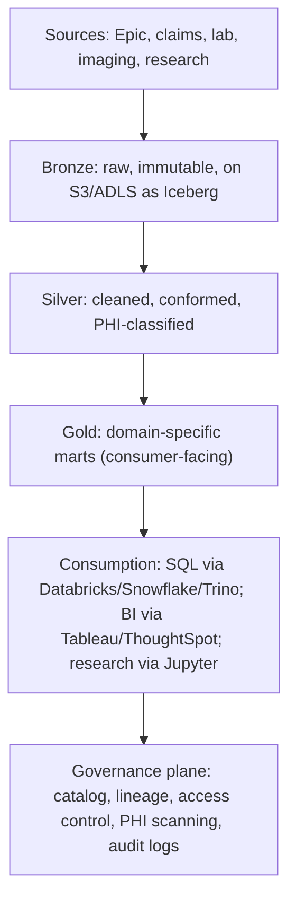
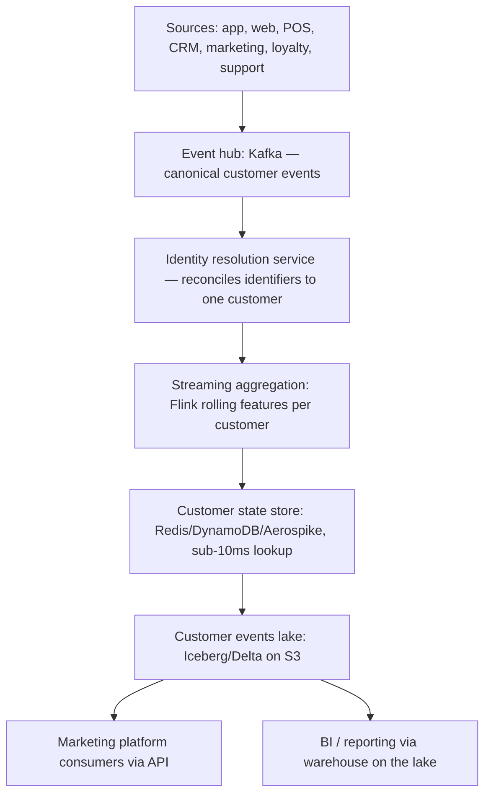

# 08 — Use Cases and Mental Models: How Data Engineers and Data Architects Actually Think — Part 2 of 4: Scenarios 3–5

This is part 2 of 4 of Use Cases and Mental Models. Part 1 introduced how to read these scenarios and worked through the bank quarter-close and marketplace compute-cost cases. Here we cover three more: a healthcare data swamp, a retailer's real-time customer 360, and a pharma company's clinical trial data platform.

## Scenario 3 — The Healthcare System Whose Data Lake Has Become a Data Swamp

### The Situation

A large US healthcare system (academic medical center plus 12 hospitals) has a Hadoop/HDFS data lake built in 2017. Today it has:

- 30+ PB of data
- 6000 tables across 200 schemas
- Documentation that's 4 years stale
- A dozen Python scripts that run nightly, owned by people who left
- 100+ Tableau dashboards, 60% of which haven't been opened in 90 days
- A research team that increasingly bypasses the lake and goes direct to EHR exports
- A compliance team that can't answer "where is patient data X stored"

The CDO says: "We need to know what's there, what's used, what's PHI, what's safe to delete. We have $5M and a year. What do we do?"

### What You're Not Told

- **What's the data quality posture?** A swamp implies bad quality; what's specifically bad?
- **What's the regulatory exposure?** HIPAA breach notification within 60 days. Data over-retention is also a compliance issue.
- **What's the research community's relationship to the lake?** If they bypass it, the lake is failing its core users.
- **What's the budget actually for?** Tooling? Headcount? Consultants? Cleanup labor?
- **What's the migration trajectory?** Hadoop on-prem in 2017 → cloud lakehouse by 2027 is increasingly the path. Is that planned?
- **What's the upstream story?** EHR (Epic likely), claims systems, lab systems, imaging, research data. Each has its own integration.
- **Who owns each schema today?** Often unclear; that's part of the swamp.
- **What's the legal hold posture?** Some data must be retained for active litigation.

### IC Architect's Approach

A staff data architect at the health system takes a triage approach.

**Cataloging precedes cleanup.** You cannot delete what you don't understand. Step 1 is always: build (or buy) a data catalog and populate it.

**The architect proposes a 3-phase plan:**

```
Phase 1 (months 1–3): Inventory.
  - Deploy a catalog (DataHub, Atlan, Alation, or Unity Catalog if migrating to Databricks)
  - Automated profiling: row counts, schemas, last-modified, last-read, owner inference from creator
  - PHI/PII detection: scan column names + sample data for indicators
  - Build a "data product registry": every table either has an owner or is marked orphan
  - Lineage discovery: where did this table come from?

Phase 2 (months 3–9): Triage.
  - Orphan tables that haven't been read in 1 year → archive to cheap storage, kill access
  - Orphan tables that haven't been read in 2 years → delete (after legal hold check)
  - Active tables → assign an owner (a team, not a person)
  - PHI tables → confirm encryption, access control, masking; document for HIPAA audit
  - Build the "blessed" table list: the tables consumers should use, with SLAs

Phase 3 (months 9–12): Architecture.
  - Move blessed tables to lakehouse format (Iceberg, Delta)
  - Connect Databricks or Snowflake on top
  - Sunset the orphan-table area completely
  - Set up ongoing governance: every new table needs an owner, every PHI table flagged
```

**The architecture target:**



**The architect's specific moves:**

1. **Don't migrate everything.** 30 PB at $25/TB-month is $9M/year in cloud storage alone. Tier aggressively. Hot ~10%, warm ~20%, cold/archive the rest.
2. **Embrace lakehouse format.** Iceberg or Delta gives ACID + time travel + schema evolution. Critical for regulated data.
3. **Catalog from day 1.** Without it, you'll repeat the swamp pattern in 5 years.
4. **Owner-or-orphan.** Every table is either owned or scheduled for deletion. No middle ground.
5. **Research community is a stakeholder, not an afterthought.** They're bypassing the lake because the lake doesn't serve them. Solve that with researcher-friendly tooling (Jupyter on Databricks with PHI-aware access controls).
6. **Don't migrate platforms and clean up simultaneously.** Pick one. Recommend: clean up on current platform first, then migrate.

**The architect's deliberate refusals:**

- "We will not migrate before we catalog. Migrating a swamp produces a more expensive swamp."
- "We will not delete anything without owner sign-off or 2-year inactivity proof."
- "We will not commit to 'lake transformation' in 12 months. We commit to: catalog complete by month 3, 50% reduction in orphan tables by month 6, lakehouse migration plan by month 9, first domain migrated by month 12."

### SA Approach (Databricks / Snowflake / Unity Catalog / Healthcare-Specialized)

A Databricks Senior SA with healthcare specialization, or a Snowflake SA, or an Atlan / Collibra SA, walks in with playbooks specific to healthcare data swamp.

**Discovery, healthcare-specific:**

- "What's your EHR? Epic? Cerner?"
- "Do you have a research enclave (NIH-style) or is everything in one environment?"
- "What's your BAA posture with cloud vendors?"
- "What's your HITRUST or SOC 2 certification status?"
- "What's the AMC (academic medical center) research workflow today?"
- "Has the OCR ever investigated you? Any open complaints?"

**The SA's value-add:** They've seen 20+ academic medical centers migrate off Hadoop. They have a playbook:

1. Start with the OMOP common data model. Healthcare data is more standardizable than the customer thinks.
2. Federated identity for researchers (mostly via Shibboleth at AMCs)
3. Tumor registry, clinical trial data, biospecimen data — each has unique handling
4. Epic's Clarity database is the typical source of truth; integrate carefully

**The SA likely brings in:**

- A Healthcare and Life Sciences industry SA
- A research data SA (if AMC)
- A privacy SA for the HIPAA / Common Rule conversations
- Reference customers (Mayo, Cleveland Clinic, Mt. Sinai, University of Pittsburgh, etc., have publicly described migrations)

**The SA's recommended architecture (Databricks-specific):**

- Unity Catalog as the central governance layer
- Delta Lake everywhere
- Mosaic AI for any model deployment
- Lakehouse Federation to query Epic Clarity without copying
- Photon for query performance
- Delta Sharing for sharing with external researchers (NIH, pharma collaborators)

**The SA's specific warnings:**

- "Research data has unique consent constraints. You'll need column-level access control tied to consent records."
- "Imaging data is huge. Plan for DICOM-specific tooling; don't try to put it in a normal lakehouse."
- "Your IRB will require detailed audit. Bake that in from day 1."
- "Don't make the OMOP CDM your only model. Some workflows need raw Epic structures. Plan dual access."

### Where the Two Diverge

Both arrive at similar architecture. The SA brings the cross-customer playbook and the vendor's specific accelerators. The IC architect brings the internal political knowledge — who blocks what, which research lab will revolt, which IT VP must be on the steering committee.

### The Proposed Architecture

As above. Bronze/silver/gold on Iceberg or Delta, governance via catalog, research-friendly access via Databricks notebooks with row-level security tied to consent.

### What They'd Worry About in Month 3

- **The OCR audit during the cleanup.** If the catalog reveals undisclosed PHI, you may have a 60-day breach notification clock.
- **The "we secretly use this" tables.** Tables that haven't been read in 2 years according to logs, but are actually used in a critical workflow nobody documented. The deprecation window catches most; some escape.
- **The research community's resistance.** Researchers used to "give me an Epic extract" workflow won't love the new governance overhead. Carrot: better tools, faster access. Stick: compliance.
- **The cost of the catalog itself.** A 6000-table profile costs real money to maintain. Build the ROI story.
- **The first migration domain.** Picking the wrong first domain (too complex, too political) stalls the program. Pick a contained, valuable, willing-customer domain (clinical trial recruitment, often).

### Interview-Ready Summary

> "Catalog before cleanup. Cleanup before migration. The progression at academic medical centers is: deploy a catalog and profile everything (3 months), triage owner-or-orphan, archive the cold data, classify PHI rigorously (6 months), migrate the blessed-tables to lakehouse format (12+ months). Don't migrate the swamp. The healthcare specifics: OMOP CDM is your common data model target; Epic Clarity is your source of truth; research enclave needs separate governance; consent-aware access control is mandatory; the IRB will want detailed audit. $5M and 1 year covers the catalog + triage + plan, not the full migration. The senior move is to push the CDO on realistic scope."

---

## Scenario 4 — The Retailer Building a Real-Time Customer 360

### The Situation

A national retailer (200 physical stores, $4B revenue, fast-growing e-commerce) wants a real-time customer 360 — a single view of every customer combining browse behavior, app behavior, in-store purchases, returns, loyalty, marketing engagement, customer support interactions. Marketing wants to use this for personalization. The CRM team wants it for service. Analytics wants it for reporting. Each team wants their own thing.

The VP of Data says: "Everyone keeps building their own customer view. We have four. They all disagree. We need one. Real-time, governed, owned by us, consumed by everyone."

### What You're Not Told

- **What "real-time" means.** Sub-second for personalization? Sub-minute for service? Hours for reporting? Each "team" probably means something different.
- **Sources actually integrated.** App, web, in-store POS, CRM, marketing platform, loyalty, returns. How clean is each?
- **Identity resolution maturity.** The hardest problem in customer 360. Do they have unified IDs across channels, or fragmented?
- **Privacy posture.** CCPA, GDPR (if international), the right-to-be-forgotten workflow.
- **The four existing customer views.** Who built them, who consumes them, what data each has. Killing them creates politics.
- **The team and budget.**
- **Marketing's specific use case.** "Personalization" can mean batch email targeting (daily fine), website recommendations (seconds), in-app push (seconds).

### IC Architect's Approach

A staff data architect at the retailer thinks:

**Customer 360 is two problems, not one.**

1. **Identity resolution.** Stitching multiple identifiers (email, phone, loyalty number, cookie, device ID, anonymous session) into one customer entity. This is the hardest, most often-underestimated problem.
2. **Real-time event aggregation.** Streaming events from sources into a single ordered timeline per customer, with derived features (last purchase, lifetime value, channel preferences).

The architect splits the architecture:



**Critical decisions:**

1. **Single source of customer identity.** Build (or buy: Amperity, mParticle, Segment Unify) an identity resolution layer. Without this, every consumer team rebuilds it badly.
2. **Canonical customer event schema.** Standardize what an "event" means across sources. Centralize the schema registry (Confluent Schema Registry, glue schema registry).
3. **Two-tier store.** Online (sub-10ms feature serving for personalization) + offline (full event log for analytics and ML).
4. **Consumer access via APIs, not direct DB.** Each consumer team queries an API; we control schemas, versioning, deprecation.
5. **Per-customer privacy controls.** Right-to-be-forgotten propagates to all tiers. Consent flags govern which events are usable.

**Building vs buying decisions:**

- **Identity resolution:** consider buying (Amperity, mParticle, LiveRamp). Building takes 12 months and never quite gets there.
- **CDP layer (the consumer-facing API):** build, because it's coupled to your specific consumers.
- **Stream processing:** build with Flink or Kafka Streams; managed services like Confluent or AWS MSK + Kinesis Data Analytics are reasonable.
- **Online store:** typically buy (DynamoDB, Aerospike, managed Redis).

**The architect's specific moves:**

- Define the canonical customer event schema first. Get all source teams to commit.
- Identity resolution proof-of-concept on a sample first, before integrating everything.
- Deprecate the four existing customer views deliberately — give each consumer team a migration deadline.
- Kill the politics: the central data team owns the customer entity. Marketing, CRM, analytics consume; they don't build.

**The architect's deliberate refusals:**

- "We will not let teams continue building their own customer views in parallel. The point is one entity."
- "We will not commit to all-sub-second-everywhere. Marketing personalization needs sub-second; reporting can be minutes-late."
- "We will not lift-and-shift the four existing views. We will replace them with one consolidated entity."

### SA Approach (CDP Vendor or Cloud Vendor)

An SA from a Customer Data Platform vendor (Segment/Twilio, Amperity, mParticle, ActionIQ, Tealium) or a cloud vendor (Snowflake with its Native Apps, AWS with its CDP partner ecosystem) thinks:

**This is the canonical CDP conversation.** The vendor SA's playbook starts with:

> "Customer 360 isn't a project; it's a function. Companies that succeed treat it as the platform that everyone consumes. Most fail because each consuming team builds in parallel. Let me show you the patterns we've seen work."

**Discovery:**

- "Walk me through your top 3 use cases for customer 360. Be specific — 'personalization' isn't enough."
- "What's your current identity resolution accuracy? Do you measure it?"
- "What's your retention policy on customer events? What's the right-to-be-forgotten workflow?"
- "Who owns the 'customer entity' definition today? Marketing, IT, data?"
- "Are you Salesforce-heavy? Adobe-heavy? Both? Neither?"

The Salesforce / Adobe question matters a lot — those vendors have their own CDPs (Data Cloud / Real-Time CDP) and the customer's stack alignment shapes the recommendation.

**The SA's typical structure:**

> "Three options here:
> 1. Build everything yourself on cloud primitives — Kafka, Flink, DynamoDB, your warehouse. Most flexible. 12–18 months. Real ops burden.
> 2. Buy a CDP (Segment, Amperity, mParticle) — fastest. Less flexibility. Recurring license cost in the seven figures at your scale.
> 3. Hybrid — buy the identity resolution (the hardest part), build the rest. Often the right answer for retailers of your size.
> Let me walk through each with your top use cases as the test."

**The SA explicitly anchors to use cases:**

- "If 80% of your value is real-time website personalization, option 3 is most efficient."
- "If 80% is batch marketing audience building, option 2 might be the cheapest path."
- "If you have a sophisticated data team and a 3-year horizon, option 1 keeps lock-in low."

**Vendor SAs from CDP companies typically warn:**

- "Don't underestimate identity resolution. It's the moat. Build vs buy here is the highest-stakes decision."
- "Plan for the consent layer from day one. Retrofitting is brutal."
- "Don't let marketing build the customer entity. They'll build it for the channel they're optimizing this quarter."

**The SA brings:**

- Customer reference visits (peer retailers)
- Pre-built use case patterns (email targeting, on-site recs, abandoned cart, customer service surface)
- Identity resolution accuracy benchmarks
- A maturity model framework ("CDP maturity stage 1, 2, 3 — where are you?")

### Where the Two Diverge

The IC architect knows the internal politics (which existing-view team will fight hardest). The SA knows what worked at peer retailers (and which CDP vendors have which strengths). Both end up with the same architecture skeleton; the SA brings the playbook leverage.

### The Proposed Architecture

As above. Kafka event hub, identity resolution layer (likely buy), Flink-based aggregation, two-tier store (online + offline), API consumption.

### What They'd Worry About in Month 3

- **The four existing teams claiming their view is the "real" customer 360.** Politics. Need executive sponsor.
- **Identity resolution accuracy below expectations.** Often 60–70% out of the box; getting to 90% takes work. Marketing will be impatient.
- **GDPR/CCPA right-to-be-forgotten testing.** The first regulator request comes; can you actually delete a customer across all 7 stores, online events lake, online store, marketing platform, etc.? Test now, not when it happens.
- **Schema evolution conflicts.** A source team changes their event schema. Downstream breaks. Schema registry + contracts must be enforced.
- **Cost overrun on the streaming layer.** Flink + Kafka costs are real. Tune partitioning, retention, processing windows.

### Interview-Ready Summary

> "Customer 360 is two problems: identity resolution and event aggregation. Identity resolution is the hardest; consider buying it. Architecturally: Kafka for the event hub, Flink for streaming aggregation, two-tier store (online sub-10ms + offline lake), API-mediated consumption. Build a canonical event schema and enforce it via schema registry. Kill parallel customer views deliberately with deprecation deadlines. The hard parts are politics (one team owns the entity), identity resolution accuracy, and right-to-be-forgotten workflow. 'Real-time' means different things to different consumers; design tiers. Build the consent layer day-one."

---

## Scenario 5 — The Pharma Company Whose Clinical Trial Data Is Locked in Excel

### The Situation

A mid-size pharma company ($8B revenue, multiple Phase 3 trials in progress) has a data engineering problem unusual outside life sciences: most of their clinical trial data lives in Excel files and EDC (Electronic Data Capture) system extracts. They have ~80 active trials, ~5000 sites worldwide, ~300K patients enrolled across all trials. Regulatory submissions require integrating data across sources to a specific format (CDISC SDTM and ADaM). Today this takes 6–9 months per trial after database lock.

The Head of Data Sciences says: "Submission timelines are killing us. We need a platform that compresses this 6–9 month integration phase. The FDA review clock doesn't start until submission. Every month is hundreds of millions of dollars in revenue we lose to delay."

### What You're Not Told

- **What "platform" actually means.** EDC vendor switch? Data warehouse? Statistical computing environment?
- **Vendor landscape.** Medidata Rave (Veeva, Oracle Clinical) for EDC. SAS for statistics. CDISC tooling.
- **What's the team's skill profile?** Pharma data teams are SAS-heavy, often R-friendly, rarely Python-fluent.
- **What's the GxP environment?** GxP-validated systems require formal validation (21 CFR Part 11). Building anything new requires the validation cycle.
- **What's the trial mix?** Phase 1 vs 2 vs 3 have different data volumes and integration requirements.
- **What's the team's experience with cloud?** Pharma is historically slow to cloud; some are catching up fast.
- **What's the M&A picture?** Pharma data integration often complicated by acquired-company systems.
- **What's the integration with the CRO (Contract Research Organization)?** Most large trials use CROs; data flows are complex.

### IC Architect's Approach

A senior data architect at the pharma thinks:

**This isn't a "build a warehouse" problem. It's a "build a clinical data platform" problem.** The constraints are unique:

- GxP validation required for any system touching trial data
- CDISC standards mandatory for submission (SDTM for tabulation, ADaM for analysis)
- 21 CFR Part 11 for electronic records and signatures
- Audit trail must be tamper-evident
- Data lineage must be traceable to source for any submission

A regular lakehouse doesn't satisfy these out of the box. The architecture must.

**The architecture target:**

```
[Sources: EDC (Medidata Rave), labs (LabCorp, Quest), imaging,
 wearables, electronic patient-reported outcomes, CRO files]
       │
       ▼
[Standardized clinical data lake: GxP-validated, immutable,
 audit-trailed (typically built on AWS GovCloud or Azure
 with HITRUST + GxP attestation)]
       │
       ▼
[CDISC standardization pipeline:
   SDTM mapping: source → standardized tabulation
   ADaM derivation: tabulation → analysis-ready datasets]
       │
       ▼
[Statistical computing environment: SAS, R, Python — used by
 biostatisticians to produce TLFs (tables, listings, figures)]
       │
       ▼
[Submission package builder: CDISC-compliant define.xml,
 datasets, code review evidence, generates eCTD-ready output]
       │
       ▼
[Regulatory submission to FDA / EMA]
```

**The architect's key moves:**

1. **Don't try to replace SAS.** Biostatisticians, regulators, and reviewers all use SAS. SAS programs in the submission are the audit trail. Replace SAS at your peril.
2. **The platform's job is to get data SAS-ready faster.** Less time spent in data manipulation in SAS = faster submission.
3. **Automated CDISC mapping where possible.** Tools like Pinnacle 21, Formedix, or in-house mapping libraries automate large chunks of SDTM mapping. Each trial's specifics need human verification.
4. **Cloud lakehouse with GxP overlay.** AWS / Azure with appropriate validation and partner offerings (Veeva, Saama, ZS Associates' tooling).
5. **Per-trial isolated workspace.** Each trial's data isolated. Cross-trial views (for safety signal detection) are separate workflows.
6. **Validation by design.** Every transformation has a validation record. Every code change has change control. The architect builds this into CI/CD from day 1.

**Identity / data quality specifics:**

- Subject ID reconciliation across sources (lab vendor's ID ≠ EDC's ID)
- Visit window alignment (lab drawn Day +3 vs the scheduled Day 0 visit)
- Adverse event coding to MedDRA terms
- Concomitant medication coding to WHO Drug Dictionary

**The architect's deliberate refusals:**

- "We will not abandon SAS for the biostatisticians' work. We will surround it."
- "We will not commit to 'no validation cycle.' GxP is non-negotiable. We will compress the validation cycle by building validatable patterns."
- "We will not centralize all trials into one workspace. Per-trial isolation is required."
- "We will not commit to halving the 6–9 month integration in 12 months. We will commit to compressing it to 3–4 months over 18 months by Phase-3 of the platform build."

### SA Approach (Pharma-Specialized: Veeva, Saama, AWS HCLS, GCP Life Sciences)

A vendor SA in the pharma space — Veeva CDMS / Vault, AWS HCLS, GCP Life Sciences, Databricks Lakehouse for HLS, Saama, ZS Associates — knows this landscape deeply.

**Discovery:**

- "How many active trials and what phases?"
- "EDC vendor? Single or multiple per trial?"
- "How tight is your relationship with your CROs? Are they on the same systems?"
- "What's your CDISC maturity? Have you standardized your mapping?"
- "What's your validation overhead? How long does a new system take to validate?"
- "How is your biostatistics team organized — central or by therapeutic area?"

**The SA's typical framing:**

> "You're describing the canonical clinical data platform problem. The cost of the 6–9 month integration is huge, but it's not eliminable; CDISC compliance has irreducible work. What's been done in your bracket is: cloud lakehouse with GxP validation, automated SDTM mapping for 70–80% of variables, biostatistics still in SAS but on data prepared by the platform. The typical timeline to value: 12 months to first submission using the platform, 24 months to standard operating procedure across trials."

**The SA brings:**

- Validation accelerators (pre-validated cloud configurations; reduces customer's validation labor)
- CDISC mapping libraries
- Reference pharma customers (Pfizer, Roche, Novartis, AstraZeneca have all publicly described variations)
- The compliance and audit story (the customer's regulators are happier with vendor-attested foundations)

**SA-specific cautions:**

- "Don't try to replace SAS in the analytical layer. Trust me. Your biostatisticians and regulators will reject anything else."
- "Plan for the EDC migration separately. EDC is its own multi-year project; this platform sits above it."
- "Wearables / e-PRO data integration is its own beast. Don't tackle it in v1."
- "Your CRO relationships will dictate some platform choices. Some CROs are flexible; some force their own systems."

### Where the Two Diverge

In pharma specifically, the vendor SAs have outsized leverage because the validation overhead favors pre-validated solutions. The IC architect might prefer building; the regulatory environment often forces buying. A good IC architect acknowledges this honestly.

### The Proposed Architecture

As above. Cloud lakehouse with GxP overlay, automated CDISC mapping, SAS preserved in analytics, validation-by-design CI/CD.

### What They'd Worry About in Month 3

- **The validation cycle for the platform itself.** Standing up a GxP-validated cloud lakehouse takes 6–9 months. The customer's QA team will be the bottleneck.
- **The first trial migration's edge cases.** Every trial has quirks. Plan for the first 2 trials to overrun.
- **Biostatistics resistance.** They'll suspect the platform is trying to replace them. Communicate carefully; their workflows preserved.
- **CRO data quality.** CROs deliver data of varying quality. The platform makes the variation visible, which creates uncomfortable conversations.
- **Inspection readiness.** FDA / EMA inspectors will eventually ask about the platform. The audit trail must answer them.

### Interview-Ready Summary

> "Clinical data platforms have unique constraints: GxP validation, CDISC standards, 21 CFR Part 11 audit. The architecture: cloud lakehouse with GxP overlay, automated SDTM mapping for 70–80% of variables, ADaM derivation pipeline, SAS preserved for biostatistics (don't fight that battle), submission package builder. The win isn't eliminating the 6–9 month integration; it's compressing to 3–4 months by automating the rote mapping work. Per-trial isolation. Validation by design with pre-validated cloud foundations. Buy the validated cloud config from a HLS-specialized vendor; build the trial-specific pipelines internally. Realistic timeline: 12 months to first submission using the platform; 24 months to SOP."


---

## You can now

- Apply "catalog before cleanup, cleanup before migration" to a neglected or undocumented data estate, and explain why deleting or migrating before cataloging usually produces a more expensive mess.
- Decompose a "customer 360" ask into its two real sub-problems — identity resolution and real-time event aggregation — and reason about which parts to build versus buy.
- Recognize domain-specific constraints (GxP validation, CDISC standards, PHI/HIPAA, consent-aware access) that override a "just use the modern data stack" default, and adapt the architecture accordingly.
- Identify the deliberate refusals a senior architect makes in each scenario (won't migrate before cataloging, won't centralize all trials, won't replace SAS) and explain the reasoning behind each one.

## Try it

Pick one of Scenarios 3, 4, or 5 and write your own "Where They Diverge" table contrasting how an internal IC architect vs. a vendor SA would approach it — but for a domain you know personally (your company's industry, or one from a past job). What's the equivalent regulatory or organizational constraint that would reshape a generic "modern data stack" recommendation into something domain-specific?
