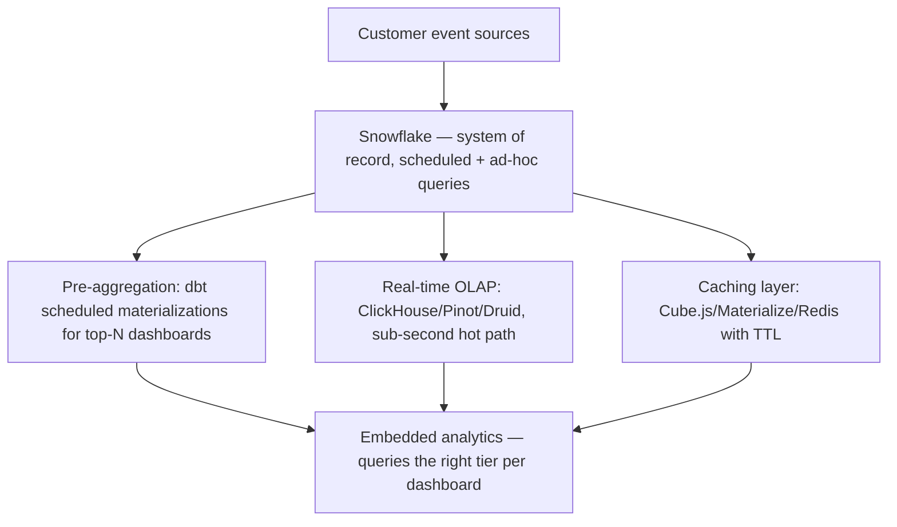

# 08 — Use Cases and Mental Models: How Data Engineers and Data Architects Actually Think — Part 3 of 4: Scenarios 6–8

This is part 3 of 4 of Use Cases and Mental Models. Parts 1–2 covered five scenarios spanning banking, marketplaces, healthcare, retail, and pharma. Here we cover three more: a SaaS company's embedded-analytics cost problem, a logistics company's lagging real-time pipeline, and a bank's Teradata-to-cloud-lakehouse migration decision.

## Scenario 6 — The SaaS Company Whose Embedded Analytics Are Crushing Their Warehouse

### The Situation

A B2B SaaS company ($300M ARR, 8K customers) ships embedded analytics inside their product. Customers can build dashboards over their own data. The current architecture: every customer's data lands in a shared Snowflake account, queries from the embedded analytics layer hit Snowflake directly. The Snowflake bill is $1.4M/month and growing 20% MoM. Performance is degrading; some customers get 30-second dashboard loads. The CTO says: "Customers are complaining about speed and our Snowflake bill is unsustainable. What do we do?"

### What You're Not Told

- **Per-tenant query patterns.** A few power-user tenants might be 80% of the cost.
- **Concurrency model.** Are queries cached? Are queries shared across users in a tenant?
- **Data volume per tenant.** A few large customers might be 90% of the data.
- **The SLA promised.** Sub-second is impossible at the budget; 5–10 seconds is reasonable.
- **The query shape.** Wide aggregations vs. point lookups behave very differently.
- **The materialization strategy.** Are common queries pre-aggregated, or computed on demand?
- **The pricing tier.** Is dashboard performance tied to a customer's paid tier?
- **The plan.** Is there an existing roadmap?

### IC Architect's Approach

A staff data engineer reframes:

**This is a multi-tenant analytics problem, not a Snowflake problem.** Snowflake is doing exactly what you asked it to: running queries you sent it. The cost is the design's fault, not Snowflake's.

**The diagnosis:**

1. **Per-tenant cost attribution.** Build it. Within a week, you know which 50 customers are 80% of the cost.
2. **Query pattern analysis.** Top 100 queries by frequency. Which are repeated? Which scan the most? Which are slow?
3. **Workload classification.** Three buckets:
   - **Hot:** repeated, performance-critical (live dashboards) — needs caching or pre-aggregation
   - **Warm:** occasional, but predictable (scheduled reports) — needs incremental materialization
   - **Cold:** ad-hoc exploration — Snowflake handles natively; rare and tolerable

**The architecture intervention:**



**Key decisions:**

1. **Don't try to make Snowflake do everything.** Snowflake is great at flexibility; not great at sub-second cost-effective.
2. **Hot path on real-time OLAP.** ClickHouse or Pinot is 10–100x cheaper per query for aggregations.
3. **Pre-aggregate aggressively.** The top 20 dashboard queries probably aggregate the same way for 80% of users; compute once, serve many.
4. **Per-tenant resource limits.** Cap each tenant's compute budget; the heaviest tenants don't degrade the rest.
5. **Tier the customer experience.** Premium tier gets the real-time OLAP path; standard tier gets Snowflake-backed with longer cache TTLs.

**The architect's specific moves:**

- Build tenant-level cost dashboards. Surface to product team. Some tenants are losing money for the company; either upcharge or limit.
- Audit dashboard usage. Many dashboards are built and never opened; killing them saves cost with zero customer impact.
- Pre-compute the top 100 cross-tenant patterns nightly.
- Add a real-time OLAP layer (ClickHouse Cloud, Tinybird, ClickPipes) for the hot path.

**The architect's deliberate refusals:**

- "We will not 'optimize Snowflake' as the answer. We will architect a multi-tier stack."
- "We will not promise sub-second on the standard tier forever. We will offer it on premium with documented infrastructure investment."
- "We will not cap heavy customers without product team alignment. Their pricing tier must reflect their resource consumption."

### SA Approach (ClickHouse / Pinot / Materialize / Tinybird / Snowflake Account Team)

An SA from ClickHouse Cloud, Tinybird, Materialize, Apache Pinot vendors (StarTree), or the Snowflake account team themselves walks in.

If from a real-time OLAP vendor:

**Discovery:**

- "Walk me through the top 5 dashboards by query volume. Are they aggregations? Point lookups?"
- "What's the latency you actually need? P95 sub-second? Sub-5-seconds?"
- "How fresh does the data need to be? Real-time, minutely, hourly?"
- "Are queries parameterized per tenant or are tenants sharing query templates?"

**The SA's framing:**

> "Snowflake is great for ad-hoc and complex analytics. It's not the right tool for high-concurrency low-latency dashboards. The pattern at most SaaS-with-embedded-analytics companies is: keep Snowflake as the warehouse; add a hot-path real-time OLAP store. ClickHouse/Pinot/Druid are the three options. Each has trade-offs. Let me walk through where each fits."

**If from Snowflake's account team:**

> "Yes, there are workloads where ClickHouse / Pinot will outperform us. Honest answer. But within Snowflake, you haven't used: Search Optimization Service, materialized views, dynamic tables, Hybrid Tables for low-latency point lookups, Snowflake's caching. Let me show you what those buy you before you commit to a new platform. We may compress your bill 40% without changing platforms."

The Snowflake account team's honest play here is to defend the account by showing the customer hasn't fully exploited Snowflake's features. If they win, the customer stays. If they lose, the customer adds a tier.

### Where the Two Diverge

The IC architect, embedded, has the political weight to push the product team on tiering decisions (charging more for higher-performance customers). The vendor SA can suggest it but can't force it. Both arrive at the same architectural conclusion: multi-tier; don't ask Snowflake to do hot-path concurrent low-latency dashboards.

### The Proposed Architecture

As above. Snowflake as warehouse + scheduled materialization, real-time OLAP for hot-path, caching for repeated queries, per-tenant resource governance, tiered customer experience.

### What They'd Worry About in Month 3

- **Data consistency between Snowflake and ClickHouse.** Eventual; sometimes a customer notices "the dashboard shows different numbers than the warehouse." Plan for it.
- **Operational overhead of two systems.** More moving parts; need clear ownership.
- **The first big migration of a hot dashboard.** Pick wisely; success here sells the rest internally.
- **Pricing tier conversations with marketing.** They won't love being told the new tier exists specifically because of cost. Sequence the comms.
- **Snowflake cost dropping vs growing.** It should drop; if it doesn't, the migration failed.

### Interview-Ready Summary

> "Multi-tenant embedded analytics on a single warehouse is a known anti-pattern at scale. Snowflake is great at flexibility; expensive for high-concurrency sub-second aggregations. The fix: classify workload by hot/warm/cold; keep Snowflake for warm/cold; add a real-time OLAP store (ClickHouse, Pinot, Druid) for hot; aggressively pre-aggregate the top dashboards via dbt; cache repeated queries; per-tenant resource governance; tier customer experience to pricing. Per-tenant cost attribution first — a few customers are often 80% of cost. Real-time OLAP gives 10–100x cost-per-query advantage for aggregation-heavy workloads. The Snowflake bill should drop 40–60% with this architecture."

---

## Scenario 7 — The Logistics Company Whose Real-Time Data Falls Behind

### The Situation

A national logistics company (~300K packages per day) has built a real-time tracking pipeline. Events flow from drivers' devices → Kafka → Flink → a Cassandra database for serving + an Iceberg lake for analytics. At 9am every day, the live tracking starts falling behind real-time, sometimes by 30+ minutes. By 7pm it catches up. Customers see stale tracking data during peak. Engineering has spent 3 months trying to fix it and made it worse.

The VP of Engineering says: "Either we fix this or we kill real-time and go back to 15-minute polling. What do we do?"

### What You're Not Told

- **What "falls behind" means.** Kafka lag? Cassandra write throughput? Flink checkpoint timing?
- **What changed 3 months ago when they started trying to fix it?**
- **What's the partition strategy in Kafka?** Number of partitions, key choice.
- **What's the Flink topology?** Stateless transforms or stateful aggregations?
- **What's Cassandra's write throughput vs. peak event rate?**
- **What's the read pattern?** Customers checking tracking? Internal teams? Both?
- **What's the event spike shape?** Sudden 9am spike or gradual ramp?

### IC Architect's Approach

A staff data engineer treats this as a classic streaming-system performance puzzle. The answer is usually in one of three places:

1. **Skewed partitioning.** A few Kafka partitions are doing all the work.
2. **State growth in Flink.** Stateful operators accumulating state faster than they can process.
3. **Downstream backpressure.** Cassandra (or some sink) can't accept writes fast enough; Flink slows down.

**The diagnostic walk:**

```
1. Check Kafka consumer lag by partition.
   If a few partitions are lagging massively → skewed key distribution.
   Common: partitioning on "depot_id" when one depot handles 30% of packages.

2. Check Flink backpressure metrics in the UI.
   If a specific operator is backpressured → that's the bottleneck.

3. Check Cassandra write throughput vs. event rate.
   If Cassandra is the bottleneck → either scale it or reduce write rate.

4. Check Flink checkpoint duration.
   If checkpoints are slow → state size is too large; consider RocksDB tuning
   or operator re-partitioning.

5. Check Flink slot utilization.
   If some TaskManagers are idle → parallelism doesn't match partition count.
```

**Likely diagnosis at a logistics company:** The 9am spike is the morning sort wave. Drivers all start scanning at 7am local time; with US time zones, the wave moves across the country starting 9am Eastern. The pipeline is designed for steady-state, not for a 5x spike at the same time every day.

**The fix:**

1. **Repartition by event_id or random distribution for stateless operations** to flatten partition skew.
2. **Pre-scale Flink before the morning wave.** Time-of-day-aware autoscaling.
3. **Decouple Cassandra writes from Flink.** Buffer the writes through an intermediate queue if Cassandra is the bottleneck.
4. **Move from Cassandra to a faster-write store for the tracking surface.** ScyllaDB or DynamoDB On-Demand may handle the spike better at similar cost.
5. **Tune RocksDB state backend.** Bloom filters, block cache, write buffer size.
6. **Consider a write batch optimization layer.** Bundle small per-package updates into larger Cassandra writes.

**Why the team made it worse in 3 months:** Without proper diagnosis, they probably tried "throw more parallelism at it." That can make skew worse (more idle workers waiting on one hot worker). The senior move is to instrument and identify the actual bottleneck before adding capacity.

### SA Approach (Confluent / AWS MSK / Flink Vendor / Cassandra Vendor)

A Confluent or AWS MSK SA, or a Cassandra / ScyllaDB / DataStax SA, walks in:

**Discovery:**

- "Walk me through your Kafka topology. Partition counts, key choice, consumer group config."
- "What's your Flink job's parallelism? How does it match Kafka partition count?"
- "What's your state size? How long does a checkpoint take?"
- "What's your Cassandra cluster size? Read/write ratio? P99 write latency?"
- "What did you change 3 months ago?"

**The SA's framing:**

> "Streaming-pipeline-falls-behind-during-spike is a classic shape. The diagnosis is almost always partition skew, state growth, or downstream backpressure. Let's profile each. If you give me 2 hours with your engineers and access to Kafka + Flink metrics, I can usually pinpoint it within an afternoon."

The SA's value is pattern recognition. They've debugged this 50 times.

**The SA's possible upsell:**

If from Confluent: "Confluent's Tableflow / Stream Lineage will give you the visibility you're missing. Let me show you what catches this earlier next time."

If from ScyllaDB: "Cassandra at this write throughput is a known struggle. Scylla's C++ implementation often handles this without the back-pressure pattern."

Honest SAs don't lead with the upsell; they diagnose first, then suggest where their product helps.

### Where the Two Diverge

The IC engineer reads the metrics directly. The SA brings cross-customer patterns. Both should converge on partition skew + insufficient pre-scaling as the likely diagnosis at a logistics company.

### The Proposed Architecture (After Diagnosis and Fix)

```
[Driver devices] ──► [Kafka, 200 partitions, keyed by random event_id]
                            │
                            ▼
                    [Flink, parallelism 200, auto-scales at 7am]
                            │
                            ▼
                    [Batched write layer to Cassandra/Scylla]
                            │
                            ▼
                    [Cassandra (or Scylla) for tracking surface]

Pre-9am-spike autoscaling rule, batched writes to reduce Cassandra contention,
random-partitioning where statefulness doesn't require keyed partition.
```

### What They'd Worry About in Month 3

- **The next spike that doesn't fit the pattern.** A storm, a sale, an unusual day. Add anomaly detection on lag.
- **The cost of pre-scaling.** Idle TaskManagers during off-peak waste money. Tune the scaling schedule carefully.
- **State checkpoint storage growth.** Over time, state can balloon. Implement TTLs on stateful operators.
- **The "we already fixed it" trap.** Symptoms gone doesn't mean root cause addressed. Add lag-by-partition monitoring as a regression detector.

### Interview-Ready Summary

> "Falls-behind-during-spike is one of three causes: partition skew, Flink state growth, downstream backpressure. Diagnose by reading metrics, not by adding capacity. At a logistics company the likely culprit is partition skew (a few depots dominate) combined with insufficient pre-scaling for the morning wave. Fixes: re-partition by random where statefulness allows, time-of-day-aware Flink autoscaling, batched Cassandra writes or move to Scylla/DynamoDB On-Demand, tune RocksDB state. The 3-months-tried-to-fix-it-made-it-worse pattern means they added parallelism without addressing skew. Senior move is instrument first."

---

## Scenario 8 — The Bank Migrating From Teradata to a Cloud Lakehouse

### The Situation

A large bank ($500B assets) has a Teradata appliance running 15 years of analytics. The contract renewal is in 18 months; renewal cost is $80M for 3 years. The bank wants to evaluate cloud alternatives. They have 5000+ tables, 25 ETL tools converging on Teradata, 8 BI tools consuming, ~1500 analysts using SQL daily. They want a recommendation: Snowflake? Databricks? BigQuery? Stay with Teradata? And a migration plan if moving.

The CIO says: "I need this decision in 90 days. The renewal clock matters."

### What You're Not Told

- **Actual usage profile.** SQL-heavy or programmatic? Workload mix?
- **The team's skill profile.** Teradata DBA-heavy or modern data engineering?
- **Regulatory landscape.** Fed examiner attitudes toward cloud for bank data.
- **The internal politics.** Who pushed Teradata in 2010? Are they still around?
- **The previous cloud experiments.** Most banks have tried one or two.
- **The "lift and shift" appetite.** Quick migration vs. modernize-while-migrating.
- **The procurement leverage.** Teradata negotiates aggressively when threatened with cloud migration.
- **What's already in cloud?** Most banks have data lakes already; the question is the analytical layer.

### IC Architect's Approach

A staff data architect at the bank approaches this as a **decision support exercise**, not an architecture exercise. The deliverable is a recommendation memo, not a design doc.

**Phase 1 (weeks 1–4): Diagnostic.**

Workload profiling on Teradata:

- Top 100 queries by frequency
- Top 100 queries by cost (CPU, IO, time)
- Query type distribution (point lookups, aggregations, joins, etc.)
- Concurrency patterns
- Data volume by table
- Update frequency by table
- Dependency graph between tables

This profile is the foundation of the migration analysis. Without it, vendor recommendations are guesses.

**Phase 2 (weeks 4–8): Vendor evaluation.**

Run benchmarks on the top 10 representative queries against:

- Snowflake (with a free trial; load a representative subset)
- Databricks SQL Photon
- BigQuery
- Maybe: ClickHouse Cloud, Trino on Iceberg

Don't trust vendor TCO claims. Run *your* queries on *your* data.

**Phase 3 (weeks 8–12): Recommendation memo.**

The memo answers:

- Which target platform for what proportion of workload
- Total cost of ownership (3 years, including license, infrastructure, migration labor, ongoing ops)
- Migration timeline and approach
- Risk register
- Decision criteria for "go" vs. "renew Teradata"

**The architect's view on the major options:**

- **Snowflake:** likely the strongest fit for SQL-heavy bank workload. Mature, BI-tool-friendly, separation of compute/storage, time travel for audit. Bank-friendly compliance certifications. *Likely choice for most banks.*
- **Databricks:** stronger if there's a major ML / Python ambition alongside. Stronger lakehouse story with Delta. Heavier learning curve for the SQL-only team.
- **BigQuery:** strong technically, but most US banks aren't on GCP, which makes it a harder sell.
- **Stay with Teradata:** if the workload is unusually concentrated, Teradata's renewed pricing might be competitive. They'll fight hard for the renewal.

**The architect's recommendation framework:**

- If 80% SQL analytical workload, modest ML, AWS or Azure shop → Snowflake
- If significant ML / engineering ambition, lakehouse strategy → Databricks
- If already heavily on GCP → BigQuery
- If exceptionally concentrated, predictable workload at scale → Teradata renewal may pencil
- Hybrid (lakehouse + warehouse) → Iceberg + Snowflake or Iceberg + Databricks; both vendors now read Iceberg natively

**Migration strategy (typical):**

```
Phase 1 (months 1–6): Stand up parallel.
  - New platform with full security/compliance posture
  - CI/CD for migrations
  - Identity, network, governance integrations
  - One pilot domain migrated; parallel-run against Teradata

Phase 2 (months 6–18): Domain-by-domain migration.
  - 8–12 domains
  - Per-domain validation: query results match Teradata within tolerance
  - BI tools repointed only after validation
  - Teradata stays on for the long tail

Phase 3 (months 18–30): Tail and decommission.
  - Long-tail migrations (rarely-used tables, obscure queries)
  - Decommission Teradata domains as they migrate
  - Final decommission: month 24–36

Phase 4 (months 30+): Optimization and modernization.
  - Modernize migrated workloads (was Teradata-shaped; now optimized for new platform)
  - Sunset legacy ETL tools
```

**The architect's deliberate refusals:**

- "We will not commit to 'full migration in 18 months.' Bank Teradata migrations average 30–48 months end-to-end. We'll commit to 'majority migrated and Teradata footprint reducing' within 24 months."
- "We will not lift-and-shift everything. Some tables don't need cloud migration; some are dead and should be killed in place."
- "We will not eliminate Teradata before parallel-run on every domain. Validation evidence is the gate."

### SA Approach (Snowflake / Databricks / Teradata Retention Team)

The vendor sales motion here is *intense*. Three SAs likely in the conversation:

- Snowflake SA pushing their FSI capabilities
- Databricks SA pushing the lakehouse + AI story
- Teradata's retention team pushing renewal with new cloud-friendly pricing

The **strong customer-side strategy** is to make all three compete openly. The CIO can use the competition to extract better pricing.

**Each SA's playbook:**

**Snowflake SA:**

- "Largest US banks are on us. JP Morgan, Capital One, US Bank publicly. Let me connect you."
- Reference architectures specific to bank workloads
- Migration accelerator partnerships (Mphasis, LTI, Accenture, Snowflake's PS team)
- Pricing structure: capacity commitments + Snowpark for ML extension
- Honest weakness: GPU-heavy workloads aren't our strength; if your future is heavily ML, evaluate Databricks too

**Databricks SA:**

- "AI is your future, not just analytics. Don't lock yourself into a SQL-only platform."
- Unity Catalog as the governance differentiator
- Delta Lake + Iceberg dual support
- Mosaic AI for the LLM future
- Honest weakness: BI-tool integration and DBA-centric workflows fit Snowflake more naturally

**Teradata retention team:**

- "We've been your trusted partner for 15 years. Our cloud-native VantageCloud now matches the cloud vendors on flexibility, with better price-performance on bank-style workloads."
- "Migration risk is real. Three of your peer banks are 3 years into Snowflake migrations and not done."
- Aggressive renewal pricing (-40% from previous contract is common in this situation)
- Honest weakness: ecosystem momentum is on the cloud vendors

**The IC architect's job is to evaluate each pitch on the actual benchmarks.** The SA's job is to make the strongest honest case for their platform. Both are legitimate; both serve the customer's decision process.

### Where the Two Diverge

This is a high-stakes vendor-evaluation scenario where the SA and IC architect roles are complementary. The IC architect runs the evaluation; the SAs provide the inputs. The customer-side architect must filter SA enthusiasm with their own benchmarking and political calibration.

### The Proposed Architecture (Most Likely Outcome)

Snowflake or Databricks as the analytical platform, with Iceberg as the lakehouse format (so the warehouse choice isn't fully locked in). Phased migration with parallel-run validation. Teradata sunset over 30–36 months.

### What They'd Worry About in Month 3

- **Procurement leverage decaying.** Once you commit to a vendor, your negotiating power drops. Get the commercial terms locked in before public commitment.
- **The Teradata team's morale.** Some are great engineers who can pivot; some can't. Reskilling plan critical.
- **The first migration domain's surprises.** Teradata's specific SQL dialect has quirks. Plan for translation tooling but expect manual review.
- **Hidden dependencies.** A nightly job that nobody documented depends on a Teradata-specific feature. These surface during migration.
- **Concurrent BI tool migrations.** 8 BI tools all pointing at Teradata; each needs reconfiguration. Plan a BI-specific migration track.

### Interview-Ready Summary

> "The Teradata migration question is a decision-support exercise first, an architecture exercise second. Run a workload profile (top 100 queries by frequency and cost), benchmark on the top vendors using your actual queries, write a recommendation memo with TCO over 3 years including migration labor and ongoing ops. Most banks land on Snowflake for SQL-heavy workloads or Databricks if ML ambition is high. Use Iceberg as the lakehouse format to keep the vendor choice partially reversible. Migration timeline is 30–48 months end-to-end, not the 12–18 the renewal clock pressures. Parallel-run validation per domain is the gate. Use the vendor competition to extract better pricing including from Teradata's retention team. The senior move is to push back on unrealistic timelines while preserving the renewal-clock leverage."


---

## You can now

- Diagnose a multi-tenant analytics cost/performance problem by classifying workload into hot/warm/cold tiers rather than treating it as "the warehouse is too slow."
- Debug a streaming pipeline that falls behind under load by checking partition skew, state growth, and downstream backpressure in that order, instead of reflexively adding capacity.
- Run a vendor-neutral platform evaluation (workload profiling, benchmarking on your own queries, a recommendation memo with real TCO) under a hard deadline like a contract renewal clock.
- Explain why "the team made it worse trying to fix it" is usually a sign of undiagnosed root cause, and what instrumentation should have come first.

## Try it

Pick Scenario 6, 7, or 8 and write the one-paragraph interview-ready summary in your own words — then compress it further to two sentences a VP would actually sit through. Notice what you have to cut, and what's non-negotiable to keep (usually: the diagnosis, the phased fix, and the realistic timeline).
