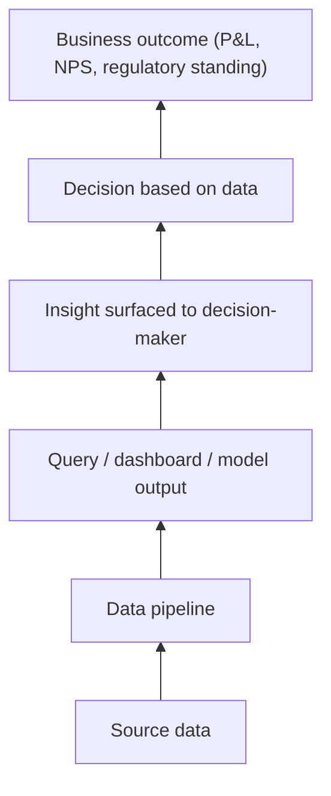

# 08 — Use Cases and Mental Models: How Data Engineers and Data Architects Actually Think — Part 4 of 4: Cross-Cutting Mental Models and Takeaways

This is part 4 of 4 of Use Cases and Mental Models. Parts 1–3 worked through all eight scenarios in full. Here we pull out the mental models that recur across every one of them, and close with what to take away from the section as a whole.

## Cross-Cutting Mental Models

The same patterns recur across all eight scenarios.

### Diagnose Before Architecting

The most common rookie mistake: jumping to architecture before understanding the problem. Every scenario above has a diagnostic phase. Sometimes the answer isn't an architectural change at all — it's a contract restructure, a process fix, a kill-list of jobs, a parallel run validation.

The IC architect's first move is almost always:

> "Before I propose architecture, give me N weeks to understand exactly what's broken."

### Walk the Value Chain Backwards

When data investments don't produce business value, walk backwards:

The break is rarely in the pipeline. It's usually at "insight reaches decision-maker" or "decision-maker acts on insight" or "business outcome captured by the right party."

### Phased Migrations, Always

Banks. Hospitals. Pharmas. Marketplaces. Streaming services. Every scenario benefits from:

- Parallel run before cutover
- Domain-by-domain rather than all-at-once
- Validation criteria specified before migration starts
- Decommission criteria specified before migration starts
- Realistic timelines (1.5–2x your gut estimate)

Big-bang migrations have a 90% failure rate. The senior move is always to push for phasing.

### Honest Trade-off Articulation

Junior: "Snowflake is better."

Senior: "Snowflake is better for *this* customer because of A and B. Databricks would be better in context Z. We're choosing Snowflake knowing it costs us C in scenario D, which we accept because of E."

This second voice is what distinguishes the architect. Practice it deliberately.

### The "Who Pays, Who Benefits" Question

Almost every data system has different parties paying and benefiting:

- The bank's predictive maintenance program (pays manufacturer, benefits customer)
- The retailer's customer 360 (pays IT, benefits marketing)
- The healthcare data lake (pays IT, benefits research, regulatory exposure for IT)
- The pharma clinical platform (pays IT, benefits regulatory affairs, time-to-market is revenue)

If paying and benefiting are misaligned, the program is fragile. The senior fix is sometimes commercial (restructure incentives), not technical.

### The "Should We Build This At All" Question

Strong senior practitioners ask this regularly:

- The bank's GenAI assistant: maybe a vendor solution is right
- The streaming service's personalized trailers: maybe re-edit is right, not generative
- The manufacturer's predictive maintenance: maybe contract restructure, not better models
- The retailer's identity resolution: maybe buy, don't build

The instinct is to build. The senior move is sometimes to recommend not building.

### Slice-Aware Thinking

Aggregate metrics hide subgroup pathology. Always slice:

- Per customer (5% of customers often = 80% of cost)
- Per region (regional variation in everything)
- Per tenant (in multi-tenant systems)
- Per period (peak vs. off-peak)
- Per source (different sources have different quality)

The first place a system fails is almost always a slice. Aggregate looks fine for months while a specific slice is broken.

### Reversibility-Weighted Decision Energy

For any architectural decision:

- If we go this way and we're wrong in year 2, what does it cost to undo?

Spend decision energy proportional to reversibility cost.

- Vendor lock-in (warehouse choice): hard to undo. Spend months.
- Pipeline tool choice (Airflow vs Dagster): easy to undo. Spend days.
- Storage format (raw Parquet vs Iceberg): hard to undo. Spend weeks.

Junior architects spend equal energy on every decision. Senior architects calibrate.

### The "Day 100" Concern

Architecture that looks fine on Day 1 often fails on Day 100. Senior questions:

- When the team that built this leaves, can the next team operate it?
- When data grows 10x, what breaks first?
- When the regulator audits us, what evidence do we produce?
- When the vendor deprecates the feature we use, how do we swap?

Day-100 thinking distinguishes the architect from the engineer.

### Refusal Discipline

Senior practitioners are clear about what they will not commit to:

- Unrealistic timelines
- Performance claims unverified on the customer's workload
- Feature parity with alternatives they don't own
- Cost guarantees for usage patterns they don't understand

The refusal to over-promise is what builds trust over years.

### The Honest Build-vs-Buy Frame

For every capability:

- **Build** if it's core differentiation, no vendor fits, you have team and time
- **Buy** if it's commodity, vendor roadmap matches, team's time better spent on differentiated work
- **Adopt OSS** if you need ownership, have ops capacity, project is healthy
- **Hybrid** is often the answer — buy the core, build the integrations

The default at large enterprises is to over-build. The default at startups is to over-buy. Both are wrong; the senior move is the per-capability evaluation.

---

## What to Take Away

After working through these scenarios, you should be able to:

1. **Identify what's missing from a problem statement.** What questions a senior asks before designing.
2. **Walk the value chain backward** to find where business value leaks.
3. **Choose between several reasonable architectures** with articulated trade-offs.
4. **Default to phased migration, slicing, reversibility, Day-100 thinking.**
5. **Know when to recommend "don't build" or "restructure the contract" instead of "build more architecture."**
6. **Communicate the same answer differently as IC architect vs. SA.**

This is the thinking the F100 senior data engineering / data architect interviews actually test. Tools are commodity; reasoning is durable. The candidates who succeed at this level have done this kind of reasoning hundreds of times across many problems. You build the muscle by working through scenarios like these, debating them with peers, and practicing the discovery conversation aloud.

When you've done this 30+ times, the senior interview becomes routine. Until then, every interview is a fresh shock.

Pick one of these scenarios this week. Write your own version of the architecture, then compare to the proposed approach. Find one thing you missed. Add it to your toolkit. Do another next week.

That's how senior data architects are made. Not by reading; by working scenarios.

---

## You can now

- Name the ten cross-cutting mental models (diagnose before architecting, walk the value chain backwards, phased migrations, honest trade-off articulation, who-pays-who-benefits, should-we-build-this-at-all, slice-aware thinking, reversibility-weighted decision energy, Day-100 thinking, refusal discipline) and recognize each one as it shows up in a new problem.
- Apply "walk the value chain backwards" to locate where a data investment actually loses business value, instead of assuming the break is in the pipeline.
- Practice the senior voice on trade-offs — naming the alternative, the cost being accepted, and the context that makes the choice right for this situation, not universally right.
- Explain why the same architectural conclusion sounds different coming from an IC architect versus an SA, and what each brings that the other can't.

## Try it

Pick any live decision or complaint in front of you right now — at work, on a personal project, anywhere data is involved. Run it through three of the ten cross-cutting mental models from this part: first "diagnose before architecting" (what would you need to know before proposing a fix?), then "who pays, who benefits" (are those the same party here?), then "reversibility-weighted decision energy" (how much process does this decision actually deserve?). Write two or three sentences per model. If a model doesn't apply cleanly, that's useful information too — note why.
