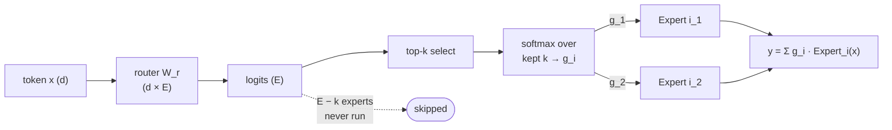

# 04 — Mixture of Experts

Mixture of experts (MoE) is the main way to make a model with more parameters without making
every forward pass proportionally more expensive. It is behind most of the frontier open models
(Mixtral, DeepSeek-V3, Qwen MoE, Grok, and others). The idea is simple, the engineering is not,
and the difference between a good MoE and a broken one is almost entirely in the routing.

## The core idea

In a dense Transformer, every token goes through the same MLP in every layer. In an MoE
Transformer, you replace that single MLP with many MLPs (the "experts") and a small router that,
for each token, picks a few of them to run. A token that activates 2 of 64 experts uses the
parameters of only those 2, so the compute per token stays near a small dense model's while the
total parameter count is that of a much larger one.

Two parameter counts now matter and you must keep them separate:

- **Total parameters:** all experts summed. This determines memory to hold the model and,
  loosely, its knowledge capacity.
- **Active parameters:** the parameters actually used per token. This determines the FLOP cost
  per token, so this is the number that goes into the `2N`/`6N` rules from the resource-accounting
  chapter.

A model advertised as "8x7B" (like Mixtral) has roughly 47B total parameters — not 56B, because
attention and embeddings are shared, only the MLPs are replicated — but activates about 13B per
token (2 of 8 experts plus the shared attention). It costs like a 13B model to run and has
capacity closer to a much larger one. DeepSeek-V3 pushes this further: 671B total, ~37B active.
When someone quotes an MoE's size, ask which number they mean.

## The router, precisely

For each token with hidden state `x` (dimension `d`), the router is a small learned linear layer
`W_r` of shape `d x E`, where `E` is the number of experts. It produces one score per expert,
you keep the top-`k` (usually `k = 1` or `2`), and you softmax over the kept scores to get the
mixing weights:

```
logits   = x @ W_r                      # shape [E]
topk     = indices of the k largest logits
g_i      = softmax(logits[topk])[i]     # gate weight for kept expert i, sums to 1 over the k
y        = sum_i  g_i * Expert_i(x)      # only the k chosen experts run
```



Softmax-then-topk vs topk-then-softmax is a real choice. Normalizing over only the `k` kept
logits (topk-then-softmax, what Mixtral does) keeps the gate weights summing to 1 regardless of
how confident the router was; softmax-over-all-then-keep-topk lets the combined weight shrink
when the router is unsure. Both appear in the literature.

The router is the hard part because it is discrete: `argmax`/top-`k` selection is not
differentiable. You get gradients through the softmax weights `g_i` on the chosen experts, and
the selection itself is trained implicitly — if an expert produces useful output its gate weight
is pushed up, which makes it more likely to be selected next time. This works, but it creates a
self-reinforcing stability problem: an expert that gets picked early gets trained more, gets
better, gets picked more. Left alone, routing **collapses** so a few experts get all the traffic
and the rest are never used and never train.

## Load balancing

Left alone, the router tends to send most tokens to a handful of experts. That wastes the other
experts (dead parameters) and, worse, breaks the systems assumption that work is evenly spread
across devices when experts are sharded across GPUs. If one expert on one GPU gets triple the
tokens, that GPU becomes the bottleneck and the rest idle.

**Auxiliary load-balancing loss.** The standard fix (Switch Transformer / GShard) adds a term to
the training loss that penalizes uneven load. For a batch of `T` tokens and `E` experts, define
per expert `i`:

$$
f_i = \frac{\#\{\text{tokens} \to \text{expert } i\}}{T}\ \text{(hard count)},
\qquad P_i = \frac{1}{T}\sum_{\text{tokens}} p_i\ \text{(soft average)},
\qquad \mathcal{L}_{\text{aux}} = \alpha\, E \sum_{i=1}^{E} f_i\, P_i
$$

The product `f_i * P_i` is minimized when load is uniform (`f_i = P_i = 1/E`), giving
`L_aux = alpha`. The clever part: `f_i` is a non-differentiable count, so the gradient flows only
through the differentiable `P_i` — the loss nudges the router's *probabilities* toward the experts
that are currently *under*-loaded. `alpha` is small (Switch used ~1e-2). Too strong and you force
uniform routing and kill specialization; too weak and you get collapse.

**Router z-loss.** A second auxiliary term seen in ST-MoE penalizes large router logits to keep
the softmax numerically stable and prevent the logits from exploding:
$\mathcal{L}_z = \frac{1}{T}\sum_{\text{tokens}}\big(\text{logsumexp}_e(\text{logits})\big)^2$.

**Expert capacity and token dropping.** In the token-choice formulation you cap how many tokens
each expert accepts per batch — its *capacity*:

$$
\text{capacity} = \text{capacity\_factor}\times \frac{T}{E}
\qquad (\text{capacity\_factor typically } 1.0\text{–}2.0)
$$

Tokens beyond an expert's capacity are **dropped**: they skip the expert layer and pass through
via the residual connection unchanged. The capacity factor buys slack for imbalance at the cost
of wasted compute on padded slots. Higher capacity factor = fewer drops but more memory/FLOPs.
An alternative flips the direction: **expert-choice** routing has each expert pick its top tokens,
which guarantees perfect balance and no drops but lets a token be processed by zero or many
experts.

**Loss-free balancing (DeepSeek-V3).** The newest models drop the auxiliary loss entirely and
instead keep a per-expert **bias** `b_i` that is added to the routing logits *only for the top-k
selection* (not for the gate weights). After each step, `b_i` is nudged down for overloaded
experts and up for underloaded ones. This balances load without an auxiliary-loss gradient that
DeepSeek argues slightly degrades quality.

Getting the balance right is most of the practical difficulty of training an MoE. If your MoE is
underperforming a dense model of the same active size, suspect routing collapse first — check the
per-expert token histogram before anything else.

## Fine-grained and shared experts

Two refinements that recent models (DeepSeek especially) converged on:

- **Fine-grained experts:** instead of a few large experts, split each into several smaller ones
  and route to proportionally more of them (e.g. 256 small experts, top-8, instead of 8 large,
  top-2). Same active parameter count, but far more combinations the router can compose
  (`C(256,8)` vs `C(8,2)`), which empirically improves specialization.
- **Shared experts:** designate one or a few experts that *every* token always uses, in addition
  to the routed ones. The shared expert absorbs the common, always-needed computation, freeing the
  routed experts to specialize instead of each re-learning the basics. DeepSeek-V2/V3 combine both:
  many fine-grained routed experts plus a small number of shared ones.

## FLOP and parameter accounting

The whole point is that FLOPs track *active* parameters, not total. For an MoE layer with `E`
experts, top-`k` routing, and per-expert FFN of the usual `~8d^2` params (SwiGLU, as in the
architecture chapter):

$$
\text{total FFN params} = E\cdot 8d^2,
\qquad \text{active FFN params} = k\cdot 8d^2 \ \text{(per token, only $k$ experts run)}
$$

So switching from dense to an `E`-expert top-`k` MoE multiplies FFN *capacity* by `E` while
multiplying FFN *FLOPs* by only `k`. The router itself costs a negligible `2 * d * E` per token.
This is why an MoE can carry 10x the parameters of a dense model at the same serving cost — and
also why the `6ND` training-compute rule uses `N` = *active* parameters for an MoE.

## The systems reality

An MoE's whole selling point is compute efficiency, but it buys that with memory and
communication. All experts must be stored, so total memory is large even though active FLOPs are
small. When experts are sharded across GPUs (**expert parallelism**, covered in the parallelism
chapter), every token must be sent to whichever GPU holds its chosen expert and the result sent
back — an **all-to-all**
communication pattern, expensive and acutely sensitive to load imbalance (a hot expert stalls the
whole collective). MoE is a bet that you have the memory and interconnect to make the compute
savings worth it. On a single GPU or a memory-constrained device, an MoE's total-parameter
footprint usually makes a dense model the better choice, which is why on-device models are almost
always dense.

## Sparse upcycling

You do not always train an MoE from scratch. **Sparse upcycling** takes a trained dense model,
replicates its MLP into `n` copies to initialize `n` experts, adds a fresh router, and continues
training. This reuses the dense model's learned features and reaches a strong MoE for far less
compute than training one from zero. It is the practical way to get an MoE if you already have a
good dense checkpoint.

## When MoE is and is not the answer

MoE wins when you are throughput- or knowledge-bound on a well-connected multi-GPU system and can
afford the memory: you get more capacity per unit of serving compute. MoE loses when memory is the
constraint (single device, edge), when your interconnect is weak (the all-to-all dominates), or
when your deployment cannot tolerate the routing complexity. For on-device SDK work the takeaway
is that MoE is largely a datacenter technique; the models you quantize and ship to a Mac mini or a
phone are almost always dense for exactly the memory reason above.

## Key takeaways

MoE decouples total parameters from active parameters: you store `E` experts but run only `k` per
token, so FFN capacity grows `E`x while FFN FLOPs grow only `k`x — and the `6ND` rule uses active
`N`. The router picks top-`k` by a learned linear layer and is trained through the softmax gate
weights on the chosen experts, which makes routing prone to self-reinforcing collapse. The
dominant practical problem is load balancing, solved with the `alpha * E * sum(f_i * P_i)`
auxiliary loss, a router z-loss for stability, expert-capacity limits with token dropping, or
DeepSeek's newer loss-free per-expert bias. Fine-grained plus shared experts is the modern recipe.
MoE trades compute for memory and all-to-all communication, making it a datacenter technique and a
poor fit for memory-constrained on-device deployment.

## You can now

- separate total from active parameters for an MoE, and use *active* `N` in the `6ND` compute rule.
- describe top-k routing and explain why the discrete selection makes routing prone to self-reinforcing collapse.
- write the auxiliary load-balancing loss and explain why its gradient flows only through the differentiable `P_i` term.
- compare the load-balancing options — auxiliary loss, router z-loss, expert capacity with token dropping, expert-choice routing, and DeepSeek's loss-free per-expert bias.
- decide when an MoE beats a dense model of the same active size, given memory budget and interconnect bandwidth.

## Try it

Instrument a small MoE layer (say `E = 8`, top-2) on a toy training run and log the per-expert token-count histogram every few hundred steps. Turn the auxiliary load-balancing loss off (`alpha = 0`) and watch routing collapse — a few experts capturing most tokens while others go dead. Then sweep `alpha` upward and find the value that flattens the load enough to keep every expert trained without driving the routing distribution all the way to uniform (which would kill specialization). Plot expert entropy and the aux-loss magnitude against `alpha`.
