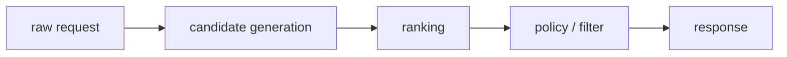
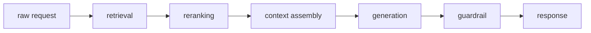

# Module 01 — Foundations & the Interview Framework

## Why this module matters

Every "Design X" interview question — whether X is "YouTube recommendations" or "a customer-support copilot" — is answered with the same skeleton. Interviewers are not testing whether you know the One True Architecture; they are testing whether you can navigate ambiguity, make tradeoffs explicit, and connect modeling decisions to business outcomes. Junior candidates jump straight to the model. Senior candidates spend the first ten minutes on requirements and metrics, and it changes everything downstream.

## 1. Anatomy of a production ML system

Every production ML system, classic or GenAI, decomposes into the same planes:

**Offline plane (hours–days latency):** data ingestion → storage (lakehouse) → labeling → feature/dataset construction → training → offline evaluation → model registry. Failures here cost money slowly.

**Online plane (milliseconds latency):** request → feature retrieval / context construction → model inference → post-processing / business rules → response → logging. Failures here cost money instantly and visibly.

**Feedback loop (the part juniors forget):** online predictions and user interactions are logged, joined back with outcomes (clicks, conversions, thumbs-down, escalations), and become tomorrow's training data and eval sets. A system without a designed feedback loop is a system that cannot improve. In 2026 this is called the **data flywheel** and it is the most defensible moat any ML product has — models are commoditized; proprietary interaction data is not.

**Cross-cutting concerns:** monitoring and drift detection, experimentation (A/B), cost accounting, on-call/rollback story, privacy and compliance.

## 2. The interview framework (use this every time)

A 45-minute "Design X" interview should be budgeted roughly as:

**(a) Requirements & scoping — 5–8 min.** Ask: Who are the users? What is the business objective (revenue, engagement, cost reduction, risk)? Scale (DAU, QPS, items, documents)? Latency budget? Online or batch? What data exists today? Cold start or mature product? Then *state your assumptions out loud* and pick a scope: "I'll focus on the ranking system and treat content ingestion as given."

**(b) Metrics — 3–5 min.** Define both: **offline metrics** (AUC, recall@k, nDCG, exact-match, faithfulness score) used to iterate cheaply, and **online metrics** (CTR, session length, resolution rate, revenue per session) that actually matter, plus **guardrail metrics** (latency, cost per request, complaint rate, policy-violation rate). Explicitly name the gap: offline metrics are proxies and the proxy can be gamed (clickbait maximizes CTR while destroying long-term retention).

**(c) High-level architecture — 8–10 min.** Draw the offline/online planes and the data flow end-to-end *before* discussing any model. Identify where candidates are generated, where they are scored, where results are post-processed.

**(d) Deep dives — 15–20 min.** The interviewer will steer ("how would you train the retrieval model?", "how do you serve this in <100 ms?"). This is where the bulk of this course lives. Lead with the simplest thing that works, then describe what you'd upgrade to and *what evidence would trigger the upgrade*.

**(e) Bottlenecks, failure modes, evolution — 5 min.** Training-serving skew, feedback loops gone wrong (popularity bias, model collapse on own outputs), drift, cost at 10× scale, abuse/adversaries, what you'd monitor, how you'd roll back.

## 3. Core vocabulary of tradeoffs

You should be able to discuss each of these fluently, because every deep-dive resolves into one of them:

- **Latency vs throughput vs cost.** Batch inference is 10–100× cheaper per prediction than real-time; the question is always whether the product tolerates staleness. Precompute what you can (embeddings, candidate lists), compute at request time only what depends on the live request.
- **Freshness vs stability.** Real-time features and continual training react faster to the world but amplify feedback loops and pipeline bugs.
- **Model capability vs operational simplicity.** A managed LLM API beats a self-hosted fleet until token volume, latency requirements, data-residency rules, or unit economics flip it (worked example in the serving chapter).
- **Precision vs recall, tied to asymmetric costs.** Fraud: a false negative costs the chargeback; a false positive costs a customer. State which error is expensive *before* picking a threshold.
- **Training-serving skew.** Any logic implemented twice (once in the training pipeline, once in the server) will eventually diverge. Mitigations: shared feature store with point-in-time semantics, log-and-wait (train on what was actually served), shared preprocessing libraries/containers.

## 4. Back-of-envelope cost math

Interviewers at cost-conscious companies now expect you to produce a $/request estimate within the first deep-dive question. Candidates who hand-wave this — "we'd use the API, cost is probably fine" — fail the practicality axis of the rubric as reliably as candidates who forget metrics. This section gives you a reusable formula sheet and a worked example to drill until it's automatic.

**Anti-pattern to avoid:** stating a model name and moving on. The correct pattern: model name → token counts → $/token → req/day → $/day → compare against self-hosted TCO → state the crossover. Doing this live, with stated assumptions, signals engineering seniority.

### (a) API cost

$$
\text{cost/day} = \left(\frac{\text{input\_tokens}}{\text{req}} \times \text{input\_rate} + \frac{\text{output\_tokens}}{\text{req}} \times \text{output\_rate}\right) \times \text{req/day}
$$

Input and output rates differ by roughly **3–5×** on all major providers (output tokens are generated autoregressively, one at a time; they cost more compute per token). Always decompose. Example: 2 000 input tokens at $1/1M + 500 output tokens at $4/1M × 100k req/day = $(2.0 + 2.0)/day × 100k = $400/day. Forgetting the asymmetry underestimates cost by 2–3×.

### (b) Self-hosted cost per token

$$
\frac{\$}{\text{token}} = \frac{\text{GPU\_cost\_per\_hr}}{\text{throughput\_tok/s} \times 3600 \times \text{utilization}}
$$

Planning numbers: H100 SXM ≈ **$2–4/hr** cloud spot/reserved; vLLM on a 7B model at interactive SLOs ≈ **3 000–8 000 decode tok/s** per GPU (FP8, prefix caching on, well-tuned — measure your own). At $3/hr and 5 000 tok/s, 80% utilization: $3 / (5 000 × 3 600 × 0.8) ≈ **$0.21/1M tokens**. That is 5–20× cheaper than frontier APIs at the same volume — but only holds at sustained high utilization. Idle GPUs destroy the math.

### (c) Cache-hit impact

$$
\text{effective\_cost} = (1 - \text{hit\_rate} \times \text{prefix\_share}) \times \text{base\_cost}
$$

`prefix_share` is the fraction of input tokens that sit in the cached prefix (system prompt, few-shot examples, agent preamble). If your system prompt is 800 of 2 000 input tokens (prefix_share = 0.40) and you hit cache 70% of the time: effective_cost = (1 − 0.70 × 0.40) × base = 0.72 × base — a 28% reduction. Structuring prompts to maximize stable-prefix length (stable preamble first, volatile query last) is an engineering decision with a dollar value you can compute.

### (d) Cascade economics

$$
\text{cost/req} = \sum_i \left(\text{share}_i \times \text{cost}_i\right)
$$

where share_i is the fraction of requests reaching tier i, and cost_i is the all-in cost at that tier. Example: 80% to a fast small model at $0.50/1M, 18% escalated to a mid-tier at $3/1M, 2% to frontier at $15/1M → blended cost ≈ (0.80 × 0.5 + 0.18 × 3 + 0.02 × 15)/1M ≈ $1.24/1M output tokens — versus $15/1M for all-frontier. The confidence threshold that controls `share_1` is the primary economic dial. When you tighten it (escalate more), quality rises and cost rises; loosen it, the reverse. That threshold is a product decision, not just an ML decision.

### (e) Worked example — support assistant, 100k req/day

**Setup:** 2 000 input tokens (conversation history + knowledge-base chunks), 500 output tokens, 100 000 req/day.

**API path (frontier model, gpt-4o-class):**

- Input: 2 000 × $2.50/1M × 100k = $500/day
- Output: 500 × $10/1M × 100k = $500/day
- Total: **$1 000/day ≈ $30k/month**

**Self-hosted path (fine-tuned 7B, single H100 node, 8 GPUs):**

- Throughput needed: 100k req/day × 500 out-tokens = 50M tok/day ÷ 86 400 s ≈ 580 tok/s sustained
- An 8-GPU H100 node, 7B FP8: ~40 000 tok/s peak, sustaining 580 tok/s = ~1.5% utilization — one GPU is idle 98% of the time; **self-hosting loses badly here**
- At 10× traffic (1M req/day, 5 800 tok/s) and 8 nodes running at ~72% utilization: cost ≈ 8 nodes × $30k/month amortized ≈ $240k/month vs $300k/month API → **crossover just happened**, but it requires also paying the ops, infra, and model-quality team

**Crossover insight:** self-hosting wins only when volume is high enough to sustain GPU utilization above ~60% *and* you're willing to absorb the operational overhead. Below that, the API is both cheaper and simpler. The standard 2026 pattern: API for product-market fit and low volume; distill/self-host the high-volume narrow path once you have both traffic and interaction data to improve the model.

### Latency vs cost 2×2

When scoping a design, it helps to place the product in this matrix first — the pattern that follows from each quadrant is different enough to drive the architecture:

| | **Cost-tolerant** | **Cost-sensitive** |
|---|---|---|
| **Latency-sensitive** | Big model + aggressive caching (prefix cache, KV-aware routing, warm replicas); accept the cost, recover via cache | Cascade: fast small model first, escalate on low confidence; edge/on-device for sub-100ms |
| **Latency-tolerant** | Batch offline processing; use largest available model; precompute at off-peak | Batch + cascade; schedule on spot GPUs; amortize cost across high-throughput windows |

Most interview questions land in **cost-sensitive + latency-sensitive** (the bottom-left cell), which is why cascades and caching are the two most-asked-about techniques. State which quadrant the problem lives in before jumping to architecture.

## 5. What changed by 2026 (and what interviewers now expect)

1. **Two question genres.** You will be asked classic predictive system design *and* LLM-system design, sometimes in the same loop. Companies discovered most candidates only prepped one.
2. **Build vs buy is a first-class design axis.** "Fine-tune a small open model vs prompt a frontier API vs distill" is now a standard opening fork; you're expected to reason about it with token economics, latency, and data-flywheel arguments, not vibes.
3. **Evals are the new tests.** For GenAI systems, interviewers probe "how do you know it works?" harder than "what model?". Eval-driven development — golden sets, LLM-as-judge with known biases, regression gates in CI — is assumed.
4. **Agents are a system-design topic, not a demo topic.** Tool design, context budgets, sandboxing, and failure containment appear in interviews at companies shipping agentic products.
5. **Cost math is back.** After the 2023–24 "ship at any cost" era, interviewers ask for $/1M tokens, GPU-hours, and cache-hit-rate reasoning explicitly.

## 6. Multi-region and data residency

Data residency appears in most production LLM system designs and is almost never mentioned by junior candidates. The six surfaces where data crosses a region boundary are: (1) **inference calls** to a hosted API endpoint in a foreign region; (2) **telemetry and traces** shipped to a centralized observability platform; (3) **eval pipelines** that replay production samples through an LLM judge running in a different cloud region; (4) **prompt caches** stored in a shared KV tier that spans regions; (5) **fine-tuning feedback** — interaction logs uploaded to a training cluster; and (6) **observability and error-reporting** vendors that ingest request payloads by default.

The control-plane/data-plane split is the standard mitigation: the **control plane** (orchestration, routing decisions, model registry) can be globally centralized; the **data plane** (the actual token streams and user content) must stay within the designated region. This means per-region inference deployments, per-region trace storage, and explicit configuration of every vendor SDK to disable payload capture outside the boundary.

**Compliance pointer:** the EU AI Act's transparency and conformity-assessment provisions applied to general-purpose AI models fully from **2 August 2026**. For products with EU users, this adds model-card, capability-evaluation, and incident-reporting obligations on top of GDPR data-residency constraints. Region-specific model availability is also a live operational concern: not all model versions are deployed in all regions by cloud providers, which affects your fallback and cascade design.

**One-paragraph checklist for any design involving user PII or regulated data:**

- Confirm inference endpoint is in the required region, or that data is anonymized before crossing
- Disable raw-payload logging in all third-party SDKs (LLM provider, tracing, error tracking) or route through a scrubbing proxy
- Verify your eval pipeline does not ship production samples to a judge model outside the boundary
- Pin fine-tuning data to region-local storage; export only derived weights, never raw training rows
- Document your data-flow map for the compliance team — this is now a launch-blocking artifact at regulated companies

## Going deeper

- The distinction between offline and online planes, and the discipline of designing the feedback loop, are the foundations to internalize first.
- "The model is the small box; infrastructure is everything else" is the thesis of this whole course — most of the engineering effort in a production ML system lives outside the model.
- The set of long-standing engineering rules for ML systems — favor a simple model with good features, watch for training-serving skew, design metrics before models — is dated in tooling but timeless in judgment.
- The workflows-vs-agents distinction is worth previewing now; it is developed fully in the agentic-systems chapter.

## Foundations Box: The anatomy of a production ML system — what breaks between components

The planes in section 1 are the right mental model; this box makes the *joints* concrete, because joints are where failures live.

**The classic recommender request path:**

Candidate generation is a recall problem (ANN retrieval over an embedding index, or rule-based filtering) — it runs in roughly 5–20 ms and must return hundreds of items. Ranking is a precision problem (a scoring model over (user, item) pairs) — it consumes another 20–60 ms of the budget. Policy/filter is deterministic business logic: deduplication, diversification, content moderation, A/B treatment assignment, price eligibility. The joint between candidate gen and ranking is where **embedding freshness** matters: if items were encoded with a 24-hour-old model but the ranker expects the current embedding space, you get silent quality regression with no error signal. The joint between ranking and policy is where **business-logic creep** lives — requirements that started as "just one small filter" accumulate into a 300-line rule set that contradicts the ranker's optimization objective.

**The GenAI request path:**

Retrieval (vector search plus optional BM25 hybrid) costs roughly 5–50 ms. A cross-encoder reranker adds another 20–100 ms but dramatically improves precision. Context assembly is O(1) text manipulation — but it is where **prompt-assembly bugs** live: wrong document order, truncated chunks, or a system-prompt collision that shifts the model's behavior mid-conversation. Generation is where most of the latency and cost sit (TTFT plus decode time). The guardrail is the last synchronous gate and must be fast — a small classifier or regex layer, not a second frontier-model call, or it blows the latency budget. The joint between context assembly and generation is where **context-length economics** play out: adding one more retrieval chunk to improve recall costs proportionally more in decode latency due to attention's quadratic scaling over input length (though linear-attention variants are shifting this — see the serving chapter).

**Where latency accumulates.**

In practice, p99 latency is dominated by: (1) the slowest synchronous I/O call — usually the database or vector-index lookup under cold-cache conditions, (2) the generation step if autoregressive, and (3) the guardrail if implemented naively as a serial LLM call. The standard pattern for staying within a 300–500 ms SLO: parallelize retrieval and metadata lookups; stream generation (tokens to client immediately, no wait for completion); run a lightweight guardrail concurrently with the stream and terminate early if violated.

**Where cost accumulates.**

Generation dominates in token-based billing. But the retrieval infrastructure — vector database, embedding re-encoding, reranker compute — is often 20–40% of total system cost at scale and is systematically underestimated in early designs. Design documents that quote only the LLM API cost are missing a line item. The serving chapter has the full TCO breakdown.

**The feedback loop is the architecture, not the afterthought.**

Every request produces two artifacts: the visible response and the invisible *event record* — what was retrieved, what was scored, what was shown, and then what the user did. That record is the raw material for the next training run, the offline eval set, and the drift monitor. Systems that skip logging the full event record — "we can add logging later" — consistently find that the data needed to debug production regressions doesn't exist. Log it all from day one. The schema can be refined; missing columns cannot be recovered retroactively. The feedback loop is not a feature to add after the model ships; it is the mechanism by which the data flywheel compounds, and designing it is the first architectural decision, not the last.

---

## War Story — Great offline metrics, nothing online

A mid-size e-commerce team spent three months improving their product-ranking model. nDCG@10 went up eight points on their holdout set. The A/B experiment launched — and revenue per session was flat. Click-through on recommended items was slightly down. The model had gotten objectively better at ranking according to the eval set. Nothing moved in the product.

**Symptom.** The A/B showed flat-to-negative product metrics despite a real offline lift. The experiment had run two weeks, well past the novelty-effect window. Power was fine.

**Debugging.** The team first suspected A/B assignment or logging. Both were clean. Then they looked at prediction coverage — was the new model actually serving? It was, for roughly 30% of requests. The other 70% were hitting the policy/filter layer and being overridden: the filter enforced an "in-stock items from suppliers with high seller ratings only" rule that discarded most of the model's top-k before any result reached the user. The model had been trained and evaluated against the full item catalogue, but served against a heavily filtered slice.

**Root cause.** The training and evaluation pipeline had no knowledge of the downstream policy layer. The model was optimized for a candidate distribution that didn't exist in production — not feature skew, but *candidate-set skew*. The offline metric was measuring ranking quality over items the user would never see.

**Fix.** Two changes: (1) the training pipeline applied the same eligibility filter before constructing training examples, so the model learned within the feasible set; (2) the evaluation pipeline applied the filter before computing nDCG, so offline metrics reflected the deployed reality. The same model architecture, retrained on the corrected pipeline, recovered the expected A/B lift on the next experiment.

**Prevention.** Before any model goes to A/B, someone — ideally not the person who built it — should walk the full serving path from raw request to final response and identify every transformation, filter, and override that happens *after* the model scores. Document the delta between what the model was trained on and what it actually controls. This is not a nice-to-have; it is the checklist item that prevents wasted experiment quarters. Raising "does the training distribution match the served distribution, including the downstream policy layer?" unprompted in an interview is a senior signal. Most candidates only think about feature skew; candidate-set and slate-level skew is equally dangerous and less often discussed.

---

## Learning paths, prerequisites, and the capstone

If you haven't worked through the prerequisite self-check in the README yet, do it before going deeper — the chapters assume comfort with training pipelines, evaluation metrics, and basic distributed-systems vocabulary. The README maps two paths (classic ML engineering and GenAI/LLM engineering) and calls out which modules differ between them.

Everything in modules 2–14 feeds a single artifact: the **module 15 cumulative capstone**, which asks you to design a full production system end-to-end, produce a decision document for every key architectural fork, and defend the design as you would in a 60-minute system-design interview. It is worth reading the capstone brief now — knowing what you are accumulating toward changes how you read every chapter. Each module from here is building a vocabulary entry or a component that the capstone will require.

---

## Project 01 — Two design docs

Write two one-page design documents (this trains the muscle the interview actually tests):

1. **Classic:** "Design a system that flags policy-violating product listings on a marketplace with 50M listings, 500k new/day." Cover: requirements, metrics (precision@human-review-budget!), data/labeling, model choice, online vs batch scoring, feedback loop, drift.
2. **GenAI:** "Design a customer-support copilot that drafts replies for human agents at a company with 2M tickets/year." Cover: build-vs-buy fork, retrieval over help-center docs, eval design (draft acceptance rate as the online metric), latency budget, failure containment.

Template for both: Problem → Requirements & assumptions → Metrics (offline/online/guardrail) → Architecture diagram → Key design decisions & alternatives considered → Risks & monitoring. Time-box each to 90 minutes.

## Interview Q&A

**Q1. Interviewer says: "Design a system to detect toxic comments." What are your first five questions?**
**A.** (1) What's the product surface and action — block pre-publish (needs <100 ms, high precision) or flag for human review (can be async, optimize recall@review-budget)? (2) Scale — comments/day and peak QPS? (3) What labeled data exists; what's the labeling budget and policy definition of "toxic"? (4) Languages/modalities in scope? (5) What's the cost of each error type — over-blocking (user trust, appeals volume) vs under-blocking (platform risk)? These questions determine whether the answer is a small distilled classifier at the edge, an async LLM-judge pipeline, or a two-tier cascade (cheap model filters 95%, expensive model reviews the gray zone) — which is the usually-correct answer at scale.

**Q2. What is training-serving skew, and name three concrete mitigations.**
**A.** It's any systematic difference between the data/features the model saw in training and what it sees at serving time. Common causes: feature logic implemented twice (Python/Spark offline vs Java/Go online), time-travel leakage (training features computed with information that wasn't available at prediction time), and distribution shift between the logged training population and live traffic. Mitigations: (1) a feature store with **point-in-time-correct** joins so offline training reads exactly the feature values that were live at event time; (2) **log-and-wait**: log the exact feature vector served with every prediction and train on those logs rather than recomputing; (3) share one preprocessing artifact (same library/container/tokenizer) across training and serving, and add a skew monitor comparing online feature distributions against the training snapshot.

**Q3. When do you choose batch (precomputed) inference over real-time inference?**
**A.** Batch wins when the prediction doesn't depend on the live request context and staleness is tolerable: e.g., daily-refreshed product embeddings, churn scores, "recommended for you" shelves recomputed hourly. It gives ~10–100× lower cost (full GPU utilization, no latency SLO, spot instances) and trivially simple serving (a key-value lookup). Real-time is required when the input only exists at request time (a search query, an uploaded document, a conversation turn) or when freshness drives the metric (fraud, in-session recommendations reacting to the last three clicks). The senior move is the hybrid: precompute candidate embeddings and heavy features offline, and do only the light, context-dependent scoring online.

**Q4. How do you choose metrics for an ML system, and what's the proxy-metric trap?**
**A.** Work backwards from the business objective to a measurable online metric (revenue/session, support-resolution rate), then choose offline metrics that correlate with it well enough to iterate cheaply (AUC, recall@k, judge scores), then add guardrails (latency p99, cost/request, policy-violation rate) that the optimization must not regress. The trap: the offline proxy diverges from the true objective under optimization pressure — CTR rewards clickbait, watch-time rewards autoplay rabbit holes, "judge score" rewards verbose sycophantic answers. Defenses: hold-out human evaluation, multiple competing metrics, periodic correlation audits between offline gains and A/B results, and long-term holdback experiments (a small user slice kept on the old system for months to measure cumulative effects).

**Q5. Frontier LLM API vs self-hosted open model — how do you reason about it?**
**A.** Decision axes: (1) **Capability gap** — does the task actually need frontier quality, or does a fine-tuned 4–8B model match it on *your narrow distribution*? For most extraction/classification/routing tasks it does after fine-tuning. (2) **Unit economics** — compute $/1M tokens both ways; self-hosting wins only at sustained high utilization, because idle GPUs destroy the math. (3) **Latency & deployment surface** — on-device, on-prem, or data-residency requirements force self-hosting. (4) **Data flywheel** — fine-tuning your own model converts proprietary data into a compounding asset; API usage doesn't. (5) **Operational cost** — a serving team, eval infra, and upgrade treadmill are real costs juniors underestimate. The standard 2026 answer: prototype with the API to find product-market fit and collect interaction data, then distill/fine-tune a small model for the high-volume narrow path while keeping the API for the long tail — a **cascade**.

## You can now

- Decompose any production ML system into offline and online planes, locate the feedback loop, and articulate why the data flywheel is a defensible moat that compounds over time.
- Structure a 45-minute system-design interview using the five-phase framework — requirements, metrics, architecture, deep dives, bottlenecks — with the correct time allocation for each phase.
- Produce a $/request cost estimate on the fly, separating API token economics from self-hosted TCO, and identify the traffic crossover point at which self-hosting becomes rational.
- Reason through the build-vs-buy fork using capability gap, unit economics, latency constraints, data-flywheel value, and operational cost as explicit decision axes.
- Identify the failure-prone joints in a classic recommender pipeline and a GenAI request path — embedding freshness, candidate-set skew, prompt-assembly bugs, guardrail latency — and name the standard mitigation for each.
