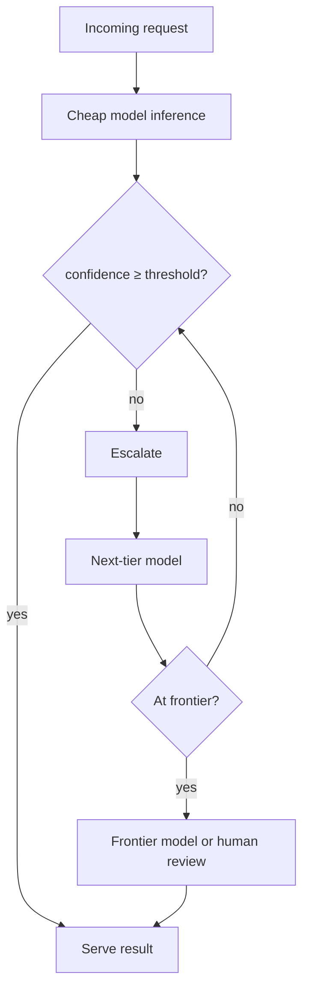

# Module 05 — LLM Serving Systems — Part 1 of 2: Core Engine Ideas, Disaggregation, and Capacity Planning

## Why this module matters

"How would you serve this model to 100k concurrent users?" is now a standard interview deep-dive, and serving is where the 2023→2026 evolution has been most dramatic: from "wrap the model in FastAPI" to a specialized systems discipline with its own papers, engines, and architecture patterns. The good news: it's built from a small number of ideas, all downstream of the prefill/decode asymmetry from the inference chapter.

## 1. The core engine ideas (in the order they arrived)

- **Continuous (in-flight) batching** (Orca, 2022): schedule at the *iteration* level, not the request level — new requests join the running batch the moment any sequence finishes, instead of waiting for the whole batch to drain. This alone gave order-of-magnitude throughput gains over static batching and is table stakes in every engine.
- **PagedAttention** (vLLM, SOSP 2023): manage KV cache like virtual memory — fixed-size blocks allocated on demand with an indirection table — eliminating the fragmentation and worst-case preallocation that wasted most KV memory. More usable KV memory → bigger batches → more throughput.
- **Prefix caching / RadixAttention** (SGLang, 2024): store KV blocks in a radix tree keyed by token prefix; requests sharing a prefix (system prompts, few-shot blocks, multi-turn history, agent loops) skip recomputing it. For agentic workloads, **KV-cache hit rate is now a primary design metric** — prompts are deliberately structured (stable preamble first, volatile content last) to maximize it.
- **Chunked prefill** (Sarathi lineage): split long prefills into chunks interleaved with decode steps, so one giant prompt doesn't stall every other request's token cadence — fixes tail ITL without extra hardware.
- **Structured/constrained decoding:** grammar-constrained generation (xgrammar, Outlines; compressed-FSM tricks) masks invalid tokens each step → guaranteed-valid JSON/schemas at near-zero overhead. Production tool-calling depends on it.
- **Multi-LoRA serving** (S-LoRA/Punica lineage): one base model + hundreds of hot-swapped adapters batched together — the standard way to serve many fine-tuned variants cheaply.

## 2. Prefill/decode disaggregation — the 2026 architecture

Prefill is compute-bound, decode is bandwidth-bound; co-locating them makes them interfere (a long prefill stalls everyone's decode). **Disaggregation** runs separate prefill and decode worker pools, transferring the KV cache between them, so each pool scales and parallelizes independently and tail latencies become controllable. The idea evolved quickly: first a goodput-optimal formulation, then KV-cache-centric architectures built around a distributed KV store; by 2025–26 it went mainstream — the major serving engines (vLLM, SGLang) ship it natively, dedicated orchestration layers (NVIDIA Dynamo, and Kubernetes-native equivalents like llm-d) provide KV-aware routing, KV transfer over RDMA-class paths, and autoscaling above any engine, with large deployments running disaggregated serving in production.

The engineering crux is **KV transfer**: a 70B-class model accumulates ~0.3 MB/token, so a 4k prompt ≈ >1 GB that must move prefill→decode within the latency budget — demanding NVLink/RDMA-class interconnect or smart placement. Related: **KV-cache-aware routing** (route a request to the replica already holding its prefix) and multi-tier KV storage (HBM→DRAM→SSD, LMCache lineage) for long-conversation reuse.

Decision rule worth stating in interviews: chunked prefill + prefix caching solves most workloads on co-located instances; disaggregate when you have long prompts + strict ITL SLOs + scale to justify the infrastructure.

## 3. Engines and the serving stack

- **vLLM** — broadest model/hardware support, the default. **SGLang** — RadixAttention lineage, exceptionally strong on prefix-heavy/structured/agentic workloads and large-scale MoE deployments. **TensorRT-LLM** — peak NVIDIA performance at the cost of compilation rigidity. All three now offer the same headline features (continuous batching, paged KV, quantization, spec decode, prefix caching, disaggregation); differentiation is workload- and ops-fit.
- Above the engine: an **orchestration layer** (Dynamo, llm-d, or a routing proxy like LiteLLM/custom) handling replica routing, autoscaling, failover, and multi-model/multi-tenant policy. **MoE serving** adds wide expert-parallel deployments (many GPUs serving one giant sparse model, all-to-all token routing) — DeepSeek-V3-class models made this a standard pattern.
- **SLO vocabulary:** TTFT p50/p99, ITL/TPOT p99, and **goodput** — throughput counting only requests that met both SLOs. Optimizing raw throughput while violating ITL is the classic rookie chart.

## 4. Serving reasoning models

o1/R1-class models — and their successors — change the serving economics in a way that many interviewers are now probing explicitly. The shift is from **prefill-dominated** to **decode-dominated** workloads: a reasoning model emits a thinking trace before producing its visible answer, and that trace runs 10–100× longer than the final response. A query that costs 500 output tokens on a standard model might cost 5 000–50 000 on a reasoning model, with the thinking trace constituting 90%+ of the output budget. The decode phase, already the bottleneck in standard serving, becomes the dominant cost and latency driver.

**Thinking budgets as an API surface.** Modern reasoning model APIs expose budget controls — `max_completion_tokens`, "reasoning effort" knobs, and in research-style deployments, **"Wait"-token budget forcing** (appending "Wait" to the assistant turn forces the model to continue deliberating before concluding). These parameters are first-class serving knobs: tighter budgets reduce cost and latency but sacrifice answer quality on hard questions. The per-product design question is what budget to set per query class — and that requires understanding the accuracy/cost curve empirically, not guessing.

**Routing reasoning vs fast models by query hardness.** The right architecture is almost never "always use a reasoning model." Instead: a lightweight classifier (or the model's own confidence/perplexity on a short fast pass) estimates query difficulty — math proofs and multi-step logic go to reasoning models; factual recall and simple extraction go to the cheap fast path. This is the cascade pattern (defined below) applied along a reasoning/non-reasoning axis. Calibrating the classifier is the hard part: miscalibration in the "send everything to reasoning" direction destroys unit economics; in the other direction, it degrades quality on the hard queries that most need it.

**The test-time-compute paradox.** More reasoning tokens do not monotonically improve accuracy. On easy queries, extended thinking traces can **degrade accuracy** — the model second-guesses correct initial answers, introduces spurious intermediate steps, or overcomplicates simple lookups. This is the "overthinking" failure mode studied in multiple 2025 papers. Adaptive budget methods (DynaThink, ST-BoN lineage) dynamically allocate reasoning compute per query rather than applying a flat budget — the serving infrastructure must support variable-length decode budgets and per-request early-stopping signals. For interview purposes: stating "I'd route easy queries away from reasoning models and use adaptive budgets on the remainder" is the senior answer; stating "I'd use the reasoning model for everything" signals unfamiliarity with the economics.

**Interview angle:** if the question is "design serving for a math-tutor product," the 2026-standard answer expects you to: (1) distinguish reasoning model queries (multi-step proofs) from non-reasoning queries (formula lookup), (2) route them to separate pools or at least separate budget configurations, (3) name that the decode phase dominates capacity planning, so your GPU count estimate is 10–50× higher than for a comparable non-reasoning workload at the same QPS, and (4) discuss thinking-budget guardrails to prevent tail latencies from blowing out when users submit hard problems.

## 4a. The GenAI gateway pattern

Above the serving engine sits a layer that most mature teams have built and that junior candidates rarely mention: the **GenAI gateway**. The now-standard pattern is a single internal API surface that fronts multiple backends — hosted frontier APIs, cloud-managed models, self-hosted open models, and internal fine-tuned models — with unified interfaces for all consumers inside the company.

What the gateway provides: **failover** (if the primary provider returns a 429 or goes down, the gateway retries against a secondary without the calling service knowing); **rate limiting and quota enforcement** per team or use case; **per-use-case cost tracking** (so the finance team can chargeback model costs to the product teams consuming them — otherwise costs are invisible until the bill arrives); **A/B routing** at the model level (send 5% of traffic to a new model variant); and **policy enforcement** (content filtering, PII scrubbing, audit logging in one place rather than in every calling service).

The gateway is not a serving engine — it does not do batching, KV management, or quantization. It sits above all of that, as an HTTP proxy with routing logic. Think of it as the service mesh of the model layer. In interviews, naming it demonstrates that you've thought about multi-model operations, not just single-model serving. It is also the natural home for the cost tracking and cascade routing discussed below.

## 4b. Cascades and model routing as a named pattern

Cascades appear in the cost math of the foundations chapter, the document-extraction design in the interview playbook, the reranking funnel in the retrieval chapter, and the recommendation pipeline in the classic-ML chapter. They deserve a named, reusable definition.

**The cascade pattern:** route requests through a sequence of models of increasing capability and cost, escalating only when the cheaper model's confidence falls below a threshold. The mechanics:

1. A **fast, cheap model** handles the request and produces a confidence score along with its output.
2. If confidence ≥ threshold → serve the cheap result.
3. If confidence < threshold → escalate to the next tier.
4. Repeat up to a frontier model or human review.

**Confidence calibration is the routing currency.** The cascade works only if the cheap model's confidence scores are *calibrated* — a confidence of 0.8 should mean the model is right ~80% of the time, not 50% or 95%. Uncalibrated confidence turns the cascade into a random splitter. Calibration methods: temperature scaling (a single scalar applied to logits post-training, usually sufficient for classification heads), Platt scaling, or held-out calibration sets with isotonic regression. The calibration check is part of the eval harness, not an afterthought.

**What to set the threshold at:** this is a product/business decision, not purely an ML decision. It encodes: how much quality degradation is acceptable on the cheap path, what the cost ratio between tiers is, and what the acceptable error rate on the escalated tail is. State this explicitly in an interview — it shows you understand that the cascade is a joint engineering-product-finance decision.

**Reuse the pattern across contexts:** document triage, query routing in RAG (cheap dense retrieval → expensive cross-encoder), agent tool selection (local lookup → API call → human), and reasoning-vs-fast model routing are all the same cascade shape. Naming it once and applying it everywhere is the senior move.

## 5. Long-context serving

1M-token context windows are now a product feature, not a research artifact. They introduce a serving problem that doesn't exist at 4k or 32k context, and interviewers at companies building document-processing or agent-loop products are starting to probe it.

**The memory problem.** KV cache at 1M tokens for a 70B-class model is roughly $320\,\text{KB/token} \times 10^6 \approx 320\,\text{GB}$ per user session in FP16 — larger than the model weights themselves and far exceeding the HBM of any single GPU. Even a 7B model at 1M context accumulates ~2–4 GB of KV per user. Multi-user serving with long-context sessions saturates memory before it saturates compute.

**The prefill latency problem.** Prefilling 1M tokens is a compute-bound operation that can take **minutes** on current hardware, even with FlashAttention. A user uploading a 500-page PDF and asking a question cannot wait 2 minutes for the first response token. This drives the need for **chunked prefill** (interleave prefill chunks with ongoing decode, so other users' ITL doesn't spike) and **async prefill** (fill the KV cache in the background before the user asks, if the document is known in advance).

**Mitigations, in order of maturity:**

- **Prefix caching:** if multiple users query the same long document, compute its KV once and share it. Effective when the corpus is shared (code repos, policy documents, knowledge bases); useless when each session has a unique personal context.
- **Chunked prefill:** prevents one long document from blocking all other requests' decode steps — standard in all major engines, should always be on for long-context workloads.
- **Context parallelism / ring attention:** split the long sequence across multiple GPUs, each attending to a ring-passed slice. This is the inference-time equivalent of sequence parallelism in training. Required when the prefill doesn't fit in one GPU's compute budget at interactive latency.
- **Tiered KV storage (HBM → DRAM → SSD):** hot KV blocks live in HBM; cold/idle-session blocks are evicted to DRAM or NVMe and paged back on demand. Several production KV-store implementations offer this multi-tier model. Effective for long-running sessions with idle periods (e.g., a user who opened a 200k-token document but is reading slowly).
- **RAG as the alternative:** the RAG-vs-long-context decision is not primarily about capability — it is a **cost and quality trade**. RAG costs prefill only for the retrieved chunks (hundreds of tokens) rather than the whole corpus. The caveat: "lost in the middle" degradation means long-context answers can be *worse* than targeted retrieval answers when the relevant information is buried in the middle of a million-token context. Longer context ≠ better answers. The synthesis: retrieval narrows to the relevant passages; long context lets you be generous with those passages without having to over-chunk.

**Reference architecture: KV-cache-centric disaggregation.** The most capable long-context serving designs, proven in production systems handling over 100B tokens per day, push disaggregation one step further: **disaggregate not just prefill from decode, but also separate the KV cache into a pooled, multi-tier distributed store** independent of the compute nodes. KV blocks are stored in a cluster-wide pool (HBM + DRAM + SSD tiers), routed by prefix hash, and transferred to whatever compute node needs them via a high-bandwidth interconnect. Requests are routed to nodes that already hold the relevant KV prefix (cache-centric routing). Measured results in these systems range from 59% to nearly 500% capacity gains depending on traffic mix, with the largest gains on workloads with high KV reuse. This is the disaggregated-prefill-decode idea from the earlier disaggregation section, extended to multi-tier storage and pooled KV — the pattern to reach for when doing long-context inference at scale.

**Numbers to have ready:** a 1M-token session costs roughly $1–10 in prefill compute on a frontier API (depending on model size and provider); amortized over a multi-turn conversation, the per-turn cost is dominated by the initial fill. Prefix caching can reduce this to near-zero for the second and subsequent turns if the document hasn't changed — which is why cache-aware session design (stable document prefix, appended conversation) is economically critical, not just a performance trick.

## 6. Capacity planning & cost math (interview gold)

Worked example — "serve a 70B chat model, 10k concurrent users": assume each active user generates a request every ~30 s, 1k-token prompts, 300-token responses → ~330 req/s, ~110k decode tok/s + 330k prefill tok/s. On H100-class hardware with a well-tuned engine, a 4-way-TP 70B replica sustains roughly 1.5–3k decode tok/s within interactive SLOs (order-of-magnitude planning number — measure your own) → ~40–70 replicas of 4×H100 before caching; system-prompt prefix caching might cut prefill cost 50–80%. Then the cost per 1M tokens is:

$$\text{cost/1M tok} = \frac{\text{GPU-\$}/\text{hr} \times N_{\text{GPU}}}{\text{tok/s} \times 3600 / 10^6}$$

Practice producing this chain fluently, stating every assumption.

Cost levers ranked: quantization (FP8 weights+KV ≈ near-free 1.5–2×), prefix caching (workload-dependent, can be huge), batching/goodput tuning, cheaper hardware per phase (disaggregation enables compute-heavy GPUs for prefill, bandwidth-heavy for decode), spec decode for latency-bound low-batch services, and cascades (small model first, escalate hard cases).

The full API-vs-self-host TCO crossover math, per-provider pricing tables, and the build-vs-buy decision model live in the economics chapter (module 11) — the capacity numbers above are inputs to that analysis, not a replacement for it. Container builds, GPU node pools, Kubernetes autoscaling policies, and production monitoring infrastructure for the serving layer are covered in the deployment chapter (module 12).

## You can now

- Explain the four core engine innovations — continuous batching, PagedAttention, prefix caching, and chunked prefill — and trace how each one addresses a specific bottleneck in LLM serving.
- Design a prefill/decode disaggregated serving architecture, state when it is worth the operational complexity, and identify KV-cache transfer as the binding engineering constraint.
- Reason about serving reasoning models: why decode dominates the cost, how thinking-budget knobs trade cost for quality, and why routing by query hardness beats a blanket "always reason" policy.
- Apply the cascade pattern across query routing, retrieval tiers, and reasoning-vs-fast model selection, and name the GenAI gateway's role in multi-model failover, cost tracking, and policy enforcement.
- Produce a first-pass capacity plan and cost-per-1M-tokens estimate for a serving system, naming every assumption and the cost levers — quantization, prefix caching, batching, disaggregation, cascades — that move the number.

## Try it

Pick a product you use that's backed by an LLM (a chat app, code assistant, or AI search feature). Using the capacity-planning method from section 6, work out on paper: (1) an estimate of peak requests/sec from its user base, (2) the resulting prefill vs. decode token throughput, (3) a rough GPU replica count to serve that load, and (4) which single cost lever — quantization, prefix caching, disaggregation, or cascading — would cut its cost the most given its workload shape (short chat vs. long-context vs. agentic). Write down every assumption; the estimate is only as trustworthy as the assumptions behind it.

