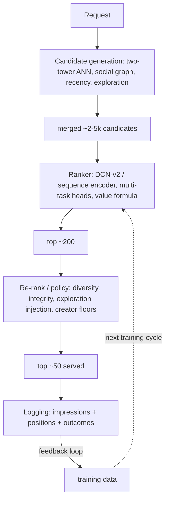
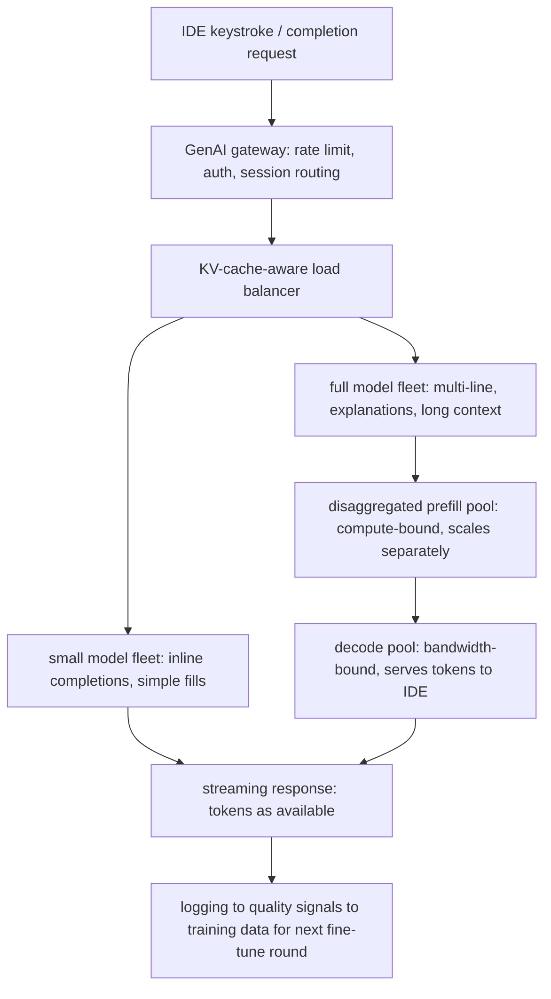
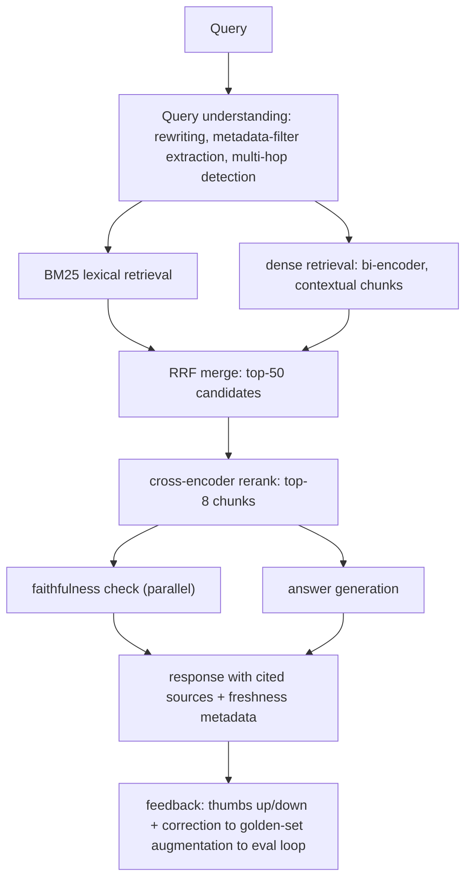

# Module 13 — End-to-End Case Studies — Part 1 of 2: Feed Ranking, Code-Completion Serving, and Production RAG

## Why this module matters

Abstract principles become memorable when you trace one real-shaped system end to end. The multi-stage funnel, disaggregated serving, and RLVR post-training are easier to internalize as a sequence of motivated decisions than as a taxonomy of techniques. These are also the narratives you retell in an interview — not as a recitation, but as a skeleton you reconstruct on demand: what problem forced each architectural change, what you'd measure to know whether the change worked, and what failure mode you'd worry about next.

Each case study here follows the same arc: naive first → concrete pain → targeted fix → current shape. Cross-references point to the relevant chapters by description rather than chapter number; the goal is synthesis, not a recap. Read a case study, then close this document and sketch the architecture from memory. If you can't draw the current-state diagram and name the motivating pain behind each evolution step, read it again.

---

## Case Study 1 — Feed Ranking at Scale: The Multi-Stage Funnel

### The problem

A consumer platform serves a personalized feed over a corpus of hundreds of millions of items. Each request must produce a ranked list of roughly 50 items within a total budget of ~100 ms, for a peak request rate that reaches hundreds of thousands of QPS during primetime. The business metric is long-term retention, proxied by engagement signals — but that proxy will be used against you if you don't design it carefully (more on this below).

### The naive architecture

The first version of this system is always a matrix-factorization or item-based collaborative filter that precomputes a top-N list offline and refreshes it daily. Engineering time is low; quality is reasonable for a small catalog; and it is completely fine to describe this version in an interview as your starting point, because naming what it breaks is half the design credit.

### Problems that emerged

**Scale:** a daily-refresh offline list cannot handle a catalog that grows fast (new items are invisible for up to 24 hours), cannot personalize for new users, and cannot incorporate session context. At millions of users and a billion items, the per-user list precomputation itself becomes untenable at daily granularity — the tail of users with low activity never refreshes.

**Quality:** a single model scoring every candidate cannot run over 10⁸ items per request within any real latency budget. The natural engineering response — shrink the candidate pool first — is correct, but ad-hoc candidate selection (e.g., recency-only) is just moving the quality problem upstream.

**Feedback loops:** training on raw engagement (clicks, watch-time) without explicit debiasing learns popularity and presentation effects, not relevance. The model learns the previous ranker's biases, which compounds over successive retraining cycles. Add a value formula that rewards raw watch-time and you eventually optimize for rabbit holes — a long-term retention loss that appears weeks after the model is deployed and is easy to misattribute.

### The evolution

**Step 1 — decouple retrieval from ranking.** Split the problem into two stages: a cheap retrieval stage that recalls hundreds of candidates in ~10 ms, and an expressive ranker that scores those candidates with full features. This is the foundational move of the multi-stage funnel (introduced in the classic-ML systems chapter). Retrieval can be fast because it uses precomputed item embeddings and ANN search; the ranker can be expensive because it operates on thousands, not billions, of items.

The correct retrieval architecture here is the two-tower model: a user tower over behavior sequences and a item tower over content and statistics, trained with in-batch negatives and logQ correction (bias correction for the popularity skew introduced by in-batch sampling). Item embeddings are precomputed into HNSW; user embedding is computed at request time. The critical constraint — volunteering this in an interview is a senior signal — is that the two towers must not share cross-features (anything that combines user×item at training time), because that would make item embeddings user-specific and break the precomputation that makes ANN lookup possible. Cross-features are deliberately reserved for the ranker.

**Step 2 — multi-source candidate generation.** The two-tower model covers learned similarity, but the full candidate pool needs redundancy: social graph (follows/connections), recency/trending, geo, and exploration sources. Each source is tagged. Resilience and coverage beat elegance; the merger is cheap.

**Step 3 — expressive multi-task ranker.** The ranker now scores the merged ~1–5k candidates on full feature cross-products. Multi-task heads predict multiple engagement signals (complete, like, share, skip, report) combined by a value formula — the value formula encodes product strategy; changing its weights changes behavior more than any model change. DCN-v2 for explicit feature crosses over DLRM-style embedding tables is the mid-scale standard; MMoE or PLE for task conflict at larger scale. Calibrated probabilities matter if any downstream bid or threshold consumes raw scores.

**Step 4 — position and presentation bias correction.** Train with the logged position as an explicit input feature and fix it to a constant at serving time (position-as-feature). Reserve a small randomization-traffic slice to re-estimate propensities as the ranker's outputs evolve. Without this, the model learns the previous ranker's ordering — a silent feedback loop that compounds over training cycles and eventually makes the metric insensitive to model quality.

**Step 5 — re-ranking and policy layer.** Diversity (MMR or determinantal methods over the top-50 list), integrity/safety filters, creator exposure floors, freshness boosts for new items, and exploration injection. These rules are deliberate product decisions, not "cleanup"; the engineering failure is burying them in ad-hoc post-processing rather than making them observable and configurable.

**Step 6 — sequence modeling in the ranker.** Replacing fixed-size aggregates with a SASRec-style sequence encoder over the last N interactions captures temporal dynamics that hand-engineered features miss — recently watched creators, momentum signals, session context. This is a contained upgrade inside the ranker that substantially improves metrics before any structural changes to the funnel.

**Step 7 (frontier)** — generative recommenders in the HSTU lineage reformulate the entire funnel as sequential transduction over interaction streams, replacing the stage-separated DLRMs and exhibiting LLM-like scaling laws. This is the direction the largest platforms have moved at trillion-parameter scale; at mid-scale, the SASRec encoder in the ranker captures a large fraction of the gain without the serving complexity of autoregressive item generation. In an interview, naming this path and stating the adoption calculus (scaling advantage vs serving cost vs organizational rewiring of a revenue-critical stack) is the answer to "how would you push this to the frontier?"

### Current-state architecture

The data flywheel — impressions and interactions logged, joined with delayed outcomes, fed back to the next training cycle — is the system's primary moat, and it is the first thing that fails without careful design (the labeling and feedback-loop sections of the data-engineering chapter cover the machinery).

### Representative numbers

A consumer-scale feed at this funnel shape typically operates at: total serving latency p99 ~80–120 ms end to end, retrieval stage ~5–15 ms, ranking stage ~10–30 ms (highly model- and feature-dependent), re-rank ~2–5 ms. Peak QPS at a large consumer platform is typically in the hundreds of thousands. GPU budget for the two-tower ANN is modest — ANN lookup is CPU-dominated; the ranker itself is the GPU budget driver, at a batch size of thousands of candidates per request. Rule of thumb: each stage roughly an order of magnitude fewer candidates than the one before it; cost scales accordingly.

---

## Case Study 2 — Code-Completion Serving: Low-Latency LLM in Production

### The problem

An IDE-integrated code assistant needs to serve next-token completions (and, increasingly, multi-line fills) with TTFT under ~300 ms at p95 for it to feel non-interruptive — users cancel if the model trails their typing. It must also serve longer "complete this function" and "explain this code" requests on the same fleet. The serving system handles thousands of concurrent developer sessions; prompt lengths span a very wide range (~100 tokens for inline completion to ~4k tokens for context-rich generation).

### The naive architecture

The first version wraps the model in a standard HTTP server, batches incoming requests on a fixed timeout (e.g., group requests every 50 ms), and pads to the longest sequence in the batch. This is static batching. It is quick to ship and adequate at single-digit QPS.

### Problems that emerged

**Padding waste:** shorter sequences in a batch sit idle waiting for the longest to finish. At mixed traffic (short inline completions mixed with long code-explanation requests), GPU utilization collapses — one 4k-token request can force a batch of 50-token completions to wait, tripling their TTFT.

**Memory fragmentation:** naive KV cache management pre-allocates the maximum possible KV memory per request at admission, based on the maximum generation length. Most requests use a fraction of this reservation. On a fleet of large models, peak-of-peak fragmentation means 40–60% of KV memory is unavailable at the moment it's most needed — requests queue rather than batching.

**Throughput ceiling:** the combination of static batching and fragmented KV limits effective batch sizes to low single digits at interactive latencies. At thousands of concurrent users, you need an order-of-magnitude larger batch to amortize the model's parameter reads per forward pass.

**Prefix recomputation:** the IDE sends context on every keystroke. On a monorepo with a fixed project preamble (file tree, style guide, type stubs), the system prompt and document headers are identical across thousands of requests per minute. Recomputing their KV cache on every request wastes roughly 30–50% of GPU time on pure duplication.

### The evolution

**Step 1 — continuous (in-flight) batching.** Schedule at the iteration level: new requests join the running batch the moment any sequence finishes, instead of waiting for the full batch to drain. This change alone — articulated in the LLM serving chapter as the Orca contribution — delivers order-of-magnitude throughput improvements over static batching, because short completions leave the batch immediately and make room for new ones. TTFT variance collapses because requests no longer wait behind slow ones.

**Step 2 — PagedAttention.** Manage the KV cache like virtual memory: fixed-size blocks allocated on demand with an indirection table. Peak fragmentation drops from ~50% to low single digits. Larger effective batches → more throughput → lower cost per token. This is the mechanism behind vLLM's original throughput claims and remains table stakes in every production serving engine.

**Step 3 — prefix caching / RadixAttention.** Build a radix tree over KV blocks keyed by token prefix. The project preamble (system prompt, file tree header, shared context) is reused across thousands of requests. After this change, KV-cache hit rate on stable prefixes is measured as a primary system metric — a drop in hit rate is an early warning of query distribution shift. Structuring prompts so the stable prefix comes first (system context → file header → code context → current cursor position) is an engineering discipline with a measurable dollar value.

**Step 4 — chunked prefill.** A "explain this 4k-context function" request submits a long prefill that, without intervention, would run for multiple hundred-millisecond prefill steps before producing a single decode token — stalling every other request's token generation in the process. Chunked prefill splits the long prefill into smaller chunks interleaved with decode steps across all in-flight sequences. ITL (inter-token latency) for concurrent completions stays bounded; the long-context request completes without evicting other requests.

**Step 5 — prefill/decode disaggregation.** When the fleet serves a substantial fraction of long-context requests alongside latency-sensitive short completions, co-location of prefill and decode workers makes both worse: prefill (compute-bound) and decode (bandwidth-bound) compete for the same hardware. Separate prefill and decode pools, transfer KV tensors between them, and scale each pool independently. The decision rule (from the serving chapter): chunked prefill + prefix caching solves most workloads on co-located instances; disaggregate when strict ITL SLOs at scale make co-location untenable. For a large code-assistant fleet, this threshold is typically crossed somewhere between a few hundred and a few thousand GPU-equivalents.

**Step 6 — KV-cache-aware routing.** Route multi-turn requests to the replica already holding their prefix in the KV cache. Without this, a multi-turn session (e.g., a developer working in the same file for an hour) re-prefills its entire history on every turn. With KV-aware routing, multi-turn prefill approaches zero marginal cost after the first turn. This is now a standard feature in production orchestration layers (the LLM serving chapter covers the llm-d/Dynamo lineage).

**Step 7 — cascade for cost control.** Not every request needs the full model. Short inline completions (next-token suggestions, boilerplate closing brackets) can be served by a distilled small model with near-identical quality for a fraction of the cost. Route based on request type (inline completion vs multi-line generation vs explanation) and, where possible, on a cheap confidence estimate from the small model. The cascade economics from the foundations chapter apply: at order-of-magnitude cost differences between tiers, even imperfect routing yields major cost reductions at scale.

### Current-state architecture

Structured decoding enforces function-signature and import formatting; prefix caching is the dominant cost lever; KV hit rate and ITL p99 are the primary operational metrics. An engine upgrade or quantization change triggers a regression eval on a fixed held-out task set before it touches the production fleet — "it should work" is not a deployment criterion.

### Representative numbers

At this serving shape, a well-tuned fleet running a 7–13B code model in FP8 typically sustains decode throughput of several thousand tokens/second per GPU replica at interactive SLOs. TTFT for short inline completions is typically in the 80–200 ms range with prefix caching on. Multi-line generation requests with long context can hit TTFT in the 300–800 ms range before disaggregation is added; disaggregation typically cuts TTFT p95 for those requests by 30–60% at cost of infrastructure complexity. KV-cache hit rate on a well-structured prompt template with a stable project preamble is typically 60–80% for active development sessions. Cost per completion is typically an order of magnitude lower for the small-model tier than the large-model tier — the cascade exists precisely to exploit this gap.

---

## Case Study 3 — Enterprise Knowledge Assistant: Production RAG

### The problem

A mid-size enterprise deploys an internal assistant that answers employee questions over a corpus of ~10M documents: policy documents, internal wikis, engineering RFCs, legal contracts, and Slack-export archives. The product requires answers to be faithfully grounded in specific internal documents (hallucination is a compliance risk, not just a quality problem) and the corpus updates continuously — documents are created, revised, and deprecated every day. Latency budget is lenient (~5 s acceptable, users are on desktop) but cost matters at thousands of queries per hour.

### The naive architecture

The first version is a weekend prototype: chunk every document at 512 tokens, embed with a general-purpose embedding model, store in an off-the-shelf vector database, retrieve top-5 by cosine similarity, stuff chunks into a prompt, ask the model to answer. This pattern — described in the retrieval chapter as the 2023 baseline — ships fast and impresses stakeholders with demos. It fails ungracefully in production.

### Problems that emerged

**Retrieval failures from orphaned chunks:** a 512-token chunk extracted from the middle of a 40-page policy document contains no information about which policy, which version, or which country it applies to. Retrieved in isolation, it is context-free; the model either hallucinates the missing framing or declines to answer. This failure mode is invisible in demos (demonstrators pick questions where chunks are self-contained) and dominant in production.

**Dense-only retrieval misses exact identifiers:** employees search for contract numbers, product codes, policy IDs, and project names. Dense retrieval over semantic embeddings systematically misses exact identifier matches. The first time an employee searches "renewal terms for contract 2024-A1183" and gets an unrelated contract, trust is broken.

**Freshness lag:** documents updated yesterday appear with stale embeddings because the embedding pipeline runs nightly. An employee asking about an amended policy receives an answer grounded in the superseded version — with no indication of staleness.

**No measurement:** the system has no eval harness. It is literally impossible to know whether a change to the chunking strategy, embedding model, or retrieval parameters improved or degraded quality, because nobody defined a ground truth. Teams iterate on vibes.

**Hallucination at the generation stage:** the model generates fluent-sounding answers that are not grounded in the retrieved context. Without a faithfulness check at serving time, employees act on incorrect information.

### The evolution

**Step 1 — contextual retrieval chunking.** Before embedding each chunk, prepend an LLM-generated header that identifies the parent document, section, date, and version — de-orphaning the chunk. The chunk now carries its own context wherever it lands. This is the contextual retrieval pattern from the retrieval chapter. Quality improvement on ambiguous queries is typically the largest single gain in the stack and costs almost no serving infrastructure — it is a pipeline preprocessing change.

**Step 2 — hybrid retrieval.** Add BM25 lexical retrieval over the same corpus, run dense and lexical retrieval in parallel, and merge with Reciprocal Rank Fusion (RRF). RRF is tuning-free and robust. This eliminates the exact-identifier miss class almost entirely. For an enterprise corpus with high rates of proper nouns and codes, hybrid retrieval is not optional — it is the production baseline.

**Step 3 — reranking.** A cross-encoder over the top-50 hybrid results re-scores (query, chunk) pairs jointly, typically producing the largest single quality jump per engineering-hour. The retrieve-then-rerank shape is the same multi-stage funnel as the recommendation system (the connection is explicit in the retrieval chapter — use it in an interview). The reranker is run only on the small candidate set so latency impact is bounded: a cross-encoder on 50 candidates adds roughly 100–200 ms.

**Step 4 — streaming freshness tier.** The embedding pipeline becomes a streaming consumer of a document-update event bus (Kafka or equivalent). New and modified documents are re-embedded and upserted within minutes of change, while the bulk of stable documents remains on the overnight schedule. A "last-indexed" timestamp is stored with each document and surfaced in the answer when the document age is above a threshold — users can see when the grounding source was last refreshed.

**Step 5 — faithfulness guardrail.** At generation time, an NLI-based or LLM-based checker validates that each claim in the generated response is supported by a retrieved chunk. The check runs in parallel with the response being prepared. Grounding sources are cited in the UI with links; responses that fail the faithfulness check are either withheld with an abstention message or delivered with a visible low-confidence flag. This makes hallucination an observable, measurable event rather than a silent failure.

**Step 6 — eval harness.** Build a golden set of 200–500 (question → gold-evidence-chunks → expected-answer) pairs: half human-authored from real support tickets, half synthetic (LLM generates questions from sampled chunks, then audited by a domain expert). Every retrieval-pipeline change is evaluated against this set — recall@k for the retrieval stage, RAG-triad metrics (faithfulness, answer relevance, context precision) for the generation stage. This set is the infrastructure that makes iteration principled rather than anecdotal (the evaluation chapter covers the harness in detail).

**Step 7 — agentic retrieval for multi-hop questions.** A substantial fraction of enterprise questions are multi-hop: "what policy governs contractor IP assignment for our EMEA region and who needs to approve exceptions?" A single retrieve-then-answer pass cannot answer this reliably. For detected multi-hop intents, route to an agentic search loop: the model searches, reads results, identifies gaps, searches again, and constructs the answer over multiple rounds (the agentic RAG pattern from the retrieval chapter and the agent-loop design from the agentic-systems chapter). Cost and latency are higher; reserve this path for questions that can't be answered by single-hop retrieval.

### Current-state architecture

For multi-hop queries the retrieve-rerank step runs inside an agent loop; the number of loops is bounded by a step budget and a cost cap per query. Context engineering (stable system prompt first for KV-cache reuse, just-in-time chunk injection, compaction when the context window nears its limit) keeps per-query cost bounded.

### Representative numbers

At enterprise scale (hundreds to low thousands of concurrent users), a well-designed stack of this shape typically achieves: recall@5 of 75–90% on the golden eval set (highly corpus-dependent), faithfulness rates of 85–95% after the faithfulness guardrail is active (measured against the NLI checker and spot-checked by humans), and end-to-end latency of 2–5 s for single-hop queries including reranking. Multi-hop agentic queries typically run 5–15 s for 2–4 retrieval loops. Cost per query depends heavily on model choice and cache utilization; with prefix caching on a stable system prompt, a mid-tier serving model, and aggressive reuse of shared prefixes, production costs are typically in the range of a few cents per query at enterprise request rates — but the right comparison is against the cost of an employee failing to find the answer and escalating to a human expert.

---

## You can now

- Narrate the naive → concrete pain → targeted fix → current shape arc for feed ranking, code-completion serving, and production RAG, naming the motivating failure behind each evolution step.
- Explain why the two-tower retrieval model forbids user×item cross-features and reserves them for the ranker, and why the value formula in ranking is a product-strategy decision, not a modeling detail.
- Sequence the LLM-serving upgrades applied to a code-completion fleet — continuous batching → PagedAttention → prefix caching → chunked prefill → prefill/decode disaggregation → KV-aware routing → cascade — and state the exact pain each one solves.
- Diagnose the three dominant production-RAG failure modes (orphaned chunks, dense-only identifier misses, ungrounded generation) and name the fix for each.

## Try it

Pick one of the three case studies above. Set a 20-minute timer and, from memory, sketch its current-state architecture diagram and name the naive architecture it replaced and the pain point behind each evolution step. Then reopen the case study: which steps did you skip or misorder? Those gaps are your study targets — repeat with a different case study from this part before moving on to part 2.

