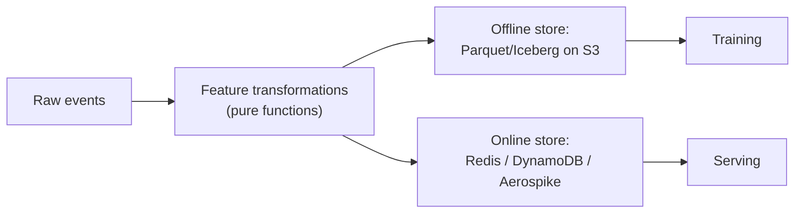
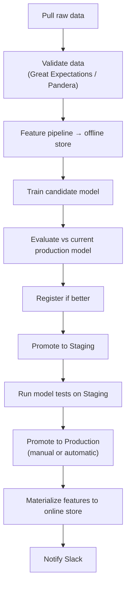

# 02 — Medium Guide: Productionizing the ML Workflow — Part 1 of 2: Feature Pipelines, Feast, Orchestration, Registry, and CI/CD/CT

This is Part 1 of 2 of the 02 — Medium Guide: Productionizing the ML Workflow lesson. Here we cover feature engineering pipelines, the Feast feature store, ML orchestration, the model registry and promotion workflow, and CI/CD/CT for ML.

**Topics:** Feature engineering pipelines and a first feature store, model registry workflow, CI/CD/CT, orchestration (Prefect / Airflow / Dagster for ML), tests for ML, evaluation rigor, monitoring basics (drift, performance), basic ML system design.

**Time:** 4–6 weeks at 8–10 hrs/week.
**Goal:** Stop thinking like a notebook author. Start thinking like a service owner. By the end you can run a model the way a real team runs one: a scheduled training pipeline, an automated promotion process, a monitored production endpoint, and a feedback loop.

## What You'll Be Able to Do After This Tier

- Design a feature pipeline that produces consistent features for training and serving
- Run an automated training pipeline on a schedule with proper retries, alerts, and lineage
- Manage models through a registry with controlled stage promotion (Staging → Production → Archived)
- Build CI/CD/CT pipelines that ship safe model updates
- Test ML code at the levels real teams require: unit, integration, data, model
- Monitor a deployed model for drift and degradation
- Pass an entry-level MLOps system design interview

This tier is where ML engineering diverges sharply from "I wrote a model." Beginners ship one model. Mid-level engineers ship a *process* that ships models.

---

## Week 1 — Feature Engineering as a Pipeline

### Why Features Deserve Their Own Pipeline

In the beginner tier, your features were computed inline with training. That's fine for one model. As soon as you have:

- The same feature used by two models
- A model that needs both batch and real-time features
- A model that has to be retrained when a feature definition changes

…you need feature *pipelines* and eventually a *feature store*. Without one, the most insidious bug in production ML emerges: **training-serving skew** — features computed differently at train time vs serve time, silently degrading the model.

### What Training-Serving Skew Looks Like

A real example you'll see in interviews:

> A feature called `user_avg_purchase_last_30d` is computed in the training pipeline by querying the warehouse: `SELECT AVG(amount) FROM purchases WHERE user_id = ? AND purchase_time BETWEEN now() - 30d AND now()`.
>
> At inference time, the same feature is computed against a Redis cache that's updated nightly. So the serving feature lags by up to 24 hours vs the training feature's "now".
>
> The model trained on a feature that always includes today's data sees a feature at inference that never does. Predictions get systematically worse for users with high recent activity.

The fix: **the same code path produces the feature in both worlds**, or the feature is computed once and stored, and both worlds read from the same store.

### The Feature Pipeline Pattern



The feature definitions are **one set of functions**. Two materializations: offline for training (cheap, batch), online for serving (fast, low-latency).

The transformations must be **idempotent and deterministic** — same input, same output. No `datetime.now()` inside a feature function; pass the as-of time as a parameter.

### Hand-Rolled vs Feast vs Tecton

You have three reasonable paths:

1. **Hand-rolled.** A `src/features/` module with pure functions. Offline materialization writes Parquet to S3; online materialization writes to Redis. Good for one or two projects, bad as the count grows.
2. **Feast.** Open-source feature store, lightweight, declarative feature definitions in Python. The right "second project" tool. We'll use it.
3. **Databricks Feature Store (which absorbed Tecton — acquired Aug 2025) / SageMaker Feature Store.** Managed/heavier. Right for organizations at scale; overkill in a portfolio project. Hopsworks is the remaining independent middle-ground option.

Start with hand-rolled in your first feature pipeline so you understand the primitives, then port to Feast for a second project so you understand the managed pattern.

### A Minimal Hand-Rolled Feature Pipeline

```python
# src/features/transforms.py
import pandas as pd

def user_avg_purchase_last_n_days(
    purchases: pd.DataFrame,
    as_of: pd.Timestamp,
    n_days: int = 30,
) -> pd.DataFrame:
    """Avg purchase amount per user over the n_days ending at as_of (exclusive).

    Pure function. No global state. Always uses as_of, never now().
    """
    cutoff = as_of - pd.Timedelta(days=n_days)
    window = purchases[
        (purchases["purchase_time"] >= cutoff) &
        (purchases["purchase_time"] < as_of)
    ]
    return (
        window.groupby("user_id")["amount"]
        .mean()
        .reset_index()
        .rename(columns={"amount": f"user_avg_purchase_last_{n_days}d"})
    )
```

### Point-in-Time Correctness — The Most Important Concept in MLOps

The training data has timestamps. For every training row at time `t`, the features must reflect *only data that would have been available at time t*.

A naive join would pick the latest feature value for every user. That value might be from after `t` — your model would train on the future. This is **time leakage**, and it produces models that look brilliant in eval and fail in production. It is the #1 production ML bug.

The fix: an **as-of join** (also called a temporal join):

```sql
-- For each training event, find the feature value as of (but not after) the event_time
SELECT
  e.event_id,
  e.user_id,
  e.event_time,
  e.label,
  f.feature_value
FROM training_events e
LEFT JOIN LATERAL (
  SELECT feature_value
  FROM feature_history h
  WHERE h.user_id = e.user_id
    AND h.feature_time <= e.event_time
  ORDER BY h.feature_time DESC
  LIMIT 1
) f ON TRUE
```

In DuckDB, ClickHouse, kdb+, Snowflake, BigQuery — and Feast and other feature stores — this is one of the headline operations.

Internalize this. F50 ML interviews ask about it constantly.

### Where Feature Pipelines Run

For a medium-tier project, run them with an orchestrator (covered later this week). For larger scale, run them on Spark (covered in advanced guide). For *real-time* features (computed as events flow in), use Flink, Kafka Streams, or Beam — also in advanced.

---

## Week 1 — Introducing Feast

### What Feast Provides

- A declarative way to define entities (users, items, etc.), features (named, typed), and feature views (a set of features pulled from a source)
- An **offline store** abstraction (BigQuery, Snowflake, Redshift, files) for training data generation
- An **online store** abstraction (Redis, DynamoDB, Postgres, Bigtable, SQLite for local) for serving
- A **registry** (a tiny metadata store; SQLite locally, Postgres in prod) tracking what's defined
- A **point-in-time-correct training data generator** — Feast's killer feature

### Minimal Feast Project

```python
# feature_repo/example.py
from datetime import timedelta
from feast import Entity, FeatureView, Field, FileSource
from feast.types import Float32, Int64

driver = Entity(name="driver", join_keys=["driver_id"])

driver_stats_source = FileSource(
    path="data/driver_stats.parquet",
    timestamp_field="event_timestamp",
    created_timestamp_column="created",
)

driver_stats_fv = FeatureView(
    name="driver_hourly_stats",
    entities=[driver],
    ttl=timedelta(days=1),
    schema=[
        Field(name="conv_rate", dtype=Float32),
        Field(name="acc_rate", dtype=Float32),
        Field(name="avg_daily_trips", dtype=Int64),
    ],
    source=driver_stats_source,
)
```

```bash
cd feature_repo
feast apply           # registers the definitions
feast materialize-incremental $(date -u +%Y-%m-%dT%H:%M:%S)
# materializes from offline store to online store up to the given timestamp
```

### Training Data Generation

```python
from feast import FeatureStore
import pandas as pd

store = FeatureStore(repo_path="feature_repo")

entity_df = pd.DataFrame({
    "driver_id": [1001, 1002, 1003],
    "event_timestamp": pd.to_datetime(["2026-04-01", "2026-04-02", "2026-04-03"]),
})

training_df = store.get_historical_features(
    entity_df=entity_df,
    features=[
        "driver_hourly_stats:conv_rate",
        "driver_hourly_stats:acc_rate",
        "driver_hourly_stats:avg_daily_trips",
    ],
).to_df()
```

Feast does the temporal as-of join for you. Each row in `training_df` has the features as of its `event_timestamp`. No leakage.

### Online Serving

```python
features = store.get_online_features(
    features=[
        "driver_hourly_stats:conv_rate",
        "driver_hourly_stats:acc_rate",
        "driver_hourly_stats:avg_daily_trips",
    ],
    entity_rows=[{"driver_id": 1001}],
).to_dict()
```

This reads from the online store (Redis in production). Sub-10ms typically.

### What Feast Doesn't Do

- It doesn't *compute* features at scale. That's your job (Spark, Flink, dbt, SQL warehouse).
- It doesn't do streaming feature engineering by itself — though it can sink from a stream source.
- It doesn't enforce anything across the org by itself. If team A and team B define `user_lifetime_value` differently, Feast doesn't know.

It's a coordination layer, not a compute layer. Internalize that and you'll use it correctly.

### Exercises

1. Set up the Feast quickstart locally with SQLite + local Parquet files.
2. Define 2 entities and 3 feature views for your tier-1 project.
3. Generate training data with point-in-time correctness. Verify (with code!) that no feature has a `feature_time > event_time`.
4. Materialize to the online store. Read features back. Compare to the same query against the offline store at the same timestamp — they should match exactly.

---

## Week 2 — Orchestration for ML (Prefect / Airflow / Dagster)

### The Three Options

| Tool | Strength | When to Use |
|---|---|---|
| **Prefect** | Pythonic, hybrid (local + cloud control plane), modern UX | Fast prototyping; small/medium projects where you want to move quickly |
| **Dagster** | Software-Defined Assets (data + ML as first-class), strong typing, asset lineage, Components GA Oct 2025 | Greenfield asset-centric ML pipelines — the modern default for new builds |
| **Airflow** | Mature, ubiquitous at F50, huge community, KubernetesExecutor for isolation | Brownfield F50 standard; what you'll inherit at most large enterprises |

The 2026 split: **Prefect** for fast prototyping and smaller orgs; **Dagster** for greenfield asset-centric ML pipelines (Dagster Components went GA in Oct 2025, making it significantly more composable); **Airflow** as the brownfield F50 standard that dominates existing enterprise platforms. Learn two of the three. The strongest portfolio shows Dagster for a fresh build and Airflow for "I can work in the existing thing." Prefect is a fast first step when you want to ship before you architect.

### What an ML Pipeline Actually Looks Like



Every step is a task. Failures retry. Successes trigger downstream. The orchestrator is the brain.

### A Prefect Flow

```python
# pipelines/train.py
from datetime import datetime, timezone
import mlflow
import pandas as pd
from prefect import flow, task
from prefect.artifacts import create_markdown_artifact

@task(retries=3, retry_delay_seconds=30)
def pull_data(as_of: datetime) -> pd.DataFrame:
    # ...query the warehouse...
    return df

@task
def validate(df: pd.DataFrame) -> pd.DataFrame:
    assert len(df) > 1000, "training data suspiciously small"
    assert df["target"].notna().all(), "null targets"
    return df

@task
def train(df: pd.DataFrame, params: dict) -> str:
    with mlflow.start_run() as run:
        # ...train, log params, log metrics, log model...
        return run.info.run_id

@task
def evaluate_against_prod(run_id: str) -> dict:
    # compare candidate metrics to the current Production model's metrics
    # return {"candidate_auc": ..., "prod_auc": ..., "should_promote": True}
    ...

@task
def promote_candidate(run_id: str, model_name: str) -> None:
    """Register the new run as a model version and tag it `@challenger`.

    MLflow stages (`Staging`/`Production`) were deprecated in 2.9 in favor
    of aliases — see Week 2-3 below for the alias-based promotion flow.
    """
    client = mlflow.MlflowClient()
    mv = client.create_model_version(
        name=model_name,
        source=f"runs:/{run_id}/model",
        run_id=run_id,
    )
    client.set_registered_model_alias(
        name=model_name, alias="challenger", version=mv.version
    )

@flow(name="daily_training")
def daily_training(as_of: datetime | None = None):
    as_of = as_of or datetime.now(timezone.utc)
    df = pull_data(as_of)
    df = validate(df)
    run_id = train(df, params={"n_estimators": 200, "learning_rate": 0.05})
    decision = evaluate_against_prod(run_id)
    if decision["should_promote"]:
        promote_candidate(run_id, model_name="income_classifier")
    create_markdown_artifact(
        markdown=f"## Training Report\n- Run: {run_id}\n- Decision: {decision}\n",
        key="training-report",
    )

if __name__ == "__main__":
    daily_training.serve(name="daily-training", cron="0 6 * * *")
```

`datetime.utcnow()` was deprecated in Python 3.12. Use `datetime.now(timezone.utc)`.

`prefect server start` — UI at localhost:4200. Click into a run, see the DAG, drill into task logs.

### The Equivalent in Airflow

```python
# dags/training.py
from datetime import datetime, timedelta
from airflow.decorators import dag, task
import mlflow

default_args = {
    "owner": "ml-platform",
    "retries": 2,
    "retry_delay": timedelta(minutes=5),
}

@dag(
    dag_id="daily_training",
    start_date=datetime(2026, 1, 1),
    schedule="@daily",
    catchup=False,
    default_args=default_args,
    tags=["ml", "training"],
)
def training_dag():
    @task
    def pull_data() -> str:
        # ...returns a path or URI; never large objects via XCom...
        return "s3://my-bucket/processed/train.parquet"

    @task
    def validate(path: str) -> str:
        ...
        return path

    @task
    def train(path: str) -> str:
        # ...mlflow run...
        return "run_id_here"

    @task
    def promote(run_id: str) -> None:
        ...

    promote(train(validate(pull_data())))

training_dag()
```

Run with `astro dev start` (Astronomer's distribution) or a vanilla Airflow Compose stack. The TaskFlow API (`@dag` / `@task` decorators) is the modern style — much cleaner than classic operators.

### Anti-Patterns to Avoid

1. **Passing large objects via XComs.** Pass paths/URIs. The actual data lives in S3.
2. **DAG files that do work at parse time.** API calls inside DAG body → burns money, slows the scheduler.
3. **Long-running tasks without retries.** Always set retries (with backoff). Always.
4. **Sensors in poke mode.** Use `mode="reschedule"` to free worker slots while waiting.
5. **Backfills that aren't idempotent.** Every task should be re-runnable for any date without producing duplicates.

### Exercises

1. Port your tier-1 training script into a Prefect flow with at least 5 tasks. Run on a daily schedule.
2. Write the same flow as an Airflow DAG using TaskFlow API. Run it in Astronomer (free locally).
3. Inject a deliberate failure (bad data on Thursday). Confirm retries trigger; on third failure, confirm an alert fires (Slack webhook, email, whatever you can wire up).
4. Trigger a backfill for the last 7 days. Confirm all 7 succeed idempotently.

---

## Week 2–3 — The Model Registry and Promotion Workflow

### What the Registry Is For

A model registry is the source of truth for "which model is in which environment." Three reasons it matters:

1. **Audit:** Six months later, "what model was in prod on April 15th?" must have an answer.
2. **Rollback:** Promoting a bad model must be reversible in one command.
3. **Decoupling:** The serving code doesn't pin a specific version — it pulls "current Production."

### Aliases (the Modern MLflow Convention)

MLflow deprecated named stages (`Staging` / `Production`) in 2.9 in favor of **aliases**. Aliases are flexible — you can have `@champion`, `@challenger`, `@canary`, `@shadow` all pointing at different versions simultaneously. Stages are a single dimension; aliases are arbitrary.

Conventions worth standardizing across a team:

- **`@champion`** — currently serves real traffic
- **`@challenger`** — passed initial tests, eligible for canary / shadow
- **`@archived`** — retired (or just drop the alias)

Promotion is one API call (or one UI click). Rollback is the same call pointing at an earlier version.

### A Promotion Script (Alias-Based)

```python
# scripts/promote.py
import mlflow
import typer

app = typer.Typer()

@app.command()
def promote(model_name: str, version: int, alias: str = "champion"):
    """Move `alias` (default: `champion`) to point at `version`.

    Tracks the prior alias target so `rollback` can restore it.
    """
    client = mlflow.MlflowClient()
    try:
        prior = client.get_model_version_by_alias(model_name, alias)
        client.set_registered_model_alias(model_name, "previous_champion", prior.version)
    except mlflow.exceptions.RestException:
        pass  # no prior champion yet (first promotion)
    client.set_registered_model_alias(model_name, alias, str(version))
    typer.echo(f"Set {model_name}@{alias} -> v{version}")

@app.command()
def rollback(model_name: str, alias: str = "champion"):
    """Restore the previous alias target."""
    client = mlflow.MlflowClient()
    try:
        prior = client.get_model_version_by_alias(model_name, "previous_champion")
    except mlflow.exceptions.RestException:
        raise typer.BadParameter("No previous_champion alias to roll back to")
    current = client.get_model_version_by_alias(model_name, alias)
    client.set_registered_model_alias(model_name, alias, prior.version)
    client.set_registered_model_alias(model_name, "previous_champion", current.version)
    typer.echo(f"Rolled back {model_name}@{alias} to v{prior.version} (was v{current.version})")

if __name__ == "__main__":
    app()
```

Now `python -m scripts.promote promote income-classifier 17` works. So does `python -m scripts.promote rollback income-classifier`. Atomic alias swap = atomic promotion.

This is the kind of small, sharp tool that distinguishes mid-level from senior MLOps work. Every team should have one.

### Promotion Criteria — What Makes a Model Ready

Before promotion to Production, a model should pass:

1. **Offline metric checks** — at least as good as current prod on a held-out test set (and not worse on key segments)
2. **Behavioral tests** — known-good inputs return expected outputs (smoke tests)
3. **Invariance tests** — perturbations that *shouldn't* change predictions, don't (or change them little)
4. **Directional tests** — perturbations that *should* increase a feature (e.g., higher income → higher loan approval likelihood) actually do
5. **Calibration check** — predicted probabilities match observed frequencies
6. **Fairness slice metrics** — performance per protected slice (gender, age, race in regulated domains) within tolerance
7. **Latency / size budget** — model artifact size, single-prediction latency, batch throughput on a reference machine

Bake these into a `tests/model/` directory and run them in CI before promotion.

### MLflow Model Aliases (the Modern Way)

MLflow has moved away from named stages toward **aliases**. Aliases are more flexible: you can have `@champion`, `@challenger`, `@canary` simultaneously.

```python
client.set_registered_model_alias(name="income-classifier", alias="champion", version=17)
client.set_registered_model_alias(name="income-classifier", alias="challenger", version=18)

# In serving code:
model = mlflow.sklearn.load_model("models:/income-classifier@champion")
```

You can shadow traffic to `@challenger` while `@champion` serves real users. Atomic alias swap = atomic promotion. This is increasingly the pattern at the frontier.

### Exercises

1. Add a promotion script to your project.
2. Define an alias-based scheme: `@champion`, `@challenger`. Have your service load `@champion` by default and a separate canary service load `@challenger`.
3. Promote a model. Roll back. Confirm both work end-to-end.
4. Write a `pytest` test that asserts the current `@champion` passes 5 behavioral tests. Wire it into CI.

---

## Week 3 — CI/CD/CT for ML

### The Three Cs

- **CI (Continuous Integration):** every PR runs lint, type check, unit tests, data tests, model tests.
- **CD (Continuous Delivery):** every merge produces a deployable artifact (container image, model artifact). Auto-deploys to staging.
- **CT (Continuous Training):** training runs on a schedule or triggered by events (new data, drift, scheduled). The pipeline can produce a new model and route it through CD.

The third one is the MLOps addition. Plain software has CI/CD. ML adds CT because the *artifact (the model) drifts even when the code doesn't.*

### What Each Stage Tests

| Stage | Tests |
|---|---|
| **CI on PR** | Lint, format, type, unit tests, data tests on a fixture sample, no real training |
| **CI on merge to main** | Above, plus build container image with versioned tag |
| **CT (scheduled)** | Real training run, registers candidate, runs model tests, promotes to Staging |
| **CD to Staging** | Deploys image with `@staging` alias; runs smoke tests, shadow traffic for N hours |
| **CD to Production** | Manual approval (or automatic if all gates pass); switches `@champion` alias; canary 1% → 10% → 100% |

### A GitHub Actions Workflow With All Of This

```yaml
# .github/workflows/ml.yml
name: ML CI/CD

on:
  pull_request:
  push:
    branches: [main]
  schedule:
    - cron: "0 6 * * *"      # daily continuous training
  workflow_dispatch:           # manual trigger

jobs:
  test:
    runs-on: ubuntu-latest
    steps:
      - uses: actions/checkout@v4
      - uses: astral-sh/setup-uv@v3
      - run: uv sync --frozen
      - name: Lint and type
        run: |
          uv run ruff check .
          uv run mypy src
      - name: Unit + data tests
        run: uv run pytest tests/unit tests/data -v

  build:
    needs: test
    if: github.event_name == 'push' && github.ref == 'refs/heads/main'
    runs-on: ubuntu-latest
    outputs:
      image_tag: ${{ steps.tag.outputs.tag }}
    steps:
      - uses: actions/checkout@v4
      - id: tag
        run: echo "tag=$(git rev-parse --short HEAD)" >> $GITHUB_OUTPUT
      - uses: docker/setup-buildx-action@v3
      - uses: docker/login-action@v3
        with:
          registry: ghcr.io
          username: ${{ github.actor }}
          password: ${{ secrets.GITHUB_TOKEN }}
      - uses: docker/build-push-action@v6
        with:
          context: .
          push: true
          tags: ghcr.io/${{ github.repository }}/api:${{ steps.tag.outputs.tag }}
          cache-from: type=gha
          cache-to: type=gha,mode=max

  continuous-training:
    if: github.event_name == 'schedule' || github.event_name == 'workflow_dispatch'
    runs-on: ubuntu-latest
    permissions:
      contents: read
      id-token: write             # for OIDC to cloud auth
    steps:
      - uses: actions/checkout@v4
      - uses: astral-sh/setup-uv@v3
      - run: uv sync --frozen
      - name: Configure AWS via OIDC
        uses: aws-actions/configure-aws-credentials@v4
        with:
          role-to-assume: arn:aws:iam::123456789012:role/gh-actions-ml
          aws-region: us-east-1
      - name: Run training pipeline
        run: uv run python -m pipelines.train
        env:
          MLFLOW_TRACKING_URI: ${{ secrets.MLFLOW_TRACKING_URI }}
      - name: Model tests against new candidate
        run: uv run pytest tests/model -v
      - name: Promote to Staging if tests pass
        run: uv run python -m scripts.promote promote income-classifier $(cat candidate_version.txt) --stage Staging

  deploy-staging:
    needs: build
    runs-on: ubuntu-latest
    steps:
      - uses: actions/checkout@v4
      - name: Deploy to staging
        run: |
          # kubectl set image, or `gcloud run deploy`, or whatever your serve target is
          ...

  smoke-test:
    needs: deploy-staging
    runs-on: ubuntu-latest
    steps:
      - run: |
          curl -fsS $STAGING_URL/health
          curl -fsS -X POST $STAGING_URL/predict -d '{"features": [...]}'

  deploy-prod:
    needs: smoke-test
    runs-on: ubuntu-latest
    environment: production       # forces manual approval via env protection rules
    steps:
      - run: ...
```

The pattern: **gates everywhere**, **OIDC for cloud auth** (no long-lived secrets), **manual approval for prod**. Standard at any F50.

### Secrets Management

Never put credentials in:

- Git, including `.env` files (use `.env.example` instead)
- DAG / flow code
- Container images

Use:

- **GitHub OIDC** for short-lived cloud credentials from CI
- **Cloud secret managers** (AWS Secrets Manager, GCP Secret Manager, HashiCorp Vault) for app-runtime secrets
- **External secrets operator** on Kubernetes to sync cloud secrets to K8s secrets

### Tests for ML Specifically

You will write four kinds of tests beyond what backend engineers write:

1. **Unit tests on transforms.** Pure-function feature transforms get unit tested like any other code.
2. **Data tests.** Schema, ranges, null rates, value distributions on fixture data and on incoming production data.
3. **Model tests.** Behavioral tests on the trained model: known-good inputs, invariance, directional, fairness slice.
4. **Integration tests.** End-to-end: pull a fixture, train a tiny model on it (or load a cached one), serve it, hit the API, get a sensible response.

```python
# tests/model/test_behavior.py
import joblib
import numpy as np

MODEL = joblib.load("artifacts/model.joblib")

def test_known_good():
    # A row representing a high-income white-collar profile
    x = np.array([[...]])
    proba = MODEL.predict_proba(x)[0, 1]
    assert proba > 0.7, f"expected high prob, got {proba}"

def test_invariance_to_irrelevant_feature():
    base = np.array([[...]])
    perturbed = base.copy()
    perturbed[0, IRRELEVANT_FEATURE_INDEX] += 1
    # Predictions should be very similar
    p1 = MODEL.predict_proba(base)[0, 1]
    p2 = MODEL.predict_proba(perturbed)[0, 1]
    assert abs(p1 - p2) < 0.05

def test_directional_relationship():
    # Increasing income should not decrease income-classifier output
    base = np.array([[...]])
    higher = base.copy()
    higher[0, INCOME_INDEX] *= 2
    assert MODEL.predict_proba(higher)[0, 1] >= MODEL.predict_proba(base)[0, 1]

def test_fairness_slice():
    # AUC on each protected group should be within 5% of overall AUC
    ...
```

These tests catch regressions a held-out accuracy metric won't.

### Exercises

1. Add the four test categories to your project. At least 3 tests per category.
2. Set up a GitHub Actions workflow with PR / merge / scheduled / manual jobs.
3. Configure OIDC against AWS or GCP for short-lived credentials from CI.
4. Wire up Slack notifications for failed CT runs.

---

## Try it

Connect your tier-1 project into a minimal production-grade spine: wrap your feature transforms as pure functions with an explicit `as_of` timestamp parameter; generate point-in-time-correct training data via Feast; train inside a Prefect or Airflow flow with at least 3 tasks and retry logic; register the resulting model in MLflow and assign it the `@challenger` alias; and add a GitHub Actions CI job that runs unit tests, data tests, and at least two model-behavior tests on every push. Document the full flow with a Mermaid architecture diagram in your README.

## You can now

- Design a feature pipeline with pure, deterministic transforms that produce consistent features for training and serving, and explain concretely how this prevents training-serving skew.
- Write an as-of (temporal) join for point-in-time-correct feature retrieval, and verify with code that no feature timestamp exceeds the corresponding event timestamp.
- Set up Feast with entities, feature views, and offline-to-online materialization, and generate point-in-time-correct training data in one API call.
- Orchestrate a scheduled ML training pipeline in Prefect or Airflow with retries, backoff, idempotent backfills, and Slack alerts — without the classic XCom or parse-time anti-patterns.
- Manage a model's lifecycle through an MLflow registry with alias-based promotion (`@champion`/`@challenger`) and one-command rollback, backed by a CI/CD/CT GitHub Actions workflow with all four ML-specific test categories (unit, data, model-behavior, integration) and OIDC cloud auth.
