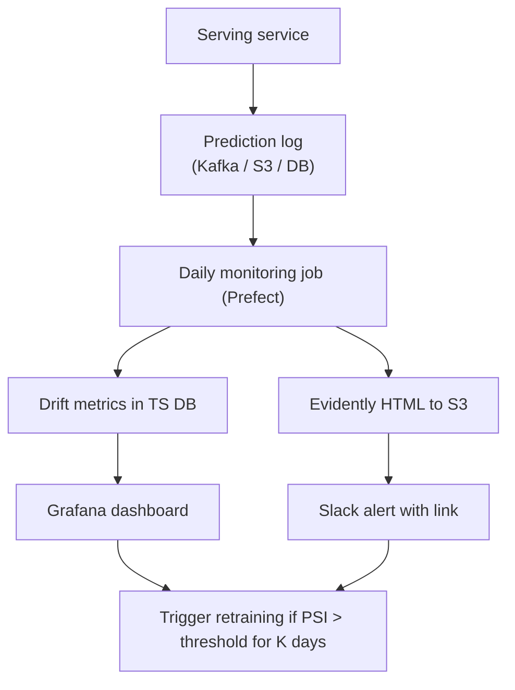

# 02 — Medium Guide: Productionizing the ML Workflow — Part 2 of 2: Monitoring, Evaluation, System Design, and the Capstone Project

This is Part 2 of 2 of the 02 — Medium Guide: Productionizing the ML Workflow lesson. Here we cover monitoring and drift detection, evaluation rigor, ML system design foundations, the capstone project spec, and the confidence checks before advancing to Tier 3.

## Week 4 — Monitoring and Drift Detection

### The Three Kinds of Drift

1. **Data drift (covariate shift):** input distributions change. `P(X)` shifts. Your model still says what it always said; reality says different things.
2. **Concept drift:** the relationship between inputs and outputs changes. `P(Y|X)` shifts. The model's predictions become wrong because the world changed underneath.
3. **Prediction drift:** the output distribution changes. `P(Y_hat)` shifts. Often a leading indicator of either of the above, or a sign of a broken upstream pipeline.

You monitor all three. Different metrics for each.

### Data Drift Metrics

For each feature:

- **PSI (Population Stability Index)** — most common in finance. Bucket the current data into the deciles of the training data; compare counts. PSI > 0.25 = significant drift.
- **KS statistic** — Kolmogorov-Smirnov test for continuous features.
- **Chi-squared test** — for categorical features.
- **JS divergence / KL divergence** — information-theoretic.

PSI is the workhorse:

```python
def psi(expected: np.ndarray, actual: np.ndarray, n_buckets: int = 10) -> float:
    breakpoints = np.percentile(expected, np.linspace(0, 100, n_buckets + 1))
    breakpoints[0], breakpoints[-1] = -np.inf, np.inf
    expected_counts = np.histogram(expected, bins=breakpoints)[0] / len(expected)
    actual_counts = np.histogram(actual, bins=breakpoints)[0] / len(actual)
    # Smoothing to avoid log(0)
    eps = 1e-6
    expected_counts = np.clip(expected_counts, eps, None)
    actual_counts = np.clip(actual_counts, eps, None)
    return float(np.sum((actual_counts - expected_counts) * np.log(actual_counts / expected_counts)))
```

### Concept Drift Detection

Harder, because it requires labels. Patterns:

- **Delayed labels:** loans default 30 days later; fraud chargebacks take 60 days. Your monitoring of "is the model still good?" lags reality by that delay.
- **Proxy metrics:** when ground truth lags, watch a proxy you trust (click-through rate, transaction completion rate).
- **Sliding-window AUC:** as labels arrive, compute AUC on a rolling window. Alert when it drops > N stddev.

### Prediction Drift Detection

Easy and cheap. Just compute summary stats on `y_hat` over a rolling window vs the training distribution. Alert on significant shift. Often the first detector to fire when a feature pipeline silently breaks.

### Evidently for the Heavy Lifting

[Evidently](https://github.com/evidentlyai/evidently) is the OSS standard for data/model monitoring reports:

```python
# Evidently 0.5+ API. The 0.4 API (`evidently.report.Report`, `ColumnMapping`)
# was removed in the 0.5 rewrite — pin your version explicitly.
from evidently import Report, Dataset, DataDefinition
from evidently.presets import DataDriftPreset, RegressionPreset

definition = DataDefinition(
    numerical_columns=[...],
    categorical_columns=[...],
    target="y",
    prediction="y_pred",
)
ref = Dataset.from_pandas(ref_df, data_definition=definition)
cur = Dataset.from_pandas(cur_df, data_definition=definition)

report = Report(metrics=[DataDriftPreset(), RegressionPreset()])
result = report.run(reference_data=ref, current_data=cur)
result.save_html("report.html")
```

Run as a Prefect/Airflow task on a daily schedule. Send the HTML to S3, link from Slack on regression.

### Tools to Know

| Tool | What |
|---|---|
| **Evidently** | OSS reports, statistical drift, basic monitoring |
| **WhyLabs / WhyLogs** | OSS-friendly profile-based monitoring at scale |
| **Arize / Fiddler / Aporia** | Commercial observability platforms; F50 standard for production ML |
| **Prometheus + Grafana** | System metrics; integrate ML metrics here too |
| **Datadog ML** | If your shop already uses Datadog |

For portfolio projects: use Evidently or WhyLogs (free, OSS). Mention the commercial ones in your README so you signal awareness.

### Monitoring System Architecture



Note the loop: monitoring is what *triggers* CT. Drift detected → schedule retraining. This is the closed loop that defines mature MLOps.

### Exercises

1. Add prediction logging to your service: every prediction with input features, output, model version, timestamp, request ID → write to S3 (or a simple Postgres table for dev).
2. Write a Prefect flow that runs daily, computes PSI per feature against the training distribution, and writes the results to a CSV.
3. Generate an Evidently report. Save HTML. Open it. Make sense of every panel.
4. Inject drift: shift one feature's distribution by adding 5 to all values. Confirm your monitor detects it.
5. Configure a Slack alert on PSI > 0.25 for 3 consecutive days.

---

## Week 4 — Evaluation Rigor

A digression that pays off in interviews.

### Validation Strategy Matters More Than the Model

A random 80/20 split is wrong for most real problems. Pick the right strategy:

- **Time-based split** for any temporal data (fraud, recommendation, demand forecasting). Train on past, test on future. Mirrors deployment.
- **Group-based split** (`GroupKFold`) when rows share a unit (user, hospital, store) that shouldn't appear in both train and test.
- **Stratified split** for class-imbalanced data, to preserve class proportions in both.
- **Nested cross-validation** when you do HPO — outer loop estimates generalization, inner loop tunes.

Get this right and you've outsourced 50% of the value of model selection to the data split.

### The Metric Matters as Much as the Model

In a class-imbalanced problem (fraud = 0.1% positive), accuracy is meaningless ("predict negative" is 99.9% accurate). Use PR-AUC. In a ranking problem, use NDCG. In an LLM generation problem, use BLEU/ROUGE/perplexity for syntactic tasks and human eval / win-rate / LLM-as-judge for semantic tasks.

Senior interviewers ask "why this metric?" If you can't answer, your model selection is suspect.

### Calibration

A well-calibrated model: when it says 70%, it's right 70% of the time. Gradient boosting and tree ensembles are typically uncalibrated by default. Calibrate via:

- **Platt scaling** (logistic regression on raw scores)
- **Isotonic regression** (non-parametric, more flexible, requires more data)

In `sklearn`: `CalibratedClassifierCV`. The calibration plot (reliability diagram) tells the story; bin probabilities, check that observed rates match.

### Subgroup Analysis

Aggregate metrics hide subgroup failures. A 90% AUC overall might be 95% on white males and 70% on Black women. In regulated domains, this is illegal. In all domains, it's a signal the model has hidden bias or your training data has segment-specific noise.

Always report metrics per major slice (gender, race, age, region, device) in addition to aggregate.

### Exercises

1. Re-split your tier-1 dataset by time, not random. Retrain. Compare metrics. Almost always they get worse — and that worse number is the honest one.
2. Compute calibration on the validation set. Plot a reliability diagram. If it's miscalibrated, add `CalibratedClassifierCV`.
3. Report metrics on at least 3 subgroups. Note any disparities.

---

## Week 5 — ML System Design Foundations

A taste of what we'll go deeper on in the Next Steps chapter.

### The Standard Loop

When asked "design an ML system for X":

1. **Clarify requirements.** Scale (QPS, data volume), latency budget, freshness requirements, accuracy target, fairness/compliance, team size, deadline.
2. **Frame the problem.** Classification? Regression? Ranking? Anomaly detection? What's the label? Where do labels come from?
3. **Data sources.** Where does training data live? Is there a feedback loop for labels?
4. **Features.** Batch, real-time, both? Where computed? Where stored?
5. **Model.** Class of model (start simple — logistic regression baseline is rarely wrong). Why this one?
6. **Training pipeline.** Schedule, retraining trigger, evaluation, promotion.
7. **Serving.** Batch / online / streaming? Latency? Throughput?
8. **Monitoring.** What you watch and why.
9. **Failure modes.** What happens if model service is down, if features are stale, if a bad model gets promoted?
10. **Cost.** Roughly. Knowing the unit economics is senior signal.

You should be able to do this in 45 minutes on a whiteboard. Practice it 5 times before the medium-tier project review.

### Common F50 ML System Design Questions

- "Design a recommendation system for a streaming service."
- "Design real-time fraud detection for a payments network."
- "Design a feature store for a 200-engineer ML org."
- "Design an LLM-powered chatbot for an enterprise's documentation."
- "Design a system to detect content policy violations on user-generated content."

For each, internalize one good answer. We'll prep more in the Next Steps chapter.

---

## The Medium-Tier Project

### Spec

Take your tier-1 project and graduate it to a system:

1. **A feature pipeline** (hand-rolled or Feast) with at least 5 named features, computed point-in-time correctly. Offline materialization for training; online materialization for serving (Redis or DynamoDB).
2. **An orchestrated training pipeline** (Prefect or Airflow) that runs daily, with proper retries, alerts, and lineage.
3. **A model registry** workflow: candidate → Staging → Production via aliases, with a CLI to promote/rollback.
4. **A CI/CD/CT pipeline** in GitHub Actions: PR tests, merge builds, scheduled training, gated deploys with manual prod approval.
5. **Four test categories**: unit, data, model behavior, integration. At least 3 tests per category.
6. **Monitoring**: prediction logging, daily Evidently report, drift alerts to Slack, dashboard in Grafana.
7. **A serving service** loading from MLflow registry by alias, with both single-row and batch endpoints, request ID propagation, structured JSON logs, Prometheus metrics, OpenTelemetry traces.
8. **A `README.md`** that includes:
    - Architecture diagram (Mermaid)
    - Decisions and trade-offs (3–5 with explicit pros/cons)
    - Cost estimate
    - 5 business questions and the queries against your warehouse that answer them
    - "What I'd do differently" section

### Acceptance Criteria

- Lineage graph (DVC / Prefect / Dagster) shows clear flow from raw → features → train → register → deploy.
- A new model can be promoted to Production with one CLI command and rolled back with one CLI command. Both verified.
- Drift on a feature triggers a Slack alert within 24 hours of injection.
- The deployed service handles at least 100 RPS with P95 latency under 100ms (document load test).
- Total cost under $20/month at the volume you've chosen.

### What This Project Proves

- You can design a feature pipeline that avoids training-serving skew
- You can run an orchestrated training pipeline like a real ML team does
- You can manage model lifecycle through a registry with controlled promotion
- You can detect when your model has degraded and react automatically
- You can think about ML systems as systems, not as notebooks

This project is genuinely portfolio-worthy. Treat the `README` like a tech blog post — recruiters will actually read it.

---

## Confidence Checks Before Tier 3

Don't move on until:

1. You can explain training-serving skew with a specific example and how to prevent it.
2. You can sketch the as-of join SQL pattern for point-in-time-correct feature retrieval.
3. You know the difference between data drift, concept drift, and prediction drift, and how to detect each.
4. You can walk through a model promotion via MLflow aliases, including rollback.
5. You can explain why CT (continuous training) exists and how it differs from CD.
6. You can list 4 categories of ML-specific tests and give examples of each.
7. You can sketch a feature store architecture and explain offline vs online stores.
8. You've thought about cost — you know roughly what your project would cost at 10x volume.

When all eight feel solid, move on to the Advanced Guide. That's where you start being able to handle real production scale.

---

## You can now

- Detect data drift, concept drift, and prediction drift using the right statistical metric for each (PSI for covariate shift, KS/chi-squared per feature type, sliding-window AUC for concept drift) and close the monitoring loop so detected drift automatically triggers retraining.
- Choose the correct validation strategy for a given problem (time-based, group-based, stratified, nested cross-validation) and explain concretely why a random split produces optimistically wrong numbers for temporal data.
- Calibrate a classifier using Platt scaling or isotonic regression, interpret a reliability diagram, and report per-slice metrics to surface subgroup fairness failures that aggregate AUC hides.
- Apply the 10-step ML system design loop — from requirements clarification through failure-mode analysis and cost estimation — and sketch credible answers to standard F50 design questions (recommendation, fraud detection, feature store, LLM chatbot, content moderation).
- Complete the medium-tier capstone project: a full production-grade ML system with feature pipeline, orchestrated training, registry-based promotion, CI/CD/CT, monitoring, and a load-tested serving endpoint — documented well enough that a recruiter can read the README and understand the architecture, trade-offs, and cost.
