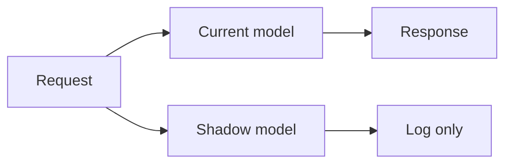
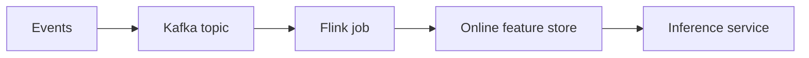

# 03 — Advanced Guide: Scaling, Distributed Training, and Production Serving — Part 2 of 2: Serving, Streaming, and the Capstone

This is Part 2 of 2 of the Advanced Guide: Scaling, Distributed Training, and Production Serving lesson. Here we cover production inference serving with BentoML, KServe, and Triton; streaming feature pipelines with Kafka and Flink; the capstone project spec; and the confidence checks before you specialize.

## Week 4 — Production Inference Serving

The other half of the MLOps job. Most teams underinvest here and pay for it forever.

### The Serving Stack Choices

| Tool | Strength | When to use |
|---|---|---|
| **FastAPI + uvicorn** | Simple, fast, batteries-not-included | Single-model services, low-medium scale |
| **BentoML** | Python-native packaging, multi-framework, batching | Mid-scale; great DX |
| **KServe** | Kubernetes-native, multi-framework, autoscaling-from-zero, multi-model | Production K8s standard |
| **NVIDIA Triton** | GPU-optimized, multi-framework (TensorRT, PyTorch, ONNX), dynamic batching, ensembles | High-throughput GPU serving |
| **vLLM / TGI / SGLang** | LLM-specific (continuous batching, PagedAttention) | LLM serving — covered in the Next Steps chapter |
| **Ray Serve** | Python-first, multi-replica composition | When you've adopted Ray |
| **TorchServe / TensorFlow Serving** | Framework-native | Less popular; you'll see them at older deployments |

For a portfolio project: build with BentoML *and* KServe. Two artifacts. Two stories.

### BentoML — The Pragmatic Choice

BentoML packages a model + its preprocessing + its serving code into a versioned **Bento** (a directory or container). Then you deploy that.

```python
# service.py
import bentoml
from bentoml.io import JSON
import numpy as np
from pydantic import BaseModel

class PredictInput(BaseModel):
    features: list[float]

income_runner = bentoml.sklearn.get("income_classifier:latest").to_runner()
svc = bentoml.Service("income_service", runners=[income_runner])

@svc.api(input=JSON(pydantic_model=PredictInput), output=JSON())
async def predict(data: PredictInput) -> dict:
    x = np.array([data.features])
    proba = await income_runner.predict_proba.async_run(x)
    return {"probability": float(proba[0, 1])}
```

```bash
bentoml build      # produces a Bento (versioned by hash)
bentoml containerize income_service:latest   # produces a Docker image
bentoml serve income_service:latest          # local serving
```

Built-in features that matter:

- **Adaptive batching** — multiple requests within X ms collected into one inference call. Critical for GPU throughput.
- **Multi-framework runners** — mix PyTorch, scikit-learn, ONNX in one service.
- **Yatai** (BentoML's K8s deployment service) for cluster ops.

### KServe — Kubernetes-Native Serving

KServe (formerly KFServing) is a Kubernetes CRD that wraps your model in a production-grade serving pod:

```yaml
apiVersion: serving.kserve.io/v1beta1
kind: InferenceService
metadata:
  name: income-classifier
spec:
  predictor:
    sklearn:
      storageUri: s3://my-bucket/models/income-classifier/v17/
      resources:
        requests: { cpu: "100m", memory: "256Mi" }
        limits: { cpu: "2", memory: "4Gi" }
    minReplicas: 1
    maxReplicas: 10
    scaleTarget: 80
    scaleMetric: concurrency
```

What you get out of the box:

- **Multi-framework predictors** (sklearn, tensorflow, pytorch, xgboost, lightgbm, huggingface, custom)
- **Autoscaling from zero** (using Knative under the hood) — pay nothing when no traffic
- **Canary deployments** with explicit traffic percentages
- **Transformers and Explainers** as separate pods sharing the same inference service
- **gRPC and REST** simultaneously
- **Open Inference Protocol** — standardized API across frameworks

```yaml
# Canary 90/10 split
spec:
  predictor:
    canaryTrafficPercent: 10
    canary:
      sklearn:
        storageUri: s3://my-bucket/models/income-classifier/v18/
    sklearn:
      storageUri: s3://my-bucket/models/income-classifier/v17/
```

Watch metrics on both. When v18 is confident, bump to 100. When it regresses, drop to 0.

### NVIDIA Triton — Maximum GPU Throughput

For GPU-bound serving at scale, Triton is king. Key features:

- **Dynamic batching** — server-side batching across requests, configurable max delay
- **Multiple backends** — TensorRT, ONNX Runtime, PyTorch, TensorFlow, custom Python, vLLM
- **Model ensembles** — preprocess → predict → postprocess as one Triton inference (single round trip)
- **Concurrent model execution** — multiple model instances on the same GPU
- **Sequence batching** — for stateful models like RNNs or LLMs

`config.pbtxt` per model:

```
name: "income_classifier"
platform: "onnxruntime_onnx"
max_batch_size: 64
dynamic_batching {
  preferred_batch_size: [32, 64]
  max_queue_delay_microseconds: 5000
}
input  [{ name: "input"  data_type: TYPE_FP32 dims: [10] }]
output [{ name: "output" data_type: TYPE_FP32 dims: [2] }]
```

Triton on KServe is a thing — `predictor.triton` in the InferenceService spec.

### The Serving Patterns

#### 1. Shadow Traffic

Route real prediction requests to the new model *in parallel* with the current model. Return the current model's output to the user. Log both. Compare offline.



Lets you validate a new model against real production traffic with zero user impact. Standard pre-promotion check.

#### 2. Canary

Route X% of traffic to the new model. Monitor metrics. Increase X gradually if healthy; rollback if degraded.

#### 3. A/B Test

Split traffic between two models long enough to measure business outcomes. Statistical significance matters — bake in a power analysis up front.

#### 4. Multi-Armed Bandit

A smarter A/B test where the routing percentage adapts based on observed performance. Standard pattern at recommendation-heavy companies.

#### 5. Blue/Green

Two identical environments. Switch all traffic from blue to green at once. Fast rollback by switching back. Riskier than canary; rare for ML serving where you want gradual rollouts.

### Latency Engineering for ML Serving

The latency budget. Typical:

| Use case | P95 latency budget |
|---|---|
| Real-time ads | 50ms total, model under 20ms |
| Real-time fraud | 100ms |
| Live recommendations | 200ms |
| Conversational AI (LLM, time to first token) | 500ms |
| Batch / async | seconds to minutes |

Where latency goes in a typical online prediction:

```
Network (client → LB)          5ms
TLS termination, LB routing   10ms
Service request handling      10ms
Feature lookup (Redis)         5–15ms
Model inference               20–100ms
Post-processing                5ms
Network back                   5ms
─────────────────────────────────
Total                         ~80–150ms
```

The big knobs:

1. **Batch.** Even at low QPS, micro-batching with a short window (1–10ms) often improves both throughput *and* per-request latency under load.
2. **Quantize.** FP16/BF16, INT8 (quantization-aware training), INT4 (LLM-specific). Often 2–4x speedup, often <1% accuracy delta.
3. **Compile / optimize.** `torch.compile`, TensorRT compilation, ONNX with execution providers. 1.5–3x typical wins.
4. **Right-size hardware.** A 1B-parameter model probably doesn't need an H100. T4 / L4 / A10 may halve cost at similar latency.
5. **Cache.** If the same input recurs, cache predictions. Useful in recommendation systems, document classification, embeddings.

### Exercises

1. Package your tier-2 model as a Bento. Containerize. Run locally with adaptive batching enabled.
2. Deploy the same model as a KServe InferenceService on your local cluster.
3. Convert the model to ONNX. Serve it via Triton. Compare P95 latency to your FastAPI baseline.
4. Implement a canary 90/10 with KServe and a second model version.
5. Load-test with `vegeta` or `k6`. Find your service's saturation point.

---

## Week 5 — Streaming Features and Real-Time Inference

### Why You Need Streaming Features

Many real ML problems need *fresh* features. Examples:

- **Fraud detection:** "amount spent in the last 10 minutes" is meaningful at second-level granularity; nightly batch is too late.
- **Recommendations:** "items the user has clicked in this session" must update as the session continues.
- **Demand pricing:** real-time inventory and event signals drive pricing.

The pattern:



You'll touch Kafka and Flink at competence level. Deep mastery is covered in the Advanced Topics chapter.

### Kafka in 60 Seconds

- **Topic:** a named stream of events
- **Partition:** a topic is split into partitions; ordering is per-partition
- **Producer:** writes events with a key (hash of key → partition)
- **Consumer Group:** multiple consumers cooperate; Kafka divides partitions among them
- **Offsets:** consumers track where they are

For ML: produce events from your application, consume them in a feature computation job, write derived features to the online store.

### A Simple Streaming Feature Job

```python
# stream_features.py — using Kafka client + Redis
from confluent_kafka import Consumer
import redis
import json

consumer = Consumer({
    "bootstrap.servers": "kafka:9092",
    "group.id": "feature-counter",
    "auto.offset.reset": "earliest",
})
consumer.subscribe(["purchases"])

r = redis.Redis(host="redis", port=6379)

while True:
    msg = consumer.poll(1.0)
    if msg is None or msg.error():
        continue
    event = json.loads(msg.value())
    user_id = event["user_id"]
    amount = event["amount"]
    # Sliding count over last 24h via Redis sorted set
    now = int(event["timestamp"])
    r.zadd(f"purchases:{user_id}", {f"{now}:{amount}": now})
    r.zremrangebyscore(f"purchases:{user_id}", 0, now - 86400)
    count = r.zcard(f"purchases:{user_id}")
    total = sum(float(x.decode().split(":")[1]) for x in r.zrange(f"purchases:{user_id}", 0, -1))
    r.hset(f"features:{user_id}", "purchases_24h_count", count)
    r.hset(f"features:{user_id}", "purchases_24h_total", total)
    consumer.commit(msg)
```

That's a real (if naive) streaming feature pipeline. In production you'd use Flink (real watermarks, exactly-once semantics, stateful sessions); the principles are the same.

### Flink in 60 Seconds

- **Stateful stream processing engine** — maintains TB-scale state with checkpoints
- **Event-time-first** — first-class watermarks, late data handling, windowing (tumbling, sliding, session)
- **Exactly-once via two-phase-commit sinks** — strongest guarantee across systems
- **SQL, Table API, DataStream API**

```sql
-- Flink SQL: windowed user purchase counts
CREATE TABLE purchases (
  user_id STRING,
  amount DOUBLE,
  ts TIMESTAMP(3),
  WATERMARK FOR ts AS ts - INTERVAL '5' SECOND
) WITH ('connector'='kafka', 'topic'='purchases', 'format'='avro');

CREATE TABLE user_features
WITH ('connector'='redis', ...)
AS
SELECT
  user_id,
  TUMBLE_START(ts, INTERVAL '1' MINUTE) AS window_start,
  COUNT(*) AS purchase_count_1m,
  SUM(amount) AS purchase_total_1m
FROM purchases
GROUP BY TUMBLE(ts, INTERVAL '1' MINUTE), user_id;
```

The output flows into Redis (or any online store) and is read by your inference service.

### The Online + Offline Consistency Problem

The trick: features computed on the stream must match features computed in batch. Otherwise training-serving skew creeps back in.

Standard solution: **the same transformations, expressed once, run in both modes.** Apache Beam, Flink (with the same job in batch mode), or a feature store with a unified definition (Feast with streaming sources, Tecton, Feathr).

A weaker but pragmatic solution: define batch features in dbt/SQL, derive streaming features by porting the SQL to Flink SQL, run a daily reconciliation that compares the two and alerts on divergence.

### Exercises

1. Set up a single-node Kafka + Redis stack in Docker Compose. Produce synthetic purchase events.
2. Write a streaming feature job (Python or Flink SQL) that maintains "purchases in the last hour per user."
3. Modify your serving service to read these features from Redis at inference time.
4. Inject a malformed event. Confirm the job handles it gracefully (logs, doesn't crash, doesn't poison downstream).
5. Run a reconciliation: compute the same feature in batch from a CSV of the same events. Verify it matches.

---

## Week 6 — Capstone Project Planning

The capstone is the big project that anchors interviews. We sketch the spec here; you build it in the projects file.

### The Capstone Spec (Preview)

A real-time anomaly detection system with a closed feedback loop:

- **Source events** from a synthetic generator (controllable fraud injection rate)
- **Streaming features** via Flink → Redis
- **A trained model** with proper experiment tracking, registry, promotion
- **A serving service** with sub-100ms P95 latency at 1000 RPS, deployed via KServe
- **Predictions logged** to a lake (Iceberg or plain Parquet)
- **A labeling UI** (Streamlit) for analysts to confirm/reject flagged events
- **Labels feeding back** to a retraining pipeline
- **Daily monitoring** of drift + precision/recall on labels
- **CI/CD/CT** in GitHub Actions
- **Everything on Kubernetes**, deployable with one `make up`

Detailed acceptance criteria, architecture diagrams, and decision rationale are in the Fortune 50 Projects chapter.

### What You Build in Week 6

Just enough to validate the architecture:

1. Skeleton repo with the project structure
2. Docker Compose stack with Kafka, Redis, Postgres, MLflow, MinIO, your services
3. A *trivial* version of every component — event generator emits one event/sec, feature job computes one feature, model is a stub, service returns random scores
4. The whole thing wired up. End to end. Trivial.

This is the "skeleton walking" milestone. You've proven the architecture flows. Now you spend the next 8–12 weeks making each component good.

---

## Confidence Checks Before Moving On

1. You can describe the memory breakdown in GPU training and why FSDP/ZeRO exists.
2. You can sketch DDP, FSDP, TP, PP and say when each is appropriate.
3. You can read a Kubernetes manifest and find the GPU request, the resource limit, and the environment injection.
4. You can describe shadow / canary / A/B / multi-armed-bandit patterns and when each is right.
5. You can explain why micro-batching often improves *both* throughput and latency.
6. You understand the online/offline consistency problem and the typical solutions.
7. You've built a streaming feature pipeline end-to-end, even at toy scale.

When all seven feel solid, move on to the Next Steps chapter to specialize.

---

## You can now

- Deploy production-grade model serving with BentoML, KServe, or Triton, and configure shadow, canary, A/B, and blue/green rollouts to safely promote new model versions.
- Decompose a latency budget across components and apply the right optimization — micro-batching, quantization, compilation, or hardware right-sizing — to meet a target P95.
- Build a streaming feature pipeline (Kafka → consumer/Flink → online store) and reason about the online/offline consistency problem and how to close the gap.
- Design and sketch the skeleton of a closed-loop ML system: event streaming, online features, model serving, prediction logging, labeling UI, and retraining feedback.
- Use the seven confidence checks to self-assess readiness and articulate when you're ready to specialize in training infrastructure or serving infrastructure.
