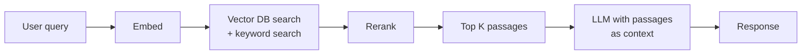

# 04 — Next Steps: Specialization Beyond the Foundations — Part 1 of 2: Cloud ML Platforms and LLMOps

This is Part 1 of 2 of the Next Steps: Specialization Beyond the Foundations lesson. Here we cover the honest comparison of foundations vs F50 production reality, managed cloud ML platforms (AWS SageMaker, GCP Vertex AI, Azure ML, and Databricks), and LLMOps — the full stack for operating foundation models in production, including model serving, RAG, fine-tuning, evaluation, guardrails, and the AI gateway layer.

You've built foundations, productionized a workflow, and gone deep on scale. The frontier for F50 MLOps in 2026 is wider than what's in any single course. This file closes the gap between "I finished a strong MLOps curriculum" and "I can credibly interview at OpenAI, Anthropic, Google DeepMind, Meta AI, Apple ML, Amazon Search, Netflix, Stripe, Uber, Snowflake-AI, Databricks."

**Time:** 6–8 weeks at 10 hrs/week. Treat it as a second course.

## The Honest Map: Foundations vs F50 Reality

| Layer | Foundations | F50 Reality |
|---|---|---|
| Cloud | Any one | AWS dominates, Azure second (esp. with OpenAI), GCP third |
| Orchestration | Prefect / Airflow | Airflow (mostly), increasingly Dagster; Temporal for ML-adjacent workflows |
| Experiment tracking | MLflow | MLflow / W&B (often W&B at frontier labs — note W&B is now owned by CoreWeave, Mar 2025; weigh the GPU-vendor lock-in), custom internals at the biggest |
| Feature store | Feast | Tecton / Databricks FS / SageMaker FS / Feathr / internal builds |
| Training | PyTorch on K8s | PyTorch + DeepSpeed/Megatron + Ray/Slurm; massive in-house tooling |
| Serving | KServe / BentoML | KServe / Triton / Ray Serve / **vLLM / TGI / SGLang for LLMs** |
| Monitoring | Evidently | Arize / Fiddler / WhyLabs / custom; LLM-specific evals (Braintrust, Langfuse) |
| Governance | Light | Heavy — model cards, AI risk frameworks, regulator-facing audit trails |
| LLM ops | Touched | A distinct sub-discipline (LLMOps) — RAG, evals, prompt management, agent ops |
| Vector DBs | Touched | First-class infra component; Pinecone / Weaviate / Qdrant / pgvector / Vespa |
| Quality | dbt tests | dbt + Great Expectations + Soda + custom drift detection |
| CI/CD | GitHub Actions | GitHub Actions / GitLab / Jenkins; Argo CD / Flux for K8s GitOps |
| GPU ops | Basics | NCCL tuning, fabric topology, GPU fleet management |

Strong on the columns where foundations and F50 agree. Gaps to close: managed ML platforms, LLMOps, governance, advanced monitoring, vector / retrieval infrastructure, GPU operations at scale.

---

## Phase 1 — Cloud ML Platforms (2 weeks; pick one to start)

You should know one cloud's ML platform fluently. AWS is the most-asked in F50 interviews. GCP is the most pedagogically pleasant (BigQuery + Vertex are cohesive). Azure is rising via OpenAI integration.

### AWS SageMaker (Most Common at F50)

What to know:

1. **SageMaker Studio** — the IDE. Notebooks, terminals, Git, JupyterLab. Connects to all SageMaker services.
2. **Training Jobs** — managed training. You provide a Docker image + entry script; SageMaker handles instances, retries, checkpointing to S3. Supports script mode (provide a Python script, use a prebuilt container) and BYO container.
3. **Hyperparameter Tuning Jobs** — managed Bayesian / Hyperband / Grid HPO.
4. **Pipelines** — managed DAGs for training/inference workflows; SDK is Python. Integrates with Model Registry.
5. **Model Registry** — SageMaker's equivalent to MLflow registry. Includes model approval workflow.
6. **Endpoints** — managed serving. Real-time, batch, async, serverless options. Multi-model endpoints (host many models on one instance).
7. **Feature Store** — SageMaker's feature store. Online (DynamoDB-backed) + offline (S3). Less mature than Feast/Tecton but tightly integrated with the rest of SageMaker.
8. **Model Monitor** — built-in drift detection, bias detection, explainability.
9. **Clarify** — bias and explainability reports.
10. **Inferentia and Trainium** — AWS's custom ML chips. Often dramatically cheaper than equivalent NVIDIA, with worse software support. Know they exist; pick them up if you target an AWS-heavy F50.

For a portfolio project: port your tier-2 project to SageMaker. Same dbt code (if any), same model code, different training launch and serving stack. Document the cost and DX differences.

### GCP Vertex AI

What to know:

1. **Vertex Workbench** — notebook environment. Connects to BigQuery / GCS / Vertex services.
2. **Vertex Training** — custom training jobs on managed infrastructure. Tightly integrated with BigQuery as data source.
3. **Vertex Pipelines** — managed Kubeflow Pipelines (KFP). KFP DSL is more cumbersome than Airflow/Prefect; you'll need to learn it.
4. **Vertex Model Registry**.
5. **Vertex Prediction** — online / batch / private endpoints.
6. **Vertex Feature Store** — fully managed feature store. Online (Bigtable-backed) + offline (BigQuery).
7. **Vertex Model Monitoring** — drift and skew detection out of the box.
8. **Matching Engine** — managed vector search. Increasingly central to GCP's GenAI story.
9. **Vertex Agent Builder** — managed RAG + agent infrastructure.
10. **TPUs** — Google's custom ML chips. Mature, occasionally faster than equivalent GPUs, software fully through JAX/XLA. Worth at least having seen.

Strong fit: companies with heavy BigQuery investment. The BigQuery → Vertex pipeline is exceptionally smooth.

### Azure ML

What to know:

1. **Azure ML Studio** — workspace UI, designer, notebooks.
2. **Compute targets** — instances and clusters; can be CPU, GPU, or AKS-backed.
3. **AML Pipelines** — DAG framework, similar to Vertex Pipelines.
4. **MLflow as the default tracker** — Azure ML uses MLflow natively, with managed hosting. This is often the cleanest cloud-MLflow experience.
5. **Model Registry, Endpoints, Managed Online Endpoints** — like the others.
6. **Azure OpenAI Service** — *the* differentiator. Hosted GPT/Claude-adjacent models with enterprise compliance.
7. **Azure AI Search** — managed search + vector retrieval, deep RAG integration.
8. **Azure AI Studio** — the new umbrella for generative AI on Azure.

Strong fit: any organization already in the Microsoft / OpenAI orbit. Pharma, finance, government.

### Databricks ML

What to know:

1. **Notebook-first dev** — Python, SQL, Scala, R coexist.
2. **MLflow native** — Databricks built MLflow; the Databricks MLflow experience is the best version.
3. **Unity Catalog** — governance layer for data, features, models. Increasingly the centerpiece.
4. **Feature Engineering in Unity Catalog** — Databricks' feature store, integrated with Delta tables.
5. **Mosaic AI** — model training (especially LLM fine-tuning) tooling, includes the integrated MPT/Mosaic stack.
6. **Vector Search** — managed vector index on Delta tables.
7. **Model Serving** — managed real-time serving, autoscales to zero.
8. **AI Gateway** — proxies LLM calls with rate limiting, observability, and cost control across providers.

Strong fit: companies with heavy lakehouse / Spark investment. Any large enterprise migrating off Hadoop / EMR.

### Cost Discipline Across All Cloud ML Platforms

The hidden money pits to watch for:

- **Endpoints autoscaling minimums set to 1+ replicas** — pays even at zero traffic
- **Cross-region storage / training** — data egress kills you
- **Idle SageMaker Studio notebooks** — they bill while running, hours after you closed the tab
- **NAT Gateway for outbound S3** — use VPC endpoints instead
- **GPU instances launched manually for "quick experiments"** — left running over weekends
- **HPO jobs with no early stopping** — running 200 trials when 50 would have sufficed
- **Logs piling up** — CloudWatch / Stackdriver / Log Analytics can cost more than compute

Tag every resource with team/project/environment. Build a weekly cost report. Read it.

### What to Build

Port your medium-tier project to one cloud's ML platform end to end. Same model code, different infrastructure. Document everything that surprised you — that's the interview story.

---

## Phase 2 — LLMOps and Foundation Model Operations (2 weeks)

The biggest single shift in MLOps since the field existed. Different enough from classical ML ops that many companies have separate "LLMOps" or "AI Engineering" tracks.

### Why LLMOps Is Different

Classical ML | LLMOps
---|---
Train a model on your data | Use someone else's model; adapt it
Metric: AUC / accuracy / F1 | Metric: helpfulness, harmlessness, faithfulness, ... harder
Single output per prediction | Sequence of tokens, variable length
Inference cost: pennies | Inference cost: dollars per million tokens
Deterministic given seed | Stochastic, often by design (sampling)
Ground truth labels | Often no ground truth — human or LLM-as-judge
Drift = retrain | Drift = re-prompt, re-RAG, re-fine-tune
Auditability via training data | Auditability via prompts + retrieval + tool calls

### The LLMOps Stack

```
[App] ─► [Gateway / Router (Portkey, LiteLLM, Helicone)] ─► [Model providers]
                                                                  │
                                                                  │  (OpenAI, Anthropic,
                                                                  │   self-hosted vLLM,
                                                                  │   Bedrock, Vertex,
                                                                  │   together.ai, ...)
                                                                  ▼
                                            [Prompts: versioned in a prompt registry]
                                            [Retrieval: vector DB + reranker]
                                            [Evals: offline + online, LLM-as-judge]
                                            [Observability: Langfuse / Braintrust / W&B Weave]
                                            [Guardrails: NeMo Guardrails / Lakera / built-in]
                                            [Fine-tuning pipeline: LoRA / DPO / SFT]
```

### What You Need to Master

#### 1. Model Serving for LLMs

The default LLM-serving stack:

- **vLLM** — open-source, dominant. The **V1 engine** is the default architecture since 2025: disaggregated prefill/decode scheduling, rewritten async execution loop, prefix caching on by default. Stripe reported a 73% inference cost reduction after migrating to vLLM — the canonical public case for what a modern serving stack does to unit economics. Continuous batching, PagedAttention, speculative decoding, multi-LoRA serving all included.
- **TGI (Text Generation Inference)** — Hugging Face's stack; similar capabilities.
- **SGLang** — production-ready peer of vLLM (no longer "the newer one"): ~29% higher throughput on H100 for 7–8B models and up to 6.4× on prefix-heavy workloads (RAG, multi-turn agents) thanks to RadixAttention prefix caching; strong structured output. Serving trillions of tokens daily across major deployments.
- **Triton + TensorRT-LLM** — NVIDIA's serving stack; lowest latency / highest throughput on NVIDIA hardware.

Key concepts:

- **Continuous batching** — instead of waiting for a batch to be ready, the server interleaves new requests into the running batch as token-by-token generation progresses. Drastically improves throughput.
- **PagedAttention / KV cache management** — the KV cache is the main memory cost of LLM inference. PagedAttention pages it like virtual memory; lets you fit way more concurrent requests in the same memory.
- **Prefix caching** — when many requests share a common prefix (system prompt, RAG context), cache the KV state. Reuses compute.
- **Speculative decoding** — a small draft model proposes the next N tokens; the big model verifies in parallel. 2–4x speedup typical.
- **Speculative + tree decoding (Medusa, EAGLE)** — generalizations.
- **Quantization** — INT8 (AWQ, GPTQ), INT4 (Marlin kernels), FP8 (Hopper / Blackwell). Often 2–4x throughput with <1% quality delta.

#### 2. RAG (Retrieval-Augmented Generation)

The pattern almost every enterprise AI app uses:



What to learn:

- **Chunking strategies** — fixed-size, semantic, hierarchical. Bad chunking is the #1 RAG failure.
- **Embedding models** — text-embedding-3-large vs Cohere embed-v3 vs open-source BGE / E5. Trade off cost, quality, and dimensionality.
- **Vector DBs** — pgvector, Pinecone, Weaviate, Qdrant, Vespa, LanceDB. Algorithms: HNSW vs IVF + PQ; you balance recall, latency, memory.
- **Hybrid search** — combine vector (semantic) and BM25 (lexical). Almost always beats either alone.
- **Reranking** — a cross-encoder (Cohere Rerank, BGE-Reranker) on the top 50–200 candidates to find the best 5–10. Big quality win for cheap compute.
- **Evaluation** — RAGAS, ARES, LLM-as-judge for faithfulness, context relevance, answer relevance.

A solid RAG project is a high-leverage portfolio piece. Many F50s have "build a RAG over our enterprise docs" as an interview problem.

#### 3. Fine-Tuning

When prompting + RAG aren't enough:

- **SFT (Supervised Fine-Tuning)** — gather instruction → response pairs, train on next-token prediction over the response only. The baseline.
- **LoRA / QLoRA** — train small adapter weights on top of a frozen base. Massively cheaper; 1–10% of compute of full fine-tuning, often within 1–2% of quality.
- **DPO (Direct Preference Optimization)** — given pairs of (chosen, rejected) responses, train the model to prefer chosen. Cheaper than RLHF, often equivalent results.
- **RLHF (Reinforcement Learning from Human Feedback)** — the original alignment method. PPO on a reward model. Expensive and finicky; mostly replaced by DPO/ORPO/KTO for new work.
- **Continued pretraining** — for major domain shifts; not common but worth knowing.

The 2026 default: **start with a strong open-weights base (Llama-class, Qwen, Mistral, Gemma), apply LoRA SFT for capability, follow with DPO for alignment**. The underlying math is covered in the advanced topics chapter.

#### 4. Evaluation

The hardest part of LLMOps. Approaches in increasing reliability:

1. **Automated metrics** — BLEU, ROUGE, perplexity. Cheap, weak.
2. **LLM-as-judge** — a strong model grades your model's output. Works for many tasks but has known biases (verbosity, self-preference).
3. **Programmatic checks** — does the output validate against the requested schema? Match required substrings? Pass unit tests if it's code?
4. **Pairwise comparison + ELO** — two outputs, which is better; aggregate ELO scores.
5. **Human eval with rubrics** — gold standard, expensive, slow.

Tools:

- **Braintrust, Langfuse, W&B Weave, LangSmith** — eval + observability platforms
- **RAGAS** — RAG-specific
- **Promptfoo** — local-friendly prompt evals
- **EleutherAI lm-eval-harness** — standard academic benchmarks

For a portfolio project, build a real evaluation harness for whatever LLM app you build. The eval harness is often more impressive than the app.

#### Eval as a CI/CD Gate

Offline eval is the new "we test in prod." If your eval suite only runs before a quarterly release, you're testing in production — you're just doing it slowly.

The mature pattern: **eval suites block deploys.** Every pull request and every deployment triggers the eval suite; if scores regress beyond a threshold, the deploy is blocked. This is the LLM analog of the test suite.

- **Braintrust** has native CI integration: define a baseline eval score, run the suite in CI, fail the check on regression. Pull requests show eval diffs the way code review shows code diffs.
- **Galileo** evaluates 100% of production traffic at <200ms latency — not just a sample, not just offline. Quality regressions surface within hours of a deploy, not days.

What "regression" means in practice: you define a quality metric (task-specific accuracy, LLM-as-judge score, schema validity rate) and a threshold (e.g., "new version must score within 2% of champion on the held-out eval set"). Any model or prompt change that crosses the threshold requires human review before shipping.

This is what separates a mature LLMOps org from one that pushes prompts to production and hopes. The eval gate is the guardrail; everything else is cleanup.

#### 5. Guardrails and Safety

- **Input filtering** — prompt injection detection, PII redaction
- **Output filtering** — toxicity, hallucination detection, format enforcement
- **Tool use guardrails** — explicit allow-lists of tools, parameter validation, dry-run mode for sensitive actions
- **Rate limits and budgets** — per-user, per-key cost ceilings
- **Audit logs** — every prompt, response, retrieval; required for any enterprise deployment

Tools: **NeMo Guardrails** (NVIDIA), **Lakera Guard**, **OpenAI's moderation endpoint**, **Anthropic's safety features**, plus a lot of bespoke code.

#### 6. The AI Gateway Layer

LLM cost can blow a budget overnight — but cost management is now the smallest reason to run a gateway. Gateways are infrastructure, not optional. More than 90% of production AI teams run 5 or more models in 2026. Without a gateway, you're hardcoding provider SDKs into application code, which means a provider outage is an application outage.

**Why the gateway is now mandatory:**

The November 2025 Cloudflare outage cascaded into ChatGPT downtime. OpenAI had multiple multi-hour incidents in late 2025. Any production system with a single-provider dependency has a reliability ceiling set by that provider. Multi-provider failover is table stakes.

**What a gateway does:**

- **Provider failover** — primary call fails; route to fallback provider within the same request latency budget
- **Per-tenant quotas and token-level cost attribution** — internal chargebacks, per-team rate limiting, budget alerts
- **Model cascading** — route to a cheap model first; only escalate to an expensive one when the cheap model signals low confidence or the task type requires it
- **Semantic caching** — cache responses by semantic similarity, not just exact match; hit rates of 30–60% on repetitive workloads
- **A/B routing** — split traffic between models, measure quality metrics, promote winners
- **Unified observability** — all provider calls through one trace path, regardless of which provider answers

**Decision tree for gateway choice:**

| Situation | Tool |
|---|---|
| Self-hosted default, <$50K/month LLM spend | **LiteLLM** — OSS, OpenAI-compatible proxy, handles 100+ models, Python-native config |
| Want managed features without lock-in | **Portkey** — went fully Apache 2.0 in March 2026; managed tier available |
| API-gateway team already runs Kong | **Kong AI Gateway** — AI plugin on top of existing Kong infrastructure; one platform for all API traffic |
| Already deep in MLflow | **MLflow AI Gateway** — native integration with MLflow tracking and model registry |

**Uber's GenAI Gateway** is the canonical internal case: a centralized gateway handling all LLM traffic across thousands of internal services, with cost attribution per business unit, automatic fallback across providers, and a semantic cache layer. The pattern is increasingly the standard at F50 scale.

```python
# LiteLLM: the same code, any provider
from litellm import completion

# Failover: tries gpt-4o first, claude-3-5-sonnet second
response = completion(
    model="gpt-4o",
    messages=[{"role": "user", "content": prompt}],
    fallbacks=["claude-3-5-sonnet-20241022"],
    metadata={"user_id": user_id, "team": "search"},  # for cost attribution
)
```

Cost tactics that live inside the gateway:

- **Prompt compression** — LLMLingua and similar tools reduce token count before the request leaves the gateway
- **Model cascading** — embed a confidence classifier at the gateway; route simple queries to a cheap model, complex ones to the expensive one
- **Cache warming** — pre-populate semantic cache with known-frequent queries

#### 7. Managed Fine-Tuning (FTaaS)

Fine-tuning infrastructure is a significant operational burden if you build it yourself: GPU reservation, distributed training setup, checkpoint management, experiment tracking, LoRA adapter storage, serving the adapted model. Before committing to self-hosted fine-tuning infrastructure, price the alternative.

FTaaS providers in 2026:

- **Together AI** — wide model selection, transparent ~$3–4/hr H100-equivalent pricing, LoRA and full fine-tune
- **Fireworks AI** — fast serving of fine-tuned models, competitive pricing
- **Modal** — serverless; ~$4/hr H100, per-second billing; bring your own training code
- **Tinker** (Mira Murati, 2025) — purpose-built fine-tuning platform with a strong ops-first design philosophy
- **Nebius Token Factory** — European provider, useful for data-residency cases

The economics: at ~$3–4/hr for H100-equivalent compute, a LoRA fine-tuning run on a 7B model costs $10–50 depending on dataset size and epochs. The break-even for self-hosting is when you have **sustained GPU utilization** — idle-GPU economics destroy the self-hosted case. A team running one fine-tuning job per week pays 2 hours of GPU time; owning the H100 node pays whether it runs or sits idle.

Decision rule: **self-host only when you have sustained high utilization or data residency constraints that prohibit sending training data to a third party.** Otherwise FTaaS wins on unit economics.

### What to Build

Pick one:

1. A RAG app over a real corpus (your own notes, a public document set) with proper chunking, embedding, hybrid search, reranking, and an eval harness.
2. A small fine-tuning project: take a 7B open-weights base, LoRA-SFT it on a focused task (e.g., natural language to SQL on a specific schema), DPO it on a small preference set, eval it against the base. Run the fine-tuning on a FTaaS provider; compare to what self-hosting would cost.
3. An agentic system that uses tools (calculator, search, API calls) with proper guardrails, logging, and replay.

---

## Try it

Port one of your existing projects to a managed cloud ML platform of your choice (SageMaker, Vertex AI, Azure ML, or Databricks). Use the platform's native training jobs, model registry, and a live endpoint — do not replicate your local setup on cloud VMs. Then, separately, build a minimal RAG application over a small document corpus (at least 10K documents): implement hybrid search combining BM25 and vector retrieval, add a reranker, and write a lightweight eval harness that measures context relevance and answer faithfulness against a 20-query labeled set using LLM-as-judge. Document the per-layer latency and cost for both the platform port and the RAG eval run.

## You can now

- Identify the gaps between a strong MLOps foundations curriculum and F50 production reality across cloud platforms, LLM serving, monitoring, and governance dimensions.
- Stand up an end-to-end ML workflow on one managed cloud ML platform (SageMaker, Vertex AI, Azure ML, or Databricks), including training jobs, pipelines, model registry, and a live endpoint, and articulate the cost and DX trade-offs versus self-managed infrastructure.
- Architect an LLMOps stack with an AI gateway for multi-provider failover, RAG with hybrid retrieval and a cross-encoder reranker, guardrails for input/output filtering, and an eval pipeline that blocks deploys on quality regression.
- Evaluate and apply LLM fine-tuning approaches (LoRA SFT, DPO) and decide between FTaaS and self-hosted infrastructure based on GPU utilization economics and data-residency constraints.
- Build a working evaluation harness — automated metrics, LLM-as-judge scoring, and pairwise comparison — and integrate it as a CI/CD gate that fails on quality regression beyond a defined threshold.
