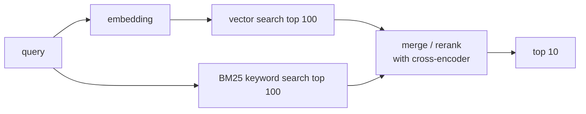

# 04 — Next Steps: Specialization Beyond the Foundations — Part 2 of 2: Vector DBs, Monitoring, Governance, and System Design

This is Part 2 of 2 of the Next Steps: Specialization Beyond the Foundations lesson. Here we cover vector database infrastructure and hybrid retrieval (Phase 3), advanced ML observability (Phase 4), AI governance and the EU AI Act (Phase 5), MLOps system design interviews (Phase 6), specialization guidance, and a readiness checklist for the F50 role.

## Phase 3 — Vector Databases and Retrieval Infrastructure (1 week)

### What a Vector DB Is

A specialized DB for **approximate nearest neighbor (ANN)** search over high-dimensional vectors. Algorithms:

- **HNSW (Hierarchical Navigable Small World)** — graph-based, very fast, more memory. The dominant choice.
- **IVF (Inverted File)** — partition vectors into clusters, search nearest clusters. Cheaper, slightly worse recall.
- **PQ (Product Quantization)** — lossy compression of vectors. Often combined with IVF (IVF-PQ).
- **DiskANN** — disk-backed, good for billion-scale on cheap hardware.

You don't implement these. You configure them and tune recall/latency/memory.

### The Players

| Tool | Strengths | Trade-offs |
|---|---|---|
| **pgvector** | Postgres extension; SQL-native; mature; great for <50M vectors | Slower at scale than purpose-built |
| **Pinecone** | Managed, fully hosted, scales transparently | Expensive; no open-source path |
| **Weaviate** | Open-source, GraphQL + REST, modules for embedding, hybrid built-in | Heavier ops than pgvector |
| **Qdrant** | Rust-based, fast, OSS, payload filtering | Newer; smaller ecosystem |
| **Milvus** | Mature, scales to billions, GPU support | Heavier ops |
| **LanceDB** | Embedded, like DuckDB for vectors | Small scale; great DX |
| **Vespa** | Yahoo's engine; hybrid + relevance ranking; production-proven | Complex; high ceiling |
| **OpenSearch with k-NN** | If you already have OpenSearch | Decent enough; common at AWS shops |

### The Hybrid Search Pattern



Lexical and semantic agree more often than not; reranking sharpens the top. Quality typically beats either path alone by 10–30%.

### What You Build

1. A pgvector setup with 1M embedded documents. Implement hybrid search. Measure recall@10 against a labeled query set.
2. Compare pgvector vs Qdrant vs Weaviate on the same workload. Note latency, throughput, ops complexity.
3. Add a reranker. Measure quality lift.

---

## Phase 4 — Advanced Monitoring and ML Observability (1 week)

The medium-tier guide covered the basics. Here's what F50 production looks like.

### The Five Dimensions of Production ML Observability

1. **System health** — request latency, error rate, throughput, resource utilization. Standard SRE stuff.
2. **Data drift** — input feature distributions over time.
3. **Concept / performance drift** — output quality, when labels exist.
4. **Prediction drift** — output distributions.
5. **Business metrics** — the actual KPI the model exists to move (conversion, click-through, fraud rate, NPS).

The strongest signal is often #5 — when conversion drops, you'd better know.

### Tools

| Tool | What |
|---|---|
| **Evidently / WhyLogs** | OSS, drift reports, profile-based monitoring |
| **Arize, Fiddler, Aporia, Truera** | Commercial ML observability — most F50 standardize on one of these |
| **Datadog ML** | If you're a Datadog shop |
| **Langfuse / Braintrust / W&B Weave** | LLM-specific observability |
| **Grafana / Mimir / Tempo / Loki** | The OSS observability stack — metrics, traces, logs |
| **OpenLineage + Marquez** | Lineage; *which dataset, which pipeline, which model*? |

### Specific Patterns to Master

#### 1. The Reference Dataset Problem

What do you compare current production data to? Three options:

- **The training set** — the most common; cheap; but loses sensitivity over time as the training set ages.
- **A rolling window of recent production data** — sensitive to gradual shifts; can mask large persistent drift.
- **A held-out "golden" set with known properties** — best for behavioral tests; not useful for distribution drift.

Most teams use *both* training set drift and rolling-window drift.

#### 2. Slicing

Aggregate metrics hide subgroup failures. Always slice:

- By geography
- By device / platform
- By customer cohort / segment
- By new vs returning user
- By protected attribute (where applicable)
- By model feature buckets (e.g., low / medium / high price tier)

The slice that lights up first when things go wrong is usually a specific cohort, not the aggregate.

#### 3. Lineage and Root Cause

When monitoring fires: "the model is getting worse." Useful follow-on questions:

- Which feature drifted? (data drift)
- Did an upstream pipeline change? (lineage check)
- Did a feature's source schema change? (schema diff)
- Is a specific cohort being affected? (slicing)
- Did model training pull from a different dataset than before? (training data audit)

Modern observability platforms integrate with lineage (OpenLineage) and the model registry so a single click jumps from "alert" to "the training data was different last Tuesday."

### OpenTelemetry GenAI Semantic Conventions

The observability stack for LLMs has been a Wild West of incompatible formats. OTel shipped the **GenAI semantic conventions** (experimental, 2026) to standardize this: a defined vocabulary of span attributes for LLM calls, agent steps, MCP tool calls, and optional content capture.

Key attributes from the `gen_ai.*` namespace:

- `gen_ai.system` — the model provider (`openai`, `anthropic`, `aws_bedrock`, ...)
- `gen_ai.request.model` — which model was requested
- `gen_ai.response.model` — which model actually responded (may differ after failover)
- `gen_ai.usage.input_tokens` / `gen_ai.usage.output_tokens` — for cost attribution
- `gen_ai.operation.name` — `chat`, `text_completion`, `embeddings`
- Content capture attributes (optional, gated by a flag for PII safety)

The ecosystem is converging: **Datadog, Honeycomb, and New Relic** all support ingestion of GenAI convention spans. **LangChain, CrewAI, and AutoGen** emit OTel-compliant spans natively. **MLflow 3 tracing is OTel-compatible** — if you're already in MLflow, you get standardized trace export for free.

Why this matters operationally: **vendor-neutral tracing means no observability lock-in.** Instrument once, point the exporter anywhere. Switch from Datadog to Honeycomb without rewriting your instrumentation.

```python
import mlflow

# Option A: decorator — MLflow 3 wraps the function in an OTel-compatible span
@mlflow.trace
def call_llm(prompt: str, model: str = "gpt-4o") -> str:
    response = openai_client.chat.completions.create(
        model=model,
        messages=[{"role": "user", "content": prompt}],
    )
    return response.choices[0].message.content

# Option B: manual span with gen_ai.* attributes
from opentelemetry import trace
from opentelemetry.semconv.ai import SpanAttributes  # opentelemetry-semantic-conventions-ai

tracer = trace.get_tracer(__name__)

with tracer.start_as_current_span("llm.chat") as span:
    span.set_attribute(SpanAttributes.GEN_AI_SYSTEM, "openai")
    span.set_attribute(SpanAttributes.GEN_AI_REQUEST_MODEL, "gpt-4o")
    response = call_model(prompt)
    span.set_attribute(SpanAttributes.GEN_AI_USAGE_INPUT_TOKENS, response.usage.prompt_tokens)
    span.set_attribute(SpanAttributes.GEN_AI_USAGE_OUTPUT_TOKENS, response.usage.completion_tokens)
```

For agent workloads, the GenAI conventions extend to tool calls (each tool invocation is a child span with `gen_ai.tool.name` and `gen_ai.tool.call.id`), enabling end-to-end trace trees for multi-step agent executions. This is the instrumentation layer that makes agent observability tractable at production scale — covered in more detail in the agentic systems section of this course.

### What to Build

Take your medium-tier project's monitoring layer and elevate it:

- Add slice-aware monitoring on at least 3 dimensions
- Connect monitoring → lineage → root-cause runbook
- Set up alert routing: severity 1 (paging), severity 2 (Slack), severity 3 (dashboard only)
- Add a one-pager runbook per alert type
- If you have an LLM component: instrument with OTel GenAI semconvs; export to any OTLP-compatible backend

---

## Phase 5 — Governance, Security, and the AI Act (1 week)

The single area separating "I can build ML systems" from "I can run an ML platform at a regulated F50."

### Governance: What F50 Companies Actually Need

- **Model inventory** — every production model registered with owner, purpose, data sources, training data lineage
- **Model cards** — for each model: intended use, training data, performance per slice, known limitations, fairness considerations. Published internally and (sometimes) externally.
- **Approval workflow** — high-risk model deployments require sign-off from a risk committee. Bake the workflow into your registry.
- **Audit trail** — every promotion, every prediction (sampled in high-volume cases), every label feedback. Retain per regulatory requirements (often 7 years for finance/healthcare).
- **Right to explanation** — for credit, insurance, employment models, regulators require explanations of decisions. SHAP / LIME / counterfactual explanations, with a path to human review.

### Regulatory Landscape (As of 2026)

- **EU AI Act** — risk-based; "high-risk" systems (employment, education, credit, law enforcement, medical) require conformity assessment, technical documentation, post-market monitoring. **Timeline matters: prohibited-practices + AI-literacy rules already apply; GPAI obligations since Aug 2025; general enforcement 2 Aug 2026; high-risk systems get until 2 Dec 2027; AI embedded in regulated products until Aug 2028.** Fines up to €35M or 7% global turnover. Know the dates — "is the Act enforced?" is now a trick interview question.

#### EU AI Act: The Technical Controls (Annex IV Checklist)

The regulatory timeline is in the file. Here's the engineering translation: what Annex IV requires from high-risk systems, and what MLOps artifact satisfies each requirement.

| Annex IV Requirement | What it demands | MLOps artifact that satisfies it |
|---|---|---|
| **Risk-management system** | Documented, continuously updated process for identifying and mitigating risks | Risk register in your model registry; reviewed at each promotion gate |
| **Data governance documentation** | Provenance, representativeness, bias examination for training data | Data lineage (OpenLineage), dataset cards, demographic slice reports from your eval harness |
| **Automatic record-keeping / logging** | Traceability through the full model lifecycle; logs must be tamper-evident | Prediction logs + audit trail in immutable storage (S3 Object Lock or equivalent); lineage metadata |
| **Transparency documentation** | Capabilities and limitations disclosed to deployers (not end users — deployers) | Model cards; API documentation with known failure modes; release notes per version |
| **Human oversight mechanisms** | Defined intervention points; humans can override, disable, or correct the system | Approval workflow baked into model registry promotion; kill-switch endpoint in serving layer |
| **Accuracy, robustness, cybersecurity specs** | Declared metrics + measured evidence that the system meets them | Eval report as a formal artifact; adversarial test results; penetration test summary |

The operational insight: every item on this list maps to something a mature MLOps team should build anyway. The EU AI Act is not a compliance tax on top of good engineering — it is a forcing function to productionize what you should have built regardless. The teams that will find compliance easy are the ones that already have model cards, eval reports, audit logs, and a promotion gating workflow.

For high-risk system preparation: build an **evidence pack** — a versioned folder per model that contains model card, eval report, data provenance summary, risk assessment, and the approval sign-off. Every production promotion produces one. The Annex IV conformity assessment is then an audit of your evidence packs, not a scramble to reconstruct history.

- **NYC Local Law 144** — automated employment decision tools must have annual bias audits.
- **Colorado AI Act** — broader, also covers high-risk AI in employment, education, finance.
- **California, Illinois, Texas** — various sector-specific AI regulations.
- **HIPAA** (US healthcare) — PHI protection, audit logging, BAA agreements.
- **GDPR Article 22** — restrictions on solely automated decisions with significant effects on individuals.
- **NIST AI Risk Management Framework** — voluntary US framework increasingly used as a baseline.

You don't need to be a lawyer. You need to know which frameworks apply, what technical controls they require, and how to bake them in.

### Security: The Real ML Attack Surface

- **Model theft** via API extraction (querying enough to clone the model)
- **Adversarial examples** that flip model decisions
- **Data poisoning** in training data
- **Prompt injection** in LLM apps
- **Model inversion / membership inference** — leaking training data through outputs
- **Supply-chain attacks** via pretrained model weights or pip packages

Standard mitigations:

- Rate-limit prediction APIs and require authentication
- Watermark or fingerprint model outputs
- Input sanitization (especially for LLMs)
- Differential privacy in training, where the threat model warrants it
- Model weight signing and verification (Sigstore for ML artifacts is emerging)
- SBOMs for ML pipelines

### What to Build

Add a governance section to one of your existing projects:

- Model card for each registered model
- Audit log table: every promotion and every prediction sampled
- Slice-aware fairness metrics on a protected attribute
- A short "AI risk assessment" doc that a regulator could read

Mention this in your README. It's a senior signal.

---

## Phase 6 — System Design Interviews for MLOps (1 week)

F50 senior MLOps interviews almost always include a system design round. The format: "Design a system that does X." You're judged on clarity, awareness of trade-offs, and the right vocabulary.

### Common Prompts

1. **"Design a real-time fraud detection system for a payments network."**
2. **"Design a recommendation system for a streaming service with 200M users."**
3. **"Design a feature store for an organization with 50 ML teams."**
4. **"Design the serving infrastructure for an LLM API supporting 1000 internal teams."**
5. **"Design a system that retrains a model when it detects performance drift."**
6. **"Design an embedding pipeline for a corpus of 500M documents that needs to support semantic search."**
7. **"Design end-to-end MLOps infrastructure for a brand-new ML org joining a 50-year-old bank."**
8. **"How would you migrate from SageMaker to a self-hosted Kubernetes ML platform without downtime?"**

### LLMOps Design Prompts

These four are the emerging class of LLMOps-specific system design questions. F50 interviewers are moving fast in this direction; practice them explicitly.

1. **"Design an internal LLM gateway for 1,000 teams with cost attribution and failover."**
   *What they're probing:* whether you understand gateway responsibilities beyond "proxy" — per-tenant quota enforcement, token-level chargeback, semantic caching, multi-provider failover with health-check-based routing, and the observability model that makes all of this legible to platform operators.

2. **"Design an eval pipeline that gates deploys for a customer-support agent."**
   *What they're probing:* whether you treat evals as first-class infrastructure rather than a notebook someone runs once. The answer needs: eval dataset versioning, LLM-as-judge metric definition, CI integration (the eval blocks the deploy), regression threshold policy, and how you handle the feedback loop from production failures back into the eval set.

3. **"Design multi-region serving for an EU+US assistant under data residency requirements."**
   *What they're probing:* the six leak surfaces — inference, telemetry, eval pipelines, prompt caches, fine-tune feedback loops, and observability pipelines — must all be residency-aware, not just the inference path. Region-specific model availability (Bedrock model catalogs differ per region), failover automation, and brownout testing are expected.

4. **"Design a fine-tuning platform: multi-tenant isolation, quotas, and leak prevention between tenants' adapters."**
   *What they're probing:* multi-tenancy is the hard part of FTaaS. Expect to discuss: separate LoRA adapter storage per tenant with access controls, training job isolation (no shared GPU memory between tenants), quota enforcement at the job-submission layer, model serving isolation (one tenant's adapter must not influence another's inference), and audit logging that satisfies enterprise security review.

### The Approach That Works

1. **Clarify (5–10 min).** Scale (QPS, data volume, model size), latency budget, freshness, accuracy target, team size, deadline. Pick aggressive numbers — interviewers want to see you handle scale.
2. **High-level architecture (10 min).** Sketch the boxes and arrows. C4 Container-level. Name every component.
3. **Drill into 2–3 components (15–20 min).** Pick the most interesting ones. Discuss trade-offs explicitly.
4. **Failure modes (5 min).** What breaks first under load? What if a component goes down? How do you detect and recover?
5. **Cost (5 min).** Rough unit economics. Knowing the numbers is senior signal.
6. **Operational and org concerns (5 min).** Who owns what? How does the on-call rotation work? Governance?

The mistake to avoid: going deep on a single component for 40 minutes while leaving the rest hand-wavy. Cover the breadth first; let the interviewer pull you into depth.

### Specific Tradeoffs Interviewers Love

- **Batch vs online vs streaming** for feature computation
- **Push vs pull** for online features
- **Centralized vs federated** ownership (model platform vs per-team)
- **Build vs buy** for feature store, monitoring, vector DB
- **Open source vs managed** for serving
- **GPU vs CPU vs custom silicon** for inference
- **Caching layers** at every level
- **Synchronous vs asynchronous** prediction
- **Single multi-task model vs specialized models** per task
- **Real-time training vs scheduled batch retraining**

For each, internalize one paragraph on when each side wins. Practice answering out loud.

### Reading List for MLOps System Design

- **Designing Machine Learning Systems** by Chip Huyen — the canonical book; cover-to-cover, twice.
- **Designing Data-Intensive Applications** by Martin Kleppmann — distributed systems foundations.
- **Machine Learning Systems Design** lecture notes (Chip Huyen, free) — also great.
- **Reliable Machine Learning** by Cathy Chen et al. (O'Reilly).
- **Building Recommendation Systems in Python and JAX** (Bryant, Hawkins) — concrete recommendation case study.
- **The Hugging Face transformers and PEFT documentation** — for LLM patterns.
- **Engineering blog posts** from Netflix, Uber, Lyft, Airbnb, Pinterest, Spotify, DoorDash, Meta — all publish frequent, deep ML platform writeups.

---

## A Word on Specialization

After this phase, you have an honest choice:

1. **Training infrastructure specialist** — distributed training, large-scale GPU operations, training framework internals. Small market, high comp, lives at frontier labs and the biggest F50s.
2. **Inference / serving specialist** — low-latency serving, GPU optimization, KV cache and quantization mastery. Big market, growing with LLMs.
3. **Feature platform specialist** — feature stores, streaming features, point-in-time correctness, data plumbing for ML. High leverage at any large org.
4. **LLM / AI engineering specialist** — RAG, fine-tuning, agents, evals. The hottest sub-discipline as of 2026.
5. **ML platform generalist** — the architect track. Build the platform, design the standards, lead the team. Path is covered in the ML architect track.
6. **MLOps for regulated industries** — finance, healthcare, government. Governance and compliance specialization on top of the technical stack.

Don't pick yet. Build one project from the Fortune 50 portfolio chapter in each of two of these specializations to see what energizes you. Then go deep on that.

---

## When You're Done with This File

You should have:

- A working stack on one major cloud's ML platform (SageMaker / Vertex / Azure ML / Databricks)
- An LLM-flavored project (RAG, fine-tune, or agent) with a real eval harness
- A vector DB project with hybrid search and reranking
- Advanced monitoring on at least one of your projects: slicing, lineage, alert routing
- A governance section in at least one project
- A bookshelf with Designing Machine Learning Systems, DDIA, and one LLM-specific book
- A draft answer to at least 4 of the F50 system design prompts above

Now you're ready to build something that lands you the F50 role. Move on to the Fortune 50 portfolio projects chapter.

---

## Try it

Pick a vector database you have not used before — Qdrant is a good default. Ingest 500K+ documents from a public corpus (Wikipedia abstracts or any Hugging Face text dataset work well). Implement hybrid search combining BM25 keyword retrieval with HNSW ANN retrieval, add a cross-encoder reranker (BGE-Reranker or Cohere Rerank), and measure recall@10 against a hand-labeled 50-query set. Record per-tier latency and the quality delta from adding the reranker. As a governance companion exercise, draft an EU AI Act evidence pack skeleton for any existing project in your portfolio — one-page model card, eval report summary, data provenance note, and a one-page risk assessment — even if the project does not technically qualify as high-risk under the Act.

## You can now

- Choose, configure, and benchmark a vector database for ANN search; implement hybrid BM25 + vector retrieval and add a cross-encoder reranker, measuring recall@10 quality lift against a labeled query set.
- Build slice-aware production monitoring across multiple cohorts, wire monitoring alerts to lineage and root-cause runbooks, and instrument LLM and agent calls with OpenTelemetry GenAI semantic conventions.
- Map EU AI Act Annex IV requirements to concrete MLOps artifacts — model cards, eval reports, audit logs, and evidence packs — and identify which regulatory frameworks apply to a given ML system.
- Structure a 45-minute MLOps or LLMOps system design answer: clarify requirements, sketch the architecture, drill into 2–3 components, and cover failure modes, cost, and org ownership.
- Choose a specialization track (training infra, inference serving, feature platform, LLM/AI engineering, or regulated-industry MLOps) and scope a targeted portfolio project that demonstrates depth in that area.
