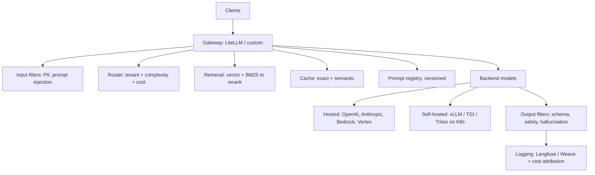
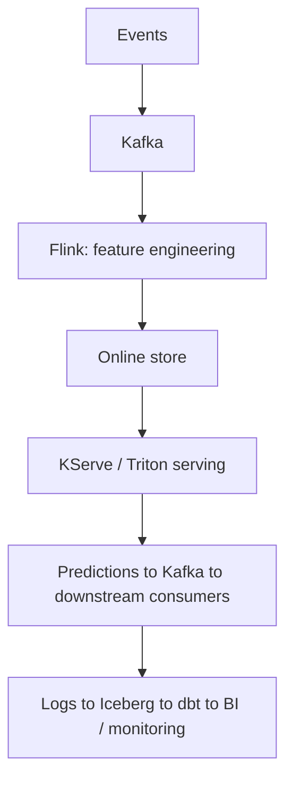

# 07 — The ML / AI Platform Architect Track — Part 1 of 2: Role, Mindset, ADRs, Reference Architectures, and Strategy


The earlier tracks take you from "I want to learn MLOps" to "I can lead the technical implementation of a serious ML platform." The architect track takes the next step: from senior implementer to architect.

This is a different jump than the earlier ones. Junior → senior is mostly technical depth. Senior → architect is mostly judgment, communication, and scope. The skills that got you to senior plateau here.

**Who this section is for:** Senior engineers (3–7 years in MLOps / ML platform / ML infra) who want to step up to staff / principal / architect roles. Or strong engineers who want to understand what architects do so they can become one, work effectively with one, or skip the title and operate at that altitude as a senior IC.

**A note on titles:** "ML Platform Architect," "Principal ML Engineer," "Staff ML Infra Engineer," "AI Platform Lead," "Head of ML Platform" — the title varies wildly across F50. Roughly: the person responsible for the ML platform's architectural integrity. I'll use "architect" throughout; substitute your company's title.

---

## Phase 1 — What an ML Architect Actually Does

The honest version.

### The Core Output: Decisions, Not Code

A senior MLOps engineer's daily output is mostly code, configuration, and pipelines. An architect's daily output is mostly:

- **Decisions** (recorded — ADRs, design docs)
- **Diagrams** (that hold up to scrutiny)
- **Written documents** (RFCs, strategy memos, migration plans, vendor evaluations)
- **Meetings where decisions get made** (and prep for those meetings)
- **Reviews** (code, design, vendor, security)
- **Occasional prototypes** that de-risk a decision

If your hands stop touching code entirely, you've gone too far. Most senior architects keep 15–25% of their week in code — usually on high-leverage prototypes or critical reviews. Below that, you become an ivory-tower architect. The single most common architect failure mode.

### Three Time Horizons

Architects think across three horizons simultaneously:

- **0–3 months:** what's shipping. Mostly observation.
- **3–18 months:** the roadmap. Most architect attention.
- **18–60 months:** strategy. Platform evolution, build-vs-buy, technology curve.

Senior engineers operate at 0–3. Staff add 3–18. Principal/architect adds 18–60.

### What You Stop Doing

- Writing whole pipelines yourself
- Owning specific production systems alone
- Closing tickets quickly
- The satisfaction of a shipped feature each sprint
- (Usually) primary on-call rotation

### What You Start Doing

- Writing — much more than you expect (30–50% of your time)
- Diagrams
- Reviewing other people's designs at depth
- VP/CTO conversations about budget and direction
- Vendor negotiations
- Saying "no" to projects that damage the platform's long-term shape
- Saying "yes" to projects that look bad short-term but pay off long-term

### The Architect's North Star

Every good architect optimizes for one thing: **the long-term technical health of the platform.** Not next sprint's velocity. Not team comfort. The platform's ability to keep meeting business needs five years from now.

This is in constant tension with short-term pressure, which is why the role is hard.

---

## Phase 2 — The Architect Mindset

Specific shifts in thinking.

### Trade-offs Are Always Real

Junior engineers think there's a "right answer." There usually isn't. There's a *least-bad answer for this specific context*. The architect surfaces the trade-offs:

> "Self-hosting an LLM with vLLM gives us cost predictability and data residency control but requires hiring two senior infra engineers and adds 6 months to time-to-value. Using Bedrock + Anthropic is faster but locks us in and triples our 3-year inference budget at projected volume. Both are reasonable; the right one depends on whether we believe we can hire."

The senior-architect gap shows here. Juniors say "self-hosting is better." Seniors say "self-hosting is better for us." Architects show the work.

### Reversibility Drives Process

A useful frame: **Type 1 decisions are irreversible. Type 2 can be undone.** Type 1 justifies heavy process; Type 2 should be made fast.

For ML architects:

- **Type 1 (heavy process):** primary cloud; primary feature store; build vs buy for serving infra; primary LLM provider; data residency strategy.
- **Type 2 (light process):** experiment tracker (MLflow vs W&B); HPO library (Optuna vs Ax); specific RAG framework.

The trap: treating Type 2 like Type 1 wastes months ("we must pick the perfect tracker!"). Treating Type 1 like Type 2 ("let's just go with SageMaker and see") burns careers.

### Optionality Has Value

Choices preserving future optionality are worth small upfront cost:

- Iceberg/Delta means you can change query engines without rewriting storage
- vLLM-style open serving means you can swap LLM providers
- Open formats (Parquet, Arrow, ONNX, GGUF, MLflow's open registry) mean you're not locked
- Standardizing on Arrow as the in-memory format means tools can be swapped
- OpenLineage and OpenTelemetry are open protocols you can build against

Proprietary formats and vendor-specific abstractions feel efficient short-term and constrain future architects. Architects who don't preserve optionality leave landmines.

### Boring Technology Is Often Right

The "choose boring technology" principle applies tenfold to ML architecture. Every new technology you adopt costs training, hiring, integration, debugging, monitoring, cognitive load.

Strong architects defend the boring choices: Postgres, S3, Airflow, MLflow, vLLM, FastAPI, KServe. They reach for the new hotness only when boring genuinely can't solve the problem.

In ML this is especially true — the field changes so fast that the "exciting new tool" gets eclipsed every 6 months. Boring tools persist.

### The Reversibility/Cost Matrix

|                | Low cost | High cost |
|----------------|----------|-----------|
| **Reversible** | Decide, try | Prototype, then decide |
| **Irreversible** | Decide carefully | Months, ADR, multiple reviews |

Calibrate your decision-making energy.

### The Frontier-Tool Paradox

A unique ML challenge: by the time you've evaluated a technology rigorously, the field has moved on. Two coping patterns:

1. **Adopt strategically slowly.** Let bleeding-edge tools settle for 6–12 months. Skip the early-version pain.
2. **Maintain an "experiments" track** — a separate budget for trying frontier tools at low stakes, decoupled from production commitments.

Most healthy ML platforms have both: stable production stack lagging the frontier by 1–2 years, experimental track riding the edge.

---

## Phase 3 — Architecture Decision Records (ADRs)

The single most important artifact.

### What an ADR Is

A short document recording a single architectural decision: why, what alternatives, what consequences. Lives in version control. Numbered sequentially.

### Why ADRs Matter

Without them, every decision gets re-litigated every six months. Original context is lost. New team members don't know why systems look the way they do. Architects spend their lives in meetings explaining ancient decisions.

With them:

- Decisions have provenance
- New team members get oriented faster
- The pattern of decisions reveals the team's principles
- Institutional memory survives turnover

### Standard ADR Structure

```markdown
# ADR-0042: Self-host an Open-Weights LLM for Internal Q&A

**Status:** Accepted
**Date:** 2026-04-15
**Decision-makers:** A. Architect, B. Lead, C. CTO
**Consulted:** ML Platform leads, Security, FinOps, Procurement

## Context

We currently spend $180K/month on Anthropic + OpenAI for internal LLM use cases:
employee Q&A, code completion, document analysis. Volume is growing 20% MoM.
At 12-month projection that's $3M/year for what is largely repeat queries
against internal documents.

Three options:
1. Continue with hosted providers
2. Self-host a 70B-class open-weights model on Bedrock (managed)
3. Self-host on our own Kubernetes cluster with vLLM

## Decision

We will self-host a Llama-3.1-70B-Instruct equivalent on our existing
Kubernetes platform with vLLM. Phase 1 covers internal Q&A and document
analysis. We will keep hosted providers for code completion (where their
quality lead remains material) and as fallback for self-hosted outages.

## Alternatives Considered

### Continue with hosted providers
- Pros: zero infra burden, frontier-quality, fast iteration
- Cons: cost trajectory unbounded; data residency concerns; vendor concentration risk

### Bedrock-managed open-weights
- Pros: similar cost reduction with less infra burden
- Cons: ~30% premium over self-hosted; still vendor-locked to AWS for inference

## Consequences

### Positive
- Projected $1.4M/year inference cost reduction at 12-month volume
- Full data residency control
- KV cache optimization tunable to our traffic patterns
- Multi-tenant quotas under our control

### Negative
- Required new headcount: 1 ML infra engineer + 0.5 SRE
- Estimated 4-month build-out before cutover
- We carry on-call burden for the inference cluster
- Quality on some long-tail prompts will be lower than GPT-4-class
  (mitigated by routing the long tail to hosted providers)

## Implementation Plan
1. Stand up vLLM cluster on existing K8s (Q2)
2. Pilot internal Q&A use case (Q2)
3. Migrate document analysis (Q3)
4. Build router for hosted fallback (Q3)
5. Decommission hosted spend for migrated workloads (Q4)
```

### Tips

1. **Write while fresh.** Six months later, you forget.
2. **Be honest about negatives.** ADRs with only positives are propaganda.
3. **Short.** 1–3 pages. Longer → separate design doc with link.
4. **Number and never delete.** Mark superseded; don't rewrite.
5. **Entry point for newcomers.** Tell new hires "read ADRs 1–N first."

### ADR vs Design Doc

| ADR | Design Doc |
|---|---|
| Records a decision | Proposes a design |
| 1–3 pages | 5–30 pages |
| Past tense | Future tense |
| Permanent | Often archived after build |
| With the decision-maker | Often by the implementer |

Most architectural work produces a design doc first, then an ADR records the final decision. Both have their place.

---

## Phase 4 — Reference Architectures for ML Platforms

The mental library an ML architect carries.

### The "Modern ML Platform" Reference (Circa 2026)

```
[Sources]            [Ingestion]           [Storage]              [Compute]
─────────            ──────────            ─────────              ─────────
App DBs   ──CDC──►   Debezium  ──┐
SaaS      ──API──►   Fivetran  ──┤
Files     ──FTP──►   dlt       ──┼─►  Lakehouse: Iceberg/Delta on S3  ──►  Spark / Ray / dbt
Events    ──SDK──►   Kafka     ──┘                │
                                                  ▼
                                          Feature pipelines (batch + streaming)
                                                  │
                                          ┌───────┴───────┐
                                          ▼               ▼
                                     Offline store   Online store
                                     (Iceberg)       (Redis/Dynamo/Bigtable)
                                          │               │
                                          ▼               │
                                     Training (Ray/K8s)   │
                                          │               │
                                          ▼               │
                                     MLflow Registry      │
                                          │               │
                                          ▼               │
                                     Serving (KServe/Triton/vLLM)  ◄──┘
                                          │
                                ┌─────────┴─────────┐
                                ▼                   ▼
                     [Online predictions]   [Batch predictions to warehouse]
                                                    │
                                                    ▼
                                            [Reverse ETL to operational tools]
```

Underlying:

- **Orchestration:** Airflow / Dagster + Argo for K8s workloads
- **Catalog:** Unity / Glue / DataHub
- **Observability:** Arize/Fiddler + Prometheus + OpenTelemetry
- **Quality:** dbt tests + Great Expectations + Evidently
- **Lineage:** OpenLineage end-to-end
- **Security:** PII tagging, column-level masking, RLS, OIDC for CI
- **Cost management:** per-team budgets, chargeback

Every F50 ML platform is some variant of this. Differences are tooling per slot.

### The LLM Platform Reference



The "AI Gateway" layer is increasingly its own product (Portkey, Helicone, AWS Bedrock's API, Anthropic's API). Architects decide whether to buy it or build it.

### The Real-Time ML Reference



Lambda-vs-Kappa choice: in 2026 the trend is "lakehouse as source of truth, with materializations into real-time stores for the hot path."

### The Cost-Conscious Architecture

When the brief is "do more with less":

```
Sources ─► dlt + cron (skip orchestrator if simple)
              │
              ▼
       Parquet on S3 (skip lakehouse if not needed)
              │
              ▼
       DuckDB / Polars for batch (skip Spark if data <500GB)
              │
              ▼
       Open-weights LLM via Modal / RunPod (skip cloud ML platform)
              │
              ▼
       FastAPI + simple K8s deploy (skip KServe overhead)
```

The architect knows when to scale down, not just up. A small ML team often benefits more from this stack than from a "modern ML platform" recreation. Recommending it when appropriate makes you look less ambitious — and is often right.

### The Federated ML Architecture

```
Domain A      Domain B      Domain C
─────────     ─────────     ─────────
Data          Data          Data
  │             │             │
  ▼             ▼             ▼
Features      Features      Features
  │             │             │
  ▼             ▼             ▼
Models        Models        Models
  │             │             │
  └─────────────┴─────────────┘
                │
                ▼
   ┌────────────────────────────┐
   │   Central Platform Team    │
   │  - Catalog                 │
   │  - Quality / compliance    │
   │  - Compute & storage       │
   │  - Governance              │
   │  - LLM gateway             │
   │  - Self-serve tools        │
   └────────────────────────────┘
```

Architect's role in a mesh: build the platform, define standards, enforce contracts, *don't* train models.

---

## Phase 5 — Architecture Frameworks (Survey)

### NIST AI Risk Management Framework (NIST AI RMF)

The most relevant framework for ML architects in 2026. Four functions:

- **Govern** — culture, accountability, oversight
- **Map** — context, requirements, risk categorization
- **Measure** — evaluation, metrics, monitoring
- **Manage** — prioritized response, communication, continuous improvement

Voluntary in the US but increasingly expected by regulators, insurers, large customers. Worth knowing the structure.

### EU AI Act Conformity Process

For "high-risk" AI systems (employment, education, credit, law enforcement, medical, critical infrastructure):

- Risk management system
- Data governance + training data documentation
- Technical documentation
- Record-keeping and logs
- Transparency information to deployers
- Human oversight
- Accuracy, robustness, cybersecurity

Architects in regulated F50s spend real time on this.

### Microsoft Responsible AI Standard

A practical, public-facing framework with checklists for impact assessment, fairness, reliability, privacy, inclusiveness, transparency, accountability. Useful template for building your own.

### TOGAF, DAMA-DMBOK, Zachman

Generic enterprise architecture frameworks. Worth knowing exist:

- **TOGAF** — ADM cycle, BDAT domains. Common in regulated F50.
- **DAMA-DMBOK** — vocabulary for data management as a discipline.
- **Zachman** — 6x6 matrix of architectural artifacts.

Don't structure your career around them, but if you target a F50 in finance, government, or pharma, having opinions about TOGAF helps.

### The C4 Model

The most useful diagramming framework. Four levels:

1. **System Context** — your system, users, external systems
2. **Container** — major deployable units
3. **Component** — parts within a container
4. **Code** — rarely needed

Most ML platform diagrams should be at Context or Container level. The discipline of C4 — explicit boundaries, consistent notation, named relationships — produces dramatically better diagrams than free-form whiteboarding. Use [Structurizr](https://structurizr.com/), Mermaid, or D2.

---

## Phase 6 — Build vs Buy for ML

The decision an ML architect makes most.

### The Frame

Every capability you need can be:

1. **Built** in-house
2. **Bought** as managed/SaaS
3. **Adopted** as OSS you operate
4. **Hybrid** — buy core, build integrations

### The TCO Calculation

What juniors see:

> "Self-hosted MLflow: free. Databricks-managed MLflow: $X/month. Save $Y/year."

What architects see:

> Self-hosted MLflow:
> - Engineering deploy: 3 weeks × $200/hr = $24K
> - Operations: 0.2 FTE × $300K loaded = $60K/year
> - Outage costs (estimated): $20K/year
> - Upgrades every 6 months: $10K/year
> - **True annual cost: ~$90K**
>
> Databricks-managed:
> - Subscription: $X/year
> - Light ops: 0.05 FTE = $15K
> - **True annual cost: $X + $15K**

Self-hosted "free" software has hidden costs roughly equal to a small engineer-fraction. Buying frees the engineer for higher-leverage work.

### Build vs Buy: The Decision Framework

Score each option on dimensions, weighted by context:

| Dimension | Notes |
|---|---|
| 3-year TCO | Hidden costs included |
| Time to value | Until usable in prod |
| Strategic fit | Does this differentiate the business? |
| Vendor risk | What if they vanish / double price? |
| Talent availability | Can you hire people who know this? |
| Operational burden | Hours/month to keep running |
| Switching cost | Cost to change in 3 years |
| Compliance / data residency | Esp. regulated |
| Integration | Cost of glue code |
| Roadmap alignment | Is the vendor building what we need? |

### When to Build

- **Core differentiation** (a recommendation company building its own recommendation infra)
- No off-the-shelf solution fits within tolerable customization
- You have team and time
- Capability is small enough to build well

### When to Buy

- **Commodity** capability (experiment tracking, monitoring, BI)
- Vendor's roadmap matches yours
- Capability is mature and well-understood
- Team's time is better spent on differentiated work

### When to Adopt OSS

- Need ownership (audit, compliance, customization)
- Cloud lock-in concern
- Operational skill exists
- Project is well-maintained (look at commit cadence, contributor diversity, governance)

OSS isn't free. Running vLLM, Kafka, Airflow, MLflow yourself is real ops. Savings vs SaaS materialize at scale.

### Vendor Lock-In Trap

Buy decisions accumulate lock-in:

- 30 engineers trained on Vendor X's quirks
- 200 integrations against Vendor X's APIs
- Complex pricing tied to Vendor X
- Switching means an 18-month migration

The buy wasn't wrong; you didn't preserve optionality. Architects mitigate by:

- Preferring open formats (MLflow, Parquet, ONNX, GGUF, Arrow)
- Thin abstraction layers when cheap (a thin client over the vendor's API)
- Periodic "what would migration look like?" exercise
- Tracking vendor health (financials, leadership, support quality)

### Specific ML Build-vs-Buy Decisions Worth Pre-Thinking

| Capability | Default | When to flip |
|---|---|---|
| Experiment tracking | Buy (W&B / Comet) or OSS-managed (MLflow on Databricks) | Build if scale + compliance push extreme |
| Model registry | OSS (MLflow) | Buy when integrated with your warehouse |
| Feature store | OSS (Feast) → custom for scale | Buy (Tecton) for fast time-to-value at scale |
| Vector DB | OSS (pgvector → Qdrant) | Buy (Pinecone) when ops capacity limited |
| LLM observability | Buy (Langfuse / Braintrust / Helicone) | Build when integrated with custom infra |
| Inference serving | Mix — Triton/vLLM (OSS) on managed K8s | Build only if differentiated |
| LLM hosting | Buy (Bedrock / Vertex / Anthropic / OpenAI) for general; self-host (vLLM) for hot path | Flip toward self-host at ~$100K/month threshold |
| Annotation tooling | Buy (Label Studio / Scale / Encord) | Build only if data has unique modality |

---

## Phase 7 — Migration Strategy

Most architect work at established companies is migration. Mastery of migration patterns is core.

### Why Migrations Fail

1. **Big bang cutovers.** Blast radius is the entire platform; rollback impossible.
2. **No measurable success criteria.** Migration "completes" when someone declares victory.
3. **Underestimating the long tail.** Easy 80% is 20% of work. Hard 20% (legacy, undocumented, niche) is 80%.
4. **Not committing to deprecation.** Two systems run in parallel forever. *More* complexity.

### The Strangler Fig Pattern

The canonical migration:

1. New system stands up alongside old
2. New use cases go to new
3. Old migrates piece by piece
4. Eventually old has nothing left; turn it off

Blast radius small at each step. Problem? Stop migrating; fix; continue.

### Parallel Run for ML Platforms

1. Build new platform alongside old
2. Run both — same training data, same features, both deploy
3. Compare predictions daily; track divergence
4. When divergence is consistently <0.5%, switch traffic
5. Keep old running 1–2 quarters as fallback
6. Decommission; reclaim costs

The validation step is what teams skip and what makes migration succeed. Without it, you don't know whether the new platform is "correct" until users complain.

### Specific ML Migrations You'll Architect

- **From SageMaker to a self-hosted K8s ML platform** (or vice versa)
- **From a single model server to KServe / multi-model serving**
- **From a hosted LLM (OpenAI) to a self-hosted LLM (vLLM + open-weights)**
- **From notebook-driven training to orchestrated pipelines**
- **From bespoke feature plumbing to a feature store**
- **From one cloud to another** (rare but real)
- **From a custom in-house ML platform to Databricks/SageMaker/Vertex** (rare but real)

Each has its own playbook. Common thread: validation harness, gradual cutover, explicit decommission criteria.

### The Migration ADR

Every serious migration deserves an ADR + design doc:

- **Scope:** what's in, out, deferred
- **Phasing:** sequence
- **Validation:** how each phase succeeds
- **Rollback:** how to abort
- **Decommission criteria:** what allows turning off old
- **Cost model:** during overlap and steady state
- **Timeline:** with explicit milestones

### The "We're Going to Be Done Soon" Trap

Migrations run long. Always. Plan for 1.5–2x your initial estimate. Resist scope creep ("while we're migrating, let's also…"). Anything that extends the timeline but isn't critical waits until *after*. Even good ideas. Especially good ideas.

---

## Phase 8 — Capacity Planning and Cost Modeling

Architects own cost. Literally — when the CFO asks why ML costs $4M/year, you answer.

### The ML Cost Model Skeleton

For each layer:

```
- Current monthly cost
- Volume drivers (TB stored, queries/day, requests/sec, tokens/sec, GPU-hours)
- Cost per unit
- Projection at 1.5x, 2x, 5x growth
- Sensitivity: what if a driver doubles?
```

Example for an LLM platform:

| Driver | Current | 2x growth | 5x growth |
|---|---|---|---|
| Hosted LLM tokens (M/month) | 500 | 1000 | 2500 |
| Hosted LLM cost | $5K | $10K | $25K |
| Self-hosted GPU hours (H100) | 720 | 1440 | 3600 |
| Self-hosted cost ($3.50/hr) | $2.5K | $5K | $12.6K |
| Vector DB | $1K | $2K | $5K |
| Storage | $0.5K | $1K | $2.5K |
| Observability tools | $1K | $1K | $1K |
| **Monthly total** | **$10K** | **$19K** | **$46K** |
| **Annual** | **$120K** | **$228K** | **$552K** |

When leadership asks "what happens if we onboard 3x more users," you answer in 5 minutes.

### FinOps Discipline

- **Tag everything.** Team, project, environment, cost center.
- **Showback / chargeback.** Each team sees what they cost. Chargeback creates strongest incentives.
- **Budgets + alerts.** Per-team monthly with 50/80/100% alerts.
- **Right-sizing reviews.** Quarterly review of cluster, instance, replica sizes.
- **Commitment management.** Reserved instances, Snowflake credits, Bedrock provisioned throughput — negotiate annually.

### The Hidden Costs in ML Specifically

- **Idle GPUs.** Endpoints with min-replicas > 0 at 3am. Notebooks left running.
- **Cross-region data movement.** Training cluster in `us-east-1`, data in `us-west-2`.
- **Inefficient HPO.** 200 trials, no early stopping.
- **Logs.** CloudWatch/Stackdriver can cost more than compute.
- **LLM token blow-ups.** A bug in the prompt template that adds 5000 tokens per request. Goes unnoticed until the bill arrives.
- **Vector index rebuilds.** Some setups rebuild from scratch every time; tiered incremental is much cheaper.

A weekly cost report flagging top movers prevents most. Architects own it.

### The 30% Rule

Most established ML platforms can cut 20–30% of cost without affecting outcomes. As an architect, you'll do this every 12–18 months — a focused project, not continuous nibbling.

---

## Phase 9 — ML Strategy

Translating business strategy into ML platform strategy.

### What ML Strategy Actually Is

A document/process answering:

- What business outcomes do we want in 1–3 years?
- What ML capabilities does that require?
- Current state — what's the gap?
- What investments close it?
- What's the sequencing?
- What does success look like, measurably?

### Diagnostic Phase

Before recommending strategy:

1. **Stakeholder interviews.** 10–20 people across the business — execs, product, sales, scientists, ICs.
2. **System inventory.** What pipelines, models, dashboards exist? Where does data live?
3. **Usage analysis.** Which models actually serve traffic? Which dashboards have users?
4. **Cost analysis.** Where's the money? Unit economics?
5. **Incident review.** What broke in the last year and why?

The diagnostic output is a 10–20 page document nobody asked for and everyone needs. It changes the conversation from "we should buy Databricks" to "the reason our recommendation team can't ship is that the feature pipeline has 87 hand-rolled jobs on top of a fragile lakehouse."

### Strategy Outputs

A typical ML strategy doc includes:

1. **Executive summary** (1 page)
2. **Current state** (diagnosis findings)
3. **Future state vision** (target architecture)
4. **Roadmap** (12–24 months, quarterly milestones)
5. **Investment plan** (people + tooling)
6. **Risk register**
7. **Success metrics**

### Saying No

A strategy doc is also a list of things you're *not* doing. Architects who can't say no produce strategies with 47 priorities, which is 0.

Pick 3–5 themes for the year. Everything else parked. New requests either fit a theme or wait. Frustrates people short-term, saves the platform long-term.

### Themes That Show Up in F50 ML Strategy in 2026

- **GenAI productization** — moving from experiments to revenue-generating products
- **GPU efficiency / cost** — most platforms are over-spending
- **Governance and the AI Act** — preparing for regulatory enforcement
- **Self-service ML** — reducing platform-team bottlenecks
- **Lakehouse consolidation** — unifying data + ML on Iceberg/Delta
- **Multi-region / data residency** — for global F50s
- **LLM platform unification** — one platform, many use cases

---

## You can now

- Distinguish an architect's output (decisions, ADRs, diagrams, strategy memos) from a senior engineer's, and calibrate how much of your week should stay in code to avoid the ivory-tower trap.
- Classify a decision as Type 1 (irreversible, heavy process) or Type 2 (reversible, decide fast) and apply the reversibility/cost matrix to allocate your decision-making energy.
- Write a defensible ADR — context, decision, alternatives with honest trade-offs, consequences, and an implementation plan — and know when a design doc should precede it.
- Reach for the right reference architecture (modern ML platform, LLM gateway, real-time ML, cost-conscious, federated mesh) and justify build-vs-buy with a TCO model that includes hidden ops cost.
- Plan an ML platform migration using the strangler-fig and parallel-run patterns, and run the diagnostic phase of an ML strategy engagement into a roadmap with explicit themes you are saying no to.
