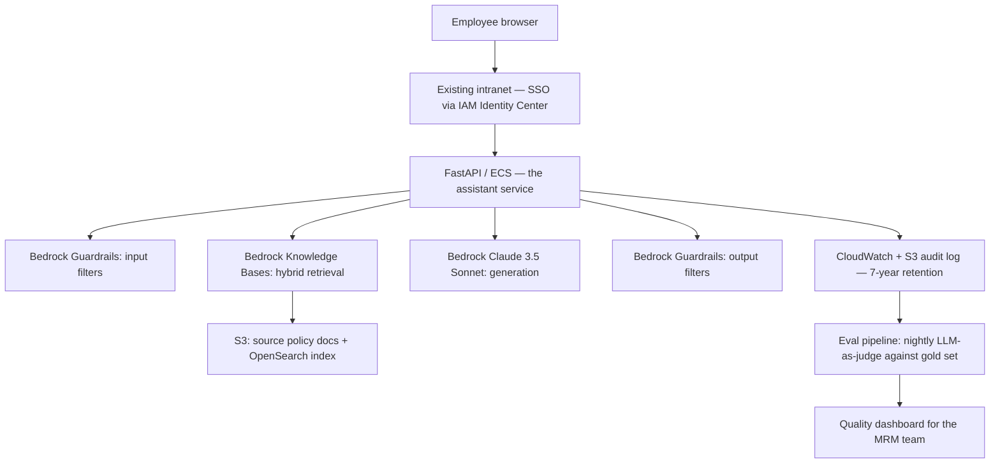
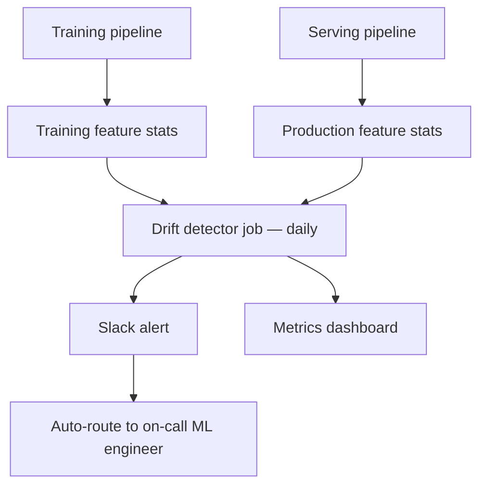
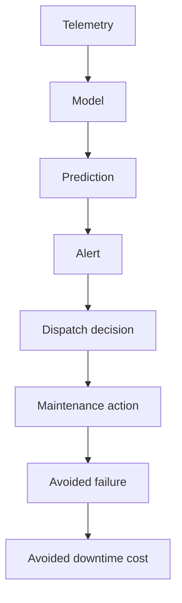
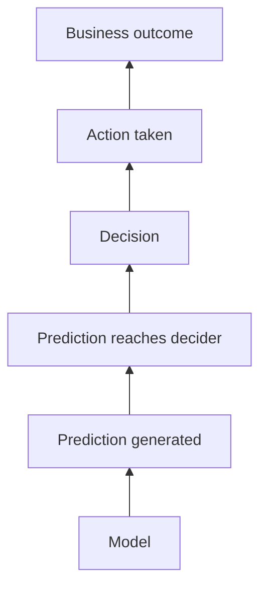

# 09 — Use Cases and Mental Models: How MLOps and ML SAs Actually Think

The earlier tracks teach the *tools*. This chapter teaches the *thinking*. Eight complex, realistic scenarios — each shown as a senior MLOps engineer / IC architect would approach it, then again as a senior ML Solutions Architect would approach it. You'll see two minds working on the same problem.

The goal: by the end, when you read a job description that says "thinks systematically about ML production problems," you know exactly what that means and can do it on demand.

## How to Use This File

Read each scenario actively:

1. **First read the problem statement** and pause. Spend 5 minutes thinking through how *you* would approach it.
2. **Then read the IC architect's approach.** Note what they ask, what they decompose, what they explicitly *don't* do.
3. **Then read the SA approach.** Note what's different — discovery, multi-vendor, customer politics.
4. **Compare to your initial take.** Where did the seniors think of something you missed? Add that pattern to your toolkit.

Each scenario uses the same structure:

- **The situation.** Real-feeling context.
- **What you're not told.** The questions a senior asks before designing.
- **IC architect's approach.** How an internal staff/principal MLOps engineer reasons.
- **SA approach.** How a customer-facing solutions architect reasons.
- **Where the two diverge.** What's distinctly different.
- **The proposed architecture.** Concrete answer.
- **What they'd worry about in month 3.** The post-launch concerns seniors anticipate.
- **The interview-ready summary.** A 2-minute version you could give in a system design round.

---

## Scenario 1 — The Bank That Wants a Generative AI Assistant

### The Situation

You're called into a meeting with the Chief Technology Officer of a US regional bank ($60B assets, ~5000 employees). They've watched competitors launch "AI assistants" for their employees — chatbots that answer policy questions, summarize loan applications, draft customer emails.

The CTO says: "Our board wants this live in six months. We have a small ML team (3 data scientists, 1 ML engineer). We're on AWS. Compliance is going to be a nightmare. What do we do?"

You have 60 minutes. You're expected to walk out with a plan.

### What You're Not Told

A senior practitioner notices the unspoken questions immediately:

- **Six months for what, exactly?** "Launch the assistant" could mean a 5-employee pilot or 5000-employee general availability. The scope determines feasibility.
- **What's the actual user pain?** Saying "AI assistant" is fashion-following. Who suffers today? Compliance officers buried in policy lookups? Loan officers re-typing customer letters? Customer support hunting through outdated wikis?
- **What's the regulatory posture?** US banks fall under SR 11-7 model risk management. The OCC, Fed, and FDIC examine model governance. Whatever you build is a "model" in their framework.
- **Data residency and training rights?** Is sending customer data to OpenAI even legal under their charter? What does their privacy notice say?
- **Whose budget is funding this?** The IT budget vs. a specific business unit budget changes how decisions get made.
- **What does failure look like?** A factual error in a board memo is bad. A wrong loan eligibility answer is potentially illegal.
- **Who's the executive champion?** If the board demanded this but no exec owns it, the project will die in committee.

### IC Architect's Approach

A staff MLOps engineer at the bank itself thinks like this:

**Re-frame the problem.** "Generative AI assistant" is not a problem; it's a solution. The actual problem is "we want to reduce the time employees spend hunting for information and drafting routine documents." That problem has many possible solutions; LLMs are one.

**Pick a single high-value pilot.** Trying to do "ten use cases simultaneously" with a 4-person team in 6 months is the path to nothing shipping. Pick *one* internal use case where:

- The information needed already exists in clean digital form (e.g., policy documents in Confluence, not handwritten 1990s memos in a basement)
- The cost of being wrong is bounded (informational, not transactional)
- The user population is small enough to control (50–200 internal employees, not all 5000)
- There's a willing champion and an existing pain point that's measurable

The right pilot at a bank is almost always: *internal policy and procedure assistant for a specific operational team* (e.g., the AML/BSA compliance group). Cleanly bounded, measurable (queries per day, time-to-answer), informational only.

**Treat it as a model under SR 11-7.** A generative model serving employees is a model in regulatory terms. Implications:

- Documented validation (held-out test set; the model card; the bias / fairness review)
- Ongoing monitoring (drift in inputs, quality regression of outputs)
- Override paths (the user must be able to escalate to a human; the response must clearly state "this is an AI summary, verify against source")
- Change management (any prompt change, model swap, or retrieval change is logged with reviewer)

This isn't optional. Build the governance scaffolding from day one or the model risk committee blocks deployment.

**Architecture choice: RAG over an open-weights model self-hosted.** Reasoning:

- *Closed-weights via API (OpenAI/Anthropic)*: faster time-to-value but legal review will choke on data egress + training rights. Possible with the enterprise SKUs (no training on customer data, BAA-equivalent terms), but compliance approval will eat 8–12 weeks.
- *Bedrock with Claude / Mistral*: middle ground. Stays in AWS, contractually clean for FSI. Likely the right starting point.
- *Self-hosted Llama / Mistral on SageMaker or vLLM on EKS*: gives data residency control. Adds 2–3 months of build-out for the team's first try.

Start with Bedrock for the pilot, with an explicit ADR that says "we'll evaluate self-hosting in month 4 if usage justifies the build-out." Don't over-build the platform on day one.

**Concrete components:**

- **Retrieval:** AWS OpenSearch with hybrid search (BM25 + vector). Source documents in S3 with controlled access via IAM. Embedded with a model from Bedrock (Titan or Cohere) to keep the data path inside AWS.
- **Reranker:** Skip in the pilot; add if quality requires it in month 2.
- **LLM:** Claude 3.5 Sonnet via Bedrock. Document the model version in every response so audits can trace.
- **Orchestration:** A FastAPI service deployed to ECS or App Runner (not EKS — overkill for the pilot).
- **Guardrails:** Bedrock Guardrails + custom prompt-injection filter + PII redaction on inputs.
- **Logging:** every prompt, retrieved passages, response, latency, user, timestamp into a CloudWatch + S3 archive. Retain 7 years (bank standard).
- **Evals:** A gold set of 100+ questions written with the compliance team. LLM-as-judge for nightly regression. Manual review of 5% of production traffic for the first 3 months.
- **UI:** Embedded in their existing internal portal (likely SharePoint or a custom intranet). Don't build a new app.

**What the IC architect refuses to do:**

- Promise GA in 6 months. The pilot ships in 4 months; GA is whenever evals + risk committee agree, probably month 9–12.
- Skip the eval harness for speed. Without it, the model risk committee can't approve.
- Build a "platform" before there's a single working use case. Premature platform-ization burns the budget.

**What they tell the CTO in the meeting:**

> "Six months is feasible for a 50-user pilot in one specific use case — likely internal policy lookup for the compliance team. Bank-wide assistant in six months isn't realistic. Here's the path: month 1, requirements + governance scaffolding; months 2–3, build with Bedrock; month 4, restricted pilot with manual review; months 5–6, expand based on what we learn. I'd staff this with the ML engineer + one senior eng I'd borrow + a compliance partner embedded part-time. I need a named executive sponsor."

### SA Approach (Cloud Vendor: AWS in This Case)

An AWS Senior Solutions Architect specialized in financial services walks in. They've done this scenario 30 times in the last year.

**Discovery first.** The SA's opening 20 minutes are questions, not slides:

- "Help me understand what's driving the timeline — is the board asking because competitors launched, or because there's a specific business case?"
- "Who else inside the bank is exploring generative AI today? Has anyone already started something?"
- "Walk me through your current AWS footprint — are you on Control Tower, do you have a data lake, what's your S3 footprint?"
- "Tell me about your previous ML projects — what's worked, what hasn't?"
- "How does model risk management treat your existing models? Walk me through the approval cycle."
- "What's your view on data residency for this — does your charter or your privacy notice constrain where customer data can go?"

The SA is collecting:

- The real timeline driver (board pressure ≠ real urgency)
- The political map (other internal AI projects = potential allies or rivals)
- The existing technical maturity (data lake exists → faster start; doesn't → slower)
- The risk culture (slow MRM cycle → architecture must accommodate)

**Position the right service stack.** The SA's job is to match AWS capabilities to the bank's situation honestly. For a regional bank with a small ML team, the SA likely lands on:

- **Bedrock** for the model layer (managed; FSI-compliant; no customer data goes to model providers under enterprise terms)
- **Bedrock Knowledge Bases** for managed RAG (saves the bank from building OpenSearch indexes and ingestion pipelines themselves)
- **Bedrock Guardrails** for safety filters
- **Bedrock Agents** if there's a use case that requires tool calls
- **Amazon Q Business** if the actual ask is an enterprise search assistant (sometimes Q is the right answer; an SA who only sells Bedrock and ignores Q is doing the customer wrong)
- **CloudWatch + CloudTrail** for the audit logs
- **VPC endpoints, KMS, IAM Identity Center** for the security overlay

**Surface the trade-offs explicitly.** The SA's leverage is in honest trade-off articulation:

> "There are three paths, and they're meaningfully different. First, Amazon Q Business — fastest, but constrained UI and limited customization. Second, Bedrock Knowledge Bases with a custom UI — middle path, what most banks in your bucket pick. Third, fully custom on Bedrock + OpenSearch + your own services — most flexibility, biggest build. Given your team size and timeline, option 2 is what I'd actually recommend. Here's why and here's where it might disappoint you in month 18 so you can plan for it."

**Bring in the right specialists.** The SA doesn't try to handle everything alone. They'd pull in:

- An AWS Financial Services Industry SA for the regulatory conversation
- A Generative AI specialist SA for the architecture nuances
- An Account Security SA for the IAM / encryption / VPC review
- A Customer Solutions Manager (post-sales) to plan the implementation roadmap

The SA orchestrates this team across 2–3 meetings, not 1.

**The deliverables the SA produces in the next 4 weeks:**

- A reference architecture diagram tailored to this bank
- A draft 6-month roadmap with milestone gates
- A cost model in a spreadsheet at three usage tiers
- An ADR-style decision document the bank's architects can adopt internally
- A pilot scope statement the bank's MRM team can pre-review
- A list of similar customers (anonymized) the SA can connect them with for reference

**What the SA refuses to do:**

- Commit to specific Bedrock model availability dates beyond what's publicly announced
- Pretend the data goes nowhere ever (be honest about Bedrock's data handling)
- Claim the timeline is fine when it isn't (the SA who oversells loses the next deal)
- Steer the bank away from a competitor option (Azure OpenAI + Microsoft 365 Copilot) if that's genuinely the right answer for the bank's Microsoft-heavy desktop environment

**What the SA tells the CTO:**

> "Six months to a pilot is realistic; six months to bank-wide is not. The reason most banks your size succeed is they pick one use case, ship to one team, prove the value, then scale. I've seen three regional banks do exactly this in the last year. I can connect you with two of them to compare notes. Here's the architecture I'd propose — let me walk through it, then we'll talk about your MRM cycle and what we need to do in parallel for the risk committee approval. I'll also bring in our FSI specialist for the next conversation because they'll have a more specific view on your examiner relationship."

### Where the Two Diverge

| Concern | IC Architect | SA |
|---|---|---|
| Scope of question | Owns the platform for years | Owns this customer's success this year |
| Vendor neutrality | Cares about lock-in long-term | Will recommend their company's product when it fits; honest when it doesn't |
| Day-1 vs Day-100 | Designs for Day-100; protects optionality | Helps customer ship Day-1; partners with CSM for Day-100 |
| Failure mode if wrong | Carries the on-call pager | Loses the next deal |
| Network leverage | Internal team, internal politics | Internal company specialists + customer references |

Both arrive at a similar architecture. The difference is in *how they got there* and *who they bring in*. The IC architect treats it as their problem; the SA treats it as the customer's problem to solve, with their help.

### The Proposed Architecture (Consensus)



### What They'd Worry About in Month 3

- **Hallucination on policy specifics.** RAG mitigates but doesn't eliminate. They'd want a "show me the source" link on every answer; tightening retrieval relevance; an automated check that the answer is *grounded* in the retrieved passages (a separate "faithfulness" eval).
- **Usage stalling.** If only 12 of 50 pilot users are active, the pilot has failed even if the model works. They'd want a usage dashboard from week 1 and an active change-management plan.
- **The MRM committee pushing back on the ongoing-monitoring story.** They'd want a clear "how we monitor drift in this kind of model" doc by end of month 1.
- **Cost surprise.** Bedrock token costs are predictable but can balloon if employees discover the chatbot is fun. Add per-user daily token budgets in the gateway from day 1.
- **A model deprecation announcement.** Claude 3.5 Sonnet won't be the current model forever. The gateway design must allow swapping with minimal blast radius.

### Interview-Ready Summary

> "The naive answer is 'build a chatbot.' The senior answer is: this is a model under SR 11-7, the bank has a small team, six months is realistic only for a scoped pilot. I'd start with one specific use case — compliance policy lookup is the safest — pick Bedrock as the model layer for FSI compliance and team velocity, build RAG with Bedrock Knowledge Bases plus a custom service for the controls, instrument hard from day one for audit + drift + quality, and treat the eval harness as a deliverable, not an afterthought. I'd refuse to commit to bank-wide GA in six months; that's the conversation I'd have with the CTO before the architecture conversation."

---

## Scenario 2 — The Online Retailer With Drifting Recommendations

### The Situation

A B2C online retailer ($2B GMV, mid-size by US standards) has run a recommendation system for 3 years. The model is a two-tower neural net trained nightly on the last 90 days of clickstream. It serves ~50M requests per day at sub-100ms P99 from a fleet of 30 GPU-backed instances.

The VP of Engineering escalates: "Our recommendation CTR is down 18% over the last 90 days. Our data science team says the model is fine — held-out test metrics are stable. But the business is losing $250K/week in attributed revenue. Find out what's wrong."

You're handed login access to their dashboards, the ML team's wiki, and the team's lead data scientist's calendar.

### What You're Not Told

- **Held-out test metrics stable but production worse.** This is the canonical symptom of a *test-train distribution mismatch*. The held-out set isn't representative of production traffic.
- **What changed in the last 90 days?** Promotional changes, site redesign, new traffic source, mobile app version, a new tracking SDK — any of these can shift the feature distribution without the team realizing.
- **Is CTR the right metric to be staring at?** What about conversion, AOV, downstream revenue? Sometimes CTR drops because the model is now ranking higher-converting items lower-CTR.
- **What's the labeling pipeline?** Clicks have well-known biases (position bias, selection bias). If the labeling pipeline silently changed (e.g., a new attribution window), the labels are now subtly different.
- **What's the freshness story?** Nightly training on 90 days — but features could be hours-old or seconds-old. A feature-freshness regression is a classic silent killer.
- **What's the canary / rollback path?** When the model gets replaced nightly, when did each version go live, and can you tie the CTR decay to specific deployments?
- **Who else has touched the system in 90 days?** Other teams might have changed how items are eligible, how the page is laid out, how the impression is logged.

### IC Architect's Approach

A staff ML engineer at the company thinks like a detective, not an inventor.

**First, look at the data, not the model.** The model is the wrong place to start. The team already said the test metrics are stable; that's a clue, not a dead end. It means the *training* problem is fine. The *production* problem is somewhere between training and production.

**Build a hypothesis tree:**

```mermaid
flowchart TD
    ROOT[CTR drop]
    ROOT --> C1[1. Training-serving skew — data shape differs in prod]
    C1 --> C1a[1a. Feature distribution shift]
    C1 --> C1b[1b. Feature freshness regression]
    C1 --> C1c[1c. Schema change in upstream features]
    C1 --> C1d[1d. New tenants / users not represented in training]
    ROOT --> C2[2. Label distribution shift — the labels themselves differ]
    C2 --> C2a[2a. Attribution window changed]
    C2 --> C2b[2b. New event filtering in the data pipeline]
    C2 --> C2c[2c. Position bias changed due to UI change]
    ROOT --> C3[3. Causal user behavior change]
    C3 --> C3a[3a. Macro shift — economy, season, competitor]
    C3 --> C3b[3b. Promotional change]
    C3 --> C3c[3c. Site redesign altered the natural CTR baseline]
    C3 --> C3d[3d. New traffic source with different intent]
    ROOT --> C4[4. Eligibility / serving change]
    C4 --> C4a[4a. Catalog changed — different items available to rank]
    C4 --> C4b[4b. Business rules now filtering out high-CTR items]
    C4 --> C4c[4c. Position/UI changes outside ML]
    ROOT --> C5[5. Measurement bug]
    C5 --> C5a[5a. Tracking SDK update lost events]
    C5 --> C5b[5b. Logging pipeline dropping a fraction]
    C5 --> C5c[5c. Definition of CTR changed]
```



For each branch, identify a cheap diagnostic:

- **1a:** PSI per feature on a recent week vs. training data. Anything > 0.25 is suspicious.
- **1b:** Compute feature freshness distribution. Compare to last quarter.
- **1c:** Diff the feature schema; compare null rates per feature over time.
- **2a:** Talk to the data engineering team. Ask "did anything change in the attribution layer."
- **3c:** Run the prior-version model in shadow against current traffic and see whether *it* also has degraded CTR. If yes → it's a population/UI shift, not the model.
- **4a:** Compare the universe of items being scored vs. last quarter.
- **5a:** Compare raw event volume to historical baselines.

**Run the diagnostics in parallel, not sequentially.** Each one is cheap; you don't need to know which branch is right before starting.

**The most-likely culprits, in order of base rate:**

1. **Tracking / event-log regression.** This is the most boring and most common cause. Verify event volume first.
2. **Feature freshness regression.** A streaming feature pipeline silently lagged by 12 hours, killing the recommendations for recent users. Common.
3. **Site redesign or business rule change.** Someone shipped a UI change that affected how impressions are counted.
4. **Catalog drift.** Holiday season brings new SKUs the model never saw.

**Once they find it, the actual senior move:** They don't just "fix the bug." They write the runbook, the alerting that would have caught it earlier, and the eval that turns this implicit assumption into an explicit one. The point of an incident isn't to fix; it's to make the same bug impossible next time.

**Reasoning about why it wasn't caught earlier:** The team monitors offline eval (still fine) but not production-feature-distribution-vs-training-feature-distribution drift. That's a monitoring gap; fixing it is the actual deliverable, beyond the immediate fix.

### SA Approach (Cloud Vendor With ML Observability)

An SA at a cloud vendor — or, more likely, at an ML observability vendor (Arize, Fiddler, Aporia) — encountering this in a customer engagement thinks:

**This is the canonical use case for ML observability.** The customer can fix this incident by hand. The customer cannot prevent the next one without observability instrumentation. That's the SA's wedge.

**Discovery questions:**

- "Walk me through how you monitor production today. What dashboards do you check daily?"
- "What's your current SOP when a model regresses? Who debugs it?"
- "How long has this been happening, and when did you notice?"
- "What's the gap between offline eval and online performance you typically see?"

The 90-day decay only-recently-noticed answer is gold: it tells the SA the customer's detection mechanism is broken, not just the model.

**The SA wouldn't pitch their tool first.** Even at a vendor, the SA earns credibility by debugging the immediate fire alongside the customer:

> "Let me help you diagnose this first. Then once we're on the other side, let's talk about what would have caught this in week 1 instead of week 12."

The SA might co-pilot:

- A live feature-distribution analysis using Arize / Fiddler's reference vs. production comparison
- A trace through a sample of recent low-CTR recommendations to identify which features look anomalous

When the root cause is found (say, the feature pipeline was lagging because a Flink job had been silently restarting), the SA pivots to the platform pitch:

> "Here's what our platform would have caught. Day 1 of the regression, feature freshness shifts > 2 stddev from baseline → page. You'd have known on day 1, not day 90. Let me show you how this would integrate with your current SageMaker setup."

**Multi-vendor honesty.** A strong SA acknowledges:

- "You could build this monitoring yourselves on Prometheus + Grafana + custom drift code. That's a real option."
- "SageMaker Model Monitor handles a subset of this natively. If you're a SageMaker shop, evaluate that first; we shine when you need cross-stack tracing and richer per-slice analysis."

**The deliverables:**

- A 1-hour POC against their production data showing where the platform would have caught the regression
- A proposed integration plan with their existing stack
- A cost model
- An ROI estimate: "The 90-day undetected regression cost you $3.2M in attributed revenue. Detection on day 1 would have capped that at $35K. The platform's cost is X."

### Where the Two Diverge

| Concern | IC Architect | SA |
|---|---|---|
| Primary deliverable | Fix the bug + write the runbook | Diagnose with the customer + sell the observability layer |
| Time horizon | Long-term system health | This deal cycle + customer adoption |
| Multi-vendor framing | Their stack, full control | Honestly compares to alternatives including build-it-yourself |
| Win condition | Bug fixed; future bugs caught earlier; team learning compounded | Customer adopts the platform; references the engagement |
| Risk | Carries on-call; will see the same bug again if not addressed | Customer churns if oversold |

### The Proposed Architecture (After Diagnosis)

Once root cause is found, the IC architect proposes:



Plus:

- **Feature freshness SLO** with burn-rate alerting
- **Counterfactual evaluation:** for a sample of production traffic, compute what the *prior* model would have predicted; compare. If the new model degrades but the old wouldn't have, the model is the problem. If both degrade, it's the world.
- **Online A/B testing infrastructure** so you don't ship a nightly model without measuring its lift vs. the prior version
- **Holdout group** receiving the prior model permanently as a baseline

### What They'd Worry About in Month 3

- **Alert fatigue.** A naive drift alert fires on every Black Friday. Calibrate thresholds per feature based on historical variance.
- **The "model decay vs. environmental shift" interpretation problem.** When drift fires, the team needs the playbook to determine which it is.
- **Catalog drift specifically.** Recommendation systems are uniquely sensitive to new items the model has never seen. A specific monitor for "fraction of impressions on items < 14 days old" should fire as the catalog turns over.

### Interview-Ready Summary

> "The clue is in the framing: offline metrics fine, online metrics degrading. That points away from the model and toward data or environment. I'd start with the cheap diagnostics: event volume, feature distribution PSI vs. training, feature freshness, schema diffs. In parallel I'd run shadow inference with the previous model version to separate 'model is wrong' from 'world has changed.' The likely cause based on incidence rates is a silent upstream regression — feature freshness, tracking pipeline, or schema. The real deliverable isn't the fix; it's making the same class of bug detectable on day 1 next time. That means drift monitoring tied to feature stats, freshness SLOs, online A/B with a permanent holdout. Without those, you'll see this exact incident every quarter."

---

## Scenario 3 — The Healthcare System Building Clinical Decision Support

### The Situation

A large US healthcare system (12 hospitals, 200+ clinics, ~30K employees) wants to deploy an ML model that helps emergency department triage. Specifically: predict which patients are likely to deteriorate within 4 hours of admission, so nurses can prioritize monitoring. The Chief Medical Officer is the executive sponsor; she's enthusiastic but wary because a previous "sepsis prediction" model deployment at a peer system was publicly criticized for systematic underperformance on certain demographics.

The CMO says: "We have data. We have a data science team that's built a model in a notebook. We need to go live. What do we need to do?"

### What You're Not Told

- **What does the existing model actually predict, on what data, with what performance per slice?** "We have a model" can mean many things.
- **FDA classification.** Is this a Software as Medical Device (SaMD)? Probably yes (it informs treatment decisions). What class — depends on risk tier.
- **How does it integrate into clinical workflow?** A model whose output is ignored is worthless; a model that fires constantly creates alert fatigue and worsens outcomes.
- **EHR integration.** Epic? Cerner? On-prem? Cloud? FHIR-ready or batch extracts?
- **HIPAA + BAA posture.** What's been authorized at this system?
- **What's the consent and de-identification posture for training data?**
- **What's the fairness landscape?** Race, ethnicity, socioeconomic status, language, gender, age — performance disparities by any of these will become a story.
- **Who validates clinically?** An ML team approving its own model is not enough. You need clinician validators.
- **What's the regulatory pathway?** Internal CDS (clinical decision support) has different obligations than billable diagnostic devices, but the line shifts.
- **How does the model handle "I don't know"?** Many clinical models silently produce confident outputs on out-of-distribution patients.

### IC Architect's Approach

A staff ML engineer at the healthcare system thinks more cautiously than in any other industry. The stakes are higher; the regulatory landscape is real; the prior peer incident is fresh.

**Frame: this is not "deploy a model." This is "design a clinical AI program."** A model in production at a hospital requires:

- Clinical validation (prospective study or rigorous retrospective with bias-aware design)
- Workflow integration that doesn't add cognitive burden
- Continuous monitoring including fairness slices
- A clear deactivation criterion
- Regulatory review (internal IRB, possibly FDA depending on classification)
- Clinician training
- Patient-facing transparency where applicable

A "go live in 6 months" timeline is unrealistic. A pilot in one hospital with one clinical service line, with parallel-shadowing for 3 months, is realistic.

**The architecture (technical layer):**

```
[Epic EHR] ──FHIR API──► [HL7/FHIR adapter] ──► [Feature pipeline]
                                                       │
                                                       ▼
                                              [Feature store with
                                              point-in-time correctness]
                                                       │
                                                       ▼
                                              [Model serving (low-latency,
                                              sub-2s for clinical UX)]
                                                       │
                                                       ▼
                                              [Output to Epic via SMART
                                              on FHIR app]
                                                       │
                                                       ▼
                                              [Clinician UI: clear
                                              "this is AI-generated,"
                                              actionable, dismissable]
                                                       │
                                                       ▼
                                              [Clinician feedback capture]
                                                       │
                                                       ▼
                                              [Audit log: every prediction,
                                              every feature, every model
                                              version, every clinician
                                              action — retained per HIPAA]
```

Plus a parallel **monitoring + governance plane:**

```
[Predictions] ──► [Slice-aware performance dashboards
                  by age, race, sex, payer, language,
                  acuity level, service line]
                          │
                          ▼
                  [Weekly clinical review board]
                          │
                          ▼
                  [Quarterly model risk review]
                          │
                          ▼
                  [Bias and fairness audit
                  (annual, external if possible)]
```

**The non-technical layer is more important than the technical layer.**

- **Workflow integration design.** The CDS appears in the EHR at the moment the nurse is making the triage decision, with the right friction. Not too easy to dismiss (otherwise ignored); not so prominent it derails workflow. This is co-designed with clinicians, not engineers.
- **Phased rollout.** One hospital → two service lines → three months of shadow mode (model fires, no UI to clinicians) → silent mode (clinicians see, can't act) → active mode with monitoring.
- **Clinical champion.** A respected attending physician at each pilot site is on the team. Without them, adoption fails regardless of model quality.
- **Failure mode planning.** When the model says "high risk" on a patient who is fine, what's the cost? When it says "low risk" on a patient who deteriorates, what's the cost? Asymmetric; the threshold should reflect that, with clinician input.

**Specific concerns the IC architect raises with the CMO:**

1. "The notebook model is not deployable. It's a *candidate*. We need to validate it on held-out cohorts including under-represented demographics before deciding to deploy."
2. "We need a fairness audit before launch. The peer system was burned by this; we won't be."
3. "We need parallel-shadow mode for at least 3 months before activating clinical UI. This isn't optional; it's how we earn the right to deploy."
4. "We need FDA classification clarity from your regulatory affairs team. CDS that adjusts treatment likely falls under 21st Century Cures Act exemption; CDS that diagnoses doesn't. Get the determination in writing."
5. "Budget for a clinical AI governance function. This isn't one engineer's part-time job; this is a small ongoing team with clinicians."

### SA Approach (Cloud Vendor or Healthcare AI Vendor)

An SA from AWS, GCP, Azure, or a healthcare-specialized vendor (Epic's own AI tooling, Aidoc, Innovaccer, Komodo) approaches this differently.

**Discovery first, with a stronger ethical filter.** A good SA in healthcare actively pushes back on speed:

> "Before we talk architecture, let me ask: what's your IRB protocol look like? What's your fairness audit plan? Where's your clinical champion? These are not optional in this domain. If they're missing, the architecture conversation is premature."

A weak SA pitches the cloud stack and moves to a deal. A strong SA earns the trust by being the adult in the room about clinical AI risk.

**The reference architecture (if AWS):**

- HealthLake or a custom FHIR store for the data layer
- SageMaker (or Bedrock if generative; not generative in this case) for training + serving
- SageMaker Model Monitor + Clarify for slice-aware monitoring + bias detection
- CloudTrail + dedicated logging for HIPAA-grade audit
- AWS Comprehend Medical for any NLP on clinical text
- The HITRUST CSF certification posture for the AWS account

**Specialists pulled in:**

- AWS Healthcare and Life Sciences industry SA
- AWS Public Sector if this is a state-funded health system
- A privacy specialist for the BAA review
- The customer's Epic-side technical team (or whichever EHR vendor)

**The SA's specific value-add:** Reference customer connections. "I can introduce you to two other large health systems running similar workloads. Both have been through what you're about to go through. One of them can walk you through their FDA conversation in detail."

This connection is often more valuable to the customer than any technical artifact the SA produces.

**The SA's specific warnings to the CMO:**

- "Your customer base across hospitals likely has different demographic profiles. Performance audited on hospital A may not translate to hospital B. Plan for per-site validation."
- "Epic's own AI features (the Hello World, the Cognitive Computing platform, the deterioration model in particular) overlap with what you're proposing. Have you compared your candidate model to what Epic ships? Sometimes the answer is to use Epic's, not build your own."
- "FDA pathway clarity is a hard prerequisite. Engage your regulatory affairs team now, not later."

### Where the Two Diverge

| Concern | IC Architect | SA |
|---|---|---|
| Primary partner | Internal clinical and regulatory teams | Customer's clinical and regulatory teams, plus vendor specialists |
| Make-or-buy framing | Build it (we have the team) | Compare to vendor solutions (Epic, Innovaccer); recommend honestly |
| Liability framing | Carries personal stake; will be in the room if it fails | Brings warnings; ultimate liability is the customer's |

Both end up with similar architecture. The difference is the SA more strongly questions "should you build at all," while the IC architect, by virtue of being inside, often takes "we're building" as given.

### The Proposed Architecture

As above. Critical layers: clinical workflow integration, slice-aware monitoring, governance plane, phased rollout, parallel shadow.

### What They'd Worry About in Month 3

- **Alert fatigue eroding adoption.** If the model fires too often or too softly, clinicians ignore it. Continuous workflow research.
- **A specific demographic showing worse performance.** Will happen; the question is whether monitoring catches it. The fix is often retraining with re-weighting, or a deployment hold pending model improvement.
- **EHR vendor releasing their own competing model.** Common; the strategic question becomes "do we replace ours with theirs?" Plan for it.
- **A clinical adverse event tied to the model.** The communication plan, the regulatory notification, the patient-family handling — all should be pre-built.
- **The "concept drift" of clinical practice.** Treatment protocols change. The model's predictions become subtly wrong as practice evolves. Quarterly retraining is the minimum.

### Interview-Ready Summary

> "Clinical AI is a different category. The architecture matters but it's not the hard part. The hard part is: clinical validation including fairness audit, FDA classification clarity, EHR integration that doesn't worsen workflow, parallel shadow for months before activation, slice-aware monitoring, and a governance plane with clinical champions. I'd refuse to deploy a notebook model. I'd phase rollout one hospital and one service line at a time. I'd budget for an ongoing clinical AI governance function — not a side project. And I'd push the CMO to consider whether the EHR vendor's own solution should be the path before building."

---

## Scenario 4 — The Streaming Service That Wants Personalized AI-Generated Trailers

### The Situation

A streaming media company (~50M paying subscribers) wants to use generative video models to produce personalized trailers — different 30-second cuts for different user clusters. The Chief Product Officer says: "Netflix is testing this; we need to ship in 9 months." The team has 2 ML engineers, 1 ML researcher (PhD, came from a research lab), and access to a $5M annual ML platform budget. Models would run on user request when a user views a title, or pre-generated by cluster.

### What You're Not Told

- **What's the actual user-facing experience?** "Personalized trailer" can mean many things: re-edited from existing footage (cheap, mostly editing), or generated from scratch (current-frontier expensive). Massive cost and quality difference.
- **Rights and content licensing.** Generating new footage of an actor likely violates SAG-AFTRA agreements and right-of-publicity laws. Re-editing existing footage is licensed differently.
- **Latency budget.** Real-time on view (sub-2-second) is *currently impossible* with frontier generative video. Pre-generated by cluster (offline batch) is feasible.
- **Quality target.** Internal eyeball test or A/B test against original trailer?
- **Existing recommendation stack.** Likely a sophisticated recommendation system already. The "personalized trailer" might fit as a layer on top, not a separate system.
- **What does the research team's prototype look like?** Often the prototype assumes capabilities that don't transfer to production (e.g., 5-minute generation latency, which is fine for research demos and impossible for production).
- **Legal posture on generative AI.** Most large media companies have strict policies; some prohibit generative video involving actors entirely.

### IC Architect's Approach

A staff ML engineer at the media company immediately reframes:

**"Personalized trailer" is a product idea, not a technical spec.** Four candidate executions:

1. **Re-edited from existing trailer footage.** Pre-existing clips reordered, captioned differently, scored differently per cluster. Cheap, fast, no novel generative concerns.
2. **Re-cut from feature footage.** Use the actual movie's footage to generate new montages. Better personalization, IP-cleaner if licensed.
3. **Generative voice / subtitle overlay.** Same visuals, different generated voiceover / subtitle tone per cluster. Generative but bounded.
4. **Fully generative video.** Current state of the art (Veo, Sora-class models) for short clips. Expensive, slow, fraught with rights issues, quality risky.

The senior move is to push the product team to clarify *which* of these they actually want. They likely want #2 + #3 but said "AI-generated trailers" because it sounded ambitious in the board memo.

**The architecture for re-edited / re-cut (option 2 + 3):**

```
[Catalog]
     │
     ▼
[Asset pipeline: pre-extracts scenes, shots, sentiment per shot,
 actor labels (subject to legal review), captions]
     │
     ▼
[Asset store: every shot tagged, embeddable, retrievable]
     │
     ▼
[User cluster pipeline: builds per-cluster preferences from
 viewing history, ratings, demographics]
     │
     ▼
[Trailer generator: given (title, user cluster), assembles
 shots into a 30-second trailer with rules + an ML ranker
 for shot selection]
     │
     ▼
[Quality eval: automated checks (length, pacing, dialogue
 intelligibility) + human spot-check for new titles]
     │
     ▼
[Pre-generated trailer cache per (title, cluster) — served
 from CDN]
     │
     ▼
[A/B testing layer: this trailer vs. original]
```

**Why pre-generated (offline batch) over real-time:**

- Generative video at user-request latency is currently impossible at quality
- $50\text{M users} \times 10\text{K titles} \times \text{per-user} = 500\text{B}$ trailers; impossible
- $200 \text{ clusters} \times 10\text{K titles} \times 1 \text{ trailer/cluster} = 2\text{M}$ trailers; feasible
- Cluster-based personalization captures 80% of the value at 0.001% of the cost
- A/B tests can measure cluster-level lift cleanly

**The hard parts the IC architect surfaces:**

1. **Legal review must precede technical build.** Right-of-publicity, SAG-AFTRA, music licensing. Engage entertainment counsel in week 1.
2. **Asset extraction is the hard work.** Tagging scenes, shots, music cues, dialogue beats across the catalog is months of pipeline work.
3. **The quality bar for trailer cuts is high.** Bad cuts read as "cheap" and damage the brand. Likely needs a human-in-the-loop QA step initially.
4. **Cluster definition matters more than the model.** If clusters are bad, the personalization is bad regardless of the cut quality.
5. **Measurement is hard.** Trailer A/B testing has long delays (the metric is title engagement weeks later). Need an instrumented test infrastructure.

**What the IC architect refuses to commit to:** "9 months to GA." They'd commit to: "9 months to a controlled experiment on 5% of users on 50 titles in 3 user clusters with a clear go/no-go decision at month 12."

### SA Approach (Cloud Vendor With Media-Vertical Strength)

An SA from AWS Media Services, GCP Media & Entertainment, or Azure for Media — or from a generative video platform vendor (Runway, Synthesia for enterprise) — thinks:

**Discovery focused on what's actually feasible:**

- "Walk me through your current asset pipeline. How are shots tagged today?"
- "What's your CDN setup? Where are trailers stored?"
- "What's your legal posture on generative video involving talent?"
- "What's your A/B testing maturity? Can you measure trailer-level lift cleanly?"

**The SA likely guides them away from frontier generative video** because:

- The quality at the frontier is *just* barely consumer-acceptable
- The cost is enormous
- The legal landscape is volatile

**Instead, the SA proposes:**

- Re-edited trailers via traditional ML + rule-based assembly (most of the value, none of the legal risk)
- Generative voiceover for personalization (better-bounded legal risk; can use existing IP-clean voice synthesis)
- Fully generative video reserved for a small "exploration" track to follow the technology curve

**The SA pulls in:**

- A Media & Entertainment industry SA who has worked with peer streaming services
- A Generative AI specialist SA for the frontier capability discussion
- The customer's content legal team early
- A cost-optimization SA because the batch pre-generation pipeline can balloon

**The SA's value-add:** They've seen what other streamers tried. They know:

- Who's experimenting (publicly and not)
- What didn't work and why
- What the customer's competitive position is in this experiment

**The SA's specific warnings:**

- "Generative video involving identifiable actors will probably trigger a SAG-AFTRA conversation. Your peers who tried this all had to renegotiate."
- "The latency story for real-time generation isn't there yet. Pre-generation is the only path that ships in 9 months."
- "Measurement is the unsung hard problem. Your A/B testing maturity will determine whether you can prove ROI on this — and if you can't prove ROI, the board kills it in year 2."

### Where the Two Diverge

Both arrive at similar architecture (re-edit + cluster-based + offline pre-generation). The SA pushes harder on what *not* to build because they've seen failures across customers. The IC architect, embedded inside, can sometimes be carried along by internal enthusiasm.

### The Proposed Architecture

As above. Pre-generated, cluster-based, A/B tested, with a small frontier-research track that follows the technology without committing product to it.

### What They'd Worry About in Month 3

- **Talent/rights complications halting deployment.** Worth a kill-switch design.
- **Cluster definitions stale.** User behavior shifts; re-cluster quarterly.
- **The "9-month timeline" politically holding.** Realistic communication with the CPO about the experiment-not-GA framing.
- **Cost of the asset pipeline.** Frame extraction + shot tagging at catalog scale runs into millions in compute. Tier the catalog (top 1K titles get full treatment; long tail gets cheap treatment).
- **Frontier model commoditization.** The cost of generative video falls 10x/year. Build the pipeline to swap models, not lock in one.

### Interview-Ready Summary

> "Reframe first: 'personalized AI trailer' is product fashion; the actual question is which of four executions — re-edit, re-cut, generative voiceover, fully generative video. Frontier generative video doesn't ship in 9 months at quality. The right answer is option 2 + 3: cluster-based pre-generation, re-edited from licensed footage, with generative voiceover bounded to non-talent. Latency dictates offline batch, not real-time. Measurement is the unsung hard problem. Legal review precedes architecture. I'd commit to a controlled 5%-of-users experiment in 9 months, not GA."

---

## Scenario 5 — The Industrial Manufacturer With Predictive Maintenance That Doesn't Save Money

### The Situation

A heavy-equipment manufacturer (~$40B revenue, global) has run a predictive maintenance ML program for 4 years. They've deployed models across 12 product lines, monitoring telemetry from 200K+ deployed machines. Internal metrics say the models are accurate. But the new CFO escalates: "We've spent $35M on this program and I can't find $35M of value. Either find the value or kill it. You have 60 days."

You're brought in as a consulting senior MLOps engineer (or SA at a manufacturing-specialized vendor).

### What You're Not Told

- **What "accurate" means.** AUC on a held-out set is not the right metric for predictive maintenance.
- **What's the value chain from prediction to action?** A model that predicts perfectly but doesn't lead to a maintenance action saves nothing.
- **Who pays for unplanned downtime today?** The customer, the manufacturer, or shared? The economics drive everything.
- **Is the model output being used?** Predictions can flow to a dashboard nobody opens. This is the most common pathology.
- **What's the alternative cost of action?** A false-positive maintenance call may cost more than the avoided failure.
- **What's the financial accounting of "value"?** "Saved $X" can be measured many ways; the CFO has a specific one.

### IC Architect's Approach

A staff ML engineer hired as a consultant first does not look at the models. They look at the *causal chain*:



Each arrow is a potential leak. The senior diagnostic walks the chain backward from "saved money" until they find the break.

**Common leaks:**

1. **Predictions don't reach dispatchers.** The dashboard exists; no one opens it. Or the predictions arrive too late to act.
2. **Predictions reach dispatchers but they ignore them.** Low precision = alert fatigue.
3. **Dispatchers act on predictions but maintenance crews don't have parts on hand.** Parts inventory not synced with predictions.
4. **Maintenance happens but the failure wasn't going to happen.** The model has good recall, terrible precision. Saving nothing; spending lots.
5. **Failures get avoided but customers don't perceive it.** Value not captured in pricing or contract.
6. **Value is captured, but on the customer's side, not the manufacturer's.** The manufacturer paid for the program; the customer got the benefit. Bad contract structure.

**Leak #6 is the most common diagnosis at heavy-equipment manufacturers.** The manufacturer pays for the ML program; the customer keeps the avoided downtime savings. Unless there's a service contract with shared incentives ("Power by the Hour" model, performance contracting), the manufacturer captures little of the value.

**The senior MLOps engineer's actual deliverable:**

- A walk-through with the CFO showing exactly where in the chain the value leaks
- A proposal: either restructure the commercial offering (service contracts that share avoided-downtime savings) or kill specific product lines where the chain is broken
- Models that are accurate but whose value is captured on the customer side are *technically working but commercially failing*. The fix is commercial, not technical.

**This is the kind of finding that gets a senior MLOps engineer promoted.** Most engineers would look at the models. The senior looks at the value chain and finds the answer is in pricing.

### SA Approach (Industrial / IoT Vendor or Cloud SA)

An SA at AWS IoT, Azure Industrial IoT, or a manufacturing-specialized vendor (PTC ThingWorx, Siemens MindSphere) walks in thinking:

**This is a value-capture problem disguised as a technical problem.** The SA's leverage is in the conversation with the CFO about commercial structure, not in the architecture.

**Discovery:**

- "Walk me through how a predictive maintenance alert turns into revenue. What's the contract structure?"
- "Who pays for downtime today? Who pays for parts? Who pays for the maintenance crew?"
- "What percentage of alerts get acted on?"
- "What percentage of acted-on alerts prevented real failure?"

The SA quickly arrives at the same diagnosis. Their angle:

> "This is a contract structure problem, not a technical one. Several of your peers have moved to performance-based contracts where they share avoided-downtime savings. That's where the ROI lives. The technology is necessary but the contract is the lever."

**The SA likely doesn't sell more cloud here.** The customer has the technology. They need a commercial pivot. The honest SA says so — and earns credibility for the next deal, which might be three years later when the commercial pivot creates new data needs.

### Where the Two Diverge

Both arrive at the same answer. The IC architect, embedded, has more credibility to push the commercial recommendation because it costs the manufacturer money to act on. The SA's recommendation can be dismissed as self-serving ("of course they want us to do contract restructure that requires more services"). The IC architect has to actually carry the recommendation through, which is harder.

### What They Tell the CFO

> "Your models work. Your dispatch is acting on them. But the value of avoided downtime is captured by your customers, not by you. Unless you restructure the commercial offering to share that value, this program will never show up in your P&L. Here's the contract pattern that works — let's run the math on three product lines and see if it pencils out. Three options: kill the program, restructure contracts on top product lines, or hold steady. My recommendation is restructure on top two lines and let the rest go."

### What They'd Worry About in Month 3

- **Sales team resistance.** New contract structure means longer sales cycles. The CRO will fight.
- **Customer pushback.** Customers used to free benefit will resist sharing savings. Need to position carefully.
- **Measurement complexity.** Performance contracts require validated measurement of avoided downtime. The ML platform now must produce regulator-grade evidence, not just dashboards.

### Interview-Ready Summary

> "Don't look at the model. Walk the value chain backwards from 'P&L impact.' At heavy-equipment manufacturers running predictive maintenance, the most common diagnosis is that the model works but value is captured by the customer, not the manufacturer. The fix is contract restructuring — performance-based offerings that share avoided downtime — not better models. The senior MLOps engineer's job here is to land the commercial diagnosis with the CFO, not to retrain anything."

---

## Scenario 6 — The Multi-Region Deployment of a Single LLM Endpoint

### The Situation

A SaaS company (~$200M ARR, B2B) has built an LLM-powered feature into their product. They've been running it on a single AWS us-east-1 endpoint, serving customers globally. As the feature has rolled out in EU, customer pushback is intensifying:

- Latency for EU customers is 200ms+ vs. 60ms for US customers
- A few EU customers have raised "data residency" concerns
- A subset of EU customers (regulated industries) are blocking purchase until data stays in EU

The VP of Engineering says: "We need to be EU-resident in 90 days for two named customers. And then probably APAC by Q4."

### What You're Not Told

- **What model are they using?** Self-hosted? Hosted (OpenAI, Anthropic, Bedrock)?
- **What data flows through?** Customer prompts only, or also customer documents (retrieved context)?
- **What's their GDPR posture today?** DPA in place? SCCs? Data processing agreement specifying processors?
- **What's the EU customer's actual definition of "data residency"?** Strict (no byte crosses the border) or pragmatic (no data at rest in non-EU; transient processing OK)?
- **Are the named customers in regulated industries (banking, healthcare, public sector)?** That changes the residency bar.
- **What's the integration with the customer's data?** SSO? Webhooks? Customer-managed keys? Bring-your-own-cloud (BYOC) requirements?
- **Cost tolerance?** EU AWS regions cost ~10–20% more; running redundant capacity costs more again.

### IC Architect's Approach

A staff ML platform engineer at the SaaS company thinks:

**Define the residency requirement precisely.** "EU data residency" can mean:

1. **Soft residency:** customer data is stored in EU; processing may transit non-EU
2. **Hard residency:** no data byte ever leaves EU, including in transit, in logs, in CI/CD artifacts
3. **Sovereignty:** the cloud provider's EU subsidiary, with EU-citizen-only staff, GDPR Article 48 protections, no US CLOUD Act exposure

These are different. The named customers' actual contracts dictate which.

**The architecture by tier:**

For **soft residency** (most common):

- Deploy the same model serving stack in eu-west-1
- Route EU customers to the EU endpoint via geographic routing (Route 53 or CloudFront)
- Keep model artifacts replicated cross-region
- Logs and metrics aggregated to a central observability stack (US is OK if access-controlled)
- Cost increase: ~30%

For **hard residency:**

- Replicate model artifacts to EU
- Logs and metrics stay in EU only (separate observability stack)
- CI/CD pipelines triggered from EU runners
- Customer support tools (engineer access for debugging) restricted by region
- Build pipelines must avoid building in non-EU regions
- Cost increase: ~50–80% (separate everything, low utilization)

For **sovereignty:**

- AWS European Sovereign Cloud (in development) or Azure EU Sovereign Cloud
- Significant lead time; some customers will require this in 2027+
- Plan for it but don't build until customers contractually require

**Key decisions:**

- **Don't fork the codebase.** Same code path, configuration determines region.
- **Region routing happens at the edge.** Customer identity → region. New customers in regulated industries default to EU residency if they're EU-based.
- **Logging policy by region.** Logs from EU stay in EU. The observability platform supports multi-region or you split.
- **LLM provider choice.** If using Bedrock, model availability differs by region (some models only in us-east-1 / us-west-2). May force a model swap in EU. Document.
- **Build for the future APAC requirement now.** A general "region pluggable" model serves you for the second expansion too.

**Process / governance layer:**

- **Per-region SoR.** A clear statement of what's in each region.
- **Audit-ready DPA.** Updated to reflect the new architecture, named subprocessors.
- **GDPR DPIA.** Data Protection Impact Assessment for the new processing.
- **CMK option.** Customer-managed encryption keys for the regulated EU customers.

### SA Approach (Cloud Vendor: AWS in This Case)

An AWS Senior SA who has done dozens of these calls walks the customer through:

**Discovery — what do the two named customers actually require?**

- "Have you seen the actual contract language? Is 'EU data residency' a defined term?"
- "Are these customers in financial services or healthcare? If yes, expect harder requirements."
- "Are they asking for FIPS endpoints or HIPAA-eligible services? Different category."
- "What's their position on customer-managed keys via KMS?"

**The SA brings reference architectures:**

- A multi-region SaaS reference for AWS (which has existed since 2018)
- A specific GenAI multi-region pattern with Bedrock
- A residency pattern that distinguishes data-at-rest, data-in-transit, and metadata

**The SA's honest reality-check:**

> "90 days for the EU endpoint is feasible if you accept some short-term ugliness. 90 days for *clean* multi-region with proper observability split and ops on-call coverage in EU time zones is not. Plan a phased rollout: customer-visible endpoint at day 90, internal cleanup over month 4–6."

**The SA brings specialists:**

- AWS Privacy team SA for GDPR and Schrems II
- AWS Security SA for the IAM / KMS / VPC story
- AWS Bedrock specialist for model availability per region
- AWS Customer Solutions Manager to plan the multi-region operational ramp

**The SA's strategic frame:**

> "This is your first multi-region build, not your last. Asia is coming in Q4; potentially Canada; potentially Australia for some customers. Design now for n regions, even if you only deploy two. Reference architectures from us assume this."

### Where the Two Diverge

The IC architect knows the specific quirks of their codebase and team capacity; the SA knows what other companies have done and what patterns work. Together they cover both. The SA pulls in capabilities the customer doesn't know to ask for (the AWS Sovereign Cloud roadmap, Bedrock regional model availability matrix, CMK patterns for LLM workloads).

### The Proposed Architecture

```
[Global edge: CloudFront / Route 53] ──► [region-aware routing]
        │
        ├──► [US: us-east-1 + us-west-2 active/active]
        │      ├─► API Gateway / ALB
        │      ├─► Service (ECS / EKS)
        │      ├─► Bedrock (Claude in us-east-1)
        │      └─► Per-region observability (CloudWatch + central aggregation in US)
        │
        └──► [EU: eu-west-1 + eu-central-1]
               ├─► API Gateway / ALB
               ├─► Service (same image)
               ├─► Bedrock (Claude in eu-central-1 — model availability per region)
               └─► EU-local observability (no cross-region logging)
        │
        └──► (Future: APAC: ap-northeast-1 + ap-southeast-2)

[Customer identity → region mapping table]
[Per-region DPAs and subprocessor lists]
[Region-aware feature flags for "data residency" customers]
```

### What They'd Worry About in Month 3

- **Operations burden of 2x regions.** On-call coverage. Alert routing. Incident response with regional implications. Plan for the team's hours.
- **CI/CD pipelines.** Building images in one region, deploying to another, must not cross residency lines for hard-residency customers.
- **Drift between regions.** Same code, different runtime characteristics. A perf regression in EU might not show in US monitoring.
- **The Bedrock model gap.** A new model lands in us-east-1 first. EU customers wait. Customer success has to communicate this.
- **The next customer's "Brazil residency" ask.** Latin America presents region scarcity. Plan now.

### Interview-Ready Summary

> "First clarify 'EU data residency' — soft vs. hard vs. sovereignty are different builds. For most SaaS this is soft residency: customer data in EU, processing transit is OK. Architecturally: region-aware edge routing, same codebase, per-region observability for hard-residency customers, regional DPAs and subprocessor lists, customer-managed keys as an option. 90 days for customer-visible launch is feasible; 90 days for clean multi-region ops is not. I'd plan now for APAC even if shipping EU first — the cost of region-pluggability is small; the cost of refactoring later is large."

---

## Scenario 7 — The Trading Firm Whose Models Lose Money After Promotion

### The Situation

A medium-sized algorithmic trading firm ($5B AUM, 100 quant employees) has a curious problem. Their backtests look phenomenal. The models pass all their offline metrics. They promote to live trading. Within 2–4 weeks, the models systematically underperform expectations — sometimes losing money. After 6 months, they typically degrade to break-even or worse. The firm has noticed this pattern across 30+ model deployments in the last two years.

The CIO says: "Find what we're doing wrong. We've burned $40M in alpha decay since 2024. The board is asking if we should fire the entire quant team."

### What You're Not Told

- **Backtest-live skew details.** What's the specific gap? Time horizons, market regimes, sample sizes?
- **Are these models trained on the same data they're tested on?** Look-ahead bias is the silent killer in quant.
- **What's the data source?** Vendor-provided historical bars vs. self-collected tick data?
- **Is the firm's own activity affecting the market?** Market impact often goes uncaptured in backtests.
- **How is execution modeled?** Slippage, latency, partial fills — backtests almost always under-model these.
- **What's the model size relative to the team?** 30 deployments per 100 quants is a lot; maybe overproduction without enough scrutiny per model.
- **Who validates a model before deployment?** Self-validation by the author is the canonical bug.
- **What's the survivorship bias in their backtest universe?** A backtest on currently-listed stocks misses delisted companies.

### IC Architect's Approach

A senior ML / quant engineer reframes:

**This isn't an MLOps problem; it's a research integrity problem.** The MLOps platform is fine. What's failing is the *evaluation discipline*. They've over-fit to their backtest, and the backtest is systematically biased optimistic. Common causes:

1. **Look-ahead bias.** Features computed using data that wouldn't have been available at the time. Catastrophic in quant; very common when feature pipelines aren't point-in-time correct.
2. **Survivorship bias.** Universe excludes companies that went bankrupt.
3. **Selection bias in training data.** Training on "interesting" periods only.
4. **Multiple-testing problem.** 30 deployments selected from 3000 attempts means the deployed ones are likely flukes.
5. **Backtest costs underestimated.** Real costs (slippage, market impact, financing) much higher than backtest assumed.
6. **Regime change.** Market behavior changed; the model trained on a regime that's gone.
7. **Self-induced alpha decay.** The firm's own trading causes the inefficiency to disappear.
8. **Capacity miscalculation.** Model works on $100M, fails on $1B.

**The senior practitioner builds a research-integrity audit framework:**

```
For each historical model deployment:
  - Recompute backtest with strict point-in-time correctness
  - Apply realistic costs (slippage model, market impact)
  - Apply survivorship correction
  - Compare to actual live P&L
  - If still optimistic gap remains, examine selection bias
```

This audit usually reveals one of the above as the dominant cause. At many firms, **look-ahead bias from a shared feature library** is the answer — features computed centrally for convenience but using current-day data when used in backtests for old dates.

**The fixes:**

- **Point-in-time-correct feature computation.** As-of joins enforced at the library level. Tests that fail if any feature value looks like it was computed with future data.
- **Out-of-sample discipline.** A reserved time period that the team *cannot* see during development. Run on it once, when deploying. Multiple touches mean the data is no longer out-of-sample.
- **Pre-registration of models.** Before backtesting, the team specifies the model. Changing it requires explicit documentation. Reduces multiple-testing.
- **Independent validation.** The model author doesn't approve. A separate validator group does, with their own backtest infrastructure.
- **Live-trading paper-trading parallel.** Before real money, paper trade for 30+ days. Live conditions, no capital at risk.
- **Capacity testing.** Simulate the model at 10x the intended size.

The MLOps platform fixes:

- Feature store with point-in-time correctness enforced by API design (you cannot ask for a feature without specifying an as-of timestamp)
- Backtest infrastructure with realistic cost models built in
- Model deployment governance — independent validator sign-off required
- A/B-by-randomized-rotation between models, not by sequential deployment

### SA Approach (Cloud Vendor / Quant-Specialized Vendor)

A vendor SA in this scenario is rare — quant firms typically build their own platforms. But cloud SAs do show up for the infrastructure side.

If an SA is in this conversation, their approach is more humble: they probably know less about quant specifics than the customer. They lead with:

> "I want to make sure I'm helpful without pretending I know your domain better than you. What's distinctive about your firm's approach? Where does our platform fit in?"

The SA's value is providing infrastructure primitives:

- Feature store with as-of joins (Feast or a cloud-native equivalent)
- Lakehouse with time travel (Iceberg) for reliable historical analysis
- Compute on demand for backtests (SageMaker, Vertex Training, Databricks Jobs)
- Reproducibility infrastructure (Git-tagged Docker images, signed model artifacts)

The SA refers to the research-integrity issues but defers to the customer on the diagnosis. This humility is appropriate; quant firms know their own demons better than vendor SAs.

### Where the Two Diverge

The IC architect can speak to the actual research-integrity audit. The SA helps with the platform components but doesn't drive the diagnosis. In specialized industries (quant, biotech, defense), domain expertise lives inside; vendors support.

### The Proposed Architecture

The platform side:

```
[Tick data lake] ──► [Iceberg tables with time travel]
                              │
                              ▼
                  [Feature store with as-of API
                  — feature requests must include as_of_time]
                              │
                              ▼
                  [Backtest infrastructure
                  — realistic cost model built in
                  — out-of-sample reservation enforced]
                              │
                              ▼
                  [Pre-registration system
                  — model spec signed before backtest run]
                              │
                              ▼
                  [Independent validator queue]
                              │
                              ▼
                  [Paper trading sandbox — 30+ days mandatory]
                              │
                              ▼
                  [Live deployment with capacity ramp]
                              │
                              ▼
                  [Live performance attribution
                  — actual vs. backtest by source]
```

### What They'd Worry About in Month 3

- **Cultural resistance.** Quant teams hate being audited. Especially by an MLOps platform team. Expect pushback; need executive air cover.
- **The "we already do that" trap.** Teams will claim they handle look-ahead bias; until you verify in code, assume they don't.
- **The independent validator bottleneck.** Suddenly the validators are the rate-limiter for the team. Plan for capacity.
- **Continued alpha decay even after fixes.** Some of the historical decay was real (regime change, capacity, self-induced). Fixes won't recover that capital; they'll prevent the next loss.

### Interview-Ready Summary

> "This isn't an MLOps problem; it's a research integrity problem. Backtest beats live consistently means the backtest is systematically biased — look-ahead, survivorship, multiple testing, cost underestimation. The fixes are mostly cultural and process: point-in-time feature enforcement, pre-registration, independent validation, paper trading, capacity testing. The platform supports this — as-of feature store, time travel on data, reproducibility — but the platform isn't the bottleneck. The CIO's question 'should I fire the quant team' is the wrong question; the right one is 'should I install an independent validation function.'"

---

## Scenario 8 — The Public Sector Agency Deploying ML for Benefit Eligibility

### The Situation

A US state agency (Department of Children and Family Services) wants to use ML to prioritize child welfare investigations. The model would score incoming reports for risk and recommend which to investigate first, given limited caseworker capacity. There's enthusiasm in agency leadership; there's also pre-existing concern because a peer agency's similar deployment generated a federal civil rights complaint over racial disparities in outcomes.

The agency's Chief Data Officer says: "We want to do this responsibly. We have $4M and 18 months. What does responsible look like?"

### What You're Not Told

- **Who's actually affected?** Families being investigated, children at risk, caseworkers. Each has different stakes.
- **What's the alternative to the model?** "Don't use one" isn't truly the baseline — caseworkers prioritize today, just unsystematically. Implicit bias in human prioritization is real.
- **What's the legal landscape?** Federal civil rights law (Title VI), state laws on automated decision-making, FERPA if school data is used, IDEA if special education data, COPPA, state-specific child welfare statutes.
- **What's the political climate?** Child welfare is high-profile; any deployment will be in the news.
- **What's the data?** Self-reported, biased by who reports (suburbs vs. urban; concerned neighbors vs. anonymous tips). Past investigations themselves shaped by historical bias.
- **What's the deployment philosophy?** Decision support (caseworker decides, model informs) vs. decision automation. Massive difference.
- **What advocacy and oversight groups need to be consulted?** Public sector ML cannot be designed in private.
- **What's the failure mode?** False positive: family investigated unnecessarily, real harm to family stability. False negative: child harmed who could have been protected.

### IC Architect's Approach

A senior ML engineer hired by the agency thinks first about *whether* to build this, not how.

**The honest question: should this be built?** The peer agency's complaint is a warning. The data is biased. The stakes are extreme. The senior practitioner brings this question to the CDO openly:

> "Before we design, I want to put on the table: should we build this? I want to give you my honest read after I've talked to caseworkers, advocacy groups, and looked at the data."

This is itself a senior move. The IC architect doesn't just take "build it" as given.

**Assuming the answer is "yes, build it carefully," the architecture is decision-support, not decision-automation:**

```
[Hotline intake]
        │
        ▼
[Feature extraction: standard intake fields + historical
 case data if applicable]
        │
        ▼
[Model: risk score on 0-100 scale]
        │
        ▼
[Caseworker UI: score is *one input* among many.
 Caseworker sees:
   - Score with confidence interval
   - Top 3 factors driving the score (with plain-language
     explanations)
   - "This score should not be the sole basis for decisions"
   - History of caseworker overrides on similar scores
 Caseworker manually selects the case for investigation
 or not.]
        │
        ▼
[Decision logged — model score vs. caseworker decision]
        │
        ▼
[Slice-aware monitoring: investigation rates, outcome
 rates, error rates by:
   - Race / ethnicity
   - Income proxy (zip code)
   - Language spoken at home
   - Disability status
   - Geographic region]
        │
        ▼
[Quarterly external audit by university partner]
```

**Critical design choices:**

1. **Score is advisory, not deterministic.** The caseworker decides; the model informs. Decision-automation is unacceptable here.
2. **Explanation is mandatory.** Every score has reasons in plain language. Caseworker can challenge.
3. **Slice-aware monitoring from day one.** Any model that performs differently across protected groups is paused immediately.
4. **External audit.** A university or independent body audits annually. Findings are public.
5. **Caseworker override is the safety net.** Override rates are themselves monitored; if caseworkers override a slice systematically, the model has a problem.
6. **No discretion-removing thresholds.** A score of 95 doesn't trigger automatic investigation; it gets caseworker attention. Caseworker decides.
7. **Data limits.** No use of features known to proxy for race (zip code as a feature, for instance, is fraught; sometimes excluded entirely even at cost to accuracy).
8. **Sunset clause.** The deployment has a stated review point. If by year 2 the program hasn't demonstrated benefit without disparate impact, it sunsets.

**Governance layer:**

- Community advisory board with affected-population representation
- Caseworker advisory board
- Legal review with state attorney general
- Open documentation: every aspect of the model published (data sources, features, performance, fairness audit)
- Family rights notice: families investigated have the right to know what factors were used

### SA Approach (Public Sector / Government Cloud Vendor)

An SA from AWS GovCloud, GCP for Government, Microsoft Azure Government, or a public-sector-specialized vendor (Palantir for government, Microsoft Power Platform, Salesforce Public Sector Cloud) thinks:

**Discovery, but in public sector mode:**

- "Who are the stakeholders that need to be consulted? Have you mapped them?"
- "What's the procurement pathway? RFI / RFP / cooperative purchase?"
- "What's the state AG's position on automated decision-making?"
- "Has anyone been engaged from the federal Children's Bureau or ACF?"
- "What's the state's open-records and FOIA posture?"
- "What's the labor relations situation with caseworkers?"

**Public sector SAs work differently.** The deal closes slowly (12–36 months). Procurement is rigid. Procurement officers care about FedRAMP, StateRAMP, CJIS, fairness affidavits. The SA's job is to navigate this landscape.

**Vertical-specific warnings the SA raises:**

- "Several states have passed or are considering laws specifically about automated decision-making in human services. Check your state's calendar."
- "There's pending federal guidance from HHS on AI in child welfare. Talk to your federal partners."
- "Several peer states ended up rolling back deployments after public pressure. We can connect you to those agencies for lessons learned."

**The SA is more skeptical of the deployment than the IC architect might be.** They've seen the political fallout. They will openly say:

> "We can absolutely architect this. But before we do, are you sure this is the right use of $4M? Many agencies in your position invested in caseworker support tooling — better documentation, faster intake forms, decision aids that aren't ML — and got more measurable outcome improvement with less risk. I want you to consider that option before we lock in."

**The SA also raises:**

> "There's a real chance this deployment generates a lawsuit regardless of how carefully you build it. Have you engaged your state AG to validate the architecture is defensible?"

This kind of pushback is what separates strong SAs from order-takers. The SA who happily sells the deal is sometimes selling the customer into a public-relations and legal disaster.

### Where the Two Diverge

The IC architect, embedded, will live with the deployment. The SA, somewhat removed, brings cross-state pattern recognition and is freer to recommend "consider not building." Both should arrive at the same conclusions; the SA gets there faster because they've seen the pattern repeat.

### The Proposed Architecture (If They Decide to Proceed)

As above. Decision support, not automation. Slice-aware monitoring. External audit. Community oversight. Sunset clause.

### What They'd Worry About in Month 3

- **Caseworker adoption.** Caseworkers may resist a model that scores their cases. Without their buy-in, the model is ignored. Co-design from day one.
- **The "score arms race."** Reporters call in describing situations to elicit specific scores ("if I report this, will the family get investigated?"). The model becomes gameable.
- **Federal Children's Bureau audit.** Likely. Plan for it.
- **A high-profile case where the model recommended low priority and tragedy occurred.** Real risk. Communication plan must exist in advance.
- **A high-profile case of disparate impact.** Real risk. Sunset criteria must be clear.

### Interview-Ready Summary

> "Public sector child welfare ML is the highest-stakes scenario in this chapter. The first question is whether to build at all, not how. If the answer is yes: decision support not automation; slice-aware monitoring from day one across race, income, language, disability, region; mandatory explanations; community oversight; external annual audit; sunset clause; caseworker override as safety net; no proxy features for race; transparency to affected families. Architecture is straightforward; governance is the work. The SA's leverage is to ask 'should you build at all' on behalf of the customer — sometimes the right answer is no, and the SA earns trust by saying so."

---

## Cross-Cutting Mental Models

Across all eight scenarios, certain reasoning patterns repeat. Internalize them.

### The Value-Chain Walk

When ML investments don't produce business value, walk the chain backward:



The break is rarely at the model. It's usually at "decision," "action," or "outcome captured by the right party."

### The Discovery-Before-Architecture Rule

You cannot architect responsibly without knowing:

- What the actual problem is (not what they said)
- Who the user is
- What the cost of being wrong is
- What the politics are
- What the regulatory landscape is
- What the alternative is (including doing nothing)

Architects who skip discovery design for a fantasy customer. SAs make this mistake more often than IC architects, because of deal pressure; IC architects can fall into it from familiarity bias.

### The "Should You Build This At All" Question

Strong senior practitioners ask this regularly:

- The bank's GenAI assistant: maybe Q Business is right, not custom
- The streaming service's personalized trailers: maybe re-edit is right, not generative
- The manufacturer's predictive maintenance: maybe contract restructure, not better models
- The state agency's child welfare ML: maybe non-ML decision aids

Engineers who can't ask this question are tools; engineers who can are advisors.

### The Phased Rollout Default

Almost every scenario benefits from:

- **Shadow mode** (model runs, no user-facing output) — long enough to validate
- **Silent mode** (model output visible to internal teams, not users) — long enough to build confidence
- **Canary** (% of users) — calibrate
- **Active mode** (full rollout) — only after the prior phases succeeded

The instinct to skip phases is the instinct that produces fired engineers.

### The Slice-Aware Monitoring Reflex

Aggregate metrics hide subgroup failures. Always slice:

- Demographic protected attributes
- Customer cohort / tier
- Geography
- Device / channel
- Time-of-day, day-of-week
- New user vs. existing

The first place a model breaks is almost always a slice. Aggregate looks fine for months while a specific group is being served badly.

### The "What's the Reversibility?" Question

For any architectural decision:

- If we go this way and we're wrong in year 2, what does it cost to undo?
- Multi-region: hard to unwind
- Vendor lock-in: hard to unwind
- Model architecture choice: easy to swap
- Feature definition: depends on consumer count

Spend decision energy proportional to reversibility cost.

### The "Day 100" Concern

Most architectures look fine on Day 1 and fail on Day 100. Senior practitioners always ask:

- When the team that built this leaves, can the next team operate it?
- When usage grows 10x, what breaks first?
- When the vendor deprecates the model we use, how do we swap?
- When the regulator audits us, what evidence do we produce?

Day-100 thinking is what separates the architect from the engineer.

### The Honest Trade-off Articulation

Junior: "X is better."
Senior: "X is better for *this* context because of A and B. Y would be better in context Z. We're choosing X knowing it costs us C in scenario D, which we accept because of E."

The second is the architect's voice. Practice it.

### The "What I'd Refuse to Commit to" List

Strong seniors are clear about what they will not promise:

- Specific dates beyond what's publicly announced
- Feature parity with a competing product they don't own
- Performance claims they haven't measured on the customer's actual workload
- Cost guarantees for usage patterns they don't yet understand

The refusal to over-promise is what builds trust over years.

---

## What to Take Away

After working through these scenarios, you should be able to:

1. **Read a problem statement and identify what's missing.** What questions a senior asks before designing.
2. **Decompose by value chain.** Where in the chain does this problem actually live?
3. **Choose between several reasonable architectures and articulate why.** With trade-offs.
4. **Reason about phased rollout, slicing, reversibility, Day-100 concerns.** Default patterns.
5. **Know when to say "don't build this at all."** The rarest and most senior move.
6. **Communicate the answer differently as IC architect vs. SA.** Same content, different framing.

This is the thinking the F50 senior ML interviews actually test. Tools are commodity; thinking is durable. The candidates who interview well at this level have done this kind of reasoning hundreds of times. You build the muscle by working through scenarios like these, by debating them with peers, and by *practicing the discovery conversation* with a friend playing the customer.

When you've done that for 30+ scenarios, the senior interview becomes routine. Until then, every interview is a fresh shock.

Pick one of these scenarios this week. Write your own version of the architecture, then compare to the proposed one. Find one thing you missed. Add it to your toolkit. Then do another next week.

## You can now

- Read a vague executive request ("build an AI assistant," "personalized trailers," "predictive maintenance") and surface the unspoken scoping, regulatory, and political questions a senior asks *before* proposing an architecture.
- Walk a value chain backward from business outcome to model to locate where an ML investment actually leaks value — and recognize when the fix is commercial or process, not technical.
- Choose between several reasonable architectures and defend the choice in an architect's voice: the context it fits, the cost it accepts, and the scenario in which a different choice would win.
- Apply the recurring reflexes — phased rollout, slice-aware monitoring, reversibility weighting, and Day-100 thinking — to any deployment decision on demand.
- Frame the same recommendation two ways, as an internal IC architect and as a customer-facing SA, and know when the most senior move is to say "don't build this at all."

## Try it

Pick one scenario from this chapter and run the discovery conversation out loud. Recruit a friend or colleague to play the executive (CTO, CMO, CFO, CDO) and give them only the two-paragraph "situation" for that scenario — nothing else. Set a 20-minute timer and conduct discovery: your only job is to ask questions, not to propose anything. Have your partner improvise answers. When the timer ends, write your own "What you're not told" list and a single scoped-pilot recommendation from what you learned, then compare against the chapter's version. Score yourself on two things: which discovery questions the chapter asked that you didn't, and whether your scoped pilot was narrower than the executive's original ask. Repeat with a second scenario a week later; the gap between your list and the chapter's should shrink each time.
