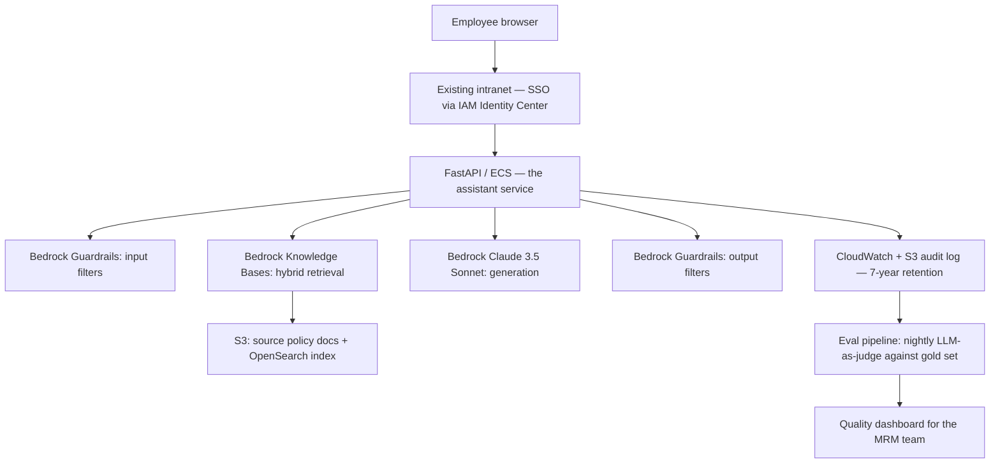
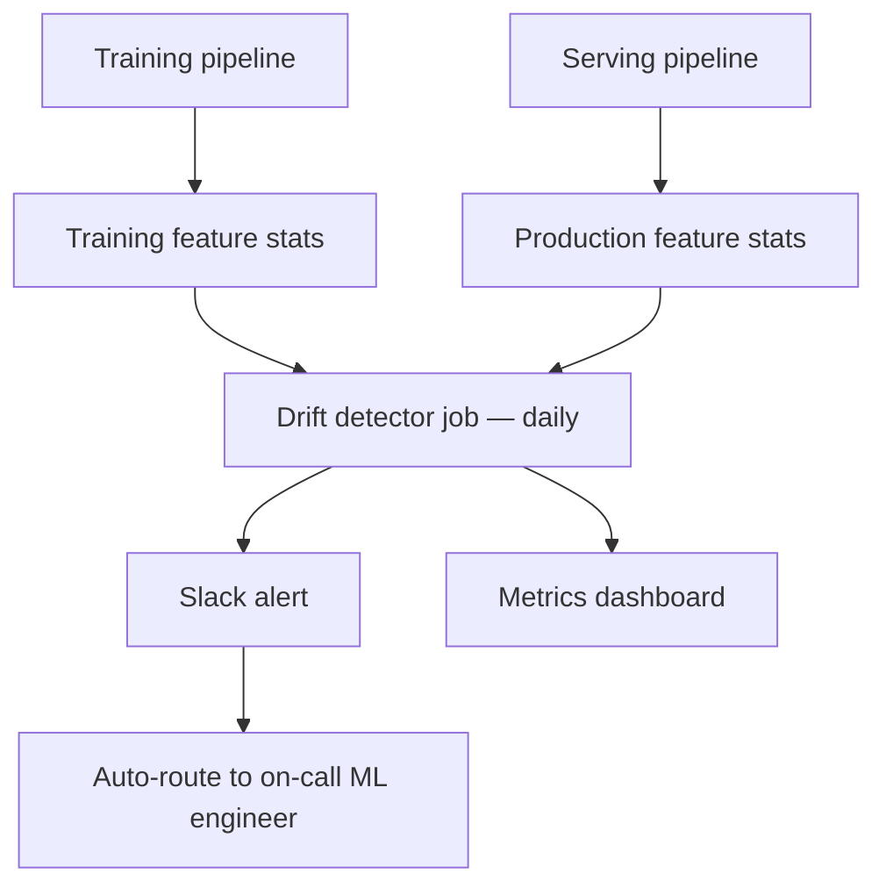

# 09 — Use Cases and Mental Models: How MLOps and ML SAs Actually Think — Part 1 of 3: The Bank GenAI Assistant & The Drifting Recommender

The earlier tracks teach the *tools*. This chapter teaches the *thinking*. Eight complex, realistic scenarios — each shown as a senior MLOps engineer / IC architect would approach it, then again as a senior ML Solutions Architect would approach it. You'll see two minds working on the same problem.

The goal: by the end, when you read a job description that says "thinks systematically about ML production problems," you know exactly what that means and can do it on demand.

## How to Use This File

Read each scenario actively:

1. **First read the problem statement** and pause. Spend 5 minutes thinking through how *you* would approach it.
2. **Then read the IC architect's approach.** Note what they ask, what they decompose, what they explicitly *don't* do.
3. **Then read the SA approach.** Note what's different — discovery, multi-vendor, customer politics.
4. **Compare to your initial take.** Where did the seniors think of something you missed? Add that pattern to your toolkit.

Each scenario uses the same structure:

- **The situation.** Real-feeling context.
- **What you're not told.** The questions a senior asks before designing.
- **IC architect's approach.** How an internal staff/principal MLOps engineer reasons.
- **SA approach.** How a customer-facing solutions architect reasons.
- **Where the two diverge.** What's distinctly different.
- **The proposed architecture.** Concrete answer.
- **What they'd worry about in month 3.** The post-launch concerns seniors anticipate.
- **The interview-ready summary.** A 2-minute version you could give in a system design round.

---

## Scenario 1 — The Bank That Wants a Generative AI Assistant

### The Situation

You're called into a meeting with the Chief Technology Officer of a US regional bank ($60B assets, ~5000 employees). They've watched competitors launch "AI assistants" for their employees — chatbots that answer policy questions, summarize loan applications, draft customer emails.

The CTO says: "Our board wants this live in six months. We have a small ML team (3 data scientists, 1 ML engineer). We're on AWS. Compliance is going to be a nightmare. What do we do?"

You have 60 minutes. You're expected to walk out with a plan.

### What You're Not Told

A senior practitioner notices the unspoken questions immediately:

- **Six months for what, exactly?** "Launch the assistant" could mean a 5-employee pilot or 5000-employee general availability. The scope determines feasibility.
- **What's the actual user pain?** Saying "AI assistant" is fashion-following. Who suffers today? Compliance officers buried in policy lookups? Loan officers re-typing customer letters? Customer support hunting through outdated wikis?
- **What's the regulatory posture?** US banks fall under SR 11-7 model risk management. The OCC, Fed, and FDIC examine model governance. Whatever you build is a "model" in their framework.
- **Data residency and training rights?** Is sending customer data to OpenAI even legal under their charter? What does their privacy notice say?
- **Whose budget is funding this?** The IT budget vs. a specific business unit budget changes how decisions get made.
- **What does failure look like?** A factual error in a board memo is bad. A wrong loan eligibility answer is potentially illegal.
- **Who's the executive champion?** If the board demanded this but no exec owns it, the project will die in committee.

### IC Architect's Approach

A staff MLOps engineer at the bank itself thinks like this:

**Re-frame the problem.** "Generative AI assistant" is not a problem; it's a solution. The actual problem is "we want to reduce the time employees spend hunting for information and drafting routine documents." That problem has many possible solutions; LLMs are one.

**Pick a single high-value pilot.** Trying to do "ten use cases simultaneously" with a 4-person team in 6 months is the path to nothing shipping. Pick *one* internal use case where:

- The information needed already exists in clean digital form (e.g., policy documents in Confluence, not handwritten 1990s memos in a basement)
- The cost of being wrong is bounded (informational, not transactional)
- The user population is small enough to control (50–200 internal employees, not all 5000)
- There's a willing champion and an existing pain point that's measurable

The right pilot at a bank is almost always: *internal policy and procedure assistant for a specific operational team* (e.g., the AML/BSA compliance group). Cleanly bounded, measurable (queries per day, time-to-answer), informational only.

**Treat it as a model under SR 11-7.** A generative model serving employees is a model in regulatory terms. Implications:

- Documented validation (held-out test set; the model card; the bias / fairness review)
- Ongoing monitoring (drift in inputs, quality regression of outputs)
- Override paths (the user must be able to escalate to a human; the response must clearly state "this is an AI summary, verify against source")
- Change management (any prompt change, model swap, or retrieval change is logged with reviewer)

This isn't optional. Build the governance scaffolding from day one or the model risk committee blocks deployment.

**Architecture choice: RAG over an open-weights model self-hosted.** Reasoning:

- *Closed-weights via API (OpenAI/Anthropic)*: faster time-to-value but legal review will choke on data egress + training rights. Possible with the enterprise SKUs (no training on customer data, BAA-equivalent terms), but compliance approval will eat 8–12 weeks.
- *Bedrock with Claude / Mistral*: middle ground. Stays in AWS, contractually clean for FSI. Likely the right starting point.
- *Self-hosted Llama / Mistral on SageMaker or vLLM on EKS*: gives data residency control. Adds 2–3 months of build-out for the team's first try.

Start with Bedrock for the pilot, with an explicit ADR that says "we'll evaluate self-hosting in month 4 if usage justifies the build-out." Don't over-build the platform on day one.

**Concrete components:**

- **Retrieval:** AWS OpenSearch with hybrid search (BM25 + vector). Source documents in S3 with controlled access via IAM. Embedded with a model from Bedrock (Titan or Cohere) to keep the data path inside AWS.
- **Reranker:** Skip in the pilot; add if quality requires it in month 2.
- **LLM:** Claude 3.5 Sonnet via Bedrock. Document the model version in every response so audits can trace.
- **Orchestration:** A FastAPI service deployed to ECS or App Runner (not EKS — overkill for the pilot).
- **Guardrails:** Bedrock Guardrails + custom prompt-injection filter + PII redaction on inputs.
- **Logging:** every prompt, retrieved passages, response, latency, user, timestamp into a CloudWatch + S3 archive. Retain 7 years (bank standard).
- **Evals:** A gold set of 100+ questions written with the compliance team. LLM-as-judge for nightly regression. Manual review of 5% of production traffic for the first 3 months.
- **UI:** Embedded in their existing internal portal (likely SharePoint or a custom intranet). Don't build a new app.

**What the IC architect refuses to do:**

- Promise GA in 6 months. The pilot ships in 4 months; GA is whenever evals + risk committee agree, probably month 9–12.
- Skip the eval harness for speed. Without it, the model risk committee can't approve.
- Build a "platform" before there's a single working use case. Premature platform-ization burns the budget.

**What they tell the CTO in the meeting:**

> "Six months is feasible for a 50-user pilot in one specific use case — likely internal policy lookup for the compliance team. Bank-wide assistant in six months isn't realistic. Here's the path: month 1, requirements + governance scaffolding; months 2–3, build with Bedrock; month 4, restricted pilot with manual review; months 5–6, expand based on what we learn. I'd staff this with the ML engineer + one senior eng I'd borrow + a compliance partner embedded part-time. I need a named executive sponsor."

### SA Approach (Cloud Vendor: AWS in This Case)

An AWS Senior Solutions Architect specialized in financial services walks in. They've done this scenario 30 times in the last year.

**Discovery first.** The SA's opening 20 minutes are questions, not slides:

- "Help me understand what's driving the timeline — is the board asking because competitors launched, or because there's a specific business case?"
- "Who else inside the bank is exploring generative AI today? Has anyone already started something?"
- "Walk me through your current AWS footprint — are you on Control Tower, do you have a data lake, what's your S3 footprint?"
- "Tell me about your previous ML projects — what's worked, what hasn't?"
- "How does model risk management treat your existing models? Walk me through the approval cycle."
- "What's your view on data residency for this — does your charter or your privacy notice constrain where customer data can go?"

The SA is collecting:

- The real timeline driver (board pressure ≠ real urgency)
- The political map (other internal AI projects = potential allies or rivals)
- The existing technical maturity (data lake exists → faster start; doesn't → slower)
- The risk culture (slow MRM cycle → architecture must accommodate)

**Position the right service stack.** The SA's job is to match AWS capabilities to the bank's situation honestly. For a regional bank with a small ML team, the SA likely lands on:

- **Bedrock** for the model layer (managed; FSI-compliant; no customer data goes to model providers under enterprise terms)
- **Bedrock Knowledge Bases** for managed RAG (saves the bank from building OpenSearch indexes and ingestion pipelines themselves)
- **Bedrock Guardrails** for safety filters
- **Bedrock Agents** if there's a use case that requires tool calls
- **Amazon Q Business** if the actual ask is an enterprise search assistant (sometimes Q is the right answer; an SA who only sells Bedrock and ignores Q is doing the customer wrong)
- **CloudWatch + CloudTrail** for the audit logs
- **VPC endpoints, KMS, IAM Identity Center** for the security overlay

**Surface the trade-offs explicitly.** The SA's leverage is in honest trade-off articulation:

> "There are three paths, and they're meaningfully different. First, Amazon Q Business — fastest, but constrained UI and limited customization. Second, Bedrock Knowledge Bases with a custom UI — middle path, what most banks in your bucket pick. Third, fully custom on Bedrock + OpenSearch + your own services — most flexibility, biggest build. Given your team size and timeline, option 2 is what I'd actually recommend. Here's why and here's where it might disappoint you in month 18 so you can plan for it."

**Bring in the right specialists.** The SA doesn't try to handle everything alone. They'd pull in:

- An AWS Financial Services Industry SA for the regulatory conversation
- A Generative AI specialist SA for the architecture nuances
- An Account Security SA for the IAM / encryption / VPC review
- A Customer Solutions Manager (post-sales) to plan the implementation roadmap

The SA orchestrates this team across 2–3 meetings, not 1.

**The deliverables the SA produces in the next 4 weeks:**

- A reference architecture diagram tailored to this bank
- A draft 6-month roadmap with milestone gates
- A cost model in a spreadsheet at three usage tiers
- An ADR-style decision document the bank's architects can adopt internally
- A pilot scope statement the bank's MRM team can pre-review
- A list of similar customers (anonymized) the SA can connect them with for reference

**What the SA refuses to do:**

- Commit to specific Bedrock model availability dates beyond what's publicly announced
- Pretend the data goes nowhere ever (be honest about Bedrock's data handling)
- Claim the timeline is fine when it isn't (the SA who oversells loses the next deal)
- Steer the bank away from a competitor option (Azure OpenAI + Microsoft 365 Copilot) if that's genuinely the right answer for the bank's Microsoft-heavy desktop environment

**What the SA tells the CTO:**

> "Six months to a pilot is realistic; six months to bank-wide is not. The reason most banks your size succeed is they pick one use case, ship to one team, prove the value, then scale. I've seen three regional banks do exactly this in the last year. I can connect you with two of them to compare notes. Here's the architecture I'd propose — let me walk through it, then we'll talk about your MRM cycle and what we need to do in parallel for the risk committee approval. I'll also bring in our FSI specialist for the next conversation because they'll have a more specific view on your examiner relationship."

### Where the Two Diverge

| Concern | IC Architect | SA |
|---|---|---|
| Scope of question | Owns the platform for years | Owns this customer's success this year |
| Vendor neutrality | Cares about lock-in long-term | Will recommend their company's product when it fits; honest when it doesn't |
| Day-1 vs Day-100 | Designs for Day-100; protects optionality | Helps customer ship Day-1; partners with CSM for Day-100 |
| Failure mode if wrong | Carries the on-call pager | Loses the next deal |
| Network leverage | Internal team, internal politics | Internal company specialists + customer references |

Both arrive at a similar architecture. The difference is in *how they got there* and *who they bring in*. The IC architect treats it as their problem; the SA treats it as the customer's problem to solve, with their help.

### The Proposed Architecture (Consensus)

### What They'd Worry About in Month 3

- **Hallucination on policy specifics.** RAG mitigates but doesn't eliminate. They'd want a "show me the source" link on every answer; tightening retrieval relevance; an automated check that the answer is *grounded* in the retrieved passages (a separate "faithfulness" eval).
- **Usage stalling.** If only 12 of 50 pilot users are active, the pilot has failed even if the model works. They'd want a usage dashboard from week 1 and an active change-management plan.
- **The MRM committee pushing back on the ongoing-monitoring story.** They'd want a clear "how we monitor drift in this kind of model" doc by end of month 1.
- **Cost surprise.** Bedrock token costs are predictable but can balloon if employees discover the chatbot is fun. Add per-user daily token budgets in the gateway from day 1.
- **A model deprecation announcement.** Claude 3.5 Sonnet won't be the current model forever. The gateway design must allow swapping with minimal blast radius.

### Interview-Ready Summary

> "The naive answer is 'build a chatbot.' The senior answer is: this is a model under SR 11-7, the bank has a small team, six months is realistic only for a scoped pilot. I'd start with one specific use case — compliance policy lookup is the safest — pick Bedrock as the model layer for FSI compliance and team velocity, build RAG with Bedrock Knowledge Bases plus a custom service for the controls, instrument hard from day one for audit + drift + quality, and treat the eval harness as a deliverable, not an afterthought. I'd refuse to commit to bank-wide GA in six months; that's the conversation I'd have with the CTO before the architecture conversation."

---

## Scenario 2 — The Online Retailer With Drifting Recommendations

### The Situation

A B2C online retailer ($2B GMV, mid-size by US standards) has run a recommendation system for 3 years. The model is a two-tower neural net trained nightly on the last 90 days of clickstream. It serves ~50M requests per day at sub-100ms P99 from a fleet of 30 GPU-backed instances.

The VP of Engineering escalates: "Our recommendation CTR is down 18% over the last 90 days. Our data science team says the model is fine — held-out test metrics are stable. But the business is losing $250K/week in attributed revenue. Find out what's wrong."

You're handed login access to their dashboards, the ML team's wiki, and the team's lead data scientist's calendar.

### What You're Not Told

- **Held-out test metrics stable but production worse.** This is the canonical symptom of a *test-train distribution mismatch*. The held-out set isn't representative of production traffic.
- **What changed in the last 90 days?** Promotional changes, site redesign, new traffic source, mobile app version, a new tracking SDK — any of these can shift the feature distribution without the team realizing.
- **Is CTR the right metric to be staring at?** What about conversion, AOV, downstream revenue? Sometimes CTR drops because the model is now ranking higher-converting items lower-CTR.
- **What's the labeling pipeline?** Clicks have well-known biases (position bias, selection bias). If the labeling pipeline silently changed (e.g., a new attribution window), the labels are now subtly different.
- **What's the freshness story?** Nightly training on 90 days — but features could be hours-old or seconds-old. A feature-freshness regression is a classic silent killer.
- **What's the canary / rollback path?** When the model gets replaced nightly, when did each version go live, and can you tie the CTR decay to specific deployments?
- **Who else has touched the system in 90 days?** Other teams might have changed how items are eligible, how the page is laid out, how the impression is logged.

### IC Architect's Approach

A staff ML engineer at the company thinks like a detective, not an inventor.

**First, look at the data, not the model.** The model is the wrong place to start. The team already said the test metrics are stable; that's a clue, not a dead end. It means the *training* problem is fine. The *production* problem is somewhere between training and production.

**Build a hypothesis tree:**

```mermaid
flowchart TD
    ROOT[CTR drop]
    ROOT --> C1[1. Training-serving skew — data shape differs in prod]
    C1 --> C1a[1a. Feature distribution shift]
    C1 --> C1b[1b. Feature freshness regression]
    C1 --> C1c[1c. Schema change in upstream features]
    C1 --> C1d[1d. New tenants / users not represented in training]
    ROOT --> C2[2. Label distribution shift — the labels themselves differ]
    C2 --> C2a[2a. Attribution window changed]
    C2 --> C2b[2b. New event filtering in the data pipeline]
    C2 --> C2c[2c. Position bias changed due to UI change]
    ROOT --> C3[3. Causal user behavior change]
    C3 --> C3a[3a. Macro shift — economy, season, competitor]
    C3 --> C3b[3b. Promotional change]
    C3 --> C3c[3c. Site redesign altered the natural CTR baseline]
    C3 --> C3d[3d. New traffic source with different intent]
    ROOT --> C4[4. Eligibility / serving change]
    C4 --> C4a[4a. Catalog changed — different items available to rank]
    C4 --> C4b[4b. Business rules now filtering out high-CTR items]
    C4 --> C4c[4c. Position/UI changes outside ML]
    ROOT --> C5[5. Measurement bug]
    C5 --> C5a[5a. Tracking SDK update lost events]
    C5 --> C5b[5b. Logging pipeline dropping a fraction]
    C5 --> C5c[5c. Definition of CTR changed]
```

For each branch, identify a cheap diagnostic:

- **1a:** PSI per feature on a recent week vs. training data. Anything > 0.25 is suspicious.
- **1b:** Compute feature freshness distribution. Compare to last quarter.
- **1c:** Diff the feature schema; compare null rates per feature over time.
- **2a:** Talk to the data engineering team. Ask "did anything change in the attribution layer."
- **3c:** Run the prior-version model in shadow against current traffic and see whether *it* also has degraded CTR. If yes → it's a population/UI shift, not the model.
- **4a:** Compare the universe of items being scored vs. last quarter.
- **5a:** Compare raw event volume to historical baselines.

**Run the diagnostics in parallel, not sequentially.** Each one is cheap; you don't need to know which branch is right before starting.

**The most-likely culprits, in order of base rate:**

1. **Tracking / event-log regression.** This is the most boring and most common cause. Verify event volume first.
2. **Feature freshness regression.** A streaming feature pipeline silently lagged by 12 hours, killing the recommendations for recent users. Common.
3. **Site redesign or business rule change.** Someone shipped a UI change that affected how impressions are counted.
4. **Catalog drift.** Holiday season brings new SKUs the model never saw.

**Once they find it, the actual senior move:** They don't just "fix the bug." They write the runbook, the alerting that would have caught it earlier, and the eval that turns this implicit assumption into an explicit one. The point of an incident isn't to fix; it's to make the same bug impossible next time.

**Reasoning about why it wasn't caught earlier:** The team monitors offline eval (still fine) but not production-feature-distribution-vs-training-feature-distribution drift. That's a monitoring gap; fixing it is the actual deliverable, beyond the immediate fix.

### SA Approach (Cloud Vendor With ML Observability)

An SA at a cloud vendor — or, more likely, at an ML observability vendor (Arize, Fiddler, Aporia) — encountering this in a customer engagement thinks:

**This is the canonical use case for ML observability.** The customer can fix this incident by hand. The customer cannot prevent the next one without observability instrumentation. That's the SA's wedge.

**Discovery questions:**

- "Walk me through how you monitor production today. What dashboards do you check daily?"
- "What's your current SOP when a model regresses? Who debugs it?"
- "How long has this been happening, and when did you notice?"
- "What's the gap between offline eval and online performance you typically see?"

The 90-day decay only-recently-noticed answer is gold: it tells the SA the customer's detection mechanism is broken, not just the model.

**The SA wouldn't pitch their tool first.** Even at a vendor, the SA earns credibility by debugging the immediate fire alongside the customer:

> "Let me help you diagnose this first. Then once we're on the other side, let's talk about what would have caught this in week 1 instead of week 12."

The SA might co-pilot:

- A live feature-distribution analysis using Arize / Fiddler's reference vs. production comparison
- A trace through a sample of recent low-CTR recommendations to identify which features look anomalous

When the root cause is found (say, the feature pipeline was lagging because a Flink job had been silently restarting), the SA pivots to the platform pitch:

> "Here's what our platform would have caught. Day 1 of the regression, feature freshness shifts > 2 stddev from baseline → page. You'd have known on day 1, not day 90. Let me show you how this would integrate with your current SageMaker setup."

**Multi-vendor honesty.** A strong SA acknowledges:

- "You could build this monitoring yourselves on Prometheus + Grafana + custom drift code. That's a real option."
- "SageMaker Model Monitor handles a subset of this natively. If you're a SageMaker shop, evaluate that first; we shine when you need cross-stack tracing and richer per-slice analysis."

**The deliverables:**

- A 1-hour POC against their production data showing where the platform would have caught the regression
- A proposed integration plan with their existing stack
- A cost model
- An ROI estimate: "The 90-day undetected regression cost you $3.2M in attributed revenue. Detection on day 1 would have capped that at $35K. The platform's cost is X."

### Where the Two Diverge

| Concern | IC Architect | SA |
|---|---|---|
| Primary deliverable | Fix the bug + write the runbook | Diagnose with the customer + sell the observability layer |
| Time horizon | Long-term system health | This deal cycle + customer adoption |
| Multi-vendor framing | Their stack, full control | Honestly compares to alternatives including build-it-yourself |
| Win condition | Bug fixed; future bugs caught earlier; team learning compounded | Customer adopts the platform; references the engagement |
| Risk | Carries on-call; will see the same bug again if not addressed | Customer churns if oversold |

### The Proposed Architecture (After Diagnosis)

Once root cause is found, the IC architect proposes:

Plus:

- **Feature freshness SLO** with burn-rate alerting
- **Counterfactual evaluation:** for a sample of production traffic, compute what the *prior* model would have predicted; compare. If the new model degrades but the old wouldn't have, the model is the problem. If both degrade, it's the world.
- **Online A/B testing infrastructure** so you don't ship a nightly model without measuring its lift vs. the prior version
- **Holdout group** receiving the prior model permanently as a baseline

### What They'd Worry About in Month 3

- **Alert fatigue.** A naive drift alert fires on every Black Friday. Calibrate thresholds per feature based on historical variance.
- **The "model decay vs. environmental shift" interpretation problem.** When drift fires, the team needs the playbook to determine which it is.
- **Catalog drift specifically.** Recommendation systems are uniquely sensitive to new items the model has never seen. A specific monitor for "fraction of impressions on items < 14 days old" should fire as the catalog turns over.

### Interview-Ready Summary

> "The clue is in the framing: offline metrics fine, online metrics degrading. That points away from the model and toward data or environment. I'd start with the cheap diagnostics: event volume, feature distribution PSI vs. training, feature freshness, schema diffs. In parallel I'd run shadow inference with the previous model version to separate 'model is wrong' from 'world has changed.' The likely cause based on incidence rates is a silent upstream regression — feature freshness, tracking pipeline, or schema. The real deliverable isn't the fix; it's making the same class of bug detectable on day 1 next time. That means drift monitoring tied to feature stats, freshness SLOs, online A/B with a permanent holdout. Without those, you'll see this exact incident every quarter."

---

## You can now

- Reframe a vague "build an AI assistant" executive ask into a scoped, regulator-aware pilot, and explain why a small ML team on a six-month clock should target one use case, not bank-wide general availability.
- Design a RAG-based internal-assistant architecture — retrieval, guardrails, eval harness, audit logging — that satisfies model-risk-management obligations like SR 11-7 from day one instead of bolting them on after a risk-committee rejection.
- Diagnose a "held-out metrics fine, production CTR down" recommendation regression with a hypothesis tree spanning training-serving skew, label-distribution shift, causal user-behavior change, eligibility/serving changes, and measurement bugs.
- Separate "the model is wrong" from "the world changed" by running a prior model version in shadow against current traffic, and pick the right cheap diagnostic (PSI, feature freshness, event volume, schema diff) for each hypothesis branch.
- Explain, interview-ready, how an IC architect and a customer-facing SA reason differently about the same problem — scope, vendor neutrality, time horizon — while usually landing on a similar architecture.

## Try it

Take Scenario 2 (the drifting recommender) and, using only the two-paragraph situation and the "What You're Not Told" list, build your own hypothesis tree from scratch before reading the chapter's version again. For each leaf node, write the single cheap diagnostic you'd run first and what result would confirm or rule it out. Then diff your tree against the chapter's five-branch version: which branches did you miss, and which diagnostic would you not have thought to run? Add those to a personal "regression debugging" checklist you can reuse on the next unexplained metric drop.
