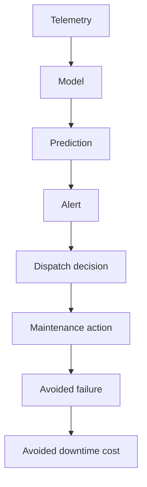

# 09 — Use Cases and Mental Models: How MLOps and ML SAs Actually Think — Part 2 of 3: Healthcare CDS, AI Trailers & Predictive-Maintenance ROI

This is part 2 of 3 of the "Use Cases and Mental Models" lesson. Part 1 worked through a bank's generative-AI assistant and a retailer's drifting recommendation system, each from both an IC architect's and an ML Solutions Architect's point of view. Here we cover three more scenarios in the same format: a hospital deploying clinical decision support, a streaming service chasing AI-generated trailers, and a manufacturer whose predictive-maintenance program can't show up in the P&L.

---

## Scenario 3 — The Healthcare System Building Clinical Decision Support

### The Situation

A large US healthcare system (12 hospitals, 200+ clinics, ~30K employees) wants to deploy an ML model that helps emergency department triage. Specifically: predict which patients are likely to deteriorate within 4 hours of admission, so nurses can prioritize monitoring. The Chief Medical Officer is the executive sponsor; she's enthusiastic but wary because a previous "sepsis prediction" model deployment at a peer system was publicly criticized for systematic underperformance on certain demographics.

The CMO says: "We have data. We have a data science team that's built a model in a notebook. We need to go live. What do we need to do?"

### What You're Not Told

- **What does the existing model actually predict, on what data, with what performance per slice?** "We have a model" can mean many things.
- **FDA classification.** Is this a Software as Medical Device (SaMD)? Probably yes (it informs treatment decisions). What class — depends on risk tier.
- **How does it integrate into clinical workflow?** A model whose output is ignored is worthless; a model that fires constantly creates alert fatigue and worsens outcomes.
- **EHR integration.** Epic? Cerner? On-prem? Cloud? FHIR-ready or batch extracts?
- **HIPAA + BAA posture.** What's been authorized at this system?
- **What's the consent and de-identification posture for training data?**
- **What's the fairness landscape?** Race, ethnicity, socioeconomic status, language, gender, age — performance disparities by any of these will become a story.
- **Who validates clinically?** An ML team approving its own model is not enough. You need clinician validators.
- **What's the regulatory pathway?** Internal CDS (clinical decision support) has different obligations than billable diagnostic devices, but the line shifts.
- **How does the model handle "I don't know"?** Many clinical models silently produce confident outputs on out-of-distribution patients.

### IC Architect's Approach

A staff ML engineer at the healthcare system thinks more cautiously than in any other industry. The stakes are higher; the regulatory landscape is real; the prior peer incident is fresh.

**Frame: this is not "deploy a model." This is "design a clinical AI program."** A model in production at a hospital requires:

- Clinical validation (prospective study or rigorous retrospective with bias-aware design)
- Workflow integration that doesn't add cognitive burden
- Continuous monitoring including fairness slices
- A clear deactivation criterion
- Regulatory review (internal IRB, possibly FDA depending on classification)
- Clinician training
- Patient-facing transparency where applicable

A "go live in 6 months" timeline is unrealistic. A pilot in one hospital with one clinical service line, with parallel-shadowing for 3 months, is realistic.

**The architecture (technical layer):**

```
[Epic EHR] ──FHIR API──► [HL7/FHIR adapter] ──► [Feature pipeline]
                                                       │
                                                       ▼
                                              [Feature store with
                                              point-in-time correctness]
                                                       │
                                                       ▼
                                              [Model serving (low-latency,
                                              sub-2s for clinical UX)]
                                                       │
                                                       ▼
                                              [Output to Epic via SMART
                                              on FHIR app]
                                                       │
                                                       ▼
                                              [Clinician UI: clear
                                              "this is AI-generated,"
                                              actionable, dismissable]
                                                       │
                                                       ▼
                                              [Clinician feedback capture]
                                                       │
                                                       ▼
                                              [Audit log: every prediction,
                                              every feature, every model
                                              version, every clinician
                                              action — retained per HIPAA]
```

Plus a parallel **monitoring + governance plane:**

```
[Predictions] ──► [Slice-aware performance dashboards
                  by age, race, sex, payer, language,
                  acuity level, service line]
                          │
                          ▼
                  [Weekly clinical review board]
                          │
                          ▼
                  [Quarterly model risk review]
                          │
                          ▼
                  [Bias and fairness audit
                  (annual, external if possible)]
```

**The non-technical layer is more important than the technical layer.**

- **Workflow integration design.** The CDS appears in the EHR at the moment the nurse is making the triage decision, with the right friction. Not too easy to dismiss (otherwise ignored); not so prominent it derails workflow. This is co-designed with clinicians, not engineers.
- **Phased rollout.** One hospital → two service lines → three months of shadow mode (model fires, no UI to clinicians) → silent mode (clinicians see, can't act) → active mode with monitoring.
- **Clinical champion.** A respected attending physician at each pilot site is on the team. Without them, adoption fails regardless of model quality.
- **Failure mode planning.** When the model says "high risk" on a patient who is fine, what's the cost? When it says "low risk" on a patient who deteriorates, what's the cost? Asymmetric; the threshold should reflect that, with clinician input.

**Specific concerns the IC architect raises with the CMO:**

1. "The notebook model is not deployable. It's a *candidate*. We need to validate it on held-out cohorts including under-represented demographics before deciding to deploy."
2. "We need a fairness audit before launch. The peer system was burned by this; we won't be."
3. "We need parallel-shadow mode for at least 3 months before activating clinical UI. This isn't optional; it's how we earn the right to deploy."
4. "We need FDA classification clarity from your regulatory affairs team. CDS that adjusts treatment likely falls under 21st Century Cures Act exemption; CDS that diagnoses doesn't. Get the determination in writing."
5. "Budget for a clinical AI governance function. This isn't one engineer's part-time job; this is a small ongoing team with clinicians."

### SA Approach (Cloud Vendor or Healthcare AI Vendor)

An SA from AWS, GCP, Azure, or a healthcare-specialized vendor (Epic's own AI tooling, Aidoc, Innovaccer, Komodo) approaches this differently.

**Discovery first, with a stronger ethical filter.** A good SA in healthcare actively pushes back on speed:

> "Before we talk architecture, let me ask: what's your IRB protocol look like? What's your fairness audit plan? Where's your clinical champion? These are not optional in this domain. If they're missing, the architecture conversation is premature."

A weak SA pitches the cloud stack and moves to a deal. A strong SA earns the trust by being the adult in the room about clinical AI risk.

**The reference architecture (if AWS):**

- HealthLake or a custom FHIR store for the data layer
- SageMaker (or Bedrock if generative; not generative in this case) for training + serving
- SageMaker Model Monitor + Clarify for slice-aware monitoring + bias detection
- CloudTrail + dedicated logging for HIPAA-grade audit
- AWS Comprehend Medical for any NLP on clinical text
- The HITRUST CSF certification posture for the AWS account

**Specialists pulled in:**

- AWS Healthcare and Life Sciences industry SA
- AWS Public Sector if this is a state-funded health system
- A privacy specialist for the BAA review
- The customer's Epic-side technical team (or whichever EHR vendor)

**The SA's specific value-add:** Reference customer connections. "I can introduce you to two other large health systems running similar workloads. Both have been through what you're about to go through. One of them can walk you through their FDA conversation in detail."

This connection is often more valuable to the customer than any technical artifact the SA produces.

**The SA's specific warnings to the CMO:**

- "Your customer base across hospitals likely has different demographic profiles. Performance audited on hospital A may not translate to hospital B. Plan for per-site validation."
- "Epic's own AI features (the Hello World, the Cognitive Computing platform, the deterioration model in particular) overlap with what you're proposing. Have you compared your candidate model to what Epic ships? Sometimes the answer is to use Epic's, not build your own."
- "FDA pathway clarity is a hard prerequisite. Engage your regulatory affairs team now, not later."

### Where the Two Diverge

| Concern | IC Architect | SA |
|---|---|---|
| Primary partner | Internal clinical and regulatory teams | Customer's clinical and regulatory teams, plus vendor specialists |
| Make-or-buy framing | Build it (we have the team) | Compare to vendor solutions (Epic, Innovaccer); recommend honestly |
| Liability framing | Carries personal stake; will be in the room if it fails | Brings warnings; ultimate liability is the customer's |

Both end up with similar architecture. The difference is the SA more strongly questions "should you build at all," while the IC architect, by virtue of being inside, often takes "we're building" as given.

### The Proposed Architecture

As above. Critical layers: clinical workflow integration, slice-aware monitoring, governance plane, phased rollout, parallel shadow.

### What They'd Worry About in Month 3

- **Alert fatigue eroding adoption.** If the model fires too often or too softly, clinicians ignore it. Continuous workflow research.
- **A specific demographic showing worse performance.** Will happen; the question is whether monitoring catches it. The fix is often retraining with re-weighting, or a deployment hold pending model improvement.
- **EHR vendor releasing their own competing model.** Common; the strategic question becomes "do we replace ours with theirs?" Plan for it.
- **A clinical adverse event tied to the model.** The communication plan, the regulatory notification, the patient-family handling — all should be pre-built.
- **The "concept drift" of clinical practice.** Treatment protocols change. The model's predictions become subtly wrong as practice evolves. Quarterly retraining is the minimum.

### Interview-Ready Summary

> "Clinical AI is a different category. The architecture matters but it's not the hard part. The hard part is: clinical validation including fairness audit, FDA classification clarity, EHR integration that doesn't worsen workflow, parallel shadow for months before activation, slice-aware monitoring, and a governance plane with clinical champions. I'd refuse to deploy a notebook model. I'd phase rollout one hospital and one service line at a time. I'd budget for an ongoing clinical AI governance function — not a side project. And I'd push the CMO to consider whether the EHR vendor's own solution should be the path before building."

---

## Scenario 4 — The Streaming Service That Wants Personalized AI-Generated Trailers

### The Situation

A streaming media company (~50M paying subscribers) wants to use generative video models to produce personalized trailers — different 30-second cuts for different user clusters. The Chief Product Officer says: "Netflix is testing this; we need to ship in 9 months." The team has 2 ML engineers, 1 ML researcher (PhD, came from a research lab), and access to a $5M annual ML platform budget. Models would run on user request when a user views a title, or pre-generated by cluster.

### What You're Not Told

- **What's the actual user-facing experience?** "Personalized trailer" can mean many things: re-edited from existing footage (cheap, mostly editing), or generated from scratch (current-frontier expensive). Massive cost and quality difference.
- **Rights and content licensing.** Generating new footage of an actor likely violates SAG-AFTRA agreements and right-of-publicity laws. Re-editing existing footage is licensed differently.
- **Latency budget.** Real-time on view (sub-2-second) is *currently impossible* with frontier generative video. Pre-generated by cluster (offline batch) is feasible.
- **Quality target.** Internal eyeball test or A/B test against original trailer?
- **Existing recommendation stack.** Likely a sophisticated recommendation system already. The "personalized trailer" might fit as a layer on top, not a separate system.
- **What does the research team's prototype look like?** Often the prototype assumes capabilities that don't transfer to production (e.g., 5-minute generation latency, which is fine for research demos and impossible for production).
- **Legal posture on generative AI.** Most large media companies have strict policies; some prohibit generative video involving actors entirely.

### IC Architect's Approach

A staff ML engineer at the media company immediately reframes:

**"Personalized trailer" is a product idea, not a technical spec.** Four candidate executions:

1. **Re-edited from existing trailer footage.** Pre-existing clips reordered, captioned differently, scored differently per cluster. Cheap, fast, no novel generative concerns.
2. **Re-cut from feature footage.** Use the actual movie's footage to generate new montages. Better personalization, IP-cleaner if licensed.
3. **Generative voice / subtitle overlay.** Same visuals, different generated voiceover / subtitle tone per cluster. Generative but bounded.
4. **Fully generative video.** Current state of the art (Veo, Sora-class models) for short clips. Expensive, slow, fraught with rights issues, quality risky.

The senior move is to push the product team to clarify *which* of these they actually want. They likely want #2 + #3 but said "AI-generated trailers" because it sounded ambitious in the board memo.

**The architecture for re-edited / re-cut (option 2 + 3):**

```
[Catalog]
     │
     ▼
[Asset pipeline: pre-extracts scenes, shots, sentiment per shot,
 actor labels (subject to legal review), captions]
     │
     ▼
[Asset store: every shot tagged, embeddable, retrievable]
     │
     ▼
[User cluster pipeline: builds per-cluster preferences from
 viewing history, ratings, demographics]
     │
     ▼
[Trailer generator: given (title, user cluster), assembles
 shots into a 30-second trailer with rules + an ML ranker
 for shot selection]
     │
     ▼
[Quality eval: automated checks (length, pacing, dialogue
 intelligibility) + human spot-check for new titles]
     │
     ▼
[Pre-generated trailer cache per (title, cluster) — served
 from CDN]
     │
     ▼
[A/B testing layer: this trailer vs. original]
```

**Why pre-generated (offline batch) over real-time:**

- Generative video at user-request latency is currently impossible at quality
- $50\text{M users} \times 10\text{K titles} \times \text{per-user} = 500\text{B}$ trailers; impossible
- $200 \text{ clusters} \times 10\text{K titles} \times 1 \text{ trailer/cluster} = 2\text{M}$ trailers; feasible
- Cluster-based personalization captures 80% of the value at 0.001% of the cost
- A/B tests can measure cluster-level lift cleanly

**The hard parts the IC architect surfaces:**

1. **Legal review must precede technical build.** Right-of-publicity, SAG-AFTRA, music licensing. Engage entertainment counsel in week 1.
2. **Asset extraction is the hard work.** Tagging scenes, shots, music cues, dialogue beats across the catalog is months of pipeline work.
3. **The quality bar for trailer cuts is high.** Bad cuts read as "cheap" and damage the brand. Likely needs a human-in-the-loop QA step initially.
4. **Cluster definition matters more than the model.** If clusters are bad, the personalization is bad regardless of the cut quality.
5. **Measurement is hard.** Trailer A/B testing has long delays (the metric is title engagement weeks later). Need an instrumented test infrastructure.

**What the IC architect refuses to commit to:** "9 months to GA." They'd commit to: "9 months to a controlled experiment on 5% of users on 50 titles in 3 user clusters with a clear go/no-go decision at month 12."

### SA Approach (Cloud Vendor With Media-Vertical Strength)

An SA from AWS Media Services, GCP Media & Entertainment, or Azure for Media — or from a generative video platform vendor (Runway, Synthesia for enterprise) — thinks:

**Discovery focused on what's actually feasible:**

- "Walk me through your current asset pipeline. How are shots tagged today?"
- "What's your CDN setup? Where are trailers stored?"
- "What's your legal posture on generative video involving talent?"
- "What's your A/B testing maturity? Can you measure trailer-level lift cleanly?"

**The SA likely guides them away from frontier generative video** because:

- The quality at the frontier is *just* barely consumer-acceptable
- The cost is enormous
- The legal landscape is volatile

**Instead, the SA proposes:**

- Re-edited trailers via traditional ML + rule-based assembly (most of the value, none of the legal risk)
- Generative voiceover for personalization (better-bounded legal risk; can use existing IP-clean voice synthesis)
- Fully generative video reserved for a small "exploration" track to follow the technology curve

**The SA pulls in:**

- A Media & Entertainment industry SA who has worked with peer streaming services
- A Generative AI specialist SA for the frontier capability discussion
- The customer's content legal team early
- A cost-optimization SA because the batch pre-generation pipeline can balloon

**The SA's value-add:** They've seen what other streamers tried. They know:

- Who's experimenting (publicly and not)
- What didn't work and why
- What the customer's competitive position is in this experiment

**The SA's specific warnings:**

- "Generative video involving identifiable actors will probably trigger a SAG-AFTRA conversation. Your peers who tried this all had to renegotiate."
- "The latency story for real-time generation isn't there yet. Pre-generation is the only path that ships in 9 months."
- "Measurement is the unsung hard problem. Your A/B testing maturity will determine whether you can prove ROI on this — and if you can't prove ROI, the board kills it in year 2."

### Where the Two Diverge

Both arrive at similar architecture (re-edit + cluster-based + offline pre-generation). The SA pushes harder on what *not* to build because they've seen failures across customers. The IC architect, embedded inside, can sometimes be carried along by internal enthusiasm.

### The Proposed Architecture

As above. Pre-generated, cluster-based, A/B tested, with a small frontier-research track that follows the technology without committing product to it.

### What They'd Worry About in Month 3

- **Talent/rights complications halting deployment.** Worth a kill-switch design.
- **Cluster definitions stale.** User behavior shifts; re-cluster quarterly.
- **The "9-month timeline" politically holding.** Realistic communication with the CPO about the experiment-not-GA framing.
- **Cost of the asset pipeline.** Frame extraction + shot tagging at catalog scale runs into millions in compute. Tier the catalog (top 1K titles get full treatment; long tail gets cheap treatment).
- **Frontier model commoditization.** The cost of generative video falls 10x/year. Build the pipeline to swap models, not lock in one.

### Interview-Ready Summary

> "Reframe first: 'personalized AI trailer' is product fashion; the actual question is which of four executions — re-edit, re-cut, generative voiceover, fully generative video. Frontier generative video doesn't ship in 9 months at quality. The right answer is option 2 + 3: cluster-based pre-generation, re-edited from licensed footage, with generative voiceover bounded to non-talent. Latency dictates offline batch, not real-time. Measurement is the unsung hard problem. Legal review precedes architecture. I'd commit to a controlled 5%-of-users experiment in 9 months, not GA."

---

## Scenario 5 — The Industrial Manufacturer With Predictive Maintenance That Doesn't Save Money

### The Situation

A heavy-equipment manufacturer (~$40B revenue, global) has run a predictive maintenance ML program for 4 years. They've deployed models across 12 product lines, monitoring telemetry from 200K+ deployed machines. Internal metrics say the models are accurate. But the new CFO escalates: "We've spent $35M on this program and I can't find $35M of value. Either find the value or kill it. You have 60 days."

You're brought in as a consulting senior MLOps engineer (or SA at a manufacturing-specialized vendor).

### What You're Not Told

- **What "accurate" means.** AUC on a held-out set is not the right metric for predictive maintenance.
- **What's the value chain from prediction to action?** A model that predicts perfectly but doesn't lead to a maintenance action saves nothing.
- **Who pays for unplanned downtime today?** The customer, the manufacturer, or shared? The economics drive everything.
- **Is the model output being used?** Predictions can flow to a dashboard nobody opens. This is the most common pathology.
- **What's the alternative cost of action?** A false-positive maintenance call may cost more than the avoided failure.
- **What's the financial accounting of "value"?** "Saved $X" can be measured many ways; the CFO has a specific one.

### IC Architect's Approach

A staff ML engineer hired as a consultant first does not look at the models. They look at the *causal chain*:



Each arrow is a potential leak. The senior diagnostic walks the chain backward from "saved money" until they find the break.

**Common leaks:**

1. **Predictions don't reach dispatchers.** The dashboard exists; no one opens it. Or the predictions arrive too late to act.
2. **Predictions reach dispatchers but they ignore them.** Low precision = alert fatigue.
3. **Dispatchers act on predictions but maintenance crews don't have parts on hand.** Parts inventory not synced with predictions.
4. **Maintenance happens but the failure wasn't going to happen.** The model has good recall, terrible precision. Saving nothing; spending lots.
5. **Failures get avoided but customers don't perceive it.** Value not captured in pricing or contract.
6. **Value is captured, but on the customer's side, not the manufacturer's.** The manufacturer paid for the program; the customer got the benefit. Bad contract structure.

**Leak #6 is the most common diagnosis at heavy-equipment manufacturers.** The manufacturer pays for the ML program; the customer keeps the avoided downtime savings. Unless there's a service contract with shared incentives ("Power by the Hour" model, performance contracting), the manufacturer captures little of the value.

**The senior MLOps engineer's actual deliverable:**

- A walk-through with the CFO showing exactly where in the chain the value leaks
- A proposal: either restructure the commercial offering (service contracts that share avoided-downtime savings) or kill specific product lines where the chain is broken
- Models that are accurate but whose value is captured on the customer side are *technically working but commercially failing*. The fix is commercial, not technical.

**This is the kind of finding that gets a senior MLOps engineer promoted.** Most engineers would look at the models. The senior looks at the value chain and finds the answer is in pricing.

### SA Approach (Industrial / IoT Vendor or Cloud SA)

An SA at AWS IoT, Azure Industrial IoT, or a manufacturing-specialized vendor (PTC ThingWorx, Siemens MindSphere) walks in thinking:

**This is a value-capture problem disguised as a technical problem.** The SA's leverage is in the conversation with the CFO about commercial structure, not in the architecture.

**Discovery:**

- "Walk me through how a predictive maintenance alert turns into revenue. What's the contract structure?"
- "Who pays for downtime today? Who pays for parts? Who pays for the maintenance crew?"
- "What percentage of alerts get acted on?"
- "What percentage of acted-on alerts prevented real failure?"

The SA quickly arrives at the same diagnosis. Their angle:

> "This is a contract structure problem, not a technical one. Several of your peers have moved to performance-based contracts where they share avoided-downtime savings. That's where the ROI lives. The technology is necessary but the contract is the lever."

**The SA likely doesn't sell more cloud here.** The customer has the technology. They need a commercial pivot. The honest SA says so — and earns credibility for the next deal, which might be three years later when the commercial pivot creates new data needs.

### Where the Two Diverge

Both arrive at the same answer. The IC architect, embedded, has more credibility to push the commercial recommendation because it costs the manufacturer money to act on. The SA's recommendation can be dismissed as self-serving ("of course they want us to do contract restructure that requires more services"). The IC architect has to actually carry the recommendation through, which is harder.

### What They Tell the CFO

> "Your models work. Your dispatch is acting on them. But the value of avoided downtime is captured by your customers, not by you. Unless you restructure the commercial offering to share that value, this program will never show up in your P&L. Here's the contract pattern that works — let's run the math on three product lines and see if it pencils out. Three options: kill the program, restructure contracts on top product lines, or hold steady. My recommendation is restructure on top two lines and let the rest go."

### What They'd Worry About in Month 3

- **Sales team resistance.** New contract structure means longer sales cycles. The CRO will fight.
- **Customer pushback.** Customers used to free benefit will resist sharing savings. Need to position carefully.
- **Measurement complexity.** Performance contracts require validated measurement of avoided downtime. The ML platform now must produce regulator-grade evidence, not just dashboards.

### Interview-Ready Summary

> "Don't look at the model. Walk the value chain backwards from 'P&L impact.' At heavy-equipment manufacturers running predictive maintenance, the most common diagnosis is that the model works but value is captured by the customer, not the manufacturer. The fix is contract restructuring — performance-based offerings that share avoided downtime — not better models. The senior MLOps engineer's job here is to land the commercial diagnosis with the CFO, not to retrain anything."

---

## You can now

- Recognize when a project is not "deploy a model" but "design a clinical AI program" — and list the clinical validation, fairness audit, phased-rollout, and governance obligations that a notebook model needs before it can touch a patient workflow.
- Decompose a fashionable product ask like "personalized AI-generated trailers" into its concrete execution options (re-edit, re-cut, generative voiceover, fully generative video), and pick the one that actually fits the latency, rights, and quality constraints.
- Walk a predictive-maintenance value chain backward from "the CFO can't find the ROI" to the specific link where the value leaks — and tell the difference between a model that's broken and a model that's working but commercially miscaptured.
- Apply the "should we build this at all" question to a generative or ML initiative before designing its architecture, the way a senior IC or SA does when the product ask outruns the team's actual capability or the technology's actual maturity.
- Compare how an embedded IC architect and a vendor SA carry a hard commercial or ethical recommendation to an executive — and why the SA's version can be dismissed as self-interested while the IC architect has to live with it.

## Try it

Pick the predictive-maintenance scenario and draw your own version of the value chain (telemetry → model → prediction → alert → dispatch → maintenance action → avoided failure → avoided cost) before rereading the chapter's version. For each arrow, write one concrete way it could leak in a real deployment you know of or can imagine, and one cheap way you'd check whether that specific arrow is intact. Then identify which single leak, if fixed, would most likely move the CFO's P&L — and justify why in two sentences you could say out loud in a meeting.
