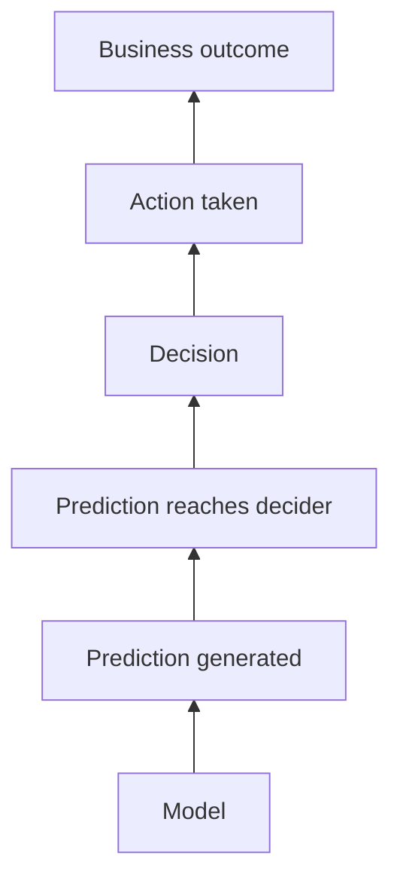

# 09 — Use Cases and Mental Models: How MLOps and ML SAs Actually Think — Part 3 of 3: Multi-Region LLMs, Quant Alpha Decay, Public-Sector Ethics & the Mental Models

This is part 3 of 3 of the "Use Cases and Mental Models" lesson. Parts 1 and 2 worked through five scenarios — the bank assistant, the drifting recommender, clinical decision support, AI-generated trailers, and predictive-maintenance ROI. Here we cover the final three scenarios — a multi-region LLM rollout, a trading firm's alpha decay, and a public-sector child-welfare model — then pull the reasoning patterns that recur across all eight scenarios into a set of cross-cutting mental models, plus the closing takeaways and exercise for the whole lesson.

---

## Scenario 6 — The Multi-Region Deployment of a Single LLM Endpoint

### The Situation

A SaaS company (~$200M ARR, B2B) has built an LLM-powered feature into their product. They've been running it on a single AWS us-east-1 endpoint, serving customers globally. As the feature has rolled out in EU, customer pushback is intensifying:

- Latency for EU customers is 200ms+ vs. 60ms for US customers
- A few EU customers have raised "data residency" concerns
- A subset of EU customers (regulated industries) are blocking purchase until data stays in EU

The VP of Engineering says: "We need to be EU-resident in 90 days for two named customers. And then probably APAC by Q4."

### What You're Not Told

- **What model are they using?** Self-hosted? Hosted (OpenAI, Anthropic, Bedrock)?
- **What data flows through?** Customer prompts only, or also customer documents (retrieved context)?
- **What's their GDPR posture today?** DPA in place? SCCs? Data processing agreement specifying processors?
- **What's the EU customer's actual definition of "data residency"?** Strict (no byte crosses the border) or pragmatic (no data at rest in non-EU; transient processing OK)?
- **Are the named customers in regulated industries (banking, healthcare, public sector)?** That changes the residency bar.
- **What's the integration with the customer's data?** SSO? Webhooks? Customer-managed keys? Bring-your-own-cloud (BYOC) requirements?
- **Cost tolerance?** EU AWS regions cost ~10–20% more; running redundant capacity costs more again.

### IC Architect's Approach

A staff ML platform engineer at the SaaS company thinks:

**Define the residency requirement precisely.** "EU data residency" can mean:

1. **Soft residency:** customer data is stored in EU; processing may transit non-EU
2. **Hard residency:** no data byte ever leaves EU, including in transit, in logs, in CI/CD artifacts
3. **Sovereignty:** the cloud provider's EU subsidiary, with EU-citizen-only staff, GDPR Article 48 protections, no US CLOUD Act exposure

These are different. The named customers' actual contracts dictate which.

**The architecture by tier:**

For **soft residency** (most common):

- Deploy the same model serving stack in eu-west-1
- Route EU customers to the EU endpoint via geographic routing (Route 53 or CloudFront)
- Keep model artifacts replicated cross-region
- Logs and metrics aggregated to a central observability stack (US is OK if access-controlled)
- Cost increase: ~30%

For **hard residency:**

- Replicate model artifacts to EU
- Logs and metrics stay in EU only (separate observability stack)
- CI/CD pipelines triggered from EU runners
- Customer support tools (engineer access for debugging) restricted by region
- Build pipelines must avoid building in non-EU regions
- Cost increase: ~50–80% (separate everything, low utilization)

For **sovereignty:**

- AWS European Sovereign Cloud (in development) or Azure EU Sovereign Cloud
- Significant lead time; some customers will require this in 2027+
- Plan for it but don't build until customers contractually require

**Key decisions:**

- **Don't fork the codebase.** Same code path, configuration determines region.
- **Region routing happens at the edge.** Customer identity → region. New customers in regulated industries default to EU residency if they're EU-based.
- **Logging policy by region.** Logs from EU stay in EU. The observability platform supports multi-region or you split.
- **LLM provider choice.** If using Bedrock, model availability differs by region (some models only in us-east-1 / us-west-2). May force a model swap in EU. Document.
- **Build for the future APAC requirement now.** A general "region pluggable" model serves you for the second expansion too.

**Process / governance layer:**

- **Per-region SoR.** A clear statement of what's in each region.
- **Audit-ready DPA.** Updated to reflect the new architecture, named subprocessors.
- **GDPR DPIA.** Data Protection Impact Assessment for the new processing.
- **CMK option.** Customer-managed encryption keys for the regulated EU customers.

### SA Approach (Cloud Vendor: AWS in This Case)

An AWS Senior SA who has done dozens of these calls walks the customer through:

**Discovery — what do the two named customers actually require?**

- "Have you seen the actual contract language? Is 'EU data residency' a defined term?"
- "Are these customers in financial services or healthcare? If yes, expect harder requirements."
- "Are they asking for FIPS endpoints or HIPAA-eligible services? Different category."
- "What's their position on customer-managed keys via KMS?"

**The SA brings reference architectures:**

- A multi-region SaaS reference for AWS (which has existed since 2018)
- A specific GenAI multi-region pattern with Bedrock
- A residency pattern that distinguishes data-at-rest, data-in-transit, and metadata

**The SA's honest reality-check:**

> "90 days for the EU endpoint is feasible if you accept some short-term ugliness. 90 days for *clean* multi-region with proper observability split and ops on-call coverage in EU time zones is not. Plan a phased rollout: customer-visible endpoint at day 90, internal cleanup over month 4–6."

**The SA brings specialists:**

- AWS Privacy team SA for GDPR and Schrems II
- AWS Security SA for the IAM / KMS / VPC story
- AWS Bedrock specialist for model availability per region
- AWS Customer Solutions Manager to plan the multi-region operational ramp

**The SA's strategic frame:**

> "This is your first multi-region build, not your last. Asia is coming in Q4; potentially Canada; potentially Australia for some customers. Design now for n regions, even if you only deploy two. Reference architectures from us assume this."

### Where the Two Diverge

The IC architect knows the specific quirks of their codebase and team capacity; the SA knows what other companies have done and what patterns work. Together they cover both. The SA pulls in capabilities the customer doesn't know to ask for (the AWS Sovereign Cloud roadmap, Bedrock regional model availability matrix, CMK patterns for LLM workloads).

### The Proposed Architecture

```
[Global edge: CloudFront / Route 53] ──► [region-aware routing]
        │
        ├──► [US: us-east-1 + us-west-2 active/active]
        │      ├─► API Gateway / ALB
        │      ├─► Service (ECS / EKS)
        │      ├─► Bedrock (Claude in us-east-1)
        │      └─► Per-region observability (CloudWatch + central aggregation in US)
        │
        └──► [EU: eu-west-1 + eu-central-1]
               ├─► API Gateway / ALB
               ├─► Service (same image)
               ├─► Bedrock (Claude in eu-central-1 — model availability per region)
               └─► EU-local observability (no cross-region logging)
        │
        └──► (Future: APAC: ap-northeast-1 + ap-southeast-2)

[Customer identity → region mapping table]
[Per-region DPAs and subprocessor lists]
[Region-aware feature flags for "data residency" customers]
```

### What They'd Worry About in Month 3

- **Operations burden of 2x regions.** On-call coverage. Alert routing. Incident response with regional implications. Plan for the team's hours.
- **CI/CD pipelines.** Building images in one region, deploying to another, must not cross residency lines for hard-residency customers.
- **Drift between regions.** Same code, different runtime characteristics. A perf regression in EU might not show in US monitoring.
- **The Bedrock model gap.** A new model lands in us-east-1 first. EU customers wait. Customer success has to communicate this.
- **The next customer's "Brazil residency" ask.** Latin America presents region scarcity. Plan now.

### Interview-Ready Summary

> "First clarify 'EU data residency' — soft vs. hard vs. sovereignty are different builds. For most SaaS this is soft residency: customer data in EU, processing transit is OK. Architecturally: region-aware edge routing, same codebase, per-region observability for hard-residency customers, regional DPAs and subprocessor lists, customer-managed keys as an option. 90 days for customer-visible launch is feasible; 90 days for clean multi-region ops is not. I'd plan now for APAC even if shipping EU first — the cost of region-pluggability is small; the cost of refactoring later is large."

---

## Scenario 7 — The Trading Firm Whose Models Lose Money After Promotion

### The Situation

A medium-sized algorithmic trading firm ($5B AUM, 100 quant employees) has a curious problem. Their backtests look phenomenal. The models pass all their offline metrics. They promote to live trading. Within 2–4 weeks, the models systematically underperform expectations — sometimes losing money. After 6 months, they typically degrade to break-even or worse. The firm has noticed this pattern across 30+ model deployments in the last two years.

The CIO says: "Find what we're doing wrong. We've burned $40M in alpha decay since 2024. The board is asking if we should fire the entire quant team."

### What You're Not Told

- **Backtest-live skew details.** What's the specific gap? Time horizons, market regimes, sample sizes?
- **Are these models trained on the same data they're tested on?** Look-ahead bias is the silent killer in quant.
- **What's the data source?** Vendor-provided historical bars vs. self-collected tick data?
- **Is the firm's own activity affecting the market?** Market impact often goes uncaptured in backtests.
- **How is execution modeled?** Slippage, latency, partial fills — backtests almost always under-model these.
- **What's the model size relative to the team?** 30 deployments per 100 quants is a lot; maybe overproduction without enough scrutiny per model.
- **Who validates a model before deployment?** Self-validation by the author is the canonical bug.
- **What's the survivorship bias in their backtest universe?** A backtest on currently-listed stocks misses delisted companies.

### IC Architect's Approach

A senior ML / quant engineer reframes:

**This isn't an MLOps problem; it's a research integrity problem.** The MLOps platform is fine. What's failing is the *evaluation discipline*. They've over-fit to their backtest, and the backtest is systematically biased optimistic. Common causes:

1. **Look-ahead bias.** Features computed using data that wouldn't have been available at the time. Catastrophic in quant; very common when feature pipelines aren't point-in-time correct.
2. **Survivorship bias.** Universe excludes companies that went bankrupt.
3. **Selection bias in training data.** Training on "interesting" periods only.
4. **Multiple-testing problem.** 30 deployments selected from 3000 attempts means the deployed ones are likely flukes.
5. **Backtest costs underestimated.** Real costs (slippage, market impact, financing) much higher than backtest assumed.
6. **Regime change.** Market behavior changed; the model trained on a regime that's gone.
7. **Self-induced alpha decay.** The firm's own trading causes the inefficiency to disappear.
8. **Capacity miscalculation.** Model works on $100M, fails on $1B.

**The senior practitioner builds a research-integrity audit framework:**

```
For each historical model deployment:
  - Recompute backtest with strict point-in-time correctness
  - Apply realistic costs (slippage model, market impact)
  - Apply survivorship correction
  - Compare to actual live P&L
  - If still optimistic gap remains, examine selection bias
```

This audit usually reveals one of the above as the dominant cause. At many firms, **look-ahead bias from a shared feature library** is the answer — features computed centrally for convenience but using current-day data when used in backtests for old dates.

**The fixes:**

- **Point-in-time-correct feature computation.** As-of joins enforced at the library level. Tests that fail if any feature value looks like it was computed with future data.
- **Out-of-sample discipline.** A reserved time period that the team *cannot* see during development. Run on it once, when deploying. Multiple touches mean the data is no longer out-of-sample.
- **Pre-registration of models.** Before backtesting, the team specifies the model. Changing it requires explicit documentation. Reduces multiple-testing.
- **Independent validation.** The model author doesn't approve. A separate validator group does, with their own backtest infrastructure.
- **Live-trading paper-trading parallel.** Before real money, paper trade for 30+ days. Live conditions, no capital at risk.
- **Capacity testing.** Simulate the model at 10x the intended size.

The MLOps platform fixes:

- Feature store with point-in-time correctness enforced by API design (you cannot ask for a feature without specifying an as-of timestamp)
- Backtest infrastructure with realistic cost models built in
- Model deployment governance — independent validator sign-off required
- A/B-by-randomized-rotation between models, not by sequential deployment

### SA Approach (Cloud Vendor / Quant-Specialized Vendor)

A vendor SA in this scenario is rare — quant firms typically build their own platforms. But cloud SAs do show up for the infrastructure side.

If an SA is in this conversation, their approach is more humble: they probably know less about quant specifics than the customer. They lead with:

> "I want to make sure I'm helpful without pretending I know your domain better than you. What's distinctive about your firm's approach? Where does our platform fit in?"

The SA's value is providing infrastructure primitives:

- Feature store with as-of joins (Feast or a cloud-native equivalent)
- Lakehouse with time travel (Iceberg) for reliable historical analysis
- Compute on demand for backtests (SageMaker, Vertex Training, Databricks Jobs)
- Reproducibility infrastructure (Git-tagged Docker images, signed model artifacts)

The SA refers to the research-integrity issues but defers to the customer on the diagnosis. This humility is appropriate; quant firms know their own demons better than vendor SAs.

### Where the Two Diverge

The IC architect can speak to the actual research-integrity audit. The SA helps with the platform components but doesn't drive the diagnosis. In specialized industries (quant, biotech, defense), domain expertise lives inside; vendors support.

### The Proposed Architecture

The platform side:

```
[Tick data lake] ──► [Iceberg tables with time travel]
                              │
                              ▼
                  [Feature store with as-of API
                  — feature requests must include as_of_time]
                              │
                              ▼
                  [Backtest infrastructure
                  — realistic cost model built in
                  — out-of-sample reservation enforced]
                              │
                              ▼
                  [Pre-registration system
                  — model spec signed before backtest run]
                              │
                              ▼
                  [Independent validator queue]
                              │
                              ▼
                  [Paper trading sandbox — 30+ days mandatory]
                              │
                              ▼
                  [Live deployment with capacity ramp]
                              │
                              ▼
                  [Live performance attribution
                  — actual vs. backtest by source]
```

### What They'd Worry About in Month 3

- **Cultural resistance.** Quant teams hate being audited. Especially by an MLOps platform team. Expect pushback; need executive air cover.
- **The "we already do that" trap.** Teams will claim they handle look-ahead bias; until you verify in code, assume they don't.
- **The independent validator bottleneck.** Suddenly the validators are the rate-limiter for the team. Plan for capacity.
- **Continued alpha decay even after fixes.** Some of the historical decay was real (regime change, capacity, self-induced). Fixes won't recover that capital; they'll prevent the next loss.

### Interview-Ready Summary

> "This isn't an MLOps problem; it's a research integrity problem. Backtest beats live consistently means the backtest is systematically biased — look-ahead, survivorship, multiple testing, cost underestimation. The fixes are mostly cultural and process: point-in-time feature enforcement, pre-registration, independent validation, paper trading, capacity testing. The platform supports this — as-of feature store, time travel on data, reproducibility — but the platform isn't the bottleneck. The CIO's question 'should I fire the quant team' is the wrong question; the right one is 'should I install an independent validation function.'"

---

## Scenario 8 — The Public Sector Agency Deploying ML for Benefit Eligibility

### The Situation

A US state agency (Department of Children and Family Services) wants to use ML to prioritize child welfare investigations. The model would score incoming reports for risk and recommend which to investigate first, given limited caseworker capacity. There's enthusiasm in agency leadership; there's also pre-existing concern because a peer agency's similar deployment generated a federal civil rights complaint over racial disparities in outcomes.

The agency's Chief Data Officer says: "We want to do this responsibly. We have $4M and 18 months. What does responsible look like?"

### What You're Not Told

- **Who's actually affected?** Families being investigated, children at risk, caseworkers. Each has different stakes.
- **What's the alternative to the model?** "Don't use one" isn't truly the baseline — caseworkers prioritize today, just unsystematically. Implicit bias in human prioritization is real.
- **What's the legal landscape?** Federal civil rights law (Title VI), state laws on automated decision-making, FERPA if school data is used, IDEA if special education data, COPPA, state-specific child welfare statutes.
- **What's the political climate?** Child welfare is high-profile; any deployment will be in the news.
- **What's the data?** Self-reported, biased by who reports (suburbs vs. urban; concerned neighbors vs. anonymous tips). Past investigations themselves shaped by historical bias.
- **What's the deployment philosophy?** Decision support (caseworker decides, model informs) vs. decision automation. Massive difference.
- **What advocacy and oversight groups need to be consulted?** Public sector ML cannot be designed in private.
- **What's the failure mode?** False positive: family investigated unnecessarily, real harm to family stability. False negative: child harmed who could have been protected.

### IC Architect's Approach

A senior ML engineer hired by the agency thinks first about *whether* to build this, not how.

**The honest question: should this be built?** The peer agency's complaint is a warning. The data is biased. The stakes are extreme. The senior practitioner brings this question to the CDO openly:

> "Before we design, I want to put on the table: should we build this? I want to give you my honest read after I've talked to caseworkers, advocacy groups, and looked at the data."

This is itself a senior move. The IC architect doesn't just take "build it" as given.

**Assuming the answer is "yes, build it carefully," the architecture is decision-support, not decision-automation:**

```
[Hotline intake]
        │
        ▼
[Feature extraction: standard intake fields + historical
 case data if applicable]
        │
        ▼
[Model: risk score on 0-100 scale]
        │
        ▼
[Caseworker UI: score is *one input* among many.
 Caseworker sees:
   - Score with confidence interval
   - Top 3 factors driving the score (with plain-language
     explanations)
   - "This score should not be the sole basis for decisions"
   - History of caseworker overrides on similar scores
 Caseworker manually selects the case for investigation
 or not.]
        │
        ▼
[Decision logged — model score vs. caseworker decision]
        │
        ▼
[Slice-aware monitoring: investigation rates, outcome
 rates, error rates by:
   - Race / ethnicity
   - Income proxy (zip code)
   - Language spoken at home
   - Disability status
   - Geographic region]
        │
        ▼
[Quarterly external audit by university partner]
```

**Critical design choices:**

1. **Score is advisory, not deterministic.** The caseworker decides; the model informs. Decision-automation is unacceptable here.
2. **Explanation is mandatory.** Every score has reasons in plain language. Caseworker can challenge.
3. **Slice-aware monitoring from day one.** Any model that performs differently across protected groups is paused immediately.
4. **External audit.** A university or independent body audits annually. Findings are public.
5. **Caseworker override is the safety net.** Override rates are themselves monitored; if caseworkers override a slice systematically, the model has a problem.
6. **No discretion-removing thresholds.** A score of 95 doesn't trigger automatic investigation; it gets caseworker attention. Caseworker decides.
7. **Data limits.** No use of features known to proxy for race (zip code as a feature, for instance, is fraught; sometimes excluded entirely even at cost to accuracy).
8. **Sunset clause.** The deployment has a stated review point. If by year 2 the program hasn't demonstrated benefit without disparate impact, it sunsets.

**Governance layer:**

- Community advisory board with affected-population representation
- Caseworker advisory board
- Legal review with state attorney general
- Open documentation: every aspect of the model published (data sources, features, performance, fairness audit)
- Family rights notice: families investigated have the right to know what factors were used

### SA Approach (Public Sector / Government Cloud Vendor)

An SA from AWS GovCloud, GCP for Government, Microsoft Azure Government, or a public-sector-specialized vendor (Palantir for government, Microsoft Power Platform, Salesforce Public Sector Cloud) thinks:

**Discovery, but in public sector mode:**

- "Who are the stakeholders that need to be consulted? Have you mapped them?"
- "What's the procurement pathway? RFI / RFP / cooperative purchase?"
- "What's the state AG's position on automated decision-making?"
- "Has anyone been engaged from the federal Children's Bureau or ACF?"
- "What's the state's open-records and FOIA posture?"
- "What's the labor relations situation with caseworkers?"

**Public sector SAs work differently.** The deal closes slowly (12–36 months). Procurement is rigid. Procurement officers care about FedRAMP, StateRAMP, CJIS, fairness affidavits. The SA's job is to navigate this landscape.

**Vertical-specific warnings the SA raises:**

- "Several states have passed or are considering laws specifically about automated decision-making in human services. Check your state's calendar."
- "There's pending federal guidance from HHS on AI in child welfare. Talk to your federal partners."
- "Several peer states ended up rolling back deployments after public pressure. We can connect you to those agencies for lessons learned."

**The SA is more skeptical of the deployment than the IC architect might be.** They've seen the political fallout. They will openly say:

> "We can absolutely architect this. But before we do, are you sure this is the right use of $4M? Many agencies in your position invested in caseworker support tooling — better documentation, faster intake forms, decision aids that aren't ML — and got more measurable outcome improvement with less risk. I want you to consider that option before we lock in."

**The SA also raises:**

> "There's a real chance this deployment generates a lawsuit regardless of how carefully you build it. Have you engaged your state AG to validate the architecture is defensible?"

This kind of pushback is what separates strong SAs from order-takers. The SA who happily sells the deal is sometimes selling the customer into a public-relations and legal disaster.

### Where the Two Diverge

The IC architect, embedded, will live with the deployment. The SA, somewhat removed, brings cross-state pattern recognition and is freer to recommend "consider not building." Both should arrive at the same conclusions; the SA gets there faster because they've seen the pattern repeat.

### The Proposed Architecture (If They Decide to Proceed)

As above. Decision support, not automation. Slice-aware monitoring. External audit. Community oversight. Sunset clause.

### What They'd Worry About in Month 3

- **Caseworker adoption.** Caseworkers may resist a model that scores their cases. Without their buy-in, the model is ignored. Co-design from day one.
- **The "score arms race."** Reporters call in describing situations to elicit specific scores ("if I report this, will the family get investigated?"). The model becomes gameable.
- **Federal Children's Bureau audit.** Likely. Plan for it.
- **A high-profile case where the model recommended low priority and tragedy occurred.** Real risk. Communication plan must exist in advance.
- **A high-profile case of disparate impact.** Real risk. Sunset criteria must be clear.

### Interview-Ready Summary

> "Public sector child welfare ML is the highest-stakes scenario in this chapter. The first question is whether to build at all, not how. If the answer is yes: decision support not automation; slice-aware monitoring from day one across race, income, language, disability, region; mandatory explanations; community oversight; external annual audit; sunset clause; caseworker override as safety net; no proxy features for race; transparency to affected families. Architecture is straightforward; governance is the work. The SA's leverage is to ask 'should you build at all' on behalf of the customer — sometimes the right answer is no, and the SA earns trust by saying so."

---

## Cross-Cutting Mental Models

Across all eight scenarios, certain reasoning patterns repeat. Internalize them.

### The Value-Chain Walk

When ML investments don't produce business value, walk the chain backward:



The break is rarely at the model. It's usually at "decision," "action," or "outcome captured by the right party."

### The Discovery-Before-Architecture Rule

You cannot architect responsibly without knowing:

- What the actual problem is (not what they said)
- Who the user is
- What the cost of being wrong is
- What the politics are
- What the regulatory landscape is
- What the alternative is (including doing nothing)

Architects who skip discovery design for a fantasy customer. SAs make this mistake more often than IC architects, because of deal pressure; IC architects can fall into it from familiarity bias.

### The "Should You Build This At All" Question

Strong senior practitioners ask this regularly:

- The bank's GenAI assistant: maybe Q Business is right, not custom
- The streaming service's personalized trailers: maybe re-edit is right, not generative
- The manufacturer's predictive maintenance: maybe contract restructure, not better models
- The state agency's child welfare ML: maybe non-ML decision aids

Engineers who can't ask this question are tools; engineers who can are advisors.

### The Phased Rollout Default

Almost every scenario benefits from:

- **Shadow mode** (model runs, no user-facing output) — long enough to validate
- **Silent mode** (model output visible to internal teams, not users) — long enough to build confidence
- **Canary** (% of users) — calibrate
- **Active mode** (full rollout) — only after the prior phases succeeded

The instinct to skip phases is the instinct that produces fired engineers.

### The Slice-Aware Monitoring Reflex

Aggregate metrics hide subgroup failures. Always slice:

- Demographic protected attributes
- Customer cohort / tier
- Geography
- Device / channel
- Time-of-day, day-of-week
- New user vs. existing

The first place a model breaks is almost always a slice. Aggregate looks fine for months while a specific group is being served badly.

### The "What's the Reversibility?" Question

For any architectural decision:

- If we go this way and we're wrong in year 2, what does it cost to undo?
- Multi-region: hard to unwind
- Vendor lock-in: hard to unwind
- Model architecture choice: easy to swap
- Feature definition: depends on consumer count

Spend decision energy proportional to reversibility cost.

### The "Day 100" Concern

Most architectures look fine on Day 1 and fail on Day 100. Senior practitioners always ask:

- When the team that built this leaves, can the next team operate it?
- When usage grows 10x, what breaks first?
- When the vendor deprecates the model we use, how do we swap?
- When the regulator audits us, what evidence do we produce?

Day-100 thinking is what separates the architect from the engineer.

### The Honest Trade-off Articulation

Junior: "X is better."
Senior: "X is better for *this* context because of A and B. Y would be better in context Z. We're choosing X knowing it costs us C in scenario D, which we accept because of E."

The second is the architect's voice. Practice it.

### The "What I'd Refuse to Commit to" List

Strong seniors are clear about what they will not promise:

- Specific dates beyond what's publicly announced
- Feature parity with a competing product they don't own
- Performance claims they haven't measured on the customer's actual workload
- Cost guarantees for usage patterns they don't yet understand

The refusal to over-promise is what builds trust over years.

---

## What to Take Away

After working through these scenarios, you should be able to:

1. **Read a problem statement and identify what's missing.** What questions a senior asks before designing.
2. **Decompose by value chain.** Where in the chain does this problem actually live?
3. **Choose between several reasonable architectures and articulate why.** With trade-offs.
4. **Reason about phased rollout, slicing, reversibility, Day-100 concerns.** Default patterns.
5. **Know when to say "don't build this at all."** The rarest and most senior move.
6. **Communicate the answer differently as IC architect vs. SA.** Same content, different framing.

This is the thinking the F50 senior ML interviews actually test. Tools are commodity; thinking is durable. The candidates who interview well at this level have done this kind of reasoning hundreds of times. You build the muscle by working through scenarios like these, by debating them with peers, and by *practicing the discovery conversation* with a friend playing the customer.

When you've done that for 30+ scenarios, the senior interview becomes routine. Until then, every interview is a fresh shock.

Pick one of these scenarios this week. Write your own version of the architecture, then compare to the proposed one. Find one thing you missed. Add it to your toolkit. Then do another next week.

## You can now

- Read a vague executive request ("build an AI assistant," "personalized trailers," "predictive maintenance") and surface the unspoken scoping, regulatory, and political questions a senior asks *before* proposing an architecture.
- Walk a value chain backward from business outcome to model to locate where an ML investment actually leaks value — and recognize when the fix is commercial or process, not technical.
- Choose between several reasonable architectures and defend the choice in an architect's voice: the context it fits, the cost it accepts, and the scenario in which a different choice would win.
- Apply the recurring reflexes — phased rollout, slice-aware monitoring, reversibility weighting, and Day-100 thinking — to any deployment decision on demand.
- Frame the same recommendation two ways, as an internal IC architect and as a customer-facing SA, and know when the most senior move is to say "don't build this at all."

## Try it

Pick one scenario from this chapter and run the discovery conversation out loud. Recruit a friend or colleague to play the executive (CTO, CMO, CFO, CDO) and give them only the two-paragraph "situation" for that scenario — nothing else. Set a 20-minute timer and conduct discovery: your only job is to ask questions, not to propose anything. Have your partner improvise answers. When the timer ends, write your own "What you're not told" list and a single scoped-pilot recommendation from what you learned, then compare against the chapter's version. Score yourself on two things: which discovery questions the chapter asked that you didn't, and whether your scoped pilot was narrower than the executive's original ask. Repeat with a second scenario a week later; the gap between your list and the chapter's should shrink each time.
