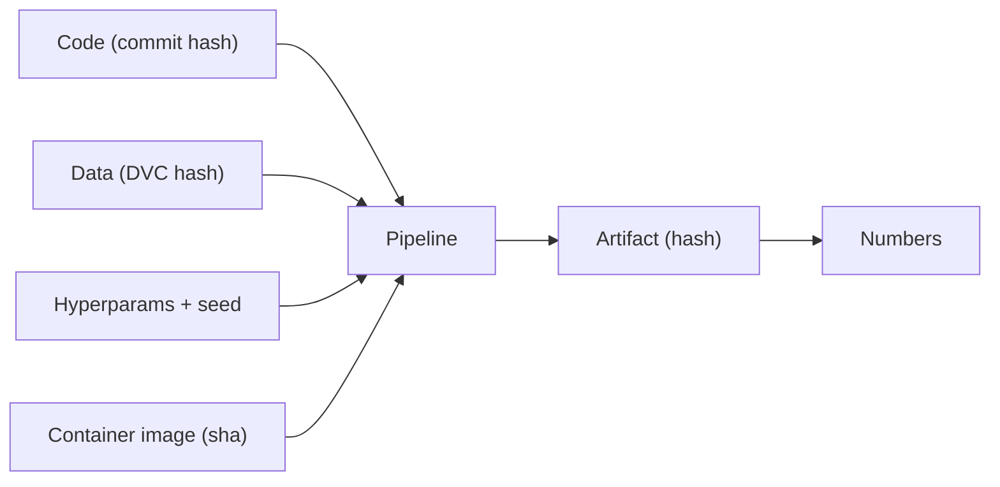
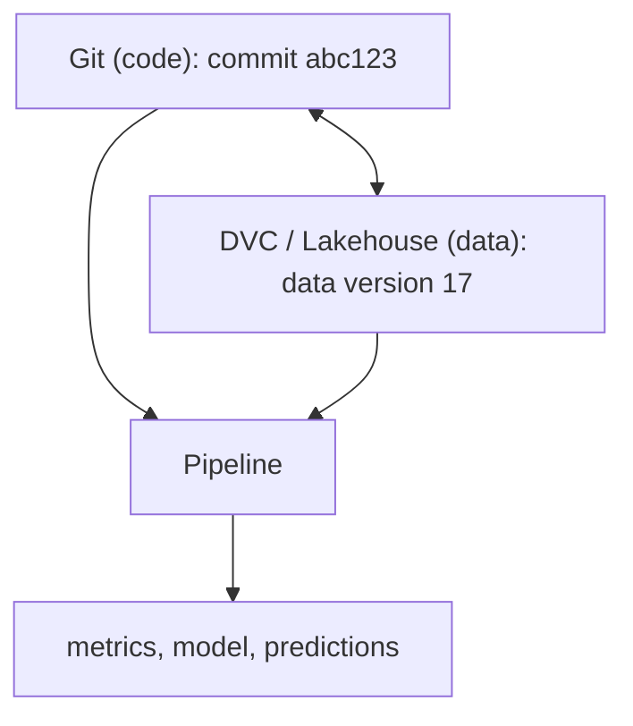
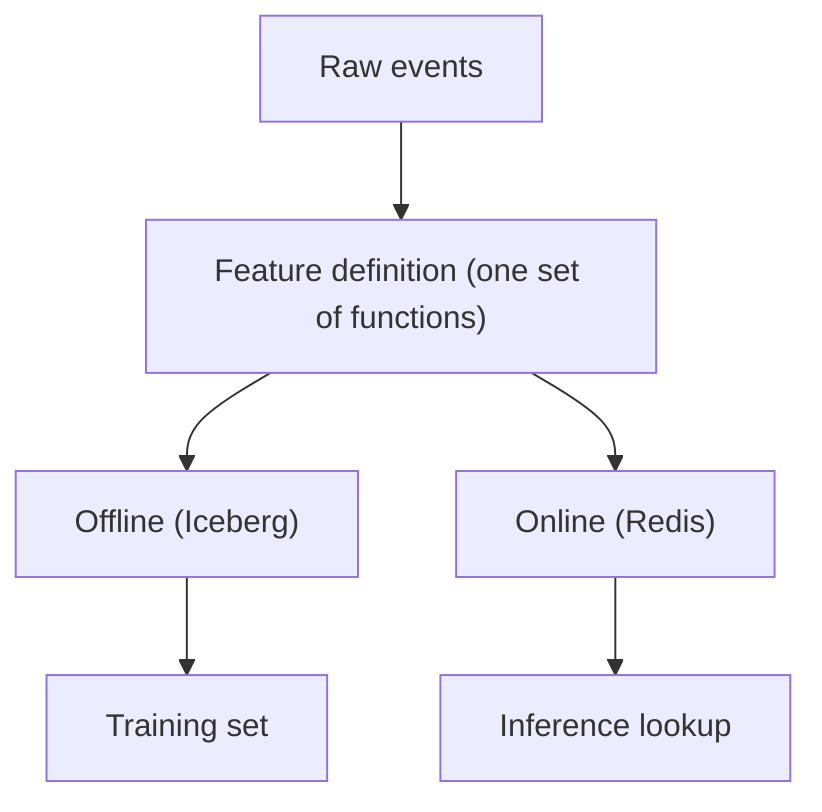
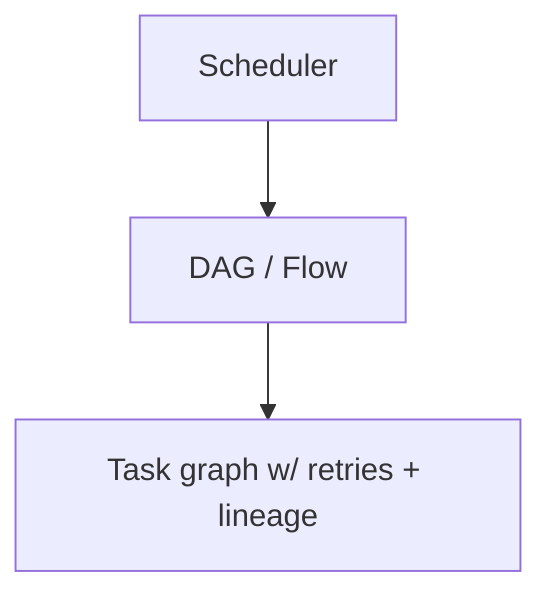
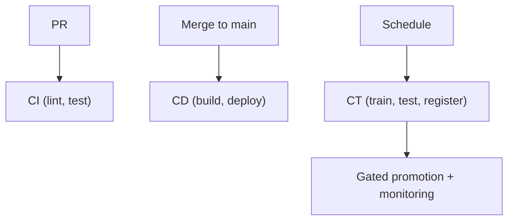
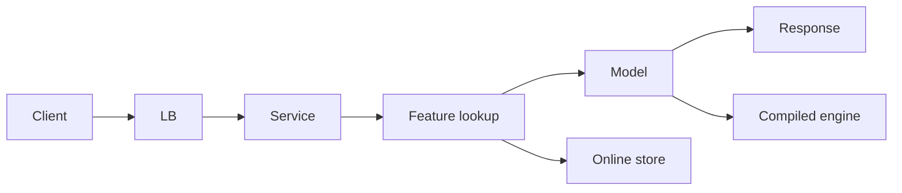
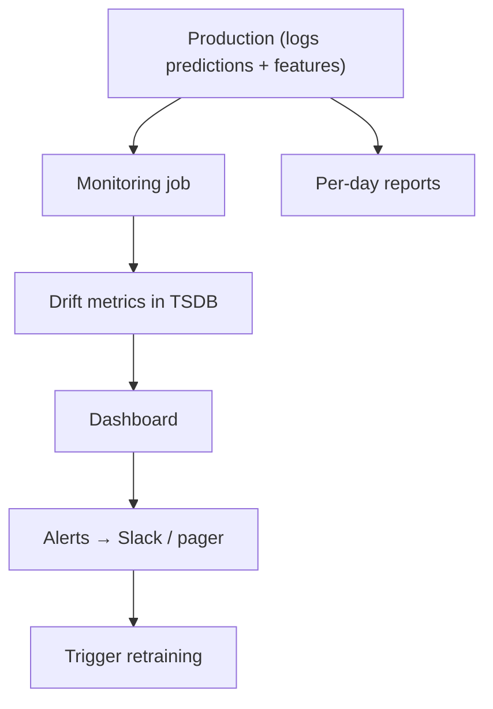

# 11 — Theory Primers and F500 Interview Bank — Part 1 of 2: Sections 1-9, Reproducibility through Monitoring

This is part 1 of 2 of the Theory Primers and F500 Interview Bank lesson. Here we cover the foundational MLOps domains — reproducibility, data versioning, experiment tracking, feature stores, orchestration, CI/CD/CT, containerization, serving architectures, and monitoring — each with a theory primer and graded interview questions.

The practitioner-focused chapters are about building: build the thing, then study what you built. This chapter is for the opposite mode — you have an interview in two weeks, you need to compress the curriculum into 60 self-contained theory primers, each ending with the questions a Fortune 500 panel actually asks.

Use this chapter two ways:

1. **Per-section review.** After finishing a topic in the practitioner chapters, jump to the matching section here. Read the theory primer. Try the questions out loud. The gap between "I built this" and "I can explain this" is what interviews test.
2. **Final-week sprint.** Block 2 hours / day for 10 days. Go section by section. By day 10 you can verbalize answers to every prompt.

The questions are calibrated to senior IC / staff / principal F500 MLOps interviews — the kind of question that gets a one-paragraph answer if you've worked through the curriculum, and a stammer if you haven't.

---

## How to Read Each Section

Each section follows this shape:

- **The Theory** — a 1–2 page primer covering the underlying concepts. Read this first.
- **The Mental Model** — the one or two pictures you should carry into the interview.
- **Why F500 Asks This** — the production reality the question is probing for.
- **Interview Questions** — graded:
  - 🟢 Phone-screen / mid-level (1–2 min answer)
  - 🟡 Senior / staff (3–5 min answer)
  - 🔴 Principal / architect (5–10 min answer, often a system-design wedge)

Treat 🔴 questions as paragraph-length essays, not bullet-point answers.

---

## Section 1 — Reproducibility and Determinism

### The Theory

In production ML, reproducibility means: same code + same data + same hyperparameters + same seed → same numbers, every time, anywhere. Lacking it, you can't audit, you can't roll back, you can't migrate hardware, you can't debug.

Three layers of reproducibility:

1. **Code reproducibility** — pinned dependencies via lock files (`uv.lock`, `poetry.lock`), code in Git with a specific commit hash.
2. **Data reproducibility** — versioned data, retrievable via DVC pointer or lakehouse time travel.
3. **Runtime reproducibility** — seeded RNGs, deterministic GPU ops (where possible), pinned container images.

Two non-obvious truths:

- **GPU determinism is partial.** Some CUDA ops are nondeterministic by design (atomic adds, certain reductions). Even with `torch.use_deterministic_algorithms(True)`, you get bit-identical results only within a fixed hardware generation, kernel version, and PyTorch build.
- **Reproducibility ≠ replication.** "Reproducible" means you can re-run and verify. "Replicable" means an independent team can reach the same conclusion. The second is stronger; the first is a prerequisite.

### The Mental Model



Every input above must be pinned. The output artifact's hash is the "did we reproduce" check.

### Why F500 Asks This

Regulators (SR 11-7 for banks, FDA SaMD for healthcare) require auditable model lineage. Audit means "show us this model was trained on exactly that data with exactly that code." If you can't, the model can't ship.

### Interview Questions

🟢 What does a lock file give you that `requirements.txt` doesn't?

🟢 Why isn't `random_state=42` alone enough for reproducible deep learning?

🟢 You return to a six-month-old model. How do you reproduce its metrics?

🟡 Walk me through everything you'd pin in a training pipeline to make it auditable. What can't you pin?

🟡 Where does GPU non-determinism come from, and which uses can tolerate it?

🟡 You promote a model. Six months later the auditor asks for the training data. How does your pipeline answer this in one minute, not one week?

🔴 Design an audit-grade ML training pipeline for a US bank under SR 11-7. What gets logged, what gets stored where, with what retention, and what's the query path when an examiner asks "what's the data lineage for the loan decisioning model in production on April 14"?

---

## Section 2 — Data Versioning, DVC, and Lakehouse Patterns

### The Theory

You version data because:

- Reproducing a model requires its training data.
- "The model got worse" often reduces to "the data changed."
- Compliance asks "which version of the data was used."

Four approaches:

| Approach | When it fits |
|---|---|
| **DVC** | Project-scoped, small-medium teams, Git-native workflow |
| **Lakehouse time travel** (Iceberg, Delta) | Data already in lakehouse; time travel is free |
| **LakeFS / Nessie / Pachyderm** | Git-like branches over object storage; shared-lake orgs |
| **S3 date-stamped prefixes** | Smallest teams; lowest ceremony |

DVC writes a small `.dvc` pointer to Git; the actual data lives in S3/GCS/Azure. `dvc pull` retrieves data on a fresh checkout. `dvc.yaml` declares pipelines (stage dependencies + outputs); `dvc repro` re-runs only stages with changed inputs.

Iceberg / Delta give you SQL-level time travel: `SELECT * FROM events FOR VERSION AS OF 17` or `... FOR TIMESTAMP AS OF '2026-04-01'`. This is the cleanest data-versioning UX once your data already lives in a lakehouse.

### The Mental Model



Both axes versioned independently and tied at training time.

### Why F500 Asks This

Data drift, retraining audits, and compliance reviews all hinge on data versioning. A team without it is mid-level forever.

### Interview Questions

🟢 What does `dvc add data/raw/train.csv` actually do?

🟢 You change a feature definition; which `dvc.yaml` stages re-run?

🟢 Compare DVC, LakeFS, and Iceberg time travel for ML data versioning.

🟡 Explain why "the model got worse" often reduces to a data versioning question.

🟡 Walk through `dvc exp run` end to end and what artifacts it produces.

🔴 Design a data versioning strategy for a 200-engineer ML org with 50 ML pipelines, regulated finance workloads, and a 7-year retention requirement. Pick one approach and justify against the alternatives.

---

## Section 3 — Experiment Tracking and Model Registry

### The Theory

Experiment tracking captures *every input and output of a training run* — code version, data version, hyperparameters, environment, metrics, artifacts. Model registry is the next layer: which versioned artifacts are eligible for which environment.

MLflow's components:

- **Tracking** — log params, metrics, artifacts, environment per run.
- **Models** — a packaging format that includes signature + environment.
- **Registry** — versioned, aliased model store.
- **Projects** — runnable-package format (rarely used; Docker beats it).

In 2026, MLflow uses **aliases** (e.g., `@champion`, `@challenger`), not stages. Aliases let you have multiple labeled versions simultaneously and swap them atomically.

The pattern for production:

1. Every training run logs into Tracking.
2. The best run gets registered as a Model.
3. The registered Model gets an alias: `@challenger`.
4. Tests pass → alias `@champion` moves to it (atomic).
5. Serving code loads `models:/income_classifier@champion` — no version pinned.

### The Mental Model

```
[Run]  ──register──►  [Model v17]  ──alias──►  [@champion]
                                                  │
                                                  ▼
                                            [Serving] (loads @champion)
```

Promotion is an alias swap. Rollback is the same.

### Why F500 Asks This

Every F500 model deployment must have an audit trail. The registry is that audit trail. Engineers who can't talk about model lifecycle credibly don't get senior MLOps offers.

### Interview Questions

🟢 What's the difference between MLflow tracking, models, and registry?

🟢 Why are MLflow aliases preferred over stages in 2026?

🟡 Walk me through promoting a model to production atomically with rollback.

🟡 What gets logged per training run for it to be truly auditable later?

🟡 You discover at week 4 of a deployed model that its training data was wrong. Walk through the rollback + retrain.

🔴 Design a multi-tenant ML registry for a 50-team org. Cover namespacing, RBAC, approval workflow, model card enforcement, alias governance, and how new models get evaluated before promotion.

---

## Section 4 — Feature Pipelines and the Feature Store

### The Theory

A feature is a function from raw data to a model input. A feature *pipeline* runs that function consistently. A feature *store* coordinates pipelines so that the same definition produces the same value online and offline.

The most insidious bug in production ML: **training-serving skew** — the feature computed at training time differs from the feature computed at serving time. The model trained on training-time data sees something different at inference.

Two flavors:

- **Offline materialization** — features computed in batch, written to Parquet / Iceberg, used to build training sets.
- **Online materialization** — features written to Redis / DynamoDB / Bigtable, looked up at sub-10ms by the inference service.

The "feature store" abstraction (Feast, Tecton, internal builds) is a coordination layer — it doesn't *compute* features; it *defines* them and lets both worlds materialize the same definition.

**Point-in-time correctness** is the headline feature operation. For a training row at time `t`, look up the feature *as of t* (not the latest value). Implemented via an "as-of join" — SQL pattern at the bottom. Without it, you train on data from the future, and your model looks brilliant in eval and fails in prod.

### The Mental Model



Same definition, two materializations, two consumers.

### Why F500 Asks This

Feature stores are the most-misunderstood part of MLOps. Senior interviews dig here because the wrong answer costs production accuracy.

### Interview Questions

🟢 Define training-serving skew with one example.

🟢 What's an as-of join and why do you need it for training data?

🟢 Online store vs offline store — what's in each and why.

🟡 You're given a feature `user_avg_purchase_last_30d`. Walk through how to compute it correctly point-in-time.

🟡 When would you reach for Feast vs Tecton vs hand-rolled?

🟡 How do you reconcile online and offline features to detect drift between them?

🔴 Design a feature store for a 50-team ML org with batch and streaming features, sub-10ms online reads, point-in-time-correct training data generation, multi-tenant quota isolation, and OpenLineage-traceable lineage end to end.

---

## Section 5 — Orchestration (Prefect / Airflow / Dagster)

### The Theory

Orchestration tools schedule, retry, monitor, and visualize multi-step pipelines. Three contenders in 2026:

- **Airflow** — mature, ubiquitous, KubernetesExecutor for isolation. The F500 default.
- **Prefect** — modern, Pythonic, hybrid (local + control plane).
- **Dagster** — Software-Defined Assets (data + ML as first-class entities), strong typing, asset lineage.

Patterns that work:

- Each task does *one thing*; passes paths/URIs, not large objects.
- Retries with exponential backoff and jitter; bounded retries to avoid infinite loops.
- Idempotency: tasks must be safe to re-run for any date.
- Sensors in `reschedule` mode, not `poke` mode, to free worker slots while waiting.

ML pipelines specifically:


### The Mental Model



The orchestrator is the brain; tasks are the muscles.

### Why F500 Asks This

Every F500 ML pipeline runs on one of these tools. Engineers should know one fluently and have opinions about the others.

### Interview Questions

🟢 What is `XCom` in Airflow and why is it usually wrong to pass large objects through it?

🟢 Why use `mode="reschedule"` for an Airflow sensor?

🟢 Idempotency — what's an idempotent task and why does it matter?

🟡 Walk me through a daily training DAG: tasks, retries, alerts, lineage.

🟡 Compare Prefect, Airflow, Dagster. When does each win?

🟡 You have a 7-day backfill that must be idempotent. How do you ensure no duplicate writes?

🔴 Design an orchestration layer for a 200-team ML org. Cover: tool choice, multi-tenancy, isolation, secret management, observability, lineage, on-call ergonomics, and the migration path from a hodgepodge of cron jobs.

---

## Section 6 — CI/CD/CT for ML

### The Theory

Three Cs:

- **CI** — continuous integration. Every PR: lint, type check, unit tests, data tests, model tests on fixtures.
- **CD** — continuous delivery. Every merge: build versioned container image, auto-deploy to staging.
- **CT** — continuous training. On schedule (or trigger): run real training, register candidate, run model tests, promote.

CT is the MLOps-specific addition. Plain software has CI/CD; ML adds CT because *the artifact (the model) drifts even when the code doesn't*.

Tests for ML, four categories:

1. **Unit tests on transforms** — pure-function feature code.
2. **Data tests** — schema, ranges, nulls, distributions.
3. **Model tests** — behavioral (known-good inputs), invariance (irrelevant perturbations don't change output), directional (relevant perturbations change in the right direction), fairness (per-slice metrics).
4. **Integration tests** — end-to-end pipeline against fixtures.

### The Mental Model



The third arrow is unique to ML.

### Why F500 Asks This

Without CT, you ship a model once and pray. Senior MLOps interviews probe whether you understand the model-drift / retraining loop.

### Interview Questions

🟢 What's the third C in CI/CD/CT?

🟢 Why test model behavior, not just metrics?

🟢 What's an invariance test? Give a concrete example.

🟡 Walk me through a GitHub Actions workflow that covers all three Cs.

🟡 Your CT pipeline runs nightly. It produces a bad model on Tuesday. Walk through what catches it before it serves real traffic.

🟡 OIDC for cloud auth in CI — what does it solve and what would you have without it?

🔴 Design CI/CD/CT for an organization that ships 30 production models with regulatory model risk requirements. Cover gating, approvals, evidence packs, audit logs, rollback playbooks, and the human review steps your pipeline preserves.

---

## Section 7 — Docker and Containerization for ML

### The Theory

Containers solve the "works on my laptop" problem with multipliers in ML:

- CUDA + cuDNN + driver versions must align with framework versions.
- System libraries (libgomp, MKL, OpenBLAS) affect performance and correctness.
- Hardware-specific builds (Apple Silicon vs x86-64 vs ARM64).

Production-quality Dockerfile principles:

1. **Multi-stage builds** — final image contains only runtime, not toolchain.
2. **Layer order** — slow-changing files first (deps, lock file), fast-changing last (source).
3. **`--frozen` installs** — never recompute lock file during build.
4. **Non-root user** — required by Kubernetes Pod Security Standards.
5. **`PYTHONUNBUFFERED=1`** — logs appear in real time, not in lumpy bursts.

For GPU workloads: base off `nvidia/cuda:X.Y.Z-cudnn-runtime-ubuntuW.W`. Run with `docker run --gpus all`. On Kubernetes, request `nvidia.com/gpu: 1`.

### The Mental Model

```
   Build stage              Runtime stage
   ───────────              ─────────────
   Compiler                 .venv (from build)
   Build tools     copy ──► src
   Lock + sync              minimal libs
   Source                   non-root user
                            CMD
```

### Why F500 Asks This

Every production ML service runs in a container. Bad Dockerfiles are an immediate signal of weak production experience.

### Interview Questions

🟢 What does a multi-stage Docker build buy you?

🟢 Why copy `pyproject.toml` before `src/` in a Dockerfile?

🟢 What does `PYTHONUNBUFFERED=1` do and when does it matter?

🟡 Walk me through a production-quality Python Dockerfile for an ML service.

🟡 Your GPU Dockerfile builds locally but fails to use the GPU on the cluster. What are the top three diagnostics?

🔴 Design the container build pipeline for a 50-model ML org: caching, signing, SBOMs, vulnerability scanning, multi-arch builds, multi-cloud registry strategy.

---

## Section 8 — Serving Architectures (FastAPI, KServe, BentoML, Triton, vLLM)

### The Theory

Pick the serving framework by workload shape:

| Tool | Strength | When |
|---|---|---|
| FastAPI + uvicorn | Simple, batteries-out | Single-model, low-medium scale |
| BentoML | Python-native packaging, multi-framework | Mid-scale, great DX |
| KServe | K8s-native, multi-framework, scale-to-zero | Production K8s standard |
| Triton | GPU-optimized, dynamic batching, ensembles | High-throughput GPU |
| vLLM / TGI / SGLang | LLM-specific (continuous batching, PagedAttention) | LLM serving |
| Ray Serve | Python-first, composition | Ray-shop standard |

The patterns to know:

- **Shadow traffic** — route real prediction requests to both current and candidate; return current's result; log candidate's; compare offline.
- **Canary** — route X% of traffic to candidate; scale up if metrics hold.
- **A/B test** — split traffic, measure business outcomes with power analysis.
- **Multi-armed bandit** — adaptive A/B; reweights based on observed performance.
- **Blue/green** — twin environments, switch all at once. Less popular for ML than canary.

Latency engineering:

| Component | Typical time |
|---|---|
| Network (client → LB) | 5 ms |
| TLS, LB routing | 10 ms |
| Service handling | 10 ms |
| Feature lookup (Redis) | 5–15 ms |
| Model inference | 20–100 ms |
| Post-processing | 5 ms |
| Return | 5 ms |

The big knobs: batch, quantize, compile, right-size hardware, cache.

### The Mental Model



### Why F500 Asks This

Serving is half the MLOps job. Knowing the framework landscape and the latency math is non-negotiable for senior interviews.

### Interview Questions

🟢 FastAPI vs BentoML vs KServe — pick a framework for sub-100ms ML serving.

🟢 What's shadow traffic? Why is it useful?

🟢 What's a canary deployment vs a blue/green deployment?

🟡 Walk me through micro-batching at the service layer. Why does it often improve both throughput and latency?

🟡 KServe scale-to-zero — what's the cold-start problem and how do you mitigate?

🟡 You need P95 < 50ms at 5000 RPS for a CV model. Walk through your stack.

🔴 Design serving infrastructure for tens of millions of requests/day across tens of models, with SLOs, multi-region failover, gradual rollouts, observability, and per-tenant quotas.

---

## Section 9 — Monitoring and Drift Detection

### The Theory

Five dimensions of ML monitoring:

1. **System health** — latency, error rate, throughput, resource utilization.
2. **Data drift** — input feature distributions over time.
3. **Concept / performance drift** — output quality where labels exist.
4. **Prediction drift** — output distribution.
5. **Business metrics** — the actual KPI.

Drift detection metrics:

- **PSI (Population Stability Index)** — most common in finance. PSI > 0.25 = significant.
- **KS statistic** — continuous features.
- **Chi-squared** — categorical features.
- **JS / KL divergence** — information-theoretic.

For DL: PSI on embedding distance distributions; KS on per-class confidence distributions; per-slice accuracy regression.

The reference dataset problem: what do you compare current data to?

- The training set (loses sensitivity over time).
- A rolling window of recent prod (can mask gradual shifts).
- A held-out golden set (good for behavioral tests; not distribution drift).

### The Mental Model



Monitoring closes the loop on CT.

### Why F500 Asks This

Without monitoring, you don't know when the model has degraded. Sensors-asleep ML is the most common F500 production failure.

### Interview Questions

🟢 What are the three (or five) kinds of drift?

🟢 How is PSI computed?

🟢 Why is concept drift harder to detect than data drift?

🟡 Walk me through a drift monitoring stack: logging, computation, dashboarding, alerting, retraining trigger.

🟡 Your offline metrics are stable but online business metrics drop. Walk the diagnostic.

🟡 What's a "golden set" and where does it fit in monitoring?

🔴 Design ML observability for a 200-team org with 1000+ models, multi-region serving, regulated workloads, slice-aware analysis, and integration with the model registry for one-click root-cause investigation.

---

## You can now

- Answer graded (🟢/🟡/🔴) F500 interview questions across the first nine MLOps domains — reproducibility and determinism, data versioning, experiment tracking and model registry, feature pipelines and the feature store, orchestration, CI/CD/CT for ML, containerization, serving architectures, and monitoring and drift detection — at phone-screen through architect depth.
- Explain the production reality each question probes, connecting SR 11-7 audit lineage, DVC/Iceberg versioning, MLflow alias promotion, point-in-time-correct as-of joins, idempotent DAG patterns, model behavioral testing, multi-stage Docker builds, serving latency budgets, and PSI drift thresholds to the answers interviewers expect.
- Size serving latency budgets end to end, compute PSI thresholds for drift alerting, reason about training-serving skew root causes, and design idempotent orchestration tasks — the quantitative and operational layer beneath the conceptual answers.
- State a crisp, justified opinion when a question probes tool choice: Airflow vs Prefect vs Dagster, FastAPI vs KServe vs Triton, DVC vs Iceberg vs LakeFS, canary vs blue/green vs shadow traffic.
