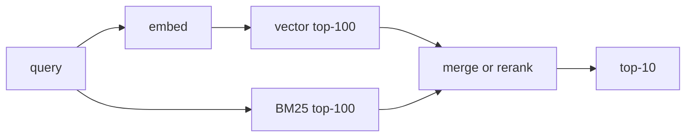
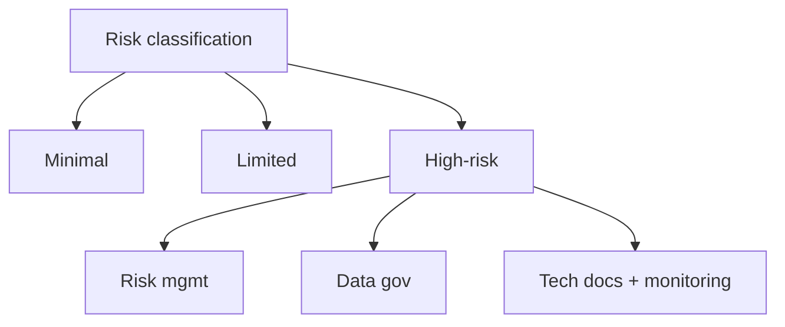
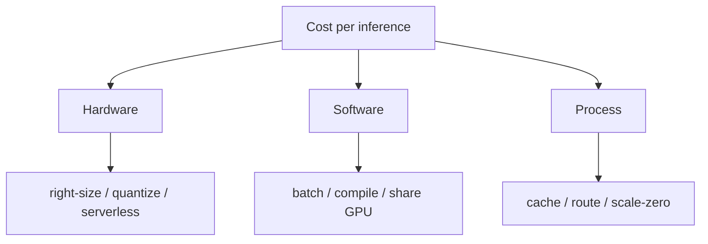
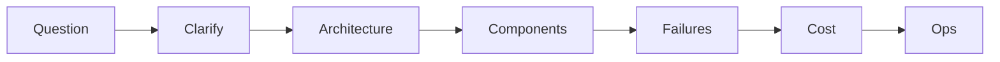
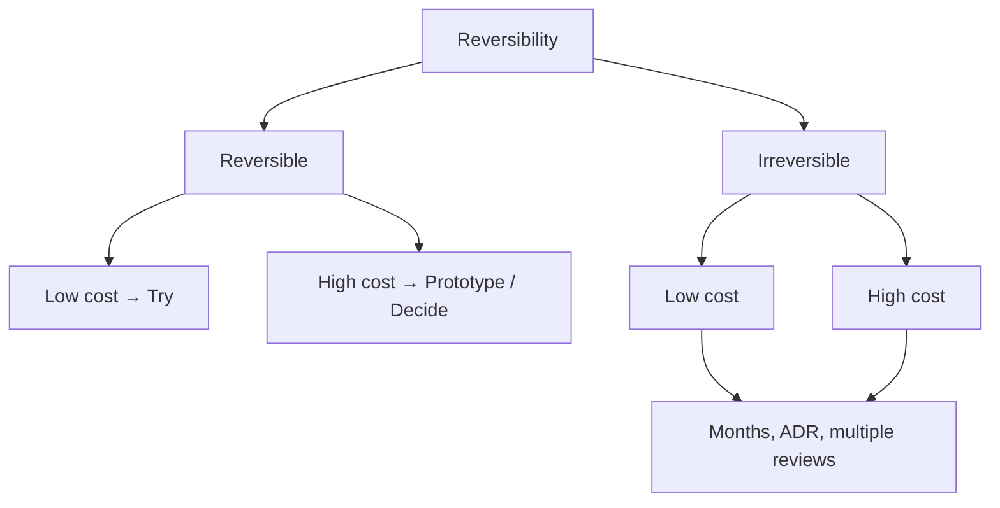

# 11 — Theory Primers and F500 Interview Bank — Part 2 of 2: Sections 10-20, Distributed Training through Architect-Level Decisions, plus the Interview Sprint

This is part 2 of 2 of the Theory Primers and F500 Interview Bank lesson. Here we cover the advanced MLOps domains — distributed training, GPU inference optimization, Kubernetes for ML, streaming features, LLMOps, vector databases, governance, security, FinOps, ML system design, and architect-level decisions — each with a theory primer and graded interview questions, followed by a final-week interview sprint guide.

---

## Section 10 — Distributed Training (DDP, FSDP, ZeRO, TP, PP)

### The Theory

The five parallelism strategies:

| Strategy | Splits | Use |
|---|---|---|
| DDP | Batches across replicas | Default multi-GPU |
| FSDP / ZeRO-3 | Params + grads + optimizer state | Model > one GPU |
| Tensor Parallel | Layer weight matrices | Single layer > one GPU |
| Pipeline Parallel | Layers across GPUs | Very deep models |
| Expert Parallel | MoE experts | MoE only |

**FSDP / ZeRO-3** is the 2026 standard for any single-model training that doesn't fit on one GPU. Shards everything; pays in communication.

**3D parallelism** = TP within a node (NVLink-fast) + PP across nodes + DP/FSDP across pipeline replicas. Frontier models use this.

Memory math (mixed precision Adam):

| Component | Bytes per param |
|---|---|
| FP16 working + FP32 master | 6 |
| Gradients (FP16) | 2 |
| Optimizer state (Adam m, v in FP32) | 8 |
| Total | **16P** before activations |

For Llama-2-7B: ~112 GB before activations. FSDP/ZeRO-3 divides by N GPUs.

LoRA flips this: train ~0.5% of params, optimizer and gradients shrink ~200x. A 7B model fine-tunes on a single 24 GB GPU.

### The Mental Model

```
DDP:   each GPU has full model, full optimizer; gradients all-reduce
FSDP:  each GPU has 1/N of params + 1/N optimizer; all-gather then compute
TP:    one layer's weight split across GPUs; all-reduce per layer
PP:    each GPU holds a stage; activations flow forward, grads back
```

### Why F500 Asks This

Training cost dominates ML budgets at frontier labs and LLM-heavy F500s. Senior interviews dig hard here.

### Interview Questions

🟢 DDP vs FSDP — when do you reach for FSDP?

🟢 What's the relationship between FSDP and DeepSpeed ZeRO-3?

🟢 Why does mixed-precision training save memory and compute?

🟡 Walk me through GPU memory during Adam-based training. Where does each chunk go?

🟡 You have 8×A100-80GB and a 13B parameter model. How do you fine-tune?

🟡 Tensor parallel vs pipeline parallel — when do you reach for each?

🟡 Activation recomputation — what does it trade?

🔴 Design training infrastructure for an org that trains 5 models per week ranging from 7B to 70B parameters with mixed budget priority. Cover scheduling, preemption, checkpointing, multi-tenancy, observability, and the failure-recovery story.

---

## Section 11 — GPU Operations and Inference Optimization

### The Theory

GPU memory during inference is dominated by:

1. Model parameters (in chosen precision).
2. KV cache for autoregressive models (Transformers / LLMs).
3. Activations for the forward pass.

For LLM inference, the KV cache often beats parameters as the bottleneck:

$$\text{KV cache size} = 2 \times N_{\text{layers}} \times \text{seq\_len} \times \text{hidden\_dim} \times \text{bytes\_per\_element}$$

For Llama-2-7B at 4096 context in FP16: ~2 GB per request. At 100 concurrent requests: 200 GB.

The 2026 inference toolkit:

- **Continuous batching** — new requests join the batch at every token. Throughput 5–10x of static batching.
- **PagedAttention** — pages the KV cache like virtual memory; eliminates fragmentation.
- **Prefix caching** — reuse KV state for shared prefixes (system prompt, RAG context).
- **Speculative decoding** — small draft model proposes, big model verifies in parallel. 2–4x speedup.
- **Quantization** — INT8 (AWQ, GPTQ), INT4 (Marlin), FP8 (Hopper+). 2–4x throughput, < 1% quality loss.

For CV: the path is PyTorch → ONNX → TensorRT. 1.5–3x speedup typical.

### The Mental Model

```
Single GPU:
  Params (quantized)
  KV cache (paged, possibly quantized)
  Activations (forward only)
  Workspace (small)
                      ↑
                      └── all fit because we paged + quantized + batched
```

### Why F500 Asks This

Inference cost is roughly half of total ML spend. The engineer who can cut it 60% is the engineer who gets promoted.

### Interview Questions

🟢 Why is the KV cache often the bottleneck for LLM inference?

🟢 What does PagedAttention solve?

🟢 Continuous batching — why does throughput improve dramatically?

🟡 Walk me through quantization options for a 7B LLM. What do you pick and why?

🟡 Speculative decoding — describe end to end. When does it help, when does it hurt?

🟡 You move a CV model from FP32 PyTorch to INT8 TensorRT. What's the workflow and what can break?

🔴 Design an LLM inference cluster serving 50 fine-tuned variants of a base model, at 10K concurrent users, sub-second TTFT, with cost attribution per variant and quality regression alerts. Cover: hardware choice, serving framework, batching, caching, autoscaling, fallback, observability.

---

## Section 12 — Kubernetes for ML

### The Theory

K8s primitives that matter for ML:

| Resource | What |
|---|---|
| Pod | Smallest unit; one or more containers |
| Job | Run-to-completion pod |
| CronJob | Scheduled Job |
| Deployment | Long-running stateless replicas |
| Service | Stable DNS + load-balance over pods |
| ConfigMap / Secret | Config / secrets injected |
| PV / PVC | Durable storage |
| HPA / VPA | Pod autoscalers |
| Custom Resource (CRD) | Operator-defined (PyTorchJob, RayCluster, InferenceService) |

ML-specific:

- **NVIDIA device plugin** exposes `nvidia.com/gpu` as schedulable.
- **MIG** partitions A100/H100 into smaller schedulable instances.
- **Karpenter** (AWS) / **Cluster Autoscaler** for node count.
- **KEDA** for event-driven autoscaling on Kafka lag, queue depth, etc.

Operators to know: Kubeflow Training Operator, KubeRay, KServe, Spark Operator, Flink Operator, Argo Workflows.

GitOps with Argo CD / Flux: manifests in Git; controller reconciles cluster to match. `kubectl apply` from CI is anti-pattern.

### The Mental Model

```
Git (manifests)
    │
    ▼
Argo CD / Flux watches and reconciles
    │
    ▼
Kubernetes API
    │
    ▼
Pods / Jobs / Services / GPU / Operators
```

### Why F500 Asks This

Every F500 ML platform runs on K8s. Period.

### Interview Questions

🟢 Liveness vs readiness probes — when does each fire?

🟢 What's a CRD?

🟢 How do you request a GPU in a pod spec?

🟡 Walk me through a Job manifest for a training run with checkpointing.

🟡 MIG — when do you use it?

🟡 Multi-tenancy on a shared GPU cluster — what do you set up?

🔴 Design a multi-cluster K8s strategy for an org with 200 ML engineers, 50 training jobs running simultaneously, 200+ inference services, multi-region, multi-cloud. Cover: cluster topology, GPU pooling, fairness, isolation, networking, GitOps, secrets, observability.

---

## Section 13 — Streaming Features (Kafka, Flink)

### The Theory

You need streaming features when freshness matters: fraud (seconds), recommendations (this session), demand pricing (real time).

Architecture:


Flink concepts:

- **Watermarks** — "I've seen all events up to time T"; closes windows.
- **State backends** — HashMap (heap), RocksDB (disk-spillable for TB-scale state).
- **Checkpoints** — periodic durable snapshots; recovery point.
- **Savepoints** — user-triggered snapshots; lets you upgrade jobs.
- **Exactly-once via two-phase commit** — requires sink support.

Kafka KRaft mode removed Zookeeper; standard for new deployments.

Online/offline consistency: same transformations expressed once, run in both modes. Pure Beam, Flink in batch mode, or a feature store with a unified definition.

### The Mental Model

```
Event time vs processing time:
   Event time = when it happened
   Processing time = when Flink saw it
Watermark progresses event time; windows close on watermarks.
```

### Why F500 Asks This

Streaming features separate mid-level from senior MLOps engineers. Most candidates have not done this.

### Interview Questions

🟢 What's a watermark?

🟢 Difference between event time and processing time?

🟢 Why does exactly-once require two-phase commit at the sink?

🟡 Walk through a windowed feature computation: tumbling window of count + sum per user per minute.

🟡 Online/offline consistency — how do you guarantee a streaming feature matches its batch counterpart?

🟡 Flink savepoint workflow — what does it enable that checkpoints don't?

🔴 Design real-time fraud detection at 10K transactions/sec with sub-100ms decision latency, exactly-once labeling, model retraining triggered by drift, and a labeling UI feedback loop.

---

## Section 14 — LLMOps Foundations

### The Theory

LLMOps differs from classical MLOps:

| Classical | LLMOps |
|---|---|
| Train on your data | Adapt someone else's model |
| AUC / F1 metrics | Faithfulness, helpfulness — hard to score |
| Single output | Sequence; variable length |
| Pennies per inference | Dollars per million tokens |
| Deterministic given seed | Stochastic by design |
| Ground truth labels | LLM-as-judge or human |
| Retrain when drift | Re-prompt, re-retrieve, re-fine-tune |

The LLM serving stack: **gateway** → input filters → router → retrieval → cache → prompt registry → LLM (hosted or self-hosted) → output filters → logging.

Fine-tuning hierarchy:

- **SFT** — supervised, baseline.
- **LoRA / QLoRA** — adapter weights; 1–10% of full FT compute.
- **DPO** — preference pairs; cheaper, often equivalent to RLHF.
- **RLHF (PPO)** — heavy and finicky; mostly replaced by DPO/ORPO/KTO/GRPO.

Evaluation hierarchy:

- Automated metrics (BLEU/ROUGE/perplexity) — weak.
- LLM-as-judge — biased but cheap.
- Programmatic (schema/regex/test pass) — strong where applicable.
- Pairwise + ELO — strong for comparison.
- Human with rubrics — gold standard, expensive.

### The Mental Model

```
              [Cost]              [Quality]
                │                     │
Hosted frontier (GPT-4o, Claude)      │  ←── max quality, max cost
                │                     │
Hosted small (GPT-4o-mini)            │
                │                     │
Self-hosted 70B                       │
                │                     │
Self-hosted 7B-LoRA distilled         │  ←── low cost, often "good enough"
```

The architect's job: routing requests onto the right tier of this stack.

### Why F500 Asks This

Every F500 spun up dozens of LLM-powered features in the last two years. The bottleneck is the platform around the model.

### Interview Questions

🟢 SFT vs DPO — when do you reach for each?

🟢 What's continuous batching?

🟢 Why does the KV cache page like virtual memory?

🟡 Walk me through a RAG pipeline end to end. Where does most quality come from?

🟡 Build an eval harness for an LLM-powered customer-support assistant. What does success look like?

🟡 Compare vLLM, TGI, SGLang, TensorRT-LLM for serving.

🟡 Prompt injection — three defenses, where each fails.

🟡 Multi-LoRA serving — what does it solve?

🔴 Design an internal LLM platform for a 200-team enterprise. Cover: model layer (hosted + self-hosted), gateway, routing, prompt registry, eval, observability, cost attribution, governance, fallback, multi-region.

---

## Section 15 — Vector Databases and Retrieval

### The Theory

Vector DBs do approximate nearest-neighbor search. Main algorithms:

- **HNSW** — graph; fastest; more memory.
- **IVF + PQ** — clusters + product quantization; cheaper.
- **DiskANN** — disk-backed; billion-scale on cheap hardware.

Players: pgvector, Pinecone, Weaviate, Qdrant, Milvus, LanceDB, Vespa, OpenSearch k-NN.

Hybrid search:



Reranking with a cross-encoder (BGE-Reranker, Cohere Rerank) on the top 50–200 candidates is a big quality lift for cheap compute.

Embedding model choice matters: text-embedding-3-large vs BGE-large-v1.5 vs domain-fine-tuned. Dimensionality: 1536-dim has capacity; 256/384-dim is often enough and 4–6x cheaper.

### The Mental Model

```
Recall vs Latency vs Memory — pick two.
HNSW    → recall + latency, costly memory
IVF-PQ  → recall + memory, slower
DiskANN → memory + scale, slower
```

### Why F500 Asks This

Every RAG / search / personalization system has a vector DB. Knowing trade-offs is table stakes.

### Interview Questions

🟢 HNSW vs IVF — when do you pick each?

🟢 What does product quantization buy you?

🟢 Reciprocal Rank Fusion vs weighted score normalization for hybrid search.

🟡 Walk me through tuning HNSW parameters (M, ef) for recall@10 vs latency.

🟡 You need to upgrade your embedding model from v1 to v2. What's the migration path for an existing 100M-vector index?

🟡 Pinecone vs Qdrant vs pgvector — pick for a 50M-document RAG system.

🔴 Design an embedding pipeline + retrieval layer for a 500M-document corpus with weekly refresh, hybrid search, reranking, multi-tenant isolation, sub-200ms P99, and embedding-model rolling upgrade.

---

## Section 16 — Governance, Compliance, AI Act

### The Theory

Governance = "who's accountable for what this model does." Compliance = "we've documented that we did the right thing."

What every regulated production model needs:

- **Model inventory** — owner, purpose, lineage, slice metrics, limitations.
- **Model card** — public-facing description of intended use, performance, ethics.
- **Audit trail** — every promotion, every prediction (sampled), every label feedback. 7-year retention common.
- **Approval workflow** — high-risk models gated by risk committee.
- **Explanation and recourse** — SHAP / LIME / counterfactuals for credit, insurance, employment.

The 2026 regulatory landscape:

- **EU AI Act** — risk-based; high-risk systems require conformity assessment, technical documentation, post-market monitoring.
- **NYC Local Law 144** — bias audits for employment AI.
- **Colorado AI Act, California regulations** — emerging US state-level.
- **GDPR Article 22** — restrictions on solely automated decisions.
- **HIPAA** — PHI protection.
- **SR 11-7** — US banks; model risk management.
- **NIST AI RMF** — voluntary; increasingly a baseline.

### The Mental Model



The higher the risk tier, the heavier the process.

### Why F500 Asks This

The architect who can't talk fluently about governance can't run an ML platform at a regulated F500.

### Interview Questions

🟢 What's a model card?

🟢 What does GDPR Article 22 restrict?

🟢 SR 11-7 — one sentence.

🟡 Walk me through what an EU AI Act high-risk model's documentation looks like.

🟡 You ship an automated credit decisioning model. What governance must exist before launch?

🟡 Bias audit for an employment AI system — what's in scope, what's out, who signs off?

🔴 Design the governance layer of an ML platform for a US bank that wants to ship 30 generative-AI use cases in 2 years. Cover: risk classification, intake, MRM workflow, evaluation evidence, monitoring, escalation, audit retention, regulator reporting.

---

## Section 17 — Security for ML

### The Theory

The ML attack surface:

- **Model extraction** — clone via API queries.
- **Adversarial examples** — perturbations that flip decisions.
- **Membership inference** — was X in the training set?
- **Model inversion** — reconstruct training data from outputs.
- **Data poisoning** — corrupt training data.
- **Prompt injection** — bypass system prompt in LLMs.
- **Indirect prompt injection** — malicious instructions in retrieved content.
- **Tool abuse** in agents.
- **Supply-chain** — malicious weights, packages, images.

Mitigations:

- AuthN/AuthZ on every inference endpoint; rate limit.
- Differential privacy when threat model warrants (Opacus).
- Watermarking outputs.
- Input sanitization + output filtering.
- Sigstore for model weights; SBOMs for ML pipelines.
- OIDC for short-lived CI credentials; secret manager for runtime.

### The Mental Model

```
[Threat] ──► [Attack vector] ──► [Mitigation]

Model theft  ──► API extraction        ──► Rate limit + auth
Adversarial  ──► Crafted inputs        ──► Robust training; input filter
Poisoning    ──► Training data corrupt ──► Provenance + audit
Inversion    ──► Output queries        ──► DP training
Prompt inj   ──► User input            ──► Input filter + jail confinement
```

### Why F500 Asks This

Senior interviews probe whether you've thought about attackers, not just users.

### Interview Questions

🟢 What's prompt injection? Direct vs indirect?

🟢 Differential privacy — one-sentence definition.

🟢 Why is rate limiting an anti-model-extraction defense?

🟡 Walk me through three prompt-injection defenses and where each fails.

🟡 Adversarial example in CV — how do you generate one, how do you defend?

🟡 Your LLM-powered agent has tool access to a database. Walk me through your safety controls.

🔴 Design the security architecture for an internal LLM platform with hosted + self-hosted models. Cover: input filtering, output filtering, tool sandboxing, audit, secret hygiene, supply chain, attack monitoring, incident response.

---

## Section 18 — Cost and FinOps for ML

### The Theory

Where the bill goes:

| Layer | % of total (typical) |
|---|---|
| Training | 20–40% |
| Inference | 30–60% |
| Storage | 5–15% |
| Egress | 5–15% |
| Vendors (LLM APIs, observability) | 5–25% |
| Tooling | 1–5% |

Inference levers: quantize, distill, batch, route, cache, scale-to-zero, right-size hardware.

Training levers: spot instances, early stopping, smarter HPO, transfer learning.

LLM-specific: prompt compression (LLMLingua), self-hosting once spend > ~$10K/month, distillation, semantic caching.

The classic anti-patterns: idle GPUs, endpoints with min-replicas > 0, cross-region transfer, HPO without early stopping, hot-tier log storage forever.

### The Mental Model



### Why F500 Asks This

CFOs see the ML bill. Engineers who can't talk cost can't get to staff.

### Interview Questions

🟢 What's the biggest single cost driver for LLM inference?

🟢 Why is scale-to-zero risky for production serving?

🟡 Walk me through five cost-cutting moves on an inference cluster.

🟡 Self-host vs hosted LLM — when does the breakeven flip and how do you model it?

🟡 Egress cost — what's the most common architecture mistake that creates it?

🔴 Take an organization spending $5M/year on ML, broken roughly 50/30/20 inference/training/storage. Design a year-long cost reduction program to cut 35% without regressing quality. Cover diagnostics, sequencing, risk, validation, organizational change.

---

## Section 19 — System Design for ML Specifically

### The Theory

The 45-minute interview rhythm:

1. **Clarify (5–10 min).** Scale, latency, freshness, accuracy, team, deadline. Always.
2. **High-level architecture (10 min).** Boxes and arrows. Container-level C4.
3. **Drill into 2–3 components (15–20 min).** Trade-offs explicit.
4. **Failure modes (5 min).** What breaks first.
5. **Cost (5 min).** Rough unit economics.
6. **Operational and org (5 min).** Who owns what.

Trade-offs interviewers love:

- Batch vs online vs streaming for features.
- Push vs pull for online features.
- Centralized vs federated org structure.
- Build vs buy.
- OSS vs managed serving.
- GPU vs CPU vs custom silicon.
- Caching at every layer.
- Sync vs async prediction.
- Single multi-task vs specialized models.
- Real-time vs scheduled retraining.

### The Mental Model



Each transition is explicit. Never skip clarify.

### Why F500 Asks This

System design is the senior signal. It tests whether you can think at altitude without losing detail.

### Interview Questions

🟢 What's the first thing you do when given a system design prompt?

🟡 Walk me through your structure for a 45-minute ML system design round.

🟡 What's the most common failure mode in system-design interviews?

🔴 Pick one of these and answer for 30 minutes:

- "Design real-time fraud detection for a payments network."
- "Design a recommendation system for a streaming service with 200M users."
- "Design a feature store for an organization with 50 ML teams."
- "Design the serving infrastructure for an internal LLM API supporting 1000 teams."
- "Design a system to retrain when it detects performance drift."
- "Design an embedding pipeline for 500M documents."
- "Design MLOps for a brand-new ML org joining a 50-year-old bank."
- "Migrate from SageMaker to self-hosted K8s ML platform with zero downtime."

For each: clarify scale, propose architecture, drill into 2–3 components, list failure modes, sketch cost, mention org.

---

## Section 20 — Architect-Level Decisions (Build vs Buy, ADRs, Migration)

### The Theory

**Type 1 vs Type 2 decisions (Bezos's frame):**

- Type 1 = irreversible. Heavy process.
- Type 2 = reversible. Fast.

For ML: primary cloud, primary feature store, build-vs-buy for serving, LLM provider, data residency are Type 1. Experiment tracker, HPO library, specific RAG framework are Type 2.

**ADRs** (Architecture Decision Records) — short doc per decision: context, decision, alternatives, consequences. Lives in version control. Numbered.

**Build vs buy frame:** 3-year TCO including hidden costs (engineering hours, operations, switching), time to value, strategic fit, vendor risk, talent availability, switching cost, compliance.

The bias to correct: junior engineers see "self-hosted is free." Architects see "self-hosted is ~$90K/year fully loaded for a small piece of software."

**Migration patterns:** strangler fig (incremental cutover, never big bang), parallel run with validation, explicit decommission criteria. Plan for 1.5–2x your initial estimate.

### The Mental Model



Calibrate process to the cell.

### Why F500 Asks This

Architect interviews probe judgment under ambiguity. The right answer is rarely a tool; it's a framing.

### Interview Questions

🟢 Type 1 vs Type 2 decisions — give an ML example of each.

🟢 What's an ADR?

🟡 Walk me through your build-vs-buy framework for a feature store.

🟡 A vendor wants 5 years. What do you negotiate for?

🟡 The strangler-fig pattern — walk through it for a migration off SageMaker.

🔴 An F500 has accumulated 15 years of ML platforms: a legacy SAS install, an internal Spark/Airflow stack, a SageMaker tenant, a recent Databricks adoption. The new CIO wants "one platform." Design the migration strategy with explicit ADRs for the Type 1 decisions, sequencing, success criteria per phase, organizational implications.

---

## Closing — How to Use This Chapter the Week Before an Interview

1. **Day 1–2.** Read every theory primer. Skim only.
2. **Day 3–5.** Pick 8 sections that match the JD. For each: 30 minutes practicing the 🟡 questions out loud. Time yourself.
3. **Day 6.** Pick 3 sections most relevant. Spend an hour on the 🔴 question of each. Write out the answer in bullet points, then rehearse the verbal version.
4. **Day 7.** Whiteboard or text-editor practice for the system design round using the Section 19 prompts.

The ROI on talking out loud is 10x reading. Most candidates fail interviews not because they don't know the material but because they've never said it aloud.

Good luck. The work compounds.

## You can now

- Answer graded (🟢/🟡/🔴) F500 interview questions across the advanced MLOps domains — distributed training (DDP/FSDP/ZeRO), GPU inference optimization, Kubernetes for ML, streaming features (Kafka/Flink), LLMOps, vector databases, governance, security, FinOps, ML system design, and architect-level decisions — at the depth each level expects.
- Reason quantitatively about GPU memory (16 bytes per parameter in mixed-precision Adam), KV-cache sizing for LLM inference, HNSW vs IVF-PQ recall/latency/memory trade-offs, and FinOps breakeven analyses — the numbers that separate senior from staff answers.
- Articulate the governance and security surface of a regulated ML platform: EU AI Act risk tiers, SR 11-7 model risk management, prompt-injection defenses, supply-chain integrity (Sigstore, SBOMs), and 7-year audit-retention requirements.
- Structure and deliver a 45-minute ML system-design round using the Section 19 framework — clarify, architect, drill into components, enumerate failure modes, sketch cost, cover org ownership — and apply the Type 1/Type 2 decision frame and ADR discipline from Section 20.
- Execute a focused final-week interview sprint using the Closing chapter's day-by-day plan, matching sections to a target job description and rehearsing 🟡 and 🔴 answers out loud until they are fluent.
