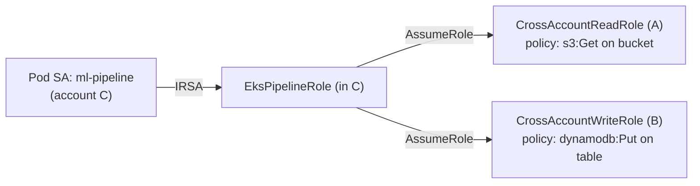

# 12 — Cloud from Basics to ML Expert (DL-Focused) — Part 2 of 8: AWS Account Topology, IAM & VPC (Part B, B1–B3)

This is part 2 of 8 of the "Cloud from Basics to ML Expert" lesson. Part 1 covered Part A — the universal cloud foundations (regions, Linux, networking, IAM concepts, storage, encryption, observability, cost) that apply across every provider. Here we start Part B, the AWS deep dive, with account topology (B1), IAM in depth (B2), and VPC networking (B3) — the identity and network scaffolding everything else in AWS sits on.

---

## Part B — AWS in Depth

AWS is the most common F500 cloud. This section is intentionally long.

### B1. AWS account topology

Real F500 setups have many accounts, not one big account.

- **Organization** — the root container.
- **Organizational Units (OUs)** — logical groups (Production, Non-Prod, Sandbox, Security, ...).
- **Accounts** — isolation boundary. Separate billing, IAM, blast radius.
- **AWS Control Tower** — managed multi-account setup with guardrails.
- **Service Control Policies (SCPs)** — restrict what *any* identity in an OU/account can do (e.g., "deny launching GPU instances outside this region").

A typical ML org structure:

```
Organization
├── Security OU
│   ├── log-archive account
│   └── audit account
├── Shared Services OU
│   └── shared-tooling account (artifact registry, CI runners)
├── ML Platform OU
│   ├── ml-prod account
│   ├── ml-staging account
│   └── ml-sandbox account
└── Workload OUs (one per business unit)
```

<details>
<summary><strong>F500 Q:</strong> Why have a separate "ml-sandbox" account instead of giving data scientists a folder in the prod account?</summary>

**In-depth answer**

**Five reasons, in order of importance**:

1. **Blast radius**. A misconfigured policy, a leaked credential, an
   accidentally-public S3 bucket — contained to the sandbox account.
   Prod data, prod IAM, prod KMS keys, prod logs never co-mingle.
   This is the SR 11-7 + SOC 2 + ISO 27001 baseline expectation.

2. **Cost attribution and limits**. Each account has its own bill,
   Budget alerts, Service Quotas. A data scientist can't accidentally
   spin up 32 H100 instances in prod. Service Control Policies at
   the OU level can hard-cap instance types per account.

3. **IAM clarity**. In a single-account model, you fight policy
   wildcards forever. With separate accounts, the *account ID* is
   the boundary. Cross-account access is explicit (AssumeRole, S3
   bucket policies); intra-account access is just "you're in here."

4. **Compliance evidence**. Auditors want to see "production data
   never crossed into experimental workloads." With one account,
   you prove this with tag filters and prayers. With two accounts,
   you prove it with the absence of cross-account roles.

5. **Operational simplicity**. Sandbox can be aggressive: SCPs
   forcing instance stop after 12 hours, mandatory tagging, auto-
   deletion of unused buckets. Prod stays stable. Experimentation
   doesn't fight the safety rails meant for prod.

**The well-run topology**:

```
Organization Root
├── Security OU (log-archive, audit accounts)
├── Production OU (workload accounts, ml-prod)
├── Non-Prod OU (ml-staging, ml-dev)
└── Sandbox OU (ml-sandbox, individual-dev-accounts)
```

SCPs on Sandbox OU: deny KMS access to prod keys, deny IAM creation
of admins, mandate session tags, restrict to non-prod regions for
test, max instance types capped at $10/hour.

**SA-level twist**: AWS Control Tower automates this. Account Factory
(via Service Catalog) lets you provision a new sandbox account in
~30 minutes via API call, fully baseline-configured (log forwarding,
GuardDuty enabled, Config rules, tag policies). At F500 scale, the
"one account per engineer for prototyping" pattern works because
Control Tower makes it operationally cheap.

</details>

### B2. IAM deep — the most important AWS concept

Five core constructs:

- **Users** — long-lived human identities. Increasingly rare in well-run orgs; federation replaces them.
- **Groups** — sets of users sharing policies.
- **Roles** — non-human identities; assumed temporarily by users, services, or workloads.
- **Policies** — JSON documents attached to identities (identity-based) or resources (resource-based).
- **STS** — issues short-lived credentials (`AssumeRole`, `GetSessionToken`).

A policy looks like:

```json
{
  "Version": "2012-10-17",
  "Statement": [
    {
      "Effect": "Allow",
      "Action": ["s3:GetObject"],
      "Resource": "arn:aws:s3:::training-data-bucket/*",
      "Condition": {
        "StringEquals": {
          "aws:PrincipalTag/Team": "ml-platform"
        }
      }
    }
  ]
}
```

Key patterns:

- **IAM Identity Center (formerly SSO)** — federate from Okta / Google / AD; users get SSO + role assumption.
- **IAM Roles for EC2 / EKS pods (IRSA) / Lambda / SageMaker** — workloads assume roles via instance metadata; no key in code.
- **OIDC federation for GitHub Actions** — GitHub provides a short-lived token; AWS trusts it via an OIDC provider; assume a role; do the thing.
- **Resource-based policies on S3 buckets / KMS keys** — useful for cross-account access.

The most-failed F500 IAM topics:

- **Trust policy vs permission policy** — trust policy says who can assume me; permission policy says what I can do.
- **Permissions boundaries** — a ceiling on what a role can do regardless of policies attached.
- **Service-linked roles** — roles owned by AWS services that you can't fully customize.

<details>
<summary><strong>F500 Q:</strong> Explain the difference between an IAM role's trust policy and its permission policy. Walk through what happens when GitHub Actions assumes that role via OIDC.</summary>

**In-depth answer**

**Trust policy** — answers "who can become me?" Attached to the role.
Defines the set of principals (users, roles, services, federated
identities) that can call `sts:AssumeRole*` to get temporary credentials
for this role.

**Permission policy** — answers "what can I do once I'm this role?"
A standard IAM policy attached to the role defining allowed/denied
actions on resources.

These are two separate JSON documents. Confusing them is the most
common F500 IAM mistake.

**The GitHub Actions → AWS via OIDC flow**:

1. **One-time setup**: in AWS, create an Identity Provider of type
   "OpenID Connect" pointing at
   `https://token.actions.githubusercontent.com`. AWS now trusts
   tokens signed by GitHub's OIDC issuer.

2. **Create the IAM role** with a trust policy like:
   ```json
   {
     "Version": "2012-10-17",
     "Statement": [{
       "Effect": "Allow",
       "Principal": {
         "Federated": "arn:aws:iam::123:oidc-provider/token.actions.githubusercontent.com"
       },
       "Action": "sts:AssumeRoleWithWebIdentity",
       "Condition": {
         "StringEquals": {
           "token.actions.githubusercontent.com:aud": "sts.amazonaws.com"
         },
         "StringLike": {
           "token.actions.githubusercontent.com:sub": "repo:my-org/my-repo:ref:refs/heads/main"
         }
       }
     }]
   }
   ```
   Note: the `sub` claim is the tight binding. Without it any GitHub
   workflow in any repo could assume your role.

3. **Attach a permission policy** (separately) like:
   ```json
   {
     "Version": "2012-10-17",
     "Statement": [{
       "Effect": "Allow",
       "Action": ["s3:PutObject"],
       "Resource": "arn:aws:s3:::ml-artifacts/*"
     }]
   }
   ```

4. **In the GitHub Actions workflow**:
   ```yaml
   permissions:
     id-token: write
     contents: read
   steps:
     - uses: aws-actions/configure-aws-credentials@v4
       with:
         role-to-assume: arn:aws:iam::123:role/gha-ml-publish
         aws-region: us-east-1
   ```

5. **At runtime**:
   - GitHub Actions generates an OIDC JWT containing claims:
     `iss=https://token.actions.githubusercontent.com`, `aud=sts.amazonaws.com`,
     `sub=repo:my-org/my-repo:ref:refs/heads/main`, plus repo, run_id,
     actor.
   - `configure-aws-credentials` calls `sts:AssumeRoleWithWebIdentity`
     passing the JWT.
   - STS validates: signature (against GitHub's JWKS), `aud`, `iss`,
     `exp`. Then evaluates the role's trust policy — does `sub` match
     the StringLike pattern?
   - If yes: STS issues short-lived AWS credentials (access key,
     secret key, session token; default 1-hour TTL).
   - The workflow uses these credentials. CloudTrail logs
     `AssumeRoleWithWebIdentity` with the GitHub workflow info as
     `requestParameters`.

**The win**: zero long-lived AWS secrets in GitHub. Trust policy
restricts to specific repo + branch + (optionally) environment +
workflow file. Credentials auto-expire.

**SA-level twist**: pin the `aud` claim to `sts.amazonaws.com` and
the `sub` to *exact* values, not loose globs. Common mistakes: using
`StringEquals` instead of `StringLike` and missing a pull-request
event scope (PRs have `sub=repo:org/repo:pull_request`, not `ref:`).
Add explicit conditions for `repository_owner` and `environment` for
defense in depth.

</details>

<details>
<summary><strong>F500 Q:</strong> Your ML pipeline pod in EKS needs to read from S3 in account A and write to DynamoDB in account B. Sketch the IRSA + cross-account assume-role setup.</summary>

**In-depth answer**

**Setup overview**:



**Step by step**:

1. **In account C (cluster account)** — create `EksPipelineRole` with
   IRSA trust to the K8s ServiceAccount `ml-pipeline` in namespace
   `ml-prod`. Its permission policy grants `sts:AssumeRole` on the
   two cross-account roles:
   ```json
   {
     "Effect": "Allow",
     "Action": "sts:AssumeRole",
     "Resource": [
       "arn:aws:iam::AAAA:role/CrossAccountReadRole",
       "arn:aws:iam::BBBB:role/CrossAccountWriteRole"
     ]
   }
   ```

2. **In account A** — create `CrossAccountReadRole` with:
   - Trust policy: trusts `arn:aws:iam::CCCC:role/EksPipelineRole`
     as principal.
   - Permission policy: `s3:GetObject`, `s3:ListBucket` on the
     specific bucket only.

3. **In account B** — create `CrossAccountWriteRole` with:
   - Trust policy: trusts `arn:aws:iam::CCCC:role/EksPipelineRole`.
   - Permission policy: `dynamodb:PutItem`, `dynamodb:BatchWriteItem`
     on the specific table.

4. **Annotate the K8s ServiceAccount**:
   ```yaml
   metadata:
     annotations:
       eks.amazonaws.com/role-arn: arn:aws:iam::CCCC:role/EksPipelineRole
   ```

5. **Pod code** (boto3 example):
   ```python
   import boto3
   # Default session uses IRSA-injected credentials → EksPipelineRole
   sts = boto3.client("sts")
   # Read from account A
   creds_a = sts.assume_role(
       RoleArn="arn:aws:iam::AAAA:role/CrossAccountReadRole",
       RoleSessionName="read-data",
       DurationSeconds=3600,
   )["Credentials"]
   s3 = boto3.client(
       "s3",
       aws_access_key_id=creds_a["AccessKeyId"],
       aws_secret_access_key=creds_a["SecretAccessKey"],
       aws_session_token=creds_a["SessionToken"],
   )
   data = s3.get_object(Bucket="data-bucket", Key="...")["Body"].read()

   # Write to account B (separate assume)
   creds_b = sts.assume_role(...)
   ddb = boto3.client("dynamodb", ...)
   ddb.put_item(...)
   ```

**Key details**:

- **External ID** in cross-account trust policies (for third-party
  cases) — not strictly required for internal cross-account, but
  good hygiene.
- **MFA condition** on the assume role can be enforced for sensitive
  cross-account access.
- **Session tags** can be passed through; useful for column-level
  filtering in Lake Formation.
- **`DurationSeconds`** caps at 12 hours (or whatever
  `MaxSessionDuration` is set to on the target role).

**SA-level twist**: at F500 scale, this gets tedious. Consider AWS
Resource Access Manager (RAM) for sharing specific resources directly
(e.g., Glue catalog tables, Lake Formation grants) without the
explicit assume-role dance. For data-plane sharing (S3 reads at
scale) S3 Access Points + IAM cross-account is more performant than
serial assume-role calls per request.

</details>

<details>
<summary><strong>F500 Q:</strong> A junior engineer pasted an AWS access key into a public repo. Walk through the incident response, including how a well-designed account topology limits blast radius.</summary>

**In-depth answer**

**Minute 0-5 — Contain**:

1. **Deactivate the key immediately**. `aws iam update-access-key
   --status Inactive --access-key-id <ID>`. Don't delete yet — you
   need the audit trail.
2. **Revoke active sessions** for the user: `aws iam attach-user-policy
   --policy-arn arn:aws:iam::aws:policy/AWSDenyAll --user-name X`,
   then `aws iam delete-access-key`.
3. **Force GitHub secret push protection** — verify the leak is
   actually public; check repo's commit history for the key string.

**Minute 5-30 — Assess**:

4. **CloudTrail query** — search for `accessKeyId = <ID>` over the
   last 7-30 days:
   ```sql
   SELECT eventTime, eventName, sourceIPAddress, awsRegion, userAgent
   FROM cloudtrail_logs
   WHERE accessKeyId = 'AKIA...'
   ORDER BY eventTime DESC
   ```
   Look for: unusual IPs (esp. Tor exit nodes), unusual regions
   (your team uses us-east-1, calls from ap-southeast-2 are
   suspicious), unusual API calls (`ec2:RunInstances` for crypto
   mining is canonical).
5. **GuardDuty findings** — should already be alerting on credential
   anomalies. Check the console.

**Minute 30-2hr — Eradicate**:

6. **Rotate any secondary credentials** in the same account (S3
   bucket policies, KMS key access, downstream system credentials)
   if the leaked key had access.
7. **Scrub Git history** — `git filter-repo` or BFG. The key is
   already known by GitHub's secret scanning anyway, but reduce
   future discoverability.
8. **AWS Support case** if you suspect actual compromise — AWS will
   help review.

**Minute 2hr+ — Recover and prevent**:

9. **Restore the user** with a fresh key (or, better, migrate them
   to AWS IAM Identity Center / SSO so they never have a long-lived
   key again).
10. **Update GitHub secret scanning** — `repository_security_policy`
    + push protection.
11. **Run the postmortem**. What controls failed? Why didn't push
    protection block? Why did the user have a long-lived key at all?

**How account topology limits blast radius**:

If the leaked key belonged to a user in the **prod account**, blast
radius = prod. Catastrophic.

In the well-designed topology:

- **The user has no long-lived key**. They authenticate via SSO →
  AssumeRole → 1-hour creds. There's no key to leak.
- **If they're in a sandbox account**: blast radius = sandbox.
  SCPs cap instance types ($/hour limit), block cross-account
  access to prod, restrict to non-prod regions. Worst case is a
  $5K crypto-mining bill, contained.
- **If they're in shared services**: trust policies on prod roles
  require MFA via condition (`aws:MultiFactorAuthPresent = true`).
  The leaked key without MFA can't AssumeRole into prod.
- **GuardDuty + Security Hub** aggregate findings across accounts;
  one alert pipeline catches anomalies wherever they originate.

**The 2026 prevention stack**:

- **IAM Identity Center** — no long-lived keys for humans, ever.
- **OIDC for CI** — no long-lived keys for automation.
- **GitHub push protection + secret scanning** — blocks at the push.
- **AWS Access Analyzer** — finds unused permissions to prune.
- **AWS IAM Roles Anywhere** — for on-prem / non-EKS workloads that
  used to need long-lived keys.

**SA-level twist**: the architect's question after the incident is
"why did a long-lived access key exist at all?" The right answer
isn't better key rotation — it's eliminating the failure mode by
moving everyone to short-lived federated credentials. That's a
multi-quarter program at F500 scale.

</details>

### B3. VPC deep — networking on AWS

VPC = Virtual Private Cloud, your isolated network.

Components:

- **VPC** — a CIDR (e.g., `10.0.0.0/16`).
- **Subnets** — sub-CIDRs, each tied to one AZ.
- **Internet Gateway (IGW)** — the door for VPC ↔ public internet (egress + ingress).
- **NAT Gateway** — lets private subnets *initiate* outbound traffic without being publicly addressable. Costs real money per GB.
- **Route tables** — per subnet; determine where traffic goes.
- **Security groups** — stateful firewall at instance/ENI level. Default deny inbound.
- **NACLs (Network ACLs)** — stateless firewall at subnet level. Less commonly used.
- **VPC endpoints** — private network paths to AWS services (S3, DynamoDB, ECR, etc.) that bypass the public internet.
- **VPC peering / Transit Gateway** — connect VPCs.

A canonical ML VPC layout per region:

```
VPC 10.0.0.0/16
├── Public subnets   (10.0.0.0/22 across 3 AZs)
│       └── ALBs, NAT gateways, bastion (if any)
├── Private subnets  (10.0.16.0/20 across 3 AZs)
│       └── EKS nodes, EC2 training instances, SageMaker, etc.
└── Database subnets (10.0.32.0/24 across 3 AZs)
        └── RDS, ElastiCache
```

Three NICE-to-knows:

- **Egress-only Internet Gateway** for IPv6.
- **VPC Flow Logs** — capture all traffic to/from ENIs.
- **PrivateLink** — expose your service privately to other VPCs / accounts.

<details>
<summary><strong>F500 Q:</strong> Why is a VPC endpoint for S3 not just a security improvement but a cost optimization?</summary>

**In-depth answer**

**Security side**:

- Without a VPC endpoint, S3 traffic from a private subnet has to
  hairpin through a NAT gateway → IGW → public internet → S3 → and
  back. The traffic uses public IPs even if it never leaves AWS's
  backbone.
- With a Gateway VPC endpoint, the traffic stays inside AWS, routed
  via the endpoint's route entry, never touching the public internet.
- VPC endpoint policies + bucket policies + `aws:SourceVpce`
  conditions let you assert: "this bucket is only readable from
  this VPC's endpoint." Defense in depth.

**Cost side — where the real argument lives**:

- **NAT gateway pricing is brutal**: $0.045/hour ($32/month) per NAT
  per AZ — that's the fixed cost. The killer is **$0.045 per GB of
  data processed**.
- For ML workloads, that S3 ↔ EC2 traffic is *massive*. A training
  job reading 5 TB of images via NAT: 5,000 GB × $0.045 = **$225 per
  run**. Multiply across many experiments and the NAT bill exceeds
  the GPU bill.
- An S3 Gateway VPC endpoint costs **$0**. No hourly charge, no per-
  GB charge. It's literally free.

**The economics**:

| Workload | Without endpoint | With endpoint |
|---|---|---|
| Pull 5 TB train data once | $225 NAT egress | $0 |
| 100 training runs/month at 5 TB each | $22,500 NAT | $0 |
| Plus NAT fixed cost (3 AZ × $32) | $96/month | $96/month (still need NAT for other traffic) |

A typical F500 ML team saves $10-30K/month going from "everything
through NAT" to "VPC endpoint for S3" — and that's *just* the data
transfer charge.

**Other endpoints worth doing** (also Gateway → free):

- **DynamoDB Gateway endpoint** — free, same pattern. Online feature
  store reads stop charging.

**Interface endpoints** (paid — different story):

- **ECR, CloudWatch Logs, STS, SSM, Bedrock, SageMaker, etc.** —
  Interface endpoints are AWS PrivateLink and cost ~$0.01/hour per
  endpoint per AZ + ~$0.01/GB. Still cheaper than NAT for high
  traffic, but verify the math per service.

**SA-level twist**: at F500 scale, NAT data-transfer charges are the
single most common "hidden cost" line item that surprises VPs at the
quarterly review. The architect who proactively audits and adds VPC
endpoints saves the company $100K+/year in a multi-VPC environment,
often pays for their salary.

</details>

<details>
<summary><strong>F500 Q:</strong> Your GPU training instances in a private subnet need to pull container images from ECR. Walk through the connectivity options (NAT vs VPC endpoint vs PrivateLink) and trade-offs.</summary>

**In-depth answer**

**The three options**:

1. **NAT Gateway path** — pod requests image → kube-proxy routes to
   ECR's public endpoint → traffic egresses through NAT → IGW → public
   internet → ECR. Works out of the box. Costly: NAT $0.045/GB; a
   2 GB container image pulled 100x = $9 just for that one image's
   pulls. Across an org, easily $5-15K/month wasted.

2. **VPC Interface endpoint for ECR** — AWS PrivateLink. You enable
   two endpoints: `com.amazonaws.<region>.ecr.api` (control plane)
   and `com.amazonaws.<region>.ecr.dkr` (data plane). Plus the **S3
   gateway endpoint** (ECR stores blob layers in S3 under the hood).
   Then containerd / Docker daemon resolves ECR through these
   endpoints, no NAT involved.
   - Cost: ~$0.01/hour per endpoint per AZ × 3 AZs × 2 ECR endpoints
     = ~$43/month fixed + $0.01/GB data processed.
   - Worth it once you push more than ~1 TB/month through ECR.

3. **VPC Peering / Transit Gateway to a shared services VPC that
   owns ECR endpoints** — when many VPCs need ECR, centralize the
   endpoints in a shared VPC and peer/TGW. Saves replicating per
   VPC. F500 standard.

**Three gotchas**:

- **Forgetting the S3 gateway endpoint**. ECR's image layers come
  from S3. Without the S3 endpoint, layers still hairpin through
  NAT even with ECR endpoints.
- **Endpoint private DNS** — must enable. Without it, the ECR
  hostnames resolve to public IPs and your traffic exits the VPC
  even though the endpoint exists.
- **Cross-region pulls** — VPC endpoints are region-local. Pulling
  from `us-east-1` ECR in `us-west-2` requires either replication
  (ECR replication is one-way, async, low-cost) or paying egress.

**SA-level twist**: ECR Pull-Through Cache lets your ECR pull from
Docker Hub / Quay / GHCR through your AWS-resident cache. Combined
with VPC endpoints, even your third-party images don't hairpin
through the public internet. Audit-friendly + cost-friendly.

**The recommendation order for a new platform**:

1. S3 gateway endpoint (free, always)
2. DynamoDB gateway endpoint (free, if you use DDB)
3. ECR interface endpoints + S3 (paid but cheap; pays for itself
   at moderate traffic)
4. Other interface endpoints (STS, CloudWatch Logs, Bedrock,
   SageMaker) as workload demands
5. Pull-Through Cache when third-party registries enter the picture

</details>

<details>
<summary><strong>F500 Q:</strong> A pod in EKS can't reach an external API. Walk the diagnostic from inside out: security group, NACL, route table, NAT, IGW, DNS.</summary>

**In-depth answer**

**The diagnostic order — inside out**:

1. **Inside the pod**:
   ```sh
   kubectl exec -it pod -- curl -v https://external.api/v1
   ```
   Read the error. `Connection timed out` = network blocked. `Could
   not resolve host` = DNS broken. `Connection refused` = reachable
   but service not listening. Different errors = different problems.

2. **DNS resolution**:
   ```sh
   kubectl exec -it pod -- nslookup external.api
   kubectl exec -it pod -- cat /etc/resolv.conf
   ```
   If nslookup fails, suspect CoreDNS pod problems (`kubectl get pods
   -n kube-system | grep coredns`), VPC DHCP option set, or a
   security group blocking UDP 53 to the VPC resolver
   (`169.254.169.253`).

3. **Pod-to-service security group**. Pod's ENI security group must
   allow egress on the target port (typically 443). EKS by default
   uses the cluster security group + node group SGs; verify with:
   ```sh
   aws ec2 describe-security-groups --group-ids <sg-of-eni>
   ```
   The egress rules. Look for `allow tcp 443 to 0.0.0.0/0` (or to
   the API's CIDR if more restrictive).

4. **Subnet's NACL**. NACLs are stateless — must allow both inbound
   *and* outbound for the response port range. Typical mistake:
   blocking ephemeral ports (1024-65535) inbound, so SYN-ACK from
   the API can't return.

5. **Route table**. The pod's subnet must have a route to the
   destination. For external API → `0.0.0.0/0` should point to a
   NAT (if private subnet) or IGW (if public subnet). For a peered
   VPC API → the peering connection. Common bug: route table missing
   `0.0.0.0/0` entirely.

6. **NAT gateway / IGW health**.
   - NAT in the route table, but NAT exists in the right AZ?
   - NAT has an EIP?
   - NAT not in failed state (CloudWatch metric
     `IdleTimeoutCount` spiking suggests overload)?

7. **Source IP check**. CloudWatch / VPC Flow Logs:
   ```
   SELECT * FROM flow_logs WHERE srcaddr = '<pod-ip>'
   AND dstaddr = '<api-ip>'
   ```
   Action = `REJECT` tells you which SG / NACL dropped it. Most
   useful diagnostic.

8. **External — DNS** of the API itself. From outside AWS, does
   `external.api` resolve and respond? If no, the problem isn't you.

**The mnemonic order** (memorize for interviews):

> Pod → SG out → NACL out → Route table → NAT/IGW → External →
> NACL in (ephemeral) → SG in (stateful, auto-allowed by SG, must
> open by NACL)

**SA-level twist**: at F500 scale, the most common diagnosis is
"egress went through NAT but the destination is on AWS's public
endpoint — should be on VPC endpoint." Or: cluster pod is using a
different ENI than expected (with multi-ENI VPC CNI configurations,
ENIs have different SGs). Don't forget about `IRSA` token endpoint
failures masquerading as network problems.

The diagnostic that finds 80% of cases in 30 seconds: VPC Flow Logs
with REJECT filter on the pod IP.

</details>

---

## You can now

- Design a multi-account AWS Organization (Security, Shared Services, ML Platform, Workload OUs) with SCPs that cap blast radius for a sandbox account, and explain why "one prod account with folders" fails an SR 11-7 / SOC 2 audit.
- Distinguish an IAM role's trust policy from its permission policy, and wire up OIDC federation for GitHub Actions plus IRSA for EKS pods without a single long-lived credential in play.
- Chain cross-account `AssumeRole` calls so an EKS pod in one account can read S3 in a second account and write DynamoDB in a third, and know when Resource Access Manager or S3 Access Points beat serial assume-role calls.
- Run the incident-response playbook for a leaked AWS access key end to end, and explain how account topology limits the blast radius before remediation even starts.
- Design a production VPC for AWS ML workloads — public/private subnet split, CIDR sizing for thousands of pod IPs, and where NAT gateways and VPC endpoints belong.

## Try it

Sketch a 4-account AWS Organization for a 5-person ML team: Security, Shared Services, ML-Platform (prod), and Sandbox. Write the SCP you'd attach to the Sandbox OU, the IAM role and trust policy that lets GitHub Actions deploy to ML-Platform via OIDC, and the IRSA annotation for a training pod that needs to read from a Workload-account S3 bucket. Then find the one place in your sketch where you were tempted to reach for `*` in a policy statement, and replace it with the least-privilege version.
