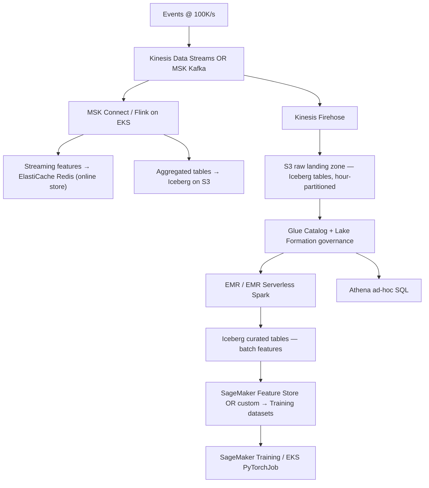

# 12 — Cloud from Basics to ML Expert (DL-Focused) — Part 5 of 8: AWS Data Services, Observability & Cost (Part B, B9–B11)

This is part 5 of 8, the last installment of Part B (AWS in depth). Here we cover AWS data services for ML (B9 — batch and streaming feature engineering), AWS observability and operations (B10), and AWS cost management (B11) — closing out the AWS-specific material before the lesson moves to other clouds in part 6.

---

### B9. AWS data services for ML

- **Glue** — managed Spark + serverless ETL + Data Catalog. Catalog is the metastore for Athena, EMR, Redshift, Lake Formation.
- **Athena** — SQL over S3 + Iceberg + Hudi + Delta.
- **EMR / EMR Serverless** — Spark, Hive, Trino on demand.
- **Redshift / Redshift Serverless** — analytical data warehouse.
- **Lake Formation** — governance over the data lake (row-level security, column masking, tag-based access).
- **DataZone** — newer; data governance + discovery across the org.
- **OpenSearch** — managed Elasticsearch; vector search via k-NN plugin.
- **ElastiCache (Redis)** — managed Redis; online feature store.
- **DynamoDB** — key-value NoSQL; another common online feature store.
- **Kinesis / MSK** — streaming. MSK = managed Kafka. Kinesis is AWS-native.
- **Iceberg on S3** — native first-class support across Glue, Athena, EMR, Redshift Spectrum.

<details>
<summary><strong>F500 Q:</strong> Design the data layer for an ML org with 50 TB of training data, real-time event ingestion at 100K events/sec, and a need to feature-engineer in both batch and streaming. Pick the AWS services and lay out their roles.</summary>

**In-depth answer**

**The architecture**:



**Each service's role**:

| Service | Role | Why |
|---|---|---|
| **Kinesis Data Streams** | Event ingestion at 100K/s | Native AWS, 7-day retention, ordered per-shard, autoscale via `OnDemand` mode |
| Or **MSK** (Kafka) | Same | If you need broader Kafka ecosystem, exactly-once via transactional producer/consumer, longer retention |
| **Kinesis Firehose** | Buffered S3 write of raw events | Managed, no code, partitions to Iceberg/Parquet |
| **MSK Connect / Flink on EKS** | Streaming feature compute | Stateful windowed aggregations, watermarks, exactly-once |
| **ElastiCache Redis** | Online feature store | Sub-millisecond reads for serving |
| **S3 + Iceberg** | Lakehouse storage | Open format, time travel, schema evolution, partitioned at hour level |
| **Glue Data Catalog** | Metastore | Shared metadata across Athena, EMR, Redshift, Spark |
| **Lake Formation** | Governance + RLS/CLM | Row + column security, tag-based access for compliance |
| **EMR Serverless** | Batch feature compute | Spark for joins, aggregations, complex transforms over 50 TB |
| **Athena** | Ad-hoc SQL | Analyst access without spinning EMR |
| **SageMaker Feature Store** | Feature definition + serving abstraction | Optional; some orgs hand-roll instead |
| **OpenLineage + Marquez** | Lineage tracking | Compliance |

**Capacity / sizing math**:

- 100K events/sec × 1 KB/event = 100 MB/sec = ~8.6 TB/day raw.
- Kinesis: shards at 1 MB/s write each; need ~100 shards (or
  OnDemand mode with auto-scaling).
- 50 TB existing + 8.6 TB/day = ~315 TB after a month. Lifecycle
  Iceberg snapshots aggressively (expire old snapshots, compact
  small files).
- Streaming feature state in Redis: a few GBs typically.

**Compliance and governance layer**:

- **Lake Formation tag policies** for PII fields.
- **Column-level masking** for sensitive fields when accessed by
  non-privileged roles.
- **OpenLineage events** flowing into a graph DB for "which dataset
  was used in which model" queries.
- **Glue Data Quality** rules on bronze→silver pipeline.

**Cost ballpark** (educational estimate, real numbers depend on
workload):

- Kinesis OnDemand: ~$36/day base + per-GB charges → ~$3K/month.
- Firehose: ~$0.029/GB ingested → ~$7K/month.
- S3 Standard for hot tier: ~$25/TB/month × 100 TB = $2.5K/month.
- S3 Glacier IR for cold: ~$4/TB/month.
- EMR Serverless on-demand: $0.052/vCPU-hour, varies.
- ElastiCache Redis: depending on cluster size, $1-5K/month.
- Total ML data layer: ~$20-40K/month at this scale.

**SA-level twist**: the *partitioning strategy* is the make-or-break
decision. Iceberg's hidden partitioning + bucketing for high-
cardinality join keys (user_id) is critical for both feature
backfill scans (point-in-time-correct joins) and concurrent reader
performance. Pick partitions before going to scale, because
re-partitioning 50 TB is painful.

**Senior signal**: discuss **Lambda-vs-Kappa** explicitly. The
default in 2026 is Kappa-ish: stream is the source of truth, batch
queries are time-traveled reads of the same lakehouse tables.
Avoids the double-codebase problem.

</details>

### B10. AWS observability and operations

- **CloudWatch Logs** — log destination; agent on EC2/EKS via Fluent Bit or CloudWatch Logs Agent.
- **CloudWatch Metrics** — TS metrics; alarms.
- **CloudWatch Logs Insights** — query language for logs.
- **CloudWatch Container Insights** — K8s + Fargate metrics.
- **X-Ray / AWS Distro for OpenTelemetry (ADOT)** — traces.
- **CloudTrail** — API audit log. *Every* API call. Required for compliance.
- **Config** — resource configuration history + compliance rules.
- **GuardDuty** — security threat detection.
- **Security Hub** — aggregates findings across services.

For ML serving specifically, a typical stack: ADOT collector in the pod → Prometheus-format metrics scraped by AMP (Managed Prometheus) → Amazon Managed Grafana → CloudWatch Alarms / SNS for paging.

<details>
<summary><strong>F500 Q:</strong> Walk through a request path from API Gateway → ALB → EKS pod, showing where you'd capture metrics, where logs, where traces, and how you'd correlate them.</summary>

**In-depth answer**

**The full path**:

```
Client
  │  HTTP request with X-Request-ID (or we generate one)
  ▼
[API Gateway]
  │  Metric: count, latency, 4xx/5xx, throttle.
  │  Log: full request/response (configurable; expensive).
  │  Trace: start root span; propagate trace-id in W3C TraceContext header.
  ▼
[ALB]
  │  Metric: TargetResponseTime, HTTPCode_Target_5XX, HealthyHostCount.
  │  Log: access logs to S3 (optional; cheap).
  │  Trace: pass-through. ALB doesn't emit trace spans natively;
  │         use X-Ray ALB integration or just pass headers.
  ▼
[EKS Pod — Service]
  │  Instrument: OpenTelemetry SDK in app code.
  │  Metric: per-endpoint request count, latency histogram,
  │          per-model inference time, GPU utilization (DCGM),
  │          cache hit rate, request queue depth.
  │          Emitted to Prometheus /metrics scraped by OTel Collector.
  │  Log: structured JSON via stdout; FluentBit ships to CloudWatch /
  │       Loki. Every log line includes trace-id + request-id.
  │  Trace: spans for preprocessing → inference → postprocessing.
  │         Spans tagged with model_version, tenant_id, request_size.
  └──► Downstream: Bedrock / feature store / model server.
        Each call is a child span.
```

**Where to capture each pillar**:

- **Metrics** (Prometheus + Mimir / AMP):
  - API Gateway → CloudWatch metrics auto-emitted; mirror to
    Prometheus via cloudwatch-exporter or alternatives.
  - ALB → CloudWatch metrics auto-emitted.
  - EKS pod → app code emits via OTel; OTel Collector scrapes
    `/metrics` and forwards.
  - Node GPU → NVIDIA DCGM exporter as a DaemonSet.

- **Logs** (Loki / CloudWatch Logs / OpenSearch):
  - API Gateway → optional access logs to S3 or CloudWatch.
  - ALB → access logs to S3.
  - EKS pod → FluentBit DaemonSet → CloudWatch / Loki.
  - All logs include `trace_id`, `span_id`, `request_id`, `tenant_id`.

- **Traces** (Tempo / X-Ray / Jaeger):
  - OTel Collector receives OTLP from pods; ships to Tempo / X-Ray.
  - W3C TraceContext header (`traceparent`) propagated end-to-end.
  - For LLM apps, add custom attributes per span:
    `gen_ai.system="bedrock"`, `gen_ai.usage.input_tokens`,
    `gen_ai.usage.output_tokens`, `gen_ai.response.finish_reasons`.

**How to correlate**:

1. **Trace ID is the master key**. Every log line carries it. Every
   metric (for slow-paths or errors) is annotated with it via
   exemplars.
2. **In Grafana**: click on a slow latency point → exemplar links
   directly to the trace in Tempo → trace shows spans across pod,
   feature store call, Bedrock call → click a span → linked log
   query in Loki shows the structured log lines.
3. **CloudWatch alternative**: ServiceLens + X-Ray Service Map gives
   you the topology view; CloudWatch Container Insights provides
   pod/container metrics; Logs Insights queries with `parse @message
   '*"trace_id": "*"*'` to filter by trace.

**The full stack diagram** (in 2026 best-practice form):

```
EKS Pod
  ├── App (Python) with otel-sdk
  │     emits OTLP over gRPC to localhost:4317
  ├── OTel Collector DaemonSet
  │     receives OTLP
  │     scrapes /metrics
  │     batches, processes, forwards
  └── FluentBit DaemonSet
        ships stdout to log backend

OTel Collector forwards:
  ├── Metrics → AWS Managed Prometheus
  ├── Traces → AWS X-Ray (or Tempo)
  └── Logs → CloudWatch Logs (or Loki)

Grafana / AWS Managed Grafana unifies all three.
```

**SA-level twist**: at F500 scale the trace sampling strategy matters.
100% sampling is expensive (storage, processing). Use **tail-based
sampling** in OTel Collector — keep all error traces, slow traces,
random 1% baseline. Saves 95%+ of trace storage with no loss of
diagnostic value.

**Senior signal**: mention **OpenTelemetry GenAI semantic conventions**
(stable as of 2024) — the namespaced attributes for LLM observability
(`gen_ai.*`). Using these makes traces queryable across LLM
observability vendors (Langfuse, Braintrust, Helicone, Datadog) and
future-proof against tool migration.

</details>

### B11. AWS cost management

- **AWS Cost Explorer** — interactive UI for spend.
- **AWS Budgets** — alerts on spend / forecast.
- **AWS Cost and Usage Report (CUR)** — detailed billing data into S3; query with Athena.
- **Compute Optimizer** — recommendations for right-sizing.
- **Trusted Advisor** — best practices including cost.
- **Savings Plans** vs **Reserved Instances** vs **Spot** — pick mix.
- **Resource Tagging** + **Cost Allocation Tags** — required for attribution.

The DL-specific cost killers:

- Idle GPU instances (notebooks, endpoints with `min_instances > 0`).
- Cross-AZ / cross-region data transfer for training.
- CloudWatch Logs ingestion at high volume.
- NAT Gateway egress for pod-to-pod traffic that should have been on a VPC endpoint.
- Storage in Standard that should be in Intelligent-Tiering.
- Misconfigured S3 multipart uploads accumulating.

<details>
<summary><strong>F500 Q:</strong> Your ML org's bill jumped 40% month over month with no apparent workload change. Walk through the diagnostic protocol.</summary>

**In-depth answer**

**Phase 1 — Quick categorization (1 hour)**:

1. **Cost Explorer view: month-over-month delta by service**.
   ```
   Filter: Linked Account = ml-prod
   Group by: Service
   Compare: This month vs last month
   ```
   Sort by absolute delta. The top 3 services usually explain 80%
   of the surprise.

2. **Cost Explorer view: delta by usage type**.
   Group by `UsageType`. Look for spikes in `BoxUsage:*` (EC2),
   `DataTransfer-*`, `Requests-*` (S3), `KMS-Requests`, etc.

3. **Tag audit**. Group by your `Project` or `Team` tag. Identify
   which team's spend jumped.

By the end of Phase 1 you should know: which service, which team,
which usage type.

**Phase 2 — Drill into the suspect (2-4 hours)**:

If the jump is in **EC2** (most common):
- Compute Optimizer recommendations for over-provisioned instances.
- Cost Explorer with daily granularity to find the day the jump
  started. Often correlates with a deploy or experiment kickoff.
- CloudTrail `RunInstances` events filtered by usage type.

If the jump is in **S3**:
- S3 Storage Lens or Cost Explorer by `UsageType=TimedStorage-*`.
- Did you forget to lifecycle to Glacier? Did versioning explode
  storage with old versions?
- Look for incomplete multipart uploads in old buckets.

If the jump is in **Data Transfer**:
- VPC Flow Logs (or Athena query over CUR data) showing top inter-
  region or out-to-internet traffic.
- Common culprit: a new training pipeline pulling data from a
  bucket in a different region.

If the jump is in **CloudWatch Logs**:
- Logs Insights query: by log group, summed size of incoming logs
  in the last month vs prior. Often a verbose new logging line
  in an inner loop explodes ingestion.

If the jump is in **NAT Gateway**:
- VPC Flow Logs showing top talker destinations through the NAT.
- Common: a new ECR pull pattern or S3 access without a VPC
  endpoint.

If the jump is in **SageMaker / Bedrock / Endpoints**:
- Endpoint hours billed = number of instances × hours.
- Did anyone disable scale-to-zero? Did `min_instances` get bumped?
- Bedrock provisioned throughput purchases (auto-renew default
  enabled — watch this).

**Phase 3 — Investigate the proximate cause (4-8 hours)**:

Once you've narrowed to a service + team + usage type:
- Talk to the team. Did they ship a new pipeline? Run an
  experiment? Forget to teardown?
- CloudTrail: list the IAM identities (roles, users) that
  initiated the spend.
- Check the CI/CD logs for the period — what deployed when?

**Phase 4 — Fix and prevent**:

- Right-size, scale to zero, lifecycle, add VPC endpoints — the
  standard playbook.
- **Set per-team budgets with 50/80/100% alerts**. The root cause
  of "no one noticed" is "no one was paying attention." Budgets
  fix this.
- **AWS Cost Anomaly Detection** — ML-driven anomaly detection on
  spend. Free. Turn it on if it isn't already.

**SA-level twist**: the diagnostic protocol works because you have
**CUR (Cost and Usage Report) in S3 queryable via Athena**. Without
it, you're stuck with Cost Explorer's UI which has aggregation
limits. The architect's first move at any new F500 engagement:
verify CUR + tags + Athena. If not in place, that's project zero.

**Senior signal**: mention that 40% MoM with no workload change is
almost never one thing — it's usually 2-3 stacked things (a new
endpoint stayed on, plus more storage, plus a new dev cluster).
The fix is per-team budgets to prevent the *next* one, not just
hunt-and-kill the current one.

</details>

---

## You can now

- Design a data layer for an ML org handling tens of terabytes of training data plus 100K events/sec of real-time ingestion, choosing the right AWS services for batch and streaming feature engineering.
- Trace a request from API Gateway through an ALB to an EKS pod and say exactly where you'd capture metrics, logs, and traces, and how you'd correlate them across services.
- Explain why an ML platform needs both Prometheus and OpenTelemetry rather than picking one, and what each one actually owns.
- Run the diagnostic protocol for a 40% month-over-month AWS bill spike with no apparent workload change — tags, idle resources, and the Cost and Usage Report first.
- Read a Cost and Usage Report via Athena to attribute GPU and storage spend per team or tag, and turn that into a per-team budget with alerts.

## Try it

Using the "50 TB batch + 100K events/sec streaming" data-layer question as your prompt, sketch your own AWS service map before checking the chapter's version. Then take a real or hypothetical monthly AWS bill and write the five-step diagnostic you'd run if it jumped 40% overnight — ordered cheapest-to-check first — and the one dashboard you'd build so you never have to run that diagnostic manually again.
