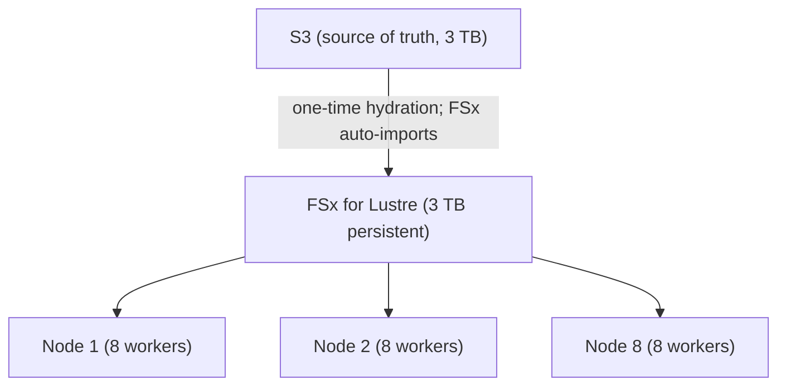

# 12 — Cloud from Basics to ML Expert (DL-Focused) — Part 7 of 8: DL-Specific Cloud Patterns (Part D)

This is part 7 of 8. Having covered universal foundations and AWS / GCP / Azure specifics, here we cover Part D: the DL-specific cloud patterns that show up regardless of provider — GPU choice (D1), multi-node training networking (D2), high-throughput storage for training (D3), LLM serving deployment (D4), and GPU FinOps (D5).

---

## Part D — DL-Specific Cloud Patterns

### D1. GPU choice across clouds in 2026

| Workload | NVIDIA | AWS custom | GCP custom |
|---|---|---|---|
| Training large LLM | H100, H200, B200 | Trainium 2 | TPU v5p |
| Training mid LLM / CV | A100, H100, L40S | Trainium | TPU v5e |
| Inference LLM heavy | H100, H200 | Inferentia 2 | TPU v5e |
| Inference LLM light / CV | L4, L40S, A10G | Inferentia 2 | TPU v5e |
| Edge / device | Jetson | — | Coral |

Pricing rough order: spot < on-demand < reserved. NVIDIA on-demand > Trainium / TPU on-demand > NVIDIA spot in many cases.

The decision: NVIDIA gives you the broadest software stack and best ergonomics. AWS custom and TPUs give you the lowest cost per FLOP if your model fits the supported software path. For LLM training the choice is increasingly about whether you can tolerate the silicon-specific software (Neuron SDK, JAX/XLA).

<details>
<summary><strong>F500 Q:</strong> You're planning a 12-month training program for a series of 13B-class models. Pick NVIDIA H100 vs Trainium 2. Walk through the trade-offs.</summary>

**In-depth answer**

**NVIDIA H100**:

- **Software**: PyTorch + CUDA + cuBLAS + cuDNN + NCCL — the most
  mature stack. Every paper's reference implementation runs on it.
- **Memory**: 80 GB HBM3 per GPU. 8 GPUs/node (`p5.48xlarge`) = 640 GB.
- **Compute**: ~989 TFLOPS FP16, ~1979 TFLOPS FP8 (sparsity-disabled).
- **Network**: NVLink 4 within node (900 GB/s), EFA-RDMA between
  nodes (3.2 Tbps on `p5.48xlarge`).
- **Cost**: `p5.48xlarge` on-demand ~$98/hr. Spot fluctuates; can be
  70% off but availability variable.
- **Ecosystem**: vLLM, TensorRT-LLM, FlashAttention-3 (Hopper-tuned).
  Every optimization shows up here first.

**AWS Trainium 2** (Trn2):

- **Software**: Neuron SDK. PyTorch via `torch_neuronx`; not full
  PyTorch ecosystem. JAX, TF, Megatron-LM via Optimum-Neuron.
- **Memory**: Trn2 instance (`trn2.48xlarge`) has 16 chips × 96 GB =
  1.5 TB of accelerator memory. Massive.
- **Compute**: Each Trainium 2 chip ~650 TFLOPS at FP16; aggregate
  ~10 PFLOPS per node — competitive with H100 node.
- **Network**: NeuronLink within node; EFA between nodes.
- **Cost**: roughly 30-40% lower $/effective-FLOP than equivalent
  H100 on-demand. The headline AWS pitch.
- **Ecosystem**: Hugging Face Optimum-Neuron supports common
  architectures (Llama, Mistral, T5). For custom architectures or
  bleeding-edge papers (Mamba, new attention variants), you wait
  for support or implement Neuron kernels yourself.

**For a 12-month 13B-class training program**:

**H100 wins on**:
- Time to first training run. Day 1, full PyTorch works.
- Iteration speed when you're experimenting with architecture
  variations (DPO, attention variants, MoE).
- Recovery from bugs / kernel issues — community support, public
  Stack Overflow.
- Compatibility with third-party tools (Hugging Face, vLLM, LangChain
  ecosystem).

**Trainium 2 wins on**:
- $/effective-FLOP for stable, well-defined training workloads.
- Memory per chip — 96 GB per chip is excellent for big-context
  training.
- Vendor lock-in flip side: AWS's roadmap commitment is to
  Trainium; pricing and availability incentives align.
- Combined with the AWS architecture (FSx, SageMaker HyperPod), the
  total managed-training experience is smoother than DIY H100.

**The recommendation depends on**:

| Factor | Pick H100 if | Pick Trainium 2 if |
|---|---|---|
| Custom architecture / research-heavy | ✓ | |
| Reference architectures (Llama, Mistral) | | ✓ |
| Team familiar with PyTorch/CUDA, not Neuron | ✓ | |
| Team willing to learn Neuron SDK | | ✓ |
| Budget cap is tight | | ✓ |
| Time-to-market is tight | ✓ | |
| Multi-cloud / portability concern | ✓ | |
| Already deep AWS commit | | ✓ |
| Need vLLM serving downstream | (training H100; serving could be either) | |

**A pragmatic 12-month plan**:

1. **Months 1-2**: Start on H100 for fast iteration. Validate
   architecture, data pipeline, training procedure end-to-end.
2. **Months 3-4**: Port training script to Neuron via Optimum-Neuron.
   Benchmark cost + throughput on Trn2.
3. **Months 5-12**: Bulk training runs on Trn2 for capacity-cost
   reasons; H100 reserved for experimentation and final fine-tuning
   passes.

**SA-level twist**: this hybrid pattern is what many F500 LLM teams
in 2026 actually do. The pure H100 path is "fastest but most
expensive"; the pure Trn2 path is "cheapest but slow to learn." The
hybrid splits the difference and de-risks vendor concentration.

**Senior signal**: mention that Trainium is also competitive with TPUs
on $/effective-FLOP for some workloads. If your team is comfortable
with non-NVIDIA accelerators (JAX/XLA experience), then GCP TPU v5
is another credible option in the same architectural conversation —
not for AWS's strategic reasons, but for capability.

</details>

### D2. Multi-node training networking

The non-obvious part: between-node bandwidth dominates training scaling.

- **NVLink** within a node (8 GPUs in `p5.48xlarge`): ~900 GB/s aggregate.
- **EFA + RDMA** between `p5.48xlarge` nodes: 400 Gbps per node.
- **InfiniBand** in HPC clouds (Lambda, CoreWeave): 800 Gbps per node common.
- **Standard ethernet** between random instances: 10–25 Gbps.

NCCL (NVIDIA Collective Communications Library) is the protocol; it automatically picks the fastest available transport. `NCCL_DEBUG=INFO` shows what it picked.

For multi-node training to scale, you need:

1. Instances in the same cluster placement group.
2. EFA enabled (`elastic-fabric-adapter-installer`).
3. Container with EFA + libfabric + NCCL plugin.
4. Pod spec requesting `vpc.amazonaws.com/efa` resource (on EKS).

If any layer is wrong, your training run will silently fall back to TCP and run at 1/10th throughput.

<details>
<summary><strong>F500 Q:</strong> Your two-node H100 training run gets 50% throughput of a one-node H100 run. List four diagnostic checks in order.</summary>

**In-depth answer**

This is a classic "scaling efficiency" problem. 50% on 2 nodes means
your distributed setup is poorly optimized — could be many things.

**The four checks in priority order**:

**Check 1 — NCCL is using EFA, not TCP**:

`NCCL_DEBUG=INFO` in environment. In the logs at job start, look for:

```
NCCL INFO NET/AWS Libfabric/0/EFA-rdma-write
```

If instead you see:

```
NCCL INFO NET/Socket : Using [0]eth0:...
```

You've silently fallen back to TCP. Possible causes:
- EFA not enabled on instance (verify with `fi_info -p efa`).
- EFA software stack not installed in container (`aws-ofi-nccl`
  plugin missing).
- Pod doesn't have `hostNetwork: true` (required for EFA in K8s).
- Wrong protocol — `NCCL_PROTO=simple` if you have issues.

**Fix**: install EFA + aws-ofi-nccl in container; enable
`hostNetwork`; set `FI_PROVIDER=efa`.

**Check 2 — Instances in the same cluster placement group**:

```bash
aws ec2 describe-instances --instance-ids ... \
  --query 'Reservations[].Instances[].Placement.GroupName'
```

If they're in different placement groups (or no placement group),
they may be on physically distant racks. Multi-rack TCP latency
~100µs vs intra-rack ~5µs; for all-reduce of GBs of gradients, this
adds up.

**Fix**: launch in a single cluster placement group. If `Insufficient
Capacity` errors, retry; AWS reserves cluster placement capacity
on a best-effort basis. ML Capacity Blocks help here.

**Check 3 — Batch size and gradient sync pattern**:

Run with `NCCL_DEBUG_SUBSYS=COLL`. Look at the all-reduce time per
step.

- If communication time is comparable to compute time, you're
  bandwidth-bound — you scale poorly.
- Solutions:
  - **Gradient accumulation**: do N micro-batches, then all-reduce
    once. Reduces sync frequency.
  - **Per-step batch size**: increase per-device batch to push the
    compute/communication ratio toward compute.
  - **FSDP `BACKWARD_PRE` vs `BACKWARD_POST` reshard policy** —
    overlapping comm with compute.
  - **`gradient_as_bucket_view=True`** in DDP — reduces memory
    fragmentation that slows comm.

**Check 4 — DataLoader and CPU/IO bottleneck**:

`nvidia-smi dmon -s u -d 1` showing GPU utilization sawtoothing
across all GPUs simultaneously? That's DataLoader starvation, not
distributed. Both nodes are stalling waiting for data.

- Check `iostat -xz 1` on each node — if disk is saturated, you've
  exceeded your local disk's throughput.
- Increase `num_workers`, `prefetch_factor`, use FSx Lustre or local
  NVMe cache.
- For multi-node, ensure data is *equally* fast on both nodes
  (one node reading from FSx, the other from S3 directly = the slower
  one bottlenecks).

**Other checks (5-N)**:

- **CUDA driver version mismatch** between nodes.
- **NCCL_TOPO_FILE** — explicitly set if NCCL is mis-detecting topology.
- **NCCL_SOCKET_IFNAME** — wrong NIC selected.
- **MTU mismatch** — non-9001 MTU on EFA links cuts performance.
- **Memory pressure** causing host-to-device transfers — verify with
  `free -h` no swap activity.
- **CPU governor** — set to `performance` not `powersave`.

**The diagnostic order matters**:

1. Verify EFA (90% of "bad scaling" cases — silent TCP fallback).
2. Verify placement (5%).
3. Verify communication/compute ratio (3%).
4. Verify DataLoader (2%).

**SA-level twist**: F500 ML platform teams build this as a *startup
diagnostic*. Every training job at startup logs a "scaling health"
report: detected NCCL transport, all-reduce bandwidth from a
benchmark, dataloader throughput. Catches misconfigurations before
the engineer wastes a week debugging.

**Senior signal**: mention `nccl-tests` (the canonical benchmark) and
that any new cluster should pass it (≥ 90% of theoretical bandwidth)
before being declared training-ready. If your nccl-tests numbers are
bad, no amount of framework tuning fixes it.

</details>

### D3. High-throughput storage for training

When your dataset can't fit in node-local SSD and you need many GPUs reading it simultaneously, you need a shared file system with high aggregate throughput.

Options:

- **FSx for Lustre** (AWS) — parallel file system; up to ~25 GB/s per file system; backed by S3 for durability. Mount on EKS via CSI.
- **GCS Fuse** — mount GCS as filesystem; OK for read-heavy, not POSIX-strict.
- **Filestore HPC** (GCP) — Lustre-equivalent on GCP.
- **WekaFS** — third-party; cross-cloud; very fast.
- **Lakehouse direct** (Iceberg over S3) — works fine for streaming reads with proper sharding.

Patterns that work for DL training:

- **WebDataset** sharded tar files in S3 + multi-worker DataLoader = scales well without a parallel FS.
- **Local SSD cache** — read once from object store at job start; subsequent epochs from local NVMe.
- **FSx Lustre** for genuinely random-access reads on multi-TB datasets.

<details>
<summary><strong>F500 Q:</strong> You're fine-tuning a 70B model on 8 nodes × 8 H100. Dataset is 3 TB of tokenized parquet. Where does the data live, in what format, and how do you ensure all 64 workers read at sufficient throughput?</summary>

**In-depth answer**

**The setup**: 70B fine-tune at, say, BF16 with FSDP. 64 H100s
collectively need ~2-5 GB/sec aggregate token throughput at decent
batch sizes. 3 TB of parquet must be readable in this pattern.

**Where the data lives**:

1. **Source of truth**: S3 (e.g., `s3://ml-data-prod/llm-finetune/v3/`).
   Tokenized parquet partitioned by shard (e.g., 1024 shards of
   3 GB each).
2. **Hot path**: FSx for Lustre, S3-imported, mounted to all 8 nodes.
3. **Local cache**: instance-local NVMe on each `p5.48xlarge` (30+ TB
   per node). Optional but worthwhile for multi-epoch training.

**In what format**:

For LLM token data specifically, the modern best practice is:

- **Tokenized arrow / parquet shards** (~1-3 GB each), pre-tokenized
  with the *exact* tokenizer (and revision hash) the model uses.
- **MosaicML Streaming format** (`.mds` shards) — better than vanilla
  parquet for LLM training. Built-in deterministic shuffling,
  resumability, sharding by global step. Becoming the 2026 standard.
- Alternative: **WebDataset .tar** — also good; less LLM-specific.

**The 64-worker read pattern**:



Each worker:

- Reads disjoint shard URLs (computed deterministically from rank + epoch + seed)
- Streams shards sequentially from FSx mount
- Optionally caches to local NVMe after first epoch

**Throughput math**:

- FSx for Lustre persistent SSD: ~250 MB/s per TB provisioned baseline
  + burst credits, scalable up to multiple GB/s aggregate. With 3 TB
  of data on a 9.6 TB FSx file system, aggregate throughput is ~2-4
  GB/s sustained — sufficient for 64 workers.
- Each worker reads ~30-60 MB/s. Total ~3 GB/s. Within FSx capacity.

**Ensuring even read throughput**:

1. **Disjoint sharding per rank**:
   ```python
   shards = list_of_all_shard_urls
   my_shards = shards[global_rank :: world_size]  # interleaved
   ```
2. **Pre-shuffle within shards at write time** — shards are
   sequentially read; no in-memory shuffle needed. The shuffle is
   in shard *order* (per-epoch) and in shard *contents* (precomputed).
3. **Use `prefetch_factor`** so workers prefetch next shard while
   current one is being consumed.
4. **MosaicML Streaming or HuggingFace `datasets` with `IterableDataset`**
   — both stream from object storage with proper buffering.

**Why not stream from S3 directly**:

You can. Pros: free, simplest. Cons: harder to predict throughput
across 64 workers; S3 ListBucket / GetObject latency adds tail
latency to data loading. For a 3 TB dataset and many epochs, FSx
amortizes hydration cost.

**For genuinely random access** (rare in LLM training, but if you
need it):

- DuckDB or in-memory parquet on each node — load shard, query,
  discard. Only viable if shards fit in memory.
- Skip FSx; use S3 Express One Zone for low-latency S3 random
  access.

**SA-level twist**: the resumability pattern matters. With Spot
training, a node interruption needs to:
1. Detect interruption (Spot termination notice).
2. Save model + optimizer + dataloader state (which shards consumed,
   which were in-flight).
3. New node spins up; FSx persists across so data path is unchanged.
4. Resume from same step number; same data order.

MosaicML Streaming and DDP `DistributedSampler` with `set_epoch` give
you this. Roll-your-own dataloaders rarely handle resumability
correctly.

**Senior signal**: mention `aws s3 cp --recursive` is the wrong way to
hydrate 3 TB — use `s5cmd` (10x faster, parallel) or FSx's native
S3 import.

</details>

### D4. LLM serving deployment on a cloud

For a self-hosted LLM (vLLM) on EKS, the typical setup:

- Container image with vLLM + the model weights (or weights mounted via FSx / S3 sync).
- Pod requests `nvidia.com/gpu: 1` (or more, with tensor parallelism).
- Service exposes the vLLM OpenAI-compatible API.
- Horizontal Pod Autoscaler on a custom metric (queue depth, tokens per second).
- Karpenter provisions GPU nodes as needed.
- VPC endpoint for ECR pull to avoid NAT cost on image pulls.
- ALB or NLB in front; ACM cert; WAF if internet-facing.
- CloudWatch metrics for tokens/sec, TTFT, P95, GPU utilization.

The cost trap: leaving min replicas > 0 on a GPU-class endpoint. A `g5.2xlarge` (1 × A10G) is roughly $1.20/hr — $864/month per replica. For internal-only workloads tolerating cold starts, scale-to-zero with KServe or Knative.

<details>
<summary><strong>F500 Q:</strong> Walk through everything you'd configure to deploy a vLLM-served Llama-3.1-70B on EKS for 200 internal users at sub-2-second TTFT, with cost as a first-class concern.</summary>

**In-depth answer**

**The architecture**:

```
                 Users (internal, ~200)
                       │
                       ▼
              [Internal ALB]
                       │
                       ▼
              [vLLM service in EKS]
                       │
              ┌────────┴────────┐
              ▼                 ▼
          Pod replica 1     Pod replica 2
          1× `p4d.24xlarge`  (HA spare)
          (8× A100-80GB)
                       │
                       ▼
              [S3: model weights, INT8 quant]
```

**Capacity sizing**:

- Llama-3.1-70B at INT8 (AWQ or GPTQ): ~70 GB weights. Fits on a
  single 80 GB GPU with FP16 KV cache — barely. Better: tensor-
  parallel across 4 GPUs (one node has 8 × A100; use 4 for TP, leave
  4 for the second replica).
- 200 users, typical 10 messages/day each = 2000 messages/day = ~25
  RPS peak. With ~500 token avg output and continuous batching,
  one TP=4 deployment handles this comfortably.
- TTFT target < 2s: A100 + vLLM achieves ~500-1000ms TTFT for 70B
  INT8 with batched prompts up to a few K tokens. Meets target.

**Instance choice**:

- **`p4d.24xlarge`** (8× A100-80GB) — sweet spot for 70B INT8 with TP.
  ~$32/hr on-demand. 1-year Savings Plan brings to ~$22/hr.
- Alternative: **`p5.48xlarge`** (8× H100) — faster TTFT, ~3x cost.
  Overkill for 200 internal users.
- Two replicas (one per node) for HA. = $64/hr on-demand, $44/hr
  with SP. ~$32K/month with SP. Real money — make sure the use case
  justifies it.

**EKS deployment YAML** (skeleton):

```yaml
apiVersion: apps/v1
kind: Deployment
metadata:
  name: vllm-llama70b
  namespace: ml-prod
spec:
  replicas: 2
  selector: { matchLabels: { app: vllm-llama70b } }
  template:
    metadata:
      labels: { app: vllm-llama70b }
    spec:
      serviceAccountName: vllm-sa  # IRSA for S3 access to weights
      nodeSelector:
        node.kubernetes.io/instance-type: p4d.24xlarge
      tolerations:
        - key: nvidia.com/gpu
          value: "true"
          effect: NoSchedule
      containers:
        - name: vllm
          image: 123.dkr.ecr.us-east-1.amazonaws.com/vllm:v0.6.3-llama70b-int8
          args:
            - "--model=/models/llama-3.1-70b-int8"
            - "--tensor-parallel-size=4"
            - "--quantization=awq_marlin"
            - "--max-model-len=8192"
            - "--gpu-memory-utilization=0.92"
            - "--enable-prefix-caching"
            - "--max-num-batched-tokens=8192"
            - "--max-num-seqs=128"
          resources:
            limits:
              nvidia.com/gpu: 4
          volumeMounts:
            - name: model-cache
              mountPath: /models
          readinessProbe:
            httpGet:
              path: /health
              port: 8000
            initialDelaySeconds: 180  # 70B model load takes minutes
          livenessProbe:
            httpGet:
              path: /health
              port: 8000
            initialDelaySeconds: 240
      volumes:
        - name: model-cache
          emptyDir:
            medium: Memory  # tmpfs for fast load (or PVC if persistent)
```

**Network**:

- Internal ALB (Kubernetes Service of type LoadBalancer with
  `service.beta.kubernetes.io/aws-load-balancer-internal: "true"`).
- VPC endpoint for S3 (free) so model weight pulls don't hit NAT.
- ACM cert; TLS terminates at ALB.

**Observability**:

- Prometheus scrape `/metrics` endpoint vLLM exposes (TTFT, tokens/s,
  KV cache utilization, queued requests, request errors).
- OpenTelemetry traces tagged with model_version, tenant.
- CloudWatch + AMP via OTel collector DaemonSet.
- Grafana dashboard: TTFT P50/P95/P99, tokens/s, queue depth,
  GPU memory, errors.

**Cost optimization moves**:

1. **Quantize to INT4 if quality is acceptable** — would let you serve
   on a single `p4d.24xlarge` (TP=2 across 2 GPUs); halve cost.
   Validate quality on gold set first.
2. **Use Savings Plans** — 1-year covers baseline; ~30% off.
3. **Skip HA for internal-only** — single replica saves another 50%
   if users tolerate brief outages during maintenance.
4. **Schedule scale-down off-hours**. 200 internal users probably
   don't use it weekends. Cron-based scale to zero Sat/Sun.
5. **Consider `g6e.48xlarge`** (8× L40S, 48GB ea) at ~$16/hr — for
   INT4 70B with TP=8, possibly viable. Half the cost of p4d.
6. **Multi-LoRA strategy** — if you have multiple Llama 70B fine-
   tunes, serve as adapters on one base model. One $32/hr cluster
   serves dozens of variants.

**Failure modes to instrument**:

- KV cache exhaustion → reject new requests until cache frees.
- Single GPU node failure → traffic auto-routes to second replica;
  EKS reschedules.
- Model load failure on startup → pod fails readiness probe; ALB
  doesn't route.
- Slow client connections monopolize compute → set client request
  timeout, request concurrency limit per IP.

**SA-level twist**: at 200 users / 25 RPS the *Bedrock Llama 3.1 70B*
option is genuinely competitive: ~$0.00265 input + $0.0035 output
per 1K tokens, no infra. At average 700 tokens per request and 25
RPS, monthly Bedrock cost is $25 \times 60 \times 60 \times 24 \times 30 \times \frac{700}{1000} \times \$0.003 \approx \$36\text{K/month}$. Comparable to your self-hosted setup, with
zero ops. The break-even on self-hosting is somewhere around 100
RPS sustained. Under that, Bedrock often wins on total cost of
ownership.

**Senior signal**: explicitly compare against Bedrock; don't just
assume "self-host wins." Run the math, ship a decision document
with the trade-offs.

</details>

### D5. Cost optimization for GPU workloads — the FinOps playbook

In order of impact:

1. **Quantize.** INT4 (AWQ/GPTQ for LLM) cuts memory ~4x and often increases throughput; INT8 for CV is standard via TensorRT.
2. **Right-size.** L4 instead of A100 for small inference. T4 instead of A100 for tabular DL.
3. **Spot for training.** With checkpointing every N minutes, you tolerate preemption.
4. **Scale-to-zero** where cold starts are tolerable.
5. **Multi-LoRA serving.** One base model, dozens of adapters, one set of GPU instances.
6. **Continuous batching.** Throughput multiplier for LLM.
7. **Prefix caching.** Free wins for shared system prompts and RAG contexts.
8. **VPC endpoint for ECR + S3.** Stop paying NAT egress for image pulls and dataset reads.
9. **Reserved capacity** for steady-state workloads. 30–60% off list.
10. **Compress logs + lifecycle to cold storage.** ML logs are voluminous.

<details>
<summary><strong>F500 Q:</strong> Your cluster spends 60% of GPU-hours below 30% utilization. Walk through your investigation: is this a workload-shape problem, a scheduling problem, or both?</summary>

**In-depth answer**

**The metric to start with**: DCGM `DCGM_FI_DEV_GPU_UTIL` aggregated
by pod and node, plotted as a histogram per day.

You're told 60% of GPU-hours are at < 30% util. Three categories of
cause:

**Category 1: Workload-shape problem**

The job is *inherently* low-utilization. Common cases:

- **CPU/data-loading bound** — small models, slow data pipeline.
  GPU sits idle waiting.
- **Communication-bound multi-node training** — gradient sync time
  exceeds compute time; GPU stalls.
- **Misconfigured batch size** — too small to saturate the GPU.
- **Notebook + Streamlit "demos"** — a GPU instance serving a
  Jupyter kernel with one user; 99% idle.
- **Inference at QPS << capacity** — endpoint at 1 RPS on an A100
  built for 50.

**Diagnostic**:
```promql
avg by (pod) (
  rate(DCGM_FI_DEV_GPU_UTIL[5m]) +
  rate(DCGM_FI_DEV_MEM_COPY_UTIL[5m])
) < 0.3
```
For each low-util pod: is it training (look at process), inference
(traffic patterns), or a notebook (long-lived idle kernel)?

**Fix**:
- Right-size: move from p4d/p5 to g6/g6e for inference; from H100
  to A100 if H100 utilization < 50%.
- Quantize models for inference.
- Co-locate small inference workloads via MIG (Multi-Instance GPU)
  or NVIDIA MPS (Multi-Process Service).
- Kill or auto-stop idle notebooks (Lambda + EventBridge).

**Category 2: Scheduling problem**

The workload could be high-util but the cluster scheduler isn't
packing it well:

- **GPU fragmentation** — a node has 4 free GPUs but the next pod
  needs 8 on one node; the pod sits Pending while the GPUs are
  unused.
- **Resource reservations too coarse** — pods reserve 1 GPU but use
  10%; can't co-schedule.
- **No gang scheduling for multi-node** — partial allocations bind
  GPUs that wait for their peers.
- **Spot interruptions** — pod evicted, restarted, but Karpenter
  hasn't provisioned the next node yet; the running pod's peers
  wait.

**Diagnostic**:
- `kubectl describe nodes` showing GPU allocation per node — find
  nodes with idle GPUs but Pending pods elsewhere.
- Look for fragmentation: nodes with 1-2 free GPUs each, but a
  pending pod wants 4 on one node.
- Check scheduler: is it Kubernetes default, Volcano, Kueue,
  Yunikorn? Default scheduler is bad at gang scheduling.

**Fix**:
- **Volcano** or **Kueue** for gang scheduling.
- **Karpenter** for fast node provisioning matched to pending pods.
- **Bin-packing scheduler hints** (resource priorities, taints).
- **Bigger nodes for multi-GPU jobs** so 8-GPU pods schedule on
  single nodes without fragmentation.

**Category 3: Often both**

In practice, low utilization is usually a combination:

- Many small workloads + no co-location = workload-shape *and*
  scheduling.
- Mix of training and inference on same cluster = scheduling
  imbalance.
- "We have GPUs reserved for X team" = social problem manifesting
  as scheduling problem.

**Investigation order**:

1. **Pareto by pod**: top 20% of low-util pods explain 80% of
   wasted hours. Start there.
2. **For each top-waster**: is it workload-shape or scheduling?
3. **Aggregate**: how many fall into each bucket? Tells you which
   intervention has the bigger ROI.

**Common findings at F500**:

- 30-40% are notebook / dev workloads that should auto-stop.
- 20-30% are inference endpoints on overspec hardware (right-size).
- 10-20% are training jobs with bad data pipelines (fix DataLoader).
- 10-15% are scheduler fragmentation.
- 5-10% are legitimate "must reserve capacity" workloads.

**SA-level twist**: the *cultural* problem matters as much as the
technical. Engineers hate having their notebooks stopped or their
"reserved" GPUs reclaimed. Phase the program: first showback
(visibility), then quotas (limits), then chargeback (financial
accountability). Skip a phase and you fail politically.

**The 90-day plan**:

- Days 1-14: instrument (DCGM + Prometheus + Grafana panel).
- Days 15-30: auto-stop idle notebooks. Quick win.
- Days 30-60: right-size inference endpoints. Real money.
- Days 60-90: deploy Volcano / Kueue for multi-node training jobs.

**Senior signal**: mention NVIDIA MIG (Multi-Instance GPU) — A100/H100
can be partitioned into smaller schedulable instances. For mixed
inference + training clusters, MIG lets one A100 serve 7 distinct
inference services concurrently with isolation. Underused in most
F500 clusters.

</details>

---

## You can now

- Choose between NVIDIA H100 and Trainium 2 for a 12-month multi-model training program, reasoning through cost, ecosystem maturity, and lock-in.
- Diagnose a two-node H100 training run getting 50% of one-node throughput, in the right order of checks — topology, NCCL config, network, placement group.
- Lay out where terabytes of tokenized training data should live (S3, FSx for Lustre, local NVMe) and how dozens of workers read it at sufficient throughput.
- Configure a full vLLM-served 70B-model deployment on EKS for sub-2-second TTFT with cost as a first-class constraint, not an afterthought.
- Investigate a GPU cluster running most of its GPU-hours below 30% utilization and determine whether it's a workload-shape problem, a scheduling problem, or both.

## Try it

Take the multi-node training throughput problem (two nodes running at 50% of one-node speed) and write your own four-step diagnostic checklist before reading the chapter's answer. Then apply the same instinct to a hypothetical serving cluster idling at 30% utilization: what's the first metric you'd pull, and what would each possible reading tell you about the root cause?
