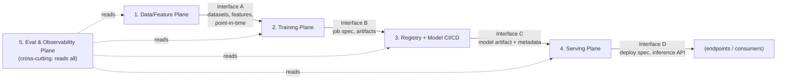

# Module 03 — ML Platform Architecture at Org Scale

## Why this module matters

At Senior, you design a system: a fraud model, a ranking service, a copilot. At Principal, you design the thing that *fifty systems* get built on — and the design space changes completely. The users are now internal engineers, the failure modes are organizational (shadow infrastructure, adoption stalls, platform teams building for imaginary customers), and the hardest tradeoffs are not latency-vs-cost but standardization-vs-autonomy. Most ML platforms fail not because the technology was wrong but because the platform team built the wrong abstraction at the wrong time for teams that had already routed around them. This module gives you the decision framework: what to platformize, in what order, with what contracts, and how to know whether anyone is actually better off.

## 1. The shift: from system design to platform design

A system has a requirements doc. A platform has a *market*. When you design a fraud model, you can enumerate the constraints. When you design the training platform that the fraud team, the recommendations team, and the new LLM team will all use, you are making a bet about which constraints generalize — and every abstraction you pick taxes someone.

Three properties distinguish platform design from system design:

- **N consumers, unknown future consumers.** Every interface decision is amortized across teams that don't exist yet. This pushes toward conservative, boring contracts and against clever coupling.
- **Adoption is voluntary until it isn't.** Internal teams can (and will) build shadow infrastructure if your platform is worse than DIY. A platform nobody adopts is a cost center with a roadmap. Mandates come later, after the platform has earned them — mandate-first platforms produce malicious compliance and Jira tickets, not leverage.
- **The migration is part of the design.** A platform that requires every team to rewrite their pipelines is a platform that ships two years late. Sculley et al.'s "Hidden Technical Debt" (NeurIPS 2015) catalogued glue code and pipeline jungles as the dominant ML debt; a platform's job is to pay that down *incrementally*, which means meeting teams where their pipelines already are.

The Principal-level framing: **you are not building infrastructure, you are removing toil**. Every platform component must trace to a named, quantified toil ("each team spends ~1 eng-week/month babysitting training jobs") — not to an architecture diagram you saw at a conference.

Platform work also cycles you through all four of Will Larson's Staff-plus archetypes in a single year: *Architect* when drawing the plane boundaries, *Tech Lead* while the first components ship, *Solver* when a flagship migration stalls, *Right Hand* when the fleet renewal hits the CFO's desk. Treat them as situational modes to switch between deliberately — the failure pattern is staying in Architect mode after the drawing is done, producing interface v2 proposals while v1 has three users.

## 2. The five planes and the interfaces between them

Every ML platform, whatever the company calls it, decomposes into five planes. The planes matter less than the **interfaces** between them — the interfaces are where teams integrate, and therefore where the platform's contract lives.



**1. Data/feature plane.** Datasets, feature pipelines, labels, lineage. The interface it exports: *named, versioned, point-in-time-correct data assets*. Whether the implementation is a full feature store (Feast, Tecton) or "Parquet in S3 plus a dbt project plus conventions" matters far less than whether a training job can ask for "features X, Y, Z as of event time" and get the same answer the serving path will compute.

**2. Training plane.** Compute orchestration, distributed training, experiment tracking, hyperparameter sweeps. Interface in: a job spec (code ref + data ref + resources + config). Interface out: artifacts + metrics + full provenance. Module 04 covers this plane in depth; here the platform question is only what the *contract* is.

**3. Registry + model CI/CD.** The registry is the narrow waist of the entire platform: a model is not a file, it is *weights + preprocessing + eval results + lineage + owner + approval state*. Model CI/CD is the promotion pipeline: candidate → eval gates → staging → canary → production, with rollback. If you standardize only one thing in year one, standardize this — it is the interface that governance (Module 11), incident response, and serving all hang off.

**4. Serving plane.** Online inference (real-time endpoints, GPU pools for LLMs) and batch scoring. Interface: "give me a registry model ID, get an endpoint with SLOs, autoscaling, and metrics." The serving plane is where the platform's multi-tenancy economics live, because GPUs are the expensive shared resource.

**5. Eval & observability plane.** Offline eval harnesses, golden sets, drift monitors, prediction logging, cost accounting. Deliberately drawn as cross-cutting: it reads from every plane, and it is the plane most often built last and needed first. A platform that can't answer "which models regressed this week and what did they cost?" is a job scheduler, not a platform.

**Interface contracts beat component choices.** Teams should be able to swap the implementation behind an interface (Metaflow → Ray, Feast → homegrown) without the other planes noticing. When someone proposes a new platform component, the Principal question is: *which interface does it sit behind, and does it honor the existing contract?* If the answer requires every consumer to change, it's not a component swap, it's a migration — price it accordingly.

## 3. Multi-tenancy: clusters, quotas, and chargeback

The moment two teams share compute, you have a multi-tenancy design whether you made one or not.

**Shared cluster vs per-team clusters.** Shared clusters win on utilization (one big pool smooths bursty demand; per-team GPU pools routinely idle at 20–30% utilization while a neighboring team queues) and on operational cost (one Kubernetes/Slurm install, one upgrade treadmill). Per-team clusters win on isolation, blast radius, and — sometimes decisively — on compliance (a team handling PCI data may need hard isolation). The standard resolution at 300+ engineers: **one shared cluster with priority tiers and hard quotas, plus carve-outs only for regulatory isolation**. Two teams is not enough to justify shared-platform overhead; ten teams cannot afford not to.

**Quotas: guaranteed vs fair-share.** Pure fair-share (everyone competes, scheduler balances historical usage) maximizes utilization but makes delivery dates unplannable — a team can't promise a launch when its training capacity depends on neighbors' behavior. Pure hard quota (each team owns N GPUs' worth) is plannable but recreates the idle-pool problem inside the shared cluster. The hybrid that works: **guaranteed quota at ~60–70% of the fleet, with the remainder as preemptible burst capacity** allocated fair-share. Teams plan against their guarantee and opportunistically burst; the platform runs at high utilization because burst jobs backfill idle guaranteed capacity (and get preempted when the owner returns).

**Cost attribution and chargeback.** Three maturity levels:

1. **Showback** — every job, endpoint, and dataset is tagged to a team; monthly reports show each team its fully loaded cost. Zero enforcement, high information value. Start here; the tagging discipline is 80% of the work.
2. **Chargeback** — costs hit the team's actual budget. This changes behavior fast (idle notebooks get shut down within weeks) but creates perverse incentives if the platform's prices are wrong: teams will go around you to raw cloud if your internal GPU-hour price carries a 40% platform tax.
3. **Priced tiers** — spot-priced preemptible tier vs premium guaranteed tier, letting teams make their own cost/urgency tradeoffs.

Planning number: an on-demand H100 at ~$3–4/GPU-hr means a single forgotten 8-GPU interactive node is **$250–350k/year**. Showback alone typically recovers 10–20% of ML compute spend in the first two quarters simply by making waste visible. Don't skip to chargeback before showback — you need a quarter of data to set prices that won't drive defection.

## 4. Paved road vs golden cage

The paved road (term popularized by Netflix) is the platform's supported path: use the blessed stack and you get CI/CD, monitoring, security review, and on-call support "for free." Step off, and you own everything yourself — allowed, but priced honestly.

The failure mode in both directions:

- **Gravel road:** the platform supports so little that every team is effectively off-road. Symptom: the platform team's roadmap is a wish list; teams' architecture diagrams don't mention the platform.
- **Golden cage:** the platform mandates so much that the 20% of teams with genuinely different needs (the research team that needs bleeding-edge CUDA, the on-device team shipping CoreML) are blocked or fork in secret. Symptom: shadow infrastructure discovered during an incident.

**The 80/20 rule, operationalized:** design the paved road to cover ~80% of workloads *by count*, and design explicit escape hatches for the rest. An escape hatch is not "do whatever" — it is a documented contract: *you may bring your own training framework, but you must still emit artifacts to the registry, tag costs, and pass the same promotion gates.* The narrow waist (registry, cost tagging, eval gates) stays mandatory; everything upstream of it is paved-road-by-default, off-road-by-exception. This is how you keep governance and observability without freezing innovation.

A useful test for every proposed standard: **"What breaks if a team ignores this?"** If the answer is "nothing, we just prefer it" — it's a recommendation, not a standard, and shouldn't gate anything. If the answer is "we can't attribute costs / can't roll back / can't audit" — it's a real standard; enforce it at the narrow waist, mechanically (CI check, admission controller), not by review-meeting decree.

Make going off-road a *registered* act, not a silent one. A lightweight template keeps the escape hatch honest and gives you the data to decide when the 20% has grown into a second paved road:

```text
Off-road registration (one per exception, reviewed annually)
─────────────────────────────────────────────────────────────
Team / system:        trust-safety / image-moderation-v3
Paved-road component bypassed:  standard training launcher
Reason:               needs nightly CUDA builds for custom kernels
Still honored:        registry, cost tags, eval gates, on-call
Owned by team:        build pipeline, cluster config, upgrades
Revisit trigger:      launcher supports custom images (ETA Q3)
```

Ten registrations against the same component is not ten exceptions — it is a requirements document for the platform's next quarter, written by your users.

## 5. Platform as product

The single highest-leverage mindset shift: your platform has *users*, and they have alternatives (DIY, cloud-managed services, quiet non-adoption). Treat it like a product or watch it die in the internal-tools graveyard.

- **Do discovery, not requirements-gathering.** Sit with each ML team for a day. The toil they complain about in surveys ("we need a feature store") and the toil that actually burns their weeks (flaky data backfills, 45-minute Docker builds, nobody knows which model is in prod) are usually different.
- **Measure adoption like a product manager.** Useful metrics: % of production models flowing through the registry; % of training jobs on the platform scheduler; time-to-first-model for a new team (the platform's activation metric — target days, not months); weekly active teams; NPS from internal users (yes, really — a quarterly 3-question survey beats guessing). Vanity metric to avoid: "number of platform features shipped."
- **Migration support is a feature, not a favor.** Every platform capability ships with a migration path and, for the first 2–3 teams, *embedded hands-on help*. The first migrations are how you discover your abstractions are wrong while they're still cheap to fix. Budget rule of thumb: for every eng-month building a platform capability, budget 0.5–1 eng-month of migration support in the first two quarters.
- **Deprecation is a product motion too.** The platform's credibility depends on old paths actually dying. A "deprecated" path that lingers for three years teaches teams that migrations are optional. Announce with dates, provide tooling, migrate the long tail *for* teams if needed, then delete.

### The platform charter

Write the product definition down before the first component ships. One page, revised annually:

```text
ML Platform Charter (template)
──────────────────────────────
Customers:      the 6 ML teams (named), plus new teams at onboarding
Problem we own: [top-3 toil items from the inventory, quantified]
Paved road:     [what's supported end-to-end, with SLOs]
Mandatory:      [narrow-waist items only: registry, cost tags, gates]
Explicitly NOT: [components we will not build this year, and why]
Success:        [adoption + health metrics with quarterly targets]
Compat promise: [link to the versioning contract, section 7]
Escalation:     [how a blocked team gets unblocked, with an SLA]
```

The "Explicitly NOT" line is the one leadership will thank you for in a year — it is the pre-committed defense against every conference-driven feature request, and it forces the annual conversation about whether the triggers for building those things have fired.

## 6. Build the thinnest platform that removes the biggest toil

The most common Principal-level platform failure is **premature emulation**: building a feature store because Uber built Michelangelo, an internal LLM gateway because a blog post said so, a full metadata graph because "lineage matters." Uber built Michelangelo with hundreds of platform engineers to serve *thousands* of internal models; if you have nine models and four teams, their solution is your albatross.

The discipline:

1. **Inventory the toil.** For each ML team: hours/month lost, to what, at what blast radius. Quantify — "the recs team spends ~30 eng-hours/month hand-rolling training-serving-consistent features" is actionable; "we lack a feature store" is a purchase order.
2. **Rank by $\dfrac{\text{toil} \times \text{teams affected}}{\text{cost to platformize}}$.** This ratio almost never ranks the glamorous component first. In practice the top of the list is usually: model registry + deployment pipeline, cost visibility, a standard training-job launcher, and shared eval tooling. Feature stores and metadata graphs rank high only when many teams share online features — which at most companies means "the two ranking teams," not everyone.
3. **Build the thinnest version.** Thinnest means: a contract plus the minimum machinery to honor it. A model registry can start as a metadata service wrapping S3, with a CLI and three required fields. It does not start as a build-vs-buy bake-off with a 40-page design doc.

### Conway's law and team topology

Your platform architecture will mirror your org chart whether you intend it or not (Conway, 1968), so choose the org chart deliberately. Three topologies, with the failure mode of each:

- **Central platform team.** A dedicated team owns the platform; ML teams are customers. Scales well, builds deep expertise. *Failure mode:* ivory tower — the platform team drifts from real workloads, ships abstractions nobody asked for, and measures itself by roadmap completion. Antidote: rotate platform engineers through product-ML teams; tie platform OKRs to adoption metrics, not features.
- **Embedded MLEs.** No platform team; senior MLEs inside each product team build what they need. Maximum context, zero coordination cost. *Failure mode:* N teams build N half-finished, incompatible training stacks; nobody owns the shared pieces; the best infra-minded MLEs burn out doing platform work that isn't their job ladder's job.
- **Hybrid enable-and-embed** (the Team Topologies pattern: a platform team plus an enabling function). A small central team owns the narrow waist (registry, scheduler, cost accounting); platform engineers *embed* with a product team for a quarter at a time to build capabilities in situ, then extract the generalizable part back into the platform. *Failure mode:* the embeds become permanent loans and the central team hollows out — guard against it with explicit rotation contracts (one quarter, defined extraction deliverable).

Rule of thumb for sizing: a platform team below ~5% of the ML engineering population can only maintain, not build; above ~15% you are probably building golden cages. 8–12% is the healthy band at 300–3,000 engineers.

## 7. Versioning and backward compatibility: the real contract

Ask internal users what they fear about adopting a platform and the honest answer is rarely "missing features" — it's *"you'll break me, and my launch will slip for your refactor."* The platform's real product is therefore its **compatibility guarantee**. Write it down like an SLA:

```text
Platform compatibility contract (v1)
─────────────────────────────────────
- Interfaces (job spec, registry API, feature-read API, deploy spec)
  are semantically versioned. Breaking changes bump the major version.
- N and N-1 major versions are supported simultaneously for ≥ 2 quarters.
- Breaking changes ship with: migration guide, automated codemod where
  feasible, and a named platform engineer as migration DRI.
- Deprecations announced ≥ 1 quarter ahead, with usage telemetry
  identifying every affected team before the announcement.
- Model artifacts are immutable and readable forever: a model trained
  3 years ago must still load, or must have been explicitly migrated.
- Data assets: schema changes to shared features are additive-only;
  removals go through the deprecation process above.
```

Two subtleties that bite ML platforms specifically. First, **the artifact horizon is longer than the code horizon** — regulated industries must reproduce a 4-year-old credit decision, which means the platform must keep old model formats loadable or run supervised migrations, long after the training code is gone. Second, **silent semantic changes are breaking changes**: upgrading the platform's base image from CUDA 12.1 to 12.4, or changing the tokenizer bundled in the preprocessing library, changes model outputs without breaking any API. Treat runtime-environment pins as part of the interface, and surface them in the registry metadata.

## 8. Reference architectures at three sizes

Assumptions: "engineers" = total engineering org; ML engineers ≈ 10–20% of that. All three assume a major cloud (AWS/GCP); swap vendor names freely — the shape is what matters.

**30 engineers (~4–6 MLEs, 1–3 models in prod).** *There is no platform team.* The platform is a set of conventions owned part-time by one senior MLE: cloud-managed training (SageMaker/Vertex or plain EC2 + a Makefile), MLflow or W&B for tracking and registry, Terraform for endpoints, GitHub Actions for model CI, dbt + warehouse for data, no feature store (a `features/` package with tests gives training-serving consistency), cost tagging enforced in code review. The Principal-level act at this size is *restraint*: every platform component you don't build is a component you don't maintain. Budget: ~0.5 FTE.

**300 engineers (~30–50 MLEs, 10–40 models, 4–8 teams).** The inflection point — this is where platform investment starts paying and where the worked example below lives. A platform team of 4–6. Shared GPU cluster (Kubernetes + Kueue/Volcano, or managed Ray) with the quota/burst split from section 3; a real registry with promotion gates; a training-job launcher (Metaflow, Flyte, or thin wrappers over Ray) as the paved road; feature platform *only if* ≥2 teams need online features (start with Feast over Redis/DynamoDB, not a vendor bake-off); centralized eval harness + prediction logging; showback dashboards. Escape hatches documented. Budget: 4–6 FTE platform + 1 FTE-equivalent embedded rotation.

**3,000 engineers (~300–500 MLEs, hundreds of models, 30+ teams).** Now the platform is itself a multi-team product org (30–50 platform engineers across the five planes) and the problems shift: internal API governance, multi-region and data-residency (the control-plane/data-plane split from the ML System Design course applied org-wide), a capacity-planning function for GPU fleets (Module 04), tiered support (paved road + enablement team + office hours), and a real deprecation machine. This is Michelangelo/FBLearner territory — homegrown narrow-waist services with vendor components behind them, because at this scale interface stability across hundreds of consumers dominates any single component's quality. The Principal's job here is mostly *portfolio management*: which planes get investment this year, which get maintenance, and which get deprecated.

The trap between sizes: **adopting the next size's architecture one size early**. A 300-engineer company running a 3,000-engineer platform spends its entire ML budget on the platform team. Grow the platform *behind* demand, not ahead of it — one plane at a time, pulled by named teams' toil.

## 9. Anti-pattern field guide

Each of these has a smell you can detect in a single meeting, and each traces to a section above:

- **Résumé-driven platformization.** The design doc cites Uber/Netflix/Meta more than it cites internal teams. Detect: no toil inventory, no named first customer. Fix: section 6's ranking discipline — no component without a quantified toil line and two committed consumers.
- **The mandate-first launch.** Adoption decreed before the platform works for anyone. Detect: rollout plan has enforcement dates but no migration support budget. Fix: earn two voluntary adoptions per capability before any mandate; mandates only at the narrow waist.
- **The demo platform.** Works beautifully for the toy example; falls over on the first real workload (10× data, weird tokenizer, compliance constraint). Detect: the platform team's test workload was written by the platform team. Fix: embedded-first builds (section 6) — the first customer's real workload is the acceptance test.
- **Interface churn.** The registry API is on v4 in 18 months; teams pin old clients and stop upgrading. Detect: version adoption histogram is bimodal. Fix: the compatibility contract (section 7), enforced on the platform team itself — breaking changes need the same one-page justification you'd demand of anyone.
- **The invisible platform.** Solid engineering, zero internal marketing; teams rebuild what already exists because nobody knew. Detect: two teams demo the same capability in the same month. Fix: platform-as-product includes launch notes, office hours, and an onboarding path — communication is roadmap work, not overhead.
- **Metrics theater.** Adoption at 95% because adoption was defined as "has the SDK installed." Detect: coverage metrics all green while teams still complain in retros. Fix: pair every coverage metric with a health metric (NPS, time-to-first-model, support-ticket volume) and report them together.
- **Platform team as ticket queue.** The team stops building and becomes a human API for provisioning. Detect: >40% of platform capacity on reactive tickets two quarters running. Fix: self-service is the feature — every recurring ticket class becomes an automation candidate, ranked by the same toil math as everything else.

## You can now

- Decompose any ML platform into the five standard planes and specify the interface contracts between them — the contracts, not the component choices, are the platform's durable and portable artifact
- Design a multi-tenancy quota policy using the 60–70% guaranteed / burst-pool hybrid, and articulate why pure hard-quota and pure fair-share each fail at org scale
- Sequence platform investments by $\dfrac{\text{toil} \times \text{teams affected}}{\text{cost to platformize}}$, and produce a "not building yet" list with explicit trigger conditions — making the sequencing decision defensible rather than intuitive
- Distinguish a paved road from a golden cage by writing escape-hatch contracts that hold the narrow waist mandatory (registry, cost tags, eval gates) while keeping upstream choices free — and explain what concretely breaks when each mandatory item is ignored
- Size a platform team for a given org scale, choose among central, embedded, and hybrid topologies, and name the failure mode — ivory tower, N half-finished stacks, hollowed-out central team — that each topology requires a structural guard against

## Worked example

**Scenario.** A 300-engineer fintech (payments + lending). Four ML teams grew up disconnected: **Fraud** (12 people, XGBoost + a homegrown real-time feature pipeline on Flink, the crown jewels), **Credit risk** (8 people, batch models, heavy compliance burden, SAS-to-Python migration half done), **Support/GenAI** (6 people, LLM copilot on a vendor API, no eval harness), and **Growth** (5 people, churn/LTV models in notebooks, deployed by copy-paste). You've been hired as the Principal to turn this into a platform org. Cloud spend on ML: ~$4.2M/year and growing 60% YoY. Leadership's mandate: "make ML faster and auditable" — regulators have started asking Credit how models are approved.

**Step 1 — Inventory (weeks 1–3).** You interview every team and produce a toil table, quantified:

| Team | Top toil | Hours/month | Blast radius |
|---|---|---|---|
| Fraud | Feature parity bugs between Flink (online) and Spark (training) | ~60 | Prod incidents, chargebacks |
| Credit | Manual model-approval evidence assembly for audit | ~80 | Regulatory finding risk |
| Support | No eval harness; regressions found by customers | ~40 | Customer trust |
| Growth | Hand-deployment; nobody knows which model version is live | ~30 | Silent revenue impact |
| All | No cost attribution; GPU/API spend unexplainable | — | $4.2M unmanaged |

Key observation: **no two teams share the same top toil**, which kills the naive plan ("build a feature store first" would serve only Fraud). But every team's toil passes through the same missing narrow waist: *nobody can say what a model is, where it came from, whether it was approved, or what it costs.*

**Step 2 — Sequencing decision.** You platformize in this order, with reasoning:

1. **Q1: Model registry + promotion pipeline + cost tagging.** Serves all four teams; directly answers the regulator (Credit's approval evidence becomes a registry query); cheapest to build (a metadata service + CLI + CI templates, ~2 engineers × 1 quarter). This is the narrow waist — everything later hangs off it. Mandate: *additive only* — teams keep their training stacks but must register artifacts and tag costs. Adoption is easy because it asks little.
2. **Q2: Shared eval harness + prediction logging.** Serves Support (their burning need) and Credit (eval evidence for audit); becomes the promotion gate enforcement for the Q1 registry. Built embedded-first: one platform engineer embeds with Support for the quarter, builds their harness, extracts the general core.
3. **Q3: Training-job launcher on a shared GPU/compute pool + showback.** By now cost tags exist, so showback is a dashboard, not a project. The launcher is the paved road for Growth (kills notebook deploys) and Credit (finishes their Python migration onto supported rails). Fraud is explicitly *not* migrated — their Flink pipeline works; forcing them onto the paved road in year one is golden-cage behavior.
4. **Q4: Feature platform, scoped.** Only now, and only because two concrete consumers exist: Fraud's parity problem and a new real-time credit-limit product. Start by wrapping Fraud's existing Flink features behind the point-in-time read API rather than rewriting them — the contract first, the replatform later, if ever.

What you explicitly *don't* build in year one: a metadata/lineage graph beyond what the registry needs, an internal LLM gateway (Support's vendor API is fine at their volume — revisit at 10× traffic per the crossover math in the ML System Design course), and any multi-region story (single-region company).

**Step 3 — Interface contracts.** You publish a one-page contract table (this artifact matters more than any component):

| Interface | Producer → Consumer | Contract | Compat guarantee |
|---|---|---|---|
| Model artifact | Any training stack → Registry | Immutable bundle: weights + preprocessing ref + eval report + owner + data snapshot ID | Readable ≥ 7 yrs (regulatory) |
| Promotion | Registry → Serving | Only `approved` models deployable; gates: eval ≥ baseline, cost tag present, owner on-call | Gates versioned; changes announced 1 quarter ahead |
| Job spec | Team code → Launcher | Container ref + data ref + resources + config hash | N, N-1 supported ≥ 2 quarters |
| Feature read | Feature platform → Training & Serving | Named features, point-in-time semantics, additive-only schema | Removal = 1-quarter deprecation |
| Cost tag | Everything → FinOps | `team`, `model_id`, `env` on every resource | Untagged resources auto-flagged, then auto-stopped after 14 days |

**Step 4 — Adoption plan with metrics.** Targets you commit to leadership: end of Q1 — 100% of *new* production models through the registry, ≥2 of 4 teams registering existing models; end of Q2 — Credit's audit evidence generated from the registry in <1 day (down from ~2 weeks), Support running eval gates on every release; end of Q3 — ≥90% of ML spend attributed, showback live, first waste reclamation (target: 10% ≈ $400k/year, mostly idle interactive nodes and a forgotten dev endpoint fleet); end of Q4 — time-to-first-model for a new team ≤ 2 weeks, measured by actually onboarding the new payments-risk team. Quarterly internal NPS from the four teams, reported alongside the metrics — a platform hitting its adoption numbers with an NPS of −20 is coercing, not serving.

**The one-pager you present to leadership** compresses all of this: the toil table, the four-quarter sequence with the *reason* for the order (narrow waist first, regulator-driven, embedded builds, no premature feature store), the contract table, and the adoption metrics. That document — not the architecture diagram — is the Principal-level artifact.

## Exercise

**Task.** Produce a platform architecture one-pager + interface contract table for this scenario:

> A 900-engineer e-commerce company. Five ML teams: Search (18 MLEs, mature, own Kubernetes cluster, half-built internal feature store they resent maintaining), Ads (10 MLEs, real-time bidding, latency-obsessed, deep-pocketed), Recommendations (8 MLEs, shares some features with Search via CSV handoffs), Trust & Safety (6 MLEs, image + text models, backlogged on GPU access), and a new GenAI team (4 MLEs, greenfield, building a shopping assistant). ML cloud spend $11M/year. Two prior platform attempts died: one from mandate-first backlash, one from building a metadata graph nobody used. The CTO wants a credible third attempt.

**Deliverable.** Max 2 pages: (1) toil inventory with your assumptions stated and quantified estimates; (2) a sequenced 4-quarter plan with a one-sentence justification per item *and* a "not building yet" list with reasons; (3) an interface contract table (≥4 interfaces, producer/consumer, contract, compat guarantee); (4) team topology choice with the failure mode you're guarding against and the guard; (5) five adoption metrics with quarterly targets.

**Acceptance criteria — you're done when:**

- Every platform component in your plan traces to a named team's quantified toil, and at least one plausible component appears on your "not building yet" list with a trigger condition for revisiting.
- Your plan explicitly handles Search's existing feature store (adopt/wrap/deprecate — any is defensible, but the reasoning and migration cost must be written down).
- The contract table would let a team adopt one interface without adopting the others.
- Your adoption metrics include at least one *health* metric (NPS, time-to-first-model) alongside coverage metrics — and none of them is "features shipped."
- A skeptical Search lead reading your one-pager could not say "this is mandate-first" or "this is attempt #2's metadata graph again."

**Self-check questions:**

1. Which interface did you make mandatory from day one, and what breaks — concretely — if a team ignores it? If nothing breaks, why is it mandatory?
2. Ads can afford to DIY everything. What does your platform offer them that DIY doesn't, and what happens to your platform if they opt out entirely?
3. Where did you place the GenAI team — paved road from day one, or deliberate off-road? What did that decision cost?
4. What in your plan would you cut if the platform team were halved? (If the answer is "migration support," reconsider — that's the piece that killed attempt #1.)
5. What evidence, two quarters in, would tell you your sequencing was wrong — and what's your cheapest reversal?
