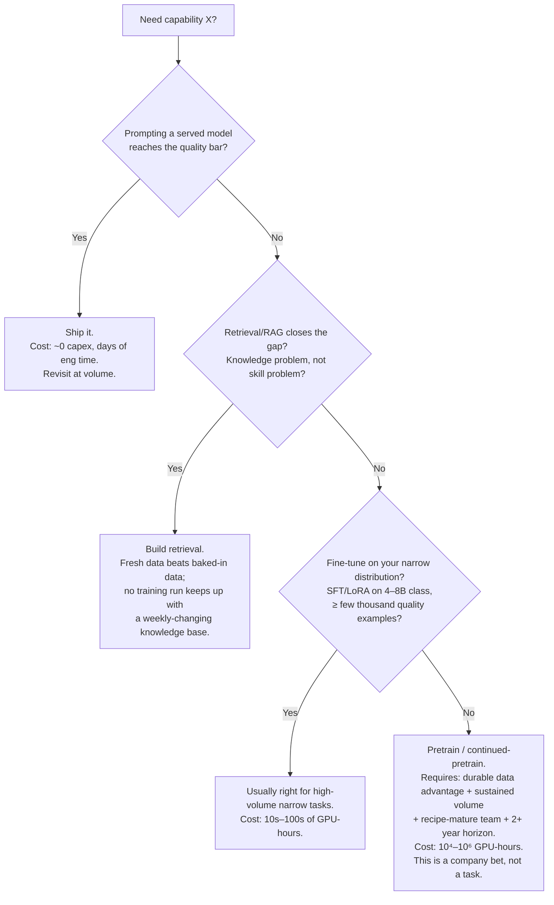

# Module 04 — Training Infrastructure Mastery

## Why this module matters

Writing DDP code, tuning NCCL flags, sharding an optimizer — those are senior skills, and the ML System Design and MLOps courses cover the mechanics. The Principal-level version of this domain is *fleet-level*: you decide whether the company owns, reserves, or rents GPUs; you set the scheduling policy that decides whose job runs when four teams want the same 64 GPUs; you define the checkpointing and reproducibility standards that turn distributed-training failures from weekly crises into scheduled maintenance. The numbers are brutal enough to deserve Principal attention: a 200-GPU H100 fleet is a ~$5–7M/year commitment, and the difference between 41% and 70% utilization on that fleet is roughly $2M/year — more than the fully loaded cost of the team arguing about it. This module is the math and the policy.

## 1. GPU fleet economics: utilization dominates everything

Every fleet decision reduces to one identity:

$$\text{effective \$/GPU-hr} = \frac{\text{paid \$/GPU-hr}}{\text{utilization}}$$

A reserved H100 at $2.50/hr running at 40% utilization costs you $6.25 per *useful* hour — more than on-demand. Every other decision (owned vs rented, scheduler choice, quota policy) is downstream of this fraction. Fix utilization before optimizing price; a 20% discount negotiated on a 40%-utilized fleet is theater.

**Procurement tiers, with 2026 planning numbers** (state your own quotes; these are for envelope math):

| Tier | H100 SXM $/GPU-hr | Commitment | When it wins |
|---|---|---|---|
| On-demand cloud | $4–7 | None | Bursts, evaluation, <3 months horizon |
| Spot/preemptible | $1.5–3 | None (revocable) | Fault-tolerant training with good checkpointing |
| 1–3 yr reserved / GPU cloud contract | $2–3 | Quarters–years | Sustained baseline load ≥60% utilization |
| Owned (colo, amortized 4–5 yr) | $1.3–2.2 all-in | CapEx + a datacenter/infra team | Sustained load ≥70%, ≥500 GPUs, power secured |

B200-class parts land at roughly 2–2.5× H100 price per GPU-hour early in the cycle for roughly 2–3× training throughput on transformer workloads — meaning the newest part is usually at parity or slightly better on $/useful-FLOP, *if you can get allocation and your interconnect and software stack can feed it*. The Principal-level B200 question is rarely "is it faster" but "does our data pipeline and parallelism config saturate it" — a B200 fleet fed by an H100-era input pipeline is the most expensive way ever devised to wait on tokenization.

**The layered portfolio** is the standard answer: reserve capacity for your P50 sustained demand, burst to spot for fault-tolerant experiments, touch on-demand only for emergencies. Companies that buy reserved for P95 demand own an idle fleet; companies that run baseline load on on-demand pay double.

**Two utilization metrics, don't conflate them:**

- **Fleet utilization** — fraction of paid GPU-hours running *any* job. This is a scheduling and org-behavior problem. Healthy target: 70–85% (100% is bad — it means no burst headroom and week-long queues). Below 60%, you are burning money and should either fix scheduling or shrink the fleet.
- **MFU (Model FLOPs Utilization)** — achieved model FLOPs ÷ theoretical peak, *within* a running job. This is an engineering-quality problem. Well-tuned LLM pretraining lands at **35–50% MFU** (Megatron/DeepSpeed-class stacks on H100, bf16); 25% MFU on a big run means your parallelism config, kernel choices, or input pipeline needs an owner. Fine-tuning and RL workloads run structurally lower — set targets per workload class, not one number.

Fleet money math you should be able to do live: 200 H100s × $2.75/hr reserved × 8,760 hr = **$4.8M/year paid**. At 41% fleet utilization that is $2.0M of useful compute and **$2.8M of idle**. Raising utilization to 70% recovers ~$1.4M/year of useful compute at zero additional spend — this is the argument that funds a scheduler project.

**Training/inference pooling.** If the company also serves models on GPUs, the fleets have opposite load shapes — inference peaks with users (daytime), training is elastic — and a shared pool with time-shifting beats two separate fleets: Tier-2 training backfills the inference fleet's overnight trough, and inference autoscaling preempts it back at the morning ramp. The catch is operational: inference needs strict latency isolation (no noisy-neighbor training job sharing a NIC with a p99-sensitive endpoint), so pooling works at the *node* granularity with clean handoff, not by co-scheduling on the same host. Worth doing from ~50 GPUs on each side; below that, the scheduling machinery costs more than the trough is worth.

**The fleet health dashboard.** You cannot manage what leadership cannot see. The minimum weekly view, one page:

```text
Fleet health — week of ____
────────────────────────────────────────────────
Fleet utilization        (paid GPU-hrs running jobs)      __%  target 70–85
Productive utilization   (excludes failed/zombie hours)   __%
MFU, top-5 jobs by spend (per job, vs workload target)    __
Queue p50 / p95 wait     Tier 1: __ / __   Tier 2: __ / __
Idle interactive GPU-hrs (and $ equivalent)               __
Failed-run GPU-hrs       (by cause: hw / code / preempt)  __
Spend by team            (vs quota, showback view)        __
Checkpoint overhead      (write time as % of step time)   __
```

Eight numbers, weekly, same format every time. The dashboard's job is to make the $2.8M of idle from the paragraph above impossible to un-see.

## 2. Scheduling and priority: the policy is the product

At fleet scale, the scheduler *is* your training platform's most important component, and its configuration is a policy document wearing YAML.

**Gang scheduling is non-negotiable for distributed jobs.** A 64-GPU job must get all 64 GPUs atomically or none; partial allocation deadlocks the cluster (your 48 granted GPUs idle while waiting for 16 held by another partial job). Use a gang-aware scheduler (Kueue, Volcano, Slurm, Ray) — default Kubernetes scheduling will burn you within the first month.

**Preemption tiers.** Three tiers cover almost every org:

```text
Tier 0 — Production retrains (fraud model daily retrain, contract SLA runs)
         Never preempted. Guaranteed capacity. Small: <15% of fleet.
Tier 1 — Research/roadmap training (funded experiments, scheduled big runs)
         Preempts Tier 2. Checkpointed; preemption costs minutes, not days.
Tier 2 — Exploratory (sweeps, debug jobs, interactive dev)
         Preemptible any time, backfills idle capacity, spot-priced internally.
```

The tier assignment rule matters more than the tiers: **priority is attached to workloads, not people**. The moment senior researchers get personal Tier-0 access, your utilization data becomes a record of status, not value.

**Fair-share vs quota** (the same tension as Module 03, section 3, now at job granularity): hard quotas make delivery plannable but strand capacity inside team boundaries; fair-share maximizes utilization but makes launch dates hostage to neighbors. The working hybrid: guaranteed quota ≈ 60–70% of fleet allocated by planning process (section 7), remainder fair-share preemptible burst. Add **quota decay**: unused guaranteed capacity releases to the burst pool after a short window (e.g., 4 hours), so "we might need it Thursday" doesn't idle 32 GPUs all week.

**Interactive capacity is where fleets bleed.** Notebook and dev nodes idle 70–90% of wall-clock time. Policy that works: a small dedicated interactive pool (5–10% of fleet), aggressive idle-detection auto-stop (no GPU activity 60 min → checkpoint and release), and *no* long-lived personal GPU reservations. Expect this policy to be unpopular for exactly two weeks.

## 3. The experiment-to-final-run ratio

Naive capacity plans budget the final run: "the model needs ~10^22 FLOPs, that's N GPU-weeks." Real programs spend **1.2–4× the final-run compute** on everything around it: ablations, scaling-law probes, hyperparameter sweeps, failed runs, restarts, and evals. Where you sit in that range is diagnostic:

- **~1.2–1.5×** — mature recipe, minor iteration (the Nth retrain of a known architecture on refreshed data).
- **~2×** — standard for a competent team doing something they've done a close cousin of before.
- **~3–4×** — novel architecture or data regime, or a team learning as it goes. Legitimate for research; a red flag for a "routine" production model.

Budget the multiplier explicitly per program, and *track the realized ratio* — a program that forecast 2× and is trending 5× at the halfway point is telling you something about the recipe's maturity that the team's status reports are not. The multiplier is also your best argument in procurement: a roadmap whose final runs need 40k H100-hours is a roadmap that needs ~100k H100-hours of capacity, and the delta is where under-provisioned orgs silently kill their own research velocity via queue pressure.

## 4. Failure management at scale

At single-node scale, hardware failure is an anecdote. At fleet scale it is a design input: large fleets see per-GPU failure rates that put a meaningful MTBF on any big job. A useful envelope: if a single GPU has MTBF ~5 years (~44k hours) including host, HBM, and interconnect faults, a synchronous 1,024-GPU job has an *aggregate* MTBF around 44,000/1,024 ≈ **43 hours** — your week-long run *will* be interrupted several times, and the only question is what each interruption costs.

**Checkpointing cadence is a math problem, not a vibe.** The Young–Daly approximation gives the optimal checkpoint interval:

$$\text{optimal\_interval} \approx \sqrt{2 \times \text{checkpoint\_cost} \times \text{MTBF}}$$

where `checkpoint_cost` is wall-clock time to write one checkpoint and `MTBF` is the job's aggregate mean time between failures. Worked: a 512-GPU run, aggregate MTBF ≈ 86 h, checkpoint write = 4 min (0.067 h) → interval ≈ sqrt(2 × 0.067 × 86) ≈ **3.4 hours**. Checkpointing hourly wastes write overhead; checkpointing daily means an average failure costs you 12 hours × 512 GPUs ≈ 6,100 GPU-hours ≈ **$17k per incident** at $2.75/hr. The formula also shows the leverage of cheaper checkpoints: cut write time 4× (async/sharded checkpointing to local NVMe with background upload — standard in Megatron/DeepSpeed/torch-distributed stacks) and the optimal interval halves, halving expected lost work too.

**Stragglers.** One slow GPU (thermal throttling, a degraded HBM stack, a flaky NIC) gates every synchronous step: a 2% straggler tax on a 512-GPU job is ~10 GPUs' worth of money. Fleet-level answer: continuous per-rank step-time telemetry, automated straggler detection (rank whose step time is >2σ slow for >15 min), and hot-spare nodes so the scheduler can swap hardware without killing the job. This is infrastructure, not heroics — if finding a straggler requires your best engineer and tmux, you don't have the capability yet.

**Silent data corruption (SDC).** The nastiest failure class: a GPU computes wrong numbers without erroring. Symptoms are loss spikes or NaNs hours after the corrupting step, or worse, a quietly degraded model. Fleet hygiene: burn-in testing on delivery, periodic fleet-wide GEMM/allreduce bit-consistency sweeps (run known inputs, compare against golden outputs), loss-anomaly detection wired to automatic rollback-to-checkpoint, and quarantine workflows for suspect hosts. Meta and Google both publish on SDC rates at fleet scale — the phenomenon is universal; only the detection maturity differs.

**NCCL debugging as an org capability.** Every large-scale training org rediscovers that the difference between a 4-hour and a 4-day outage is whether NCCL/interconnect diagnosis is *institutionalized*: a runbook, pre-flight tests that gate every large job launch, and at least two people per rotation who have run the runbook in anger. If the answer to "who debugs NCCL hangs" is a name rather than a rotation, you have tribal knowledge, and it resigns in one two-week notice. The skeleton every org converges on:

```text
Large-job pre-flight (automated, gates launch of ≥64-GPU jobs)
──────────────────────────────────────────────────────────────
1. nccl-tests allreduce on the exact allocation: busbw within 10%
   of the fleet baseline for that topology, or the job doesn't start.
2. Per-node GEMM burn (5 min): any node >5% below fleet median
   FLOPs is swapped out before launch, not debugged during.
3. Storage read test from the job's actual data path at target
   concurrency.

Hang/slowdown runbook (the 80% path)
──────────────────────────────────────────────────────────────
1. Capture: NCCL_DEBUG=INFO ring/tree topology dump + py-spy /
   stack dump on all ranks (automated on watchdog trigger).
2. Classify: all ranks blocked in the same collective → network;
   one rank absent → host/process death; ranks in different
   collectives → application-level desync (the code's fault).
3. Bisect: rerun nccl-tests on halves of the allocation to
   isolate the bad node/link/switch; quarantine, resume from
   checkpoint on spares. Target: <1 hour from hang to resumed.
```

## 5. The data pipeline is the actual bottleneck

The recurring fleet-scale embarrassment: GPUs at 100% *allocation* and 30% MFU because they're waiting on input. Before approving any fleet expansion, demand the input-pipeline audit:

- **Throughput budget.** A 70B-parameter model training at 40% MFU on 512 H100s consumes roughly 4–5M tokens/s. If tokenization + shuffling + loading can't sustain that with headroom, the GPUs idle in microbursts that never show up in coarse utilization dashboards — only in MFU.
- **Preprocess offline, once.** Tokenize and pack to a binary format (WebDataset, Mosaic MDS, TFRecord-style shards) in a CPU cluster pass; never tokenize on the training hosts for large runs. CPU-hours cost ~1/50th of H100-hours — any preprocessing you can move off the GPU host is nearly free by comparison.
- **Storage bandwidth math.** 4M tok/s × ~2 bytes/token is trivial (8 MB/s), but multimodal changes everything: image-text training at 512 GPUs can demand tens of GB/s of sustained read. Object storage alone won't do it — you need a caching tier (local NVMe, or a distributed cache like Alluxio/JuiceFS-class) and you need to *measure* sustained throughput, not trust the spec sheet.
- **The restart path counts too.** Resuming a job means re-sharding the dataset state and refilling shuffle buffers; a data pipeline that takes 40 minutes to warm up turns your 3.4-hour checkpoint math into fiction. Dataloader state belongs in the checkpoint.

Principal-level rule: **no fleet expansion request is approved without an MFU report and an input-pipeline audit on the current fleet.** Half the time the "we need more GPUs" request is a data-pipeline ticket in disguise.

## 6. Reproducibility as infrastructure

At org scale, reproducibility is not a virtue, it is an insurance product — it is what makes a $500k run *resumable*, a regression *bisectable*, and a regulator *answerable*. Mandate the minimum set org-wide, enforce it in the job launcher (mechanically, per Module 03's narrow-waist principle), and stop there:

```text
Org-wide reproducibility mandate (enforced at job submission)
──────────────────────────────────────────────────────────────
1. Code:     immutable ref (commit SHA + container digest). Dirty
             worktrees rejected for Tier 0/1 jobs.
2. Data:     dataset snapshot ID (content-addressed manifest), not
             a bucket path. Paths mutate; manifests don't.
3. Config:   full resolved config captured at launch (post-override),
             stored with the run. No "flags in the shell history."
4. Seeds:    all RNG seeds logged. Bitwise determinism NOT required
             for large runs (perf cost is real); *statistical*
             reproducibility + resumability required.
5. Environment: CUDA/NCCL/framework versions pinned by the container
             digest; driver version recorded by the launcher.
6. Lineage:  every artifact links run → data snapshot → parent
             checkpoint, queryable from the registry (Module 03).
```

The deliberate compromise in item 4 is the Principal-level nuance: demanding bitwise determinism on a 512-GPU run costs real throughput (deterministic kernels, restricted algorithms) and buys little — what the org actually needs is the ability to *resume exactly* (checkpoint + dataloader state) and to *rerun statistically* (same config, same data, loss curve within noise band). Write down which guarantee you're selling; confusion between the two produces both wasted performance and false confidence.

## 7. When NOT to train, and who may press the button

The cheapest GPU-hour is the one you don't burn. The decision tree, in the order the options should be exhausted:



The tree is well known; the *governance* around it is the Principal contribution. Two mechanisms:

- **A compute-approval threshold.** Jobs under, say, 500 GPU-hours: any MLE launches, no questions — friction here kills iteration speed. Jobs over the threshold: a one-page justification (why the previous branch of the tree fails, expected experiment multiplier, eval plan, kill criteria) reviewed by a rotating pair of senior+staff reviewers within 24 hours. The threshold should be set so that ~90% of jobs need no approval and ~90% of *spend* does.
- **Kill criteria declared in advance.** Every large run states, at launch, what result at what milestone triggers stopping (loss not tracking the scaling-law fit at 10% of tokens; eval proxy below baseline at first checkpoint). Runs without kill criteria run to completion on inertia — the sunk-cost failure mode is universal and pre-commitment is the only reliable antidote.

## 8. Capacity planning: forecasting GPU-hours from a roadmap

Capacity planning is roadmap arithmetic plus honesty about the multiplier from section 3. The worked pattern:

```text
For each roadmap program:
  final_run_hours   = training FLOPs ÷ (GPU peak FLOPs × target MFU) ÷ 3600
  program_hours     = final_run_hours × experiment_multiplier (1.2–4×)
  calendar_check    = program_hours ÷ (max usable parallel GPUs × 720 h/mo)
Fleet demand/month  = Σ program_hours spread over program calendars
Fleet size          = P50 monthly demand ÷ (720 × target fleet util 0.75)
                      + burst via spot for P50→P90
```

Mini-example: a program to fine-tune and ship four 8B-class domain models per quarter (each: ~2 × 10^20 FLOPs final run → on H100 bf16 at ~40% MFU ≈ 1,000 GPU-hours; ×2.5 multiplier = 2,500 GPU-hours; ×4 models = 10k GPU-hours/quarter) plus one continued-pretraining bet (~8 × 10^22 FLOPs → ~350k GPU-hours over two quarters with a 2× multiplier = 700k... which at 512 GPUs × 720 h/mo ≈ 369k GPU-hours/month capacity means roughly a two-month occupation of a 512-GPU reservation). The calendar check is the step everyone skips: GPU-hours fit the budget while the *calendar* doesn't, because the big run monopolizes the fleet and starves every Tier-1/2 workload. That's how orgs end up with an angry quarter — the spreadsheet balanced and the queue didn't.

Present capacity plans with three scenarios (roadmap slips 25% / holds / grows 25%) and the procurement action for each — reserve the base, option the upside via spot and cloud burst.

## You can now

- Frame fleet decisions around effective cost per useful GPU-hour — $\text{effective \$/GPU-hr} = \text{paid \$/GPU-hr} / \text{utilization}$ — decompose idle time into attributable buckets (fragmentation, zombie runs, oversized allocations, quota hoarding), and recover utilization through policy before recommending any procurement change
- Set checkpoint cadence from first principles using the Young–Daly formula, deriving aggregate MTBF from per-GPU failure rates and translating checkpoint write cost directly into expected GPU-hours lost per failure
- Apply the compute-approval decision tree in governance order — prompt, retrieve, fine-tune, pretrain — with kill criteria declared at launch rather than after sunk cost accumulates
- Build a capacity plan that traces every GPU-hour demand to shown arithmetic (FLOPs → hours at a stated MFU, times an explicit experiment multiplier), runs a calendar check to catch fleet monopolization, and sizes the reserved tranche to the lower scenario with spot-burst for the upside
- Specify a scheduling policy that survives adversarial conditions: gang scheduling for distributed jobs, preemption tiers tied to workload class rather than seniority, quota decay to prevent hoarding, and an interactive-pool size with idle auto-stop

## Worked example

**Scenario.** You inherit training infrastructure at a 600-person company (≈70 MLEs across 6 teams): a reserved fleet of **200 H100s** at $2.75/GPU-hr ($4.82M/year), Kubernetes with default scheduling plus a bolted-on queue, and a CFO-commissioned report showing **41% fleet utilization**. Mandate: fix it or shrink the fleet at renewal in two quarters.

**Step 1 — Decompose the 59% idle.** You instrument for three weeks (job-level allocation traces, per-rank step times, idle-GPU telemetry) and attribute the paid GPU-hours:

| Bucket | Share of paid hours | Root cause |
|---|---|---|
| Productive training | 41% | — |
| Queue gaps / fragmentation | 18% | No gang scheduling: partial allocations hold GPUs while waiting for peers; no backfill of small jobs into gaps |
| Idle interactive nodes | 14% | 22 personal notebook nodes (avg 88 GPU-hours/day each doing nothing); no idle reaper |
| Failed/zombie runs | 11% | Crashed jobs discovered next morning (~9 h avg detection lag); reruns from ancient checkpoints (12–24 h checkpoint intervals) |
| Oversized allocations | 9% | Teams request 8-GPU nodes for 1-GPU work "to be safe"; sweep frameworks holding full reservations between trials |
| Quota hoarding | 7% | Team quotas held idle ("might need it Thursday") with no decay |

Sanity check the money: each percentage point of the fleet-year is $48.2k. The 59% idle is **$2.84M/year**.

**Step 2 — Redesign, in leverage order.**

1. **Gang scheduling + backfill (Kueue).** Kills the fragmentation bucket. Distributed jobs get atomic allocation; small Tier-2 jobs backfill scheduling gaps. Expected recovery: ~13 of 18 points.
2. **Idle reaper + interactive pool.** Dedicated 12-GPU interactive pool; 60-minute idle auto-stop with checkpoint; personal reservations abolished. Recovery: ~11 of 14 points (keep some slack — dev friction has a real cost too).
3. **Failure automation + checkpoint math.** Watchdog kills and requeues crashed jobs within 10 minutes; checkpointing moved to async sharded writes (write cost 3 min) and cadence set by Young–Daly per job size — the flagship 128-GPU runs (aggregate MTBF ≈ 344 h) go from 24 h intervals to sqrt(2 × 0.05 × 344) ≈ **5.9 h**, cutting expected loss per failure from ~12 h to ~3 h of fleet time. Recovery: ~7 of 11 points.
4. **Right-sizing + quota decay.** Scheduler exposes 1/2/4-GPU shapes with MIG for small work; sweep framework switched to releasing GPUs between trials; unused quota decays to the burst pool after 4 hours. Recovery: ~10 of 16 points across the last two buckets.
5. **Showback with tiers** (per Module 03): every job priced internally (Tier 2 at spot-equivalent, Tier 0 at premium), monthly per-team reports. This is the mechanism that keeps buckets 2/5/6 from regrowing — one-time cleanups without price signals decay in two quarters.

**Step 3 — The after picture.** Conservative sum of recoveries: 41% → **~72% fleet utilization**. Value framing for the CFO, both ways: (a) at constant fleet, useful compute rises from $1.98M to $3.47M/year — **$1.49M/year of recovered compute**, absorbing the roadmap's growth without buying a single GPU; or (b) at constant workload, the fleet shrinks to ~115 reserved GPUs + spot burst at renewal, saving **~$2.0M/year cash**. You recommend (a) with a partial (b): renew 160, because the capacity plan (section 8 math, run against the actual roadmap) shows P50 demand growing into it within three quarters, and keep 25–30% of experimental load on spot to preserve the burst habit.

**Step 4 — What you did *not* do.** No scheduler rewrite, no new vendor platform, no MFU crusade (that's the *next* quarter's program, starting with the two flagship runs measured at 28% MFU — input-pipeline audit first, per section 5). The entire recovery came from policy + boring automation on the existing stack. That is the typical shape of the first $2M at any under-utilized fleet, and it's why the Principal instinct is to instrument and price before buying or building anything.

## Exercise

**Task.** Write a capacity plan + scheduling policy doc (max 3 pages) for this org:

> A 250-MLE company, fleet decision due next quarter. Roadmap: (a) 6 production models retraining daily (each retrain: 4 GPU-hours, must finish inside a 2-hour window between 02:00–04:00); (b) a recommendation-model program shipping quarterly (final run 8k GPU-hours on 64 GPUs, team estimates "2× overhead" but shipped 3.4× last quarter); (c) a new 30B continued-pretraining bet, one run: 2 × 10^23 FLOPs, team wants 512 H100s for a quarter, recipe is novel to them; (d) ~40 MLEs doing daily exploratory work, historically ~9k GPU-hours/month, growing ~10%/quarter. Current fleet: none — everything is on-demand cloud at $4.50/GPU-hr, last month's bill $610k. H100 quotes: reserved 1-yr $2.60/hr, spot averaging $1.90/hr with ~2 interruptions/day per 64-GPU slice.

**Deliverable:** (1) demand forecast in GPU-hours/month per workload with your experiment multipliers *stated and justified* (note the recs team's realized 3.4×, and price the pretraining bet's novelty per section 3); (2) the calendar check for the pretraining run — does it fit, and what does it displace?; (3) procurement mix (reserved/spot/on-demand split) with the utilization assumption behind each number and total $/month vs the current $610k; (4) a scheduling policy: preemption tiers with the daily-retrain SLA protected, quota/burst split, quota decay, interactive policy; (5) checkpoint cadence recommendation for the pretraining run using Young–Daly, with your assumed MTBF and checkpoint cost stated; (6) the approval mechanism — who may launch what without review, and where the threshold sits.

**Acceptance criteria — you're done when:**

- Every GPU-hour number in the forecast traces to shown arithmetic (FLOPs → hours at a stated MFU, or historical usage × stated growth), and the total demand includes an explicit experiment multiplier per program — not one blended fudge factor.
- The calendar check either fits the pretraining run into the fleet with named displacement costs, or explicitly recommends a separate short-term reservation/cloud burst for it — silence on this is a fail.
- Your procurement mix prices at least two scenarios (roadmap holds / pretraining bet cancelled) and the reserved tranche is sized to the *lower* one.
- The scheduling policy would survive this test: a Tier-2 sweep is running fleet-wide at 01:55 — walk through, step by step, how the 02:00 production retrains still make their window.
- The Young–Daly recommendation states its inputs (MTBF derivation from per-GPU failure assumptions, checkpoint write cost) so a reviewer can recompute it.

**Self-check questions:**

1. What experiment multiplier did you assign the pretraining bet, and what evidence would make you revise it upward mid-program — at what milestone, decided by whom?
2. If spot interruptions double, which workload moves off spot first, and what does that do to your blended $/month?
3. Your utilization assumption for the reserved tranche — what specific policy in your doc *causes* that number, rather than hopes for it?
4. The recs team says the approval threshold "slows them down." What data would you pull to decide whether they're right, and what would you change if they are?
5. Which single number in your plan are you least confident in, and what's the cheapest two-week experiment that would tighten it?
