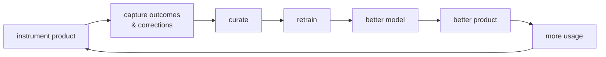

# Module 06 — Data Strategy & Flywheels

## Why this module matters

Models are commoditized. Any competitor can call the same APIs you can, fine-tune the same open weights, and hire from the same talent pool; within 6–18 months, any pure modeling advantage evaporates. What cannot be copied is proprietary data that your product generates and your competitors' products don't — plus the feedback machinery that turns it into model improvement faster than anyone else. At senior level you consume data; at principal level you design the system that manufactures it: the flywheel, the labeling operation, the quality contracts, and the privacy architecture that determines what you're even allowed to keep. This is also where a principal's business accountability is most direct — the data strategy *is* the moat argument in the company's fundraising deck, and you are the person who has to make it true.

## 1. The flywheel is designed, not discovered

The loop everyone can recite:



What separates companies where this compounds from companies where it's a slide is that each arrow is a funded engineering artifact with an owner. Walk them:

**Instrumentation is a product decision made at design time.** The highest-value signal is a *user correction* — the user saw the model's output and fixed it. A correction is a labeled example with near-zero labeling cost and perfect distribution match. But corrections only exist if the UI makes correcting easier than working around: an editable extraction field emits a training pair; a "close ticket and answer by hand" button emits nothing. Principal move: sit in the design review and negotiate correction affordances into the product *before* launch. Retrofitting instrumentation costs 10× and loses months of data you can never recover.

**Every prediction logs its full event record.** Missing columns cannot be backfilled. The minimum schema, standardized org-wide rather than reinvented per team:

```text
prediction_event:
  request_id, timestamp, model_version, dataset_version
  input_ref            # pointer, not payload, if PII tiering requires (§6)
  context_ref          # what was retrieved / assembled, for RAG-shaped systems
  output, confidence
  user_action          # accepted | edited | dismissed | ignored | escalated
  correction           # (field, model_value, corrected_value) pairs, if edited
  outcome_ref          # joined later: conversion, chargeback, deal outcome…
```

(Module 01 of the ML System Design course makes this point for one system; here the point is that it's an org standard you enforce via a shared schema and a CI check, not per-team heroics.)

**Outcome joins have an owner.** The gap where flywheels die quietly: predictions are logged in one system, outcomes land in another (payments, CRM, support tooling) days or weeks later, and nobody owns the join. Fund the predictions-to-outcomes join as infrastructure with a freshness SLA, or the "capture outcomes" arrow on your slide is fiction.

**Curation is a rate-limiter — budget it.** Raw feedback is noisy, redundant, and skewed toward angry users. Between capture and retrain sits sampling, deduplication, quality filtering, and golden-set quarantine (§2). Plan roughly one curation-FTE per 50–100k feedback events/month until model-assisted triage brings the ratio down.

**Safeguards, briefly.** Two failure modes get full treatment in Module 11 but must be named in any flywheel design doc:

- *Adversarial feedback* — users deliberately poisoning the loop. Microsoft Tay is the canonical case; any public correction channel needs rate limits, per-source reputation weighting, and anomaly detection before its output touches training data.
- *Self-reinforcing loops* — the model's outputs shape the very behavior you train on next: the recommender that only learns about items it already shows; the extraction model whose uncorrected errors get rubber-stamped downstream and recycled as "confirmed" labels.

Minimum viable safeguards: hold out a never-trained-on golden slice to detect drift-toward-self; cap the fraction of any training batch sourced from unverified feedback (a common ceiling is 30–50%); and keep a small randomized exploration slice of traffic so the model keeps seeing data it didn't choose.

## 2. Labeling operations at scale

Labeling is the largest recurring line item in most applied-ML budgets and the least examined. The build/buy/model-assist fork, with planning numbers:

```text
                    $/label (typical)     quality control          latency      scales to
In-house team       $2–8 simple;          direct, high trust       days         ~10 labelers before
                    $15–60 expert                                               management overhead
                    (medical, legal)                                            dominates
BPO vendor          $0.05–0.50 simple;    golden sets + audits     days–weeks   effectively unlimited
(Scale-class,       $1–10 complex         that YOU must run
regional BPOs)
Model-assisted      $0.01–0.10 API +      verification sampling    hours        unlimited — but §3
(LLM pre-label,     human verify at       against golden sets
human verify)       3–10× review speed
```

**The $/label math to run before signing anything.** A vendor quotes $0.30/label for document-field annotation, 200k labels:

```text
sticker                 200,000 × $0.30                    = $60,000
QA overhead             golden-set build + 5% audit + adjudication ≈ +20%  = $12,000
rework                  ~10% fails audit, relabeled        = $6,000
instruction iteration   2–6 weeks of senior-eng time       = $8,000–20,000
realistic all-in        ≈ $86,000–98,000 and ~2 months
```

The instruction document is the deliverable that determines everything downstream — budget senior-engineer time for it, with examples of every edge case, because vendors label the instructions you wrote, not the intent you had.

**Quality: golden sets and agreement, not vibes.** Two mechanisms, both mandatory:

- **Golden set.** 500–2,000 items labeled by your best internal people, adjudicated, frozen — salted invisibly into every labeling batch at 3–5%. Per-labeler golden accuracy gates payment and continued work; per-batch golden accuracy gates ingestion of the batch.
- **Inter-annotator agreement.** Double-label 5–10% of volume. Cohen's/Krippendorff's kappa below ~0.7 on a task you believed was objective means your *task definition* is broken, not your labelers. Fix the instructions or split the label into finer categories; do not average away genuine ambiguity, because the model will faithfully learn the noise you refused to resolve.

**Active learning is the 5–10× lever.** Random sampling wastes most of the budget on examples the model already gets right. Three selectors, usually blended:

- *Uncertainty sampling* — label where the model is least confident (calibrate first; raw logprobs lie).
- *Diversity sampling* — cover embedding-space clusters so the batch isn't 500 near-duplicates of one hard case.
- *Disagreement sampling* — where an ensemble or committee splits.

Published and practitioner results consistently show 5–10× label-cost reduction to reach the same accuracy on mature tasks. The catch a principal must flag in review: an actively-sampled dataset is *not* an unbiased sample — maintain a separate, permanently random-sampled eval stream, or your metrics will be computed on the weirdest slice of your distribution and every reported number will be quietly wrong.

## 3. LLM-as-labeler and synthetic data: the judgment call

Model-assisted labeling and synthetic generation are now default tools; the judgment is where they're load-bearing versus where they quietly rot your dataset.

**Where it works:**

- Pre-labeling for human verification. Humans verify 3–10× faster than they label from scratch; this alone often halves labeling cost at equal quality and is the safest deployment of the technique.
- A genuine capability gap between labeler and student — frontier model labels, 1–8B model trains. This is the standard distillation pattern and it works because the teacher's ceiling is far above the student's.
- High-volume, low-ambiguity classification where a statistical audit of samples can bound the error rate.
- Augmenting structurally scarce classes (rare templates, rare languages, rare failure modes) where real data cannot be bought at any price.

**Where it fails:**

- Tasks at or beyond the labeler-model's own competence. Its errors become your ceiling — and they are *correlated* errors. A diverse human pool errs randomly and averages out; a model errs systematically, so no volume of its labels averages anything out.
- Recursive training on model output without fresh human signal — the model-collapse regime (Shumailov et al., Nature 2024): distribution tails vanish first, and your rare-but-critical cases live in the tails.
- Subtle-judgment tasks where the LLM's confident-sounding label papers over genuine ambiguity that a human adjudication process would have surfaced and turned into a better task definition.

**The verification budget is not optional.** Rule of thumb: spend 10–20% of what full human labeling would have cost on verifying the machine labels:

```text
- The labeler-model is an annotator: score it on the golden set, give it a kappa,
  re-qualify it after every prompt or model change.
- Stratified human audit of its labels, stratified by the MODEL'S confidence —
  its overconfident errors are the dangerous stratum.
- Provenance flag on every training row: human | model | model+verified.
  If you cannot state what fraction of the training set is synthetic and how it
  was verified, you don't have a dataset; you have a rumor.
```

The provenance flag also buys you the ablation you will eventually need: when quality regresses two quarters from now, "retrain without the unverified synthetic slice" is a one-line query instead of an archaeology project.

## 4. Data quality is an org problem, not a pipeline problem

Every data-quality postmortem contains the same sentence: "the upstream team changed the schema/semantics and didn't know we depended on it." Sculley et al. (NeurIPS 2015) named the pattern *undeclared consumers*; a decade on, the fix is still organizational, not technical:

**Data contracts on every table that feeds training or serving.** A contract is a producer-side CI artifact, not a wiki page:

```text
contract: payments.transactions_enriched
  owner: payments-platform          consumers: fraud-ml, finance-bi
  schema: [txn_id string NOT NULL, amount_usd decimal, merchant_cat enum(...)]
  semantics: amount_usd is post-fx, tax-inclusive     # the line that prevents the $40M bug
  freshness: 99% of rows within 15 min of event
  distribution checks: null(merchant_cat) < 0.5%; daily row count within ±30% of 28-day mean
  breaking change policy: 30-day deprecation, consumer sign-off required to merge
```

Tooling matters less than the social contract: producers know who consumes, consumers know what's guaranteed, and a producer *cannot merge* a change that breaks a declared consumer.

**The "who owns this column" audit.** Pick the five most important features in your top model and ask who owns each source column. At most companies the honest answer for at least two is "the person who left last year." Every unowned load-bearing column is an unfiled incident. Running this audit takes an afternoon and is the fastest data-maturity assessment available.

**SLAs on upstream tables, with the pager pointed correctly.** Freshness monitors, volume and distribution checks that page the *producing* team. If ML is the only team watching data quality, ML gets paged for finance's bug at 3 a.m. — negotiate pager assignment while nothing is on fire, because you have no leverage during the incident.

**Severity is proportional to silence.** A schema break that crashes the pipeline costs a day. A semantic change that doesn't crash anything — a unit change, an enum repurposed, a default silently backfilled — flows straight into training and costs a quarter, because you discover it as an unexplained metric regression three retrains later. Distribution monitors on feature *inputs*, not just pipeline success/failure, are the control that catches this class.

## 5. Versioning and lineage: decide by constraints, not fashion

The question "can you reproduce the exact training set for the model currently in production?" must have the answer *yes* — for debugging, for compliance (the EU AI Act's documentation provisions make training-data lineage a regulatory artifact for many systems from August 2026), and for running the data-ROI experiments in §7. The main options, chosen by team size, volume, and compliance posture:

- **Lakehouse time travel** (Delta/Iceberg snapshots + a pinned snapshot ID per training run). The default when data already lives in a lakehouse and volumes are large (TB+). Near-zero extra infrastructure. One trap: default snapshot retention (7–30 days) will not cover "reproduce last year's model" — pin and archive training snapshots explicitly, or time travel expires under you.
- **DVC.** Git-anchored, right for small teams (≤ ~15) with file-shaped datasets — images, documents, audio — in the GB-to-low-TB range. Cheap, comprehensible, weak at warehouse-native tabular flows.
- **LakeFS.** Git-like branching over the object store. Earns its ops cost when many teams need isolated data branches and merge-style workflows over the same lake, or when compliance wants immutable, auditable data versions independent of any single compute engine.

Minimum bar regardless of tool: every model-registry entry carries `dataset_version`, code commit, and provenance stats (the human/synthetic split from §3, source distributions). Lineage — which upstream tables and transformations produced this training set — is what turns a §4 incident from archaeology into a query.

## 6. Privacy architecture is data strategy

What you are allowed to keep determines what flywheel you can build — so privacy design is upstream of data strategy, not a tax on it. The decisions with strategic weight:

**Retention windows.** "Delete raw data after 30 days" and "train on 12 months of interactions" cannot both be true. If consent supports it, derive and keep *training-shaped* artifacts — labeled pairs, corrections, aggregates — beyond raw-log retention. This is a deliberately designed derivation reviewed by counsel, not a loophole. The companies with durable data moats decided *what to keep, in what form, under what consent* years before their competitors thought about it.

**Consent granularity.** A terms-of-service clause that covers model training is worth real money; bolting it on later triggers re-consent flows with 30–70% attrition on historical data. This is a conversation you initiate with legal, not one you wait for.

**PII handling tiers.** The standard ladder, with training reading from the middle:

```text
tier 0  raw PII            locked, short retention, break-glass access, full audit log
tier 1  pseudonymized      keyed + joinable, the workhorse tier for training & analytics
tier 2  anonymized/agg     long retention, broad access, exits most regulatory scope
```

Deletion requests (GDPR Art. 17 / CCPA) must propagate to training corpora and, in the hard case, to models trained on deleted rows. The pragmatic pattern: retrain on a cadence from a corpus that honors deletions, and document the cadence as your compliance answer — "your data exits our models within N weeks" is defensible; "we'll get to it" is not.

**Regulated-domain add-ons** (HIPAA, PCI, EU AI Act high-risk categories): expect data-flow maps as launch-blocking artifacts, regional pinning that shapes where the flywheel's compute runs, and audit trails on every access to the labeled corpus.

## 7. Measuring data ROI: the data-value curve

The recurring executive question: *does the next $100k go to data or to compute/modeling?* Answer it with an experiment, not a position. The marginal-value-of-data protocol:

```text
1. Fix model, hyperparameters, and eval set (frozen, random-sampled — §2 caveat).
2. Train on stratified random 10% / 25% / 50% / 100% subsets of current data.
3. Plot eval metric vs log(dataset size); fit the curve.
4. Extrapolate one doubling; price the projected lift against the same $ spent on
   the best modeling alternative (bigger base model, better retrieval, RLHF pass).
```

A typical readout and what it decides:

```text
subset    10%     25%     50%     100%    → 200% (extrapolated)
overall   84.1    87.9    90.2    91.4    ~92.3     ← +0.9 pt per doubling: flattening
tail-templates slice
          61.0    68.5    74.8    80.1    ~84.5     ← +4.4 pt: steep, data-bound
```

Reading it: still climbing steeply at 100% → you are data-bound and can price a point of accuracy directly in $/label. Flat from 50% → 100% → more of the *same* data is worthless; the next dollar goes to compute, architecture, or *different* data (new slices, harder cases, new modalities). Run the curve per-slice, because "flat overall" routinely hides "steep on the slice that drives your worst errors" — which is also exactly where active learning should aim. The whole experiment costs a few training runs (usually $500–$10k) and settles arguments that otherwise consume quarters of roadmap. Rerun it twice a year per major model; the curve moves as models and data change.

## You can now

- Design a correction-capture event schema that turns user edits in a product UI into near-free labeled training pairs, and negotiate that instrumentation into the product before launch rather than retrofitting it later at 10× the cost.
- Budget a labeling operation end-to-end — sticker price plus QA overhead, rework, and instruction-iteration time — and select the right in-house/vendor/model-assisted split for your volume, quality bar, and latency requirements.
- Apply the three active-learning selectors (uncertainty, diversity, disagreement sampling) while maintaining a permanently random eval stream, so metrics aren't computed on the hardest slice and actively sampled datasets don't silently bias reported numbers.
- Architect a three-tier PII pipeline (raw → pseudonymized → anonymized), connect retention windows to consent granularity, and design a deletion-propagation cadence that is a defensible compliance answer rather than a promise.
- Run the marginal-value-of-data experiment per slice to answer "data vs. compute?" with arithmetic, and know when a flat curve signals switching from more of the same data to compute or to qualitatively different data.

## Worked example

**Scenario.** "Parseline" sells document AI — invoice and receipt extraction — processing 2M docs/month for mid-market finance teams. Field-level extraction accuracy is 91%; every error is either a human correction downstream in the customer's approval UI, or worse, a wrong payment. Pricing tiers commit to **straight-through processing** (STP) — the fraction of documents needing zero human touches. You own data strategy. Design the flywheel.

**Step 1 — Instrument corrections.** The approval UI already lets customers edit extracted fields; today those edits update the record and are thrown away. Ship the event:

```text
correction_event: (doc_id, field, model_value, corrected_value,
                   model_confidence, template_cluster, editor_id, ts)
approval_event:   (doc_id, fields_untouched[], ts)   # weak positive labels
```

At 2M docs/month, ~9% field-error rate, ~15 fields/doc: roughly **2.7M correction events/month** — a labeling stream that would cost ~$800k/month at vendor rates, generated free. This event schema is the single highest-ROI engineering ticket in the company.

Safeguards per §1: corrections are weighted by customer reputation and by cross-customer agreement on the same vendor template; a correction that *introduces* disagreement with high-confidence model output on a golden-known template is quarantined for human review, not trained on — customers make data-entry errors too, and the flywheel must not learn them.

**Step 2 — Sampling for labeling.** Corrections oversample errors (good) but under-cover the long tail of rare templates that never get corrected because those customers churn first. Monthly curated batch of 30k docs:

```text
60%  correction-derived, verified          (distribution-matched, near-free)
25%  active learning: low-confidence + committee-disagreement docs,
     stratified by template cluster, no cluster > 5% of batch
15%  pure random                           (eval integrity + drift detection)
```

LLM pre-labeling on the active and random slices with human verification: verify throughput ≈ 4× from-scratch labeling.

**Step 3 — Golden-set QA.** A 1,500-doc golden set spanning the top 40 template clusters plus a hard-tail slice; triple-labeled internally, adjudicated, frozen. Salted into every batch at 4%. Labelers below 96% golden accuracy are retrained or rotated out. The LLM pre-labeler is scored on the golden set monthly like any annotator — current kappa 0.83: good enough to pre-label, nowhere near good enough to skip verification. A fresh random 500-doc slice is *added* to eval quarterly — added, never substituted, so the frozen core keeps metrics comparable across releases.

**Step 4 — The budget.**

```text
in-house verification pod   6 people (2 senior adjudicators, 4 verifiers)   ≈ $38k/mo
LLM pre-labeling API                                                        ≈ $3k/mo
curation engineering                                          0.5 FTE       ≈ $14k/mo
all-in                                                                      ≈ $55k/mo
effective rate    ≈ $0.12 per curated training doc (30k docs + 400k
                  auto-verified correction events)  vs $0.90/doc vendor
                  quote for from-scratch expert labeling at equivalent QA
```

The correction stream is doing $250k+/month of effective labeling work at zero marginal cost. That number goes in the board deck, because it *is* the moat, quantified.

**Step 5 — Retrain cadence and the accuracy trajectory.** Monthly retrains — weekly is wasted motion below ~5M docs/month; quarterly leaves correction signal on the table. Release gates: frozen-eval field accuracy no-regress overall AND on each top-10 customer slice; STP-rate simulation replayed on last month's traffic; 5% canary for one week.

The data-value curve, run at kickoff, shows the §7 pattern almost exactly: flat on the top-10 template clusters, steep (+4pt/doubling) on tail templates — so the labeling budget tilts to tail clusters, and the projection is 91% → ~94% field accuracy over four quarters, which the STP simulation converts to 62% → ~74% straight-through documents.

The revenue link, stated plainly for the exec audience: STP is the contracted metric gating the enterprise-tier upsell (~$1.8M ARR in currently blocked deals), and each STP point cuts the customer's processing cost, of which Parseline's pricing captures a share. The strategy doc's closing line: *at current usage growth, Parseline's error-correction stream grows 40%/year at zero marginal cost, while any competitor must buy equivalent labels at market rate — that asymmetry, not the model, is the company.*

## Exercise

**Task.** Write the flywheel + labeling-ops design doc (3–4 pages) for the following product.

*Meetly*, a meeting-assistant product: transcribes sales calls, extracts action items, deal-risk signals, and CRM field updates (amount, stage, next step) for 40k companies; 1.2M meetings/month. Users can edit extracted action items and CRM updates in a review pane before syncing; today ~35% of CRM suggestions get edited and ~20% of action items get dismissed. Transcripts contain names, customer data, and occasionally payment details; contracts promise "your data is not used to improve the service" for the 15% of customers on the enterprise privacy tier. Extraction runs on a fine-tuned 8B model; the founders are debating whether the next $300k goes to labeling or to moving to a larger model.

**Deliverables.**

1. **Flywheel design:** the correction/outcome events you'd instrument (schemas), the outcome join (what ground truth exists for "deal-risk" and when it arrives), and safeguards against feedback poisoning and self-reinforcement.
2. **Labeling-ops plan:** sampling mix; in-house/vendor/model-assisted split with $/label math including QA overhead; golden-set construction; an IAA protocol for the genuinely ambiguous "deal-risk" label.
3. **Privacy architecture:** how the enterprise no-training tier is enforced end-to-end (not merely filtered at training time); retention and consent design for everyone else; PII tiers for transcripts.
4. **The data-vs-compute recommendation:** design the data-value-curve experiment that answers the founders' $300k question, including the specific result that would send the money to compute instead.

**You're done when:** every flywheel arrow in your diagram names the event schema or job that implements it, and its owner; your $/label math includes QA overhead and rework, not just sticker price; the deal-risk label has a written adjudication protocol (because two honest annotators will disagree); the no-training guarantee is enforced at data *capture* with the mechanism named; and the $300k recommendation is stated as a conditional on the curve experiment's outcome, with the experiment fully specified (subsets, frozen eval, cost, runtime).

**Self-check questions.**

1. Deal-risk has no immediate ground truth — the outcome arrives when the deal closes or dies, weeks later. How does your flywheel handle a 6–10 week outcome-join delay without training on stale proxies?
2. 35% of CRM suggestions get edited — but is an *unedited* suggestion a positive label, a lazy user, or an unreviewed sync? What instrumentation distinguishes the three?
3. What fraction of your proposed training set is model-labeled, and what is your verification budget as a percentage of equivalent full-human cost? If it's under 10%, defend it.
4. If the enterprise no-training tier grows from 15% to 60% of customers, what happens to your flywheel's growth rate — and does that change the moat story you'd tell the board?
5. Which slice of Meetly's data-value curve do you expect to be steep and which flat — and how does that prediction change your sampling mix before you've even run the experiment?
