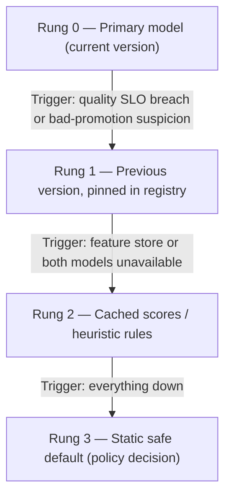

# Module 10 — Reliability Engineering for ML Systems

## Why this module matters

SRE gave software teams a shared vocabulary — SLOs, error budgets, blameless postmortems — and it works because software failures are mostly *loud*: the service throws 500s, the pager fires, someone rolls back. ML systems break that assumption. The signature ML failure is a system that is perfectly healthy by every infrastructure measure while confidently emitting garbage. Your dashboards are green, your latency is fine, your error rate is zero, and your fraud model has been approving mules for three weeks. The principal-level job is to extend the SRE discipline to cover this failure class: define SLOs that measure *correctness over time*, not just uptime; build degradation ladders before the incident, not during it; and run a postmortem culture that converts each failure into a pattern the whole org checks for. This module gives you the operating system. Module 11 gives you the pattern library it feeds.

## 1. SLOs for ML systems — the four families

Standard SRE gives you two SLO families: availability and latency. ML systems need four. Write all four down for every production model, even when some are "we don't have this yet" — a documented gap is a roadmap item; an undocumented one is an incident.

**Availability SLOs** — the familiar kind. "The scoring endpoint returns a valid response for 99.95% of requests over 28 days." One ML-specific wrinkle: define what a "valid response" means when the fallback fires. If your degradation ladder (section 4) serves a cached score, that request *counts as available but degraded* — track degraded-mode minutes as a separate SLI, or your availability number will hide the fact that the primary model was down for a week.

**Latency SLOs** — p50/p99 on the scoring path, budgeted per component the way Module 01 of the ML System Design course budgets a request path. The ML wrinkle: feature retrieval is usually the variance source, not inference. A p99 of 80 ms with 60 ms of it in a feature-store lookup under cold cache is a feature-store problem wearing a model costume.

**Freshness SLOs** — the family classic SRE doesn't have. Two distinct clocks:

- *Feature freshness*: "No feature served in production is staler than its declared max age." Each feature gets a declared staleness bound at registration time (real-time features: seconds; daily aggregates: 26 hours, allowing for pipeline slack). The SLI is the fraction of served feature vectors within bound.
- *Model freshness*: "A new model is trained, validated, and serving within Y of new training data being available." For a fraud model retrained weekly, Y might be 10 days; for a recommender on daily retrains, 36 hours. This SLO is what turns "the retraining pipeline has been silently failing for a month" from a discovered-by-accident event into a paged event.

**Quality SLOs** — the hardest and most valuable. You cannot SLO directly on accuracy when labels arrive late (fraud labels: 30–90 days via chargebacks). The practical construction is a *canary metric*: a fast-arriving proxy statistically tied to the delayed truth. Examples: manual-review overturn rate (analysts disagree with the model within hours), approval-rate deviation from a trailing baseline, score-distribution divergence (PSI against the training snapshot). The SLO reads: "PSI of the score distribution vs the 28-day trailing window stays below 0.2; manual-review overturn rate stays within ±3 points of baseline." These are correctness tripwires, and they are what would have caught every "green dashboards, wrong predictions" incident you will read about in Module 11.

```text
SLO sheet, one model (fraud scorer, tier-1):
  availability : 99.95% valid responses / 28d          (page at 99.9% burn rate)
  latency      : p99 ≤ 150 ms end-to-end               (page on 15-min breach)
  freshness    : features ≤ declared max age, 99.9%    (page)
               : model retrained ≤ 10d after data      (ticket at 8d, page at 10d)
  quality      : score PSI vs 28d baseline < 0.2       (page)
               : review overturn rate within ±3 pts    (page)
               : approval rate within ±2 pts of fcast  (ticket, page if 24h)
```

## 2. The ML incident taxonomy

Every ML incident falls into one of five classes, and each class has a different detection surface, a different first responder, and a different fix. Teaching your on-call rotation this taxonomy is worth more than any individual runbook, because the first fifteen minutes of an ML incident are usually spent mis-classifying it.

**Class 1 — Infra down.** Serving pods crash, feature store times out, registry unreachable. Loud, familiar, caught by standard monitoring. Your normal SRE playbook applies; the only ML addition is knowing which rung of the degradation ladder to drop to.

**Class 2 — Infra green, model serving garbage.** The signature ML failure. The endpoint returns 200s with confident, wrong scores. Causes: a bad model promoted, an embedding-space mismatch, a preprocessing library version drift between training and serving. Detection surface: quality SLOs only. No infrastructure metric will ever fire. If your monitoring stack has nothing in this class, you do not have ML monitoring; you have web-service monitoring pointed at an ML system.

**Class 3 — Data pipeline silently broken.** The upstream job "succeeds" but writes nulls, duplicates, or a partial partition. The model degrades gradually as stale or default feature values dilute its inputs. Detection: feature freshness SLOs, null-rate and cardinality monitors on the feature store *write* path, not just the serving path. The dangerous property: degradation is smooth, so week-over-week dashboards look like mild seasonal drift.

**Class 4 — Upstream schema change.** A team you've never met renames a field, changes an enum, or switches units. Your pipeline doesn't crash — it coerces, defaults, or silently drops. This is the most common root cause of Class 2 and 3 incidents in practice, and it is the one in this module's worked example. The systemic fix is contracts, not vigilance: schema registration with breaking-change detection on every upstream topic you consume, and an ownership map so you're in the change-review loop of your dependencies.

**Class 5 — Feedback-loop degradation.** The model's own outputs corrupt its future training data: a fraud model that blocks a segment stops collecting labels for it; a recommender narrows its exposure distribution and then trains on the narrowed logs. Slowest to develop, hardest to detect, and invisible to all four SLO families unless you monitor *training-data distribution vs a holdout of unaffected traffic* (e.g., a small always-approve exploration slice — which is itself a product and risk decision the principal has to negotiate, since exploration costs real fraud dollars).

The taxonomy earns its keep in the first question of every incident channel: "Which class is this?" Class 1 → infra on-call leads. Class 2 → rollback decision (section 6). Class 3/4 → data engineering plus point-in-time recovery assessment. Class 5 → nobody's paging; it's a week-long investigation you schedule.

## 3. Monitoring design — what to watch when the truth arrives late

The monitoring stack for a production model has four layers, ordered by how fast they detect and how noisy they are:

**Input drift.** Distribution monitors per feature: PSI or KL divergence against the training snapshot for numericals, cardinality and new-category-rate for categoricals, null-rate and default-value-rate for everything. Cheap, fast, and *noisy* — features drift benignly all the time. Input drift alerts should mostly be tickets, not pages, with two exceptions that always page: a new unseen category exceeding a few percent of traffic, and a null/default rate jumping more than ~5× baseline. Those two are almost never benign; they are Class 3/4 incidents announcing themselves.

**Prediction drift.** The score distribution itself: mean, quantiles, PSI against trailing baseline, and — for classifiers with a threshold — the action rate (approval rate, block rate, escalation rate). Prediction drift is the best single early-warning signal because it integrates over all input problems and is directly connected to business impact. A fraud model whose approval rate moves 4 points overnight has a cause, always.

**Proxy/canary metrics.** The delayed-label workaround from section 1: overturn rates, downstream funnel metrics, complaint rates, a small human-labeled daily sample (100 cases/day labeled by the review team gives you a same-day quality estimate with ±5-point resolution — crude, but it turns a 60-day blind spot into a 1-day one, and at ~$2/label it costs $6k/month to insure a model protecting nine figures of volume).

**Ground truth.** When labels finally arrive, compute the real metrics retroactively and *backfill the time series*, so every incident review can see what quality actually did during the window. Also run a standing weekly job that correlates your canary metrics against arrived truth — a canary that no longer correlates is worse than no canary, because it manufactures false confidence.

**Alert fatigue economics.** Every alert needs an owner and a playbook, or delete it. The math is unforgiving: an alert with 10% precision that fires daily trains the rotation to ignore it within a month, and the cost is not the wasted 20 minutes per false positive — it's that alert #31, the real one, gets acked and snoozed. Run a quarterly alert audit: for each alert, pull fire count, action-taken count, and incident-caught count. Anything under ~30% actionability gets fixed (better threshold, longer window, ratio-of-baselines instead of absolute) or demoted to a dashboard. Principal-level rule: you may add an alert only by also naming its owner, its playbook link, and the incident class it detects.

## 4. Degradation ladders — design the fallback before the incident

When the primary model can't serve (or can't be trusted), what happens? If your answer lives in the head of whoever is on call, you don't have an answer. A degradation ladder is a pre-designed, pre-tested fallback chain with explicit triggers:



Three design points that separate a real ladder from a diagram:

**Each rung has known quality.** You should be able to say "rung 1 costs us ~0.4 points of AUC, rung 2 approximately doubles fraud losses per hour, rung 3 blocks all transactions above $500 and costs ~$40k/hour in abandoned checkouts." Those numbers are what let the incident commander choose a rung in thirty seconds instead of convening a meeting. Compute them in peacetime.

**Rung 3 is a business decision made in advance.** For a fraud model, the static default is fail-open (approve everything, eat the fraud) or fail-closed (decline above a limit, eat the lost sales). Engineering cannot make that call; a principal's job is to force the question to product/risk leadership *before* the first 3 a.m. incident, get the answer in writing, and encode it.

**The ladder is exercised, not just documented.** Run a quarterly game day: force a fallback to each rung in production (or a mirrored slice) and verify traffic actually degrades as designed. Untested rung-2 caches have a way of holding 90-day-old scores keyed on a schema nobody uses anymore. The first time the ladder runs must not be during an incident.

## 5. Rollback for ML — why it's harder than `git revert`

**Model rollback: solve for instant.** The registry pattern (Module: MLOps course covers mechanics) means serving reads "fraud-scorer @ production" as a pointer, and rollback is repointing to the previous version — seconds, no redeploy, no retrain. If your rollback requires a CI pipeline run, you have a 45-minute rollback, and at fraud-model blast radius that's a 45-minute × $/minute problem. Keep the last N versions warm-loadable; test pin-back monthly.

**Feature pipeline rollback: the hard one.** Models are immutable artifacts; feature pipelines are stateful streams. If a bad transform has been writing corrupted values into the online store for six hours, repointing the model fixes nothing — the model is fine, its inputs are poisoned. You need: (a) versioned transform code with the ability to redeploy version N−1, and (b) *backfill capability* — recompute the corrupted window from raw events and overwrite the store. Backfill is the capability teams discover they lack mid-incident. Design target: any 24-hour window of any feature recomputable within 4 hours. If your raw event retention or pipeline architecture can't support that, write it down as accepted risk with a dollar estimate attached, because that's what it is.

**Data poisoning: rollback isn't enough.** If bad data (a schema-change artifact, an adversarial injection, a label-pipeline bug) got into *training data*, then rolling back the model only helps until the next retrain, which will happily re-learn the poison. You need point-in-time recovery of the training corpus: snapshot or time-travel semantics on training tables (lakehouse formats give you this nearly free — use it), plus lineage that answers "which model versions trained on the affected partitions?" The recovery sequence is: quarantine the affected partitions → identify contaminated model versions from lineage → pin serving to the last clean version → retrain from the last clean snapshot → *then* fix the pipeline. Teams that fix the pipeline first and retrain routinely retrain on still-contaminated data because the quarantine step was skipped.

## 6. On-call for ML teams

**What pages vs what tickets.** Pages: availability/latency SLO burn, the two input-drift exceptions (new-category spike, null spike), prediction-drift beyond page threshold, quality-canary breach, feature freshness breach on tier-1 models. Tickets: benign input drift, model-freshness early warning, retraining-pipeline single failures (page on second consecutive), monitoring-of-the-monitoring gaps. Rule of thumb: a page must be actionable within 15 minutes by the person paged, using a playbook, without waking the model's author. If the honest playbook step 1 is "page the person who built it," the model isn't operable and shouldn't be tier-1 yet — that's a launch gate, and enforcing it is a principal responsibility.

**The retrain-vs-rollback decision under pressure.** The most common judgment call in ML on-call, and the one to encode as a decision rule rather than leave to 3 a.m. reasoning:

- **Roll back when** the degradation correlates with a deployment event (new model version, new feature version, new transform) — the previous version is a known-good state you can reach in seconds.
- **Roll back to a rung, don't retrain, when** the world changed (Class 4/5, regime shift): the previous model version is usually *also* wrong about the new world, but rung 2 heuristics may be more robust than either model; buy time on a rung while you fix data and retrain deliberately.
- **Never emergency-retrain within the incident.** A retrain under pressure, on possibly-contaminated data, skipping the eval gates because "it's an emergency," converts one incident into two. Retraining is the *resolution* phase, gated by the same offline evaluation as any release. The incident's job is to stop the bleeding via the ladder; the fix ships the next day through the normal gate.

**Rotation design.** ML on-call needs two competencies rarely found in one person: serving infra and model behavior. Pattern that works at 10–30-engineer ML orgs: primary on-call from the ML platform/infra side handles Class 1 and executes ladder/rollback playbooks; a "model duty" secondary from the modeling side is paged only for Class 2/4/5 diagnosis, with a 30-minute (not 5-minute) response expectation. Don't put researchers in the primary rotation; do require every model owner to have written the quality-SLO sheet and playbook for their model as a promotion-to-production gate.

## 7. Postmortem culture and error budgets for model quality

**Blameless, systemic, pattern-feeding.** The standard blameless discipline applies; the ML-specific addition is that action items must be *systemic*, and ML postmortems are unusually prone to the non-systemic kind: "add a check for currency codes," "be more careful reviewing feature PRs," "monitor that dashboard more closely." Each of those fixes the last incident and nothing else. The principal's move in every postmortem review is to push each action item up one level of generality: not "check currency codes" but "schema contracts with breaking-change alerts on all upstream dependencies"; not "watch the dashboard" but "a quality SLO that pages." Test: would this action item have prevented at least two *other* plausible incidents? If not, it's a patch, and Module 11 pattern #6 (patch-the-symptom) is about what patches cost.

The second ML-specific addition: the postmortem is an *input to the pattern library*. Every postmortem ends with a classification against the failure taxonomy (this module's five classes, Module 11's eleven patterns) and, when it doesn't fit, a proposal for a new pattern. Over two years this turns your incident history from folklore into a design-review checklist — which is exactly how the checklist at the end of Module 11 was built.

**Error budgets for model quality.** The SRE error-budget contract — "while the SLO is met, ship fast; when the budget is burned, freeze and stabilize" — ports to model quality with one translation: the budget is *quality-SLO breach minutes* (or canary-metric excursion area), and the thing you freeze is not deploys in general but *risk-adding changes to that model's surface*: new features, new model architectures, threshold changes, upstream migrations. Concretely: a tier-1 model gets a budget of, say, 4 hours/quarter of quality-SLO breach. Inside budget, the team ships weekly retrains and monthly feature additions with self-serve review. Budget exhausted → the next sprint is monitoring, contracts, and backfill capability, not features — and that trade is pre-agreed with product leadership, which is the entire point: the budget converts "reliability vs velocity" from a per-argument negotiation into a standing contract. Without it, reliability work loses every individual prioritization fight and then costs you a quarter all at once.

## You can now

- Define all four SLO families — availability, latency, feature freshness, and model freshness — for any production ML model, and design quality SLOs using canary metrics when ground-truth labels arrive too late to page on directly.
- Classify any ML incident into one of the five classes within the first fifteen minutes and route it to the right responder: infra on-call for Class 1, a rollback-or-rung decision for Class 2, data engineering plus backfill assessment for Class 3/4, and a scheduled investigation for Class 5.
- Design a degradation ladder with explicit per-rung triggers, pre-computed quality and cost estimates for each rung, and a quarterly game-day exercise schedule — so the ladder runs correctly the first time it matters.
- Apply the retrain-vs-rollback decision rule under pressure: roll back to a known-good version when degradation correlates with a deployment event, drop to a rung when the world changed, and never emergency-retrain on possibly-contaminated data during an active incident.
- Run a blameless ML postmortem that pushes every action item up one level of generality, and negotiate quality error budgets with product leadership so reliability investment is pre-funded rather than re-litigated every quarter.

## Worked example — the currency-code incident

**Setting.** A fintech ("Meridian") processes 2.1M card transactions/day across 14 markets. A GBDT fraud model (tier-1) scores every transaction; ~3.2% route to manual review; the model gates roughly $1.4B/month in volume. The team: 6 ML engineers, 4 data engineers, an SRE-style on-call. Monitoring at incident time: availability, latency, feature null-rates on the *serving* path, and a weekly offline metrics report. No prediction-drift paging, no canary SLO, no schema contracts.

**The change.** On March 3, the payments platform team migrates their transaction topic from ISO-4217 alphabetic currency codes ("GBP") to numeric ("826") as part of a partner integration. They announce it in their own team channel. The fraud feature pipeline consumes this topic; its currency parser doesn't recognize numeric codes and falls through to the default branch: currency → "UNKNOWN", and the three currency-derived features (amount normalized to USD, cross-currency velocity, market risk prior) silently take training-mean default values. The pipeline reports success. Null-rate monitors don't fire — the values aren't null, they're *defaults*.

**The degradation.** The migration rolls out market-by-market over three weeks (the platform team's own canary process, ironically). Fraud detection quality degrades in lockstep: for affected transactions, the model loses its strongest cross-border signals. Score distribution shifts mildly each week — never sharply, because coverage grows 5–10% at a time. Fraud losses run above forecast: +9% week 1, +23% week 2, +41% week 3. Weekly loss reviews attribute it to "post-holiday fraud seasonality" for two weeks. Manual-review analysts notice they're overturning more approvals in EU markets and mention it in a standup; it doesn't reach the ML team.

**Detection, day 19.** A senior analyst files a ticket: "model seems blind to cross-currency card testing." An ML engineer pulls feature values for the flagged cases and finds `currency=UNKNOWN` on 61% of EU transactions. Time from first bad value to detection: **19 days**. Estimated incremental fraud loss: **$2.8M**.

**Detection-gap analysis (do this for every ML incident).** For each monitoring layer, when *would* it have fired?

| Layer (if it had existed) | Would have fired | Gap vs actual |
|---|---|---|
| Schema contract on upstream topic | Day 0, pre-deploy | −19 days |
| New-category rate on `currency` (page) | Day 1, hours in | −18 days |
| Default-value rate per feature (page) | Day 1 | −18 days |
| Prediction drift / approval-rate SLO | Day 2–4 (first market ~8% traffic) | −15 days |
| Review-overturn canary SLO | Day 5–7 | −13 days |
| Weekly offline report (existed) | Never — labels lagged 45 days | — |

**Incident timeline once detected.** T+0:20 — classified as Class 4 (upstream schema change). T+0:40 — decision: *no rollback of the model* (the model was never the problem) and *no emergency retrain*; instead drop currency-derived features to rung-2 behavior deliberately? Rejected — instead, T+1:30 — hotfix the parser to map numeric→alpha codes; T+2:15 — backfill question: the online store holds 19 days of corrupted feature history used by velocity features; raw events retained, backfill tooling partial — recomputation of the 19-day window takes **52 hours** (vs the 4-hour design target this incident subsequently created). T+3 days — training-data quarantine: lineage shows the March 15 weekly retrain consumed 12 days of contaminated features; that model version is marked contaminated in the registry; serving is pinned to the Feb 26 version (which had run alongside it — this is why you keep N versions warm); a clean retrain from time-travel snapshots ships day 5 through the normal eval gate.

**The postmortem (excerpt as filed).**

```text
POSTMORTEM PM-2026-014 — Fraud model degradation via upstream currency-code migration
Severity: SEV-1   Duration: 19 days undetected + 5 days to full resolution
Impact: ~$2.8M incremental fraud loss; ~14k mis-approved transactions;
        review-team overtime; one contaminated model version in registry

Timeline: (abridged — full version in appendix)
  Mar 03  payments-platform begins ISO-4217 alpha→numeric migration, market-by-market
  Mar 03  fraud feature pipeline begins defaulting 3 currency features (silent)
  Mar 15  weekly retrain consumes 12 days of contaminated features
  Mar 22  analyst ticket: "model blind to cross-currency card testing"
  Mar 22  incident opened, Class 4; parser hotfix live T+1:30
  Mar 24  online-store backfill complete (52h)
  Mar 27  clean retrain from Feb-26 snapshot promoted via standard gate

Root cause: no contract between the fraud pipeline and its upstream topic;
  parser fail-open to defaults; no monitoring layer capable of detecting
  default-value substitution or its prediction-level consequences.
NOT root cause: the platform team's migration (announced, well-run),
  the parser author, the analyst escalation path. Blameless means the
  system allowed a well-executed upstream change to cause a SEV-1.

Contributing factors:
  - default-value fail-open considered "safe" at parser authoring time
  - loss-review process had no channel to ML on-call
  - offline quality report lagged labels by 45 days — structurally
    incapable of detecting any incident faster than ~7 weeks

Action items (all systemic, all owned, all dated):
  AI-1  Schema contracts + breaking-change CI alerts on all 9 upstream
        topics consumed by tier-1 models            (data-eng, Q2)
  AI-2  Per-feature default/new-category/null rate monitors → page
        for tier-1                                   (ML platform, 4 wks)
  AI-3  Quality SLOs: approval-rate + score-PSI + overturn-rate canary,
        paged, per tier-1 model                      (ML platform, 6 wks)
  AI-4  Backfill capability: any 24h window of any tier-1 feature
        recomputable ≤ 4h; quarterly game-day test   (data-eng, Q2)
  AI-5  Training-data lineage + time-travel snapshots; registry gains
        "contaminated" state and pin-back runbook    (ML platform, Q2)
Pattern-library entry: filed as instance of "upstream schema change,
  fail-open defaults" — second occurrence org-wide; promoted to
  standing design-review question.
```

**The five systemic fixes, generalized** — contracts at the boundary (AI-1), detect substitution not just absence (AI-2), page on consequences not just causes (AI-3), rehearsed recovery of state (AI-4), and lineage that makes contamination tractable (AI-5). Note what's *not* on the list: "review upstream announcements more carefully." That was the first draft's action item #1, and deleting it is the postmortem-review skill this module exists to teach.

## Exercise

**The system.** You inherit reliability for a delivery marketplace's ETA model: predicts courier arrival time for 900k orders/day across 40 cities; served real-time (p99 budget 120 ms); consumes a real-time features stream (courier GPS, restaurant prep-time estimates, traffic) and daily batch aggregates; retrained nightly on the trailing 30 days; downstream consumers include the customer app, courier dispatch, *and* the refunds system (auto-refund if delivery exceeds promise by 15+ min — an undeclared consumer discovered last quarter). Labels (actual arrival) arrive within the hour. Current monitoring: infra only.

**Deliverable.** One doc (2–3 pages) with three artifacts:

1. **SLO sheet** — all four families, with numeric targets, measurement windows, and page-vs-ticket routing for each. Freshness SLOs must cover both feature clocks and the nightly retrain. Since labels arrive fast here, decide (and defend) whether you still need canary metrics or can SLO on near-real-time accuracy directly — and what the refunds system implies for which quality metric you protect.
2. **Degradation ladder** — 4 rungs with explicit triggers, and an estimated per-hour cost of operating at each rung (state your assumptions; invented-but-consistent numbers are fine). Include the fail-open/fail-closed decision the refunds consumer forces, and who signs off on it.
3. **On-call playbook** for the top page: "ETA error (MAE, 1-hour window) breached 2× baseline." Steps must include incident-class diagnosis using the section-2 taxonomy, the retrain-vs-rollback decision rule applied to this system, and explicit stop-the-bleeding vs resolution phases.

**You're done when:** every SLO has an owner and a number; every alert in your sheet maps to a playbook or is explicitly a ticket; every ladder rung has a trigger, a quality/cost estimate, and a tested-by date; the playbook can be executed by an engineer who did not build the model; and the refunds system appears in at least two of the three artifacts.

**Self-check questions:**

1. Which of the five incident classes is your monitoring design *weakest* against, and what would that incident look like in this system? (Hint: what does nightly retraining on 30-day trailing data do when a city launches a promotions blitz?)
2. Your ETA labels arrive within an hour — so why might you still want a distribution-level canary in addition to direct accuracy monitoring? (Consider partial outages and Simpson's-paradox slicing across 40 cities.)
3. If the courier-GPS stream starts reporting stale positions that pass schema validation, which monitoring layer catches it, and how fast?
4. The nightly retrain fails silently for 6 nights. Which SLO fires, on which day, and what's the blast radius by then?
5. What error budget would you propose for this model's quality SLO, and what specifically freezes when it's exhausted?
