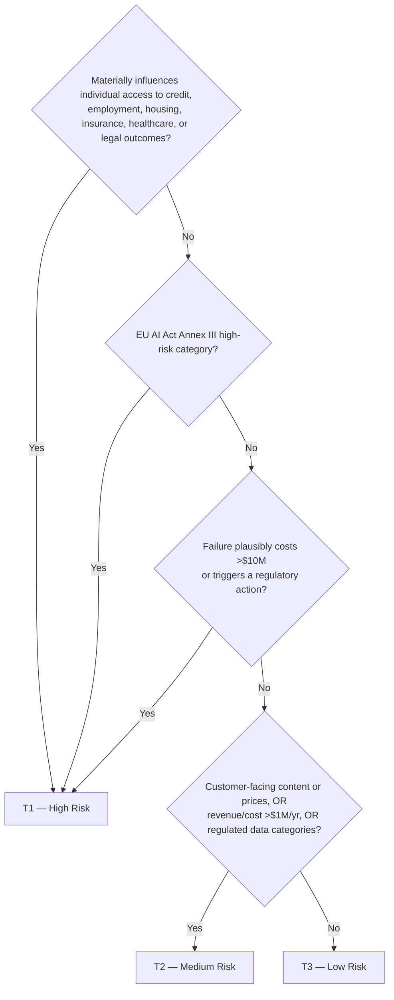

# Module 12 — Governance, Model Risk & Responsible AI — Part 1 of 2: Model Risk Management, Tiering, the EU AI Act & Fairness

## Why this module matters

Every failure in Module 11's pattern library had a governance-shaped hole behind it: nobody could say who approved the model, what data it trained on, or what evidence supported the launch. Principals inherit governance whether they want it or not — when the regulator letter arrives or the discrimination story breaks, the question comes to the most senior engineer in the room, not to legal. The senior engineer's mistake is treating governance as paperwork to minimize; the principal's insight is that governance done as an *engineering system* — registries, automated documentation, tiered review — is cheap, and governance done as manual paperwork is both expensive and ineffective. This module teaches you to build the system version. It is also increasingly a legal requirement, not a preference: the EU AI Act's high-risk obligations and decades of US banking model-risk supervision define a floor you must design to, not negotiate with.

## 1. Governance is an engineering system, not a review meeting

The naive implementation of ML governance is a committee: a monthly meeting where model owners present slide decks and a review board asks questions. This fails in a predictable way — the committee becomes a bottleneck at ~5 models/month of throughput, teams learn to route around it, and the artifacts it produces (slides, meeting minutes) are unqueryable and stale within a quarter. Two years in, the org has a governance *ritual* and no governance *state*: nobody can answer "which production models touch EU-resident data?" without a two-week email archaeology project.

The engineering framing inverts this. Governance is a set of invariants maintained by systems:

- **Every production model is registered** — enforced by the deployment pipeline refusing to serve unregistered artifacts, not by policy memo.
- **Every model has a risk tier** — assigned at registration, and the tier mechanically determines which gates apply.
- **Every high-tier model has current documentation** — generated from the registry and training metadata, and the deploy gate fails if generation fails.
- **Every prediction that affects a person is reconstructible** — model version, feature values, and explanation retrievable by prediction ID for the retention window.

Notice what this buys you: compliance questions become queries. "List all high-risk models, their last validation date, and their fairness metrics" is a SQL statement against the registry, not a quarter-long audit. The principal's job is to get the org to build the invariant-maintaining systems *before* the regulator or the incident forces it, which means selling it internally as what it actually is: the same metadata infrastructure you need for reliability (Module 10) and evaluation discipline (Module 07), with a compliance read API on top. Budget planning number: a registry-plus-docs-pipeline for a 50-model org is roughly 2 engineers for 2 quarters if you build on an existing MLOps stack — the mechanics of registries and lineage are covered in the MLOps course; here we care about what the org must be able to *answer*.

## 2. Model risk management: what banking figured out twenty years ago

The most mature model-governance regime in existence is US banking supervision, codified in **SR 11-7** (Federal Reserve/OCC, 2011). It predates deep learning and applies to any "quantitative method that processes input data into estimates" — which means your gradient-boosted credit model and your LLM-based document classifier both qualify. Even if you never work in banking, SR 11-7 is worth internalizing because every newer framework (NIST AI RMF, EU AI Act conformity assessment, insurance-regulator model laws) is a variation on its three pillars:

1. **Conceptual soundness.** Is the model built on a defensible design for its stated purpose? This is validated *before* deployment: are the features causally plausible or at least stable proxies, is the training population representative of the application population, are the assumptions documented and tested? A model that performs well for reasons nobody can articulate fails this pillar — Optum's cost-as-proxy-for-health-need model (Module 11) is precisely a conceptual-soundness failure that no amount of accuracy testing would have caught, because the model was accurate *at the wrong target*.
2. **Ongoing monitoring.** Does the model still work? Input drift, output drift, population stability, performance against outcomes as labels mature. Banking adds a discipline most ML teams lack: monitoring against the model's *documented limitations* — if the validation report said "not validated for loan amounts above $500k," there is an alert on the share of scoring requests above $500k.
3. **Outcomes analysis.** Did the decisions the model drove turn out well? Backtesting predicted-vs-realized default rates by score band, override analysis (how often do humans overrule the model, and were the overrides right?), and error analysis on the tails. This closes the loop the other two pillars leave open — a conceptually sound, well-monitored model can still be systematically miscalibrated on a subpopulation.

SR 11-7 also mandates **independent validation**: the person who built the model cannot be the person who validates it. In banks this is a separate department ("second line of defense"). In a tech org, the pragmatic version is validation by an engineer from a different team using a documented checklist — imperfect independence, but it catches the errors that author blindness protects. The eval-owner separation argued in Module 07 is the same principle.

### The model inventory: the foundation most orgs don't have

Here is an uncomfortable diagnostic you can run in any company: ask "how many ML models do we have in production?" and watch what happens. In most orgs the answers from three different leaders differ by 2–5×, because nobody counts the heuristic that quietly became a logistic regression, the vendor model embedded in a SaaS product, the fine-tuned classifier a team shipped inside a lambda, or the LLM prompt that is functionally a decision model. Industry surveys and supervisory findings consistently show the inventory problem is the number-one MRM finding — you cannot govern what you cannot enumerate.

A functioning inventory record is nine fields — resist the 60-field template that guarantees the inventory is never filled in:

```yaml
# inventory record — one per model, lives in the registry, not a spreadsheet
model_id: credit_underwriting_gbm
owner: j.alvarez            # a person, not a team alias — aliases go stale
business_use: >             # the decision affected, in decision language
  Approve/decline + credit-limit assignment for consumer installment loans
risk_tier: T1
inputs: [bureau_features_v3, bank_txn_features_v2, application_form]
training_data: snapshot://lending/train/2026-05-01   # immutable reference
production_version: sha256:9f2c...                    # deployed artifact hash
last_validation: 2026-03-15
monitoring: https://grafana/d/credit-uw               # dashboards + alerts
known_limitations: >
  Not validated for thin-file applicants (<6 months bureau history);
  miscalibrated above $75k requested amounts — hard policy cap applies.
``` The inventory is a table; the discipline is keeping it true, which is why registration must be enforced at the deployment pipeline (Section 1) rather than requested by memo. Include vendor and embedded models: the regulator does not care that you didn't train it; you deployed it against your customers. And include LLM systems — a prompt template plus a frontier model making eligibility decisions is a model under every definition that matters.

## 3. Risk tiering: not all models deserve the same rigor

The fastest way to kill governance is uniform rigor: if the feed-ranking tweak and the credit-underwriting model face the same review board, teams either drown or defect. Tier by **blast radius**, and let the tier mechanically determine the process. A workable three-tier scheme:



What each tier buys, calibrated so T3 is nearly free:

| | T3 (low) | T2 (medium) | T1 (high) |
|---|---|---|---|
| Review | Self-serve checklist, peer sign-off | Checklist + independent eval review | Full review board + independent validation |
| Documentation | Auto-generated model card | Model card + data sheet | Card + data sheet + validation report + fairness analysis |
| Monitoring | Default drift dashboards | + performance-vs-outcome tracking | + subgroup metrics, override analysis, limitation alerts |
| Reproducibility | Registry entry | + pinned data snapshot | + full point-in-time reconstruction (Section 6) |
| Revalidation | On major change | Annual | Annual + on any retrain or data-source change |

Two design notes from experience. First, tier assignment itself needs review only at T1/T2 boundaries — publish the rubric and let teams self-assign T3, with a periodic audit sampling ~10% of self-assignments for sandbagging. Second, blast radius includes *aggregation*: fifty T3 models feeding one decision can constitute a T1 system. Tier the decision surface, not just the artifact.

## 4. The EU AI Act: risk classes as design constraints

The EU AI Act (in force August 2024, obligations phasing in through 2026–27) is the first comprehensive AI statute and the de facto global template — the "Brussels effect" that GDPR had on privacy. As a principal you need its risk taxonomy at the fluency level where it shapes architecture, not at lawyer level:

- **Prohibited** (Article 5, applicable since February 2025): social scoring by public authorities, emotion recognition in workplaces and schools, untargeted facial-image scraping, manipulative techniques causing harm. If a product idea lands here, the design review is over.
- **High-risk** (Annex III): AI in employment decisions, credit scoring, insurance pricing (life/health), essential-services eligibility, education scoring, biometrics, critical infrastructure, law enforcement. This is where most enterprise ML in regulated domains lands, and it carries the real obligations.
- **Limited risk**: transparency duties — chatbots must disclose they are AI; synthetic media must be labeled.
- **Minimal risk**: everything else (the large majority of systems); no new obligations.

The high-risk obligations read like a systems-design spec, which is exactly how to treat them: **risk management system** (documented, maintained through the lifecycle — your tiering and review process); **data governance** (training data relevance, representativeness, bias examination — your data sheets); **technical documentation and record-keeping** (automatically generated logs sufficient to trace each decision — your audit trail, Section 6); **transparency to deployers** (your model card); **human oversight** (a human must be able to understand, intervene, and override — which means your serving path needs an override mechanism and your UI needs to surface model uncertainty, a genuine architectural requirement, not a policy line); **accuracy and robustness evidence** (your eval suite, retained as evidence). Penalties top out at 7% of global revenue for prohibited-use violations and 3% for high-risk noncompliance — numbers that get a CFO's attention.

The design implication: if you build the SR 11-7-shaped system from Section 2, EU AI Act conformity is mostly a document-mapping exercise. If you build neither, you do the work twice under deadline. The map, explicitly — one engineering artifact serving both regimes:

| Engineering artifact | SR 11-7 pillar | EU AI Act high-risk obligation |
|---|---|---|
| Registry + tiering rubric | Model inventory, risk-based scope | Risk management system (Art. 9) |
| Data sheets + catalog consent tags | Conceptual soundness (data suitability) | Data governance (Art. 10) |
| Auto-generated model cards | Model documentation | Technical documentation, transparency (Arts. 11, 13) |
| Prediction-level audit trail | Ongoing monitoring evidence | Record-keeping / logging (Art. 12) |
| Override mechanism + uncertainty surfacing | Outcomes analysis (override review) | Human oversight (Art. 14) |
| Versioned eval suite + subgroup gates | Independent validation, outcomes analysis | Accuracy & robustness evidence (Art. 15) |

Module 01 of the ML System Design course covers the data-residency mechanics; here the point is that the *same registry* answers both regulators.

## 5. Fairness engineering: the part you cannot delegate to a library

Two facts about algorithmic fairness that every principal must be able to explain to a general counsel and a VP without notes.

**First: excluding protected attributes does not make a model fair, and disparate impact through proxies is illegal in regulated domains.** US fair-lending law (ECOA, Fair Housing Act) uses a disparate-*impact* standard: if outcomes differ significantly across protected groups and the practice isn't justified by business necessity achievable through less discriminatory means, it's actionable — regardless of whether race or gender was an input. ML models are proxy-finding machines; ZIP code, shopping patterns, device type, and name-derived features reconstruct protected attributes with high fidelity. The Apple Card episode (2019) is the canonical illustration of the *governance* failure mode: spouses with shared finances received credit limits differing by 10–20×, the public explanation was "the algorithm doesn't use gender," and the NYDFS opened a probe. The investigation ultimately found no unlawful discrimination — but the point for you is that "we don't use gender as an input" was legally and statistically vacuous as a defense, the issuer could not initially produce a better explanation, and the reputational cost was paid in full either way. The engineering consequence is paradoxical and worth stating plainly to leadership: **you often need protected-attribute data (collected or inferred, e.g., BISG for race in lending) to *test* for discrimination, even though you must not use it to *predict*.** Orgs that refuse to touch protected data "to be safe" have chosen to be unable to detect their own disparate impact.

The standard first-pass metric is the **four-fifths rule** from employment law, applied per decision threshold:

```python
def adverse_impact_ratio(decisions: pd.DataFrame, group_col: str,
                         favorable_col: str, reference_group: str) -> pd.Series:
    """AIR = selection_rate(group) / selection_rate(reference).
    AIR < 0.80 is the regulatory screening threshold (EEOC four-fifths
    rule; also used by CFPB in fair-lending exams). Not proof of
    discrimination -- a tripwire that triggers deeper analysis."""
    rates = decisions.groupby(group_col)[favorable_col].mean()
    return rates / rates[reference_group]
```

**Second: fairness definitions mathematically conflict, so choosing one is a values decision that must be made explicitly and above your pay grade.** Chouldechova (2017) and Kleinberg et al. (2016) proved that when base rates differ across groups, a model cannot simultaneously satisfy **calibration within groups** (a score of 0.7 means 70% risk for everyone), **equal false-positive rates**, and **equal false-negative rates**. This is not an engineering limitation to be optimized away; it is arithmetic. The COMPAS controversy was two parties correctly measuring different definitions — ProPublica showed unequal false-positive rates; Northpointe showed calibration — and both were right, because both cannot hold at once.

The principal's move here is the one this course keeps returning to: **surface the decision, don't bury it.** A team that silently picks demographic parity inside a training script has made a consequential values commitment on behalf of the company, invisibly. The correct artifact is a one-page decision memo: here are the two or three candidate definitions, here is what each means concretely for applicants ("equal approval rates" vs "equal error rates among qualified applicants" vs "scores mean the same thing for everyone"), here is our recommendation and why, here is the residual disparity we will accept and monitor — signed by the accountable executive. That memo is also, not coincidentally, exactly what a regulator asks for. Fairness *engineering* is then the tractable part: measure the chosen metric per subgroup in the eval suite, gate deployment on it, monitor it in production with the same rigor as latency, and run the less-discriminatory-alternative search (feature ablation, constraint-regularized retraining) that fair-lending law expects — modern tooling makes searching for less discriminatory model variants cheap enough that "we couldn't find one" no longer holds up if you never looked.

## You can now

- Build a 9-field model inventory enforced by the deployment pipeline, enumerating your fleet from system artifacts rather than from memory and covering vendor and embedded models alongside internally trained ones.
- Apply the three-tier blast-radius rubric to any model portfolio, assign review depth proportional to risk, and write the tiering memo with a named approver so tier assignments do not drift silently as models change what they feed.
- Map a registry-and-tiering system directly onto SR 11-7's three pillars and the EU AI Act's high-risk obligations, so the org builds the evidence once and satisfies both regimes.
- Write a signed fairness-definition memo that names the chosen metric, explicitly accepts the residual disparity, states the conditions for reopening, and functions as the artifact a regulator or general counsel will actually ask for.
