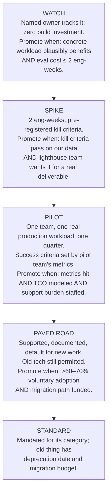

# Module 14 — Technology Bets: Adopting the Future Without Betting the Farm

## Why this module matters

Somebody in your org decides when "interesting paper" becomes "thing we run in production" — and at most companies, nobody consciously owns that decision, so it gets made by whoever is loudest, most recently conference-attended, or most bored with the current stack. The principal owns it. The cost of getting it wrong is symmetric and large: adopt too early and you burn engineer-quarters on tech that dies (ask anyone who built on a 2016-era deep-learning framework that isn't PyTorch, or containerized a 4-model estate onto Kubernetes in 2019 for "scale" that never came); adopt too late and you cede real advantage (teams that dismissed LLM code assistance in 2023 as autocomplete hype spent 2025 catching up on a productivity delta their competitors compounded). This module is a decision system for the recurring question: *now, in a year, or never?* — designed so that being wrong is cheap and being right is exploitable.

## 1. The hype evaluation protocol

Every candidate technology arrives wrapped in claims. The protocol's first job is separating **capability claims** ("this model does X") from **benchmark theater** (X measured on a leaderboard whose distribution, constraints, and incentives are not yours). Vendor benchmarks are run by the vendor, on the vendor's chosen tasks, with the vendor's tuning budget. Academic benchmarks are saturated, contaminated, or both — by 2026, treating a public-benchmark delta as evidence about *your* workload is a category error a principal doesn't make twice.

The only evidence that counts is: **reproduce the claim on your data, under your constraints, in a time-boxed spike.**

**Spike rules:**

- **Time-box hard: 2 engineer-weeks maximum.** Not "two weeks unless it's promising." The entire point of the box is that promising-looking dead ends are the expensive kind, and sunk-cost momentum is the mechanism by which a spike becomes an unplanned quarter. If two weeks genuinely can't produce signal, that itself is a finding: the technology's evaluation cost is too high for its maturity, which is a "not yet."
- **Define kill criteria before starting — in writing, with numbers.** "We kill this if: quality on our golden set is not within 2 points of current prod, or p99 exceeds 300 ms on our hardware, or the integration requires forking the library." Kill criteria written after results exist are not criteria; they are rationalizations. The pre-registration discipline from experimental science applies exactly.
- **Use your real constraints, not the demo's.** Your actual context lengths, your actual traffic mix, your actual compliance boundary (can the data even touch this vendor? — Module 12), your actual hardware. A technology that only wins on constraints you don't have has not won.
- **Assign a skeptic, not (only) an enthusiast.** The engineer who proposed the tech will find the path where it works. Pair them with someone whose job is to find where it breaks. The spike report needs both.
- **The output is a one-page decision memo,** not a demo: claim tested, setup, numbers vs kill criteria, surprises, recommendation (promote / park with a re-look date / kill), and — if promoting — what the pilot must prove that the spike couldn't.

A useful calibration: a healthy 300-engineer ML org runs maybe 8–12 spikes a year and promotes 2–3. If everything promotes, your kill criteria are decorative. If nothing does, you're using spikes to perform diligence on decisions already made (usually "no").

## 2. The adoption ladder

Technologies enter production through five rungs, and the failure mode is rung-skipping — usually straight from conference talk to production commitment. Each promotion has explicit criteria; the criteria are the mechanism.

Two properties worth making explicit. First, **every rung has a legitimate parking state** — "we spiked it, it lost, re-look in 12 months" is a successful outcome, and recording it prevents the org from re-litigating (or worse, re-spiking) the same tech every time a new enthusiast joins. Second, **the ladder is also a communication device**: when a VP asks "why aren't we using X yet, [competitor] is," the answer "X is at spike; here's the memo and the pilot criteria it hasn't met" is a fundamentally different conversation than a defensive opinion. The ladder converts technology arguments into evidence arguments.

## 3. Portfolio thinking: 70/20/10

Individual bets are decided by the ladder; the *mix* of bets is a portfolio decision, and it is where the principal's 2–5 year horizon (Module 01) becomes concrete. The allocation that serves most ML orgs:

- **~70% boring, proven technology.** Postgres, PyTorch, the serving stack you already run, the orchestrator everyone knows. This is not conservatism as temperament; it is the recognition that innovation tokens are scarce (McKinley's "Choose Boring Technology" argument holds a decade on) and that every non-boring choice taxes on-call, hiring, and debugging forever after.
- **~20% strategic bets** — technologies you have real conviction on, funded through pilot and paved-road rungs, where being early compounds: e.g., committing to a unified eval harness before the org feels the pain (Module 07), or moving high-volume inference to distilled self-hosted models while competitors pay API rates (Module 05's crossover math).
- **~10% exploration** — spikes, prototypes, one engineer's 20%-time on the weird thing. Expected value comes from optionality, not hit rate; a 1-in-5 hit rate here is healthy.

Two rules make a portfolio real rather than rhetorical. **Every bet has a named owner and a review date.** An unowned bet is a hobby; an unreviewed bet is a zombie. **The portfolio is reviewed as a portfolio** — quarterly, one page per bet — because the failure modes are portfolio-level: all-boring (you're accumulating strategic debt invisibly) and all-bets (you're a research lab cosplaying as a product org). When leadership pushes to raid the 70% to fund a shiny 10% item mid-quarter, the portfolio doc is the instrument that makes the tradeoff explicit instead of silent.

## 4. The technology radar as an org artifact

The ThoughtWorks-style radar — **adopt / trial / assess / hold**, revisited quarterly — is the cheapest high-leverage artifact in this module. Not because the quadrants are profound (they map roughly onto the ladder: standard+paved-road / pilot / watch+spike / rejected-or-deprecated) but because the *artifact* does organizational work the ladder alone can't:

- It makes the org's position on every tech **discoverable** — a new team choosing a vector DB reads the radar instead of running a three-week bake-off that duplicates last quarter's.
- **Hold is the highest-value ring.** "We evaluated X, here's the memo, we're not adopting because Y" kills the same hallway debate for a year and — critically — names the evidence that would reopen it.
- The quarterly review is a forcing function for honesty: every entry gets re-justified or moved. A radar that hasn't changed in three quarters is a museum.

Keep it lightweight: a markdown table in the platform repo, one line of justification and one owner per entry, blips only for tech that at least one team could plausibly touch this year. The radar's authority comes from the spike memos behind it; a radar of unbacked opinions is just the loudest-voice problem with better formatting. Publishing it also has a subtle influence function (Module 13): teams consult a legible, evidence-backed position voluntarily, which is cheaper than enforcing one.

## 5. Reading research: signal vs noise

Part of the job is triaging the firehose — arXiv alone runs hundreds of ML papers a day — into the handful worth an org's attention. The base rate to internalize: **paper → usable-in-production lag has historically been 2–5 years** (transformers: 2017 paper, ~2019–20 production NLP ubiquity; diffusion: 2015/2020 papers, 2022–23 products), though the LLM era has compressed the tail of that distribution for capabilities that ship as API flags. You are almost never punished for waiting one replication cycle; you are routinely punished for building on a result that didn't survive one.

Signals that a result is real and nearing usable, in rough order of strength:

1. **Production reports from companies at your scale and constraints.** The strongest signal that exists. An engineering-blog post with numbers, or a hallway conversation at a practitioner conference, outweighs the paper itself.
2. **Independent replications** — not the authors' repo, but someone else getting the claimed result on different data.
3. **Code released, and the repo has issues filed by strangers who got it working.** Released-but-unrunnable code is a negative signal wearing a positive costume.
4. **The result survives its own ablations** — if the gain vanishes when a reviewer varies one hyperparameter, it will vanish on your data too.
5. **Adjacent labs are building on it** rather than merely citing it.

Noise markers, correspondingly: results only on the authors' benchmark; "we will release code" (the future tense is load-bearing); improvements within noise of a tuned baseline; demos with cherry-picked inputs; and any claim whose economics are never mentioned — a technique that 10×'s quality at 100× inference cost is a niche tool being marketed as a revolution. Your reading system should reflect the hierarchy: skim abstracts weekly (or delegate to a reading group with a one-paragraph-per-paper rule), but spend real attention on engineering blogs, replication threads, and what your best engineers report from spikes.

## 6. Case discipline: the questions that would have saved them

Post-mortems of famous over-adoptions are cheap tuition. Each of these reduces to a question that takes one meeting to ask:

**Framework churn (2015–2019).** Orgs rewrote pipelines Theano→TF1→TF2/PyTorch, some twice, burning quarters on migrations that delivered zero user-visible value. The question that saves you: *"What does this migration deliver that our users or our velocity measurably need — and what is the full cost including the deprecation of everything built on the old thing?"* (Section 7's point: they priced the adoption, never the churn.) The org that wrapped framework-touching code behind its own thin interfaces migrated in weeks; the org with framework calls in 400 files did not.

**Premature Kubernetes-for-everything (~2017–2021).** Companies with four models and two services adopted k8s because Google-scale companies had; they bought Google-scale operational complexity — a full-time platform team's worth — without Google-scale problems. The question: *"Do we have the problem this tool exists to solve, at the scale where the tool's overhead pays back — and can we name the threshold at which we would?"* "We'll grow into it" is a forecast, and forecasts get review dates, not blank checks.

**The feature store before features (2020–2023).** Orgs stood up feature-store deployments — some six-figure vendor contracts, some year-long builds — for model estates with a dozen features and one team, because feature stores were what mature ML orgs had. Cause and effect reversed: mature orgs built feature stores because *dozens of teams were re-deriving the same features with skew bugs* (Module 03's build-order point). The question: *"Is this infrastructure solving a pain we have documented, or a pain we expect to deserve?"* Adopting the artifacts of maturity does not confer the maturity.

The common root: all three adopted on **identity** ("serious orgs use X") rather than **diagnosis** ("we have problem Y, X is the cheapest fix"). The ladder blocks this mechanically — none of these survive an honestly-run spike-to-pilot promotion, because the pilot has to name the workload that benefits.

## 7. Every adoption is a future deprecation — price it in

The TCO of adopting a technology (Module 09 has the full discipline) systematically omits its largest deferred line item: **you will one day migrate off it, and that migration costs more than the adoption did.** The stack you adopt in 2026 is the legacy system of 2031, with five years of integrations, workarounds, and Hyrum's-law dependencies accreted onto every surface you exposed.

Practical implications at decision time:

- **Ask "what is the exit cost?" in the adoption RFC itself.** Data exportable in open formats? APIs wrapped behind your own interface layer, or called directly from 200 files? Vendor lock-in priced as a risk with a dollar range, not a shrug? A vendor whose answer to "how do we leave?" is bad is quoting you a hidden fee.
- **Prefer technologies with narrow waists.** Adopting via a standard interface (ONNX for model interchange, OpenTelemetry for traces, S3-compatible storage, an OpenAI-compatible serving API) caps exit cost structurally: swap the implementation, keep the interface. Where no standard exists, *your own thin wrapper is the standard* — the framework-churn survivors' trick, worth its ongoing tax for any dependency you'd struggle to replace in a quarter.
- **Depth-of-integration is a dial you control.** A vendor eval tool used via export/import is a two-week exit; the same tool woven into CI, dashboards, and every team's workflow is a two-quarter exit. Integrate deeply only after the tech reaches paved-road confidence.
- **Budget the deprecation when you budget the adoption.** If the org cannot afford to *ever* migrate off X, it cannot afford X — it can only afford to become X's hostage. Write the eventual-exit estimate in the adoption memo; future-you will hold current-you accountable.

## 8. Sunsetting gracefully

Killing technologies is the half of the bet lifecycle nobody practices, and orgs that can't kill things accumulate stacks like sediment (Module 02's five-serving-stacks diagnosis is always, archaeologically, a series of unkilled bets). Two disciplines:

**A deprecation policy that is boringly procedural.** Announce with ≥2 quarters' notice for anything with real dependents; publish the migration path *and its funding* in the same doc (an unfunded deprecation is a tax on every dependent team, and they will correctly ignore it); freeze the old thing (security fixes only — every feature added to a deprecated system extends its life and its faction); track migration burn-down publicly; and hold the date, because the org learns from the first slipped deprecation that all deprecation dates are fiction.

**The courage to kill your own past bet.** The hardest deprecation is the one where the system's author is you — the 2024 bet that was right in 2024 and is wrong now. This is where Module 13's disagree-and-commit honesty runs in reverse: state publicly that the context changed, what you learned, and why the replacement wins on today's evidence. A principal who kills their own system on the merits buys more credibility than three successful launches; a principal who defends their legacy system against the evidence teaches the whole org that bets here are identity, and every future radar review becomes politics. The Amazon PE tenets phrase the underlying disposition well: *strong convictions, weakly held* — argue hard for the bet, and update in public the moment the evidence turns.

## You can now

- Design a time-boxed spike with pre-registered kill criteria — quality, latency, cost, and security written before results exist — so that a promising-but-failed outcome is a documented finding rather than a sunk-cost trap.
- Advance or park a technology through the five-rung adoption ladder (watch → spike → pilot → paved road → standard) using its explicit promotion criteria, and record a hold decision with the measurable evidence threshold that would reopen it.
- Build and defend a 70/20/10 technology portfolio — naming each bet's owner, review date, and exit cost at adoption time — and push back when leadership pressures you to raid the boring 70% for a shiny 10% item mid-quarter.
- Evaluate a paper or production claim by applying the signal hierarchy (production report from a company at your scale > independent replication > released and running code > ablation stability > benchmark delta) rather than treating leaderboard numbers as evidence about your workload.
- Kill your own past bet on the merits in public, update the radar with a numeric re-look trigger, and treat the credibility gained from doing so as a portfolio asset that earns trust for the next bet.

## Worked example — two bets through the protocol in the same quarter

**Setup.** Mid-2026. You are the principal for ML platform at a 300-engineer company (~40 MLEs). Two proposals arrive the same planning cycle:

- **Bet A:** "Adopt agentic coding tooling (Claude-Code-class agents with repo and CI access) as standard tooling for the 12-engineer ML platform team." Sponsor: platform EM, after two engineers' informal use.
- **Bet B (speculative):** "Replace our RAG stack — embeddings, vector DB, rerankers, chunking pipelines, ~1.5 FTE of ongoing maintenance — with long-context models: stuff the whole corpus in the prompt." Sponsor: a staff engineer, after a vendor demo of a 2M-token context window.

Both get the protocol. Neither gets a debate-by-vibes meeting.

**Bet A — spike design.** Owner: one platform senior (enthusiast) + one skeptic. Time-box: 2 engineer-weeks. Design: take the last 20 *completed* platform PRs (known ground truth: real review comments, real defect history), re-implement 10 of them agent-assisted and compare against the 10 historically similar ones as baseline; plus one week of live use on current sprint tickets, every agent-authored PR labeled for review scrutiny.

Pre-registered kill criteria: **(K1)** cycle time (ticket-start → merged) improves <15% → kill; **(K2)** defects or review-rework on agent-assisted PRs exceed baseline by >20% → kill; **(K3)** any incident of the agent exfiltrating secrets/config beyond sandbox → kill immediately, regardless of productivity; **(K4)** all-in cost (tokens + seats) >$400/engineer-month without K1 clearing 30% → kill on economics.

Spike results: cycle time −31% on migration/boilerplate/test-heavy tickets, −4% (noise) on novel-design tickets; rework rate +6% (within K2); no K3 events under the sandbox config, though the skeptic's report flags that the sandbox config *is* the control and must be owned like production infra; cost ≈ $210/engineer-month against ~$14k loaded — an ROI question that answers itself if K1 holds at pilot scale.

**Decision: promote to pilot.** One quarter, the platform team only, three conditions carried from the skeptic's report: sandbox/permissions config is owned and reviewed as production infra; agent-authored PRs stay labeled (so the rework metric stays measurable); pilot success = cycle-time gain ≥20% on the *full* ticket mix with rework within +10%. Radar: **trial**, owner named, review at quarter-end. Explicitly *not* promoted org-wide — the spike's evidence is about platform-shaped work; product teams' mix differs, and rung-skipping is how this module's failure cases started.

**Bet B — spike design.** Owner: the sponsoring staff engineer + a skeptic from the copilot team (they own the RAG stack's pain *and* its function). Time-box: 2 engineer-weeks. Design: replay 500 queries from the production RAG eval set (Module 07's golden sets, already labeled) against three configurations — current RAG stack (baseline), full-corpus long-context, and hybrid (coarse retrieval → 200k-token context).

Pre-registered kill criteria: **(K1)** answer quality must beat RAG by ≥3 points on the golden set to justify any migration (parity is not a reason to migrate a working system); **(K2)** p95 latency ≤ 2× RAG baseline (currently 1.8 s); **(K3)** cost/query ≤ 2× RAG baseline (currently ≈$0.011); **(K4)** corpus freshness: updates must be reflected within the same hour, as today.

Spike results, with the arithmetic that decides it: the corpus is 1.2M tokens and growing ~15%/quarter. Full-context at $2.50/1M input tokens ≈ **$3.00/query** vs $0.011 — 270× over K3 before output tokens; prefix caching helps only until any document changes, and the corpus changes hourly (K4 interacts fatally with cache economics). p95 came in at 9–14 s (K2 fail). Quality: +2 points overall (below K1), *but* the per-slice analysis — the spike's genuinely new information — shows +9 points on multi-hop questions where retrieval misses supporting passages. The hybrid configuration: +4 quality, 2.1× cost, 1.9× latency — near the K2/K3 boundary on the hardest 15% of traffic.

**Decision: hold — with a dated re-look and a salvaged insight.** Full replacement fails three of four criteria on arithmetic no model upgrade fixes soon (the cost gap is ~two orders of magnitude, and input-token prices have been falling ~2–4×/year, not 100×). Radar: **hold**, justification linked to the spike memo, re-look trigger written as numbers: "revisit if input cost <$0.10/1M *or* cache economics survive document churn *or* our corpus growth stops." The salvage: the hybrid's multi-hop result becomes a *new, narrow* watch-rung item — "long-context as the escalation tier of a cascade for multi-hop queries" — a 90/10 bet instead of a farm bet. The staff engineer writes the hold memo themselves, which is Module 13's mentoring point in miniature: the bet failed; the bettor's stock rose, because the org watched them kill their own proposal on evidence.

**The portfolio view.** One quarter, ~4 engineer-weeks of spike investment, two loud debates converted into evidence: one trial with conditions, one hold with a numeric reopening trigger, one new exploration item — and two memos that will still be answering "why aren't we..." questions a year from now. That is the protocol working: not picking winners by argument, but making the org's disagreements cheap to resolve.

## Exercise

**The scenario.** You are the new principal at "Lumafleet," a 250-engineer logistics-tech company: 25 MLEs across 5 teams (ETA prediction, dynamic pricing, document AI for customs paperwork, a support copilot, route optimization). Current estate: PyTorch training on a small owned A100 cluster (utilization ~45%), SageMaker serving for classic models, one team self-hosting a 8B model on vLLM, OpenAI API for the copilot, Airflow, Postgres + S3, no feature store, evals are per-team and ad hoc. Engineering leadership is simultaneously pushing "we should be agent-first" and "cut infra spend 20%."

**Deliverable.** A one-page technology radar plus one spike design:

1. **Place these 12 technologies** in adopt / trial / assess / hold *for Lumafleet specifically*, with 1–2 sentences of justification each that reference Lumafleet's actual situation (team size, workloads, the cost mandate): (1) agentic coding tools for MLEs; (2) a managed feature store; (3) long-context-instead-of-RAG for the copilot; (4) a vendor LLM-eval/observability platform; (5) fine-tuning + self-hosting small models for document AI; (6) Kubernetes for all ML serving; (7) an internal GPU scheduler/quota system; (8) LLM-as-judge eval harness (build); (9) a vector database as a new platform component; (10) speculative decoding / inference-optimization stack for the vLLM deployment; (11) multi-agent orchestration frameworks for the copilot; (12) a real-time streaming feature pipeline (Kafka/Flink) for dynamic pricing.
2. **Pick exactly one** assess-ring item and write its spike design: owner + skeptic, the claim being tested, the 2-week plan, and 3–4 pre-registered kill criteria with numbers.

**You're done when:**

- Every placement's justification names a Lumafleet fact (a team, a workload, a cost, the 20% mandate) — no placement justified by industry fashion alone.
- At least two items are in **hold** with the evidence that would reopen them stated as a measurable trigger.
- At least one placement explicitly resists a leadership push (agent-first or cost-cutting) with reasoning you could defend to that leader in their language (Module 13, Section 5).
- Your spike's kill criteria are numeric, pre-registered, and include at least one *non-quality* criterion (cost, latency, ops burden, or security).
- The radar fits on one page; the spike design on half a page. Length is not rigor.

**Self-check questions:**

1. What does your 70/20/10 split look like across the 12 placements — and if it's 40/30/30, what did the cost mandate think of that?
2. For your spike: if the enthusiast and the skeptic disagree about whether a kill criterion fired, is the criterion written precisely enough that the memo settles it?
3. Which of your adopt/trial placements carries the largest hidden exit cost, and where did you price it?
4. Which placement would you personally most enjoy being wrong about — and did that leak into where you put it?
5. A year from now, which two radar entries are most likely to have moved rings, and what evidence will have moved them?
