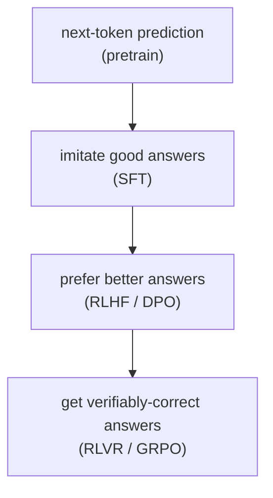

# Large Language Models

This is the core chapter. It assumes the foundations. Structure: (1) what an LLM *is* as a trained object, (2) the modern architectural variants you'll see in every model card, (3) pretraining + scaling laws + data, (4) post-training — SFT, RLHF, DPO, and the RLVR/GRPO reasoning revolution, (5) reasoning models and test-time compute, (6) decoding, (7) long context.

---

## 1. What an LLM actually is

A large language model is a decoder-only transformer (from the foundations) trained to predict the next token, scaled to billions of parameters on trillions of tokens. That's the whole definition. The "intelligence" is an emergent consequence of being very good at next-token prediction over a huge, diverse corpus.

Three properties to hold in mind:
- **It's a probability distribution.** Given a prefix, it outputs `P(next token | all previous tokens)`. Generation = repeatedly sample/pick a token, append, repeat (autoregressive).
- **It's stateless across calls.** No memory between separate generations except what's in the context window. "Memory" in agents and RAG is engineered on top.
- **The weights are frozen at inference.** All "learning" within a conversation is in-context (the model conditions on the prompt), not weight updates. This is why prompting, RAG, and context engineering matter so much.

The lifecycle: **pretraining** (learn language/knowledge from raw text via next-token loss) → **post-training** (SFT + preference/RL to make it follow instructions, be helpful, reason) → **inference** (decoding + serving, covered in the inference chapter).

---

## 2. The decoder-only skeleton (recap) and where models differ

From the foundations: embed → N × [norm → attention → residual; norm → FFN → residual] → final norm → LM head. Every modern model is this, and differs only in:
1. **Attention variant** (how Q/K/V are shaped and cached) — §3.1
2. **FFN variant** (dense vs Mixture-of-Experts) — §3.2
3. **Sequence-mixing variant** (full attention vs linear attention / SSM hybrids) — §3.3
4. Normalization/activation/positional details (the normalization and positional-encoding material from the foundations) — minor knobs

Read any model card or architecture-comparison paper through this lens and it decomposes instantly.

---

## 3. Modern architectural variants (the heart of "reading model cards")

### 3.1 Attention variants — the KV-cache problem

During generation, you cache the Keys and Values of all past tokens (the **KV cache**, detailed in the inference chapter) so you don't recompute them each step. The KV cache is the dominant memory cost at inference and scales with `(layers × heads × head_dim × seq_len × 2)`. Shrinking it is the motivation behind the attention-variant zoo:

- **MHA (Multi-Head Attention):** the original. `h` query heads, `h` key heads, `h` value heads. Best quality, biggest KV cache.
- **MQA (Multi-Query Attention):** `h` query heads but **1** shared K head and **1** shared V head. Slashes KV cache by ~`h×`. Some quality loss. (PaLM, early efficiency work.)
- **GQA (Grouped-Query Attention):** the **standard compromise** today. `h` query heads grouped to share `g` KV heads (e.g. 32 query / 8 KV). Tunable between MHA (`g=h`) and MQA (`g=1`). Llama 2/3, Qwen, Mistral. When you see "32 query heads, 8 KV heads," that's GQA with 4 query heads per KV head.
- **MLA (Multi-head Latent Attention):** DeepSeek's innovation (V2/V3). Instead of caching full K and V, **compress them into a low-rank latent vector** and cache *that*; reconstruct K/V on the fly. Dramatically smaller KV cache than even GQA while keeping near-MHA quality. The decompression is fused with RoPE handling (a "decoupled RoPE" trick because you can't naively rotate a compressed latent). When a paper mentions MLA, the point is "MHA-level quality at a fraction of the KV memory."

Mental model: MHA → MQA → GQA → MLA is a ladder of *KV-cache-vs-quality* tradeoffs. Almost every flagship since 2024 sits at GQA or MLA.

### 3.2 FFN variants — Mixture of Experts (MoE)

Dense models run *every* parameter for *every* token. MoE decouples **total parameters** from **compute per token**.

- Replace the single FFN with **`E` expert FFNs** plus a small **router** (gating network).
- For each token, the router scores the experts and sends the token to only the **top-k** (commonly top-2, sometimes top-8). Only those experts run.
- So a model can have, say, 235B *total* params but activate only ~22B per token (e.g. Qwen3-235B-A22B; "A22B" = 22B active). DeepSeek-V3: 671B total, ~37B active. Kimi K2: similar, more experts.

Why it works: capacity (knowledge storage) scales with total params; cost scales with active params. You get a big model's quality at a smaller model's inference compute.

Key MoE concepts you'll meet:
- **Routing / gating:** the learned function that picks experts. Usually a linear layer + softmax + top-k.
- **Load balancing:** without pressure, the router collapses to a few favorite experts. An **auxiliary load-balancing loss** (or, in DeepSeek-V3, an *auxiliary-loss-free* bias-adjustment scheme) spreads tokens across experts. This is a recurring topic in MoE papers.
- **Shared experts:** a few experts that *every* token always uses (capturing common patterns), alongside the routed ones. DeepSeek, Qwen.
- **Fine-grained experts:** many small experts instead of few large ones — better specialization, but routing cost grows (an active research area).
- **Expert parallelism:** experts live on different GPUs; tokens are routed across the network. A serving/training-systems concern.

Tradeoff: MoE is memory-hungry (must hold *all* experts in VRAM) and trickier to train and serve, but compute-efficient. The dense-vs-MoE split (e.g. Qwen3 ships both) is a deployment-target decision.

### 3.3 Beyond attention — linear attention, SSMs, and hybrids (the 2025–2026 shift)

The `O(n²)` attention cost (from the foundations) drove a search for **sub-quadratic sequence mixers**. This moved from fringe to mainstream in 2025.

- **State Space Models (SSMs) / Mamba:** model the sequence like a continuous linear dynamical system with a *fixed-size hidden state* that gets updated token-by-token. Cost is **O(n)** in time and **O(1)** in state size per step — no growing KV cache. Mamba's key trick is making the state-update *input-dependent* (selective), recovering much of attention's content-routing ability. Great at long sequences, weaker at exact content-based retrieval ("what was that specific token 10k ago").
- **Linear attention:** rewrite `softmax(QKᵀ)V` with a kernel feature map so you can compute it as a running sum (associativity), turning `O(n²)` into `O(n)`. Variants: Lightning Attention (MiniMax-M1), Gated DeltaNet, Kimi Delta Attention. They maintain a small "fast-weight" memory matrix updated via a delta rule, with learned gates controlling how fast old memory decays.
- **The hybrid pattern (now the winning recipe):** *don't* remove attention entirely. Interleave mostly-cheap linear/SSM blocks with a few full-attention blocks (a common ratio is 3:1 — three linear blocks per one attention block). The cheap blocks carry the long-context load with flat memory; the periodic full-attention blocks restore exact retrieval that linear blocks are bad at. **Qwen3-Next / Qwen3.5** (Gated DeltaNet + gated attention) and **Kimi Linear** (Kimi Delta Attention + gated MLA) are the prominent flagships proving this works at scale. This is one of the most important recent architectural trends — when you see "hybrid attention" or "3:1 pattern," this is it.

Why you care: a growing share of new models and long-context papers are about these mixers. The framing to keep: *full attention = exact but quadratic; linear/SSM = cheap but lossy at retrieval; hybrids = have it both ways.*

### 3.4 Multi-token prediction (MTP)

Standard next-token training generates exactly one training target per forward pass. **Multi-token prediction (MTP)** adds extra transformer heads that predict token `t+2`, `t+3`, etc., trained jointly with the main next-token objective — more training signal from the same data.

The **mechanism**: after the main model stream produces a hidden state for position `t`, a lightweight transformer head takes that hidden state (conditioned on the main stream, not independent of it) and predicts the token two steps ahead. In the **cascaded/sequential design** that **DeepSeek-V3 (Dec 2024)** introduced, each additional head is conditioned on the *output* of the previous head, forming a chain: head₁ predicts `t+2`, head₂ takes head₁'s output and predicts `t+3`. This cascaded design is strictly better than the earlier **parallel/independent design** (Meta's research) where each head predicts independently of the others — parallel heads cannot leverage the structure that "knowing `t+2` helps predict `t+3`." DeepSeek-V3's approach has since been adopted by **Qwen3, MiMo, GLM, and LongCat**.

**Why it works:**
- **Denser training signal / data efficiency:** each token participates in predicting multiple future targets instead of one, effectively multiplying the useful gradient signal per token.
- **+12–17% on code generation** benchmarks, because code has especially predictable structure (matching braces, boilerplate, function signatures) that multi-step lookahead captures better than single-step prediction.
- **Loss weighting:** the extra heads typically receive a downweighted loss coefficient (e.g. 0.1–0.3× the main loss) to prevent them from distorting the main language modeling objective.

**The inference bonus — self-speculation:** the MTP head, already trained to predict `t+2`, is a natural **draft model** for speculative decoding (covered in the inference chapter) — you get a free draft model with no extra architecture or training cost. The MTP head proposes ahead; the main model verifies in one parallel pass. Because the MTP head shares the main model's representations (not a separate smaller model), alignment is near-perfect and acceptance rates are high. This "self-speculation" approach collapses draft-model maintenance and matches or exceeds external draft model setups.

Reading takeaway: when a paper says "MTP" or "multi-token prediction heads," it's buying both *training efficiency* and *free speculative decoding at inference* in one mechanism. The cascaded-vs-parallel distinction is the load-bearing design choice.

### 3.5 DeepSeek V4-Pro architecture (Apr 2026)

After DeepSeek-V3 set the open reference design, **DeepSeek V4-Pro** (Apr 2026) is the current benchmark — 1.6T total parameters, 49B active, trained on Huawei Ascend (the first high-performance open model trained outside CUDA). Three structural innovations you won't find in prior work:

**mHC (manifold-constrained hyper-connections).** Hyper-connections modify how a layer's output residual is combined with the stream — essentially a learned, dynamic alternative to the fixed `x + f(x)` residual. The problem: naive hyper-connections cause *residual signal amplification*, where the effective scale of the residual stream grows by a factor of ~3,000× during training, causing instability and gradient pathologies. DeepSeek V4-Pro's fix is **doubly-stochastic projection via Sinkhorn-Knopp normalization**: the hyper-connection matrix is constrained to lie on the Sinkhorn manifold (rows and columns each sum to 1), forcing it to redistribute signal rather than amplify it. This brings amplification from ~3,000× down to ~1.6× — close to the scale-neutral identity residual — making deep MoE training stable without extra loss terms or gradient clipping.

**Engram conditional memory.** Separates two computationally distinct operations that transformer FFNs currently conflate: **static knowledge retrieval** (looking up factual associations baked into weights — an operation whose cost should be O(1), not proportional to sequence length or reasoning depth) from **dynamic reasoning computation** (forming new conclusions by combining retrieved facts, which legitimately scales with reasoning). Engram implements the static lookup via key-value memory banks accessed in O(1) per query, reserving the full transformer depth for dynamic computation. You care because this is a principled answer to "why is the FFN doing two different jobs, and should it?"

**Hybrid CSA+HCA attention.** **Compressed Sparse Attention (CSA)** covers most positions: attends only over a compressed, strided selection of past KV entries rather than all of them. **Head-wise Cross Attention (HCA)** — full-context attention — fires on a small fraction of attention heads per layer where CSA's approximation would cost quality. The result: up to **−73% inference FLOPs** for attention vs full MHA, while retaining the quality of full attention where it matters. Unlike the linear-attention hybrid (§3.3) which trades *architecture families*, CSA+HCA operates within the attention family — familiar training dynamics, no gated-state machinery, just an efficient sparsity pattern.

Mental model: V4-Pro is the "new open reference design" for large MoE — what V3 was in late 2024 but with stabilized deep residuals, a cleaner compute-knowledge separation, and aggressive attention sparsity at scale.

Also now real, not niche: **diffusion language models** (generate tokens by iterative denoising instead of left-to-right). **LLaDA** (2025) reached autoregressive parity at 8B params; **Gemini Diffusion** (Google I/O 2025) shipped in production at ~1,479 tok/s — roughly 5× faster generation than comparable AR models, though still weaker on hard reasoning. **Block diffusion** (BD3-LM) bridges the two: AR over blocks, diffusion within a block. Treat this as a genuine third decoding paradigm you'll see in papers, with the tradeoff *parallel generation speed vs left-to-right reasoning quality*.

---

## 4. Pretraining, scaling laws, and data

### Pretraining
Train the model to minimize next-token cross-entropy loss over a massive corpus. This is the expensive part (the multi-million-dollar runs). Output: a **base model** — fluent, knowledgeable, but not instruction-following (it just continues text; ask it a question and it might continue with *more questions*).

Mechanics that show up in papers:
- **Loss:** cross-entropy / negative log-likelihood per token. Reported as loss or as **perplexity** (`exp(loss)`).
- **Batching:** huge batches (millions of tokens), measured in tokens not examples.
- **Learning rate schedule:** warmup then decay (cosine or, increasingly, WSD — warmup-stable-decay).
- **Parallelism (systems):** data parallel, tensor parallel (split a matmul across GPUs), pipeline parallel (split layers across GPUs), expert parallel (MoE), and ZeRO/FSDP (shard optimizer state). You don't need to implement these, but recognize the terms — they define what hardware a run needs.
- **Precision:** bf16 weights/activations, fp32 master weights, increasingly fp8 for parts of the forward/backward (DeepSeek-V3 trained partly in fp8). Mixed precision is universal.

### Scaling laws
*Kaplan et al. 2020* and especially *Chinchilla (Hoffmann et al. 2022)* established that loss falls **predictably** as a power law in model size `N`, data `D`, and compute `C`. The Chinchilla finding: for a fixed compute budget, **most pre-2022 models were too big and undertrained** — the compute-optimal ratio is roughly **~20 tokens per parameter**. This reframed the field toward smaller-but-longer-trained models.

Nuance you should carry: Chinchilla optimizes *training* compute. In practice you also care about *inference* compute (you serve the model millions of times), so it's often rational to "overtrain" a smaller model far past Chinchilla-optimal (Llama 3 8B on 15T tokens is ~1800 tokens/param) to get a cheap-to-serve model. Scaling-law papers now distinguish train-optimal vs inference-aware-optimal. When you read "we trained well past Chinchilla," this is why.

### Data
Increasingly the *real* differentiator (architectures have largely converged). Key topics:
- **Sources:** web crawl (Common Crawl → filtered sets like FineWeb), code (GitHub), books, papers, curated/synthetic.
- **Filtering & dedup:** quality classifiers, dedup (near-duplicate removal materially helps), removing benchmarks to avoid contamination.
- **Mixture / curriculum:** ratios of code/web/math, and **data curriculum** (e.g. upweight high-quality / math / code late in training).
- **Synthetic data:** model-generated data (distillation, textbook-style data à la Phi). Now a major lever. (For VLMs and document models, synthetic data has known failure modes — geometric/spatial distortions — that don't transfer to production; the cleanest fixes use real or physically-faithful renders.)
- **Multi-epoch:** as high-quality tokens get scarce, repeating data (a few epochs) is studied carefully.

---

## 5. Post-training — turning a base model into an assistant

A base model predicts text; an *assistant* follows instructions, is helpful/harmless, and reasons. Post-training is now where most of the perceived quality gain happens. The pipeline (with variations):

### 5.1 SFT (Supervised Fine-Tuning / Instruction Tuning)
Fine-tune the base model on `(instruction, ideal response)` pairs with the standard next-token loss, but only on the response tokens. Teaches the *format* of being a helpful assistant and basic instruction-following. Quality of the SFT data matters enormously (the "less is more" finding — a few thousand excellent examples can beat a million mediocre ones).

**PEFT (Parameter-Efficient Fine-Tuning):** you rarely full-fine-tune. **LoRA** freezes the base weights and learns small low-rank update matrices `ΔW = B·A` (rank `r`, e.g. 8–64) added to chosen layers — trains <1% of params, tiny checkpoints, swappable adapters. **QLoRA** does LoRA on top of a 4-bit-quantized frozen base, letting you fine-tune large models on a single GPU. Recognize: LoRA = cheap adapters; QLoRA = cheap adapters on a quantized base. (Per-family/per-task LoRA adapters are a common production pattern.)

### 5.2 Preference optimization — aligning to "what humans prefer"
SFT teaches *a* good answer; preference methods teach *which of two answers is better*, capturing nuance SFT can't.

- **RLHF (Reinforcement Learning from Human Feedback)** — the original (InstructGPT/ChatGPT) recipe, three stages:
  1. Collect human preference pairs (response A vs B, which is better).
  2. Train a **reward model (RM)** to predict that preference (a scalar "how good is this response").
  3. **RL-optimize the policy** (the LLM) to maximize the RM's reward, using **PPO**, with a **KL penalty** to a reference (SFT) model so it doesn't drift into reward-hacked gibberish.
  Powerful but complex: four models in memory (policy, reference, reward, critic/value), unstable, expensive.

- **DPO (Direct Preference Optimization)** — the simplification that took over. *Mathematically reparameterizes* the RLHF objective so you can optimize directly on preference pairs with a **simple classification-style loss** — **no separate reward model, no RL loop, no sampling**. Just `(prompt, chosen, rejected)` triples and a loss that raises the likelihood of `chosen` over `rejected` relative to the reference model. Far simpler and stable; now the default for preference alignment. Variants: IPO, KTO (works with non-paired binary feedback), ORPO, SimPO.

Carry this distinction: **RLHF = train a reward model then RL against it; DPO = skip the reward model, optimize preferences directly.**

### 5.3 RLVR and GRPO — the reasoning revolution (post-DeepSeek-R1, 2025)
The biggest recent shift. Instead of *learned* rewards from human preference, use **verifiable rewards**: for math/code, you can *check* if the answer is right (run the test, match the answer). This is **RLVR (RL with Verifiable Rewards)**.

- **The reward is rule-based and binary-ish:** correct/incorrect (+ a format reward for putting reasoning in `<think>` tags). No reward model needed → no reward-hacking of a learned RM, much cheaper.
- **GRPO (Group Relative Policy Optimization)** is the RL algorithm DeepSeek used. It's PPO **without a value/critic network**: for each prompt, sample a *group* of `G` responses, compute each one's reward, and use the **group's mean as the baseline** (advantage = reward − group mean, normalized by group std). This removes the separate critic model PPO needs → big memory/compute savings and stability.
- **The headline result (DeepSeek-R1-Zero):** applying GRPO+RLVR to a base model — **with no SFT at all** — spontaneously produced long chain-of-thought, self-verification, backtracking, and "aha moments." Reasoning *emerged* from pure RL on verifiable rewards. **DeepSeek-R1** (the usable model) added a small cold-start SFT for readability, then alternated RLVR and RLHF.
- **Distillation:** R1's reasoning traces were used to SFT smaller models (Qwen/Llama), transferring reasoning *without* RL — a cheap way to get reasoning into small models.

Why this matters for reading papers: in 2025–2026, "we post-train with GRPO and verifiable rewards" is everywhere. Variants you'll see: **Dr. GRPO** (fixes length/difficulty biases in the normalization), **DAPO**, **process reward models (PRMs)** that score *each reasoning step* rather than only the final answer, and turn-level credit assignment for multi-turn agents. Open replications: Open-Reasoner-Zero, TÜLU's RLVR, etc.

### 5.3a GRPO failure modes and the fixes

GRPO's simplicity is its strength, but it has real failure modes that papers in 2025 identified and patched:

**DAPO's four surgical fixes (Distributed Advantage Policy Optimization):**
- **Clip-higher:** GRPO clips the probability ratio at `[1−ε, 1+ε]`. If `ε` is too small, low-probability but correct actions get clipped before they can grow — the model stops exploring. DAPO uses an asymmetric clip where the upper bound is larger than the lower, keeping exploration alive for novel correct paths.
- **Dynamic sampling:** if *all* responses in a group are correct (reward 1) or all wrong (reward 0), the group advantage is zero and the gradient vanishes — those prompts waste a training step. DAPO discards such groups and resamples, ensuring every update has a real learning signal.
- **Token-level policy-gradient loss:** GRPO averages the policy loss over responses, which weights short and long responses equally regardless of the number of gradient-contributing tokens. Token-level loss weights each step by its actual token count, preventing short correct answers from being diluted by adjacent long wrong ones.
- **Length-aware penalty:** unconstrained GRPO tends to reward verbosity (longer reasoning = more chances to produce a correct final answer). DAPO applies an explicit penalty that decays reward for responses exceeding a target length, recovering both quality and token efficiency.

**Dr. GRPO's two bias removals:** GRPO normalizes advantages by the group's standard deviation (std normalization) and averages over all response tokens including padding (length normalization). Dr. GRPO proves these introduce *systematic biases*: std normalization over-weights hard prompts where variance is high; length normalization over-weights short responses. Removing both biases produces a cleaner objective and more stable training without replacing GRPO wholesale.

**The spurious-reward finding — the deepest result:** when researchers applied RLVR with *random rewards* (not verifiable correctness — literally noise) to Qwen base models, performance *still improved* on reasoning benchmarks. The explanation: GRPO's clipping mechanism creates an update asymmetry that disproportionately amplifies gradients aligned with the base model's pretraining priors — correct-looking token sequences already have higher base probability, so even random reward signal selectively reinforces them. **GRPO partly *elicits* latent capability rather than only *teaching* new capability.** The implication is uncomfortable: some RLVR gains may reflect pre-existing base model quality more than post-training RL, and comparing RLVR methods against each other without controlling for base model strength is unreliable.

### 5.3b Process reward models and credit assignment

**ORM vs PRM — the credit assignment axis:**

An **Outcome Reward Model (ORM)** scores the final answer only: correct/incorrect, or a learned quality score. Simple to train (just label final answers), but provides no signal about *which steps in a long chain of thought were good or bad*. For a 50-step reasoning trace with a wrong final answer, ORM says "bad" — but 48 of the 50 steps may have been sound, and only step 23 was flawed. ORM can't express that.

A **Process Reward Model (PRM)** assigns a reward to *each reasoning step*, enabling per-step credit assignment. Better signal → better policy gradient → more targeted improvement of the reasoning process. The catch: step-level annotation is expensive — you need human (or model) labels for every intermediate step, not just final answers.

**Min-form credit assignment (NeurIPS 2025):** when you have per-step PRM scores, how do you aggregate them into a trajectory-level signal? Naive summation is **reward-hackable** — the model can accumulate large positive scores on easy early steps to "bank" reward, then fail on the hard final steps. The NeurIPS 2025 result shows that taking the **minimum** over step scores (not the sum) beats summation: a trajectory's value is bounded by its *weakest* step, which the policy is then incentivized to fix. Minimum credit assignment is harder to hack and better-aligned with "the chain is only as strong as its weakest link."

**PRIME (Process Reward via Implicit Model-level Evaluation):** trains a model to produce implicit token-level process rewards *derived entirely from outcome labels* — no step annotation required. It uses the difference between a trained-with-RLVR policy and a reference policy to infer which tokens contributed to correct vs incorrect outcomes, approximating a PRM signal without labeling individual steps. This collapses the annotation bottleneck.

**GRPO+ORM ≡ PRM-aware objective:** a result in arXiv:2509.21154 proves that GRPO with an outcome reward model is *mathematically equivalent* to a PRM-aware policy gradient objective under certain conditions. The implication: GRPO is already doing implicit per-step credit assignment through its group-relative advantage mechanism — it's not as outcome-only as it appears.

**Why per-step credit matters for long reasoning chains:** at 50+ steps, a sparse final-answer reward signal is too weak and too delayed to steer the policy toward fixing early errors. Per-step credit — whether from an explicit PRM, min-form aggregation, or implicit methods like PRIME — is the difference between "did it get the right answer" and "why, and where did it go wrong."

Reading takeaway: when you see a paper on "process supervision," map it to (a) how step labels are obtained (human / model / implicit), (b) how they're aggregated (sum / min / learned), and (c) how they feed into the RL update (direct reward / as a critic). These three choices are the whole design space.

The clean mental hierarchy of training signals:

Each layer adds a richer, more targeted signal. New "training method" papers almost always slot into one of these and tweak the signal source or the optimizer.

---

## 6. Reasoning models and test-time compute

A **reasoning model** (o1/o3, DeepSeek-R1, QwQ, Gemini "thinking," Claude with extended thinking) is one trained (usually via RLVR) to produce a long internal **chain-of-thought** before its final answer, and that spends *more tokens thinking* on harder problems.

The core idea is **test-time (inference-time) compute scaling**: instead of only scaling *training*, you scale *thinking at inference*. More reasoning tokens → better answers, a *second* scaling axis orthogonal to model size. Empirically, a smaller model that thinks longer can beat a bigger model that answers immediately, on reasoning tasks.

Ways to spend test-time compute (you'll see these as decoding/search strategies):
- **Long CoT (sequential):** just generate a long reasoning trace. What R1/o1 do internally.
- **Self-consistency:** sample many CoTs, take the majority answer.
- **Best-of-N / rejection sampling:** sample N, pick the best per a verifier/RM.
- **Search:** Tree-of-Thoughts, MCTS over reasoning steps, beam search over thoughts. Higher cost, sometimes higher ceiling.

Open questions you'll see debated: does RLVR *create* new reasoning ability or just *elicit/sharpen* what the base model already had? When should the model stop thinking ("overthinking" wastes compute and can hurt)? How to reward *process* vs *outcome*? These are live research fronts, not settled.

### 6.1 Controlling test-time compute

The theoretical framing is one thing; the practical question is *how do you control how much thinking the model does, and how much does that cost?*

**s1 (Jan 2025) — the minimal proof of concept:** fine-tune Qwen2.5-32B on just **1,000 carefully curated reasoning examples** (quality over quantity — problems chosen for difficulty and diversity, solutions verified). Then apply **budget forcing** at inference:
- To force *more* thinking: append the token "Wait" when the model tries to stop early, pushing it to reconsider.
- To force *less* thinking: hard-stop the chain-of-thought at a token budget and force the final answer.

The result: s1 **beats o1-preview** on competition math (MATH500, AIME) despite costing orders of magnitude less to train. The insight: for a base model with strong pretraining, the reasoning capability is largely latent — you don't need millions of RL steps, you need a clean signal + the ability to steer compute at inference.

**Compute-optimal adaptive allocation:** not all problems need the same compute. A simple algebra problem solved in 50 tokens doesn't benefit from 2,000 tokens of deliberation; a competition geometry problem does. **Adaptive budget allocation** — giving harder problems more thinking budget based on model confidence or estimated difficulty — gives **2–4× efficiency over fixed budgets** at the same average accuracy. The practical pattern: start with a short budget, check if the answer is confident/consistent, extend only if uncertain.

**The elicit-vs-create debate — with evidence both ways:**

*Evidence for "elicit only":* arXiv:2504.13837 (NeurIPS 2025) shows that RLVR improves **sampling efficiency** (the model reaches the correct answer in fewer samples) but **rarely exceeds the base model's pass@k frontier** — the ceiling of what the base model can produce with many samples is unchanged by RLVR. Interpretation: RLVR focuses the model's existing capability toward better single-sample behavior; it doesn't expand the frontier of what's reachable.

*Evidence for "create":* arXiv:2602.08281 shows that RLVR **can compose novel capability from atomic sub-skills** that exist in the base model separately — skills the base model cannot combine into a correct solution even at very high pass@k. RLVR, in this setting, genuinely creates a new capability by learning to orchestrate sub-skills the base model has but cannot chain. Both findings are real; the honest answer is "eliciting *and* occasionally creating, depending on whether the task requires novel composition."

Reading takeaway: "budget forcing" and "adaptive compute allocation" are the practical toolkit; the elicit-vs-create debate tells you what those tools can actually buy.

When to *use* a reasoning model: math, code, logic, multi-step planning — yes. Simple factual/creative/latency-sensitive tasks — often overkill (slower, costlier). This tradeoff is itself a design decision in agent/RAG systems.

---

## 7. Decoding — turning distributions into text

At each step the model gives `P(next token)`. How you pick from it is **decoding**, and it changes outputs a lot:

- **Greedy:** always take argmax. Deterministic, repetitive, often dull.
- **Temperature `T`:** divide logits by `T` before softmax. `T<1` sharpens (more confident/deterministic), `T>1` flattens (more random/creative). `T→0` ≈ greedy.
- **Top-k:** sample only from the `k` most likely tokens.
- **Top-p (nucleus):** sample from the smallest set of tokens whose cumulative probability ≥ `p`. Adapts to how peaked the distribution is. The common default (e.g. `p=0.9–0.95`).
- **min-p:** keep tokens above a fraction of the top token's probability — a newer, often-better adaptive cutoff.
- **Repetition / presence / frequency penalties:** discourage repeating tokens.
- **Beam search:** keep `b` candidate sequences, expand all, keep best `b`. Good for low-entropy tasks (translation), bad for open-ended (bland, repetitive). Rare for chat.
- **Constrained / structured decoding:** mask logits to force valid JSON / a grammar / a regex. How "guaranteed valid JSON" / tool-call formatting works (e.g. via finite-state machines over the vocab). Important for agents.
- **Speculative decoding** (an *acceleration*, not a sampling change) → covered in the inference chapter; it produces the *same* distribution faster.

### 7.1 Constrained decoding engines

Structured decoding works by maintaining a grammar state machine alongside the token stream and masking out any token that would produce an invalid continuation — but the naive implementation re-parses the grammar from scratch each step, which is prohibitively slow.

**XGrammar** solves this with precompiled context-free grammar automata and per-token bitmask caches — overhead is **<40µs per token**, low enough to be invisible in production. XGrammar is now the **default structured-output backend in vLLM, SGLang, and TensorRT-LLM**. When a serving framework advertises "guaranteed valid JSON" or "schema-constrained output," it is almost certainly XGrammar underneath.

**llguidance (Microsoft)** takes a different approach: a **Rust implementation of an Earley parser** that handles the full class of context-free grammars (not just regular/pushdown subsets). It underlies **OpenAI's Structured Outputs** API — the reason you can pass an arbitrary Pydantic schema and always get valid JSON back.

**XGrammar-2 (Jan 2026)** extends XGrammar to **dynamic grammars** — grammars that are not fixed at request time but constructed on-the-fly, e.g. an agent carrying 100+ tool schemas where the valid call structure depends on which tools are loaded for the current task. Static precompilation doesn't work when the grammar changes per request; XGrammar-2 handles incremental grammar updates without the per-token overhead blowing up.

You care because this is the infrastructure that makes **function calling reliable** at scale. Without constrained decoding, tool-call JSON fails ~5–15% of the time at production traffic; with it, failures approach zero. When a paper or system says "reliable tool use," constrained decoding is doing most of the heavy lifting.

Reasoning models usually run at a modest temperature; tool-calling/structured tasks often near-greedy + constraints. Knowing these knobs explains a lot of "why did the output change" and a lot of eval methodology.

---

## 8. Long context

Two separate problems, often conflated:
1. **Can the model *technically* run at length `n`?** Bounded by the `O(n²)` attention cost (compute + KV-cache memory). Addressed by FlashAttention (in the inference chapter), GQA/MLA (smaller cache), linear/SSM hybrids (flat memory, §3.3), and RoPE-extension tricks (PI/NTK/YaRN, from the foundations).
2. **Can it *use* the context well?** Even when it runs, models suffer **"lost in the middle"** — they attend well to the start and end of a long context but miss the middle. Tested by **needle-in-a-haystack** (plant a fact at a random depth, see if it's retrieved). A long *context window* ≠ good long-context *reasoning*; benchmarks like RULER and LongBench probe the gap.

Related serving optimizations (StreamingLLM/attention sinks: keep the first few tokens + a recent window; DuoAttention: full cache only for "retrieval heads") let you run effectively-unbounded streams cheaply — see the inference chapter.

This is also exactly the tension that motivates RAG: rather than stuff everything into a giant context, retrieve only what's relevant. "Long context vs RAG" is a recurring real-world design debate; the honest answer is usually *both* (retrieve to fill a large-but-finite context well).

---

## 9. Reading-an-LLM-paper checklist

- **Architecture:** which attention variant (MHA/GQA/MLA/linear/hybrid)? Dense or MoE (total vs active params)? Anything non-standard in norm/FFN/positional?
- **Training:** base or post-trained? If post-trained: SFT only? DPO? RLVR/GRPO? What's the reward signal?
- **Is it a reasoning model?** Does it scale test-time compute? How is "thinking" trained and bounded?
- **Scale & data:** params, tokens, tokens/param (vs Chinchilla ~20), data mix, synthetic data.
- **Context:** trained length, extended length, *and* how they show it actually uses it (not just runs).
- **The one-sentence contribution**, and **the tradeoff they paid.**

---

## You can now

- Decompose any modern LLM into its four axes — attention variant (MHA/MQA/GQA/MLA), FFN variant (dense vs MoE), sequence mixer (full vs linear/SSM/hybrid), and positional/norm details — and read a model card as a set of deliberate tradeoffs.
- Explain the KV-cache pressure that drives the MHA→MQA→GQA→MLA ladder, and why MoE decouples total parameters from compute-per-token.
- Place any post-training method on the signal hierarchy — SFT imitates, RLHF/DPO prefer, RLVR/GRPO verify — and explain why GRPO drops PPO's critic by using the group mean as a baseline.
- Reason about test-time compute scaling: when a smaller model that thinks longer beats a bigger one, and how budget forcing and adaptive allocation control the cost.
- Choose decoding knobs (temperature, top-p, min-p, constrained decoding) for a task, and separate "can run at length n" from "can actually use length n" in long-context claims.

## Try it

Pick a recent open model's technical report (e.g. Qwen3, DeepSeek-V3/V4, Kimi, GLM) and fill in the §9 reading checklist end to end: name its attention variant and KV-cache strategy, whether it is dense or MoE (total vs active params, tokens/param vs Chinchilla ~20), its exact post-training recipe and reward signal, whether it is a reasoning model and how "thinking" is bounded, and its trained-vs-extended context plus the evidence it actually *uses* that context. Finish with one sentence stating the paper's core contribution and the tradeoff it paid. If any axis is unclear from the report, note that as a gap — that itself is a finding.
