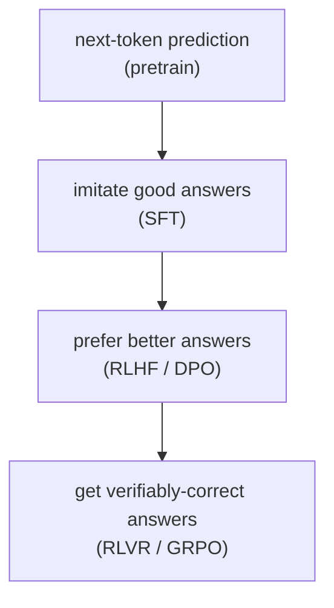

# Large Language Models — Part 2 of 3: Pretraining & Post-training

This is part 2 of the Large Language Models lesson. Part 1 covered what an LLM is and its architectural variants; here we cover how a base model is pretrained at scale, and how post-training — SFT, RLHF, DPO, and the RLVR/GRPO reasoning revolution — turns it into an assistant.

---

## 4. Pretraining, scaling laws, and data

### Pretraining
Train the model to minimize next-token cross-entropy loss over a massive corpus. This is the expensive part (the multi-million-dollar runs). Output: a **base model** — fluent, knowledgeable, but not instruction-following (it just continues text; ask it a question and it might continue with *more questions*).

Mechanics that show up in papers:
- **Loss:** cross-entropy / negative log-likelihood per token. Reported as loss or as **perplexity** (`exp(loss)`).
- **Batching:** huge batches (millions of tokens), measured in tokens not examples.
- **Learning rate schedule:** warmup then decay (cosine or, increasingly, WSD — warmup-stable-decay).
- **Parallelism (systems):** data parallel, tensor parallel (split a matmul across GPUs), pipeline parallel (split layers across GPUs), expert parallel (MoE), and ZeRO/FSDP (shard optimizer state). You don't need to implement these, but recognize the terms — they define what hardware a run needs.
- **Precision:** bf16 weights/activations, fp32 master weights, increasingly fp8 for parts of the forward/backward (DeepSeek-V3 trained partly in fp8). Mixed precision is universal.

### Scaling laws
*Kaplan et al. 2020* and especially *Chinchilla (Hoffmann et al. 2022)* established that loss falls **predictably** as a power law in model size `N`, data `D`, and compute `C`. The Chinchilla finding: for a fixed compute budget, **most pre-2022 models were too big and undertrained** — the compute-optimal ratio is roughly **~20 tokens per parameter**. This reframed the field toward smaller-but-longer-trained models.

Nuance you should carry: Chinchilla optimizes *training* compute. In practice you also care about *inference* compute (you serve the model millions of times), so it's often rational to "overtrain" a smaller model far past Chinchilla-optimal (Llama 3 8B on 15T tokens is ~1800 tokens/param) to get a cheap-to-serve model. Scaling-law papers now distinguish train-optimal vs inference-aware-optimal. When you read "we trained well past Chinchilla," this is why.

### Data
Increasingly the *real* differentiator (architectures have largely converged). Key topics:
- **Sources:** web crawl (Common Crawl → filtered sets like FineWeb), code (GitHub), books, papers, curated/synthetic.
- **Filtering & dedup:** quality classifiers, dedup (near-duplicate removal materially helps), removing benchmarks to avoid contamination.
- **Mixture / curriculum:** ratios of code/web/math, and **data curriculum** (e.g. upweight high-quality / math / code late in training).
- **Synthetic data:** model-generated data (distillation, textbook-style data à la Phi). Now a major lever. (For VLMs and document models, synthetic data has known failure modes — geometric/spatial distortions — that don't transfer to production; the cleanest fixes use real or physically-faithful renders.)
- **Multi-epoch:** as high-quality tokens get scarce, repeating data (a few epochs) is studied carefully.

---

## 5. Post-training — turning a base model into an assistant

A base model predicts text; an *assistant* follows instructions, is helpful/harmless, and reasons. Post-training is now where most of the perceived quality gain happens. The pipeline (with variations):

### 5.1 SFT (Supervised Fine-Tuning / Instruction Tuning)
Fine-tune the base model on `(instruction, ideal response)` pairs with the standard next-token loss, but only on the response tokens. Teaches the *format* of being a helpful assistant and basic instruction-following. Quality of the SFT data matters enormously (the "less is more" finding — a few thousand excellent examples can beat a million mediocre ones).

**PEFT (Parameter-Efficient Fine-Tuning):** you rarely full-fine-tune. **LoRA** freezes the base weights and learns small low-rank update matrices `ΔW = B·A` (rank `r`, e.g. 8–64) added to chosen layers — trains <1% of params, tiny checkpoints, swappable adapters. **QLoRA** does LoRA on top of a 4-bit-quantized frozen base, letting you fine-tune large models on a single GPU. Recognize: LoRA = cheap adapters; QLoRA = cheap adapters on a quantized base. (Per-family/per-task LoRA adapters are a common production pattern.)

### 5.2 Preference optimization — aligning to "what humans prefer"
SFT teaches *a* good answer; preference methods teach *which of two answers is better*, capturing nuance SFT can't.

- **RLHF (Reinforcement Learning from Human Feedback)** — the original (InstructGPT/ChatGPT) recipe, three stages:
  1. Collect human preference pairs (response A vs B, which is better).
  2. Train a **reward model (RM)** to predict that preference (a scalar "how good is this response").
  3. **RL-optimize the policy** (the LLM) to maximize the RM's reward, using **PPO**, with a **KL penalty** to a reference (SFT) model so it doesn't drift into reward-hacked gibberish.
  Powerful but complex: four models in memory (policy, reference, reward, critic/value), unstable, expensive.

- **DPO (Direct Preference Optimization)** — the simplification that took over. *Mathematically reparameterizes* the RLHF objective so you can optimize directly on preference pairs with a **simple classification-style loss** — **no separate reward model, no RL loop, no sampling**. Just `(prompt, chosen, rejected)` triples and a loss that raises the likelihood of `chosen` over `rejected` relative to the reference model. Far simpler and stable; now the default for preference alignment. Variants: IPO, KTO (works with non-paired binary feedback), ORPO, SimPO.

Carry this distinction: **RLHF = train a reward model then RL against it; DPO = skip the reward model, optimize preferences directly.**

### 5.3 RLVR and GRPO — the reasoning revolution (post-DeepSeek-R1, 2025)
The biggest recent shift. Instead of *learned* rewards from human preference, use **verifiable rewards**: for math/code, you can *check* if the answer is right (run the test, match the answer). This is **RLVR (RL with Verifiable Rewards)**.

- **The reward is rule-based and binary-ish:** correct/incorrect (+ a format reward for putting reasoning in `<think>` tags). No reward model needed → no reward-hacking of a learned RM, much cheaper.
- **GRPO (Group Relative Policy Optimization)** is the RL algorithm DeepSeek used. It's PPO **without a value/critic network**: for each prompt, sample a *group* of `G` responses, compute each one's reward, and use the **group's mean as the baseline** (advantage = reward − group mean, normalized by group std). This removes the separate critic model PPO needs → big memory/compute savings and stability.
- **The headline result (DeepSeek-R1-Zero):** applying GRPO+RLVR to a base model — **with no SFT at all** — spontaneously produced long chain-of-thought, self-verification, backtracking, and "aha moments." Reasoning *emerged* from pure RL on verifiable rewards. **DeepSeek-R1** (the usable model) added a small cold-start SFT for readability, then alternated RLVR and RLHF.
- **Distillation:** R1's reasoning traces were used to SFT smaller models (Qwen/Llama), transferring reasoning *without* RL — a cheap way to get reasoning into small models.

Why this matters for reading papers: in 2025–2026, "we post-train with GRPO and verifiable rewards" is everywhere. Variants you'll see: **Dr. GRPO** (fixes length/difficulty biases in the normalization), **DAPO**, **process reward models (PRMs)** that score *each reasoning step* rather than only the final answer, and turn-level credit assignment for multi-turn agents. Open replications: Open-Reasoner-Zero, TÜLU's RLVR, etc.

### 5.3a GRPO failure modes and the fixes

GRPO's simplicity is its strength, but it has real failure modes that papers in 2025 identified and patched:

**DAPO's four surgical fixes (Distributed Advantage Policy Optimization):**
- **Clip-higher:** GRPO clips the probability ratio at `[1−ε, 1+ε]`. If `ε` is too small, low-probability but correct actions get clipped before they can grow — the model stops exploring. DAPO uses an asymmetric clip where the upper bound is larger than the lower, keeping exploration alive for novel correct paths.
- **Dynamic sampling:** if *all* responses in a group are correct (reward 1) or all wrong (reward 0), the group advantage is zero and the gradient vanishes — those prompts waste a training step. DAPO discards such groups and resamples, ensuring every update has a real learning signal.
- **Token-level policy-gradient loss:** GRPO averages the policy loss over responses, which weights short and long responses equally regardless of the number of gradient-contributing tokens. Token-level loss weights each step by its actual token count, preventing short correct answers from being diluted by adjacent long wrong ones.
- **Length-aware penalty:** unconstrained GRPO tends to reward verbosity (longer reasoning = more chances to produce a correct final answer). DAPO applies an explicit penalty that decays reward for responses exceeding a target length, recovering both quality and token efficiency.

**Dr. GRPO's two bias removals:** GRPO normalizes advantages by the group's standard deviation (std normalization) and averages over all response tokens including padding (length normalization). Dr. GRPO proves these introduce *systematic biases*: std normalization over-weights hard prompts where variance is high; length normalization over-weights short responses. Removing both biases produces a cleaner objective and more stable training without replacing GRPO wholesale.

**The spurious-reward finding — the deepest result:** when researchers applied RLVR with *random rewards* (not verifiable correctness — literally noise) to Qwen base models, performance *still improved* on reasoning benchmarks. The explanation: GRPO's clipping mechanism creates an update asymmetry that disproportionately amplifies gradients aligned with the base model's pretraining priors — correct-looking token sequences already have higher base probability, so even random reward signal selectively reinforces them. **GRPO partly *elicits* latent capability rather than only *teaching* new capability.** The implication is uncomfortable: some RLVR gains may reflect pre-existing base model quality more than post-training RL, and comparing RLVR methods against each other without controlling for base model strength is unreliable.

### 5.3b Process reward models and credit assignment

**ORM vs PRM — the credit assignment axis:**

An **Outcome Reward Model (ORM)** scores the final answer only: correct/incorrect, or a learned quality score. Simple to train (just label final answers), but provides no signal about *which steps in a long chain of thought were good or bad*. For a 50-step reasoning trace with a wrong final answer, ORM says "bad" — but 48 of the 50 steps may have been sound, and only step 23 was flawed. ORM can't express that.

A **Process Reward Model (PRM)** assigns a reward to *each reasoning step*, enabling per-step credit assignment. Better signal → better policy gradient → more targeted improvement of the reasoning process. The catch: step-level annotation is expensive — you need human (or model) labels for every intermediate step, not just final answers.

**Min-form credit assignment (NeurIPS 2025):** when you have per-step PRM scores, how do you aggregate them into a trajectory-level signal? Naive summation is **reward-hackable** — the model can accumulate large positive scores on easy early steps to "bank" reward, then fail on the hard final steps. The NeurIPS 2025 result shows that taking the **minimum** over step scores (not the sum) beats summation: a trajectory's value is bounded by its *weakest* step, which the policy is then incentivized to fix. Minimum credit assignment is harder to hack and better-aligned with "the chain is only as strong as its weakest link."

**PRIME (Process Reward via Implicit Model-level Evaluation):** trains a model to produce implicit token-level process rewards *derived entirely from outcome labels* — no step annotation required. It uses the difference between a trained-with-RLVR policy and a reference policy to infer which tokens contributed to correct vs incorrect outcomes, approximating a PRM signal without labeling individual steps. This collapses the annotation bottleneck.

**GRPO+ORM ≡ PRM-aware objective:** a result in arXiv:2509.21154 proves that GRPO with an outcome reward model is *mathematically equivalent* to a PRM-aware policy gradient objective under certain conditions. The implication: GRPO is already doing implicit per-step credit assignment through its group-relative advantage mechanism — it's not as outcome-only as it appears.

**Why per-step credit matters for long reasoning chains:** at 50+ steps, a sparse final-answer reward signal is too weak and too delayed to steer the policy toward fixing early errors. Per-step credit — whether from an explicit PRM, min-form aggregation, or implicit methods like PRIME — is the difference between "did it get the right answer" and "why, and where did it go wrong."

Reading takeaway: when you see a paper on "process supervision," map it to (a) how step labels are obtained (human / model / implicit), (b) how they're aggregated (sum / min / learned), and (c) how they feed into the RL update (direct reward / as a critic). These three choices are the whole design space.

The clean mental hierarchy of training signals:

Each layer adds a richer, more targeted signal. New "training method" papers almost always slot into one of these and tweak the signal source or the optimizer.

---

## You can now

- Explain the pretraining objective and the scaling-law framing (Kaplan, Chinchilla), and why models are often deliberately overtrained past Chinchilla-optimal for cheap inference.
- Describe the role of data curation — sources, filtering/dedup, mixture/curriculum, and synthetic data — as a modern differentiator once architectures converge.
- Walk through the post-training pipeline: SFT (plus LoRA/QLoRA), RLHF's three stages, and DPO's reparameterized objective — and state why DPO overtook RLHF as the default.
- Explain RLVR and GRPO, why DeepSeek-R1-Zero's emergent reasoning was significant, and name GRPO's known failure modes (DAPO's fixes, Dr. GRPO's bias removals, the spurious-reward finding).
- Distinguish ORM vs PRM credit assignment and explain why per-step credit matters for long reasoning chains.

## Try it

Pick a preference-alignment or reasoning-RL paper (RLHF, DPO, or a GRPO variant like DAPO/Dr. GRPO). Place its training signal on the pretrain → SFT → RLHF/DPO → RLVR/GRPO ladder from the mermaid diagram above, and write one paragraph naming exactly what it changes about the reward source (learned vs verifiable) or the optimizer (PPO vs critic-free), and what failure mode — if any — it's patching.
