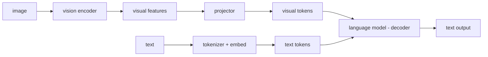

# Vision-Language Models (VLMs / Multimodal LLMs)

Assumes the foundations and the LLM chapter. A VLM is an LLM that can also *see*. The recurring question in every VLM paper is the same: **how do pixels get turned into something the language model can attend to, and how/when do the two modalities fuse?** Answer that for a given model and you understand its architecture.

---

## 1. The canonical VLM, in one picture

Four components:
1. **Vision encoder** — pixels → visual feature vectors (§2).
2. **Projector / connector** — map visual features into the LLM's embedding space (§3).
3. **Language model** — the decoder LLM from the LLM chapter, now attending over text *and* visual tokens (§4 covers *how* they fuse).
4. **Training recipe** — multi-stage, mostly about *alignment* then *instruction following* (§5).

Most "LLaVA-style" VLMs (the dominant pattern) are exactly this: a frozen-ish vision encoder + a small trained projector + a pretrained LLM. The art is in the encoder choice, the projector design, the data, and how many visual tokens you spend.

---

## 2. Vision encoders — pixels to vectors

### ViT — the backbone of (almost) all of them
The **Vision Transformer (ViT)** is the transformer (from the foundations) applied to images:
- Split the image into fixed **patches** (e.g. 16×16 px). Each patch is flattened and linearly projected to a vector — patches are the "tokens" of vision.
- Add positional embeddings (2D), prepend a learnable `[CLS]` token (a global summary slot).
- Run through `L` standard transformer layers (self-attention + FFN).
- Output: `N` patch tokens (+ the CLS token), each a `d`-dim vector. A 224×224 image at patch 16 → 14×14 = **196 visual tokens**.

Patch count drives both *spatial resolution of understanding* and *token budget* (cost). This tension — more patches = finer vision but more tokens for the LLM to process = quadratic cost — is central to VLM efficiency.

### How the encoder is *pretrained* (this determines its features)
- **CLIP (contrastive):** train an image encoder and a text encoder jointly so that matching image–text pairs have high cosine similarity and mismatched pairs low, via the **InfoNCE/contrastive loss** over a huge batch (~400M web pairs). Result: a vision encoder whose features are *already aligned to language* — which is why CLIP-style encoders are the default for VLMs.
- **SigLIP / SigLIP 2:** replaces CLIP's softmax-over-the-batch contrastive loss with a **sigmoid** loss (pairwise, no global normalization) — more efficient, scales to bigger effective batches, better features. **SigLIP 2** added multilingual + dense features and is *the* encoder of choice for many 2025 VLMs (Qwen3-VL, Gemma 3).
- **DINO / DINOv2 (self-supervised):** learn visual features *without* text, via self-distillation. Strong at spatial/dense/geometric structure (segmentation, depth) where CLIP is weaker. Used when fine-grained spatial understanding matters.
- **InternViT:** scaled vision encoders (up to 6B params) for high-end VLMs.
- **Multi-encoder (e.g. Cambrian-1):** combine several encoders (CLIP + DINO + ...) because each captures different things. More tokens/compute, richer perception.

Reading takeaway: the encoder's *pretraining objective* tells you what it's good at — CLIP/SigLIP = language-aligned semantics; DINO = spatial/geometric structure. A document/OCR-heavy VLM cares a lot about resolution and spatial fidelity, so encoder + resolution strategy matter more than for a captioning model.

### Resolution handling (a big practical axis)
Fixed low resolution (e.g. 224/336) loses small text and detail. Strategies:
- **AnyRes / tiling:** split a high-res image into tiles, encode each, concatenate tokens (LLaVA-NeXT, InternVL). Handles big/odd-aspect images at the cost of many tokens.
- **Native/dynamic resolution:** process the image at (near) its native resolution and aspect ratio, producing a variable number of tokens (Qwen2-VL's NaViT-style packing). Better for documents/charts.
- **Token compression** (§3) to keep the count manageable.

---

## 3. The projector / connector — bridging vision into the LLM

The vision encoder outputs features in *its* space; the LLM expects vectors in *its* embedding space. The projector maps between them. This is small but consequential, and the main design choices are:

- **Linear / MLP projector (LLaVA):** a 1–2 layer MLP maps each visual feature to an LLM-dimension "visual token." Simplest, surprisingly strong, now the most common. **Keeps every patch as a token** → token budget = patch count.
- **Q-Former (BLIP-2):** a small transformer with a *fixed set of learned query tokens* that **cross-attend** to the visual features and extract a *fixed, small* number of visual tokens (e.g. 32) regardless of image size. Compresses aggressively; more complex to train; still used where token efficiency is paramount.
- **Perceiver Resampler (Flamingo):** similar idea — a fixed set of latent queries resamples variable visual features to a fixed token count via cross-attention.
- **Pixel-shuffle / pooling / convolutional compressors:** downsample patch tokens spatially (e.g. merge 2×2 patches into one token) to cut the count 4× before the LLM (InternVL, Qwen-VL variants).

The core tradeoff the projector mediates: **number of visual tokens** (cost, since the LLM is `O(n²)` in total tokens) vs **information preserved** (detail, OCR, spatial precision). "We reduce visual tokens from 576 to 144 with X% quality retention" is a whole genre of paper.

---

## 4. Fusion — *how* vision and language interact (the key taxonomy)

This is the dimension that organizes the entire VLM landscape. Four families:

1. **Dual-encoder / late fusion (CLIP, ALIGN):** separate image and text encoders, interact *only* at the very end via a similarity score. Great for retrieval/zero-shot classification; **not generative** (can't write a paragraph about an image). These are *components* (often the vision encoder) more than full VLMs.

2. **Deep/cross-attention fusion (Flamingo, Llama 3.2 Vision):** insert **cross-attention** layers into the LLM so text tokens attend to visual features at multiple depths, while the LLM's self-attention stays text-only. Keeps the LLM's text weights largely intact (good for not degrading language ability); adds parameters; visual info enters at many layers.

3. **Prefix / decoder-only fusion (LLaVA, Qwen-VL, InternVL — the dominant pattern):** project visual features into "visual tokens" and **concatenate them with text tokens into one sequence** fed to a standard decoder LLM. The LLM's normal self-attention does the fusion — image and text tokens attend to each other in the same stack. Simple, leverages the full LLM, easy to scale. This is the "adapted-LLM" architecture and what most modern open VLMs are.

4. **Early-fusion / native multimodal (Chameleon, Emu3, Gemma 3n, Llama 4, GPT-4o-style):** there is **no separate vision encoder bolted on** — images are turned into discrete or continuous tokens (§5) and the model is trained from the start on interleaved image+text token streams in a *single* transformer. "Treat everything as tokens." Can natively *generate* images too. Trains the whole thing jointly; the 2025–2026 frontier direction. (Proprietary frontier models — GPT-5, Gemini 2.5/3, Claude — don't disclose their vision stacks, but are believed to be natively multimodal.)

The endpoint of this trajectory is now concrete: **encoder-free VLMs**. **Gemma 4 12B** (Jun 2026) drops the ViT entirely — raw 48×48 pixel patches go through a **35M-parameter linear projection** straight into the LLM, replacing a 27-layer vision encoder, and the whole thing fits in ~7GB at 4-bit. The lesson: the heavy contrastively-pretrained encoder was a *bootstrapping crutch* (it imported visual knowledge the LLM didn't have); with enough joint multimodal training, the transformer learns the visual features itself. When a 2026 paper says "encoder-free" or "pixels-to-LLM," this is the design.

Mental model to carry: **late fusion (CLIP) → cross-attention fusion (Flamingo) → prefix fusion (LLaVA) → early/native fusion (Chameleon/Emu3) → encoder-free (Gemma 4)** is a spectrum from "barely interact" to "one unified model from the ground up." When you read a VLM paper, locating it on this spectrum is 80% of understanding its architecture.

---

## 5. Visual tokenization & training

### Continuous vs discrete visual tokens
- **Continuous (most VLMs):** visual tokens are real-valued vectors (encoder output → projector). They go straight into the LLM as soft embeddings. Can't be *generated* by a normal LM head (which outputs over a discrete vocab).
- **Discrete (VQ-based):** a **VQ-VAE / VQGAN** quantizes image patches into codebook indices — discrete "image tokens" added to the vocabulary. Now image and text live in *one discrete vocabulary*, so the model can *generate* images by predicting image tokens (Chameleon, Emu3 with SBER-MoVQGAN, with special `[SOI]/[EOI]`-type separators). This is what enables unified any-to-any models.

### The standard (LLaVA-style) training recipe
1. **Stage 1 — alignment / pretraining:** freeze the vision encoder *and* the LLM; train **only the projector** on large image–caption data. Cheap; just learns to map visual features into the LLM's space.
2. **Stage 2 — instruction tuning:** unfreeze the LLM (and sometimes the encoder, or do it gradually), train on multimodal instruction data (VQA, OCR, charts, grounding, multi-image, reasoning). This is what makes it a useful multimodal *assistant*.
3. **(Optional) Stage 3 — preference/RL:** DPO/RLHF/RLVR (the post-training methods from the LLM chapter) on multimodal preferences or verifiable visual tasks (e.g. math-with-diagrams), and to reduce hallucination.

Variations: which components are frozen when, how much/what data per stage, resolution curriculum. **Gradual unfreezing** is common to avoid wrecking the pretrained encoder/LLM.

### Data — the real lever (same lesson as the LLM chapter)
Caption data for alignment; rich instruction data (VQA, document QA, charts, tables, grounding boxes, multi-image, video frames) for stage 2. **Synthetic visual data is heavily used but has a sharp failure mode for document/structured VLMs: synthetic renders lack the geometric and spatial distortions of real captures (perspective, lens, lighting, crinkle, scan artifacts), so models trained on clean synthetic data fail to transfer to production photos.** Physically-faithful augmentation or real data is needed where spatial fidelity matters.

---

## 6. Specifics that come up constantly

- **Position encoding for 2D/video:** images are 2D, video is 3D (space+time). Variants of RoPE (from the foundations) — 2D/axial RoPE, **M-RoPE (Qwen-VL)** — encode multi-axis position. A frequent source of bugs in mobile/edge conversion (the "MRoPE split" issue) because the export must correctly partition rotary dims across axes.
- **Hallucination:** VLMs confidently describe objects/text not in the image (object hallucination), driven by language priors overriding weak visual grounding. Measured by POPE, CHAIR; mitigated with better grounding data, DPO (on-policy DPO on the model's own hallucinations is the current best mitigation), higher resolution.
- **Grounding / referring:** outputting bounding boxes or pointing ("where is the cat") — done by emitting coordinate tokens. Needs grounding training data.
- **Video:** sample frames → encode each → (heavy) token compression because frames × patches explodes the token count. Temporal modeling is the open hard part.
- **OCR / document understanding:** a distinct, demanding sub-area. Needs high resolution (small text), strong spatial features (layout, tables, multi-column), and often structured output (DocTags, markdown, JSON, key-value extraction). Encoder resolution strategy and spatial fidelity dominate quality here far more than in natural-image tasks. Output heads/formats (e.g. structured doc markup) are a real design choice.

---

## 7. Reading-a-VLM-paper checklist

- **Vision encoder:** which one (CLIP/SigLIP/DINO/InternViT/multi), what resolution strategy (fixed / AnyRes-tiling / native-dynamic)?
- **Projector:** MLP / Q-Former / Perceiver / pixel-shuffle? **How many visual tokens** per image, and what compression?
- **Fusion type:** late / cross-attention / prefix-concat / early-native? (Place it on the spectrum.)
- **Visual tokens:** continuous or discrete (VQ)? Can it *generate* images?
- **Training:** which stages, what's frozen when, data mix, synthetic-vs-real, any preference/RL stage?
- **What modality/task is it actually optimized for** (captioning vs document/OCR vs video vs grounding vs unified generation)? — this reframes which design choices are load-bearing.
- **The one-sentence contribution and its cost** (usually tokens-vs-quality or quality-vs-generality).

---

## You can now

- Trace the four-stage VLM pipeline — vision encoder → projector → decoder LLM → training recipe — and explain what each stage contributes.
- Choose a vision encoder from its pretraining objective: CLIP/SigLIP for language-aligned semantics, DINOv2 for spatial/geometric structure, and say why document/OCR work weights resolution and spatial fidelity so heavily.
- Place any VLM on the fusion spectrum — late (CLIP) → cross-attention (Flamingo) → prefix-concat (LLaVA) → early/native (Chameleon) → encoder-free (Gemma 4) — which is most of understanding its architecture.
- Reason about the projector's core tradeoff — visual-token count (cost) vs information preserved — and pick MLP vs Q-Former vs pixel-shuffle for a token budget.
- Explain the LLaVA-style train-the-projector-then-instruction-tune recipe, and why synthetic document data fails to transfer without physically-faithful spatial distortions.

## Try it

Take two VLMs with published details from different points on the fusion spectrum — for example Llama 3.2 Vision (cross-attention fusion) and Qwen2-VL or a LLaVA-family model (prefix-concat, native/dynamic resolution) — and fill in the §7 reading checklist for each side by side: vision encoder and resolution strategy, projector type and visual-token count, fusion family, continuous-vs-discrete tokens, training stages and what is frozen when. Then write one sentence per model naming what task it is optimized for and the tradeoff that choice paid. The contrast makes the design axes concrete in a way reading one model alone does not.
