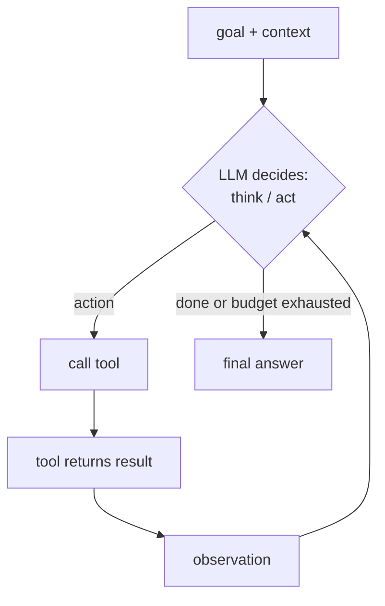

# Agentic Systems

An **agent** is an LLM placed in a **loop** where it can take actions (call tools), observe the results, and decide what to do next, in pursuit of a goal — rather than producing one answer and stopping. Builds on the LLM chapter (the model), the RAG chapter (retrieval is the most common tool), and the inference chapter (serving agents is its own challenge). The defining shift from a chatbot: the model **drives a control loop**, not just emits text.

---

## 1. The agent loop — the one essential idea

Strip away the frameworks and every agent is this loop:

The LLM is the **policy/brain**; the loop and tools are the **scaffolding**. Each turn, the model sees the accumulated history (goal, prior thoughts, actions, observations) and outputs either the next action or a final answer. This is the "the model is a function; the loop is the program calling it" framing made literal.

Four capabilities define an agent (the standard taxonomy): **reasoning/planning, tool use, memory, and (optionally) multi-agent coordination.** §3–6.

---

## 2. ReAct — the foundational pattern

**ReAct (Reason + Act)** interleaves **Thought → Action → Observation** steps:
- *Thought:* the model reasons about what to do ("I need the current price, I'll search").
- *Action:* it emits a tool call.
- *Observation:* the tool result is fed back.
- Repeat; the reasoning is grounded in real observations rather than hallucinated.

This is the substrate of most agents. The reasoning step lets the model *adapt* to tool outputs (handle errors, change plans) instead of blindly executing. Nearly every agent framework is a ReAct variant with extra structure.

---

## 3. Tool use / function calling — how the model acts on the world

Tools turn a text generator into something that can *do* things (search, run code, query DBs, call APIs, control a browser, send email).

- **Function calling:** the model is given tool **schemas** (name, description, JSON parameter spec). When it wants to use one, it emits a **structured call** (tool name + JSON args). The runtime executes it and returns the result as a new observation. The model was post-trained (SFT/RL) to produce these calls reliably; **constrained/structured decoding** (from the decoding material in the LLM chapter) guarantees the JSON is valid.
- **What makes tools work well:** clear descriptions (the model picks tools by their descriptions), good error messages fed back as observations (so the model can recover), and a manageable number of tools (too many → wrong-tool errors; mitigated by **tool retrieval** — retrieve the relevant subset of tools per step, exactly like RAG over a tool catalog).
- **MCP (Model Context Protocol):** an open standard for exposing tools/data/resources to models in a uniform way, so any MCP-compatible client can use any MCP server. It's the "USB-C for tools" — decouples tool providers from agent builders. Now *the* standard plumbing: donated to the **Linux Foundation** (Nov 2025) with OpenAI co-stewardship, 10k+ deployed servers.
- **A2A (Agent2Agent, Google Apr 2025):** the complement to MCP one level up — MCP connects an agent to *tools*; A2A connects agents to *each other* (discovery via "agent cards," task delegation, long-running coordination). 150+ partner companies; IBM's ACP merged into it under the Linux Foundation. When you see "multi-agent interoperability," this is the protocol layer being discussed.
- **Code as action (CodeAct):** instead of one JSON call per step, the agent writes and executes *code* that orchestrates multiple tools/logic in one action. More expressive for complex tasks; what coding agents do.

Reading takeaway: "tool use" papers are about *reliability* (does it call the right tool with right args, recover from failures) and *scale* (handling huge tool sets). The mechanism (schema → structured call → observation) is stable.

---

## 4. Planning — decomposing and sequencing

Hard tasks need structure beyond step-by-step reaction:

- **Planning without feedback (plan-then-execute):** generate a full plan upfront, then execute it. Includes **Chain-of-Thought** (linear reasoning), **decomposition** (break into sub-tasks), **Tree-of-Thoughts** (explore a tree of reasoning branches, backtrack), **Graph-of-Thoughts**. Efficient but brittle if the world differs from the plan.
- **Planning with feedback (interleaved):** plan, act, observe, **replan**. ReAct, **Reflexion** (the agent verbally critiques its own failed attempt and retries with that lesson in context — "verbal RL" without weight updates), **LATS** (combine tree search + reasoning + acting). Robust but more expensive.
- **Plan-and-execute frameworks** explicitly separate a *planner* (makes the multi-step plan) from an *executor* (carries out steps), often with a *critic/replanner*. The Planner/Executor/Critic decomposition is a common, effective structure.

The tradeoff: upfront planning is cheap but fragile; feedback-driven planning is robust but costs more tokens/latency. Long-horizon planning (many steps) is where even SOTA models still degrade badly — a known open weakness.

---

## 5. Memory — beyond the context window

The LLM is stateless (as established in the LLM chapter); memory is engineered on top. The standard split:

- **Short-term / working memory:** the context window itself — the current task's history. Bounded; the central scarce resource (§7).
- **Long-term memory:** persisted across sessions, retrieved when relevant. Implementations:
  - **Vector memory** (RAG over past interactions): embed and store experiences/facts, retrieve by similarity. The common approach.
  - **Structured / graph memory:** entities and relations in a knowledge graph ("second brain"), often with tiered/token-efficient lookup.
  - **Episodic vs semantic vs procedural:** episodic = specific past events; semantic = distilled facts; procedural = learned skills/workflows.
- **Memory management:** the hard part is *what to write, when to summarize/consolidate, what to forget, and how to retrieve*. **Reflection** (periodically summarize raw experiences into higher-level insights) is a recurring technique. Recent work (ReasoningBank, A-MEM, Memory-R1, Mem0) treats memory curation as a learned/RL problem. **Self-evolving agents** accumulate reusable lessons in memory across tasks.

Distinguish: **RAG** retrieves from an external *knowledge* corpus; **agent memory** retrieves from the agent's own *experience*. Same retrieval machinery, different content and lifecycle.

---

## 6. Multi-agent systems

Multiple specialized agents collaborating, instead of one generalist:

- **Patterns:** role-based teams (planner, coder, critic, tester — MetaGPT, ChatDev, Claude Code's subagents), **orchestrator-worker** (a lead agent decomposes and dispatches to workers, then synthesizes), debate (agents argue to refine answers), pipelines.
- **Why:** specialization (focused prompts/tools per role), **context isolation** (each subagent has its own clean context window — a major practical benefit for long tasks), and parallelism.
- **Costs:** coordination overhead, error propagation between agents, token cost (often many× a single agent), and harder debugging. Multi-agent isn't automatically better — for many tasks a single well-engineered agent wins. The honest framing: use multi-agent when the task genuinely decomposes into parallelizable or cleanly-separable sub-tasks.

---

## 7. Context engineering — the skill that replaced "prompt engineering"

The dominant practical lever for agents in 2025–2026. The context window is finite *and* models degrade as it fills (lost-in-the-middle, from the long-context material; distraction; cost). **Context engineering = curating exactly what's in the context at each step** so the model has what it needs and nothing that hurts. The techniques:

- **Context compression / summarization:** when history grows, summarize older turns (ACON, ReSum) rather than carry raw transcript.
- **Selective context / retrieval:** pull only the relevant tools, memories, files, and prior steps into context each turn (RAG over the agent's own state).
- **Context offloading:** keep big artifacts *outside* context (files, scratchpads, a knowledge store) and bring in references/handles, not full contents.
- **Structured context:** clear sections (goal, plan, observations, scratchpad), often with stable prefixes for **prefix caching** (from the inference chapter) to cut cost.
- **Sub-agent context isolation** (§6): give each subtask a fresh window.
- **Self-evolving / agentic context:** the agent edits its own working context (Sculptor, "agentic context engineering").

This is where a lot of real agent performance comes from — not a cleverer model, but a better-curated context. Treat "what's in the window right now, and why" as the primary design object.

---

## 8. Evaluation & reliability — the hard part

Agents are far harder to evaluate than single responses because errors compound over a trajectory and the action space is open.

- **Benchmarks:** task-completion suites — SWE-bench / SWE-bench Verified (real GitHub issues, the headline coding-agent benchmark), WebArena / GAIA (web/tool tasks), AgentBench, τ-bench (tool-agent-user interaction), PlanBench (planning). Long-horizon, verifiable-constraint benchmarks are emerging because models still fail there.
- **What to measure:** end-to-end success rate, but also *steps to completion, tool-call accuracy, recovery from errors, cost per task,* and *trajectory quality* (was the reasoning sound or lucky?).
- **LLM-as-judge** for trajectory/quality scoring (with its known biases — position, verbosity, self-preference).
- **The reliability problem:** a 95%-per-step success rate compounds to ~60% over 10 steps. Long-horizon reliability — not raw capability — is the binding constraint on real deployments. This is *the* central open problem in agents right now.

### 8.1 Agentic RL — turn-level credit assignment

Training agents with RL hits a problem RLVR on single answers doesn't have: the reward arrives at the *end* of a 10–100+ turn trajectory, and episode-level reward is nearly uninformative about *which turn* helped or hurt. "Credit assignment" in an agent paper means exactly this, and it's now a major research axis (~47 methods published 2024–early 2026):

- **Monte-Carlo / token-level value estimation:** estimate per-step values by rollouts from intermediate states — accurate but expensive.
- **Shapley-style decomposition:** treat turns as players, attribute the final reward by marginal contribution.
- **Tree-search turn optimization (AT2PO):** branch at turn boundaries, compare siblings to get per-turn signal.
- **Implicit step rewards:** derive per-turn signal from outcome labels only (the PRIME idea from the post-training material lifted to the turn level) — no step annotation needed.
- **Frameworks:** **Agent Lightning** decouples the agent's execution from RL training so any existing agent loop can be trained without rewriting it.

Reading takeaway: when an agent-training paper's contribution is a new reward scheme, ask *at what granularity does the learning signal land — episode, turn, or token?* That single question organizes the whole literature.

---

## 9. Failure modes to always look for

- **Compounding errors** over long trajectories (the reliability problem above).
- **Context rot / distraction:** performance degrading as the window fills with stale or irrelevant content.
- **Hallucinated tool calls / wrong args**, and failure to recover from tool errors.
- **Looping:** repeating the same failed action; needs loop detection / step budgets.
- **Reward hacking** (in RL-trained agents) — gaming the metric instead of the goal.
- **Over/under-planning:** thrashing on a rigid plan vs never committing to one.
- **Cost/latency blowup:** unbounded tool calls and context growth.

---

## 10. Reading-an-agent-paper checklist

- **What's the loop?** ReAct? Plan-execute? Tree search? Multi-agent orchestration?
- **Which of the four capabilities does it advance** — reasoning/planning, tool use, memory, or coordination?
- **Where does the improvement actually come from** — a better base model, a better *training* signal (RL for agents, turn-level credit assignment, as in the post-training material), or better *scaffolding* (context engineering, memory, tools)? Scaffolding vs model-capability is the key attribution.
- **Long-horizon reliability:** how many steps, and how does success degrade with horizon? (Most gains evaporate here.)
- **Cost:** tokens/tool-calls/latency per task — is the win worth the overhead vs a simpler agent?
- **Eval honesty:** real task-completion on a credible benchmark, or a cherry-picked demo? Trajectory quality or just final-answer luck?
- **The one-sentence contribution and its cost.**

---

## You can now

- Reduce any agent framework to the core loop — the LLM as policy, the loop and tools as scaffolding — and recognise ReAct's Thought → Action → Observation as its substrate.
- Wire up tool use / function calling (schema → structured call → observation), explain how constrained decoding guarantees valid tool JSON, and place MCP (agent↔tools) vs A2A (agent↔agent) in the protocol stack.
- Choose a planning strategy against the robustness-vs-cost tradeoff — plan-then-execute vs interleaved replanning (ReAct, Reflexion, LATS) — and design a memory system distinguishing short-term context from long-term vector/graph/episodic stores.
- Decide when multi-agent orchestration earns its coordination overhead, and apply context engineering (compression, offloading, retrieval, isolation) as the primary performance lever.
- Attribute an agent paper's gains to base model vs training signal vs scaffolding, and reason about long-horizon reliability — why 95%-per-step compounds to ~60% over 10 steps.

## Try it

Build a two-tool ReAct agent (say a web search and a calculator, or a file reader and a code runner) and instrument it: log every Thought, Action, Observation, the step count, and the token cost per task. Run it on ten multi-step questions and hand-label each trajectory for where it succeeded, looped, hallucinated a tool call, or failed to recover from a tool error. Then compute per-step success rate and confirm for yourself how it compounds over the horizon. You will see directly why §8's reliability problem — not raw model capability — is the binding constraint on real agents, and where in the loop your budget and loop-detection guards need to go.
